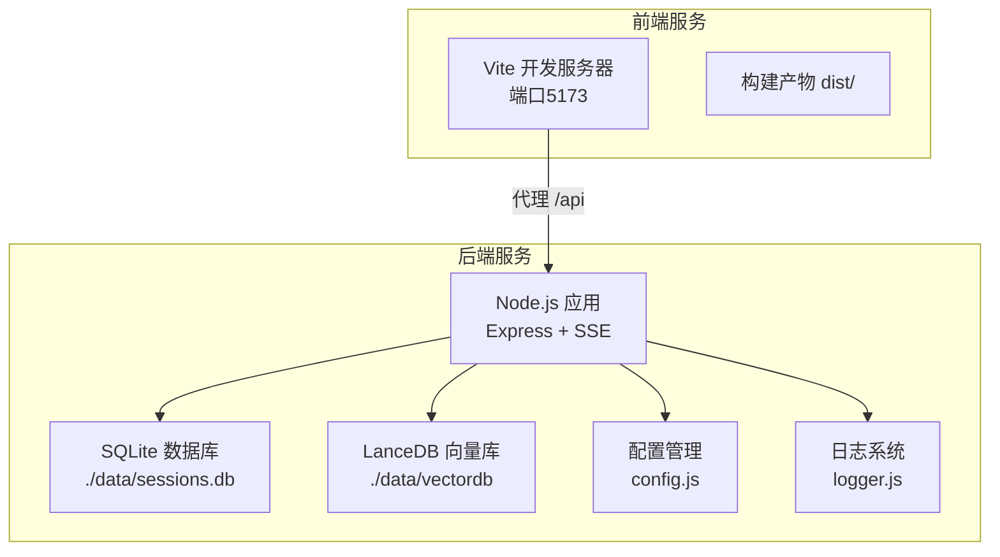
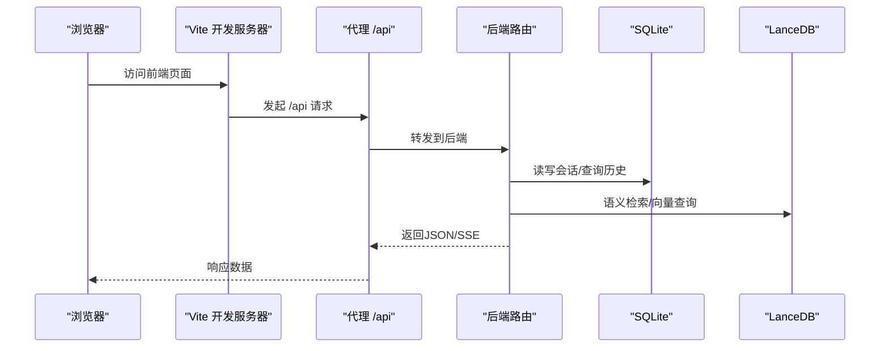
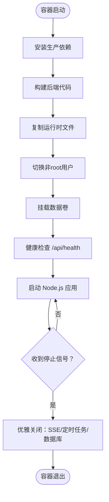
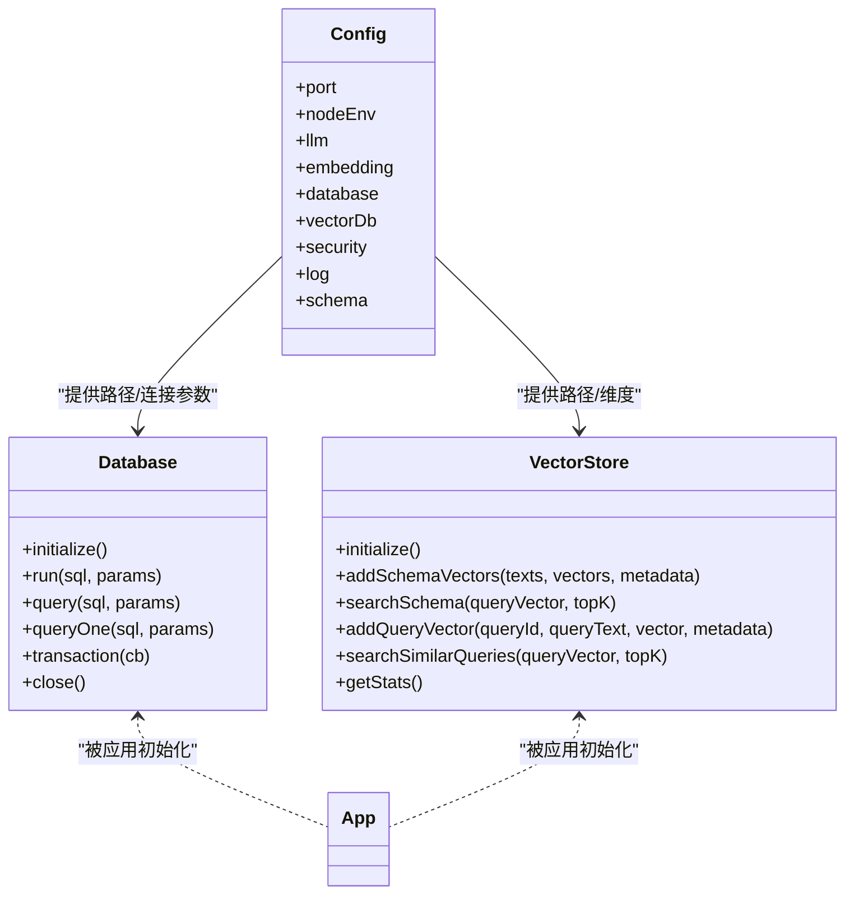
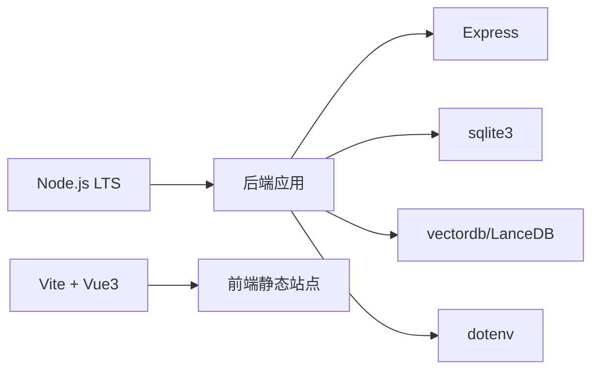

# Docker容器化部署

<cite>
**本文档引用的文件**
- [backend/package.json](file://backend/package.json)
- [frontend/package.json](file://frontend/package.json)
- [backend/src/app.js](file://backend/src/app.js)
- [backend/src/core/config.js](file://backend/src/core/config.js)
- [backend/src/core/database.js](file://backend/src/core/database.js)
- [backend/src/memory/vectorStore.js](file://backend/src/memory/vectorStore.js)
- [backend/src/utils/logger.js](file://backend/src/utils/logger.js)
- [backend/src/core/routes.js](file://backend/src/core/routes.js)
- [frontend/vite.config.js](file://frontend/vite.config.js)
</cite>

## 目录
1. [简介](#简介)
2. [项目结构](#项目结构)
3. [核心组件](#核心组件)
4. [架构总览](#架构总览)
5. [详细组件分析](#详细组件分析)
6. [依赖关系分析](#依赖关系分析)
7. [性能考虑](#性能考虑)
8. [故障排查指南](#故障排查指南)
9. [结论](#结论)
10. [附录](#附录)

## 简介
本方案为NL2SQL项目提供完整的Docker容器化部署蓝图，涵盖后端服务、前端静态站点、SQLite数据库与LanceDB向量数据库的容器化与编排。方案重点包括：
- Dockerfile多阶段构建优化与镜像体积控制
- Docker Compose编排前后端、数据库与向量存储
- 容器网络与端口映射策略
- 数据卷挂载与持久化方案
- 健康检查与重启策略
- 安全加固（非root用户、只读文件系统等）
- 监控与日志收集
- 更新与回滚流程

## 项目结构
NL2SQL采用前后端分离架构：
- 后端：基于Node.js + Express，提供REST API与SSE流，集成SQLite与LanceDB
- 前端：基于Vue3 + Vite，开发时通过代理访问后端API，构建产物输出至dist目录

**图表来源**
- [backend/src/app.js:1-238](file://backend/src/app.js#L1-L238)
- [backend/src/core/config.js:1-332](file://backend/src/core/config.js#L1-L332)
- [backend/src/core/database.js:1-850](file://backend/src/core/database.js#L1-L850)
- [backend/src/memory/vectorStore.js:1-442](file://backend/src/memory/vectorStore.js#L1-L442)
- [frontend/vite.config.js:1-93](file://frontend/vite.config.js#L1-L93)

**章节来源**
- [backend/src/app.js:1-238](file://backend/src/app.js#L1-L238)
- [frontend/vite.config.js:1-93](file://frontend/vite.config.js#L1-L93)

## 核心组件
- 后端应用：负责启动HTTP服务器、SSE流、加载配置、初始化数据库与向量库、挂载路由
- 配置模块：集中管理端口、LLM API、数据库、向量库、安全策略、日志、Schema等配置
- 数据库模块：SQLite表结构初始化、迁移、事务与查询封装
- 向量存储模块：LanceDB连接、Schema与查询历史向量表初始化与检索
- 日志模块：统一日志输出、文件轮转与事件发布
- 前端Vite：开发代理与构建配置

**章节来源**
- [backend/src/app.js:97-166](file://backend/src/app.js#L97-L166)
- [backend/src/core/config.js:16-332](file://backend/src/core/config.js#L16-L332)
- [backend/src/core/database.js:200-261](file://backend/src/core/database.js#L200-L261)
- [backend/src/memory/vectorStore.js:55-85](file://backend/src/memory/vectorStore.js#L55-L85)
- [backend/src/utils/logger.js:51-318](file://backend/src/utils/logger.js#L51-L318)
- [frontend/vite.config.js:17-57](file://frontend/vite.config.js#L17-L57)

## 架构总览
后端服务通过Express提供REST API与SSE流，前端通过Vite开发服务器代理访问后端。数据持久化由SQLite与LanceDB完成，日志输出到文件并支持轮转。

**图表来源**
- [backend/src/core/routes.js:1-800](file://backend/src/core/routes.js#L1-L800)
- [backend/src/core/database.js:361-424](file://backend/src/core/database.js#L361-L424)
- [backend/src/memory/vectorStore.js:201-307](file://backend/src/memory/vectorStore.js#L201-L307)
- [frontend/vite.config.js:24-34](file://frontend/vite.config.js#L24-L34)

## 详细组件分析

### 后端服务容器化设计
- 基础镜像选择：官方Node.js LTS镜像，确保二进制兼容与安全补丁
- 多阶段构建：
  - 构建阶段：安装生产依赖，构建后端代码
  - 运行阶段：仅复制运行时必需文件，减少镜像体积
- 用户与权限：
  - 使用非root用户运行，降低攻击面
  - 文件系统挂载为只读（除数据卷），仅开放必要端口
- 健康检查：通过GET /api/health与详细健康接口验证数据库、LLM、Schema、SSE连接状态
- 优雅停机：监听SIGTERM/SIGINT，关闭HTTP服务器、SSE、定时任务与数据库连接

**图表来源**
- [backend/src/app.js:176-230](file://backend/src/app.js#L176-L230)
- [backend/src/core/routes.js:70-135](file://backend/src/core/routes.js#L70-L135)

**章节来源**
- [backend/src/app.js:176-230](file://backend/src/app.js#L176-L230)
- [backend/src/core/routes.js:70-135](file://backend/src/core/routes.js#L70-L135)

### 配置与环境变量
- 端口：默认3000，可通过环境变量PORT覆盖
- 运行环境：NODE_ENV支持development/production
- LLM配置：API基础URL、密钥、模型、超时、重试
- 数据库：SQLite路径、SR数据库URL与连接池
- 向量库：LanceDB存储路径
- 安全策略：允许访问的表白名单、Dry-run、最大返回行数、查询超时、禁止关键字、敏感字段脱敏
- 日志：级别、文件路径、控制台/文件输出、轮转大小与文件数
- Schema：配置文件路径、缓存开关、重新向量化开关
- 长期记忆：开关、是否使用LLM、阈值与保留策略

**章节来源**
- [backend/src/core/config.js:26-332](file://backend/src/core/config.js#L26-L332)

### 数据库与向量存储
- SQLite：
  - 初始化表结构与索引，启用外键约束
  - 支持迁移修复旧表结构
  - 提供事务、查询、运行与批量操作封装
- LanceDB：
  - 连接数据库目录，初始化schema_vectors与query_vectors表
  - 支持向量添加、相似度搜索、统计信息查询
  - 初始化失败不影响应用启动，记录警告

**图表来源**
- [backend/src/core/config.js:97-130](file://backend/src/core/config.js#L97-L130)
- [backend/src/core/database.js:200-261](file://backend/src/core/database.js#L200-L261)
- [backend/src/memory/vectorStore.js:55-85](file://backend/src/memory/vectorStore.js#L55-L85)

**章节来源**
- [backend/src/core/database.js:200-445](file://backend/src/core/database.js#L200-L445)
- [backend/src/memory/vectorStore.js:55-442](file://backend/src/memory/vectorStore.js#L55-L442)

### 前端容器化与静态站点
- 开发模式：Vite开发服务器，端口5173，代理/api到后端
- 生产模式：构建dist目录，使用Nginx或静态Web服务器提供静态文件
- 代理配置：开发时通过proxy将/api转发至后端服务

**章节来源**
- [frontend/vite.config.js:18-35](file://frontend/vite.config.js#L18-L35)

## 依赖关系分析
- 后端依赖Node.js运行时与生产依赖（Express、vectordb、sqlite3、dotenv、cors、body-parser、uuid、dayjs、node-cron）
- 前端依赖Vue3、路由、状态管理、UI库、图表库等
- Docker构建需区分开发与生产依赖，仅在运行阶段保留必要文件

**图表来源**
- [backend/package.json:10-26](file://backend/package.json#L10-L26)
- [frontend/package.json:11-29](file://frontend/package.json#L11-L29)

**章节来源**
- [backend/package.json:10-26](file://backend/package.json#L10-L26)
- [frontend/package.json:11-29](file://frontend/package.json#L11-L29)

## 性能考虑
- 多阶段构建减少镜像体积，缩短拉取时间
- 后端端口默认3000，建议在生产环境使用反向代理（如Nginx）统一入口与TLS终止
- SQLite适合中小规模数据，若并发较高可评估外部数据库
- LanceDB向量表按需初始化，避免不必要的I/O
- 日志轮转避免磁盘膨胀，合理设置日志级别

## 故障排查指南
- 健康检查失败：
  - 检查后端端口与容器网络连通性
  - 查看日志文件与容器标准输出
- 数据库初始化失败：
  - 确认数据卷挂载权限与路径
  - 检查SQLite文件权限与磁盘空间
- 向量库未初始化：
  - 确认vectordb依赖可用与目录权限
  - 查看向量库初始化警告日志
- 前端无法访问后端：
  - 检查Vite代理配置与后端CORS设置
  - 确认容器间网络与端口映射

**章节来源**
- [backend/src/core/routes.js:70-135](file://backend/src/core/routes.js#L70-L135)
- [backend/src/utils/logger.js:187-204](file://backend/src/utils/logger.js#L187-L204)
- [backend/src/core/database.js:200-261](file://backend/src/core/database.js#L200-L261)
- [backend/src/memory/vectorStore.js:62-84](file://backend/src/memory/vectorStore.js#L62-L84)
- [frontend/vite.config.js:24-34](file://frontend/vite.config.js#L24-L34)

## 结论
本方案提供了NL2SQL项目的端到端容器化蓝图，涵盖构建、编排、网络、持久化、安全、监控与运维更新流程。通过多阶段构建与最小化运行时镜像，结合健康检查与优雅停机，可实现稳定可靠的生产部署。

## 附录

### Dockerfile编写指南（后端）
- 基础镜像：选择Node.js 18+ LTS
- 多阶段构建：
  - 构建阶段：COPY package*.json，RUN npm ci --only=production，COPY src/，RUN npm run build（如需）
  - 运行阶段：COPY --from=build /app/dist ./dist（如需），仅复制运行时所需文件
- 用户与权限：ADD app-user && chown -R app-user:app-user /app，USER app-user
- 工作目录与入口：WORKDIR /app，ENTRYPOINT ["node", "src/app.js"]
- 健康检查：HEALTHCHECK --interval=30s --timeout=3s --start-period=5s CMD curl -f http://localhost:PORT/api/health || exit 1

### Dockerfile编写指南（前端）
- 基础镜像：Nginx或静态Web服务器
- 构建：在CI中运行npm run build，产出dist/
- 部署：COPY dist/ /usr/share/nginx/html，配置nginx.conf代理/api到后端

### Docker Compose编排
- 服务：
  - backend：映射端口3000，挂载./backend/data与./backend/logs
  - frontend：映射端口80或443，挂载./frontend/dist（生产）
  - 数据库：可选MySQL/PostgreSQL服务（如需外部SR数据库）
  - 向量存储：通过卷挂载./backend/data/vectordb
- 网络：自定义bridge网络，backend与frontend在同一网络
- 健康检查：backend使用HTTP健康检查
- 重启策略：unless-stopped

### 容器网络与端口映射
- 后端：默认3000，生产环境建议通过反向代理暴露
- 前端：开发5173，生产80/443
- 代理：前端代理/api到后端3000

### 数据卷挂载方案
- 后端数据卷：
  - ./backend/data：SQLite数据库文件与LanceDB目录
  - ./backend/logs：应用日志文件
- 前端数据卷：生产环境挂载./frontend/dist

### 健康检查与重启策略
- 健康检查：/api/health与/detail
- 重启策略：unless-stopped，避免意外重启

### 安全加固
- 非root用户运行
- 只读文件系统（除数据卷）
- 限制网络访问，仅开放必要端口
- 环境变量加密与密钥管理

### 监控与日志
- 日志轮转：按大小轮转，保留多个历史文件
- 健康检查：定期探测后端状态
- 建议：集成Prometheus/Grafana或ELK收集日志

### 更新与回滚
- 更新：构建新镜像，滚动更新或蓝绿部署
- 回滚：恢复上一镜像版本，必要时回滚数据卷