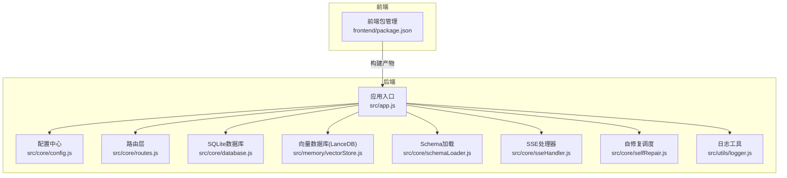
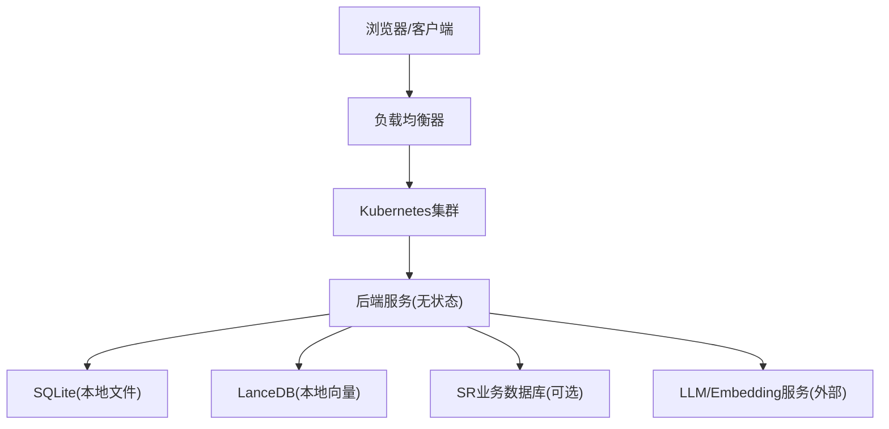
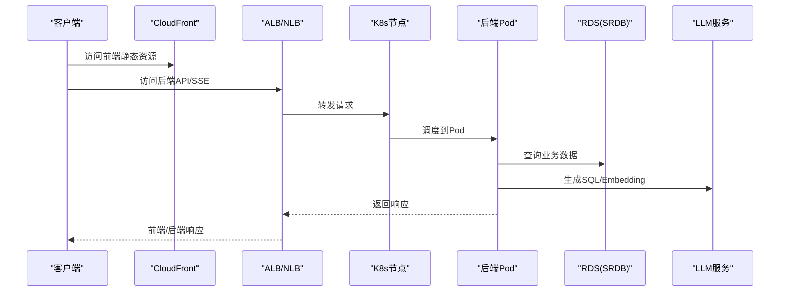
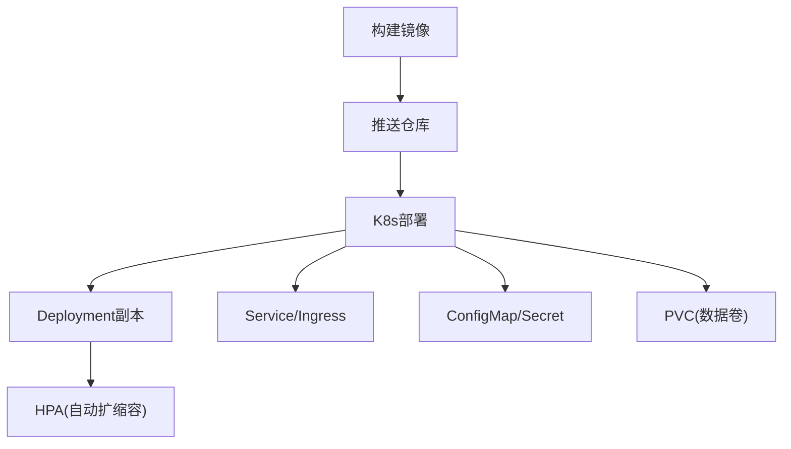
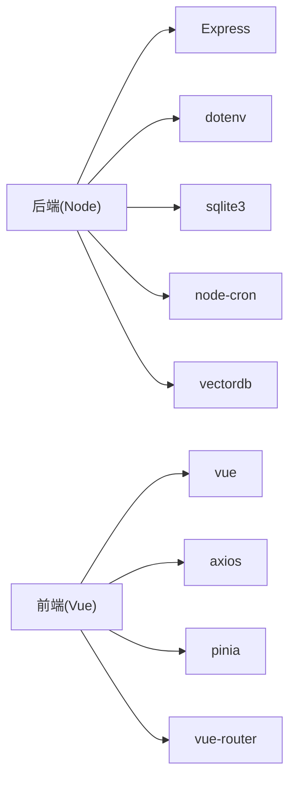

# 云平台部署

<cite>
**本文引用的文件**   
- [backend/package.json](file://backend/package.json)
- [backend/src/app.js](file://backend/src/app.js)
- [backend/src/core/config.js](file://backend/src/core/config.js)
- [backend/src/core/database.js](file://backend/src/core/database.js)
- [backend/src/core/routes.js](file://backend/src/core/routes.js)
- [backend/src/core/schemaLoader.js](file://backend/src/core/schemaLoader.js)
- [backend/src/core/selfRepair.js](file://backend/src/core/selfRepair.js)
- [backend/src/core/sseHandler.js](file://backend/src/core/sseHandler.js)
- [backend/src/memory/vectorStore.js](file://backend/src/memory/vectorStore.js)
- [backend/src/utils/logger.js](file://backend/src/utils/logger.js)
- [backend/config/schema-metadata.example.json](file://backend/config/schema-metadata.example.json)
- [frontend/package.json](file://frontend/package.json)
</cite>

## 目录
1. [简介](#简介)
2. [项目结构](#项目结构)
3. [核心组件](#核心组件)
4. [架构总览](#架构总览)
5. [详细组件分析](#详细组件分析)
6. [依赖分析](#依赖分析)
7. [性能考虑](#性能考虑)
8. [故障排查指南](#故障排查指南)
9. [结论](#结论)
10. [附录](#附录)

## 简介
本指南面向NL2SQL项目的云平台部署，覆盖以下目标：
- AWS、Azure、Google Cloud Platform三类主流云的基础设施与托管服务部署策略
- 容器化与Kubernetes集群部署方案
- 负载均衡与自动扩缩容配置思路
- SSL证书申请与HTTPS配置
- 成本优化与资源监控
- 故障转移与灾备方案

本项目后端基于Node.js + Express，提供REST API与SSE流式输出；前端为Vue应用。后端依赖SQLite（本地文件）、LanceDB（本地向量数据库）以及外部SR数据库（可配置）。项目对LLM API与Embedding服务有外部依赖。

## 项目结构
后端采用模块化设计，核心模块包括配置、数据库、路由、Schema加载、向量存储、SSE处理与自修复机制；前端为独立的Vue工程，构建产物静态托管。

图表来源
- [backend/src/app.js:1-238](file://backend/src/app.js#L1-L238)
- [backend/src/core/config.js:1-332](file://backend/src/core/config.js#L1-L332)
- [backend/src/core/database.js:1-850](file://backend/src/core/database.js#L1-L850)
- [backend/src/core/routes.js:1-895](file://backend/src/core/routes.js#L1-L895)
- [backend/src/memory/vectorStore.js:1-442](file://backend/src/memory/vectorStore.js#L1-L442)
- [backend/src/core/schemaLoader.js:1-732](file://backend/src/core/schemaLoader.js#L1-L732)
- [backend/src/core/sseHandler.js:1-349](file://backend/src/core/sseHandler.js#L1-L349)
- [backend/src/core/selfRepair.js:1-489](file://backend/src/core/selfRepair.js#L1-L489)
- [backend/src/utils/logger.js:1-318](file://backend/src/utils/logger.js#L1-L318)
- [frontend/package.json:1-36](file://frontend/package.json#L1-L36)

章节来源
- [backend/src/app.js:1-238](file://backend/src/app.js#L1-L238)
- [backend/src/core/config.js:1-332](file://backend/src/core/config.js#L1-L332)
- [frontend/package.json:1-36](file://frontend/package.json#L1-L36)

## 核心组件
- 应用入口与生命周期：负责加载环境变量、初始化数据库与向量库、挂载路由、启动HTTP与SSE、优雅关闭。
- 配置中心：集中管理端口、LLM/Embedding、数据库、安全、日志、Schema、长期记忆等配置，并在启动时校验必要项。
- 路由层：提供健康检查、Schema查询、会话与消息管理、查询历史、统计信息、配置导出等REST接口。
- 数据层：SQLite用于会话、消息、查询历史、系统日志与用户偏好；SR数据库为业务查询源（可配置URL与连接池）。
- 向量存储：LanceDB用于Schema与查询历史的向量化与语义检索。
- SSE处理：管理SSE连接、进度回调与结果推送。
- 自修复：定时任务执行每日健康检查、会话清理、统计收集与长期记忆维护。
- 日志：统一日志输出与文件轮转。

章节来源
- [backend/src/app.js:1-238](file://backend/src/app.js#L1-L238)
- [backend/src/core/config.js:1-332](file://backend/src/core/config.js#L1-L332)
- [backend/src/core/database.js:1-850](file://backend/src/core/database.js#L1-L850)
- [backend/src/core/routes.js:1-895](file://backend/src/core/routes.js#L1-L895)
- [backend/src/memory/vectorStore.js:1-442](file://backend/src/memory/vectorStore.js#L1-L442)
- [backend/src/core/sseHandler.js:1-349](file://backend/src/core/sseHandler.js#L1-L349)
- [backend/src/core/selfRepair.js:1-489](file://backend/src/core/selfRepair.js#L1-L489)
- [backend/src/utils/logger.js:1-318](file://backend/src/utils/logger.js#L1-L318)

## 架构总览
NL2SQL后端为无状态服务，前端静态资源可独立部署。后端依赖外部LLM/Embedding服务与SR数据库，同时维护本地SQLite与LanceDB数据。

图表来源
- [backend/src/app.js:147-158](file://backend/src/app.js#L147-L158)
- [backend/src/core/config.js:97-130](file://backend/src/core/config.js#L97-L130)
- [backend/src/core/config.js:106-109](file://backend/src/core/config.js#L106-L109)
- [backend/src/core/config.js:60-87](file://backend/src/core/config.js#L60-L87)

## 详细组件分析

### AWS 部署方案
- EC2实例配置
  - 运行环境：Node.js >= 18（见后端依赖）
  - 安全组：开放应用端口（默认3000，可通过环境变量配置）、SSH访问
  - IAM：为EC2附加具备最低权限的策略（如访问特定S3桶或RDS凭据的凭证）
  - 文件系统：挂载EBS卷存放SQLite与LanceDB数据，或使用共享文件系统（如FSx）
- RDS数据库设置
  - 若SR数据库为MySQL/PostgreSQL，建议使用RDS主从复制与备份策略
  - 在后端配置SR_DATABASE_URL指向RDS连接串
- S3存储与CloudFront CDN
  - 前端构建产物上传至S3，CloudFront分发
  - 若后端需要文件上传/下载，可在S3配置预签名URL或使用CloudFront分发
- CloudWatch监控
  - 记录应用日志与指标，设置告警（CPU/内存/请求延迟/错误率）

图表来源
- [backend/src/core/config.js:115-129](file://backend/src/core/config.js#L115-L129)
- [backend/src/core/config.js:60-87](file://backend/src/core/config.js#L60-L87)

章节来源
- [backend/src/core/config.js:97-130](file://backend/src/core/config.js#L97-L130)
- [backend/src/core/config.js:60-87](file://backend/src/core/config.js#L60-L87)

### Azure 部署策略
- 虚拟机/VMSS
  - 使用Windows/Linux VM承载后端服务，配置安全组与托管磁盘
  - 建议使用VMSS实现自动扩缩容
- Azure SQL Database
  - SR数据库迁移至Azure SQL，启用高可用与备份
  - 在后端配置SR_DATABASE_URL
- Blob存储与CDN
  - 前端静态资源上传至Blob，CDN加速
- Azure Monitor
  - Application Insights采集日志与指标，设置告警

章节来源
- [backend/src/core/config.js:115-129](file://backend/src/core/config.js#L115-L129)

### Google Cloud Platform 部署步骤
- Compute Engine/Cloud Run
  - 使用Compute Engine部署VM或Cloud Run无服务器运行后端
- Cloud SQL
  - SR数据库迁移至Cloud SQL，启用主从与备份
  - 在后端配置SR_DATABASE_URL
- Cloud Storage与Cloud CDN
  - 前端构建产物上传至Cloud Storage，Cloud CDN分发
- Cloud Monitoring
  - 使用Cloud Monitoring与Alerting

章节来源
- [backend/src/core/config.js:115-129](file://backend/src/core/config.js#L115-L129)

### 容器化与Kubernetes部署
- Docker镜像
  - 基于Node.js官方镜像，复制后端代码与依赖，设置工作目录与启动命令
  - 启动命令参考后端脚本（开发/dev与生产/start）
- Kubernetes资源配置
  - Deployment：副本数、资源限制、探针（liveness/readiness）
  - Service：ClusterIP/LoadBalancer暴露服务
  - ConfigMap：注入环境变量（端口、LLM/Embedding配置、SR数据库URL、Schema路径等）
  - Secret：敏感信息（LLM密钥、数据库密码）
  - PersistentVolume/PVC：挂载SQLite/LanceDB数据目录
  - HPA：基于CPU/自定义指标实现自动扩缩容
  - Ingress/LoadBalancer：暴露HTTP与SSE（注意SSE在某些Ingress上的兼容性）
- 前端部署
  - 构建产物上传至对象存储（S3/Azure Blob/Cloud Storage），通过CDN分发

图表来源
- [backend/package.json:6-8](file://backend/package.json#L6-L8)
- [backend/src/app.js:147-158](file://backend/src/app.js#L147-L158)

章节来源
- [backend/package.json:1-28](file://backend/package.json#L1-L28)
- [backend/src/app.js:147-158](file://backend/src/app.js#L147-L158)

### 负载均衡与自动扩缩容
- 负载均衡
  - ALB/NLB（AWS）、Azure Load Balancer、GCLB（GCP）
  - HTTPS终止于LB，后端保持HTTP
- 自动扩缩容
  - HPA：基于CPU使用率或自定义指标（如每Pod请求量、队列长度）
  - VPA：动态调整内存/CPU请求/限制
- 灰度发布与蓝绿部署：结合Ingress规则与Service权重

章节来源
- [backend/src/core/selfRepair.js:127-159](file://backend/src/core/selfRepair.js#L127-L159)

### SSL证书与HTTPS配置
- 证书来源
  - AWS：ACM；Azure：Azure Web Apps托管证书或Key Vault；GCP：Managed CA或自管证书
- 配置方式
  - 在LB/Ingress上配置TLS监听与证书绑定
  - 强制HTTP重定向至HTTPS
- 证书续期：自动化流程（ACM/GCLB自动续期；Azure Key Vault轮换）

章节来源
- [backend/src/core/config.js:26](file://backend/src/core/config.js#L26)

### 成本优化与资源监控
- 成本优化
  - 计算：选择合适实例规格与预留/节省计划；无服务器优先（Cloud Run/Azure Container Instances）
  - 存储：冷热分层；对象存储生命周期策略；压缩与去重
  - 网络：CDN缓存命中率；跨区域复制与就近访问
- 资源监控
  - 指标：CPU/内存/网络/磁盘/请求延迟/错误率/并发连接数
  - 日志：Structured Logging（后端已内置），集中化收集（CloudWatch/Azure Monitor/GMP Logging）
  - 告警：阈值与趋势告警，结合SLA

章节来源
- [backend/src/utils/logger.js:1-318](file://backend/src/utils/logger.js#L1-L318)
- [backend/src/core/selfRepair.js:169-310](file://backend/src/core/selfRepair.js#L169-L310)

### 故障转移与灾备
- 数据库灾备
  - RDS/Cloud SQL/Azure SQL：启用多可用区、自动备份与跨区复制
  - SQLite/LanceDB：定期快照与异地备份（对象存储）
- 应用高可用
  - 多可用区部署；跨区冗余；健康检查与自动切换
- 灾难恢复
  - RTO/RPO目标；演练与自动化恢复脚本；回切流程

章节来源
- [backend/src/core/database.js:195-261](file://backend/src/core/database.js#L195-L261)
- [backend/src/memory/vectorStore.js:55-85](file://backend/src/memory/vectorStore.js#L55-L85)

## 依赖分析
- 后端依赖
  - Express、CORS、Body Parser、SQLite3、dotenv、uuid、dayjs、node-cron、vectordb
- 前端依赖
  - Vue、Element Plus、Axios、Pinia、Vue Router等
- 外部依赖
  - LLM API与Embedding服务（可配置Base URL与Key）
  - SR数据库（可配置URL与连接池）

图表来源
- [backend/package.json:10-26](file://backend/package.json#L10-L26)
- [frontend/package.json:11-29](file://frontend/package.json#L11-L29)

章节来源
- [backend/package.json:1-28](file://backend/package.json#L1-L28)
- [frontend/package.json:1-36](file://frontend/package.json#L1-L36)

## 性能考虑
- 连接池与超时
  - SR数据库连接池参数可调；请求超时与查询超时限制
- 向量检索
  - Embedding维度与批量处理；向量表索引与缓存
- SSE与并发
  - 连接数与消息推送频率；客户端断线重连
- 日志与监控
  - 日志级别与文件轮转；关键指标采样与聚合

章节来源
- [backend/src/core/config.js:115-130](file://backend/src/core/config.js#L115-L130)
- [backend/src/core/config.js:80-87](file://backend/src/core/config.js#L80-L87)
- [backend/src/core/sseHandler.js:218-280](file://backend/src/core/sseHandler.js#L218-L280)
- [backend/src/utils/logger.js:1-318](file://backend/src/utils/logger.js#L1-L318)

## 故障排查指南
- 启动失败
  - 检查必要配置项（LLM API Key、SR数据库URL）是否设置
  - 查看日志文件与控制台输出
- 数据库问题
  - SQLite文件权限与路径；LanceDB初始化状态
- LLM/Embedding异常
  - Base URL与Key；超时与重试配置
- SSE连接异常
  - 客户端会话ID有效性；LB/网关对SSE的支持

章节来源
- [backend/src/core/config.js:300-332](file://backend/src/core/config.js#L300-L332)
- [backend/src/core/database.js:195-261](file://backend/src/core/database.js#L195-L261)
- [backend/src/memory/vectorStore.js:55-85](file://backend/src/memory/vectorStore.js#L55-L85)
- [backend/src/core/sseHandler.js:43-112](file://backend/src/core/sseHandler.js#L43-L112)

## 结论
本指南提供了NL2SQL在三大云平台的部署蓝图，涵盖基础设施、容器化、负载均衡、自动扩缩容、SSL与HTTPS、成本优化与监控、以及灾备方案。建议优先采用Kubernetes与托管数据库服务，结合CDN与对象存储实现前后端分离部署，并通过完善的监控与告警体系保障线上稳定运行。

## 附录
- 环境变量清单（示例）
  - PORT、NODE_ENV
  - LLM_API_BASE、LLM_API_KEY、LLM_MODEL、LLM_TIMEOUT
  - EMBEDDING_MODEL、EMBEDDING_TIMEOUT
  - DB_PATH、VECTOR_DB_PATH
  - SR_DATABASE_URL（MySQL/PostgreSQL）
  - ALLOWED_TABLES、DRY_RUN、MAX_QUERY_ROWS、QUERY_TIMEOUT
  - LOG_LEVEL、LOG_FILE、SCHEMA_CONFIG_PATH、SCHEMA_REVECTORIZE
  - LTM_ENABLED、LTM_USE_LLM
- Schema元数据
  - 示例文件位于 backend/config/schema-metadata.example.json，按实际数据库结构调整

章节来源
- [backend/src/core/config.js:26](file://backend/src/core/config.js#L26)
- [backend/src/core/config.js:60-87](file://backend/src/core/config.js#L60-L87)
- [backend/src/core/config.js:97-130](file://backend/src/core/config.js#L97-L130)
- [backend/src/core/config.js:140-170](file://backend/src/core/config.js#L140-L170)
- [backend/src/core/config.js:195-208](file://backend/src/core/config.js#L195-L208)
- [backend/src/core/config.js:235-245](file://backend/src/core/config.js#L235-L245)
- [backend/src/core/config.js:254-288](file://backend/src/core/config.js#L254-L288)
- [backend/config/schema-metadata.example.json:1-328](file://backend/config/schema-metadata.example.json#L1-L328)