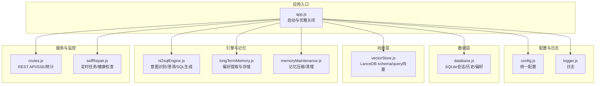
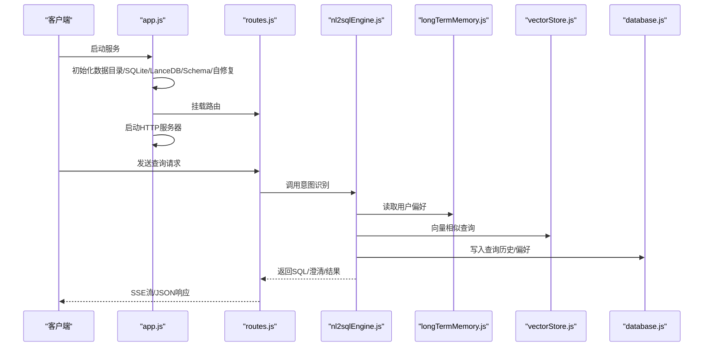
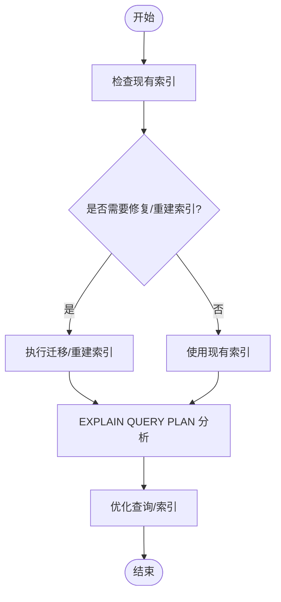
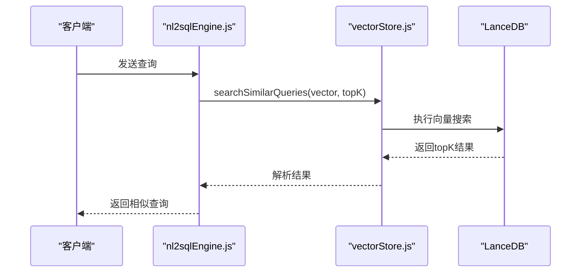
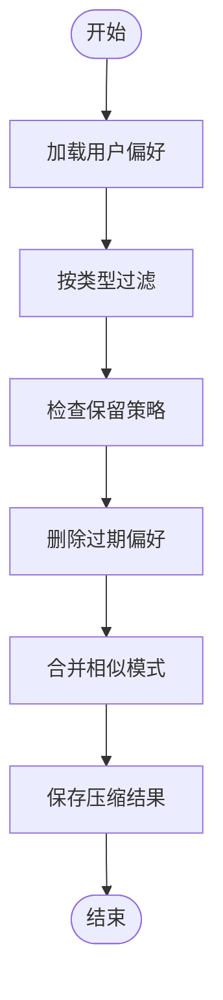
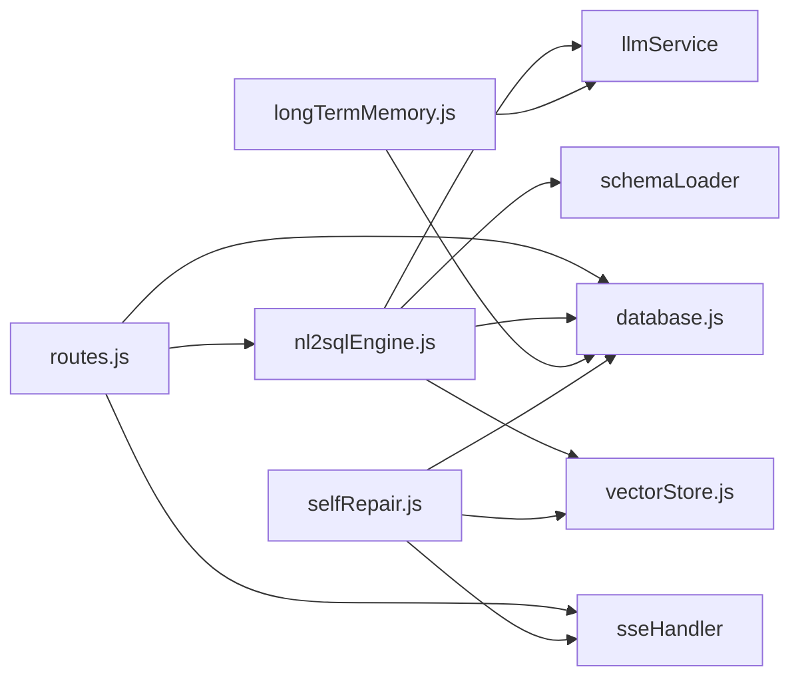

# 性能优化

<cite>
**本文引用的文件**
- [database.js](file://backend/src/core/database.js)
- [vectorStore.js](file://backend/src/memory/vectorStore.js)
- [config.js](file://backend/src/core/config.js)
- [app.js](file://backend/src/app.js)
- [routes.js](file://backend/src/core/routes.js)
- [logger.js](file://backend/src/utils/logger.js)
- [nl2sqlEngine.js](file://backend/src/core/nl2sqlEngine.js)
- [longTermMemory.js](file://backend/src/memory/longTermMemory.js)
- [memoryMaintenance.js](file://backend/src/memory/memoryMaintenance.js)
- [selfRepair.js](file://backend/src/core/selfRepair.js)
- [package.json](file://backend/package.json)
</cite>

## 目录
1. [简介](#简介)
2. [项目结构](#项目结构)
3. [核心组件](#核心组件)
4. [架构总览](#架构总览)
5. [详细组件分析](#详细组件分析)
6. [依赖分析](#依赖分析)
7. [性能考量](#性能考量)
8. [故障排查指南](#故障排查指南)
9. [结论](#结论)
10. [附录](#附录)

## 简介
本指南面向NL2SQL项目的性能优化，聚焦数据库、向量数据库、内存使用、缓存策略、并发处理、网络性能、监控与基准测试以及瓶颈识别与解决。文档基于仓库现有实现，结合代码结构与配置，提出可落地的优化建议与最佳实践。

## 项目结构
后端采用模块化设计，核心模块包括：
- 配置中心：集中管理LLM、嵌入、数据库、向量库、安全、会话、日志、自修复、Schema等配置
- 数据层：SQLite会话与查询历史持久化
- 向量层：LanceDB向量表（schema_vectors、query_vectors）
- 引擎层：NL2SQL核心引擎，意图识别、澄清、SQL生成与校验
- 长期记忆：用户偏好抽取、存储与维护
- 自修复：定时任务与健康检查
- 路由与服务：HTTP服务、SSE流、健康检查与统计接口

图表来源
- [app.js:97-166](file://backend/src/app.js#L97-L166)
- [config.js:16-332](file://backend/src/core/config.js#L16-L332)
- [database.js:1-850](file://backend/src/core/database.js#L1-L850)
- [vectorStore.js:1-442](file://backend/src/memory/vectorStore.js#L1-L442)
- [nl2sqlEngine.js:1-800](file://backend/src/core/nl2sqlEngine.js#L1-L800)
- [longTermMemory.js:1-800](file://backend/src/memory/longTermMemory.js#L1-L800)
- [memoryMaintenance.js:1-414](file://backend/src/memory/memoryMaintenance.js#L1-L414)
- [routes.js:1-895](file://backend/src/core/routes.js#L1-L895)
- [selfRepair.js:1-489](file://backend/src/core/selfRepair.js#L1-L489)

章节来源
- [app.js:97-166](file://backend/src/app.js#L97-L166)
- [config.js:16-332](file://backend/src/core/config.js#L16-L332)

## 核心组件
- SQLite数据库：会话、消息、查询历史、用户偏好、系统日志持久化，支持索引与迁移
- LanceDB向量库：schema_vectors与query_vectors两张表，支持向量搜索
- 配置中心：统一管理LLM、嵌入、数据库、向量库、安全、会话、日志、自修复、Schema等
- NL2SQL引擎：意图识别、澄清、SQL生成、校验与结果格式化
- 长期记忆：偏好抽取、存储、检索与维护（含分级保留策略）
- 自修复：定时任务（每日自检、会话清理、统计收集、记忆维护）、健康检查
- 路由与服务：REST API、SSE流、健康检查与统计接口

章节来源
- [database.js:39-189](file://backend/src/core/database.js#L39-L189)
- [vectorStore.js:55-85](file://backend/src/memory/vectorStore.js#L55-L85)
- [config.js:16-332](file://backend/src/core/config.js#L16-L332)
- [nl2sqlEngine.js:493-776](file://backend/src/core/nl2sqlEngine.js#L493-L776)
- [longTermMemory.js:311-484](file://backend/src/memory/longTermMemory.js#L311-L484)
- [selfRepair.js:60-125](file://backend/src/core/selfRepair.js#L60-L125)
- [routes.js:70-135](file://backend/src/core/routes.js#L70-L135)

## 架构总览
NL2SQL服务启动后，依次初始化数据目录、SQLite、LanceDB、Schema元数据、自修复调度器，然后启动HTTP服务器。请求通过路由进入，NL2SQL引擎结合长期记忆与向量检索进行意图识别与SQL生成，最终通过SSE流返回结果。

图表来源
- [app.js:97-166](file://backend/src/app.js#L97-L166)
- [routes.js:264-343](file://backend/src/core/routes.js#L264-L343)
- [nl2sqlEngine.js:493-776](file://backend/src/core/nl2sqlEngine.js#L493-L776)
- [longTermMemory.js:311-484](file://backend/src/memory/longTermMemory.js#L311-L484)
- [vectorStore.js:201-230](file://backend/src/memory/vectorStore.js#L201-L230)
- [database.js:458-540](file://backend/src/core/database.js#L458-L540)

## 详细组件分析

### 数据库性能优化（SQLite）
- 索引优化
  - sessions：user_id、status、updated_at
  - messages：session_id、created_at
  - query_history：user_id、session_id、created_at、status
  - user_preferences：user_id、preference_type、复合索引(user_id, preference_type)
  - system_logs：level、created_at
- 查询计划分析
  - 使用EXPLAIN QUERY PLAN（在SQLite中）分析复杂查询的执行路径，确保索引被有效利用
  - 避免SELECT *，仅选择必要列
  - 对频繁过滤字段（如status、user_id）建立合适索引
- 连接池配置
  - 当前实现使用sqlite3的单连接模式，适合轻量场景
  - 若需提升并发，可考虑引入连接池（如better-sqlite3的连接池封装或在应用层做连接复用）
- 事务与批量写入
  - 使用事务包裹批量写入，减少磁盘写入次数
  - 合理拆分大事务，避免长时间锁持有
- 迁移与结构修复
  - 自动迁移逻辑会移除旧的UNIQUE约束，避免重复索引带来的写入成本

图表来源
- [database.js:271-336](file://backend/src/core/database.js#L271-L336)
- [database.js:39-189](file://backend/src/core/database.js#L39-L189)

章节来源
- [database.js:39-189](file://backend/src/core/database.js#L39-L189)
- [database.js:271-336](file://backend/src/core/database.js#L271-L336)

### 向量数据库性能优化（LanceDB）
- 表结构与初始化
  - schema_vectors：存储Schema向量，用于语义检索
  - query_vectors：存储查询历史向量，用于相似查询检索
- 参数调优
  - 向量维度：由配置决定，需与Embedding模型一致
  - topK：搜索返回数量，平衡召回与性能
- 查询优化策略
  - 向量搜索前先进行用户偏好过滤（如按user_id）
  - 使用LIMIT限制返回数量，避免全表扫描
  - 对频繁查询的表建立合适的索引（LanceDB内部索引策略）
- 写入优化
  - 批量add向量，减少I/O开销
  - 避免频繁重建表，必要时采用覆盖写入策略

图表来源
- [nl2sqlEngine.js:584-614](file://backend/src/core/nl2sqlEngine.js#L584-L614)
- [vectorStore.js:281-307](file://backend/src/memory/vectorStore.js#L281-L307)

章节来源
- [vectorStore.js:55-85](file://backend/src/memory/vectorStore.js#L55-L85)
- [vectorStore.js:281-307](file://backend/src/memory/vectorStore.js#L281-L307)
- [config.js:80-87](file://backend/src/core/config.js#L80-L87)

### 内存使用优化（向量存储与长期记忆）
- 向量存储
  - 向量维度固定，内存占用与向量数量成正比
  - 建议定期清理无用向量，控制表规模
- 长期记忆
  - 分级保留策略：高频（≥10次）永久保留；中频（3-9次）90天未用清理；低频（<3次）30天未用清理；字段别名365天未用清理
  - 记忆压缩：定期压缩相似模式，合并冗余偏好
- 内存管理与GC
  - 避免在热路径上创建大量临时对象
  - 使用对象池或复用策略减少GC压力
  - 控制日志级别与日志量，避免日志写入成为瓶颈

图表来源
- [longTermMemory.js:311-484](file://backend/src/memory/longTermMemory.js#L311-L484)
- [memoryMaintenance.js:24-46](file://backend/src/memory/memoryMaintenance.js#L24-L46)

章节来源
- [longTermMemory.js:311-484](file://backend/src/memory/longTermMemory.js#L311-L484)
- [memoryMaintenance.js:24-46](file://backend/src/memory/memoryMaintenance.js#L24-L46)

### 缓存策略配置（Redis/内存缓存）
- Schema缓存
  - 配置项：schema.enableCache、schema.cacheExpireTime
  - 建议：启用缓存并设置合理过期时间，避免频繁读取Schema文件
- 向量搜索缓存
  - 建议：对热门查询的向量结果进行短期缓存，降低重复向量计算与搜索开销
- LLM嵌入缓存
  - 建议：对相同文本的Embedding结果进行缓存，避免重复调用LLM API
- 缓存一致性
  - 通过版本号或时间戳控制缓存失效，保证数据新鲜度

章节来源
- [config.js:235-245](file://backend/src/core/config.js#L235-L245)

### 并发处理优化（请求队列与线程池）
- 当前实现
  - Express单进程，无显式线程池
  - SSE连接通过自修复模块统计
- 优化建议
  - 使用PM2等进程管理器，启用cluster模式提升并发
  - 对CPU密集型任务（如向量计算）分离到子进程或使用worker_threads
  - 合理设置请求体大小（已配置为10MB），避免过大请求阻塞
  - 对长耗时操作（LLM调用、向量搜索）设置超时与重试

章节来源
- [app.js:63-73](file://backend/src/app.js#L63-L73)
- [routes.js:44-52](file://backend/src/core/routes.js#L44-L52)
- [config.js:68-74](file://backend/src/core/config.js#L68-L74)

### 网络性能优化（连接复用与超时）
- CORS与BodyParser
  - CORS允许跨域访问，BodyParser限制请求体大小
- 超时配置
  - LLM API超时：config.llm.timeout
  - Embedding超时：config.embedding.timeout
  - 查询超时：config.security.queryTimeout
- 连接复用
  - 建议：对上游LLM服务启用HTTP/2或连接池，减少握手开销
  - 对外部数据库（srDatabase）启用连接池（当前配置中已定义pool参数）

章节来源
- [app.js:63-73](file://backend/src/app.js#L63-L73)
- [config.js:68-74](file://backend/src/core/config.js#L68-L74)
- [config.js:119-130](file://backend/src/core/config.js#L119-L130)

### 性能监控指标与基准测试
- 监控指标
  - 健康检查：/api/health、/api/health/detail
  - 统计接口：/api/stats（今日查询统计、连接数、内存、节点版本）
  - 自修复：每日自检、慢查询阈值、内存使用率
- 基准测试
  - 建议：对NL2SQL引擎的关键路径（意图识别、向量搜索、SQL生成）进行基准测试
  - 使用压测工具（如Artillery、k6）模拟并发请求，观察P95/P99延迟与错误率
  - 对比不同配置（索引、topK、缓存策略）下的性能差异

章节来源
- [routes.js:70-135](file://backend/src/core/routes.js#L70-L135)
- [routes.js:724-771](file://backend/src/core/routes.js#L724-L771)
- [selfRepair.js:169-310](file://backend/src/core/selfRepair.js#L169-L310)

## 依赖分析
- 核心依赖
  - Express：HTTP服务
  - sqlite3：SQLite数据库
  - vectordb：LanceDB向量数据库
  - dotenv：环境变量加载
  - node-cron：定时任务
- 模块耦合
  - routes依赖engine、database、sseHandler
  - engine依赖llmService、schemaLoader、database、vectorStore
  - longTermMemory依赖database、llmService、config
  - selfRepair依赖database、vectorStore、sseHandler

图表来源
- [routes.js:16-27](file://backend/src/core/routes.js#L16-L27)
- [nl2sqlEngine.js:16-25](file://backend/src/core/nl2sqlEngine.js#L16-L25)
- [longTermMemory.js:17-20](file://backend/src/memory/longTermMemory.js#L17-L20)
- [selfRepair.js:15-26](file://backend/src/core/selfRepair.js#L15-L26)

章节来源
- [package.json:10-27](file://backend/package.json#L10-L27)

## 性能考量
- I/O瓶颈
  - SQLite写入：使用事务批量写入，避免频繁提交
  - LanceDB写入：批量add，控制表规模
- CPU瓶颈
  - 向量计算：尽量缓存Embedding，减少重复计算
  - 意图识别：合理设置LLM超时与重试
- 内存瓶颈
  - 长期记忆压缩与分级保留，控制偏好数量
  - 控制日志级别与日志量
- 网络瓶颈
  - LLM API超时与重试策略
  - 外部数据库连接池配置

## 故障排查指南
- 健康检查
  - /api/health：基础健康状态
  - /api/health/detail：组件状态（数据库、LLM、Schema、SSE连接数）
- 自修复
  - 每日自检：检查数据库、向量库、查询统计、连接数、系统资源
  - 慢查询阈值：config.selfRepair.slowQueryThreshold
- 日志
  - 统一日志输出，支持文件轮转与级别控制
  - 关键错误与异常均记录，便于定位问题

章节来源
- [routes.js:70-135](file://backend/src/core/routes.js#L70-L135)
- [selfRepair.js:169-310](file://backend/src/core/selfRepair.js#L169-L310)
- [logger.js:256-293](file://backend/src/utils/logger.js#L256-L293)

## 结论
本指南基于NL2SQL现有实现，提出了数据库索引与事务优化、LanceDB参数与查询优化、长期记忆与向量存储的内存管理、缓存策略、并发与网络优化、监控与基准测试以及瓶颈识别与解决方案。建议在生产环境中逐步实施这些优化，并结合自修复机制与健康检查持续监控系统表现。

## 附录
- 关键配置项
  - LLM：apiBase、apiKey、model、timeout、maxRetries、retryDelay
  - Embedding：model、dimension、timeout
  - 数据库：path
  - 向量库：path
  - SR数据源：url、pool(min/max/acquireTimeout/idleTimeout)
  - 安全：allowedTables、dryRun、maxQueryRows、queryTimeout、forbiddenKeywords、sensitiveFields
  - 会话：maxHistory、expireTime、cleanupInterval
  - 日志：level、file、console、fileOutput、maxSize、maxFiles
  - 自修复：enabled、dailyCheckCron、sessionCheckInterval、slowQueryThreshold
  - Schema：configPath、enableCache、cacheExpireTime、revectorize
  - 长期记忆：enabled、useLLMForExtraction、thresholds、retention

章节来源
- [config.js:60-288](file://backend/src/core/config.js#L60-L288)