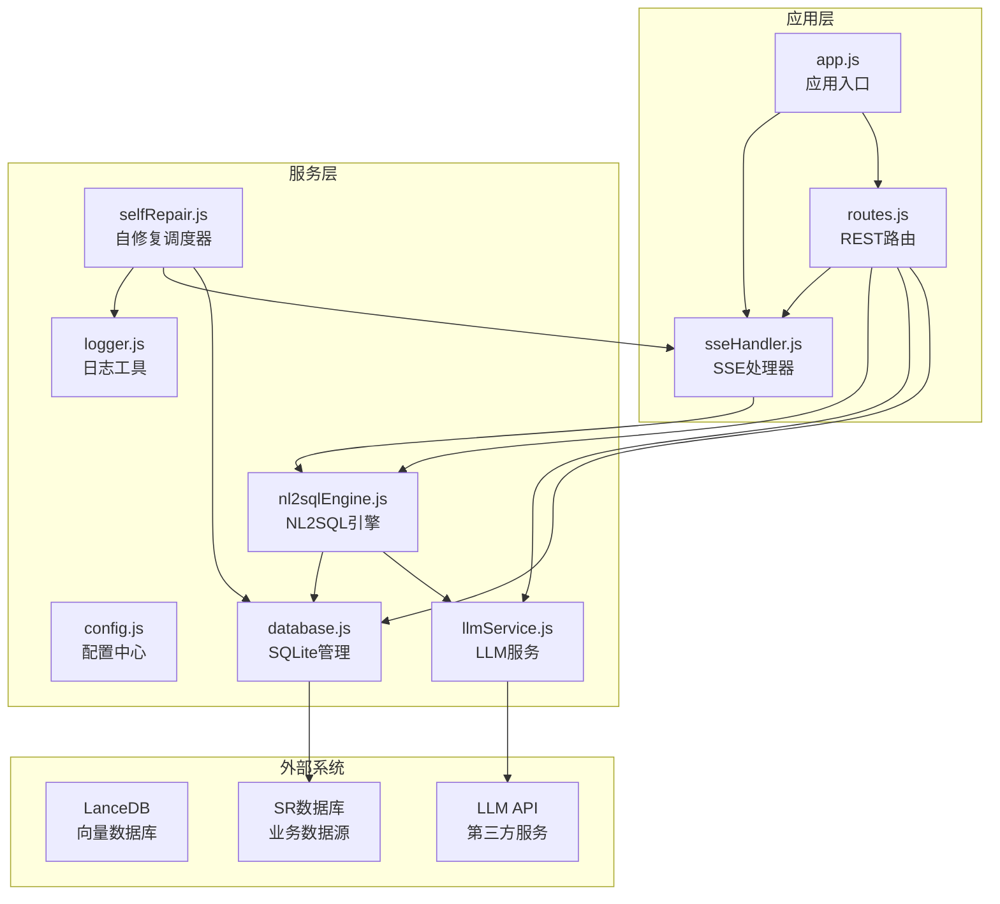
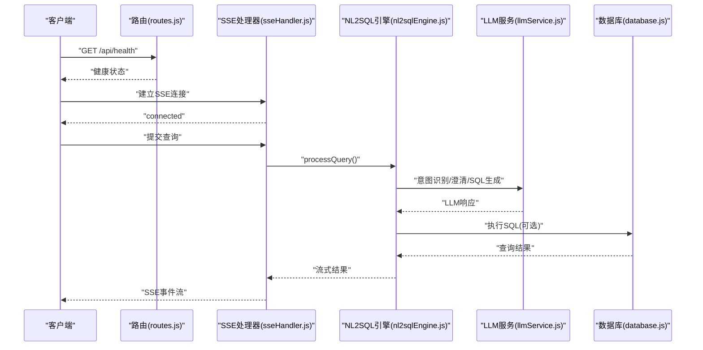
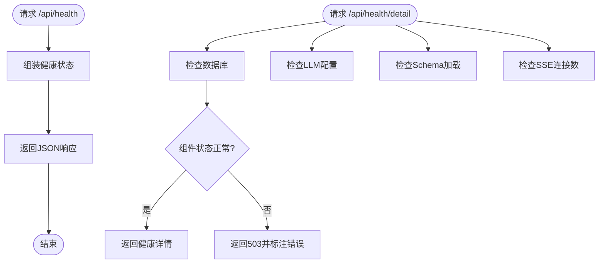
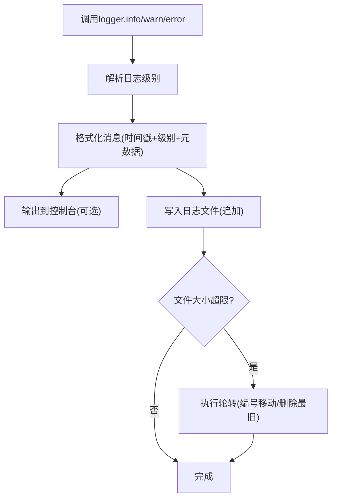
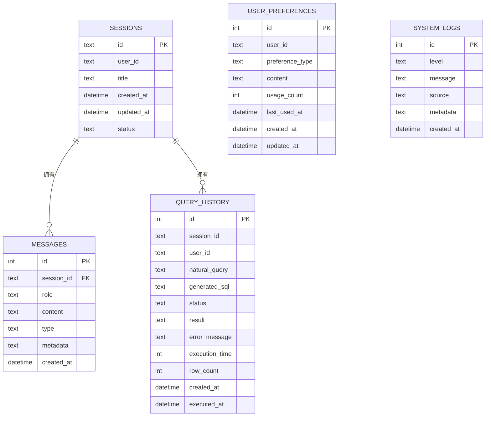
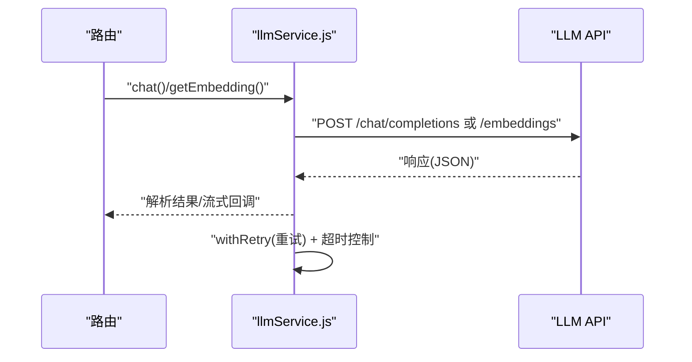
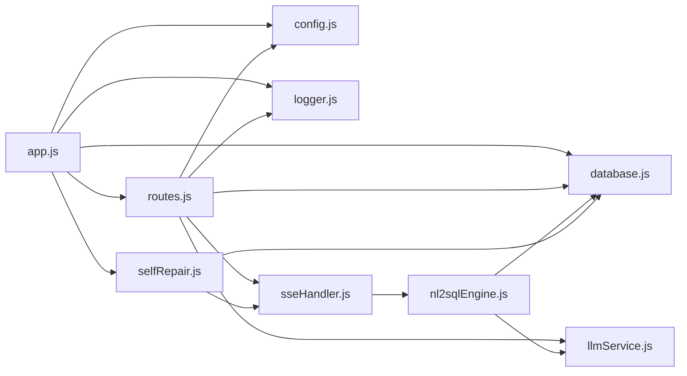

# 监控告警

<cite>
**本文引用的文件**
- [backend/src/app.js](file://backend/src/app.js)
- [backend/package.json](file://backend/package.json)
- [backend/src/utils/logger.js](file://backend/src/utils/logger.js)
- [backend/src/core/config.js](file://backend/src/core/config.js)
- [backend/src/core/database.js](file://backend/src/core/database.js)
- [backend/src/core/routes.js](file://backend/src/core/routes.js)
- [backend/src/core/llmService.js](file://backend/src/core/llmService.js)
- [backend/src/core/nl2sqlEngine.js](file://backend/src/core/nl2sqlEngine.js)
- [backend/src/core/sseHandler.js](file://backend/src/core/sseHandler.js)
- [backend/src/core/selfRepair.js](file://backend/src/core/selfRepair.js)
- [backend/config/schema-metadata.example.json](file://backend/config/schema-metadata.example.json)
</cite>

## 目录
1. [简介](#简介)
2. [项目结构](#项目结构)
3. [核心组件](#核心组件)
4. [架构总览](#架构总览)
5. [详细组件分析](#详细组件分析)
6. [依赖分析](#依赖分析)
7. [性能考虑](#性能考虑)
8. [故障排查指南](#故障排查指南)
9. [结论](#结论)
10. [附录](#附录)

## 简介
本指南面向NL2SQL项目的运维与开发团队，提供一套完整的监控告警配置方案，覆盖应用性能监控、日志采集与分析、数据库性能监控、LLM API使用量与成本控制、系统资源监控、告警规则与通知渠道、分布式追踪以及监控数据可视化与报表生成。文档基于现有代码库的实现现状，提出可落地的配置建议与最佳实践。

## 项目结构
NL2SQL后端采用Express框架，核心模块包括配置管理、日志工具、数据库与向量数据库、LLM服务、路由与SSE、自修复机制等。应用通过健康检查接口暴露运行状态，SSE用于流式结果推送，自修复机制负责定时任务与系统健康检查。

图表来源
- [backend/src/app.js:1-238](file://backend/src/app.js#L1-L238)
- [backend/src/core/routes.js:1-800](file://backend/src/core/routes.js#L1-L800)
- [backend/src/core/sseHandler.js:1-349](file://backend/src/core/sseHandler.js#L1-L349)
- [backend/src/core/config.js:1-332](file://backend/src/core/config.js#L1-L332)
- [backend/src/utils/logger.js:1-318](file://backend/src/utils/logger.js#L1-L318)
- [backend/src/core/database.js:1-850](file://backend/src/core/database.js#L1-L850)
- [backend/src/core/llmService.js:1-432](file://backend/src/core/llmService.js#L1-L432)
- [backend/src/core/nl2sqlEngine.js:1-800](file://backend/src/core/nl2sqlEngine.js#L1-L800)
- [backend/src/core/selfRepair.js:1-489](file://backend/src/core/selfRepair.js#L1-L489)

章节来源
- [backend/src/app.js:1-238](file://backend/src/app.js#L1-L238)
- [backend/src/core/routes.js:1-800](file://backend/src/core/routes.js#L1-L800)

## 核心组件
- 应用入口与生命周期：负责加载环境变量、初始化数据库与向量库、挂载路由、启动HTTP服务器与SSE、优雅关闭与未捕获异常处理。
- 配置中心：集中管理端口、环境、LLM/API、数据库、安全、日志、自修复、Schema与长期记忆等配置。
- 日志工具：统一输出到控制台与文件，支持结构化日志、级别过滤、文件轮转。
- 数据库与向量库：SQLite用于会话与查询历史，LanceDB用于向量检索；提供连接、事务、查询与迁移能力。
- LLM服务：封装HTTP请求、重试机制、超时控制、流式响应与错误处理。
- 路由与SSE：提供健康检查、Schema查询、会话与消息管理、统计信息、配置导出；SSE用于流式结果推送。
- 自修复机制：定时任务执行每日自检、会话清理、统计收集、记忆维护。

章节来源
- [backend/src/app.js:97-166](file://backend/src/app.js#L97-L166)
- [backend/src/core/config.js:16-332](file://backend/src/core/config.js#L16-L332)
- [backend/src/utils/logger.js:51-318](file://backend/src/utils/logger.js#L51-L318)
- [backend/src/core/database.js:200-850](file://backend/src/core/database.js#L200-L850)
- [backend/src/core/llmService.js:41-432](file://backend/src/core/llmService.js#L41-L432)
- [backend/src/core/routes.js:44-135](file://backend/src/core/routes.js#L44-L135)
- [backend/src/core/sseHandler.js:43-112](file://backend/src/core/sseHandler.js#L43-L112)
- [backend/src/core/selfRepair.js:60-125](file://backend/src/core/selfRepair.js#L60-L125)

## 架构总览
NL2SQL后端通过Express提供REST API与SSE流式推送，内部通过配置中心统一管理LLM与数据库参数，日志工具贯穿所有模块，自修复机制保障系统健康与资源清理。

图表来源
- [backend/src/core/routes.js:70-135](file://backend/src/core/routes.js#L70-L135)
- [backend/src/core/sseHandler.js:218-280](file://backend/src/core/sseHandler.js#L218-L280)
- [backend/src/core/nl2sqlEngine.js:493-776](file://backend/src/core/nl2sqlEngine.js#L493-L776)
- [backend/src/core/llmService.js:222-277](file://backend/src/core/llmService.js#L222-L277)
- [backend/src/core/database.js:361-424](file://backend/src/core/database.js#L361-L424)

## 详细组件分析

### 应用性能监控与健康检查
- 健康检查接口提供基础状态、版本、运行时长与内存占用；详细健康接口包含数据库、LLM、Schema与SSE连接状态。
- SSE连接数可用于评估并发会话规模；统计接口提供今日查询总量、成功率、失败率与平均执行时间。

图表来源
- [backend/src/core/routes.js:70-135](file://backend/src/core/routes.js#L70-L135)
- [backend/src/core/routes.js:720-771](file://backend/src/core/routes.js#L720-L771)

章节来源
- [backend/src/core/routes.js:70-135](file://backend/src/core/routes.js#L70-L135)
- [backend/src/core/routes.js:720-771](file://backend/src/core/routes.js#L720-L771)

### 日志收集与分析（结构化与文件轮转）
- 日志工具支持DEBUG/INFO/WARN/ERROR级别，控制台彩色输出与文件输出，结构化JSON元数据，文件轮转与大小限制。
- 建议：将日志输出到stdout/stderr以便容器日志采集；结合ELK/EFK栈进行聚合与检索；为不同模块设置独立source字段。

图表来源
- [backend/src/utils/logger.js:227-245](file://backend/src/utils/logger.js#L227-L245)
- [backend/src/utils/logger.js:128-160](file://backend/src/utils/logger.js#L128-L160)

章节来源
- [backend/src/utils/logger.js:51-318](file://backend/src/utils/logger.js#L51-L318)
- [backend/src/core/config.js:195-208](file://backend/src/core/config.js#L195-L208)

### 数据库性能监控（SQLite与SR数据库）
- SQLite：提供连接、事务、查询与迁移；查询历史表记录执行时间与行数，可用于慢查询分析与趋势统计。
- SR数据库：通过连接池配置（最小/最大连接数、获取超时、空闲超时）控制资源占用；建议结合业务数据库自带监控（如慢查询日志、连接数、锁等待）。

图表来源
- [backend/src/core/database.js:39-189](file://backend/src/core/database.js#L39-L189)

章节来源
- [backend/src/core/database.js:200-850](file://backend/src/core/database.js#L200-L850)
- [backend/src/core/config.js:97-130](file://backend/src/core/config.js#L97-L130)

### LLM API使用量监控与成本控制
- LLM服务封装HTTP请求、超时与重试；日志记录请求耗时；建议在网关或代理层统计调用次数、Token用量与错误率。
- 成本控制策略：设置合理超时与重试；对高成本模型使用降级策略；对Embedding与大模型请求进行队列与配额限制。

图表来源
- [backend/src/core/llmService.js:222-277](file://backend/src/core/llmService.js#L222-L277)
- [backend/src/core/llmService.js:324-379](file://backend/src/core/llmService.js#L324-L379)

章节来源
- [backend/src/core/llmService.js:41-432](file://backend/src/core/llmService.js#L41-L432)
- [backend/src/core/config.js:60-87](file://backend/src/core/config.js#L60-L87)

### 系统资源监控（CPU、内存、磁盘、网络）
- 进程内存使用与运行时长通过健康接口返回；自修复机制定期收集连接数与内存使用，用于健康评估。
- 建议：结合操作系统监控（CPU使用率、上下文切换、阻塞I/O）、磁盘IO与网络吞吐；容器场景下关注cgroups与资源限额。

章节来源
- [backend/src/core/routes.js:82-87](file://backend/src/core/routes.js#L82-L87)
- [backend/src/core/selfRepair.js:425-445](file://backend/src/core/selfRepair.js#L425-L445)

### 告警规则配置（阈值与通知渠道）
- 健康检查：/api/health返回状态码；/api/health/detail中任一组件status!=ok返回503。
- 查询健康：失败率>10%、平均执行时间>慢查询阈值触发告警。
- 资源健康：内存使用率>90%、SSE连接异常增长。
- 通知渠道：建议通过Webhook/邮件/IM集成（如Slack、钉钉）；结合Prometheus Alertmanager或云厂商告警平台。

章节来源
- [backend/src/core/routes.js:98-135](file://backend/src/core/routes.js#L98-L135)
- [backend/src/core/selfRepair.js:234-247](file://backend/src/core/selfRepair.js#L234-L247)
- [backend/src/core/selfRepair.js:280-284](file://backend/src/core/selfRepair.js#L280-L284)

### 分布式追踪（请求链路与性能分析）
- 建议：在路由层与SSE处理层埋点，记录traceId/parentId、阶段耗时（意图识别、SQL生成、执行、流式推送）。
- 工具：OpenTelemetry Node SDK或Jaeger/Zipkin；将SSE事件类型与进度回调纳入span标签。

[本节为概念性内容，不直接分析具体文件]

### 监控数据可视化与报表生成
- 健康面板：/api/health与/api/health/detail用于实时状态展示。
- 统计报表：/api/stats提供今日查询统计、连接数、Schema规模与系统信息。
- 建议：结合Grafana/数据看板，展示趋势图、热力图与告警仪表盘。

章节来源
- [backend/src/core/routes.js:720-771](file://backend/src/core/routes.js#L720-L771)

## 依赖分析
- Express应用入口依赖配置、日志、数据库、向量库、路由与自修复模块。
- 路由依赖日志、配置、数据库、SSE与LLM服务。
- LLM服务依赖配置与日志，封装HTTP请求与重试。
- 自修复依赖配置、日志、数据库、向量库与SSE。

图表来源
- [backend/src/app.js:39-50](file://backend/src/app.js#L39-L50)
- [backend/src/core/routes.js:16-27](file://backend/src/core/routes.js#L16-L27)
- [backend/src/core/sseHandler.js:15-20](file://backend/src/core/sseHandler.js#L15-L20)
- [backend/src/core/llmService.js:21-24](file://backend/src/core/llmService.js#L21-L24)
- [backend/src/core/selfRepair.js:15-26](file://backend/src/core/selfRepair.js#L15-L26)

章节来源
- [backend/src/app.js:39-50](file://backend/src/app.js#L39-L50)
- [backend/src/core/routes.js:16-27](file://backend/src/core/routes.js#L16-L27)

## 性能考虑
- LLM调用：设置合理超时与重试；对大模型请求适当延长超时；对Embedding请求进行批量与缓存。
- 数据库：使用连接池与事务；对慢查询（执行时间>阈值）报警并优化；定期清理过期会话。
- SSE：限制并发连接数，避免长连接风暴；对流式事件进行背压控制。
- 日志：生产环境降低日志级别，避免I/O瓶颈；启用文件轮转与压缩。

[本节为通用指导，不直接分析具体文件]

## 故障排查指南
- 未捕获异常与Promise拒绝：应用入口统一记录错误并优雅关闭，便于定位问题根因。
- 数据库连接失败：检查数据库初始化流程与迁移脚本；确认SQLite文件权限与路径。
- LLM API错误：检查API密钥、基础URL与超时设置；查看重试日志与响应解析失败信息。
- SSE连接异常：检查会话有效性、连接映射与错误回调；确认Nginx/代理无缓冲与长连接配置。

章节来源
- [backend/src/app.js:214-230](file://backend/src/app.js#L214-L230)
- [backend/src/core/database.js:200-261](file://backend/src/core/database.js#L200-L261)
- [backend/src/core/llmService.js:135-151](file://backend/src/core/llmService.js#L135-L151)
- [backend/src/core/sseHandler.js:104-153](file://backend/src/core/sseHandler.js#L104-L153)

## 结论
本指南基于NL2SQL现有代码结构，提出了覆盖应用、日志、数据库、LLM、系统资源与自修复的监控告警配置建议。建议尽快引入容器日志采集、APM与数据库监控，并完善告警规则与可视化面板，以提升系统稳定性与可观测性。

## 附录
- Schema元数据示例：用于理解数据结构与指标/维度定义，支撑NL2SQL引擎的意图识别与SQL生成。

章节来源
- [backend/config/schema-metadata.example.json:1-328](file://backend/config/schema-metadata.example.json#L1-L328)