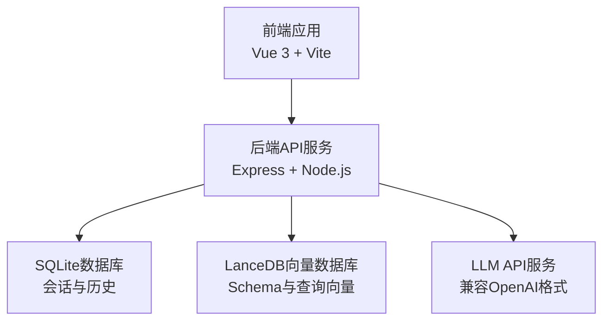
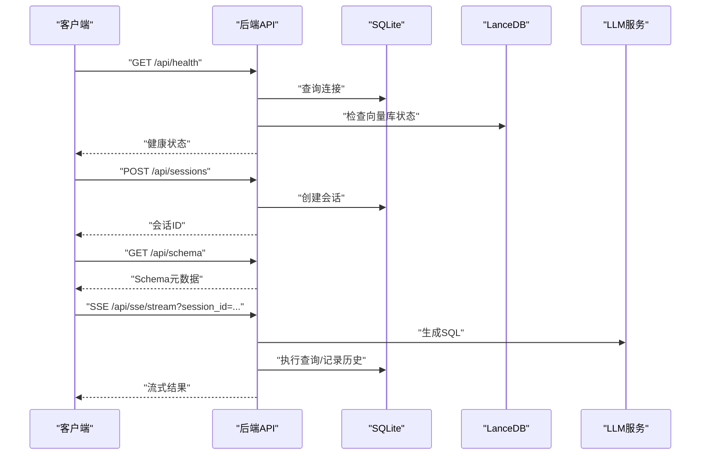
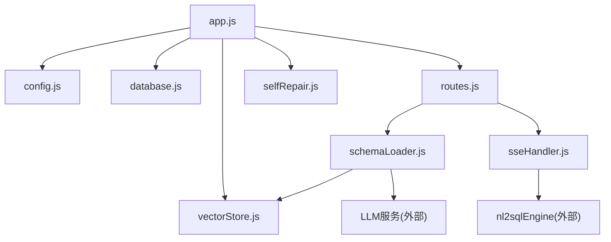

# 部署指南

<cite>
**本文档引用的文件**
- [backend/package.json](file://backend/package.json)
- [backend/src/app.js](file://backend/src/app.js)
- [backend/src/core/config.js](file://backend/src/core/config.js)
- [backend/src/core/database.js](file://backend/src/core/database.js)
- [backend/src/core/routes.js](file://backend/src/core/routes.js)
- [backend/src/utils/logger.js](file://backend/src/utils/logger.js)
- [backend/src/memory/vectorStore.js](file://backend/src/memory/vectorStore.js)
- [backend/src/core/schemaLoader.js](file://backend/src/core/schemaLoader.js)
- [backend/src/core/selfRepair.js](file://backend/src/core/selfRepair.js)
- [backend/src/core/sseHandler.js](file://backend/src/core/sseHandler.js)
- [frontend/package.json](file://frontend/package.json)
</cite>

## 目录
1. [简介](#简介)
2. [项目结构](#项目结构)
3. [核心组件](#核心组件)
4. [架构总览](#架构总览)
5. [详细组件分析](#详细组件分析)
6. [依赖关系分析](#依赖关系分析)
7. [性能考虑](#性能考虑)
8. [故障排查指南](#故障排查指南)
9. [结论](#结论)
10. [附录](#附录)

## 简介
本指南面向NL2SQL项目的生产部署，涵盖系统依赖、配置要求、Docker容器化与编排、云平台部署策略、负载均衡与高可用、性能优化、监控与日志、安全加固、备份恢复与灾难恢复、版本升级与回滚等关键主题。文档基于仓库中的后端Node.js服务、SQLite数据库、LanceDB向量数据库以及Vue前端应用的实际实现进行梳理。

## 项目结构
NL2SQL采用前后端分离架构：
- 后端：基于Node.js + Express，提供REST API与SSE流式处理，集成SQLite与LanceDB，具备自修复与日志能力。
- 前端：基于Vue 3 + Vite，构建静态资源，部署于Nginx或CDN。

图表来源
- [backend/src/app.js:1-238](file://backend/src/app.js#L1-L238)
- [backend/src/core/database.js:1-850](file://backend/src/core/database.js#L1-L850)
- [backend/src/memory/vectorStore.js:1-442](file://backend/src/memory/vectorStore.js#L1-L442)

章节来源
- [backend/package.json:1-28](file://backend/package.json#L1-L28)
- [frontend/package.json:1-36](file://frontend/package.json#L1-L36)

## 核心组件
- 应用入口与生命周期：负责加载环境变量、初始化数据库与向量库、加载Schema、启动自修复、监听端口与优雅关闭。
- 配置管理：集中管理端口、LLM API、数据库、安全、日志、Schema缓存、长期记忆等配置，并提供配置校验。
- 数据层：SQLite用于会话、消息、查询历史、用户偏好与系统日志；LanceDB用于Schema与查询历史的向量化存储。
- 路由与API：提供健康检查、Schema查询、会话管理、查询历史、用户偏好、统计信息等REST接口。
- SSE流式处理：支持多标签页连接、进度回调、错误传播。
- 自修复机制：定时任务执行每日自检、会话清理、统计收集、记忆维护。
- 日志系统：统一日志格式、控制台与文件输出、轮转策略。

章节来源
- [backend/src/app.js:93-166](file://backend/src/app.js#L93-L166)
- [backend/src/core/config.js:16-332](file://backend/src/core/config.js#L16-L332)
- [backend/src/core/database.js:195-261](file://backend/src/core/database.js#L195-L261)
- [backend/src/core/routes.js:58-135](file://backend/src/core/routes.js#L58-L135)
- [backend/src/core/sseHandler.js:43-112](file://backend/src/core/sseHandler.js#L43-L112)
- [backend/src/core/selfRepair.js:60-125](file://backend/src/core/selfRepair.js#L60-L125)
- [backend/src/utils/logger.js:51-318](file://backend/src/utils/logger.js#L51-L318)

## 架构总览
后端服务通过Express提供REST API与SSE，内部协调数据库、向量存储与LLM服务。前端通过HTTP与SSE与后端交互。

图表来源
- [backend/src/core/routes.js:58-135](file://backend/src/core/routes.js#L58-L135)
- [backend/src/core/sseHandler.js:218-280](file://backend/src/core/sseHandler.js#L218-L280)
- [backend/src/core/database.js:200-261](file://backend/src/core/database.js#L200-L261)
- [backend/src/memory/vectorStore.js:55-85](file://backend/src/memory/vectorStore.js#L55-L85)

## 详细组件分析

### 配置管理与环境变量
- 必填项：LLM API密钥与SR数据库连接URL；若白名单为空，生产环境需配置。
- 关键配置类别：服务器端口、运行环境、LLM与Embedding参数、数据库路径、SR数据库连接池、安全策略（白名单、只读模式、行数限制、超时、禁止关键字、敏感字段）、会话与日志、Schema缓存、长期记忆开关与阈值。
- 配置校验：启动时验证必填项，缺失将抛出错误并阻断启动。

章节来源
- [backend/src/core/config.js:300-332](file://backend/src/core/config.js#L300-L332)

### 数据库与向量存储
- SQLite：初始化表结构、外键约束、索引、迁移修复；提供事务、查询、运行、会话与消息管理。
- LanceDB：初始化schema_vectors与query_vectors表；向量化Schema与查询历史；提供相似度搜索与统计。

章节来源
- [backend/src/core/database.js:195-336](file://backend/src/core/database.js#L195-L336)
- [backend/src/memory/vectorStore.js:55-146](file://backend/src/memory/vectorStore.js#L55-L146)

### Schema加载与安全校验
- 从JSON配置文件加载Schema，构建表/字段映射，支持缓存与过期控制。
- 语义搜索与关键词匹配结合，支持根据上下文增强匹配（如datasource、平台类型）。
- SQL安全校验：禁止关键字检测、表白名单校验。

章节来源
- [backend/src/core/schemaLoader.js:69-122](file://backend/src/core/schemaLoader.js#L69-L122)
- [backend/src/core/schemaLoader.js:420-507](file://backend/src/core/schemaLoader.js#L420-L507)
- [backend/src/core/schemaLoader.js:570-606](file://backend/src/core/schemaLoader.js#L570-L606)

### SSE流式处理
- 支持多标签页连接、连接统计、进度回调、错误广播。
- 查询处理流程：检查连接状态、标记处理中、调用NL2SQL引擎、广播进度与结果。

章节来源
- [backend/src/core/sseHandler.js:43-112](file://backend/src/core/sseHandler.js#L43-L112)
- [backend/src/core/sseHandler.js:218-280](file://backend/src/core/sseHandler.js#L218-L280)

### 自修复与维护
- 定时任务：每日自检（数据库、向量库、查询统计、连接数、系统资源）、会话清理（过期归档）、统计收集、记忆维护（压缩与健康报告）。
- 自检报告：失败率、慢查询、内存使用等指标，建议优化方向。

章节来源
- [backend/src/core/selfRepair.js:60-125](file://backend/src/core/selfRepair.js#L60-L125)
- [backend/src/core/selfRepair.js:169-310](file://backend/src/core/selfRepair.js#L169-L310)
- [backend/src/core/selfRepair.js:341-373](file://backend/src/core/selfRepair.js#L341-L373)
- [backend/src/core/selfRepair.js:383-415](file://backend/src/core/selfRepair.js#L383-L415)

### 日志系统
- 统一日志格式、级别控制、控制台彩色输出、文件轮转（大小与数量限制）、事件发布。

章节来源
- [backend/src/utils/logger.js:51-318](file://backend/src/utils/logger.js#L51-L318)

## 依赖关系分析
后端服务依赖关系如下：

图表来源
- [backend/src/app.js:39-51](file://backend/src/app.js#L39-L51)
- [backend/src/core/routes.js:16-28](file://backend/src/core/routes.js#L16-L28)
- [backend/src/core/schemaLoader.js:15-27](file://backend/src/core/schemaLoader.js#L15-L27)

章节来源
- [backend/src/app.js:39-51](file://backend/src/app.js#L39-L51)
- [backend/src/core/routes.js:16-28](file://backend/src/core/routes.js#L16-L28)

## 性能考虑
- 数据库性能
  - 索引优化：sessions、messages、query_history、user_preferences等表已建立关键索引，建议定期审查查询计划。
  - 连接池：SR数据库连接池上限与超时合理配置，避免并发阻塞。
  - 事务：批量写入使用事务，减少锁竞争。
- 向量检索
  - Embedding维度与批量大小平衡；向量表统计可用于容量规划。
  - 语义搜索与关键词匹配双轨策略，降低失败率。
- LLM调用
  - 超时与重试策略；Embedding与推理分别设置超时，避免阻塞。
- 日志与监控
  - 日志轮转避免磁盘膨胀；SSE连接数与内存使用纳入监控。
- 资源分配
  - CPU与内存根据并发连接与查询复杂度评估；容器化时设置合理的requests/limits。

[本节为通用指导，无需特定文件来源]

## 故障排查指南
- 启动失败
  - 检查LLM API密钥与SR数据库URL是否配置；查看配置校验日志。
- 数据库异常
  - SQLite连接失败或表结构异常：查看初始化与迁移日志；确认外键约束启用。
- 向量库不可用
  - LanceDB初始化失败不影响主流程，但语义搜索不可用；检查路径权限与磁盘空间。
- SSE连接问题
  - 检查会话ID有效性、连接数、Nginx缓冲设置；关注连接关闭与错误事件。
- 自修复报告
  - 失败率过高、慢查询、内存使用率偏高时，参考建议进行优化。

章节来源
- [backend/src/core/config.js:300-332](file://backend/src/core/config.js#L300-L332)
- [backend/src/core/database.js:200-261](file://backend/src/core/database.js#L200-L261)
- [backend/src/memory/vectorStore.js:55-85](file://backend/src/memory/vectorStore.js#L55-L85)
- [backend/src/core/sseHandler.js:43-112](file://backend/src/core/sseHandler.js#L43-L112)
- [backend/src/core/selfRepair.js:169-310](file://backend/src/core/selfRepair.js#L169-L310)

## 结论
NL2SQL项目具备清晰的模块化架构与完善的自修复、日志与配置体系。生产部署应重点关注：环境变量与安全配置、数据库与向量库的可用性、SSE连接与性能、日志轮转与监控告警、以及版本升级与回滚策略。遵循本指南可显著提升系统的稳定性与可运维性。

[本节为总结，无需特定文件来源]

## 附录

### 生产环境配置要求与系统依赖
- 系统依赖
  - Node.js版本要求：>=18.0.0
  - 运行时：Linux/Windows/macOS均可，建议Linux生产环境
  - 磁盘：SQLite与LanceDB数据目录需充足空间与写权限
- 必要环境变量
  - LLM_API_BASE、LLM_API_KEY、LLM_MODEL、LLM_TIMEOUT
  - SR_DATABASE_URL（业务数据库连接）
  - DB_PATH、VECTOR_DB_PATH
  - ALLOWED_TABLES（生产环境必须配置）
  - LOG_LEVEL、LOG_FILE
- 可选环境变量
  - DRY_RUN、MAX_QUERY_ROWS、QUERY_TIMEOUT、SCHEMA_REVECTORIZE、LTM_ENABLED、LTM_USE_LLM等

章节来源
- [backend/package.json:24-26](file://backend/package.json#L24-L26)
- [backend/src/core/config.js:60-130](file://backend/src/core/config.js#L60-L130)
- [backend/src/core/config.js:140-170](file://backend/src/core/config.js#L140-L170)
- [backend/src/core/config.js:195-208](file://backend/src/core/config.js#L195-L208)
- [backend/src/core/config.js:235-245](file://backend/src/core/config.js#L235-L245)

### Docker容器化部署方案
- 镜像构建
  - 基础镜像：官方Node.js LTS镜像
  - 工作目录：/app
  - 安装依赖：npm ci（生产依赖）
  - 构建前端：进入frontend目录执行构建，复制dist至后端public或独立静态服务
  - 启动命令：npm start（生产环境）
  - 端口暴露：3000
  - 数据卷：挂载数据目录（SQLite/LanceDB）与日志目录
- 容器编排
  - docker-compose：定义后端服务、数据库（如需外部MySQL）、环境变量、端口映射、数据卷
  - 健康检查：/api/health与/api/health/detail
  - 负载均衡：反向代理（Nginx/Apache）或容器编排LB
- 安全
  - 限制容器权限、只读根文件系统、最小化依赖
  - 环境变量通过Secrets管理

[本节为通用指导，无需特定文件来源]

### 云平台部署策略
- AWS
  - EC2：使用EBS卷挂载数据与日志；Security Group开放3000端口；IAM角色最小权限
  - ECS：Fargate或EC2集群；任务定义包含环境变量与数据卷；ALB作为入口
  - RDS/外部数据库：将SR_DATABASE_URL指向RDS
- Azure
  - VM/Container Instances：托管后端与静态资源；NSG开放端口
  - AKS：Kubernetes部署；Helm/Manifest管理；Ingress + Secret管理
  - Azure Database：将SR_DATABASE_URL指向目标数据库
- GCP
  - GCE/GKE：与上述类似；Cloud SQL或外部数据库
- 通用建议
  - 使用托管数据库替代自管SQLite（生产）
  - CDN分发前端静态资源
  - WAF/DDoS防护与TLS证书

[本节为通用指导，无需特定文件来源]

### 负载均衡与高可用
- 多实例部署：横向扩展后端实例，共享外部数据库与向量存储（注意LanceDB本地性）
- LB策略：轮询/最少连接/健康检查
- 会话一致性：SSE连接与会话状态建议绑定到同一实例，或使用共享会话存储
- 健康检查端点：/api/health与/api/health/detail
- 数据高可用：外部数据库主从/副本；定期备份与快照

[本节为通用指导，无需特定文件来源]

### 性能优化建议
- 数据库
  - 索引与查询计划分析；连接池参数调优；慢查询日志
- 向量检索
  - 合理的批量大小与维度；定期统计向量表规模
- LLM
  - 超时与重试；缓存热点查询的Embedding
- 缓存策略
  - Schema元数据缓存与过期控制；短期会话状态缓存
- 资源分配
  - 容器requests/limits；水平扩展；CDN与静态资源优化

[本节为通用指导，无需特定文件来源]

### 监控与日志收集
- 监控指标
  - SSE连接数、查询成功率与平均耗时、内存使用、慢查询比例、向量表规模
- 日志
  - 控制台与文件输出；按大小轮转；集中化收集（ELK/Fluentd/Cloud Logging）
- 告警
  - 失败率阈值、慢查询阈值、内存使用率、磁盘空间、SSE连接异常

章节来源
- [backend/src/core/selfRepair.js:218-250](file://backend/src/core/selfRepair.js#L218-L250)
- [backend/src/utils/logger.js:187-244](file://backend/src/utils/logger.js#L187-L244)

### 安全加固与访问控制
- 环境变量与密钥
  - LLM_API_KEY、SR_DATABASE_URL等敏感信息通过Secrets管理
- 白名单与限制
  - ALLOWED_TABLES白名单；MAX_QUERY_ROWS与QUERY_TIMEOUT限制
  - 금字塔禁止关键字过滤
- CORS与中间件
  - 生产环境将CORS源限定为可信域名
- TLS与WAF
  - 反向代理启用HTTPS；WAF拦截常见攻击

章节来源
- [backend/src/core/config.js:140-170](file://backend/src/core/config.js#L140-L170)
- [backend/src/app.js:63-72](file://backend/src/app.js#L63-L72)

### 备份恢复与灾难恢复
- 备份
  - SQLite数据库文件与LanceDB目录定期备份；脚本化自动化
  - Schema配置文件与日志目录纳入备份
- 恢复
  - 验证备份完整性；在新实例上恢复并校验服务健康
- DR
  - 主备数据中心/多可用区部署；自动故障转移与数据同步

[本节为通用指导，无需特定文件来源]

### 版本升级与回滚策略
- 升级流程
  - 构建新镜像/包；滚动更新；健康检查通过后继续
  - Schema变更需配合迁移脚本或配置文件更新
- 回滚
  - 回滚至上一版本镜像；必要时回滚数据库迁移
  - 使用蓝绿/金丝雀发布降低风险

[本节为通用指导，无需特定文件来源]