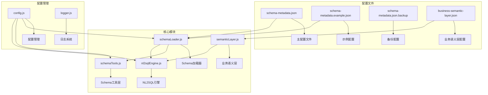
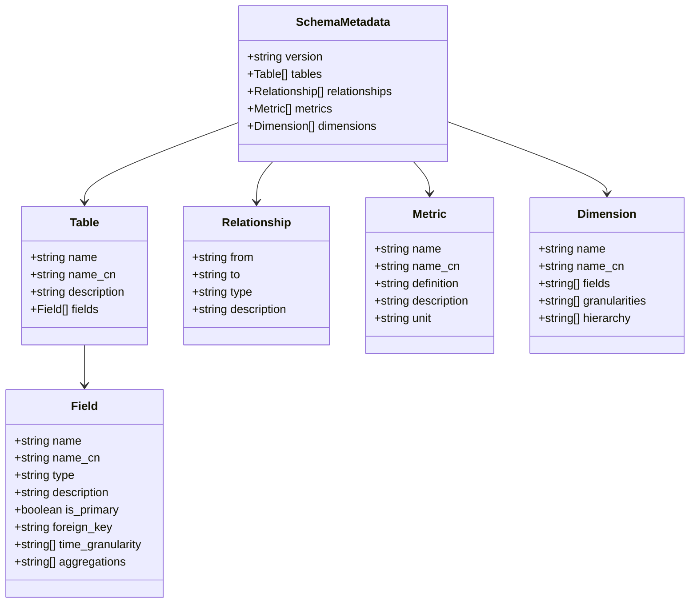
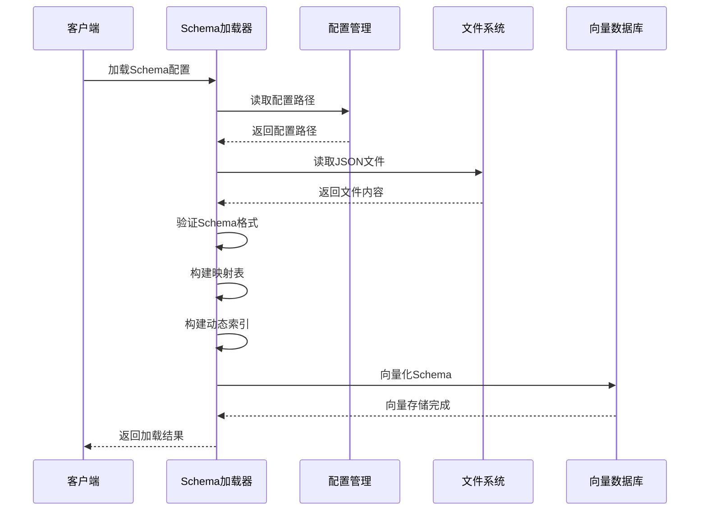
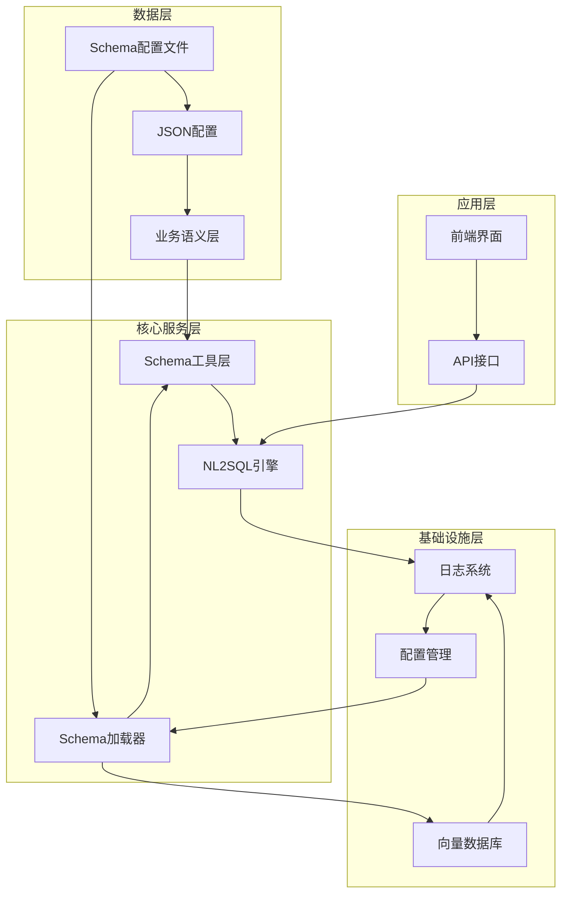
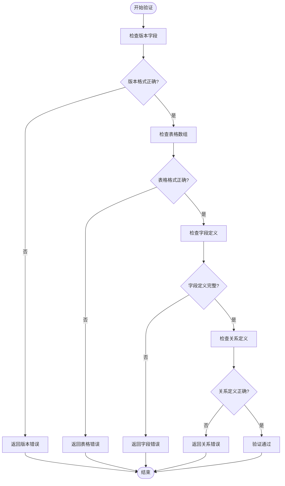
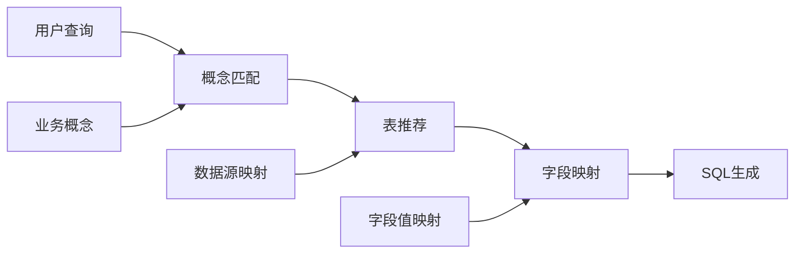
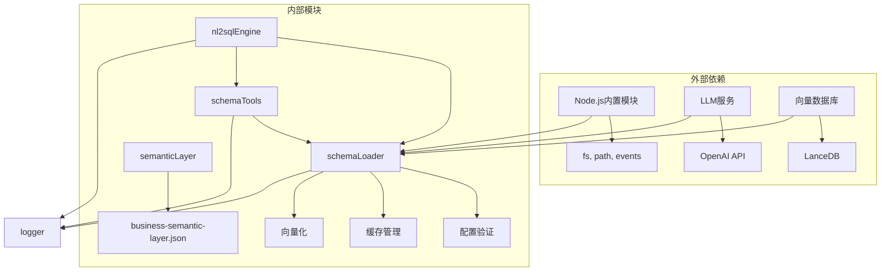

# Schema元数据配置

<cite>
**本文档引用的文件**
- [schema-metadata.example.json](file://backend/config/schema-metadata.example.json)
- [schema-metadata.json](file://backend/config/schema-metadata.json)
- [schema-metadata.json.backup](file://backend/config/schema-metadata.json.backup)
- [schemaLoader.js](file://backend/src/core/schemaLoader.js)
- [schemaTools.js](file://backend/src/core/schemaTools.js)
- [nl2sqlEngine.js](file://backend/src/core/nl2sqlEngine.js)
- [config.js](file://backend/src/core/config.js)
- [business-semantic-layer.json](file://backend/config/business-semantic-layer.json)
- [semanticLayer.js](file://backend/src/core/semanticLayer.js)
- [logger.js](file://backend/src/utils/logger.js)
</cite>

## 目录
1. [简介](#简介)
2. [项目结构](#项目结构)
3. [核心组件](#核心组件)
4. [架构概览](#架构概览)
5. [详细组件分析](#详细组件分析)
6. [依赖分析](#依赖分析)
7. [性能考虑](#性能考虑)
8. [故障排除指南](#故障排除指南)
9. [结论](#结论)

## 简介

Schema元数据配置是NL2SQL系统的核心基础设施，它为自然语言到SQL的转换提供了精确的数据结构描述。该配置文件定义了数据库表结构、字段信息、数据类型、约束条件以及业务关系，是LLM进行准确SQL生成的重要参考。

NL2SQL系统通过Schema元数据实现了以下关键功能：
- **精确的表结构描述**：提供完整的表定义、字段信息和数据类型
- **业务关系映射**：定义表之间的关联关系和业务规则
- **智能搜索能力**：支持基于业务概念的表搜索和推荐
- **安全验证机制**：确保生成的SQL符合安全要求
- **版本管理支持**：支持配置的版本控制和迁移

## 项目结构

NL2SQL项目的Schema配置相关文件组织如下：

**图表来源**
- [schema-metadata.json:1-50](file://backend/config/schema-metadata.json#L1-L50)
- [schemaLoader.js:1-80](file://backend/src/core/schemaLoader.js#L1-L80)
- [config.js:240-250](file://backend/src/core/config.js#L240-L250)

**章节来源**
- [schema-metadata.example.json:1-50](file://backend/config/schema-metadata.example.json#L1-L50)
- [schema-metadata.json:1-50](file://backend/config/schema-metadata.json#L1-L50)
- [schema-metadata.json.backup:1-50](file://backend/config/schema-metadata.json.backup#L1-L50)

## 核心组件

### Schema元数据结构

Schema元数据配置采用JSON格式，包含以下核心结构：

**图表来源**
- [schema-metadata.example.json:1-328](file://backend/config/schema-metadata.example.json#L1-L328)
- [schema-metadata.json:1-200](file://backend/config/schema-metadata.json#L1-L200)

### Schema加载器架构

**图表来源**
- [schemaLoader.js:75-131](file://backend/src/core/schemaLoader.js#L75-L131)
- [config.js:240-250](file://backend/src/core/config.js#L240-L250)

**章节来源**
- [schemaLoader.js:1-131](file://backend/src/core/schemaLoader.js#L1-L131)
- [schemaTools.js:1-125](file://backend/src/core/schemaTools.js#L1-L125)

## 架构概览

NL2SQL系统的Schema元数据架构采用分层设计，确保了系统的可扩展性和维护性：

**图表来源**
- [schemaLoader.js:1-80](file://backend/src/core/schemaLoader.js#L1-L80)
- [nl2sqlEngine.js:1-60](file://backend/src/core/nl2sqlEngine.js#L1-L60)
- [semanticLayer.js:1-60](file://backend/src/core/semanticLayer.js#L1-L60)

### Schema配置验证流程

**图表来源**
- [schemaLoader.js:140-164](file://backend/src/core/schemaLoader.js#L140-L164)

**章节来源**
- [schemaLoader.js:140-164](file://backend/src/core/schemaLoader.js#L140-L164)
- [schemaTools.js:217-306](file://backend/src/core/schemaTools.js#L217-L306)

## 详细组件分析

### 表定义配置

每个表的配置包含以下关键信息：

#### 基本表结构
- **name**: 表的英文名称（必填）
- **name_cn**: 表的中文名称（可选）
- **description**: 表的业务描述（可选）

#### 字段定义
每个字段包含以下属性：
- **name**: 字段英文名（必填）
- **name_cn**: 字段中文名（可选）
- **type**: 数据类型定义（必填）
- **description**: 字段描述（可选）
- **is_primary**: 是否为主键（可选）
- **foreign_key**: 外键引用（可选）
- **time_granularity**: 时间粒度支持（可选）
- **aggregations**: 聚合函数支持（可选）

#### 关系定义
表间关系通过以下字段定义：
- **from**: 起始表的字段引用
- **to**: 目标表的字段引用
- **type**: 关系类型（如MANY_TO_ONE）
- **description**: 关系描述

#### 指标和维度配置
- **metrics**: 预定义业务指标
- **dimensions**: 维度定义和层次结构

**章节来源**
- [schema-metadata.example.json:5-328](file://backend/config/schema-metadata.example.json#L5-L328)
- [schema-metadata.json:5-200](file://backend/config/schema-metadata.json#L5-L200)

### Schema工具层功能

Schema工具层提供了LLM可调用的工具函数：

#### 工具定义
1. **search_tables**: 根据关键词搜索相关表
2. **describe_table**: 获取指定表的详细字段信息
3. **search_knowledge**: 查询业务概念的定义和映射
4. **peek_table**: 查看表的前N行样例数据

#### 索引管理
- **Level 1索引**: 极简版索引，仅包含表名和业务注释
- **缓存机制**: 支持配置的缓存过期时间
- **动态更新**: 支持Schema配置的热更新

**章节来源**
- [schemaTools.js:40-124](file://backend/src/core/schemaTools.js#L40-L124)
- [schemaTools.js:136-173](file://backend/src/core/schemaTools.js#L136-L173)

### 业务语义层集成

业务语义层将业务概念映射到物理表结构：

**图表来源**
- [semanticLayer.js:134-167](file://backend/src/core/semanticLayer.js#L134-L167)
- [business-semantic-layer.json:5-121](file://backend/config/business-semantic-layer.json#L5-L121)

**章节来源**
- [semanticLayer.js:1-120](file://backend/src/core/semanticLayer.js#L1-L120)
- [business-semantic-layer.json:1-189](file://backend/config/business-semantic-layer.json#L1-L189)

## 依赖分析

### 核心依赖关系

**图表来源**
- [schemaLoader.js:15-27](file://backend/src/core/schemaLoader.js#L15-L27)
- [config.js:60-130](file://backend/src/core/config.js#L60-L130)

### 配置依赖链

| 模块 | 依赖模块 | 用途 |
|------|----------|------|
| schemaLoader | config, logger, llmService, vectorStore | Schema加载和管理 |
| schemaTools | schemaLoader, logger, config | Schema探索工具 |
| nl2sqlEngine | schemaLoader, database, llmService | NL2SQL核心引擎 |
| semanticLayer | config, logger | 业务语义层处理 |

**章节来源**
- [schemaLoader.js:15-27](file://backend/src/core/schemaLoader.js#L15-L27)
- [schemaTools.js:17-20](file://backend/src/core/schemaTools.js#L17-L20)
- [nl2sqlEngine.js:16-34](file://backend/src/core/nl2sqlEngine.js#L16-L34)

## 性能考虑

### 缓存策略
- **Schema缓存**: 默认启用，缓存过期时间为1小时
- **Level 1索引缓存**: 支持配置的缓存过期时间
- **向量缓存**: 支持增量更新，避免全量重建

### 优化技术
- **向量化搜索**: 使用表级向量表示，提升搜索效率
- **关键词匹配**: 提供回退的关键词匹配机制
- **动态索引**: 自动生成游戏名索引，支持模糊匹配

### 内存管理
- **映射表优化**: 使用Map结构提供O(1)查找性能
- **缓存清理**: 定期清理过期缓存，防止内存泄漏
- **批量操作**: 支持批量Schema加载和更新

## 故障排除指南

### 常见配置错误

#### Schema格式验证错误
- **错误**: 缺少必要的字段
- **解决方案**: 确保包含version、tables等必需字段
- **预防**: 使用schema-validator验证配置格式

#### 表结构定义错误
- **错误**: 字段缺少name属性
- **解决方案**: 为每个字段提供唯一的name
- **预防**: 建立字段命名规范

#### 关系定义错误
- **错误**: 外键引用不存在
- **解决方案**: 确保foreign_key指向有效的字段
- **预防**: 建立关系验证机制

### 调试和日志

#### 日志级别配置
- **TRACE**: 详细流程追踪（用于深度调试）
- **DEBUG**: 详细调试信息
- **INFO**: 一般信息（默认级别）
- **WARN**: 警告信息
- **ERROR**: 错误信息

#### 追踪功能
- **执行流程追踪**: 支持开始、步骤记录、结束追踪
- **超时清理**: 自动清理僵尸追踪条目
- **容量保护**: 限制追踪上下文大小

**章节来源**
- [logger.js:276-448](file://backend/src/utils/logger.js#L276-L448)
- [schemaLoader.js:140-164](file://backend/src/core/schemaLoader.js#L140-L164)

## 结论

NL2SQL系统的Schema元数据配置提供了一个完整、灵活且高性能的数据结构描述框架。通过精心设计的配置结构、强大的工具层支持和完善的验证机制，该系统能够：

1. **精确描述数据结构**: 提供完整的表定义、字段信息和业务关系
2. **支持智能搜索**: 基于业务概念的表推荐和字段映射
3. **确保安全性**: 通过白名单和关键字过滤防止SQL注入
4. **提供可扩展性**: 支持配置的版本管理和热更新
5. **保证可靠性**: 完善的错误处理和日志记录机制

通过遵循本文档提供的最佳实践和配置指南，开发者可以有效地管理和维护Schema元数据，确保NL2SQL系统能够准确地将自然语言转换为精确的SQL查询。