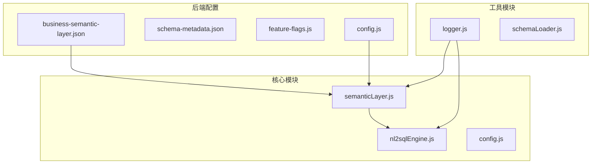
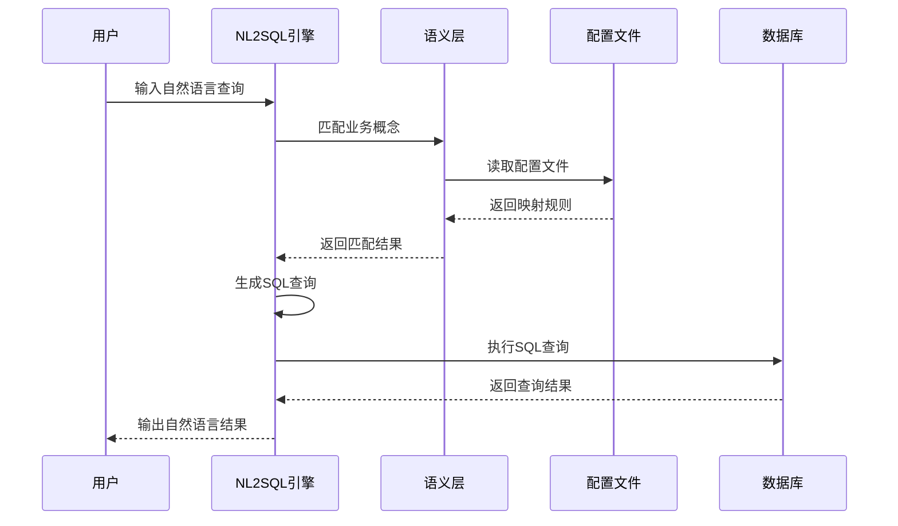
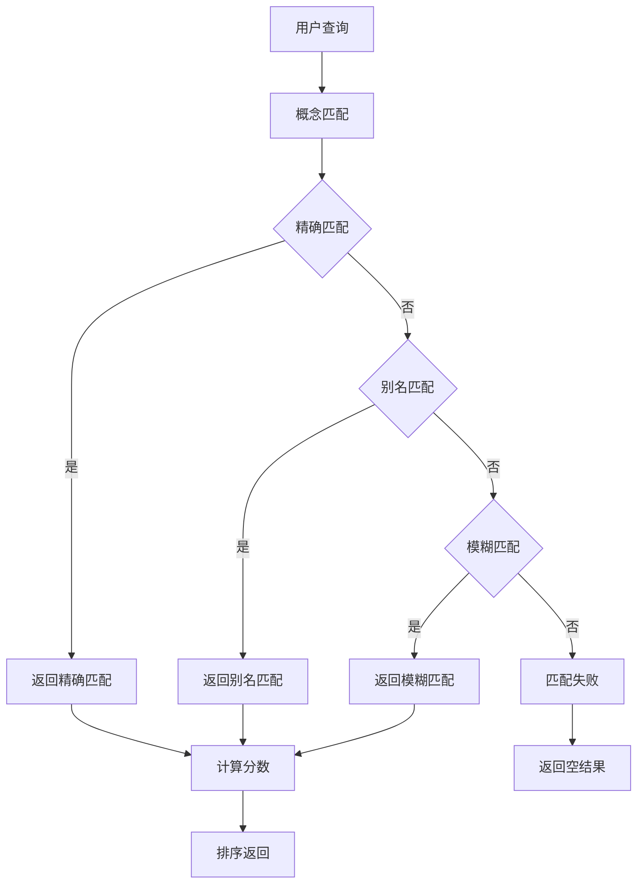
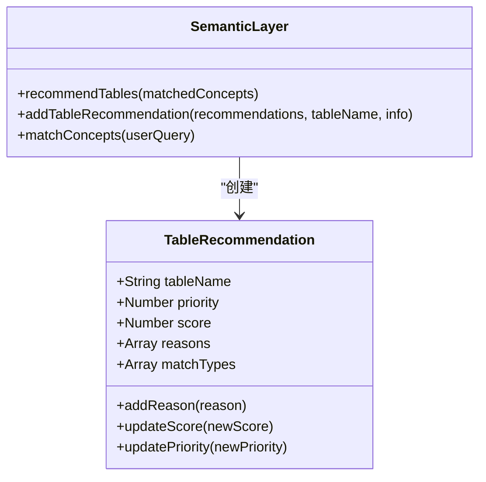
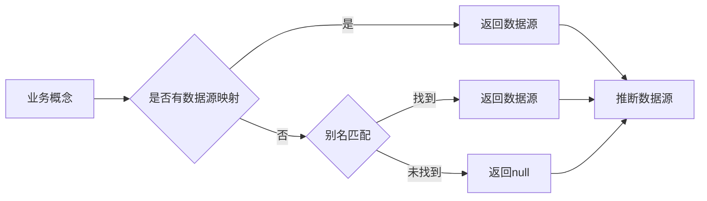
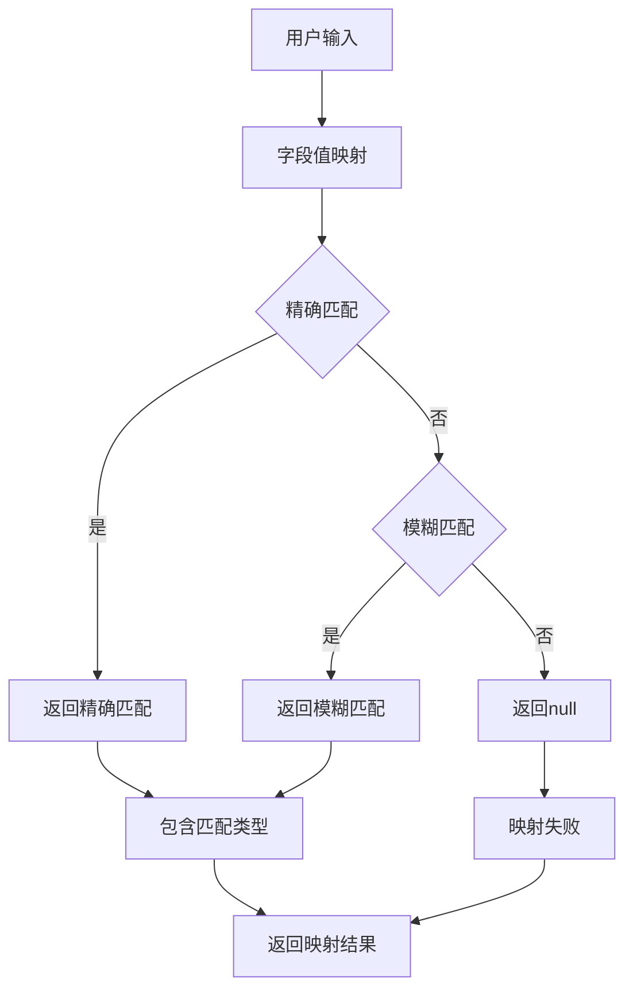
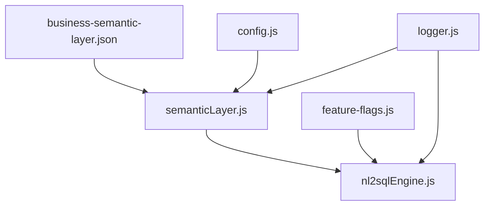

# 业务语义层配置

<cite>
**本文档引用的文件**
- [business-semantic-layer.json](file://backend/config/business-semantic-layer.json)
- [semanticLayer.js](file://backend/src/core/semanticLayer.js)
- [nl2sqlEngine.js](file://backend/src/core/nl2sqlEngine.js)
- [config.js](file://backend/src/core/config.js)
- [feature-flags.js](file://backend/config/feature-flags.js)
- [schema-metadata.json.backup](file://backend/config/schema-metadata.json.backup)
- [logger.js](file://backend/src/utils/logger.js)
</cite>

## 目录
1. [简介](#简介)
2. [项目结构](#项目结构)
3. [核心组件](#核心组件)
4. [架构概览](#架构概览)
5. [详细组件分析](#详细组件分析)
6. [依赖关系分析](#依赖关系分析)
7. [性能考虑](#性能考虑)
8. [故障排除指南](#故障排除指南)
9. [结论](#结论)

## 简介

业务语义层配置是NL2SQL系统中的关键组件，负责将自然语言中的业务术语映射到实际的数据库表和字段。该配置文件定义了业务概念、语义别名、字段关系映射以及查询模式，为自然语言到SQL的转换提供了语义基础。

本文档详细说明了business-semantic-layer.json文件的结构和配置项，解释业务语义层在自然语言到SQL转换中的作用，并提供配置验证、备份恢复策略以及更新流程的最佳实践。

## 项目结构

NL2SQL项目采用模块化架构，业务语义层配置位于后端配置目录中：

**图表来源**
- [business-semantic-layer.json:1-189](file://backend/config/business-semantic-layer.json#L1-L189)
- [semanticLayer.js:1-532](file://backend/src/core/semanticLayer.js#L1-L532)

**章节来源**
- [business-semantic-layer.json:1-189](file://backend/config/business-semantic-layer.json#L1-L189)
- [semanticLayer.js:1-532](file://backend/src/core/semanticLayer.js#L1-L532)

## 核心组件

### 业务语义层配置文件结构

business-semantic-layer.json采用JSON格式，包含以下主要部分：

#### 版本信息和描述
- `version`: 配置版本号
- `description`: 配置文件描述信息

#### 业务概念定义 (concepts)
定义业务术语与其映射关系：
- `aliases`: 业务术语的别名列表
- `description`: 业务概念的详细描述
- `mappings`: 物理表/字段映射规则
- `priority`: 概念优先级
- `examples`: 使用示例

#### 查询模式 (query_patterns)
定义查询模式及其匹配规则：
- `description`: 模式描述
- `required_concepts`: 必需业务概念
- `optional_concepts`: 可选业务概念
- `typical_tables`: 典型表集合
- `join_keys`: 连接键定义
- `example`: 示例查询

#### 字段映射 (field_mappings)
定义字段值映射关系：
- `description`: 字段描述
- `common_values`: 常见值映射

#### 数据源映射 (datasource_mappings)
定义数据源与业务概念的关系：
- `description`: 数据源描述
- `concepts`: 关联的业务概念
- `table_prefix`: 表前缀

**章节来源**
- [business-semantic-layer.json:1-189](file://backend/config/business-semantic-layer.json#L1-L189)

## 架构概览

业务语义层在整个NL2SQL系统中的位置和作用：

**图表来源**
- [semanticLayer.js:134-167](file://backend/src/core/semanticLayer.js#L134-L167)
- [nl2sqlEngine.js:39-45](file://backend/src/core/nl2sqlEngine.js#L39-L45)

## 详细组件分析

### 业务概念匹配机制

语义层实现了多层次的概念匹配：

**图表来源**
- [semanticLayer.js:177-214](file://backend/src/core/semanticLayer.js#L177-L214)

#### 匹配算法实现

1. **精确匹配**: 完全匹配业务概念名称
2. **别名匹配**: 匹配预定义的别名列表
3. **模糊匹配**: 基于关键词提取的相似度匹配

**章节来源**
- [semanticLayer.js:177-226](file://backend/src/core/semanticLayer.js#L177-L226)

### 表推荐系统

基于匹配到的概念推荐相关表：

**图表来源**
- [semanticLayer.js:238-330](file://backend/src/core/semanticLayer.js#L238-L330)

#### 推荐规则

1. **主表优先**: 优先推荐主要业务表
2. **平台表处理**: 处理平台层面的表映射
3. **游戏表处理**: 处理游戏层面的表映射
4. **备选表降权**: 备选表具有较低优先级

**章节来源**
- [semanticLayer.js:238-330](file://backend/src/core/semanticLayer.js#L238-L330)

### 数据源映射机制

**图表来源**
- [semanticLayer.js:342-386](file://backend/src/core/semanticLayer.js#L342-L386)

#### 数据源推断流程

1. **直接映射**: 从概念配置中直接获取数据源
2. **别名匹配**: 通过别名反向查找数据源
3. **置信度计算**: 基于匹配质量计算置信度

**章节来源**
- [semanticLayer.js:367-386](file://backend/src/core/semanticLayer.js#L367-L386)

### 字段值映射系统

**图表来源**
- [semanticLayer.js:399-433](file://backend/src/core/semanticLayer.js#L399-L433)

#### 映射策略

1. **精确匹配**: 完全匹配用户术语
2. **模糊匹配**: 支持子串匹配
3. **游戏ID特殊处理**: 独立的游戏名称映射逻辑

**章节来源**
- [semanticLayer.js:399-464](file://backend/src/core/semanticLayer.js#L399-L464)

## 依赖关系分析

### 配置文件依赖

**图表来源**
- [semanticLayer.js:14-17](file://backend/src/core/semanticLayer.js#L14-L17)
- [nl2sqlEngine.js:39-45](file://backend/src/core/nl2sqlEngine.js#L39-L45)

### 功能开关集成

业务语义层通过功能开关控制启用状态：

| 功能开关 | 环境变量 | 描述 |
|---------|----------|------|
| BUSINESS_SEMANTIC_LAYER | FF_BUSINESS_SEMANTIC_LAYER | 启用业务语义层功能 |
| ENABLE_ALL_FEATURES | FF_ENABLE_ALL | 启用所有功能 |
| DISABLE_ALL_FEATURES | FF_DISABLE_ALL | 禁用所有功能 |

**章节来源**
- [feature-flags.js:50-53](file://backend/config/feature-flags.js#L50-L53)
- [nl2sqlEngine.js:39-45](file://backend/src/core/nl2sqlEngine.js#L39-L45)

## 性能考虑

### 配置加载优化

1. **延迟加载**: 首次使用时才加载配置文件
2. **内置回退**: 配置文件缺失时使用内置配置
3. **缓存机制**: 配置加载后缓存到内存中

### 匹配算法优化

1. **早期退出**: 匹配成功后立即返回
2. **分数排序**: 按匹配质量排序，优先处理高质量匹配
3. **关键词提取**: 使用正则表达式高效提取关键词

### 内存管理

1. **配置缓存**: 避免重复解析JSON文件
2. **追踪上下文清理**: 定期清理超时的追踪会话
3. **日志轮转**: 自动管理日志文件大小

## 故障排除指南

### 配置文件加载失败

**症状**: 语义层无法加载配置文件

**解决方案**:
1. 检查配置文件路径是否正确
2. 验证JSON格式是否有效
3. 确认文件权限设置
4. 检查磁盘空间是否充足

**章节来源**
- [semanticLayer.js:52-72](file://backend/src/core/semanticLayer.js#L52-L72)

### 匹配结果异常

**症状**: 业务概念匹配不准确

**排查步骤**:
1. 检查概念别名配置是否完整
2. 验证优先级设置是否合理
3. 确认查询文本是否包含预期关键词
4. 查看日志中的匹配分数和类型

**章节来源**
- [semanticLayer.js:134-167](file://backend/src/core/semanticLayer.js#L134-L167)

### 数据源映射错误

**症状**: 数据源推断结果不正确

**诊断方法**:
1. 检查数据源映射配置
2. 验证业务概念与数据源的关联
3. 确认表前缀设置是否正确
4. 查看置信度计算过程

**章节来源**
- [semanticLayer.js:367-386](file://backend/src/core/semanticLayer.js#L367-L386)

### 字段值映射问题

**症状**: 字段值映射失败或不准确

**解决方法**:
1. 检查common_values配置
2. 验证用户术语与映射值的对应关系
3. 确认模糊匹配逻辑是否符合预期
4. 查看映射类型和匹配结果

**章节来源**
- [semanticLayer.js:399-433](file://backend/src/core/semanticLayer.js#L399-L433)

## 结论

业务语义层配置是NL2SQL系统的核心基础设施，它通过结构化的配置文件实现了业务术语到数据库表字段的精确映射。该配置系统具有以下特点：

1. **模块化设计**: 清晰的配置结构和职责分离
2. **灵活匹配**: 支持多种匹配策略和优先级处理
3. **容错机制**: 完善的错误处理和回退策略
4. **性能优化**: 高效的匹配算法和缓存机制
5. **可扩展性**: 支持动态配置和热更新

通过合理的配置管理和最佳实践，业务语义层能够显著提升NL2SQL系统的准确性和用户体验。建议在部署时制定完善的配置验证和备份策略，确保系统的稳定运行。