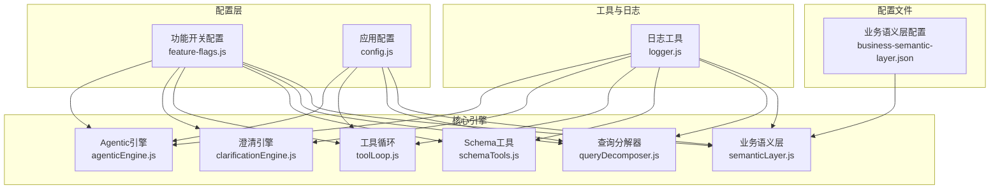
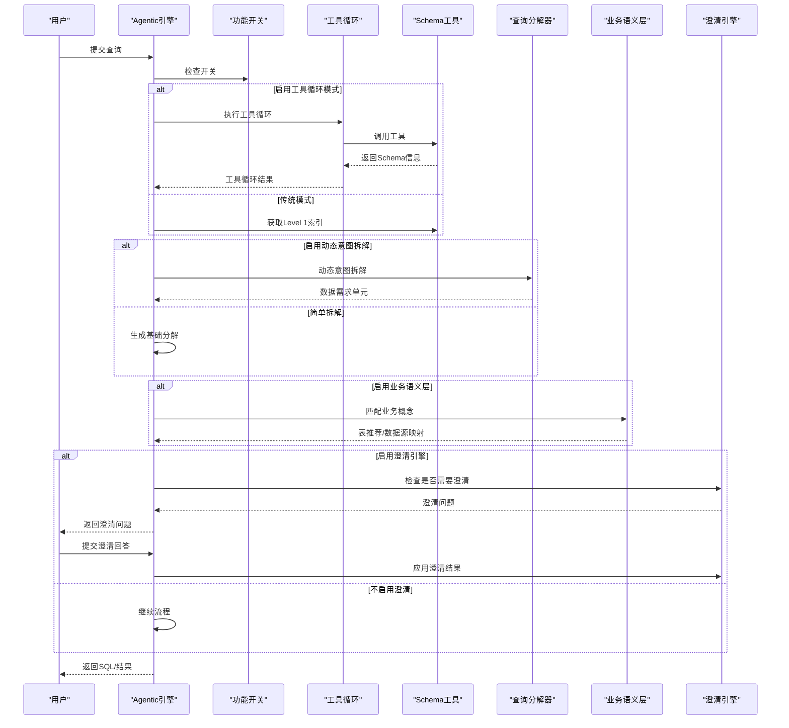
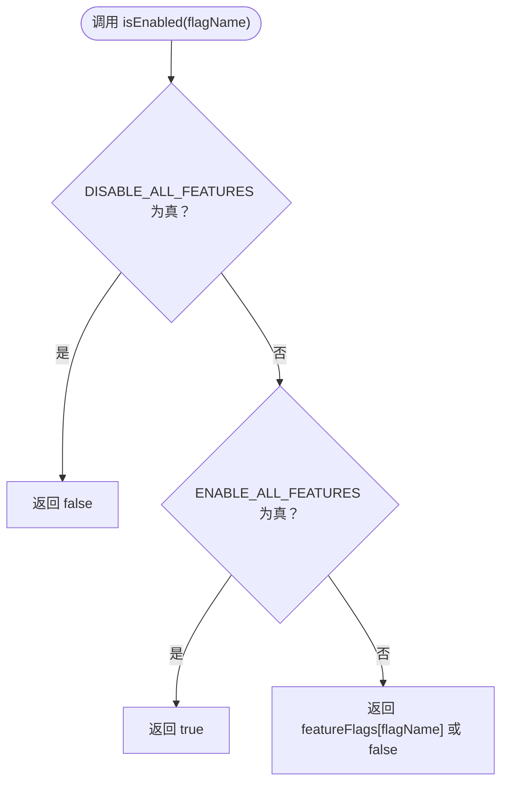
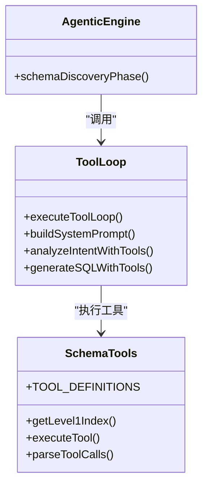
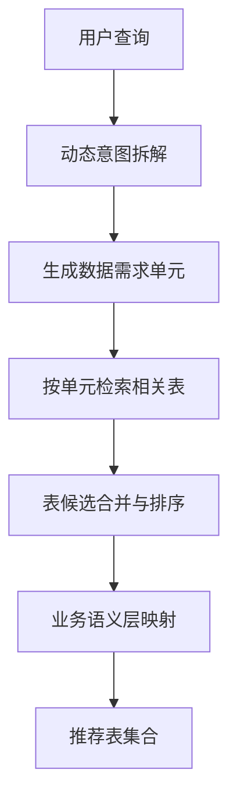
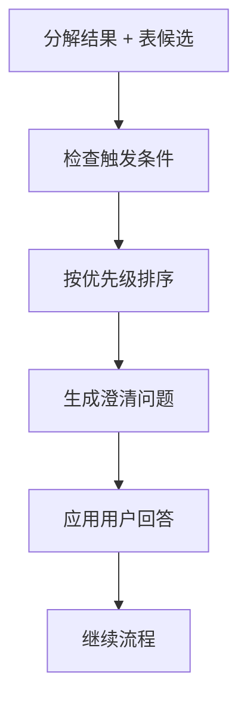
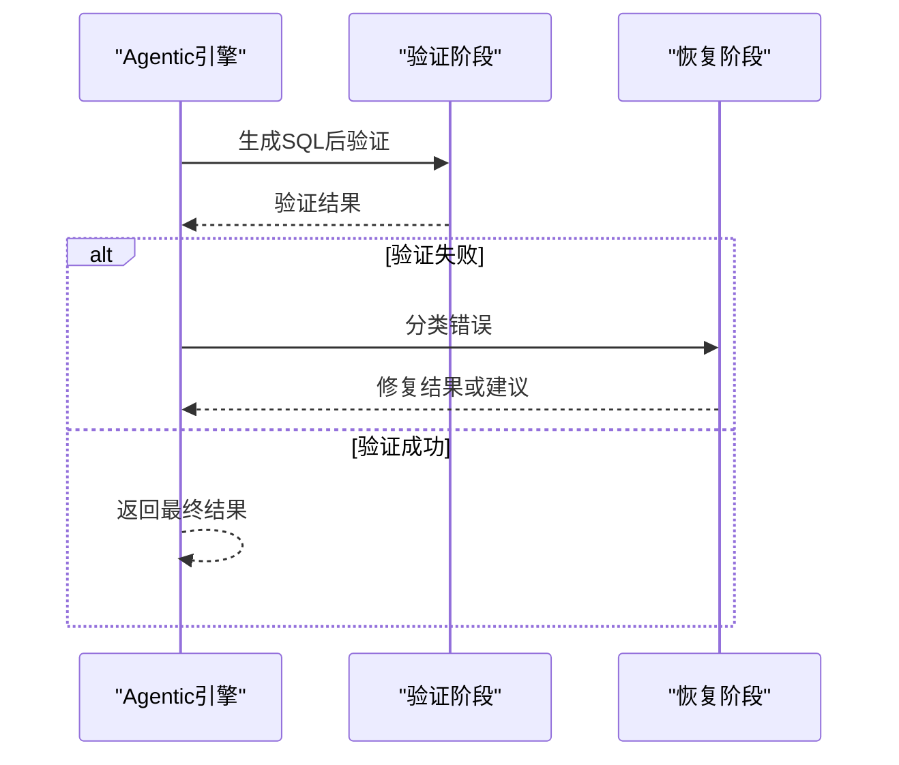
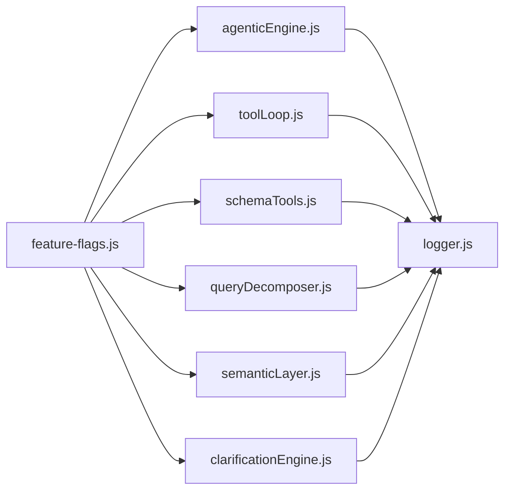

# 功能开关配置

<cite>
**本文引用的文件**
- [feature-flags.js](file://backend/config/feature-flags.js)
- [config.js](file://backend/src/core/config.js)
- [agenticEngine.js](file://backend/src/core/agenticEngine.js)
- [clarificationEngine.js](file://backend/src/core/clarificationEngine.js)
- [schemaTools.js](file://backend/src/core/schemaTools.js)
- [toolLoop.js](file://backend/src/core/toolLoop.js)
- [queryDecomposer.js](file://backend/src/core/queryDecomposer.js)
- [semanticLayer.js](file://backend/src/core/semanticLayer.js)
- [business-semantic-layer.json](file://backend/config/business-semantic-layer.json)
- [logger.js](file://backend/src/utils/logger.js)
- [package.json](file://backend/package.json)
</cite>

## 目录
1. [简介](#简介)
2. [项目结构](#项目结构)
3. [核心组件](#核心组件)
4. [架构概览](#架构概览)
5. [详细组件分析](#详细组件分析)
6. [依赖分析](#依赖分析)
7. [性能考量](#性能考量)
8. [故障排查指南](#故障排查指南)
9. [结论](#结论)
10. [附录](#附录)

## 简介
本文档面向NL2SQL系统的功能开关配置，系统采用渐进式Phase设计，将新功能按阶段逐步启用，支持快速回滚与精细化调试。本文重点覆盖：
- Phase 1：工具化Schema探索（TOOL_AUGMENTED_SCHEMA、SCHEMA_LAYERED_LOADING、TOOL_LOOP_MODE）
- Phase 2：动态意图拆解（DYNAMIC_INTENT_DECOMPOSITION、BUSINESS_SEMANTIC_LAYER）
- Phase 3：澄清机制（CLARIFICATION_ENGINE）
- Phase 4：多步推理与自我修正（AGENTIC_ENGINE、AUTO_RECOVERY）
- 全局开关（ENABLE_ALL_FEATURES、DISABLE_ALL_FEATURES）
- 环境变量配置方法与开关状态检查函数（isEnabled、shouldUseAgenticWorkflow、shouldUseLayeredSchema、getAllFlags、getEnabledPhases、logFeatureFlags）
- 功能开关状态的日志输出与调试技巧

## 项目结构
NL2SQL后端采用模块化组织，功能开关集中于配置模块，各Phase功能模块通过开关控制启用与否，并通过统一的日志系统输出状态与调试信息。

图表来源
- [feature-flags.js:16-96](file://backend/config/feature-flags.js#L16-L96)
- [agenticEngine.js:29](file://backend/src/core/agenticEngine.js#L29)
- [clarificationEngine.js:14](file://backend/src/core/clarificationEngine.js#L14)
- [toolLoop.js:16](file://backend/src/core/toolLoop.js#L16)
- [schemaTools.js:17](file://backend/src/core/schemaTools.js#L17)
- [queryDecomposer.js:14](file://backend/src/core/queryDecomposer.js#L14)
- [semanticLayer.js:14](file://backend/src/core/semanticLayer.js#L14)
- [business-semantic-layer.json:1-189](file://backend/config/business-semantic-layer.json#L1-L189)
- [logger.js:23](file://backend/src/utils/logger.js#L23)

章节来源
- [feature-flags.js:16-96](file://backend/config/feature-flags.js#L16-L96)
- [config.js:16-398](file://backend/src/core/config.js#L16-L398)

## 核心组件
- 功能开关配置：集中定义各Phase开关与全局开关，提供开关检查与状态打印能力
- 引擎模块：Agentic引擎、澄清引擎、工具循环、Schema工具、查询分解器、业务语义层
- 配置与日志：应用配置、日志工具，支撑开关状态与流程追踪

章节来源
- [feature-flags.js:16-96](file://backend/config/feature-flags.js#L16-L96)
- [agenticEngine.js:52-651](file://backend/src/core/agenticEngine.js#L52-L651)
- [clarificationEngine.js:14-489](file://backend/src/core/clarificationEngine.js#L14-L489)
- [toolLoop.js:16-521](file://backend/src/core/toolLoop.js#L16-L521)
- [schemaTools.js:17-632](file://backend/src/core/schemaTools.js#L17-L632)
- [queryDecomposer.js:14-402](file://backend/src/core/queryDecomposer.js#L14-L402)
- [semanticLayer.js:14-532](file://backend/src/core/semanticLayer.js#L14-L532)
- [logger.js:54-482](file://backend/src/utils/logger.js#L54-L482)

## 架构概览
功能开关贯穿系统，决定引擎行为与流程分支。Agentic引擎作为顶层协调者，依据开关选择不同工作流；Schema工具与工具循环为Phase 1提供Schema探索能力；动态意图拆解与业务语义层为Phase 2提供语义理解；澄清引擎为Phase 3提供交互澄清；自我修正为Phase 4提供容错恢复。

图表来源
- [agenticEngine.js:68-178](file://backend/src/core/agenticEngine.js#L68-L178)
- [toolLoop.js:57-185](file://backend/src/core/toolLoop.js#L57-L185)
- [schemaTools.js:565-602](file://backend/src/core/schemaTools.js#L565-L602)
- [queryDecomposer.js:38-70](file://backend/src/core/queryDecomposer.js#L38-L70)
- [semanticLayer.js:134-167](file://backend/src/core/semanticLayer.js#L134-L167)
- [clarificationEngine.js:196-232](file://backend/src/core/clarificationEngine.js#L196-L232)

## 详细组件分析

### 功能开关定义与用途
- Phase 1：工具化Schema探索
  - TOOL_AUGMENTED_SCHEMA：启用工具化Schema探索，LLM可主动调用工具探索Schema
  - SCHEMA_LAYERED_LOADING：启用分层加载，初始Prompt使用Level 1索引，按需加载Level 2详情
  - TOOL_LOOP_MODE：启用工具循环模式，LLM可进行多轮工具调用
- Phase 2：动态意图拆解
  - DYNAMIC_INTENT_DECOMPOSITION：启用动态意图拆解，复杂查询拆解为多个数据需求单元
  - BUSINESS_SEMANTIC_LAYER：启用业务语义层，业务术语（如“老平台”）可正确映射
- Phase 3：澄清机制
  - CLARIFICATION_ENGINE：启用澄清引擎，检索置信度不足时主动询问用户
- Phase 4：多步推理与自我修正
  - AGENTIC_ENGINE：启用Agentic引擎，使用四阶段Agentic工作流
  - AUTO_RECOVERY：启用自我修正恢复，SQL执行失败时自动尝试修复
- 全局开关
  - ENABLE_ALL_FEATURES：启用所有新功能（谨慎使用）
  - DISABLE_ALL_FEATURES：禁用所有新功能（紧急回滚使用）

章节来源
- [feature-flags.js:16-96](file://backend/config/feature-flags.js#L16-L96)

### 开关检查与状态管理
- isEnabled(flagName)：检查具体开关，全局禁用优先，全局启用次之，否则返回具体开关值
- getAllFlags()：获取除全局开关外所有开关状态
- shouldUseAgenticWorkflow()：综合判断是否使用Agentic工作流（优先Agentic引擎，其次工具循环模式）
- shouldUseLayeredSchema()：判断是否使用分层Schema加载（工具循环或工具化Schema）
- getEnabledPhases()：返回当前启用的Phase列表
- logFeatureFlags()：打印功能开关状态与启用的Phase

图表来源
- [feature-flags.js:108-121](file://backend/config/feature-flags.js#L108-L121)

章节来源
- [feature-flags.js:108-229](file://backend/config/feature-flags.js#L108-L229)

### 工具化Schema探索（Phase 1）
- Schema工具（schemaTools）提供四个工具：search_tables、describe_table、search_knowledge、peek_table
- 工具循环（toolLoop）实现LLM工具调用循环，构建系统提示词，执行工具调用并返回结果
- Agentic引擎在Schema发现阶段根据开关选择工具循环或传统方式

图表来源
- [schemaTools.js:40-124](file://backend/src/core/schemaTools.js#L40-L124)
- [toolLoop.js:57-185](file://backend/src/core/toolLoop.js#L57-L185)
- [agenticEngine.js:233-262](file://backend/src/core/agenticEngine.js#L233-L262)

章节来源
- [schemaTools.js:40-632](file://backend/src/core/schemaTools.js#L40-L632)
- [toolLoop.js:57-521](file://backend/src/core/toolLoop.js#L57-L521)
- [agenticEngine.js:233-262](file://backend/src/core/agenticEngine.js#L233-L262)

### 动态意图拆解（Phase 2）
- 查询分解器（queryDecomposer）将复杂查询拆解为数据需求单元，支持关键词、时间范围、指标、行为等单元类型
- 业务语义层（semanticLayer）建立业务概念到物理表/字段的映射，支持别名识别与模糊匹配

图表来源
- [queryDecomposer.js:38-298](file://backend/src/core/queryDecomposer.js#L38-L298)
- [semanticLayer.js:134-306](file://backend/src/core/semanticLayer.js#L134-L306)

章节来源
- [queryDecomposer.js:38-402](file://backend/src/core/queryDecomposer.js#L38-L402)
- [semanticLayer.js:48-115](file://backend/src/core/semanticLayer.js#L48-L115)
- [business-semantic-layer.json:1-189](file://backend/config/business-semantic-layer.json#L1-L189)

### 澄清机制（Phase 3）
- 澄清引擎（clarificationEngine）定义多种触发条件（无匹配表、表歧义、聚合来源不确定、时间粒度不明确、低置信度）
- 根据最高优先级触发生成澄清问题，支持默认选项与解释说明

图表来源
- [clarificationEngine.js:196-232](file://backend/src/core/clarificationEngine.js#L196-L232)
- [clarificationEngine.js:246-272](file://backend/src/core/clarificationEngine.js#L246-L272)
- [clarificationEngine.js:388-426](file://backend/src/core/clarificationEngine.js#L388-L426)

章节来源
- [clarificationEngine.js:26-182](file://backend/src/core/clarificationEngine.js#L26-L182)
- [clarificationEngine.js:196-489](file://backend/src/core/clarificationEngine.js#L196-L489)

### 多步推理与自我修正（Phase 4）
- Agentic引擎实现四阶段工作流：规划 + 工具增强Schema发现、动态意图拆解、澄清确认、生成 + 验证 + 恢复
- 验证阶段进行基本语法、安全检查与表存在性检查；恢复阶段分类错误并尝试修复

图表来源
- [agenticEngine.js:128-178](file://backend/src/core/agenticEngine.js#L128-L178)
- [agenticEngine.js:438-495](file://backend/src/core/agenticEngine.js#L438-L495)
- [agenticEngine.js:516-611](file://backend/src/core/agenticEngine.js#L516-L611)

章节来源
- [agenticEngine.js:52-651](file://backend/src/core/agenticEngine.js#L52-L651)

### 全局开关与工作流选择
- ENABLE_ALL_FEATURES：启用所有开关，便于快速验证
- DISABLE_ALL_FEATURES：禁用所有开关，用于紧急回滚
- shouldUseAgenticWorkflow()：优先Agentic引擎，其次工具循环模式
- shouldUseLayeredSchema()：工具循环或工具化Schema均启用分层加载

章节来源
- [feature-flags.js:89-95](file://backend/config/feature-flags.js#L89-L95)
- [feature-flags.js:149-170](file://backend/config/feature-flags.js#L149-L170)

## 依赖分析
- 功能开关集中于feature-flags模块，被各引擎模块通过require引入
- 引擎模块之间存在耦合：Agentic引擎依赖工具循环、Schema工具、查询分解器、业务语义层、澄清引擎
- 日志模块贯穿各模块，提供统一的日志输出与追踪能力

图表来源
- [feature-flags.js:235-248](file://backend/config/feature-flags.js#L235-L248)
- [agenticEngine.js:29](file://backend/src/core/agenticEngine.js#L29)
- [toolLoop.js:16](file://backend/src/core/toolLoop.js#L16)
- [schemaTools.js:17](file://backend/src/core/schemaTools.js#L17)
- [queryDecomposer.js:14](file://backend/src/core/queryDecomposer.js#L14)
- [semanticLayer.js:14](file://backend/src/core/semanticLayer.js#L14)
- [clarificationEngine.js:14](file://backend/src/core/clarificationEngine.js#L14)
- [logger.js:23](file://backend/src/utils/logger.js#L23)

章节来源
- [feature-flags.js:235-248](file://backend/config/feature-flags.js#L235-L248)

## 性能考量
- 工具循环最大迭代次数与超时控制，避免LLM陷入无效循环
- 分层Schema加载减少初始Prompt大小，提升响应速度
- 动态意图拆解与表候选合并策略，平衡准确性与性能
- 日志级别与文件轮转，避免日志过大影响性能

章节来源
- [toolLoop.js:30-35](file://backend/src/core/toolLoop.js#L30-L35)
- [schemaTools.js:136-173](file://backend/src/core/schemaTools.js#L136-L173)
- [queryDecomposer.js:255-298](file://backend/src/core/queryDecomposer.js#L255-L298)
- [logger.js:147-179](file://backend/src/utils/logger.js#L147-L179)

## 故障排查指南
- 启动时日志输出功能开关状态，便于快速核对配置
- 使用日志工具的追踪能力，记录Agentic引擎各阶段耗时与状态
- 澄清引擎触发条件可视化，帮助定位理解偏差
- 自我修正流程记录错误分类与修复尝试，辅助定位SQL生成问题

章节来源
- [feature-flags.js:209-229](file://backend/config/feature-flags.js#L209-L229)
- [logger.js:352-448](file://backend/src/utils/logger.js#L352-L448)
- [clarificationEngine.js:196-232](file://backend/src/core/clarificationEngine.js#L196-L232)
- [agenticEngine.js:516-611](file://backend/src/core/agenticEngine.js#L516-L611)

## 结论
NL2SQL的功能开关体系通过Phase化设计实现了新功能的渐进式启用与回滚，结合工具循环、动态意图拆解、业务语义层、澄清机制与自我修正，形成完整的NL2SQL解决方案。通过统一的开关检查与状态打印，开发者可以灵活控制功能组合，并借助日志与追踪能力进行高效调试。

## 附录

### 环境变量配置方法
- 通过process.env设置各开关值，格式为布尔字符串（'true'/'false'）
- 示例：FF_TOOL_AUGMENTED_SCHEMA=true
- 全局开关：FF_ENABLE_ALL=true、FF_DISABLE_ALL=true
- 应用配置：LLM_API_BASE、LLM_API_KEY、LLM_MODEL、LLM_TIMEOUT、EMBEDDING_MODEL、EMBEDDING_TIMEOUT、DB_PATH、VECTOR_DB_PATH、SR_DATABASE_URL、ALLOWED_TABLES、DRY_RUN、MAX_QUERY_ROWS、QUERY_TIMEOUT、LOG_LEVEL、LOG_FILE、EVALUATION_ENABLED、EVALUATION_TRACK_STATS、ENABLE_TOKEN_BUDGET、ENABLE_SUMMARIZER、MAX_CONTEXT_TOKENS、RESERVED_OUTPUT_TOKENS、SUMMARIZER_TRIGGER_ROUNDS、SUMMARIZER_PRESERVE_ROUNDS、SUMMARIZER_MAX_TOKENS、SUMMARIZER_UPDATE_INTERVAL

章节来源
- [feature-flags.js:25-95](file://backend/config/feature-flags.js#L25-L95)
- [config.js:60-130](file://backend/src/core/config.js#L60-L130)
- [config.js:195-213](file://backend/src/core/config.js#L195-L213)
- [config.js:342-354](file://backend/src/core/config.js#L342-L354)

### 功能开关状态检查函数使用方法
- isEnabled(flagName)：检查具体开关
- getAllFlags()：获取所有开关状态
- shouldUseAgenticWorkflow()：判断是否使用Agentic工作流
- shouldUseLayeredSchema()：判断是否使用分层Schema加载
- getEnabledPhases()：获取启用的Phase列表
- logFeatureFlags()：打印功能开关状态与启用的Phase

章节来源
- [feature-flags.js:108-229](file://backend/config/feature-flags.js#L108-L229)