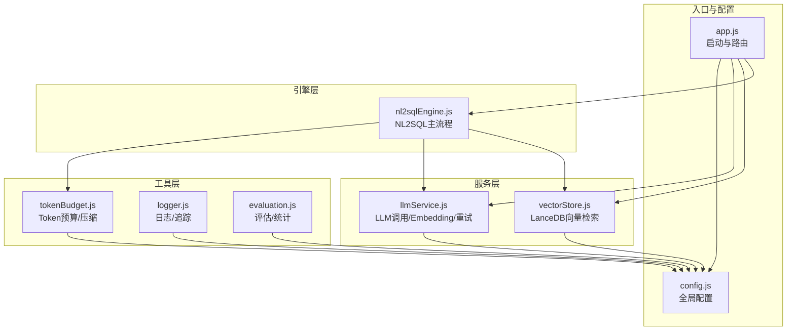
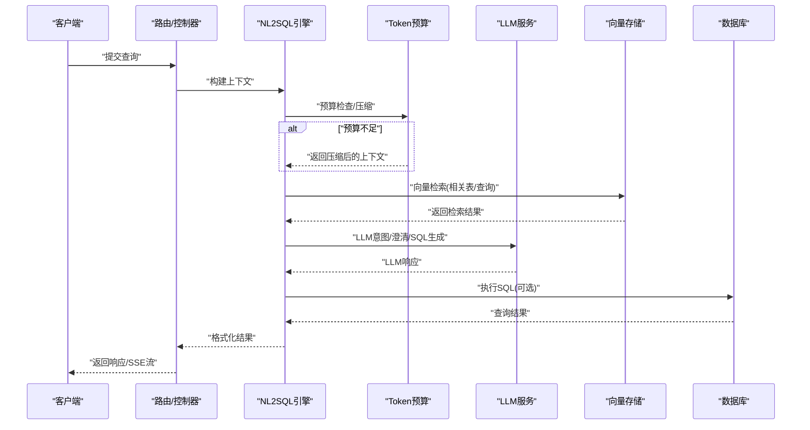
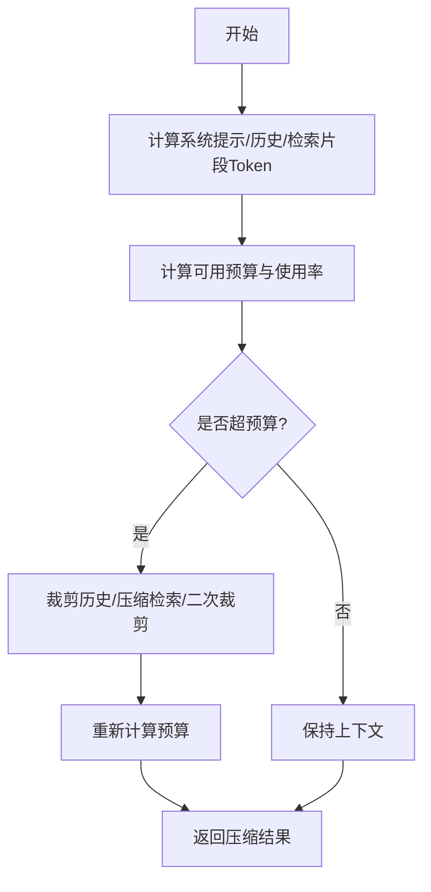
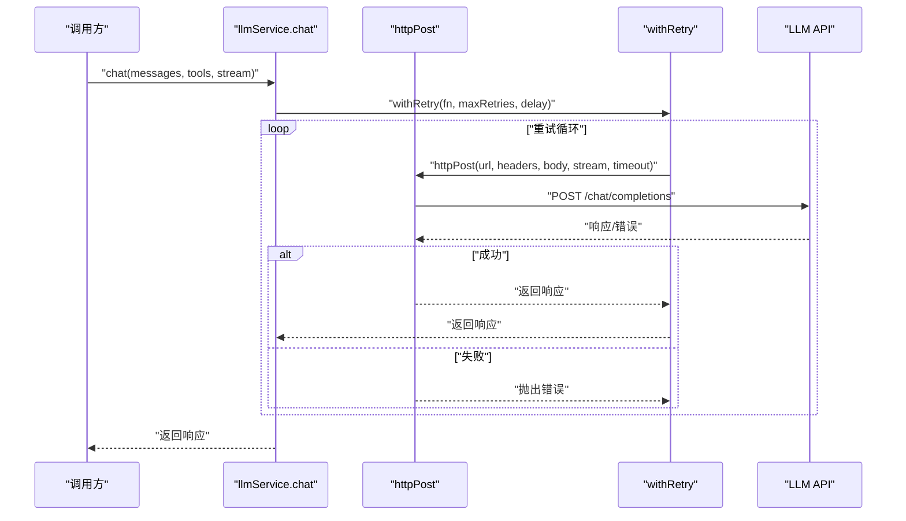
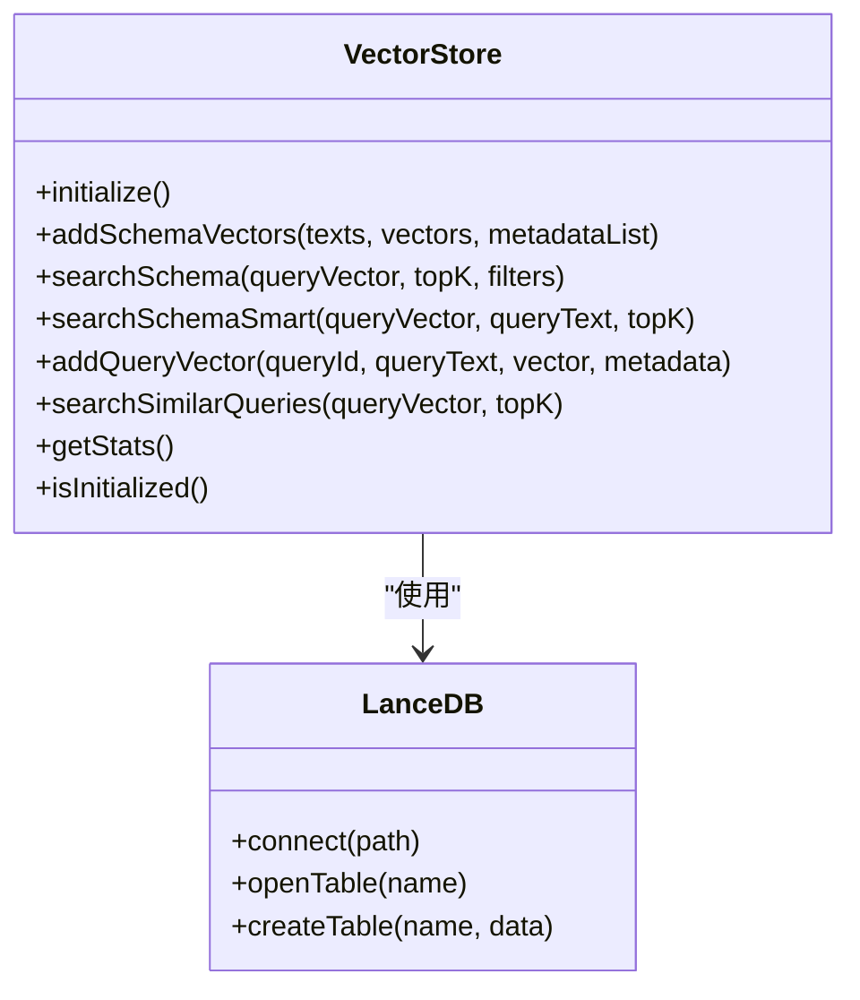
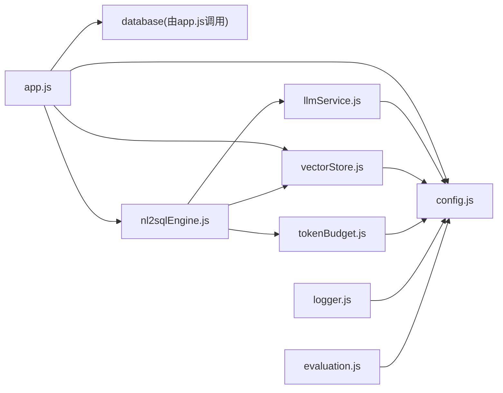

# 性能参数调优

<cite>
**本文引用的文件**
- [tokenBudget.js](file://backend/src/utils/tokenBudget.js)
- [config.js](file://backend/src/core/config.js)
- [llmService.js](file://backend/src/core/llmService.js)
- [vectorStore.js](file://backend/src/memory/vectorStore.js)
- [logger.js](file://backend/src/utils/logger.js)
- [evaluation.js](file://backend/src/utils/evaluation.js)
- [nl2sqlEngine.js](file://backend/src/core/nl2sqlEngine.js)
- [app.js](file://backend/src/app.js)
- [package.json](file://backend/package.json)
- [business-semantic-layer.json](file://backend/config/business-semantic-layer.json)
</cite>

## 目录
1. [简介](#简介)
2. [项目结构](#项目结构)
3. [核心组件](#核心组件)
4. [架构概览](#架构概览)
5. [详细组件分析](#详细组件分析)
6. [依赖分析](#依赖分析)
7. [性能考量](#性能考量)
8. [故障排查指南](#故障排查指南)
9. [结论](#结论)
10. [附录](#附录)

## 简介
本文件面向NL2SQL系统的运维与开发人员，聚焦“性能参数调优”。围绕Token预算限制、并发请求控制、缓存大小设置、LLM服务性能配置、向量数据库优化、监控与基准测试、以及不同负载场景下的调优策略，给出系统化、可落地的配置建议与最佳实践，帮助在保证成本与效果平衡的前提下，获得稳定、可预测的性能表现。

## 项目结构
后端采用模块化分层设计：
- 配置层：集中管理所有运行参数（LLM、数据库、向量库、安全、日志、评估等）
- 服务层：LLM服务、数据库访问、向量检索
- 引擎层：NL2SQL核心流程（意图识别、澄清、SQL生成、验证、格式化）
- 工具层：日志、Token预算、评估、内存与长期记忆
- 入口：Express应用启动、路由挂载、SSE流式输出

图表来源
- [app.js:93-194](file://backend/src/app.js#L93-L194)
- [config.js:16-355](file://backend/src/core/config.js#L16-L355)
- [llmService.js:15-477](file://backend/src/core/llmService.js#L15-L477)
- [vectorStore.js:233-324](file://backend/src/memory/vectorStore.js#L233-L324)
- [nl2sqlEngine.js:16-34](file://backend/src/core/nl2sqlEngine.js#L16-L34)
- [tokenBudget.js:12-435](file://backend/src/utils/tokenBudget.js#L12-L435)
- [logger.js:54-482](file://backend/src/utils/logger.js#L54-L482)
- [evaluation.js:19-488](file://backend/src/utils/evaluation.js#L19-L488)

章节来源
- [app.js:93-194](file://backend/src/app.js#L93-L194)
- [config.js:16-355](file://backend/src/core/config.js#L16-L355)

## 核心组件
- Token预算管理：估算与压缩上下文，保障LLM上下文不溢出，平衡成本与效果
- LLM服务：统一的LLM/Embedding调用、超时与重试、流式响应
- 向量存储：LanceDB封装，Schema与查询历史向量检索、智能重排序
- 配置中心：集中管理LLM、数据库、向量库、安全、日志、评估等参数
- 日志与评估：结构化日志、追踪、运行时统计与评估报告

章节来源
- [tokenBudget.js:12-435](file://backend/src/utils/tokenBudget.js#L12-L435)
- [llmService.js:15-477](file://backend/src/core/llmService.js#L15-L477)
- [vectorStore.js:233-324](file://backend/src/memory/vectorStore.js#L233-L324)
- [config.js:16-355](file://backend/src/core/config.js#L16-L355)
- [logger.js:54-482](file://backend/src/utils/logger.js#L54-L482)
- [evaluation.js:19-488](file://backend/src/utils/evaluation.js#L19-L488)

## 架构概览
NL2SQL的性能关键路径包括：请求进入→上下文预算检查→LLM调用→向量检索→SQL生成→结果返回。其中：
- Token预算决定是否压缩历史与检索片段，直接影响LLM成本与上下文稳定性
- LLM超时与重试策略影响吞吐与稳定性
- 向量检索的topK与过滤策略影响延迟与命中率
- 日志与评估模块提供可观测性与性能反馈

图表来源
- [nl2sqlEngine.js:132-151](file://backend/src/core/nl2sqlEngine.js#L132-L151)
- [tokenBudget.js:315-372](file://backend/src/utils/tokenBudget.js#L315-L372)
- [llmService.js:222-308](file://backend/src/core/llmService.js#L222-L308)
- [vectorStore.js:380-437](file://backend/src/memory/vectorStore.js#L380-L437)

## 详细组件分析

### Token预算管理（tokenBudget.js）
- 估算策略：基于字符数的保守估算，避免昂贵的精确Token计数
- 预算配置：最大上下文、预留输出、警告/压缩阈值、历史轮数、系统提示与检索片段上限
- 压缩策略：优先裁剪历史对话、压缩检索片段、必要时进一步裁剪
- 建议：结合业务对话长度与检索规模，动态调整阈值与保留轮数

图表来源
- [tokenBudget.js:115-181](file://backend/src/utils/tokenBudget.js#L115-L181)
- [tokenBudget.js:315-372](file://backend/src/utils/tokenBudget.js#L315-L372)

章节来源
- [tokenBudget.js:29-44](file://backend/src/utils/tokenBudget.js#L29-L44)
- [tokenBudget.js:115-181](file://backend/src/utils/tokenBudget.js#L115-L181)
- [tokenBudget.js:315-372](file://backend/src/utils/tokenBudget.js#L315-L372)

### LLM服务（llmService.js）
- 超时与重试：统一的withRetry包装，支持最大重试次数与间隔
- 请求封装：httpPost支持流式响应、超时、错误处理与JSON解析
- 聊天与Embedding：分别针对对话与向量生成，使用独立超时配置
- 性能要点：合理设置超时避免阻塞；重试策略避免瞬时抖动放大

图表来源
- [llmService.js:167-195](file://backend/src/core/llmService.js#L167-L195)
- [llmService.js:41-152](file://backend/src/core/llmService.js#L41-L152)
- [llmService.js:222-308](file://backend/src/core/llmService.js#L222-L308)

章节来源
- [llmService.js:41-152](file://backend/src/core/llmService.js#L41-L152)
- [llmService.js:167-195](file://backend/src/core/llmService.js#L167-L195)
- [llmService.js:222-308](file://backend/src/core/llmService.js#L222-L308)
- [llmService.js:369-424](file://backend/src/core/llmService.js#L369-L424)

### 向量存储（vectorStore.js）
- 初始化：连接LanceDB，打开/创建schema与query两张表
- 检索：支持普通检索与智能检索（基于查询意图与表作用域权重）
- 元数据增强：记录查询类型、复杂度、执行信息等，便于评估与优化
- 性能要点：topK、过滤条件、应用层二次过滤、距离分布统计

图表来源
- [vectorStore.js:233-324](file://backend/src/memory/vectorStore.js#L233-L324)
- [vectorStore.js:380-437](file://backend/src/memory/vectorStore.js#L380-L437)
- [vectorStore.js:452-576](file://backend/src/memory/vectorStore.js#L452-L576)

章节来源
- [vectorStore.js:233-324](file://backend/src/memory/vectorStore.js#L233-L324)
- [vectorStore.js:380-437](file://backend/src/memory/vectorStore.js#L380-L437)
- [vectorStore.js:452-576](file://backend/src/memory/vectorStore.js#L452-L576)

### 配置中心（config.js）
- LLM：API Base、Key、Model、超时、重试、Embedding模型与维度、超时
- 数据库：SQLite路径、SR数据库URL与连接池
- 向量库：LanceDB路径
- 安全：白名单、DryRun、最大查询行数、查询超时、禁止关键字、敏感字段
- 会话：历史轮数、过期时间、清理间隔
- 日志：级别、文件、控制台、轮转大小与文件数
- 自修复：Cron、会话检查间隔、慢查询阈值
- Schema：缓存开关与过期、强制重向量化
- 上下文管理：Token预算开关、摘要开关、预算阈值、摘要策略
- 评估：开关、统计跟踪、阈值

章节来源
- [config.js:16-355](file://backend/src/core/config.js#L16-L355)

### 日志与追踪（logger.js）
- 多级别日志：trace/debug/info/warn/error
- 文件轮转：大小阈值与保留数量
- 追踪上下文：按traceId聚合步骤，记录耗时与状态
- 性能：定时清理僵尸追踪条目，避免内存膨胀

章节来源
- [logger.js:54-482](file://backend/src/utils/logger.js#L54-L482)

### 评估与统计（evaluation.js）
- 运行时统计：向量检索命中、距离分布、长期记忆命中
- 质量评估：Schema向量化精度、查询相似度cosine
- 报告：整体命中率、按类型细分、生成时间戳
- 性能：静默失败，不影响主流程

章节来源
- [evaluation.js:19-488](file://backend/src/utils/evaluation.js#L19-L488)

## 依赖分析
- 启动流程：app.js加载dotenv→校验配置→初始化数据库与向量库→加载Schema与语义层→启动HTTP与SSE
- 关键耦合：NL2SQL引擎依赖Token预算、LLM服务、向量存储；LLM服务依赖配置；向量存储依赖配置与评估

图表来源
- [app.js:97-194](file://backend/src/app.js#L97-L194)
- [nl2sqlEngine.js:16-34](file://backend/src/core/nl2sqlEngine.js#L16-L34)
- [llmService.js:21-24](file://backend/src/core/llmService.js#L21-L24)
- [vectorStore.js:14-23](file://backend/src/memory/vectorStore.js#L14-L23)
- [tokenBudget.js:12-13](file://backend/src/utils/tokenBudget.js#L12-L13)
- [logger.js:23-24](file://backend/src/utils/logger.js#L23-L24)
- [evaluation.js:12-13](file://backend/src/utils/evaluation.js#L12-L13)

章节来源
- [app.js:97-194](file://backend/src/app.js#L97-L194)
- [package.json:10-27](file://backend/package.json#L10-L27)

## 性能考量

### Token预算与成本平衡
- 估算与阈值：使用保守字符估算，结合系统提示、历史、检索片段三部分计算总预算；通过警告/压缩阈值提前干预
- 压缩策略：优先裁剪历史对话（保留最近N轮）、压缩检索片段（按相关性保留），必要时二次裁剪
- 建议：
  - 高对话密度场景：降低recentHistoryRounds，提高warningThreshold
  - 大检索场景：降低maxRetrievedChunksTokens，提高压缩阈值
  - 成本敏感场景：适度降低reservedOutputTokens，但需保证输出质量

章节来源
- [tokenBudget.js:29-44](file://backend/src/utils/tokenBudget.js#L29-L44)
- [tokenBudget.js:115-181](file://backend/src/utils/tokenBudget.js#L115-L181)
- [tokenBudget.js:315-372](file://backend/src/utils/tokenBudget.js#L315-L372)
- [config.js:303-333](file://backend/src/core/config.js#L303-L333)

### LLM服务性能配置
- 超时设置：LLM与Embedding分别配置超时，大模型或长上下文建议增大超时
- 重试策略：maxRetries与retryDelay平衡稳定性与延迟
- 流式响应：stream参数用于SSE流式输出，降低首字节延迟
- 建议：
  - 高并发：适当降低maxRetries，避免雪崩；增大LLM超时以应对峰值
  - 低延迟：开启流式响应；减少系统提示长度与历史轮数

章节来源
- [config.js:60-87](file://backend/src/core/config.js#L60-L87)
- [llmService.js:167-195](file://backend/src/core/llmService.js#L167-L195)
- [llmService.js:222-308](file://backend/src/core/llmService.js#L222-L308)
- [llmService.js:369-424](file://backend/src/core/llmService.js#L369-L424)

### 向量数据库性能优化
- 初始化与表结构：懒加载与表存在性检测，避免启动失败
- 检索策略：topK扩大再过滤，应用层二次过滤（scope/data_type），距离分布统计
- 智能重排序：基于查询意图与表作用域权重，优先返回高价值表
- 建议：
  - topK：根据SLA设定上限，避免过多候选
  - 过滤：尽量使用metadata过滤，减少应用层二次过滤
  - 距离阈值：结合评估模块的距离分布，动态调整阈值

章节来源
- [vectorStore.js:233-324](file://backend/src/memory/vectorStore.js#L233-L324)
- [vectorStore.js:380-437](file://backend/src/memory/vectorStore.js#L380-L437)
- [vectorStore.js:452-576](file://backend/src/memory/vectorStore.js#L452-L576)
- [evaluation.js:71-96](file://backend/src/utils/evaluation.js#L71-L96)

### 并发与资源控制
- 数据库连接池：min/max/acquireTimeout/idleTimeout控制连接生命周期
- 安全与稳定性：最大查询行数、查询超时、禁止关键字、敏感字段脱敏
- 建议：
  - 高并发：适当提高max连接数，缩短acquireTimeout与idleTimeout
  - 大查询：严格限制maxQueryRows与queryTimeout，避免内存压力

章节来源
- [config.js:97-130](file://backend/src/core/config.js#L97-L130)
- [config.js:140-170](file://backend/src/core/config.js#L140-L170)

### 监控与评估
- 日志：trace/debug/info/warn/error分级，文件轮转，追踪上下文
- 评估：向量检索命中率、距离分布、长期记忆命中率、整体准确率与F1
- 建议：
  - 开启EVALUATION_TRACK_STATS，定期导出统计报告
  - 结合日志追踪，定位慢查询与异常路径

章节来源
- [logger.js:54-482](file://backend/src/utils/logger.js#L54-L482)
- [evaluation.js:19-488](file://backend/src/utils/evaluation.js#L19-L488)

### 不同负载场景的调优策略
- 高并发：
  - 降低maxRetries，避免重试放大
  - 适度降低Token预算阈值，提前压缩
  - 限制topK与过滤条件，减少向量检索开销
- 大数据量查询：
  - 严格maxQueryRows与queryTimeout
  - 使用白名单与禁止关键字，避免危险查询
  - 启用dryRun进行预演
- 长对话：
  - 降低recentHistoryRounds，提高压缩阈值
  - 启用摘要模块，定期摘要历史

章节来源
- [config.js:60-87](file://backend/src/core/config.js#L60-L87)
- [config.js:140-170](file://backend/src/core/config.js#L140-L170)
- [config.js:303-333](file://backend/src/core/config.js#L303-L333)
- [tokenBudget.js:29-44](file://backend/src/utils/tokenBudget.js#L29-L44)

## 故障排查指南
- LLM超时/重试失败：检查LLM超时与重试配置，确认API Key与Base URL正确
- 向量检索异常：检查LanceDB初始化状态与表存在性，关注距离分布统计
- Token预算超限：查看上下文分解与压缩建议，调整阈值与保留轮数
- 日志与追踪：利用traceId定位流程节点，结合日志级别与文件轮转定位问题
- 评估报告：通过评估模块导出命中率与F1，指导向量化与检索策略优化

章节来源
- [llmService.js:167-195](file://backend/src/core/llmService.js#L167-L195)
- [vectorStore.js:233-324](file://backend/src/memory/vectorStore.js#L233-L324)
- [tokenBudget.js:115-181](file://backend/src/utils/tokenBudget.js#L115-L181)
- [logger.js:328-448](file://backend/src/utils/logger.js#L328-L448)
- [evaluation.js:344-407](file://backend/src/utils/evaluation.js#L344-L407)

## 结论
通过将Token预算、LLM超时与重试、向量检索策略、数据库连接池与安全控制、日志与评估体系有机结合，可以在成本与效果之间取得稳健平衡。建议以评估报告与日志追踪为依据，持续迭代阈值与策略，确保在不同负载场景下保持稳定性能。

## 附录

### 关键配置清单与建议
- Token预算
  - maxContextTokens：根据模型上下文窗口设定（默认约10万）
  - reservedOutputTokens：为输出预留空间（默认约8千）
  - warningThreshold/compressionThreshold：提前预警与压缩的阈值
  - recentHistoryRounds：保留最近对话轮数
  - maxSystemPromptTokens/maxRetrievedChunksTokens：系统提示与检索片段上限
- LLM服务
  - llm.timeout：聊天超时（默认60秒）
  - embedding.timeout：Embedding超时（默认60秒）
  - llm.maxRetries/retryDelay：重试次数与间隔
- 向量库
  - vectorDb.path：LanceDB存储路径
  - 检索topK：根据SLA设定上限
  - 过滤条件：metadata过滤优先
- 数据库与安全
  - srDatabase.pool：连接池参数
  - security.maxQueryRows/queryTimeout：查询限制
  - security.allowedTables/forbiddenKeywords：白名单与关键字
- 日志与评估
  - log.level/file/console/轮转：按环境调整
  - evaluation.enabled/trackStats/thresholds：评估开关与阈值

章节来源
- [config.js:60-87](file://backend/src/core/config.js#L60-L87)
- [config.js:97-130](file://backend/src/core/config.js#L97-L130)
- [config.js:140-170](file://backend/src/core/config.js#L140-L170)
- [config.js:303-333](file://backend/src/core/config.js#L303-L333)
- [evaluation.js:19-31](file://backend/src/utils/evaluation.js#L19-L31)