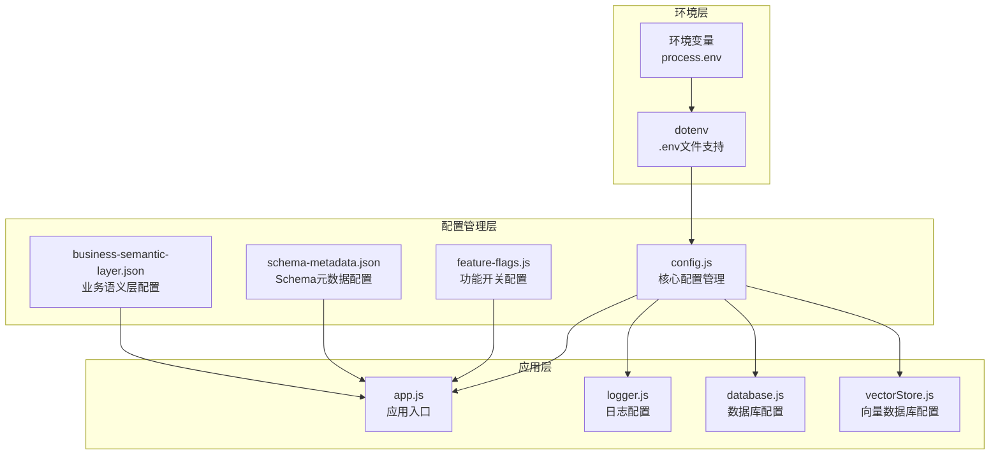
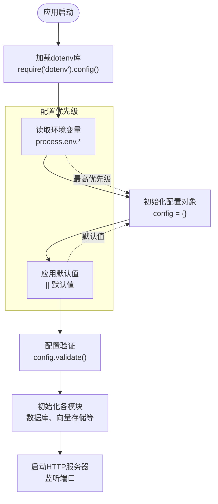
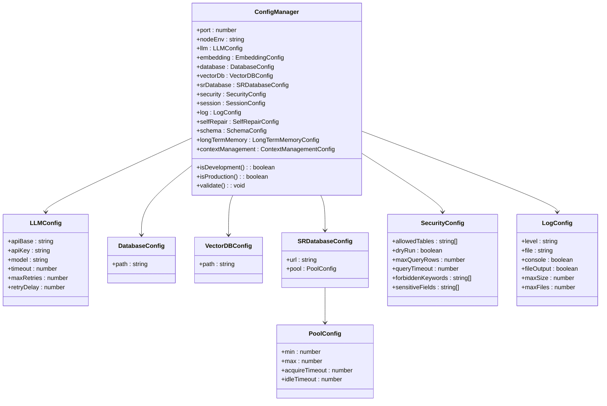
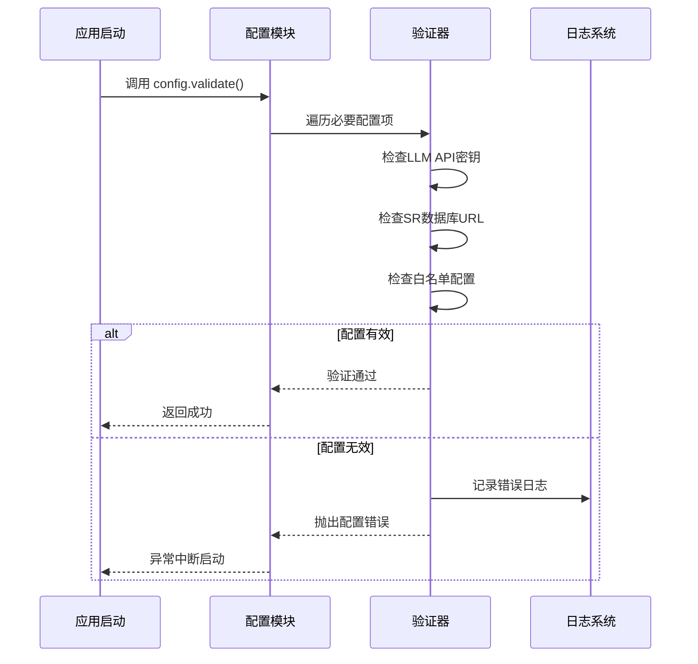
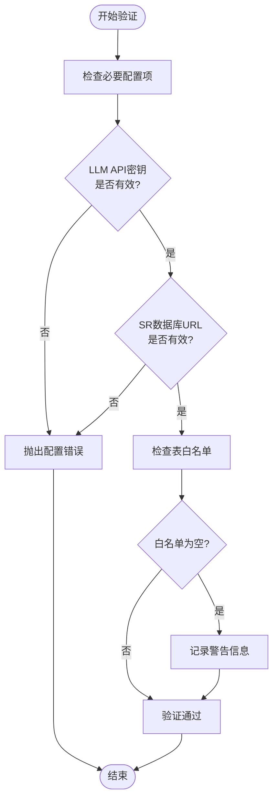
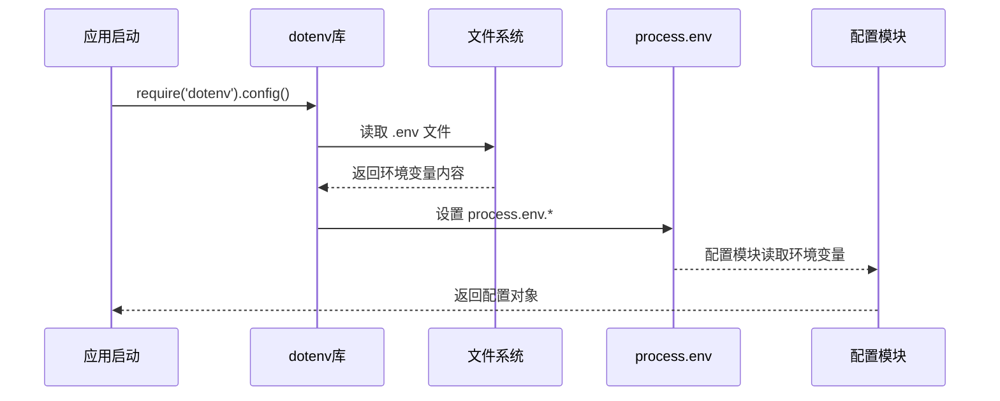
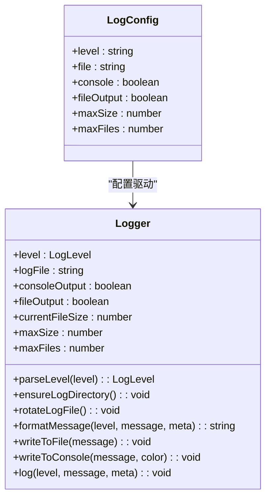
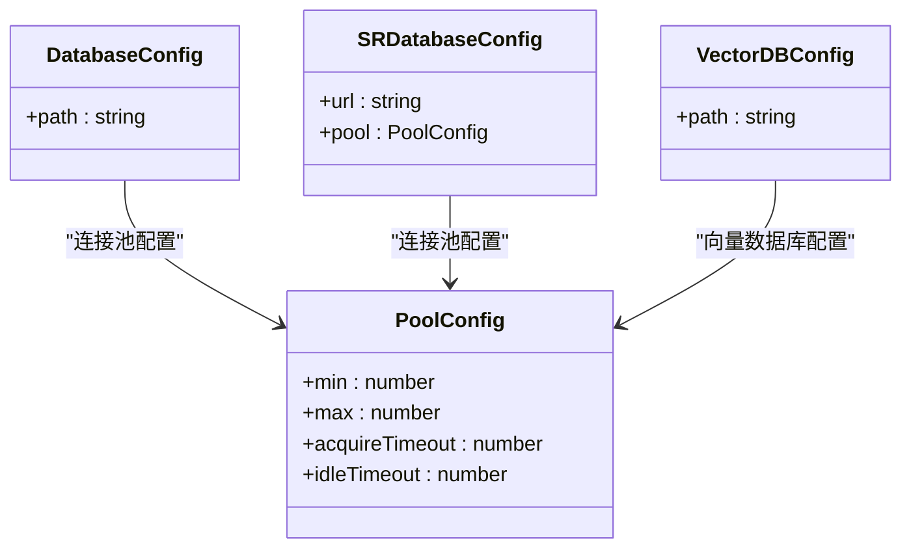
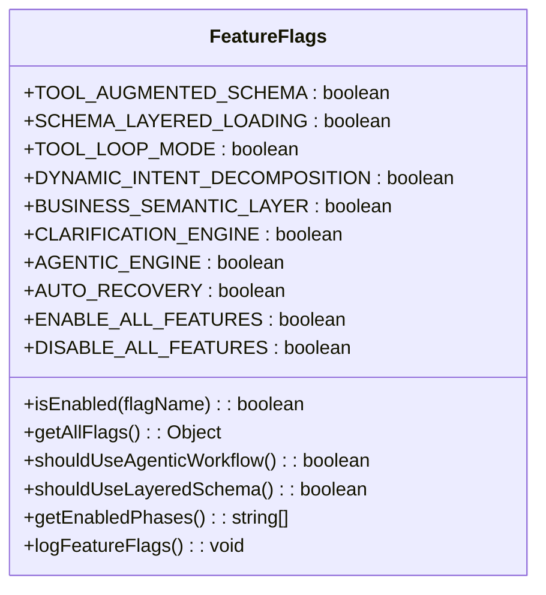
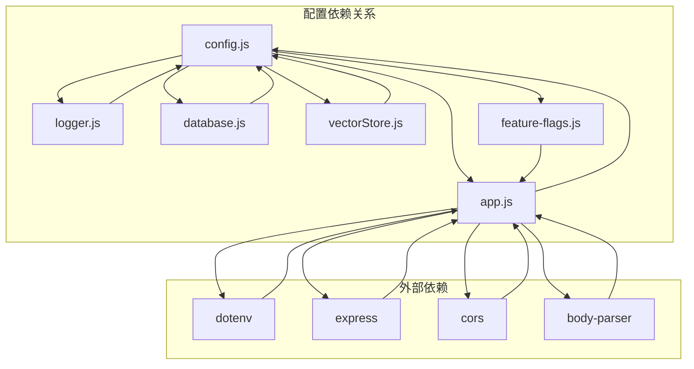

# 核心配置管理

<cite>
**本文引用的文件**
- [config.js](file://backend/src/core/config.js)
- [app.js](file://backend/src/app.js)
- [logger.js](file://backend/src/utils/logger.js)
- [database.js](file://backend/src/core/database.js)
- [vectorStore.js](file://backend/src/memory/vectorStore.js)
- [feature-flags.js](file://backend/config/feature-flags.js)
- [business-semantic-layer.json](file://backend/config/business-semantic-layer.json)
- [schema-metadata.example.json](file://backend/config/schema-metadata.example.json)
- [package.json](file://backend/package.json)
</cite>

## 目录
1. [简介](#简介)
2. [项目结构](#项目结构)
3. [核心组件](#核心组件)
4. [架构概览](#架构概览)
5. [详细组件分析](#详细组件分析)
6. [依赖分析](#依赖分析)
7. [性能考虑](#性能考虑)
8. [故障排除指南](#故障排除指南)
9. [结论](#结论)

## 简介

NL2SQL项目的核心配置管理系统是一个集中式的配置管理模块，负责统一管理应用的所有配置项。该系统采用环境变量驱动的设计模式，提供了完整的配置加载、验证、分层管理和热更新支持机制。

配置管理模块的主要目标是：
- 统一管理所有应用配置，避免配置散落在各个文件中
- 提供环境变量优先的配置加载机制
- 实现配置的分层结构和类型验证
- 支持配置的热更新和优雅重启
- 提供完整的配置验证和错误处理机制

## 项目结构

NL2SQL项目的配置管理分布在多个层次中，形成了清晰的分层架构：

**图表来源**
- [config.js:1-398](file://backend/src/core/config.js#L1-L398)
- [app.js:15-40](file://backend/src/app.js#L15-L40)

**章节来源**
- [config.js:1-398](file://backend/src/core/config.js#L1-L398)
- [app.js:15-40](file://backend/src/app.js#L15-L40)

## 核心组件

### 配置加载顺序和优先级

NL2SQL配置系统遵循严格的加载顺序和优先级规则：

**图表来源**
- [app.js:15-107](file://backend/src/app.js#L15-L107)
- [config.js:366-397](file://backend/src/core/config.js#L366-L397)

### 配置分层结构

配置系统采用分层设计，将不同类型的配置参数组织在相应的层级中：

#### 服务器基础配置
- **端口配置**: `config.port` - 服务监听端口，默认3000
- **环境配置**: `config.nodeEnv` - 运行环境，development/production
- **环境检测**: `config.isDevelopment()` 和 `config.isProduction()`

#### LLM服务配置
- **API基础配置**: `config.llm.apiBase`, `config.llm.apiKey`, `config.llm.model`
- **请求超时**: `config.llm.timeout` - 默认60000ms
- **重试机制**: `config.llm.maxRetries`, `config.llm.retryDelay`
- **Embedding配置**: `config.embedding.model`, `config.embedding.dimension`, `config.embedding.timeout`

#### 数据库配置
- **SQLite配置**: `config.database.path` - 会话历史存储
- **LanceDB配置**: `config.vectorDb.path` - 向量数据库存储
- **SR数据库配置**: `config.srDatabase.url` - 业务数据库连接
- **连接池配置**: `config.srDatabase.pool` - 连接池参数

#### 安全配置
- **表白名单**: `config.security.allowedTables` - 允许访问的数据表
- **Dry Run模式**: `config.security.dryRun` - 仅生成SQL不执行
- **查询限制**: `config.security.maxQueryRows`, `config.security.queryTimeout`
- **关键字过滤**: `config.security.forbiddenKeywords`
- **敏感字段**: `config.security.sensitiveFields`

#### 会话配置
- **历史保留**: `config.session.maxHistory` - 最大消息数
- **过期时间**: `config.session.expireTime` - 会话过期时间
- **清理间隔**: `config.session.cleanupInterval` - 过期清理间隔

#### 日志配置
- **日志级别**: `config.log.level` - trace/debug/info/warn/error
- **输出配置**: `config.log.console`, `config.log.fileOutput`
- **文件轮转**: `config.log.maxSize`, `config.log.maxFiles`

#### 高级功能配置
- **自修复机制**: `config.selfRepair.enabled`, `config.selfRepair.dailyCheckCron`
- **Schema缓存**: `config.schema.enableCache`, `config.schema.cacheExpireTime`
- **长期记忆**: `config.longTermMemory.enabled`, `config.longTermMemory.useLLMForExtraction`
- **上下文管理**: `config.contextManagement.enableTokenBudget`, `config.contextManagement.enableSummarizer`

**章节来源**
- [config.js:16-355](file://backend/src/core/config.js#L16-L355)

## 架构概览

配置管理系统的核心架构如下：

**图表来源**
- [config.js:16-355](file://backend/src/core/config.js#L16-L355)

## 详细组件分析

### 配置验证机制

配置验证是确保系统稳定运行的关键组件，采用了严格的安全检查机制：

**图表来源**
- [config.js:366-397](file://backend/src/core/config.js#L366-L397)

#### 必要配置项检查
验证系统会检查以下关键配置项：
- **LLM API密钥**: 必须设置有效的API密钥
- **SR数据库连接URL**: 必须提供有效的数据库连接信息
- **白名单配置**: 生产环境建议配置表白名单

#### 配置验证流程

**图表来源**
- [config.js:366-397](file://backend/src/core/config.js#L366-L397)

**章节来源**
- [config.js:366-397](file://backend/src/core/config.js#L366-L397)

### 环境变量处理机制

NL2SQL采用dotenv库来处理环境变量，提供了灵活的配置加载机制：

#### 环境变量加载流程

**图表来源**
- [app.js:15-16](file://backend/src/app.js#L15-L16)

#### 配置优先级规则

配置系统遵循以下优先级规则：
1. **环境变量** - 最高优先级，直接覆盖默认值
2. **默认值** - 当环境变量未设置时使用
3. **类型转换** - 自动进行类型转换（parseInt等）

**章节来源**
- [app.js:15-16](file://backend/src/app.js#L15-L16)
- [config.js:25-33](file://backend/src/core/config.js#L25-L33)

### 日志配置系统

日志系统实现了完整的配置驱动机制，支持多种输出方式和轮转策略：

#### 日志配置结构

**图表来源**
- [config.js:195-213](file://backend/src/core/config.js#L195-L213)
- [logger.js:54-98](file://backend/src/utils/logger.js#L54-L98)

#### 日志级别和输出策略

日志系统支持以下级别和输出策略：
- **级别**: trace, debug, info, warn, error
- **输出**: 控制台输出、文件输出、双输出
- **轮转**: 基于大小的文件轮转，支持多文件备份

**章节来源**
- [logger.js:29-44](file://backend/src/utils/logger.js#L29-L44)
- [logger.js:147-179](file://backend/src/utils/logger.js#L147-L179)

### 数据库配置管理

数据库配置系统提供了灵活的连接管理和池化支持：

#### 数据库配置结构

**图表来源**
- [config.js:97-130](file://backend/src/core/config.js#L97-L130)
- [config.js:106-109](file://backend/src/core/config.js#L106-L109)

#### 连接池配置参数

| 参数 | 默认值 | 说明 |
|------|--------|------|
| `min` | 2 | 最小连接数 |
| `max` | 10 | 最大连接数 |
| `acquireTimeout` | 30000ms | 获取连接超时时间 |
| `idleTimeout` | 600000ms | 空闲连接超时时间 |

**章节来源**
- [config.js:115-130](file://backend/src/core/config.js#L115-L130)

### 功能开关配置系统

功能开关系统提供了渐进式功能发布和快速回滚能力：

#### 功能开关结构

**图表来源**
- [feature-flags.js:16-96](file://backend/config/feature-flags.js#L16-L96)

#### 功能开关优先级

功能开关遵循以下优先级规则：
1. **全局禁用** - `DISABLE_ALL_FEATURES` 优先级最高
2. **全局启用** - `ENABLE_ALL_FEATURES` 次之
3. **具体开关** - 最后考虑具体的功能开关

**章节来源**
- [feature-flags.js:108-121](file://backend/config/feature-flags.js#L108-L121)

## 依赖分析

配置管理系统与其他组件的依赖关系如下：

**图表来源**
- [app.js:39-49](file://backend/src/app.js#L39-L49)
- [config.js:395-397](file://backend/src/core/config.js#L395-L397)

**章节来源**
- [app.js:39-49](file://backend/src/app.js#L39-L49)
- [package.json:10-26](file://backend/package.json#L10-L26)

## 性能考虑

配置管理系统在性能方面考虑了以下因素：

### 配置加载性能
- **延迟加载**: 配置在应用启动时一次性加载，避免重复解析
- **类型转换优化**: 使用parseInt等原生方法进行类型转换
- **默认值缓存**: 默认值在模块加载时确定，减少运行时计算

### 内存使用优化
- **配置对象复用**: 配置对象在整个应用生命周期内复用
- **环境变量共享**: process.env作为共享的环境变量存储
- **日志轮转**: 文件轮转机制避免日志文件无限增长

### 并发安全性
- **配置不可变性**: 配置对象在运行时保持不变
- **线程安全**: 环境变量读取是线程安全的操作
- **异步初始化**: 数据库和向量存储的初始化采用异步方式

## 故障排除指南

### 常见配置错误及解决方案

#### LLM配置错误
**问题**: LLM API密钥未设置或无效
**症状**: 应用启动时报配置错误
**解决方案**: 
1. 检查 `.env` 文件中的 `LLM_API_KEY` 配置
2. 确认API密钥格式正确
3. 验证API服务可用性

#### 数据库连接错误
**问题**: SR数据库连接失败
**症状**: 应用启动时报数据库连接错误
**解决方案**:
1. 检查 `SR_DATABASE_URL` 配置格式
2. 验证数据库服务可达性
3. 确认数据库凭据正确

#### 环境变量加载失败
**问题**: .env文件未被正确加载
**症状**: 配置项使用默认值而非期望值
**解决方案**:
1. 确认 `.env` 文件位于项目根目录
2. 检查文件权限和格式
3. 验证dotenv库版本兼容性

#### 日志配置问题
**问题**: 日志文件无法写入
**症状**: 控制台显示文件写入失败警告
**解决方案**:
1. 检查日志文件路径权限
2. 确认磁盘空间充足
3. 验证文件系统写入权限

#### 功能开关冲突
**问题**: 功能开关状态不符合预期
**症状**: 某些功能未按预期启用或禁用
**解决方案**:
1. 检查全局开关优先级
2. 验证具体功能开关配置
3. 查看功能开关状态日志

**章节来源**
- [config.js:366-397](file://backend/src/core/config.js#L366-L397)
- [logger.js:219-222](file://backend/src/utils/logger.js#L219-L222)

### 配置验证和调试

#### 配置验证流程
1. **启动时验证**: 应用启动时自动执行配置验证
2. **必要项检查**: 检查关键配置项是否设置
3. **白名单警告**: 生产环境提示白名单配置
4. **异常处理**: 验证失败时记录详细错误信息

#### 调试技巧
- **功能开关日志**: 使用 `logFeatureFlags()` 查看当前功能状态
- **配置导出**: 通过模块导出查看完整配置对象
- **环境变量检查**: 在启动前打印关键环境变量

**章节来源**
- [app.js:158-163](file://backend/src/app.js#L158-L163)
- [feature-flags.js:209-229](file://backend/config/feature-flags.js#L209-L229)

## 结论

NL2SQL的核心配置管理系统展现了现代Node.js应用的最佳实践：

### 设计优势
- **集中化管理**: 所有配置集中在单一模块中，便于维护
- **环境变量优先**: 支持灵活的环境配置切换
- **类型安全**: 提供基本的类型转换和验证机制
- **扩展性强**: 支持新增配置项而无需修改现有代码

### 关键特性
- **完整的验证机制**: 启动时自动验证关键配置
- **灵活的输出策略**: 支持多种日志输出方式
- **渐进式功能发布**: 通过功能开关实现平滑的功能发布
- **优雅的错误处理**: 提供详细的错误信息和恢复策略

### 改进建议
1. **配置热更新**: 考虑实现配置的热更新机制
2. **配置加密**: 对敏感配置项提供加密存储
3. **配置审计**: 添加配置变更的审计日志
4. **配置模板**: 提供完整的配置模板文件

该配置管理系统为NL2SQL项目提供了坚实的基础，确保了应用在不同环境下的稳定运行和可维护性。