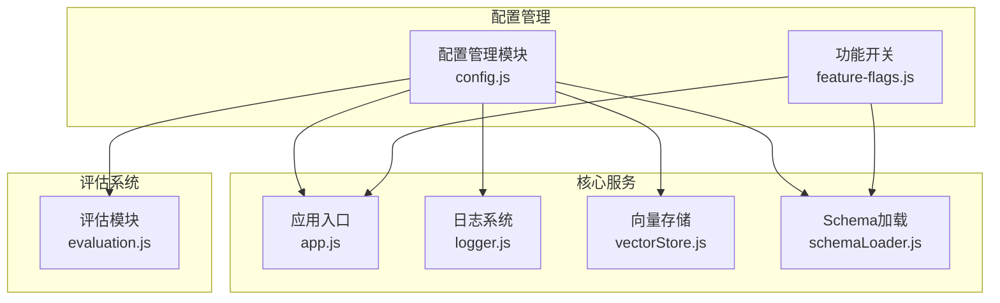
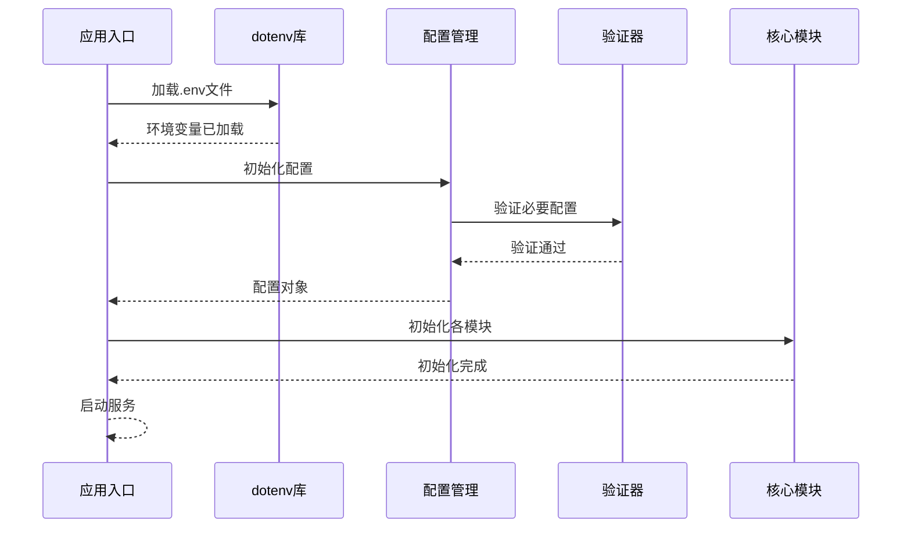
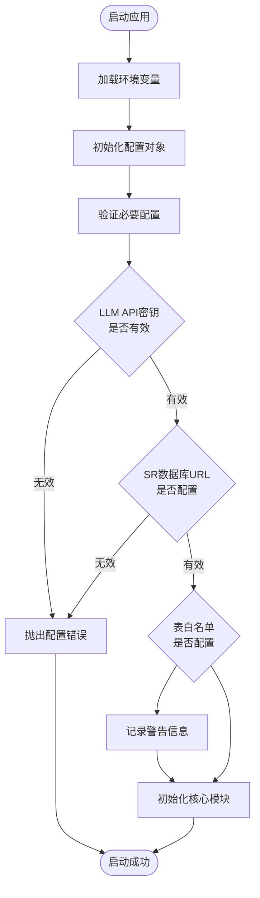
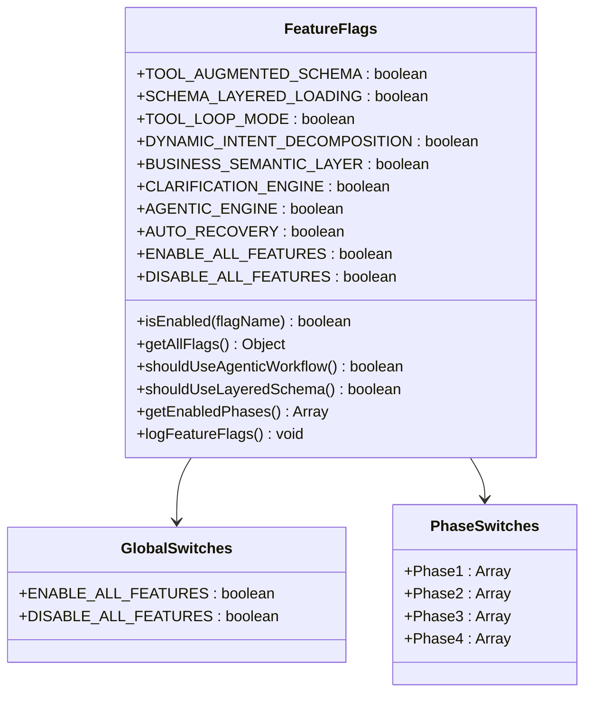
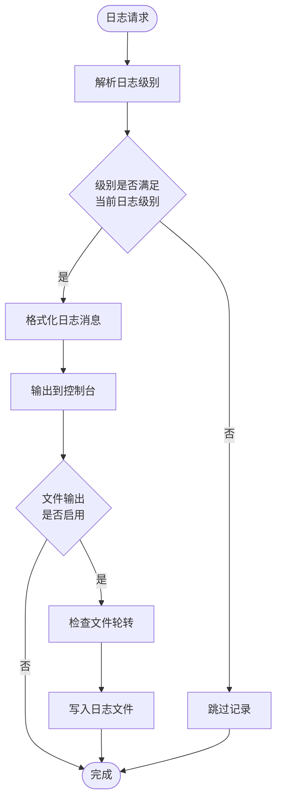
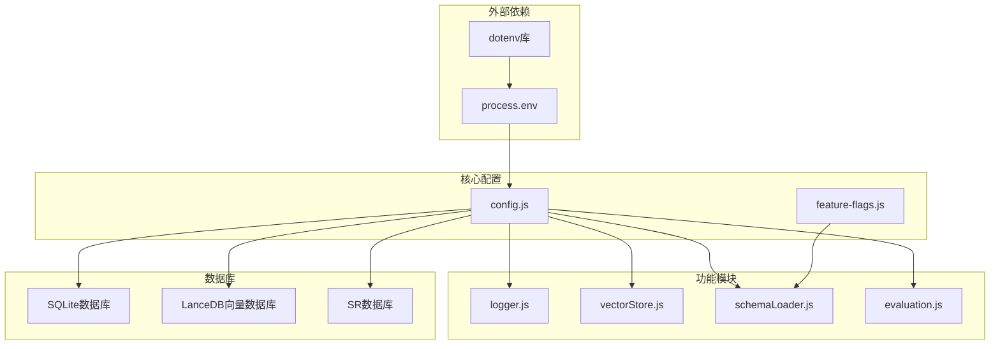
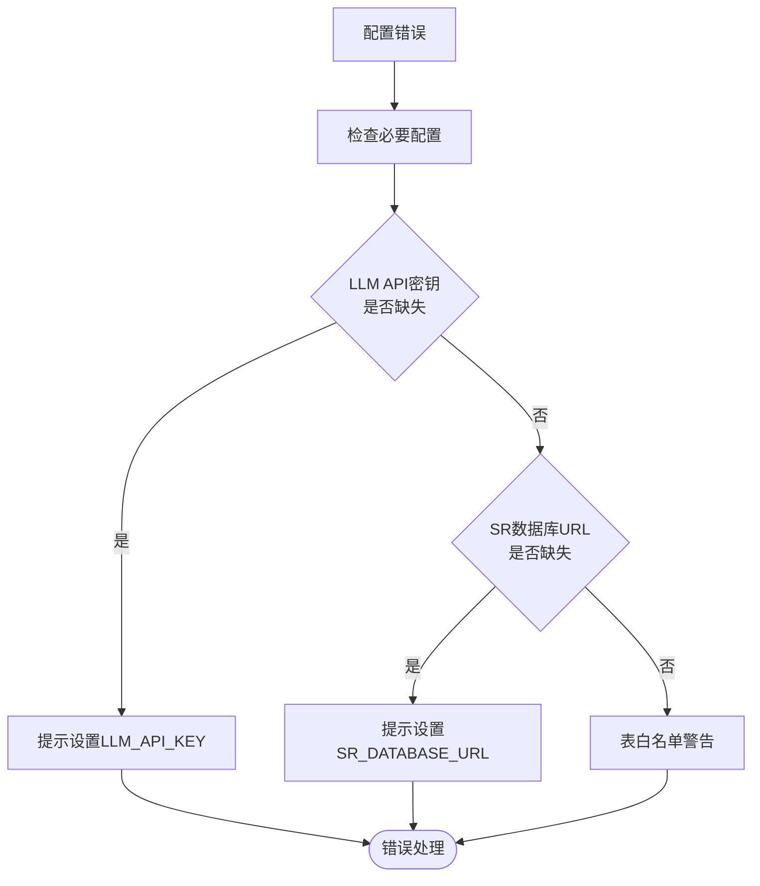

# 环境变量配置

<cite>
**本文档引用的文件**
- [backend/src/app.js](file://backend/src/app.js)
- [backend/src/core/config.js](file://backend/src/core/config.js)
- [backend/config/feature-flags.js](file://backend/config/feature-flags.js)
- [backend/src/utils/logger.js](file://backend/src/utils/logger.js)
- [backend/src/memory/vectorStore.js](file://backend/src/memory/vectorStore.js)
- [backend/src/core/schemaLoader.js](file://backend/src/core/schemaLoader.js)
- [backend/src/utils/evaluation.js](file://backend/src/utils/evaluation.js)
- [backend/package.json](file://backend/package.json)
</cite>

## 目录
1. [简介](#简介)
2. [项目结构](#项目结构)
3. [核心组件](#核心组件)
4. [架构概览](#架构概览)
5. [详细组件分析](#详细组件分析)
6. [依赖分析](#依赖分析)
7. [性能考虑](#性能考虑)
8. [故障排除指南](#故障排除指南)
9. [结论](#结论)
10. [附录](#附录)

## 简介

NL2SQL系统采用集中式环境变量配置管理模式，通过统一的配置管理模块集中管理所有运行时配置。该系统支持多种部署环境，包括开发、测试和生产环境，并提供了完善的功能开关机制来控制新特性的渐进式发布。

系统的核心配置管理采用以下设计理念：
- **单一真相源**：所有配置从环境变量读取，避免配置分散在代码中
- **层次化配置**：支持基础配置、功能配置、安全配置等多个层次
- **运行时验证**：启动时验证关键配置的有效性
- **动态加载**：支持功能开关的动态控制

## 项目结构

NL2SQL项目的环境变量配置主要分布在以下几个关键位置：

**图表来源**
- [backend/src/core/config.js:1-398](file://backend/src/core/config.js#L1-L398)
- [backend/config/feature-flags.js:1-249](file://backend/config/feature-flags.js#L1-L249)

**章节来源**
- [backend/src/app.js:15-40](file://backend/src/app.js#L15-L40)
- [backend/src/core/config.js:16-398](file://backend/src/core/config.js#L16-L398)

## 核心组件

### 配置管理模块

配置管理模块是整个系统的核心，负责统一管理所有环境变量配置。该模块采用嵌套对象结构，将配置按照功能领域进行分类管理。

#### 主要配置类别

1. **服务器基础配置**
   - 端口号 (PORT)
   - 运行环境 (NODE_ENV)
   - 环境检测方法

2. **LLM API配置**
   - API基础URL (LLM_API_BASE)
   - API密钥 (LLM_API_KEY)
   - 模型名称 (LLM_MODEL)
   - 请求超时 (LLM_TIMEOUT)
   - 重试机制

3. **数据库配置**
   - SQLite数据库路径 (DB_PATH)
   - LanceDB向量数据库路径 (VECTOR_DB_PATH)
   - SR数据库连接URL (SR_DATABASE_URL)
   - 连接池配置

4. **安全配置**
   - 表白名单 (ALLOWED_TABLES)
   - 干运行模式 (DRY_RUN)
   - 查询限制 (MAX_QUERY_ROWS, QUERY_TIMEOUT)
   - 关键字过滤
   - 敏感字段脱敏

5. **日志配置**
   - 日志级别 (LOG_LEVEL)
   - 日志文件路径 (LOG_FILE)
   - 控制台输出
   - 文件轮转

6. **功能开关配置**
   - Phase 1: 工具化Schema探索
   - Phase 2: 动态意图拆解
   - Phase 3: 澄清机制
   - Phase 4: 多步推理与自我修正

**章节来源**
- [backend/src/core/config.js:16-355](file://backend/src/core/config.js#L16-L355)
- [backend/config/feature-flags.js:16-96](file://backend/config/feature-flags.js#L16-L96)

## 架构概览

系统采用集中式配置管理模式，通过dotenv库加载环境变量，然后由配置管理模块统一处理和验证。

**图表来源**
- [backend/src/app.js:97-194](file://backend/src/app.js#L97-L194)
- [backend/src/core/config.js:366-388](file://backend/src/core/config.js#L366-L388)

## 详细组件分析

### 配置验证机制

系统在启动时执行严格的配置验证，确保关键配置的完整性。

**图表来源**
- [backend/src/core/config.js:366-388](file://backend/src/core/config.js#L366-L388)

#### 必要配置项

系统要求以下配置项必须正确设置：

1. **LLM API密钥** (`LLM_API_KEY`)
   - 用于身份验证和API访问
   - 必须是非空的有效密钥

2. **SR数据库连接URL** (`SR_DATABASE_URL`)
   - 用于连接业务数据库
   - 支持MySQL等数据库连接格式

#### 配置验证规则

- 空值检查：所有必需配置不能为null或空字符串
- 默认值处理：未设置的配置使用预定义的默认值
- 白名单警告：允许访问所有表的配置会发出安全警告

**章节来源**
- [backend/src/core/config.js:366-388](file://backend/src/core/config.js#L366-L388)

### 功能开关系统

系统实现了完整的功能开关机制，支持渐进式功能发布和快速回滚。

**图表来源**
- [backend/config/feature-flags.js:16-96](file://backend/config/feature-flags.js#L16-L96)

#### 功能开关优先级

功能开关遵循以下优先级规则：

1. **全局禁用** (`DISABLE_ALL_FEATURES`)
   - 优先级最高，强制禁用所有功能
   - 用于紧急回滚场景

2. **全局启用** (`ENABLE_ALL_FEATURES`)
   - 优先级次之，强制启用所有功能
   - 用于快速部署场景

3. **具体开关** (各功能开关)
   - 最低优先级，控制具体功能的启用状态

**章节来源**
- [backend/config/feature-flags.js:108-121](file://backend/config/feature-flags.js#L108-L121)

### 日志配置系统

日志系统支持灵活的配置选项，可以根据不同的部署环境调整日志行为。

**图表来源**
- [backend/src/utils/logger.js:246-264](file://backend/src/utils/logger.js#L246-L264)

#### 日志级别配置

系统支持以下日志级别：
- TRACE：最详细，用于深度调试
- DEBUG：详细调试信息
- INFO：一般信息（默认）
- WARN：警告信息
- ERROR：错误信息

#### 日志文件轮转

- 最大文件大小：10MB
- 保留历史文件数量：5个
- 自动轮转机制

**章节来源**
- [backend/src/utils/logger.js:33-44](file://backend/src/utils/logger.js#L33-L44)
- [backend/src/utils/logger.js:147-179](file://backend/src/utils/logger.js#L147-L179)

## 依赖分析

系统对环境变量的依赖关系如下：

**图表来源**
- [backend/src/app.js:15-16](file://backend/src/app.js#L15-L16)
- [backend/src/core/config.js:1-15](file://backend/src/core/config.js#L1-L15)

### 配置依赖关系

系统中各模块对配置的依赖关系：

1. **应用入口** (`app.js`)
   - 依赖配置验证
   - 依赖数据库初始化
   - 依赖向量存储初始化

2. **日志系统** (`logger.js`)
   - 依赖日志级别配置
   - 依赖日志文件配置
   - 依赖文件轮转配置

3. **向量存储** (`vectorStore.js`)
   - 依赖向量数据库路径配置
   - 依赖嵌入模型配置
   - 依赖评估配置

4. **Schema加载** (`schemaLoader.js`)
   - 依赖Schema配置路径
   - 依赖重新向量化配置
   - 依赖评估配置

**章节来源**
- [backend/src/app.js:97-194](file://backend/src/app.js#L97-L194)
- [backend/src/utils/logger.js:59-98](file://backend/src/utils/logger.js#L59-L98)

## 性能考虑

### 配置加载性能

- **延迟加载**：非关键配置采用延迟加载策略
- **缓存机制**：Schema元数据支持缓存，减少重复加载
- **连接池优化**：数据库连接池配置优化连接复用

### 环境变量处理性能

- **类型转换**：数值类型的环境变量进行一次性转换
- **字符串处理**：逗号分隔的配置项进行批量处理
- **默认值优化**：合理设置默认值减少配置检查开销

## 故障排除指南

### 常见配置错误

#### 1. LLM API配置错误

**症状**：应用启动时报API密钥相关错误

**解决方案**：
- 确认 `LLM_API_KEY` 环境变量已正确设置
- 验证API密钥格式是否正确
- 检查API服务的可用性

#### 2. 数据库连接失败

**症状**：应用启动时报数据库连接错误

**解决方案**：
- 验证 `SR_DATABASE_URL` 格式是否正确
- 检查数据库服务是否正常运行
- 确认网络连接和防火墙设置

#### 3. 功能开关冲突

**症状**：功能开关状态不符合预期

**解决方案**：
- 检查 `ENABLE_ALL_FEATURES` 和 `DISABLE_ALL_FEATURES` 的设置
- 确认具体功能开关的状态
- 验证功能开关的优先级关系

#### 4. 日志配置问题

**症状**：日志输出异常或文件无法创建

**解决方案**：
- 检查 `LOG_FILE` 路径权限
- 验证磁盘空间是否充足
- 确认日志级别配置是否合理

### 配置验证错误

系统提供详细的配置验证错误信息：

**图表来源**
- [backend/src/core/config.js:374-382](file://backend/src/core/config.js#L374-L382)

**章节来源**
- [backend/src/core/config.js:366-388](file://backend/src/core/config.js#L366-L388)

## 结论

NL2SQL系统的环境变量配置设计体现了现代微服务架构的最佳实践：

1. **集中化管理**：通过统一的配置管理模块避免配置分散
2. **层次化组织**：按照功能领域对配置进行分类管理
3. **运行时验证**：启动时验证关键配置确保系统稳定性
4. **动态控制**：功能开关机制支持灵活的功能发布策略
5. **安全考虑**：提供安全配置选项防止未授权访问

该配置系统为不同部署环境提供了灵活的支持，同时确保了系统的可维护性和可扩展性。

## 附录

### 环境变量配置清单

#### 基础配置
- `PORT`: 服务监听端口（默认：3000）
- `NODE_ENV`: 运行环境（development/production）

#### LLM配置
- `LLM_API_BASE`: LLM API基础URL（默认：https://api.openai.com/v1）
- `LLM_API_KEY`: LLM API密钥
- `LLM_MODEL`: 模型名称（默认：gpt-4）
- `LLM_TIMEOUT`: 请求超时时间（毫秒）

#### 数据库配置
- `DB_PATH`: SQLite数据库文件路径（默认：./data/sessions.db）
- `VECTOR_DB_PATH`: LanceDB向量数据库路径（默认：./data/vectordb）
- `SR_DATABASE_URL`: SR数据库连接URL

#### 安全配置
- `ALLOWED_TABLES`: 允许访问的表白名单（逗号分隔）
- `DRY_RUN`: 干运行模式（true/false）
- `MAX_QUERY_ROWS`: 查询结果行数限制
- `QUERY_TIMEOUT`: 查询超时时间（毫秒）

#### 日志配置
- `LOG_LEVEL`: 日志级别（trace/debug/info/warn/error）
- `LOG_FILE`: 日志文件路径（默认：./logs/app.log）

#### 功能开关配置
- `FF_TOOL_AUGMENTED_SCHEMA`: 工具化Schema探索
- `FF_SCHEMA_LAYERED_LOADING`: 分层加载
- `FF_TOOL_LOOP_MODE`: 工具循环模式
- `FF_DYNAMIC_INTENT_DECOMPOSITION`: 动态意图拆解
- `FF_BUSINESS_SEMANTIC_LAYER`: 业务语义层
- `FF_CLARIFICATION_ENGINE`: 澄清引擎
- `FF_AGENTIC_ENGINE`: Agentic引擎
- `FF_AUTO_RECOVERY`: 自我修正
- `FF_ENABLE_ALL`: 启用所有功能
- `FF_DISABLE_ALL`: 禁用所有功能

#### 评估配置
- `EVALUATION_ENABLED`: 启用评估功能
- `EVALUATION_TRACK_STATS`: 启用统计跟踪

#### 上下文管理配置
- `ENABLE_TOKEN_BUDGET`: 启用Token预算检查
- `ENABLE_SUMMARIZER`: 启用对话摘要
- `MAX_CONTEXT_TOKENS`: 最大上下文Token数
- `RESERVED_OUTPUT_TOKENS`: 预留输出Token数

#### 长期记忆配置
- `LTM_ENABLED`: 启用长期记忆（默认：true）
- `LTM_USE_LLM`: 使用LLM进行智能提炼（默认：false）

**章节来源**
- [backend/src/core/config.js:26-355](file://backend/src/core/config.js#L26-L355)
- [backend/config/feature-flags.js:25-95](file://backend/config/feature-flags.js#L25-L95)