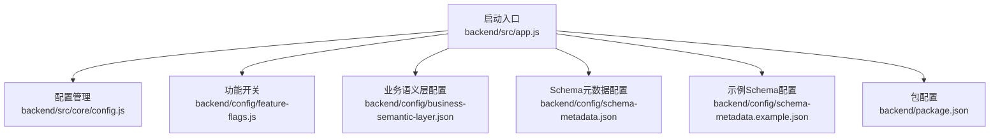
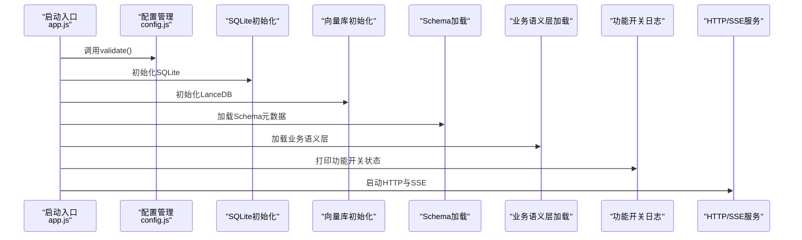
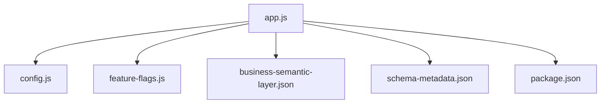

# 配置与定制

<cite>
**本文引用的文件**
- [backend/src/app.js](file://backend/src/app.js)
- [backend/src/core/config.js](file://backend/src/core/config.js)
- [backend/config/feature-flags.js](file://backend/config/feature-flags.js)
- [backend/config/business-semantic-layer.json](file://backend/config/business-semantic-layer.json)
- [backend/config/schema-metadata.json](file://backend/config/schema-metadata.json)
- [backend/config/schema-metadata.example.json](file://backend/config/schema-metadata.example.json)
- [backend/package.json](file://backend/package.json)
</cite>

## 目录
1. [简介](#简介)
2. [项目结构](#项目结构)
3. [核心配置项](#核心配置项)
4. [架构概览](#架构概览)
5. [详细组件分析](#详细组件分析)
6. [依赖关系分析](#依赖关系分析)
7. [性能考量](#性能考量)
8. [故障排除指南](#故障排除指南)
9. [结论](#结论)
10. [附录](#附录)

## 简介
本指南面向NL2SQL项目的配置与定制需求，覆盖环境变量、功能开关、性能参数、安全设置、配置文件结构与作用，并提供最佳实践、A/B测试策略、验证与故障排除方法。目标是帮助你在不同环境中稳定、安全、高性能地部署与扩展NL2SQL能力。

## 项目结构
后端采用模块化设计，配置集中于统一的配置模块，关键配置文件位于backend/config目录，核心启动入口在backend/src/app.js中完成初始化与服务启动。

**图表来源**
- [backend/src/app.js:15-50](file://backend/src/app.js#L15-L50)
- [backend/src/core/config.js:16-398](file://backend/src/core/config.js#L16-L398)
- [backend/config/feature-flags.js:16-249](file://backend/config/feature-flags.js#L16-L249)
- [backend/config/business-semantic-layer.json:1-189](file://backend/config/business-semantic-layer.json#L1-L189)
- [backend/config/schema-metadata.json:1-800](file://backend/config/schema-metadata.json#L1-L800)
- [backend/config/schema-metadata.example.json:1-328](file://backend/config/schema-metadata.example.json#L1-L328)
- [backend/package.json:1-28](file://backend/package.json#L1-L28)

**章节来源**
- [backend/src/app.js:15-194](file://backend/src/app.js#L15-L194)
- [backend/src/core/config.js:16-398](file://backend/src/core/config.js#L16-L398)
- [backend/config/feature-flags.js:16-249](file://backend/config/feature-flags.js#L16-L249)
- [backend/config/business-semantic-layer.json:1-189](file://backend/config/business-semantic-layer.json#L1-L189)
- [backend/config/schema-metadata.json:1-800](file://backend/config/schema-metadata.json#L1-L800)
- [backend/config/schema-metadata.example.json:1-328](file://backend/config/schema-metadata.example.json#L1-L328)
- [backend/package.json:1-28](file://backend/package.json#L1-L28)

## 核心配置项
本节梳理所有可配置项，包括环境变量、功能开关、性能参数与安全设置，以及它们的作用范围与默认值来源。

- 服务器基础配置
  - 端口：从环境变量读取，默认3000
  - 运行环境：development/production，影响日志与性能
  - 开发/生产判断：提供便捷方法
  - 参考路径：[backend/src/core/config.js:22-49](file://backend/src/core/config.js#L22-L49)

- LLM API配置
  - 基础URL：兼容OpenAI API格式
  - API密钥：必填
  - 默认模型：可选
  - 请求超时：毫秒，默认60000
  - 重试次数与间隔：固定默认
  - 参考路径：[backend/src/core/config.js:60-74](file://backend/src/core/config.js#L60-L74)

- Embedding模型配置
  - 模型名称：可选
  - 维度：固定默认
  - 超时：毫秒，默认60000
  - 参考路径：[backend/src/core/config.js:80-87](file://backend/src/core/config.js#L80-L87)

- 数据库配置
  - SQLite路径：会话与日志存储
  - LanceDB路径：向量存储
  - SR数据库URL：必填
  - 连接池：最小/最大连接数、获取/空闲超时
  - 参考路径：[backend/src/core/config.js:97-130](file://backend/src/core/config.js#L97-L130)

- 安全配置
  - 白名单表：仅允许访问白名单中的表
  - Dry-run：仅生成SQL不执行
  - 最大返回行数：防过大响应
  - 查询超时：毫秒
  - 禁止关键字：防止危险SQL
  - 敏感字段：结果脱敏
  - 参考路径：[backend/src/core/config.js:140-170](file://backend/src/core/config.js#L140-L170)

- 会话配置
  - 历史消息上限、过期时间、清理间隔
  - 参考路径：[backend/src/core/config.js:179-186](file://backend/src/core/config.js#L179-L186)

- 日志配置
  - 级别、文件路径、控制台/文件输出、轮转大小与文件数
  - 参考路径：[backend/src/core/config.js:195-213](file://backend/src/core/config.js#L195-L213)

- 自修复配置
  - 启用、每日检查Cron、会话检查间隔、慢查询阈值
  - 参考路径：[backend/src/core/config.js:222-231](file://backend/src/core/config.js#L222-L231)

- Schema配置
  - 配置文件路径、缓存开关与过期、强制重向量化
  - 参考路径：[backend/src/core/config.js:240-250](file://backend/src/core/config.js#L240-L250)

- 长期记忆配置（新增）
  - 启用、是否使用LLM提炼、阈值与分级保留策略
  - 参考路径：[backend/src/core/config.js:259-293](file://backend/src/core/config.js#L259-L293)

- 上下文管理配置（新增）
  - Token预算与摘要开关、预算阈值、摘要轮数与Token上限
  - 参考路径：[backend/src/core/config.js:303-333](file://backend/src/core/config.js#L303-L333)

- 评估配置（新增）
  - 启用、统计跟踪、相似度与质量阈值
  - 参考路径：[backend/src/core/config.js:342-354](file://backend/src/core/config.js#L342-L354)

- 配置验证
  - 必填项校验：LLM API密钥、SR数据库URL
  - 白名单为空警告
  - 参考路径：[backend/src/core/config.js:366-388](file://backend/src/core/config.js#L366-L388)

**章节来源**
- [backend/src/core/config.js:16-398](file://backend/src/core/config.js#L16-L398)

## 架构概览
NL2SQL启动流程围绕配置与初始化展开：加载.env、校验配置、初始化数据库与向量库、加载Schema与业务语义层、打印功能开关状态、启动HTTP与SSE服务。

**图表来源**
- [backend/src/app.js:97-194](file://backend/src/app.js#L97-L194)
- [backend/src/core/config.js:366-388](file://backend/src/core/config.js#L366-L388)

**章节来源**
- [backend/src/app.js:97-194](file://backend/src/app.js#L97-L194)

## 详细组件分析

### 配置文件结构与作用
- business-semantic-layer.json
  - 版本与描述
  - 概念映射：业务概念到物理表/字段，支持别名、优先级、示例
  - 查询模式：典型查询组合、所需/可选概念、典型表与连接键
  - 字段映射：常用字段取值的中文说明与映射
  - 数据源映射：逻辑数据源到真实数据库与表前缀
  - 参考路径：[backend/config/business-semantic-layer.json:1-189](file://backend/config/business-semantic-layer.json#L1-L189)

- schema-metadata.json
  - 版本与注释
  - 表清单：表名、中文名、描述、字段列表（含类型、中文名、描述、主键、时间粒度、聚合支持、外键等）
  - 关系与指标/维度：关系定义、指标公式、维度层级
  - 参考路径：[backend/config/schema-metadata.json:1-800](file://backend/config/schema-metadata.json#L1-L800)

- schema-metadata.example.json
  - 示例Schema，展示标准字段、关系、指标与维度的组织方式
  - 参考路径：[backend/config/schema-metadata.example.json:1-328](file://backend/config/schema-metadata.example.json#L1-L328)

- feature-flags.js
  - 功能开关：按Phase划分，支持全局启用/禁用
  - 检查函数：isEnabled、getAllFlags、shouldUseAgenticWorkflow、shouldUseLayeredSchema、getEnabledPhases
  - 日志输出：logFeatureFlags
  - 参考路径：[backend/config/feature-flags.js:16-249](file://backend/config/feature-flags.js#L16-L249)

- config.js
  - 统一配置对象，包含上述所有配置项
  - 配置验证：validateConfig
  - 参考路径：[backend/src/core/config.js:16-398](file://backend/src/core/config.js#L16-L398)

**章节来源**
- [backend/config/business-semantic-layer.json:1-189](file://backend/config/business-semantic-layer.json#L1-L189)
- [backend/config/schema-metadata.json:1-800](file://backend/config/schema-metadata.json#L1-L800)
- [backend/config/schema-metadata.example.json:1-328](file://backend/config/schema-metadata.example.json#L1-L328)
- [backend/config/feature-flags.js:16-249](file://backend/config/feature-flags.js#L16-L249)
- [backend/src/core/config.js:16-398](file://backend/src/core/config.js#L16-L398)

### 功能开关与A/B测试
- 功能开关定义与优先级
  - 全局禁用优先于全局启用
  - 具体开关值决定最终状态
  - 参考路径：[backend/config/feature-flags.js:108-121](file://backend/config/feature-flags.js#L108-L121)

- 工作流选择
  - Agentic工作流：当启用Agentic引擎时使用
  - 工具增强工作流：当启用工具循环模式时使用
  - 参考路径：[backend/config/feature-flags.js:149-161](file://backend/config/feature-flags.js#L149-L161)

- 分层Schema加载
  - 当启用Schema分层加载或工具增强Schema时启用
  - 参考路径：[backend/config/feature-flags.js:168-170](file://backend/config/feature-flags.js#L168-L170)

- A/B测试建议
  - 使用环境变量对不同实例进行分组，如FF_BUSINESS_SEMANTIC_LAYER=true/false
  - 通过白名单与Dry-run控制风险面
  - 参考路径：[backend/src/core/config.js:140-170](file://backend/src/core/config.js#L140-L170)

**章节来源**
- [backend/config/feature-flags.js:108-121](file://backend/config/feature-flags.js#L108-L121)
- [backend/config/feature-flags.js:149-161](file://backend/config/feature-flags.js#L149-L161)
- [backend/config/feature-flags.js:168-170](file://backend/config/feature-flags.js#L168-L170)
- [backend/src/core/config.js:140-170](file://backend/src/core/config.js#L140-L170)

### 配置验证与错误处理
- 启动时验证
  - 必填项：LLM API密钥、SR数据库URL
  - 白名单为空警告
  - 参考路径：[backend/src/core/config.js:366-388](file://backend/src/core/config.js#L366-L388)

- 启动流程中的错误处理
  - 初始化失败时记录错误并退出
  - 优雅关闭：关闭HTTP、SSE、定时任务、数据库连接
  - 参考路径：[backend/src/app.js:188-258](file://backend/src/app.js#L188-L258)

**章节来源**
- [backend/src/core/config.js:366-388](file://backend/src/core/config.js#L366-L388)
- [backend/src/app.js:188-258](file://backend/src/app.js#L188-L258)

## 依赖关系分析
- 启动入口依赖配置模块与各子系统初始化
- 配置模块集中管理所有可配置项
- 功能开关模块提供统一的开关检查与日志
- Schema与业务语义层配置文件作为外部输入参与初始化

**图表来源**
- [backend/src/app.js:39-50](file://backend/src/app.js#L39-L50)
- [backend/src/core/config.js:16-398](file://backend/src/core/config.js#L16-L398)
- [backend/config/feature-flags.js:16-249](file://backend/config/feature-flags.js#L16-L249)
- [backend/config/business-semantic-layer.json:1-189](file://backend/config/business-semantic-layer.json#L1-L189)
- [backend/config/schema-metadata.json:1-800](file://backend/config/schema-metadata.json#L1-L800)
- [backend/package.json:1-28](file://backend/package.json#L1-L28)

**章节来源**
- [backend/src/app.js:39-50](file://backend/src/app.js#L39-L50)
- [backend/src/core/config.js:16-398](file://backend/src/core/config.js#L16-L398)
- [backend/config/feature-flags.js:16-249](file://backend/config/feature-flags.js#L16-L249)
- [backend/config/business-semantic-layer.json:1-189](file://backend/config/business-semantic-layer.json#L1-L189)
- [backend/config/schema-metadata.json:1-800](file://backend/config/schema-metadata.json#L1-L800)
- [backend/package.json:1-28](file://backend/package.json#L1-L28)

## 性能考量
- LLM与Embedding超时：根据模型规模调整默认超时
- 连接池：合理设置最小/最大连接数与超时，避免资源争用
- 查询超时与行数限制：防止慢查询与大结果集
- 日志轮转：控制日志文件大小与数量，避免磁盘压力
- 自修复慢查询阈值：及时发现并优化慢查询
- Token预算与摘要：在长对话场景中控制上下文成本
- 参考路径：
  - [backend/src/core/config.js:67-73](file://backend/src/core/config.js#L67-L73)
  - [backend/src/core/config.js:85-87](file://backend/src/core/config.js#L85-L87)
  - [backend/src/core/config.js:119-130](file://backend/src/core/config.js#L119-L130)
  - [backend/src/core/config.js:154-156](file://backend/src/core/config.js#L154-L156)
  - [backend/src/core/config.js:209-212](file://backend/src/core/config.js#L209-L212)
  - [backend/src/core/config.js:229-231](file://backend/src/core/config.js#L229-L231)
  - [backend/src/core/config.js:313-320](file://backend/src/core/config.js#L313-L320)
  - [backend/src/core/config.js:324-332](file://backend/src/core/config.js#L324-L332)

## 故障排除指南
- 启动失败
  - 检查LLM API密钥与SR数据库URL是否配置
  - 查看配置验证日志与错误堆栈
  - 参考路径：[backend/src/core/config.js:366-388](file://backend/src/core/config.js#L366-L388)

- 功能开关未生效
  - 确认环境变量命名与值
  - 检查全局开关是否覆盖具体开关
  - 参考路径：[backend/config/feature-flags.js:108-121](file://backend/config/feature-flags.js#L108-L121)

- 查询被拒绝
  - 检查白名单、禁止关键字、敏感字段脱敏
  - 参考路径：[backend/src/core/config.js:140-170](file://backend/src/core/config.js#L140-L170)

- 性能问题
  - 调整LLM/Embedding超时、连接池、查询超时与行数限制
  - 启用/调整Token预算与摘要
  - 参考路径：
    - [backend/src/core/config.js:67-73](file://backend/src/core/config.js#L67-L73)
    - [backend/src/core/config.js:85-87](file://backend/src/core/config.js#L85-L87)
    - [backend/src/core/config.js:119-130](file://backend/src/core/config.js#L119-L130)
    - [backend/src/core/config.js:154-156](file://backend/src/core/config.js#L154-L156)
    - [backend/src/core/config.js:313-320](file://backend/src/core/config.js#L313-L320)
    - [backend/src/core/config.js:324-332](file://backend/src/core/config.js#L324-L332)

**章节来源**
- [backend/src/core/config.js:366-388](file://backend/src/core/config.js#L366-L388)
- [backend/config/feature-flags.js:108-121](file://backend/config/feature-flags.js#L108-L121)
- [backend/src/core/config.js:140-170](file://backend/src/core/config.js#L140-L170)
- [backend/src/core/config.js:67-73](file://backend/src/core/config.js#L67-L73)
- [backend/src/core/config.js:85-87](file://backend/src/core/config.js#L85-L87)
- [backend/src/core/config.js:119-130](file://backend/src/core/config.js#L119-L130)
- [backend/src/core/config.js:154-156](file://backend/src/core/config.js#L154-L156)
- [backend/src/core/config.js:313-320](file://backend/src/core/config.js#L313-L320)
- [backend/src/core/config.js:324-332](file://backend/src/core/config.js#L324-L332)

## 结论
通过集中配置管理、严格的启动验证、灵活的功能开关与完善的性能参数，NL2SQL能够在不同环境中稳定运行。建议在生产环境严格配置白名单、超时与行数限制，并结合功能开关进行渐进式发布与A/B测试，持续优化性能与安全性。

## 附录
- 环境变量一览（部分）
  - LLM_API_BASE、LLM_API_KEY、LLM_MODEL、LLM_TIMEOUT
  - EMBEDDING_MODEL、EMBEDDING_TIMEOUT
  - DB_PATH、VECTOR_DB_PATH、SR_DATABASE_URL
  - NODE_ENV、PORT
  - ALLOWED_TABLES、DRY_RUN、MAX_QUERY_ROWS、QUERY_TIMEOUT
  - LOG_LEVEL、LOG_FILE
  - SCHEMA_CONFIG_PATH、SCHEMA_REVECTORIZE
  - FF_*系列功能开关
  - LTM_*、ENABLE_TOKEN_BUDGET、ENABLE_SUMMARIZER、EVALUATION_*等
  - 参考路径：
    - [backend/src/core/config.js:25-398](file://backend/src/core/config.js#L25-L398)
    - [backend/config/feature-flags.js:16-96](file://backend/config/feature-flags.js#L16-L96)

- 实际配置示例与定制场景
  - 示例Schema：参考schema-metadata.example.json，按实际数据库结构调整
  - 业务语义层：在business-semantic-layer.json中添加概念映射与查询模式
  - 定制场景：白名单限制、Dry-run调试、功能开关分组发布、性能参数调优
  - 参考路径：
    - [backend/config/schema-metadata.example.json:1-328](file://backend/config/schema-metadata.example.json#L1-L328)
    - [backend/config/business-semantic-layer.json:1-189](file://backend/config/business-semantic-layer.json#L1-L189)