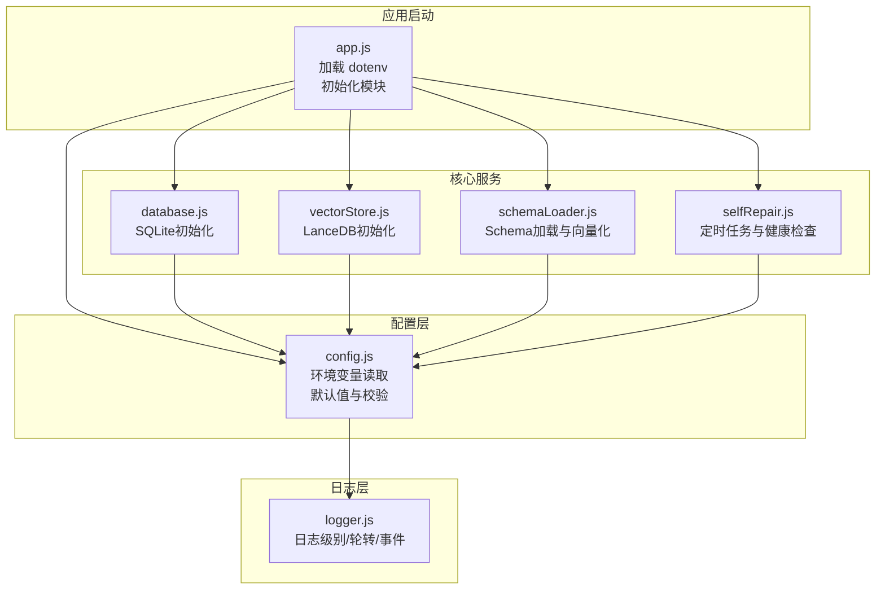
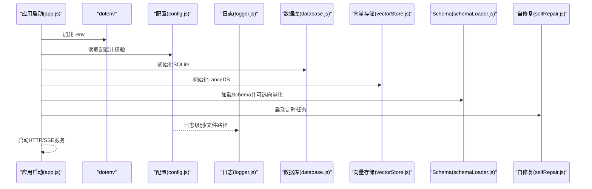
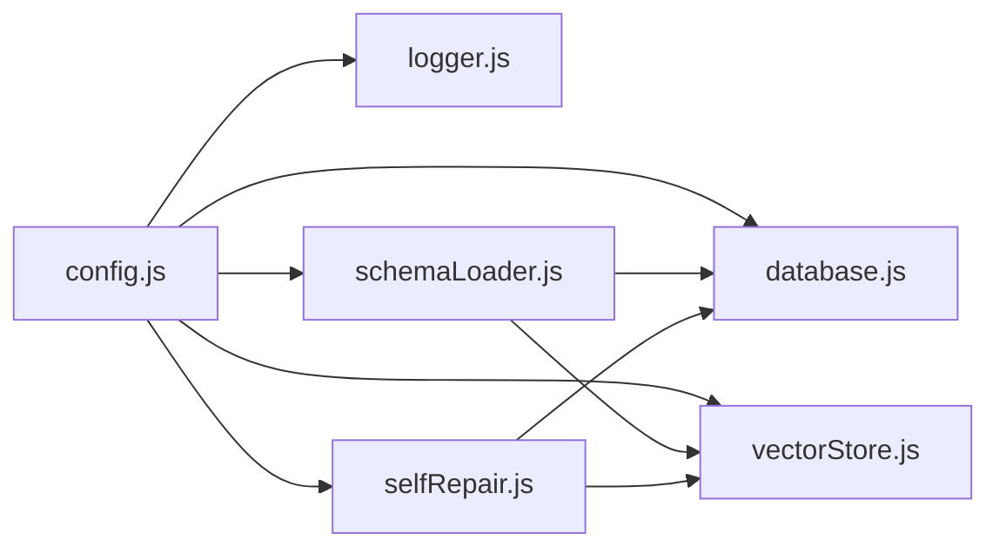

# 配置管理

<cite>
**本文引用的文件**
- [backend/src/core/config.js](file://backend/src/core/config.js)
- [backend/src/utils/logger.js](file://backend/src/utils/logger.js)
- [backend/src/app.js](file://backend/src/app.js)
- [backend/src/core/database.js](file://backend/src/core/database.js)
- [backend/src/memory/vectorStore.js](file://backend/src/memory/vectorStore.js)
- [backend/src/core/schemaLoader.js](file://backend/src/core/schemaLoader.js)
- [backend/src/core/selfRepair.js](file://backend/src/core/selfRepair.js)
- [backend/config/schema-metadata.example.json](file://backend/config/schema-metadata.example.json)
- [backend/package.json](file://backend/package.json)
</cite>

## 目录
1. [简介](#简介)
2. [项目结构](#项目结构)
3. [核心组件](#核心组件)
4. [架构总览](#架构总览)
5. [详细组件分析](#详细组件分析)
6. [依赖分析](#依赖分析)
7. [性能考虑](#性能考虑)
8. [故障排查指南](#故障排查指南)
9. [结论](#结论)
10. [附录](#附录)

## 简介
本文件面向NL2SQL项目的配置管理，系统性说明环境变量与配置项、配置文件结构与优先级、安全与访问控制、日志与监控、不同环境的配置差异与切换方法、配置验证与错误处理、配置变更的迁移与回滚策略，以及热更新与动态调整能力。目标是帮助开发者与运维人员在开发、测试、生产环境中高效、安全地部署与维护系统。

## 项目结构
NL2SQL后端采用“集中式配置 + 统一日志 + 模块化组件”的组织方式：
- 配置中心：统一在配置模块中定义与读取环境变量，提供默认值与校验
- 日志中心：统一日志格式、级别、输出位置与轮转策略
- 核心模块：数据库、向量数据库、Schema加载、自修复调度等均依赖配置模块
- 启动流程：应用启动时加载.env，初始化各模块，暴露健康与API端点

图表来源
- [backend/src/app.js:15-50](file://backend/src/app.js#L15-L50)
- [backend/src/core/config.js:16-332](file://backend/src/core/config.js#L16-L332)
- [backend/src/utils/logger.js:51-318](file://backend/src/utils/logger.js#L51-L318)
- [backend/src/core/database.js:200-261](file://backend/src/core/database.js#L200-L261)
- [backend/src/memory/vectorStore.js:55-85](file://backend/src/memory/vectorStore.js#L55-L85)
- [backend/src/core/schemaLoader.js:69-122](file://backend/src/core/schemaLoader.js#L69-L122)
- [backend/src/core/selfRepair.js:60-125](file://backend/src/core/selfRepair.js#L60-L125)

章节来源
- [backend/src/app.js:15-50](file://backend/src/app.js#L15-L50)
- [backend/src/core/config.js:16-332](file://backend/src/core/config.js#L16-L332)

## 核心组件
- 配置管理模块：集中定义与读取环境变量，提供默认值、环境判断、配置校验
- 日志模块：统一日志级别、格式、控制台与文件输出、轮转与事件通知
- 数据库模块：SQLite初始化、表结构、迁移、事务与查询封装
- 向量存储模块：LanceDB连接、表初始化、Schema与查询向量的增删查
- Schema加载模块：Schema文件加载、缓存、向量化、SQL安全校验
- 自修复模块：定时任务、健康检查、会话清理、统计收集与报告落库

章节来源
- [backend/src/core/config.js:16-332](file://backend/src/core/config.js#L16-L332)
- [backend/src/utils/logger.js:51-318](file://backend/src/utils/logger.js#L51-L318)
- [backend/src/core/database.js:200-261](file://backend/src/core/database.js#L200-L261)
- [backend/src/memory/vectorStore.js:55-85](file://backend/src/memory/vectorStore.js#L55-L85)
- [backend/src/core/schemaLoader.js:69-122](file://backend/src/core/schemaLoader.js#L69-L122)
- [backend/src/core/selfRepair.js:60-125](file://backend/src/core/selfRepair.js#L60-L125)

## 架构总览
配置管理贯穿应用启动与运行期，形成“配置读取—模块初始化—运行监控”的闭环。

图表来源
- [backend/src/app.js:97-166](file://backend/src/app.js#L97-L166)
- [backend/src/core/config.js:300-332](file://backend/src/core/config.js#L300-L332)
- [backend/src/utils/logger.js:56-79](file://backend/src/utils/logger.js#L56-L79)
- [backend/src/core/database.js:200-261](file://backend/src/core/database.js#L200-L261)
- [backend/src/memory/vectorStore.js:55-85](file://backend/src/memory/vectorStore.js#L55-L85)
- [backend/src/core/schemaLoader.js:69-122](file://backend/src/core/schemaLoader.js#L69-L122)
- [backend/src/core/selfRepair.js:60-125](file://backend/src/core/selfRepair.js#L60-L125)

## 详细组件分析

### 配置管理模块（config.js）
- 环境变量读取与默认值：统一从process.env读取，提供合理默认值
- 环境判断：isDevelopment/isProduction辅助条件化行为
- LLM与Embedding配置：API基础地址、密钥、模型、超时、重试
- 数据库配置：SQLite路径、LanceDB路径、业务库URL与连接池
- 安全配置：表白名单、Dry Run、查询行数上限、查询超时、禁止关键字、敏感字段脱敏
- 会话配置：历史长度、过期时间、清理间隔
- 日志配置：级别、文件路径、控制台/文件开关、轮转大小与数量
- 自修复配置：启用、Cron表达式、会话检查间隔、慢查询阈值
- Schema配置：配置文件路径、缓存开关与过期、强制重新向量化
- 长期记忆配置：启用、是否使用LLM、阈值与分级保留策略
- 配置校验：启动时验证必要项（LLM密钥、业务库URL），白名单为空给出警告

章节来源
- [backend/src/core/config.js:16-332](file://backend/src/core/config.js#L16-L332)

### 日志模块（logger.js）
- 日志级别：DEBUG/INFO/WARN/ERROR，支持大小写不敏感解析
- 输出目标：控制台彩色输出与文件输出，可独立开关
- 文件轮转：基于最大文件大小与历史文件数量，自动重命名与删除
- 事件通知：记录日志时触发事件，便于外部订阅
- 动态级别：支持运行时设置日志级别

章节来源
- [backend/src/utils/logger.js:51-318](file://backend/src/utils/logger.js#L51-L318)

### 数据库模块（database.js）
- SQLite初始化：创建数据库文件与表结构，启用外键约束
- 迁移：针对特定表结构修复（如重建表移除UNIQUE约束）
- 查询封装：query/queryOne/run，支持事务与错误日志
- 会话与消息：会话创建、查询、更新、删除；消息增删查
- 用户偏好：添加、查询、使用统计、模板与别名管理
- 近期相似查询计数：用于频率判断

章节来源
- [backend/src/core/database.js:200-261](file://backend/src/core/database.js#L200-L261)
- [backend/src/core/database.js:361-424](file://backend/src/core/database.js#L361-L424)
- [backend/src/core/database.js:458-540](file://backend/src/core/database.js#L458-L540)
- [backend/src/core/database.js:555-596](file://backend/src/core/database.js#L555-L596)
- [backend/src/core/database.js:609-781](file://backend/src/core/database.js#L609-L781)

### 向量存储模块（vectorStore.js）
- LanceDB连接与表初始化：schema_vectors与query_vectors
- Schema向量：添加、搜索、存在性检查、清空（通过重新向量化覆盖）
- 查询历史向量：添加、相似查询搜索
- 统计：获取表行数，排除初始化记录

章节来源
- [backend/src/memory/vectorStore.js:55-85](file://backend/src/memory/vectorStore.js#L55-L85)
- [backend/src/memory/vectorStore.js:160-191](file://backend/src/memory/vectorStore.js#L160-L191)
- [backend/src/memory/vectorStore.js:201-230](file://backend/src/memory/vectorStore.js#L201-L230)
- [backend/src/memory/vectorStore.js:245-271](file://backend/src/memory/vectorStore.js#L245-L271)
- [backend/src/memory/vectorStore.js:282-307](file://backend/src/memory/vectorStore.js#L282-L307)
- [backend/src/memory/vectorStore.js:342-372](file://backend/src/memory/vectorStore.js#L342-L372)

### Schema加载模块（schemaLoader.js）
- Schema文件加载：读取JSON配置，校验格式，构建表/字段映射
- 缓存：版本、时间戳、过期判断
- 向量化：按批次获取Embedding并写入向量库（可强制重新向量化）
- 表搜索：语义搜索（向量）与关键词匹配（回退）
- SQL安全校验：禁止关键字、表白名单检查
- Schema摘要与明细：用于提示工程

章节来源
- [backend/src/core/schemaLoader.js:69-122](file://backend/src/core/schemaLoader.js#L69-L122)
- [backend/src/core/schemaLoader.js:131-155](file://backend/src/core/schemaLoader.js#L131-L155)
- [backend/src/core/schemaLoader.js:161-189](file://backend/src/core/schemaLoader.js#L161-L189)
- [backend/src/core/schemaLoader.js:195-290](file://backend/src/core/schemaLoader.js#L195-L290)
- [backend/src/core/schemaLoader.js:420-507](file://backend/src/core/schemaLoader.js#L420-L507)
- [backend/src/core/schemaLoader.js:516-557](file://backend/src/core/schemaLoader.js#L516-L557)
- [backend/src/core/schemaLoader.js:570-606](file://backend/src/core/schemaLoader.js#L570-L606)
- [backend/src/core/schemaLoader.js:698-701](file://backend/src/core/schemaLoader.js#L698-L701)

### 自修复模块（selfRepair.js）
- 定时任务：每日自检、会话清理、统计收集、记忆维护
- 健康检查：数据库、向量库、查询统计、连接数、系统内存
- 报告落库：将检查报告写入系统日志表
- 手动触发：支持手动执行各类维护任务

章节来源
- [backend/src/core/selfRepair.js:60-125](file://backend/src/core/selfRepair.js#L60-L125)
- [backend/src/core/selfRepair.js:169-310](file://backend/src/core/selfRepair.js#L169-L310)
- [backend/src/core/selfRepair.js:341-373](file://backend/src/core/selfRepair.js#L341-L373)
- [backend/src/core/selfRepair.js:425-445](file://backend/src/core/selfRepair.js#L425-L445)

## 依赖分析
- 配置模块被日志、数据库、向量存储、Schema加载、自修复模块广泛依赖
- 日志模块依赖配置模块读取日志级别与文件路径
- 数据库与向量存储在初始化阶段读取配置中的路径与超时
- Schema加载在启用向量存储时依赖LLM服务获取Embedding
- 自修复模块依赖数据库与向量存储的状态，定期收集统计并写入数据库

图表来源
- [backend/src/core/config.js:16-332](file://backend/src/core/config.js#L16-L332)
- [backend/src/utils/logger.js:22-22](file://backend/src/utils/logger.js#L22-L22)
- [backend/src/core/database.js:16-19](file://backend/src/core/database.js#L16-L19)
- [backend/src/memory/vectorStore.js:16-19](file://backend/src/memory/vectorStore.js#L16-L19)
- [backend/src/core/schemaLoader.js:19-26](file://backend/src/core/schemaLoader.js#L19-L26)
- [backend/src/core/selfRepair.js:17-26](file://backend/src/core/selfRepair.js#L17-L26)

章节来源
- [backend/src/core/config.js:16-332](file://backend/src/core/config.js#L16-L332)

## 性能考虑
- LLM与Embedding超时：根据模型规模与网络状况调整，避免请求挂起
- 连接池：业务库连接池参数影响并发与资源占用
- 查询超时与行数限制：防止慢查询与大结果集导致的性能问题
- 向量搜索：分批获取Embedding，减少单次请求压力
- 日志轮转：控制文件大小与保留数量，避免磁盘膨胀
- 自修复：慢查询阈值与会话清理间隔需结合负载调优

章节来源
- [backend/src/core/config.js:68-87](file://backend/src/core/config.js#L68-L87)
- [backend/src/core/config.js:120-130](file://backend/src/core/config.js#L120-L130)
- [backend/src/core/config.js:154-157](file://backend/src/core/config.js#L154-L157)
- [backend/src/core/config.js:224-226](file://backend/src/core/config.js#L224-L226)
- [backend/src/utils/logger.js:130-160](file://backend/src/utils/logger.js#L130-L160)
- [backend/src/core/schemaLoader.js:260-273](file://backend/src/core/schemaLoader.js#L260-L273)

## 故障排查指南
- 启动失败
  - 必要配置缺失：LLM API密钥或业务库URL为空或占位符
  - 白名单为空：生产环境建议配置允许访问的表
  - 参考：[backend/src/core/config.js:300-332](file://backend/src/core/config.js#L300-L332)
- 数据库问题
  - SQLite连接失败：检查DB_PATH与权限
  - 表结构异常：查看迁移日志与错误堆栈
  - 参考：[backend/src/core/database.js:214-259](file://backend/src/core/database.js#L214-L259)
- 向量库问题
  - 初始化失败：确认VECTOR_DB_PATH与权限，关注警告日志
  - 向量搜索为空：确认是否已向量化或强制重新向量化
  - 参考：[backend/src/memory/vectorStore.js:65-84](file://backend/src/memory/vectorStore.js#L65-L84)
- Schema加载问题
  - 配置文件不存在或格式错误：核对schema-metadata.json路径与格式
  - 向量化失败：检查LLM服务可用性与批次大小
  - 参考：[backend/src/core/schemaLoader.js:77-122](file://backend/src/core/schemaLoader.js#L77-L122)
- 日志问题
  - 文件写入失败：检查LOG_FILE路径与权限，确认轮转逻辑
  - 参考：[backend/src/utils/logger.js:191-204](file://backend/src/utils/logger.js#L191-L204)
- 自修复问题
  - 定时任务未执行：检查Cron表达式与系统时间
  - 健康检查异常：查看系统日志表中的报告
  - 参考：[backend/src/core/selfRepair.js:73-83](file://backend/src/core/selfRepair.js#L73-L83)

章节来源
- [backend/src/core/config.js:300-332](file://backend/src/core/config.js#L300-L332)
- [backend/src/core/database.js:214-259](file://backend/src/core/database.js#L214-L259)
- [backend/src/memory/vectorStore.js:65-84](file://backend/src/memory/vectorStore.js#L65-L84)
- [backend/src/core/schemaLoader.js:77-122](file://backend/src/core/schemaLoader.js#L77-L122)
- [backend/src/utils/logger.js:191-204](file://backend/src/utils/logger.js#L191-L204)
- [backend/src/core/selfRepair.js:73-83](file://backend/src/core/selfRepair.js#L73-L83)

## 结论
NL2SQL的配置管理以集中式配置为核心，配合严格的启动校验、统一日志与模块化组件，实现了在不同环境下的可控部署与运行监控。通过合理的超时与限流、白名单与脱敏、向量库与Schema缓存策略，系统在安全性与性能之间取得平衡。建议在生产环境严格配置白名单、日志级别与轮转策略，并结合自修复机制进行持续健康检查。

## 附录

### 环境变量与配置项清单
- 服务器与运行环境
  - PORT：服务监听端口
  - NODE_ENV：运行环境（development/production）
- LLM与Embedding
  - LLM_API_BASE：LLM API基础地址
  - LLM_API_KEY：LLM API密钥
  - LLM_MODEL：默认模型名称
  - LLM_TIMEOUT：LLM请求超时
  - EMBEDDING_MODEL：Embedding模型名称
  - EMBEDDING_TIMEOUT：Embedding请求超时
- 数据库
  - DB_PATH：SQLite数据库文件路径
  - VECTOR_DB_PATH：LanceDB存储目录
  - SR_DATABASE_URL：业务库连接URL
- 安全
  - ALLOWED_TABLES：允许访问的表（逗号分隔）
  - DRY_RUN：仅生成SQL不执行
  - MAX_QUERY_ROWS：查询返回最大行数
  - QUERY_TIMEOUT：查询超时
  - SENSITIVE_FIELDS：敏感字段列表（逗号分隔）
- 会话
  - SESSION_MAX_HISTORY：会话历史最大消息数
  - SESSION_EXPIRE_TIME：会话过期时间
  - SESSION_CLEANUP_INTERVAL：过期会话清理间隔
- 日志
  - LOG_LEVEL：日志级别
  - LOG_FILE：日志文件路径
  - LOG_CONSOLE：控制台输出开关
  - LOG_FILE_OUTPUT：文件输出开关
  - LOG_MAX_SIZE：日志文件最大大小
  - LOG_MAX_FILES：保留的历史文件数量
- 自修复
  - SELF_REPAIR_ENABLED：启用自修复
  - SELF_REPAIR_DAILY_CHECK_CRON：每日自检Cron
  - SELF_REPAIR_SESSION_CHECK_INTERVAL：会话检查间隔
  - SELF_REPAIR_SLOW_QUERY_THRESHOLD：慢查询阈值
- Schema
  - SCHEMA_CONFIG_PATH：Schema配置文件路径
  - SCHEMA_ENABLE_CACHE：启用Schema缓存
  - SCHEMA_CACHE_EXPIRE_TIME：Schema缓存过期时间
  - SCHEMA_REVECTORIZE：强制重新向量化
- 长期记忆
  - LTM_ENABLED：启用长期记忆
  - LTM_USE_LLM：使用LLM进行提炼

章节来源
- [backend/src/core/config.js:26-332](file://backend/src/core/config.js#L26-L332)

### 配置文件结构与优先级
- 配置来源优先级（从高到低）
  1) 运行时环境变量（覆盖默认值）
  2) .env文件（由dotenv加载至process.env）
  3) 配置模块默认值
- Schema元数据文件
  - 示例文件位于：backend/config/schema-metadata.example.json
  - 实际使用时建议复制为schema-metadata.json并按需调整

章节来源
- [backend/src/app.js:15-16](file://backend/src/app.js#L15-L16)
- [backend/src/core/config.js:237-245](file://backend/src/core/config.js#L237-L245)
- [backend/config/schema-metadata.example.json:1-328](file://backend/config/schema-metadata.example.json#L1-L328)

### 安全配置最佳实践
- 敏感信息保护
  - API密钥与数据库密码置于环境变量，不在代码仓库中提交
  - 使用白名单限制可查询表，避免越权访问
  - 对敏感字段进行脱敏处理
- 访问控制
  - 生产环境务必配置ALLOWED_TABLES
  - DRY_RUN仅用于开发调试
- 审计与监控
  - 启用日志轮转与级别控制
  - 使用自修复机制进行健康检查与慢查询识别

章节来源
- [backend/src/core/config.js:144-170](file://backend/src/core/config.js#L144-L170)
- [backend/src/core/config.js:165-169](file://backend/src/core/config.js#L165-L169)
- [backend/src/core/schemaLoader.js:570-606](file://backend/src/core/schemaLoader.js#L570-L606)

### 日志配置与监控
- 日志级别与输出
  - 通过LOG_LEVEL控制输出级别
  - 控制台与文件输出可独立开关
- 日志轮转
  - 基于最大文件大小与历史文件数量自动轮转
- 监控集成
  - 自修复模块定期收集统计并写入系统日志表
  - 健康检查报告可用于运维监控

章节来源
- [backend/src/utils/logger.js:61-79](file://backend/src/utils/logger.js#L61-L79)
- [backend/src/utils/logger.js:130-160](file://backend/src/utils/logger.js#L130-L160)
- [backend/src/core/selfRepair.js:425-445](file://backend/src/core/selfRepair.js#L425-L445)

### 不同环境的配置差异与切换
- 开发环境
  - NODE_ENV=development
  - LOG_LEVEL=debug
  - ALLOWED_TABLES可为空（开发便利）
  - DRY_RUN可为true
- 测试环境
  - NODE_ENV=test
  - LOG_LEVEL=info
  - 配置较小的查询超时与行数限制
- 生产环境
  - NODE_ENV=production
  - LOG_LEVEL=warn/error
  - 必须配置ALLOWED_TABLES与敏感字段脱敏
  - 启用自修复与慢查询阈值监控

章节来源
- [backend/src/core/config.js:33-49](file://backend/src/core/config.js#L33-L49)
- [backend/src/core/config.js:197-208](file://backend/src/core/config.js#L197-L208)
- [backend/src/core/config.js:144-170](file://backend/src/core/config.js#L144-L170)

### 配置验证与错误处理机制
- 启动校验
  - 必要配置项：LLM_API_KEY、SR_DATABASE_URL
  - 白名单为空发出警告
- 运行期校验
  - Schema加载格式校验
  - SQL安全校验（禁止关键字、表白名单）
- 错误处理
  - 数据库与向量库初始化失败不阻断应用，记录警告
  - 日志写入失败回退到控制台输出
  - 未捕获异常触发优雅关闭

章节来源
- [backend/src/core/config.js:300-332](file://backend/src/core/config.js#L300-L332)
- [backend/src/core/schemaLoader.js:131-155](file://backend/src/core/schemaLoader.js#L131-L155)
- [backend/src/core/schemaLoader.js:570-606](file://backend/src/core/schemaLoader.js#L570-L606)
- [backend/src/utils/logger.js:200-204](file://backend/src/utils/logger.js#L200-L204)
- [backend/src/app.js:160-165](file://backend/src/app.js#L160-L165)

### 配置变更的迁移指南与回滚策略
- 迁移指南
  - 新增配置项：在config.js中定义默认值与校验
  - 修改Schema：更新schema-metadata.json并触发重新向量化（SCHEMA_REVECTORIZE=true）
  - 数据库结构变更：通过迁移脚本（如database.js中的迁移逻辑）执行
- 回滚策略
  - 环境变量回滚：恢复到上一个稳定的.env
  - Schema回滚：删除向量库目录或清空向量表后重新向量化
  - 数据库回滚：使用备份数据库文件或迁移脚本回退

章节来源
- [backend/src/core/config.js:237-245](file://backend/src/core/config.js#L237-L245)
- [backend/src/core/database.js:271-336](file://backend/src/core/database.js#L271-L336)
- [backend/src/memory/vectorStore.js:408-420](file://backend/src/memory/vectorStore.js#L408-L420)

### 配置热更新与动态调整
- 支持动态调整的日志级别：通过logger.setLevel在运行时调整
- 配置热更新建议
  - 对于端口、数据库路径等静态配置，建议重启生效
  - 对于日志级别、查询超时、缓存策略等，可在运行时调整并观察效果
- 监控与告警
  - 使用自修复模块的健康检查与慢查询阈值进行动态运维

章节来源
- [backend/src/utils/logger.js:299-302](file://backend/src/utils/logger.js#L299-L302)
- [backend/src/core/config.js:224-226](file://backend/src/core/config.js#L224-L226)
- [backend/src/core/selfRepair.js:243-247](file://backend/src/core/selfRepair.js#L243-L247)