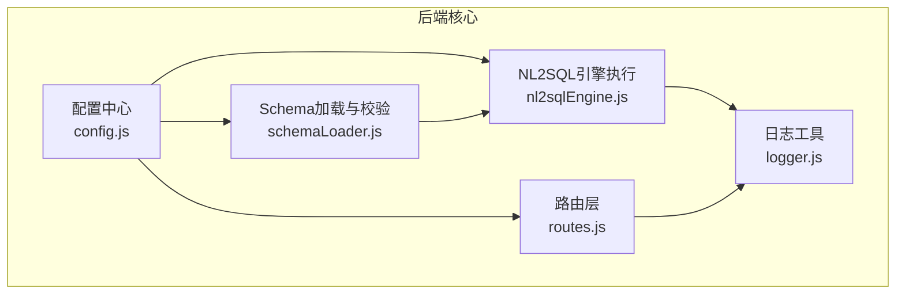
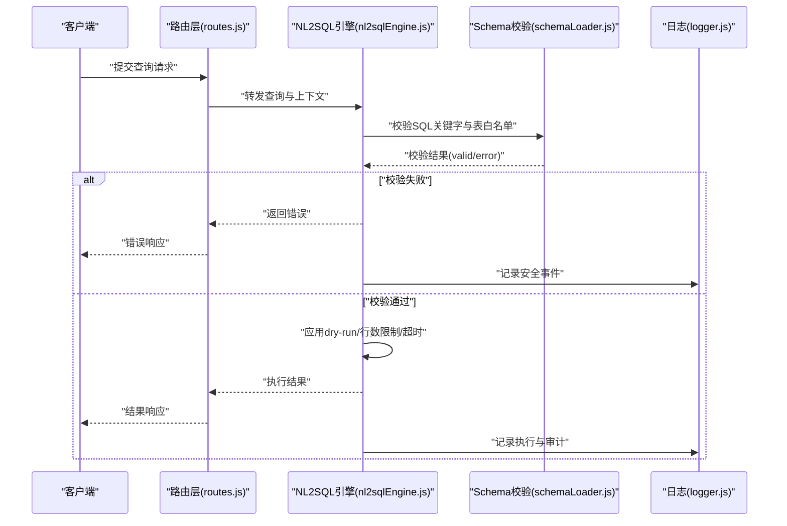
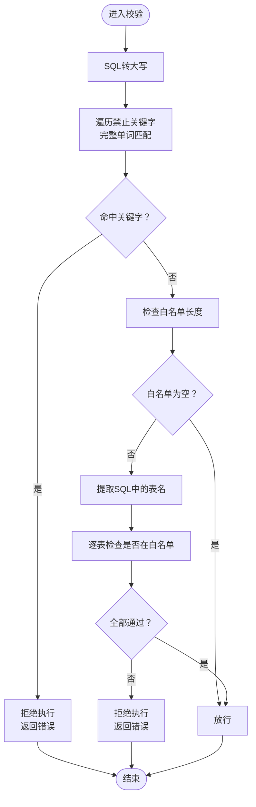
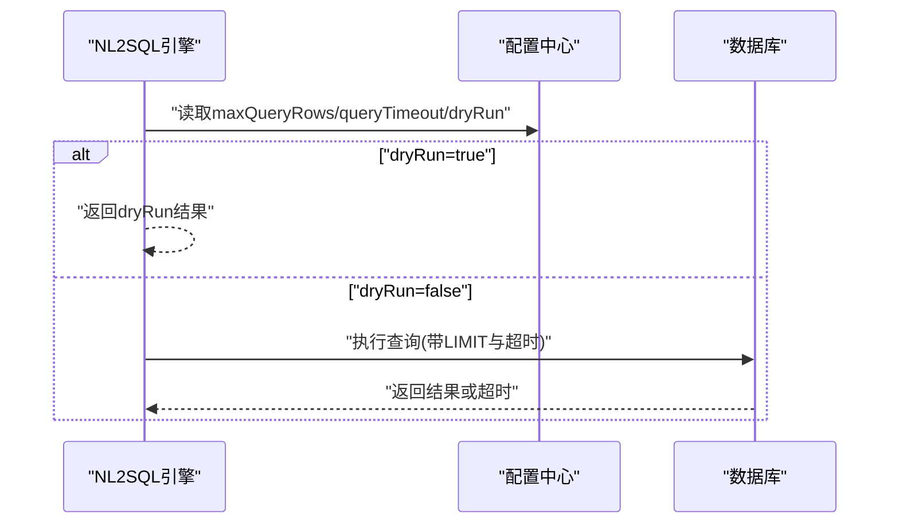
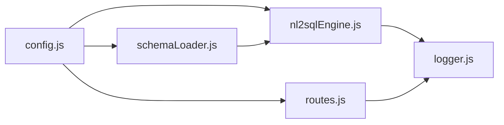

# 安全配置

<cite>
**本文引用的文件**
- [config.js](file://backend/src/core/config.js)
- [schemaLoader.js](file://backend/src/core/schemaLoader.js)
- [nl2sqlEngine.js](file://backend/src/core/nl2sqlEngine.js)
- [routes.js](file://backend/src/core/routes.js)
- [logger.js](file://backend/src/utils/logger.js)
- [schema-metadata.example.json](file://backend/config/schema-metadata.example.json)
- [package.json](file://backend/package.json)
</cite>

## 目录
1. [简介](#简介)
2. [项目结构](#项目结构)
3. [核心组件](#核心组件)
4. [架构总览](#架构总览)
5. [详细组件分析](#详细组件分析)
6. [依赖关系分析](#依赖关系分析)
7. [性能考量](#性能考量)
8. [故障排查指南](#故障排查指南)
9. [结论](#结论)
10. [附录](#附录)

## 简介
本文件面向 NL2SQL 项目的安全配置，系统性阐述安全配置参数、SQL 注入防护机制、禁止关键字过滤、查询限制与超时控制、敏感字段处理、dry-run 模式、敏感信息保护最佳实践、审计要点与合规性要求，并提供测试方法与漏洞扫描建议。目标是帮助开发者与运维人员正确配置与落地安全策略，降低数据泄露与越权风险。

## 项目结构
与安全配置直接相关的核心文件与职责如下：
- 配置中心：集中管理所有安全相关参数（白名单、dry-run、查询限制、禁止关键字、敏感字段等）
- Schema 加载与校验：对 SQL 的关键字与表访问进行安全校验
- 引擎执行：在执行阶段遵循安全配置（dry-run、行数限制、超时）
- 路由层：对外暴露安全配置状态与统计信息
- 日志：统一记录安全事件与审计轨迹

图表来源
- [config.js:140-170](file://backend/src/core/config.js#L140-L170)
- [schemaLoader.js:727-763](file://backend/src/core/schemaLoader.js#L727-L763)
- [nl2sqlEngine.js:1750-1773](file://backend/src/core/nl2sqlEngine.js#L1750-L1773)
- [routes.js:930-935](file://backend/src/core/routes.js#L930-L935)
- [logger.js:233-309](file://backend/src/utils/logger.js#L233-L309)

章节来源
- [config.js:140-170](file://backend/src/core/config.js#L140-L170)
- [schemaLoader.js:727-763](file://backend/src/core/schemaLoader.js#L727-L763)
- [nl2sqlEngine.js:1750-1773](file://backend/src/core/nl2sqlEngine.js#L1750-L1773)
- [routes.js:930-935](file://backend/src/core/routes.js#L930-L935)
- [logger.js:233-309](file://backend/src/utils/logger.js#L233-L309)

## 核心组件
- 安全配置对象：集中定义白名单、dry-run、查询行数上限、查询超时、禁止关键字、敏感字段等
- SQL 安全校验：禁止关键字过滤 + 表访问白名单校验
- 执行期安全控制：dry-run 模式、行数限制、超时控制
- 路由层安全暴露：对外提供安全配置状态与统计
- 日志与审计：统一记录安全事件，支持审计追踪

章节来源
- [config.js:140-170](file://backend/src/core/config.js#L140-L170)
- [schemaLoader.js:727-763](file://backend/src/core/schemaLoader.js#L727-L763)
- [nl2sqlEngine.js:1680-1685](file://backend/src/core/nl2sqlEngine.js#L1680-L1685)
- [routes.js:930-935](file://backend/src/core/routes.js#L930-L935)
- [logger.js:233-309](file://backend/src/utils/logger.js#L233-L309)

## 架构总览
安全配置贯穿“配置—校验—执行—审计”全流程，形成闭环：

图表来源
- [routes.js:930-935](file://backend/src/core/routes.js#L930-L935)
- [nl2sqlEngine.js:1750-1773](file://backend/src/core/nl2sqlEngine.js#L1750-L1773)
- [schemaLoader.js:727-763](file://backend/src/core/schemaLoader.js#L727-L763)
- [logger.js:233-309](file://backend/src/utils/logger.js#L233-L309)

## 详细组件分析

### 安全配置参数详解
- 白名单（allowedTables）
  - 作用：仅允许访问白名单内的表，未配置时会发出生产环境警告
  - 影响：若为空数组，将允许访问所有表，存在高风险
- dry-run（dryRun）
  - 作用：仅生成 SQL，不实际执行，用于调试与审计
  - 影响：跳过真实查询，返回 dryRun 标记与提示
- 查询行数限制（maxQueryRows）
  - 作用：限制单次查询返回的最大行数，防止内存溢出与性能抖动
  - 影响：在 SQL 末尾追加 LIMIT
- 查询超时（queryTimeout）
  - 作用：限制查询执行时间，超时即终止
  - 影响：结合执行引擎的超时控制，保障系统稳定性
- 禁止关键字（forbiddenKeywords）
  - 作用：拦截包含禁止关键字的 SQL，阻断危险操作
  - 影响：对关键字进行完整单词匹配，拒绝执行
- 敏感字段（sensitiveFields）
  - 作用：在结果中对敏感字段进行脱敏处理（需在结果处理链路实现）

章节来源
- [config.js:140-170](file://backend/src/core/config.js#L140-L170)
- [config.js:384-387](file://backend/src/core/config.js#L384-L387)

### SQL 注入防护机制
- 参数化查询
  - 数据库层采用参数化查询（SQLite），避免拼接式注入
- 关键字过滤
  - 对 SQL 文本进行关键字匹配，阻断 DDL/DML 等危险操作
- 表白名单
  - 限定可访问表，避免跨表越权与信息泄露

章节来源
- [schemaLoader.js:727-763](file://backend/src/core/schemaLoader.js#L727-L763)
- [database.js:361-424](file://backend/src/core/database.js#L361-L424)

### 禁止关键字过滤与表白名单
- 关键字过滤
  - 遍历禁止关键字集合，使用完整单词匹配规则检测 SQL
  - 若命中，返回错误并阻止执行
- 表白名单
  - 从 SQL 中提取表名，检查是否在 allowedTables 中
  - 未配置白名单时，不进行表级限制

图表来源
- [schemaLoader.js:727-763](file://backend/src/core/schemaLoader.js#L727-L763)

章节来源
- [schemaLoader.js:727-763](file://backend/src/core/schemaLoader.js#L727-L763)

### 查询限制与超时控制
- 行数限制
  - 在生成 SQL 时追加 LIMIT，受 maxQueryRows 控制
- 超时控制
  - 通过 queryTimeout 控制查询执行时间，防止长事务占用资源
- dry-run 模式
  - 当启用时，跳过真实执行，返回 dryRun 标记与提示

图表来源
- [nl2sqlEngine.js:1680-1685](file://backend/src/core/nl2sqlEngine.js#L1680-L1685)
- [nl2sqlEngine.js:1750-1773](file://backend/src/core/nl2sqlEngine.js#L1750-L1773)
- [config.js:150-157](file://backend/src/core/config.js#L150-L157)

章节来源
- [nl2sqlEngine.js:1680-1685](file://backend/src/core/nl2sqlEngine.js#L1680-L1685)
- [nl2sqlEngine.js:1750-1773](file://backend/src/core/nl2sqlEngine.js#L1750-L1773)
- [config.js:150-157](file://backend/src/core/config.js#L150-L157)

### 敏感字段处理
- 配置层面
  - sensitiveFields 定义敏感字段集合，用于后续结果脱敏
- 实施建议
  - 在结果序列化阶段对匹配字段进行脱敏（如掩码、置空、聚合）
  - 与白名单配合，避免敏感字段出现在不受控的查询中

章节来源
- [config.js:165-169](file://backend/src/core/config.js#L165-L169)

### dry-run 模式的用途与安全考虑
- 用途
  - 仅生成 SQL，不执行，便于审计、调试与合规检查
- 安全考虑
  - 必须与白名单、关键字过滤、行数限制共同使用
  - 生产环境默认关闭，避免误用造成信息泄露

章节来源
- [config.js:146-148](file://backend/src/core/config.js#L146-L148)
- [nl2sqlEngine.js:1757-1773](file://backend/src/core/nl2sqlEngine.js#L1757-L1773)

### 安全配置的审计要点与合规性要求
- 审计要点
  - 白名单配置与变更审批
  - dry-run 使用记录与审批
  - 关键字过滤命中统计与处置
  - 超时与限行触发统计
  - 敏感字段脱敏覆盖率
- 合规性要求
  - 数据最小化原则：仅开放必要表与字段
  - 最小权限：禁止 DDL/DML 关键字
  - 可追溯：日志保留与审计留痕
  - 数据加密：传输与静态数据加密（建议）

章节来源
- [routes.js:930-935](file://backend/src/core/routes.js#L930-L935)
- [logger.js:233-309](file://backend/src/utils/logger.js#L233-L309)

### 测试方法与漏洞扫描建议
- 单元测试
  - 关键字过滤：构造包含禁止关键字的 SQL，验证拒绝
  - 表白名单：构造访问未授权表的 SQL，验证拒绝
  - 行数限制：构造大查询，验证 LIMIT 生效
  - 超时控制：构造长耗时查询，验证超时返回
  - dry-run：验证返回 dryRun 标记
- 集成测试
  - 路由层暴露的安全配置状态校验
  - 日志中安全事件的完整性与准确性
- 漏洞扫描建议
  - 代码静态扫描：关键字匹配、SQL 拼接风险
  - 依赖安全扫描：第三方库 CVE 与许可证合规
  - 渗透测试：重点验证白名单与关键字过滤边界

章节来源
- [schemaLoader.js:727-763](file://backend/src/core/schemaLoader.js#L727-L763)
- [nl2sqlEngine.js:1680-1685](file://backend/src/core/nl2sqlEngine.js#L1680-L1685)
- [routes.js:930-935](file://backend/src/core/routes.js#L930-L935)
- [logger.js:233-309](file://backend/src/utils/logger.js#L233-L309)

## 依赖关系分析
- 配置中心为全局依赖，被校验与执行模块共享
- 校验模块负责 SQL 安全前置检查
- 执行模块在运行时应用安全策略
- 路由层对外暴露安全配置状态
- 日志模块统一记录安全事件

图表来源
- [config.js:140-170](file://backend/src/core/config.js#L140-L170)
- [schemaLoader.js:727-763](file://backend/src/core/schemaLoader.js#L727-L763)
- [nl2sqlEngine.js:1750-1773](file://backend/src/core/nl2sqlEngine.js#L1750-L1773)
- [routes.js:930-935](file://backend/src/core/routes.js#L930-L935)
- [logger.js:233-309](file://backend/src/utils/logger.js#L233-L309)

章节来源
- [config.js:140-170](file://backend/src/core/config.js#L140-L170)
- [schemaLoader.js:727-763](file://backend/src/core/schemaLoader.js#L727-L763)
- [nl2sqlEngine.js:1750-1773](file://backend/src/core/nl2sqlEngine.js#L1750-L1773)
- [routes.js:930-935](file://backend/src/core/routes.js#L930-L935)
- [logger.js:233-309](file://backend/src/utils/logger.js#L233-L309)

## 性能考量
- 行数限制与超时控制可有效避免资源滥用，提升系统稳定性
- 白名单与关键字过滤在执行前快速拒绝，减少无效计算
- 日志级别与文件轮转需结合生产环境容量规划

## 故障排查指南
- 关键字过滤误杀
  - 检查 forbiddenKeywords 配置，确认是否误命中
  - 参考：[schemaLoader.js:731-741](file://backend/src/core/schemaLoader.js#L731-L741)
- 表白名单不生效
  - 确认 allowedTables 配置与 SQL 中表名一致
  - 参考：[schemaLoader.js:743-759](file://backend/src/core/schemaLoader.js#L743-L759)
- dry-run 未生效
  - 检查 DRY_RUN 环境变量与配置中心读取
  - 参考：[config.js:146-148](file://backend/src/core/config.js#L146-L148)、[nl2sqlEngine.js:1757-1773](file://backend/src/core/nl2sqlEngine.js#L1757-L1773)
- 查询超时频繁
  - 调整 QUERY_TIMEOUT，优化复杂查询或增加索引
  - 参考：[config.js:154-156](file://backend/src/core/config.js#L154-L156)
- 日志未记录安全事件
  - 检查日志级别与输出配置
  - 参考：[logger.js:233-309](file://backend/src/utils/logger.js#L233-L309)

章节来源
- [schemaLoader.js:731-759](file://backend/src/core/schemaLoader.js#L731-L759)
- [config.js:146-156](file://backend/src/core/config.js#L146-L156)
- [nl2sqlEngine.js:1757-1773](file://backend/src/core/nl2sqlEngine.js#L1757-L1773)
- [logger.js:233-309](file://backend/src/utils/logger.js#L233-L309)

## 结论
NL2SQL 的安全配置围绕“白名单 + 关键字过滤 + 行数限制 + 超时 + dry-run + 敏感字段脱敏”构建，配合统一日志与路由层状态暴露，形成可审计、可追溯、可治理的安全体系。建议在生产环境严格启用白名单与关键字过滤，合理设置行数与超时，并持续进行安全测试与漏洞扫描，确保系统安全与合规。

## 附录
- 环境变量与默认值参考
  - ALLOWED_TABLES：表白名单（逗号分隔）
  - DRY_RUN：是否启用 dry-run
  - MAX_QUERY_ROWS：单次查询最大行数
  - QUERY_TIMEOUT：查询超时（毫秒）
  - LOG_LEVEL/LOG_FILE：日志级别与文件路径
  - 参考：[config.js:140-170](file://backend/src/core/config.js#L140-L170)、[config.js:195-213](file://backend/src/core/config.js#L195-L213)
- 示例 Schema 元数据
  - 参考：[schema-metadata.example.json:1-328](file://backend/config/schema-metadata.example.json#L1-L328)
- 依赖与运行环境
  - Node.js 版本要求与依赖库
  - 参考：[package.json:24-26](file://backend/package.json#L24-L26)