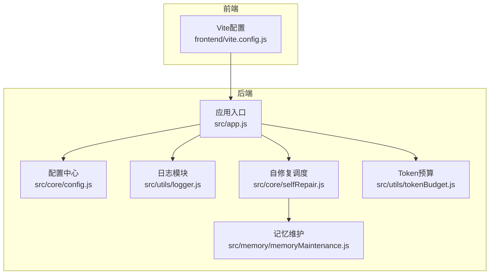
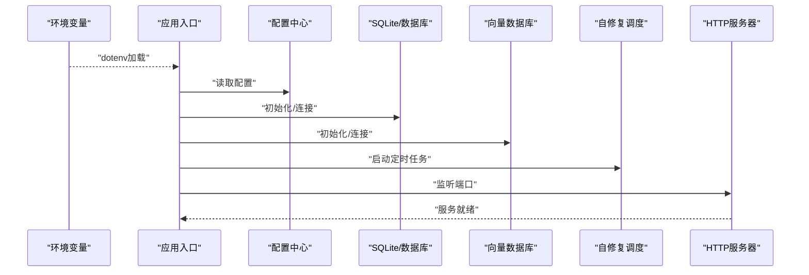
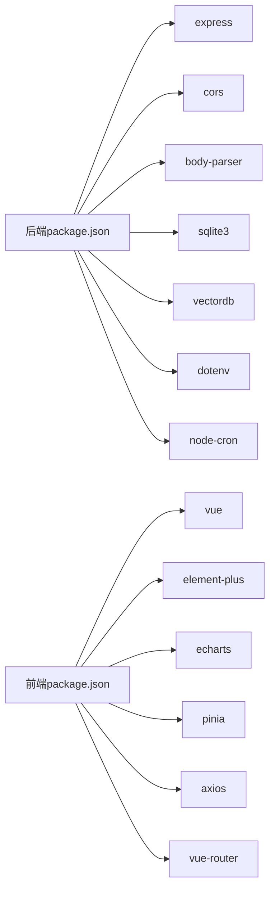

# 应用配置

<cite>
**本文引用的文件**
- [backend\src\core\config.js](file://backend/src/core/config.js)
- [backend\src\app.js](file://backend/src/app.js)
- [backend\src\utils\logger.js](file://backend/src/utils/logger.js)
- [backend\src\core\selfRepair.js](file://backend/src/core/selfRepair.js)
- [backend\src\memory\memoryMaintenance.js](file://backend/src/memory/memoryMaintenance.js)
- [backend\src\utils\tokenBudget.js](file://backend/src/utils/tokenBudget.js)
- [frontend\vite.config.js](file://frontend/vite.config.js)
- [backend\package.json](file://backend/package.json)
- [frontend\package.json](file://frontend/package.json)
- [backend\config\schema-metadata.example.json](file://backend/config/schema-metadata.example.json)
</cite>

## 目录
1. [简介](#简介)
2. [项目结构](#项目结构)
3. [核心组件](#核心组件)
4. [架构总览](#架构总览)
5. [详细组件分析](#详细组件分析)
6. [依赖分析](#依赖分析)
7. [性能考量](#性能考量)
8. [故障排查指南](#故障排查指南)
9. [结论](#结论)
10. [附录](#附录)

## 简介
本文件面向 NL2SQL 项目的应用配置，系统性梳理后端配置、日志、自修复机制、前端 Vite 配置以及配置验证与部署模板。目标是帮助开发者与运维人员快速理解并正确配置应用，覆盖开发、测试与生产环境的关键要点。

## 项目结构
- 后端采用 Node.js + Express，集中于配置管理、日志、自修复与长期记忆维护等模块。
- 前端采用 Vite + Vue3，通过代理与路径别名提升开发体验。
- 配置项统一由后端配置模块集中管理，并在启动时进行必要项校验。

图示来源
- [backend\src\app.js:1-238](file://backend/src/app.js#L1-L238)
- [backend\src\core\config.js:1-398](file://backend/src/core/config.js#L1-L398)
- [backend\src\utils\logger.js:1-442](file://backend/src/utils/logger.js#L1-L442)
- [backend\src\core\selfRepair.js:1-489](file://backend/src/core/selfRepair.js#L1-L489)
- [backend\src\memory\memoryMaintenance.js:1-415](file://backend/src/memory/memoryMaintenance.js#L1-L415)
- [backend\src\utils\tokenBudget.js:1-435](file://backend/src/utils/tokenBudget.js#L1-L435)
- [frontend\vite.config.js:1-93](file://frontend/vite.config.js#L1-L93)

章节来源
- [backend\src\app.js:1-238](file://backend/src/app.js#L1-L238)
- [frontend\vite.config.js:1-93](file://frontend/vite.config.js#L1-L93)

## 核心组件
- 配置中心：集中管理服务器、LLM、数据库、安全、会话、日志、自修复、Schema、长期记忆、上下文管理与评估等配置，并提供启动时验证。
- 日志模块：支持控制台与文件输出、日志轮转、结构化日志与追踪会话。
- 自修复机制：定时任务（每日自检、会话清理、统计收集、记忆维护）保障系统健康。
- 前端 Vite：开发服务器、代理、路径别名、插件与构建优化。
- 上下文与 Token 预算：估算与压缩策略，防止上下文溢出。
- Schema 元数据：示例配置文件，指导实际业务库结构映射。

章节来源
- [backend\src\core\config.js:1-398](file://backend/src/core/config.js#L1-L398)
- [backend\src\utils\logger.js:1-442](file://backend/src/utils/logger.js#L1-L442)
- [backend\src\core\selfRepair.js:1-489](file://backend/src/core/selfRepair.js#L1-L489)
- [frontend\vite.config.js:1-93](file://frontend/vite.config.js#L1-L93)
- [backend\src\utils\tokenBudget.js:1-435](file://backend/src/utils/tokenBudget.js#L1-L435)
- [backend\config\schema-metadata.example.json:1-328](file://backend/config/schema-metadata.example.json#L1-L328)

## 架构总览
后端启动流程：加载 .env → 初始化数据库/向量库 → 加载 Schema → 启动自修复 → 启动 HTTP 服务器。日志模块贯穿全链路，自修复模块通过 node-cron 定时执行多项维护任务。

图示来源
- [backend\src\app.js:15-160](file://backend/src/app.js#L15-L160)
- [backend\src\core\config.js:366-398](file://backend/src/core/config.js#L366-L398)
- [backend\src\core\selfRepair.js:60-125](file://backend/src/core/selfRepair.js#L60-L125)

章节来源
- [backend\src\app.js:93-166](file://backend/src/app.js#L93-L166)
- [backend\src\core\config.js:366-398](file://backend/src/core/config.js#L366-L398)

## 详细组件分析

### 后端配置中心（集中式配置）
- 服务器基础：端口、运行环境、开发/生产判断。
- LLM 与 Embedding：API 基础地址、密钥、模型、超时、重试。
- 数据库：SQLite 路径、SR 数据源 URL 与连接池、LanceDB 路径。
- 安全：表白名单、Dry Run、查询行数上限、查询超时、禁止关键字、敏感字段脱敏。
- 会话：历史轮数、过期时间、清理间隔。
- 日志：级别、文件路径、控制台/文件输出、轮转大小与文件数。
- 自修复：开关、每日自检 Cron、会话检查间隔、慢查询阈值。
- Schema：配置文件路径、缓存开关与过期、强制重向量化。
- 长期记忆：开关、是否使用 LLM 提炼、阈值与分级保留策略。
- 上下文管理：Token 预算开关、摘要开关、预算与摘要阈值。
- 评估：开关、运行时统计开关、阈值。

配置验证（启动时）：
- 必填项：LLM API 密钥、SR 数据库 URL。
- 白名单为空时发出警告。

章节来源
- [backend\src\core\config.js:16-355](file://backend/src/core/config.js#L16-L355)
- [backend\src\core\config.js:366-398](file://backend/src/core/config.js#L366-L398)

### 日志模块（统一日志）
- 支持 TRACE/DEBUG/INFO/WARN/ERROR 级别。
- 控制台彩色输出与文件轮转（按大小与文件数）。
- 结构化日志与事件派发。
- 执行流程追踪：开始/步骤/结束追踪，便于 NL2SQL 流程调试。

章节来源
- [backend\src\utils\logger.js:54-442](file://backend/src/utils/logger.js#L54-L442)

### 自修复机制（定时维护）
- 启动：注册每日自检、会话清理、统计收集、记忆维护任务。
- 每日自检：数据库连接、向量库状态、当日查询统计（失败率、慢查询）、活跃连接、系统内存与运行时长。
- 会话清理：按过期时间归档活跃会话。
- 统计收集：连接数与内存使用（debug 级别）。
- 记忆维护：按使用频率分级清理长期记忆，生成健康报告。

章节来源
- [backend\src\core\selfRepair.js:60-125](file://backend/src/core/selfRepair.js#L60-L125)
- [backend\src\core\selfRepair.js:169-310](file://backend/src/core/selfRepair.js#L169-L310)
- [backend\src\core\selfRepair.js:341-373](file://backend/src/core/selfRepair.js#L341-L373)
- [backend\src\core\selfRepair.js:425-445](file://backend/src/core/selfRepair.js#L425-L445)
- [backend\src\memory\memoryMaintenance.js:24-46](file://backend/src/memory/memoryMaintenance.js#L24-L46)
- [backend\src\memory\memoryMaintenance.js:69-120](file://backend/src/memory/memoryMaintenance.js#L69-L120)

### 上下文与 Token 预算
- Token 估算：基于字符数的经验比率，支持批量与对象估算。
- 预算计算：系统提示、历史、检索片段三部分，计算使用率与剩余预算。
- 压缩策略：裁剪历史对话、压缩检索片段、激进裁剪，重新计算预算。
- 快捷检查：上下文是否安全、状态摘要。

章节来源
- [backend\src\utils\tokenBudget.js:57-181](file://backend/src/utils/tokenBudget.js#L57-L181)
- [backend\src\utils\tokenBudget.js:227-372](file://backend/src/utils/tokenBudget.js#L227-L372)

### 前端 Vite 配置
- 开发服务器：端口、自动打开、代理到后端 3000 端口。
- 路径别名：@、@components、@views、@stores、@utils。
- 插件：Vue 支持。
- CSS：SCSS 自动导入 Element Plus 变量。
- 构建：输出目录、Source Map、第三方库拆分（Element Plus、ECharts、vendor）。

章节来源
- [frontend\vite.config.js:17-92](file://frontend/vite.config.js#L17-L92)

### Schema 元数据配置
- 示例文件展示了表、字段、关系、指标与维度的结构化定义，指导向量化与检索。

章节来源
- [backend\config\schema-metadata.example.json:1-328](file://backend/config/schema-metadata.example.json#L1-L328)

## 依赖分析
- 后端依赖：Express、CORS、body-parser、SQLite3、VectorDB、dotenv、node-cron 等。
- 前端依赖：Vue3、Element Plus、ECharts、Pinia、Axios、路由等。
- 版本要求：Node.js >= 18。

图示来源
- [backend\package.json:10-27](file://backend/package.json#L10-L27)
- [frontend\package.json:11-29](file://frontend/package.json#L11-L29)

章节来源
- [backend\package.json:10-27](file://backend/package.json#L10-L27)
- [frontend\package.json:11-29](file://frontend/package.json#L11-L29)

## 性能考量
- LLM/Embedding 超时与重试：根据模型规模调整超时与重试策略，避免请求挂起。
- 查询限制：行数上限与查询超时，防止大查询导致资源耗尽。
- 日志轮转：控制文件大小与保留数量，平衡可观测性与磁盘占用。
- Token 预算：合理设置上下文预算与压缩阈值，避免上下文溢出。
- 自修复：慢查询阈值与会话清理间隔需结合业务负载调优。

## 故障排查指南
- 启动报错“缺少必要的配置项”：检查 LLM API 密钥与 SR 数据库 URL 是否正确设置。
- 白名单为空：生产环境务必配置允许访问的表清单。
- 日志无输出或过大：检查日志级别、文件路径与轮转配置。
- 自修复未生效：确认自修复开关与 Cron 表达式，查看定时任务注册日志。
- 前端跨域/代理失败：确认 Vite 代理目标与后端端口一致。

章节来源
- [backend\src\core\config.js:366-398](file://backend/src/core/config.js#L366-L398)
- [backend\src\utils\logger.js:103-166](file://backend/src/utils/logger.js#L103-L166)
- [backend\src\core\selfRepair.js:60-125](file://backend/src/core/selfRepair.js#L60-L125)
- [frontend\vite.config.js:24-35](file://frontend/vite.config.js#L24-L35)

## 结论
本项目通过集中式配置、完善的日志与自修复机制、前端 Vite 优化，提供了可扩展且易维护的 NL2SQL 应用基础。建议在生产环境中严格配置安全与性能相关参数，并结合业务负载持续调优。

## 附录

### 配置验证机制
- 启动时验证必填项（LLM API 密钥、SR 数据库 URL），若缺失则抛出错误。
- 白名单为空时输出警告，提醒配置表白名单。

章节来源
- [backend\src\core\config.js:366-398](file://backend/src/core/config.js#L366-L398)

### 配置热更新与重启
- 后端配置在启动时一次性读取并验证，运行期间不支持热更新；如需变更，请重启服务。
- 前端 Vite 开发服务器支持热更新，生产构建需重新打包。

章节来源
- [backend\src\app.js:97-166](file://backend/src/app.js#L97-L166)
- [frontend\vite.config.js:18-35](file://frontend/vite.config.js#L18-L35)

### 部署场景配置模板与最佳实践
- 开发环境
  - NODE_ENV=development
  - LOG_LEVEL=debug 或 info
  - ALLOWED_TABLES=（按需配置）
  - LLM_API_KEY=your-key
  - SR_DATABASE_URL=mysql://...
  - Vite 代理 target=http://localhost:3000
- 测试环境
  - LOG_LEVEL=info
  - 查询超时与行数限制适度放宽
  - 自修复慢查询阈值与会话过期时间按负载调整
- 生产环境
  - NODE_ENV=production
  - LOG_LEVEL=warn 或 info
  - 明确 ALLOWED_TABLES，启用敏感字段脱敏
  - 合理设置 LLM/Embedding 超时与重试
  - 启用自修复并监控每日自检报告
  - 前端构建关闭 Source Map，启用第三方库拆分

章节来源
- [backend\src\core\config.js:33-49](file://backend/src/core/config.js#L33-L49)
- [backend\src\core\config.js:195-213](file://backend/src/core/config.js#L195-L213)
- [backend\src\core\config.js:222-231](file://backend/src/core/config.js#L222-L231)
- [backend\src\core\config.js:140-170](file://backend/src/core/config.js#L140-L170)
- [backend\src\core\config.js:60-87](file://backend/src/core/config.js#L60-L87)
- [frontend\vite.config.js:72-91](file://frontend/vite.config.js#L72-L91)