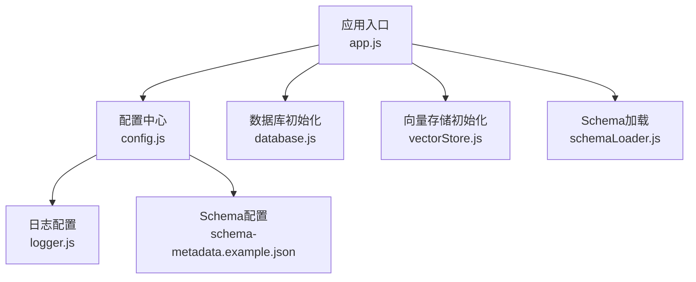
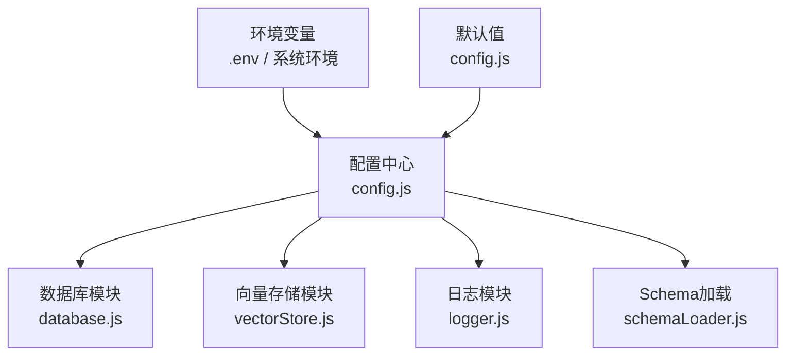
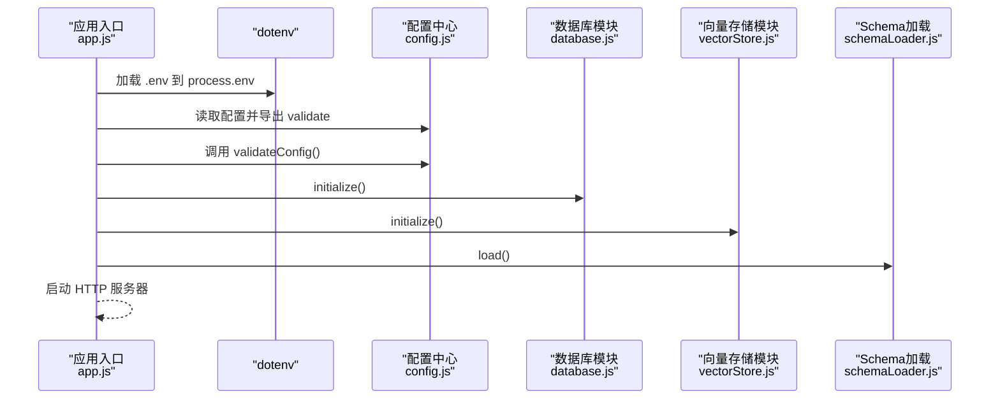
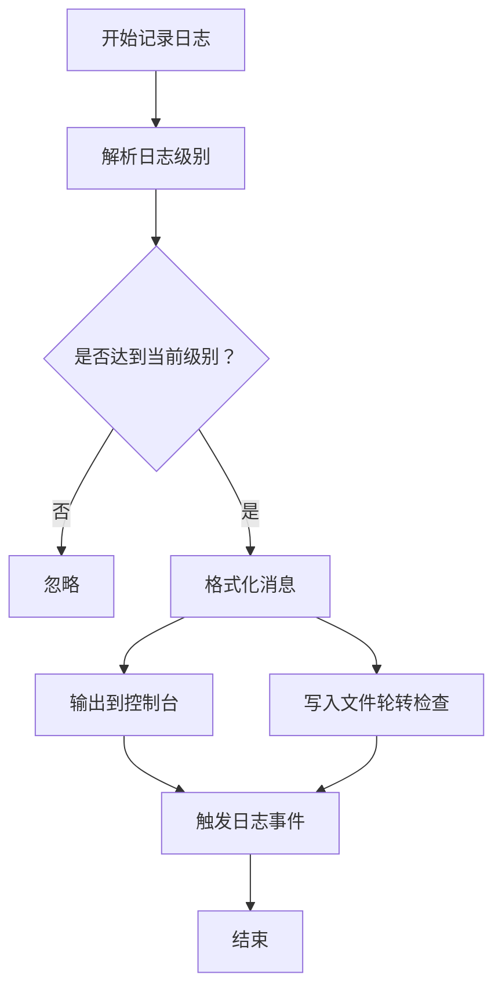
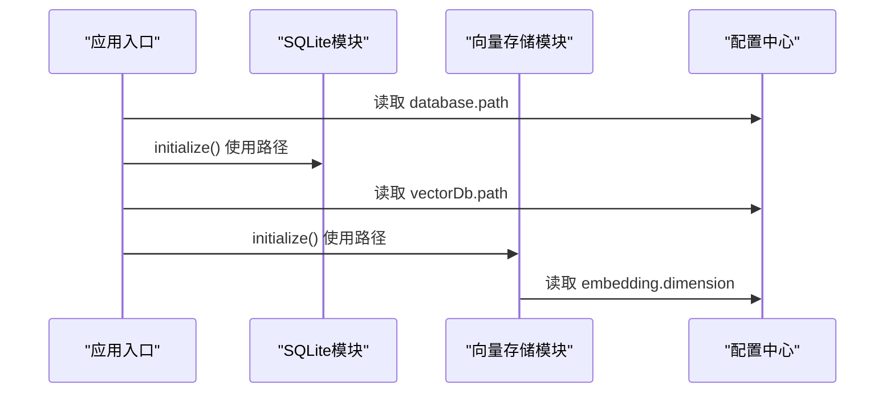
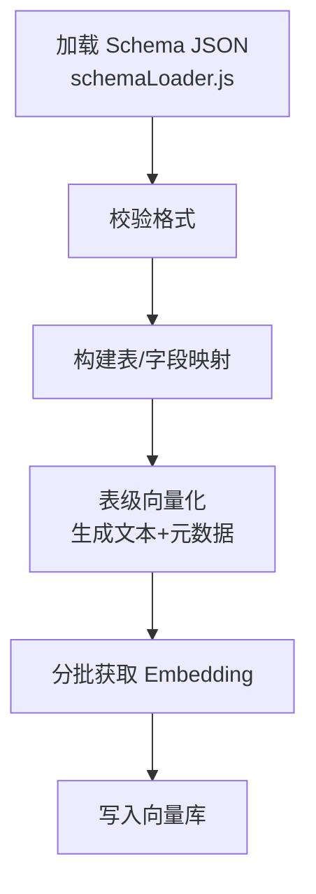
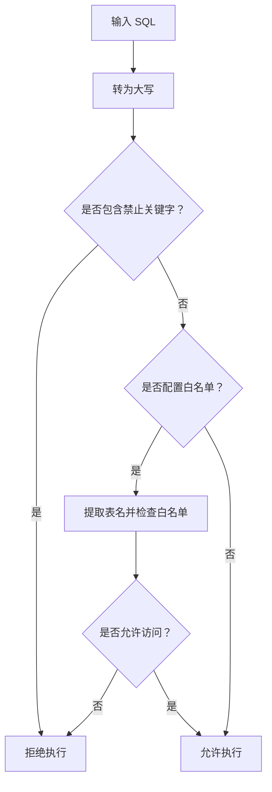
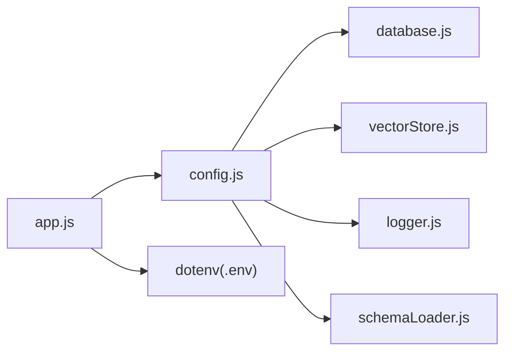

# 配置管理

<cite>
**本文引用的文件**
- [config.js](file://backend/src/core/config.js)
- [app.js](file://backend/src/app.js)
- [logger.js](file://backend/src/utils/logger.js)
- [database.js](file://backend/src/core/database.js)
- [vectorStore.js](file://backend/src/memory/vectorStore.js)
- [schemaLoader.js](file://backend/src/core/schemaLoader.js)
- [schema-metadata.example.json](file://backend/config/schema-metadata.example.json)
- [package.json](file://backend/package.json)
</cite>

## 目录
1. [简介](#简介)
2. [项目结构](#项目结构)
3. [核心组件](#核心组件)
4. [架构总览](#架构总览)
5. [详细组件分析](#详细组件分析)
6. [依赖分析](#依赖分析)
7. [性能考虑](#性能考虑)
8. [故障排查指南](#故障排查指南)
9. [结论](#结论)
10. [附录](#附录)

## 简介
本文件系统性阐述 NL2SQL 项目的配置管理设计与实现，覆盖以下方面：
- 全局配置对象的组织方式与默认值设定
- 环境变量读取与优先级规则
- 配置项作用域与影响范围（数据库、AI 服务、内存与性能、安全、日志、Schema、长期记忆、上下文管理、评估）
- 配置验证、热更新与回滚机制现状与建议
- 安全配置指南（敏感信息保护、访问控制）
- 配置继承、优先级与覆盖规则
- 开发、测试、生产三类环境的最佳实践与示例

## 项目结构
配置体系围绕“集中式配置对象 + 环境变量 + 默认值”的模式展开，主要文件如下：
- 配置中心：backend/src/core/config.js
- 应用入口：backend/src/app.js（加载 dotenv 并初始化各模块）
- 日志模块：backend/src/utils/logger.js（读取日志配置）
- 数据库模块：backend/src/core/database.js（读取 SQLite 路径）
- 向量存储模块：backend/src/memory/vectorStore.js（读取向量数据库路径与嵌入维度）
- Schema 加载：backend/src/core/schemaLoader.js（读取 Schema 配置与缓存）
- Schema 示例：backend/config/schema-metadata.example.json
- 依赖与脚本：backend/package.json

**图表来源**
- [app.js:15-50](file://backend/src/app.js#L15-L50)
- [config.js:16-355](file://backend/src/core/config.js#L16-L355)
- [logger.js:22-23](file://backend/src/utils/logger.js#L22-L23)
- [database.js:16-17](file://backend/src/core/database.js#L16-L17)
- [vectorStore.js:16-17](file://backend/src/memory/vectorStore.js#L16-L17)
- [schemaLoader.js:19-20](file://backend/src/core/schemaLoader.js#L19-L20)

**章节来源**
- [app.js:15-50](file://backend/src/app.js#L15-L50)
- [config.js:16-355](file://backend/src/core/config.js#L16-L355)

## 核心组件
- 配置对象 config：统一暴露所有配置项，避免散落的 process.env 访问，提供默认值与环境变量覆盖能力，并导出 validate 方法用于启动校验。
- 环境变量加载：应用入口通过 dotenv 将 .env 文件注入 process.env，随后 config 从其中读取并合并默认值。
- 配置验证：validateConfig 在启动阶段检查必要项（如 LLM API 密钥、SR 数据库连接 URL），并在白名单为空时发出警告。
- 日志配置：日志模块从 config.log 读取级别、文件路径、轮转策略等，支持控制台与文件双输出。
- 数据库与向量存储：分别从 config.database.path 与 config.vectorDb.path 读取路径，确保初始化时使用一致配置。

**章节来源**
- [config.js:366-397](file://backend/src/core/config.js#L366-L397)
- [app.js:15-16](file://backend/src/app.js#L15-L16)
- [logger.js:64-76](file://backend/src/utils/logger.js#L64-L76)
- [database.js:204](file://backend/src/core/database.js#L204)
- [vectorStore.js:243](file://backend/src/memory/vectorStore.js#L243)

## 架构总览
配置系统采用“配置中心 + 环境变量 + 默认值”的三层结构：
- 环境变量层：来自 .env 或系统环境，具有最高优先级
- 默认值层：config.js 中为各配置项提供合理默认值
- 应用层：各模块仅通过 config.xxx 读取，保证一致性与可维护性

**图表来源**
- [config.js:16-355](file://backend/src/core/config.js#L16-L355)
- [database.js:16-17](file://backend/src/core/database.js#L16-L17)
- [vectorStore.js:16-17](file://backend/src/memory/vectorStore.js#L16-L17)
- [logger.js:22-23](file://backend/src/utils/logger.js#L22-L23)
- [schemaLoader.js:19-20](file://backend/src/core/schemaLoader.js#L19-L20)

## 详细组件分析

### 配置对象与环境变量管理
- 服务器基础：端口、运行环境、开发/生产判断函数
- LLM 与 Embedding：API 基础地址、密钥、模型、超时、重试策略、Embedding 维度与超时
- 数据库：SQLite 路径、LanceDB 路径、SR 数据库 URL 与连接池参数
- 安全：表白名单、Dry Run、查询行数上限、查询超时、禁止关键字、敏感字段
- 会话：历史条数、过期时间、清理间隔
- 日志：级别、文件路径、控制台/文件输出、轮转大小与文件数
- 自修复：开关、Cron 表达式、会话检查间隔、慢查询阈值
- Schema：配置文件路径、缓存开关与过期、强制重新向量化
- 长期记忆：开关、是否使用 LLM 提炼、阈值与分级保留策略
- 上下文管理：Token 预算与摘要开关、Token 预留与阈值、摘要轮数与更新间隔
- 评估：开关与统计跟踪、阈值

上述配置项均通过 process.env 读取，若未设置则采用默认值，确保在不同环境中的一致行为。

**章节来源**
- [config.js:16-355](file://backend/src/core/config.js#L16-L355)

### 配置验证与启动流程
- validateConfig：在应用启动时调用，检查 LLM API 密钥与 SR 数据库 URL 是否有效；当 ALLOWED_TABLES 为空时发出警告。
- app.js：加载 dotenv，导入 config 并调用 validate；随后依次初始化 SQLite、LanceDB、Schema、自修复调度器，并启动 HTTP 服务器。

**图表来源**
- [app.js:15-16](file://backend/src/app.js#L15-L16)
- [config.js:366-397](file://backend/src/core/config.js#L366-L397)
- [app.js:97-166](file://backend/src/app.js#L97-L166)

**章节来源**
- [config.js:366-397](file://backend/src/core/config.js#L366-L397)
- [app.js:97-166](file://backend/src/app.js#L97-L166)

### 日志配置与输出
- 日志级别：trace/debug/info/warn/error，支持大小写不敏感解析
- 输出目标：控制台彩色输出与文件轮转输出
- 轮转策略：按文件大小与历史文件数量控制
- Logger 类：封装日志格式化、文件写入、事件发射与追踪上下文

**图表来源**
- [logger.js:92-251](file://backend/src/utils/logger.js#L92-L251)

**章节来源**
- [logger.js:22-23](file://backend/src/utils/logger.js#L22-L23)
- [logger.js:64-76](file://backend/src/utils/logger.js#L64-L76)
- [logger.js:134-206](file://backend/src/utils/logger.js#L134-L206)

### 数据库与向量存储配置
- SQLite：从 config.database.path 读取数据库文件路径，初始化时创建目录与表结构
- LanceDB：从 config.vectorDb.path 读取向量数据库目录，初始化 schema 与 query 两张表
- Embedding：向量维度来自 config.embedding.dimension，用于表级向量化

**图表来源**
- [database.js:204](file://backend/src/core/database.js#L204)
- [vectorStore.js:243](file://backend/src/memory/vectorStore.js#L243)
- [vectorStore.js:283](file://backend/src/memory/vectorStore.js#L283)

**章节来源**
- [database.js:204](file://backend/src/core/database.js#L204)
- [vectorStore.js:243](file://backend/src/memory/vectorStore.js#L243)
- [vectorStore.js:283](file://backend/src/memory/vectorStore.js#L283)

### Schema 元数据与向量化
- Schema 配置：config.schema.configPath 指向 JSON 文件，支持缓存与强制重新向量化
- 加载与校验：schemaLoader.js 读取 JSON 并构建表/字段映射，随后调用向量存储模块进行表级向量化
- 向量化策略：按表生成表级表征文本，附加 scope 与 data_type 元数据，分批获取 Embedding 并入库

**图表来源**
- [schemaLoader.js:69-122](file://backend/src/core/schemaLoader.js#L69-L122)
- [schemaLoader.js:201-281](file://backend/src/core/schemaLoader.js#L201-L281)
- [schema-metadata.example.json:1-328](file://backend/config/schema-metadata.example.json#L1-L328)

**章节来源**
- [schemaLoader.js:69-122](file://backend/src/core/schemaLoader.js#L69-L122)
- [schemaLoader.js:201-281](file://backend/src/core/schemaLoader.js#L201-L281)
- [schema-metadata.example.json:1-328](file://backend/config/schema-metadata.example.json#L1-L328)

### 安全配置与 SQL 验证
- 白名单：ALLOWED_TABLES 为空时发出警告，生产环境务必配置
- 禁止关键字：默认包含 UPDATE/DELETE/DROP/INSERT/ALTER/TRUNCATE/CREATE/GRANT/REVOKE/EXEC/EXECUTE 等
- Dry Run：DRY_RUN=true 仅返回 SQL 不执行
- 查询限制：MAX_QUERY_ROWS 与 QUERY_TIMEOUT 限制结果规模与执行时间
- SQL 验证：validateSQL 检查禁止关键字与白名单

**图表来源**
- [config.js:140-170](file://backend/src/core/config.js#L140-L170)
- [schemaLoader.js:727-763](file://backend/src/core/schemaLoader.js#L727-L763)

**章节来源**
- [config.js:140-170](file://backend/src/core/config.js#L140-L170)
- [schemaLoader.js:727-763](file://backend/src/core/schemaLoader.js#L727-L763)

### 性能参数与内存管理
- LLM/Embedding 超时：LLM_TIMEOUT 与 EMBEDDING_TIMEOUT 控制请求挂起风险
- 连接池：SR 数据库连接池 min/max/acquire/idle 超时
- 日志轮转：按大小与文件数控制磁盘占用
- Token 预算：enableTokenBudget 与阈值控制上下文长度
- 摘要：enableSummarizer、触发轮数、保留轮数、最大摘要 Token 数与更新间隔

**章节来源**
- [config.js:68-87](file://backend/src/core/config.js#L68-L87)
- [config.js:119-130](file://backend/src/core/config.js#L119-L130)
- [config.js:209-213](file://backend/src/core/config.js#L209-L213)
- [config.js:310-332](file://backend/src/core/config.js#L310-L332)

### AI 服务集成
- LLM API Base、Key、Model、超时、重试策略
- Embedding 维度与超时
- 向量化：分批获取 Embedding 并写入向量库

**章节来源**
- [config.js:60-87](file://backend/src/core/config.js#L60-L87)
- [vectorStore.js:254-261](file://backend/src/memory/vectorStore.js#L254-L261)

## 依赖分析
- 配置中心被多个模块依赖：database、vectorStore、logger、schemaLoader
- 环境变量通过 dotenv 注入，dotenv 为开发依赖，生产环境需确保 .env 文件存在或通过系统环境变量提供
- package.json 定义了 Node.js 版本要求与脚本（dev/start）

**图表来源**
- [config.js:16-355](file://backend/src/core/config.js#L16-L355)
- [database.js:16-17](file://backend/src/core/database.js#L16-L17)
- [vectorStore.js:16-17](file://backend/src/memory/vectorStore.js#L16-L17)
- [logger.js:22-23](file://backend/src/utils/logger.js#L22-L23)
- [schemaLoader.js:19-20](file://backend/src/core/schemaLoader.js#L19-L20)
- [app.js:15-16](file://backend/src/app.js#L15-L16)
- [package.json:14](file://backend/package.json#L14)

**章节来源**
- [package.json:14](file://backend/package.json#L14)

## 性能考虑
- 合理设置 LLM/Embedding 超时，避免大模型请求阻塞
- 连接池参数与查询超时共同保障数据库稳定性
- 日志轮转避免磁盘膨胀
- Token 预算与摘要策略平衡上下文长度与成本
- 向量化批量处理与缓存减少重复计算

[本节为通用指导，无需特定文件引用]

## 故障排查指南
- 启动报错：缺少 LLM API 密钥或 SR 数据库 URL，validateConfig 会抛出错误
- 白名单为空：生产环境未配置 ALLOWED_TABLES 会触发警告
- 日志文件无法写入：检查 LOG_FILE 路径权限与磁盘空间
- 向量库未初始化：检查 VECTOR_DB_PATH 与权限，确认向量存储模块初始化流程
- SQL 被拒绝：检查 forbiddenKeywords 与白名单配置

**章节来源**
- [config.js:366-397](file://backend/src/core/config.js#L366-L397)
- [app.js:160-165](file://backend/src/app.js#L160-L165)
- [logger.js:193-210](file://backend/src/utils/logger.js#L193-L210)
- [vectorStore.js:231-261](file://backend/src/memory/vectorStore.js#L231-L261)
- [schemaLoader.js:727-763](file://backend/src/core/schemaLoader.js#L727-L763)

## 结论
NL2SQL 的配置管理以集中式配置对象为核心，结合环境变量与默认值，实现了清晰、可维护、可移植的配置体系。通过 validateConfig 与模块化初始化，确保应用在不同环境下的稳定启动。建议在生产环境严格配置白名单、密钥与数据库连接，并结合日志轮转与性能参数优化，持续监控与迭代配置策略。

[本节为总结，无需特定文件引用]

## 附录

### 配置项清单与默认值（节选）
- 服务器基础：端口、NODE_ENV、开发/生产判断
- LLM：apiBase、apiKey、model、timeout、maxRetries、retryDelay
- Embedding：model、dimension、timeout
- 数据库：SQLite 路径、SR 数据库 URL、连接池参数
- 安全：allowedTables、dryRun、maxQueryRows、queryTimeout、forbiddenKeywords、sensitiveFields
- 会话：maxHistory、expireTime、cleanupInterval
- 日志：level、file、console、fileOutput、maxSize、maxFiles
- 自修复：enabled、dailyCheckCron、sessionCheckInterval、slowQueryThreshold
- Schema：configPath、enableCache、cacheExpireTime、revectorize
- 长期记忆：enabled、useLLMForExtraction、阈值与保留策略
- 上下文管理：enableTokenBudget、enableSummarizer、tokenBudget、summarizer
- 评估：enabled、trackStats、thresholds

**章节来源**
- [config.js:16-355](file://backend/src/core/config.js#L16-L355)

### 环境变量与默认值优先级
- 优先级：process.env > 默认值
- 加载顺序：app.js 中 require('dotenv').config() 先于 config.js 读取
- 建议：生产环境通过系统环境变量覆盖，开发环境使用 .env 文件

**章节来源**
- [app.js:15-16](file://backend/src/app.js#L15-L16)
- [config.js:16-355](file://backend/src/core/config.js#L16-L355)

### 配置验证、热更新与回滚
- 验证：启动时 validateConfig 检查必要项与白名单
- 热更新：当前实现未提供运行时热更新；建议通过进程管理器（如 PM2）在变更配置后重启
- 回滚：建议保留 .env.bak 或通过版本化配置管理工具进行回滚

**章节来源**
- [config.js:366-397](file://backend/src/core/config.js#L366-L397)

### 安全配置最佳实践
- 保护密钥：LLM_API_KEY、SR_DATABASE_URL 必须保密，使用环境变量或密钥管理服务
- 白名单：生产环境必须配置 ALLOWED_TABLES，避免任意表访问
- 禁止关键字：保持默认禁止列表，避免危险操作
- 敏感字段：在安全策略中加入敏感字段脱敏
- 访问控制：CORS 在生产环境限定来源，避免通配

**章节来源**
- [config.js:140-170](file://backend/src/core/config.js#L140-L170)
- [app.js:65](file://backend/src/app.js#L65)

### 开发/测试/生产环境示例
- 开发环境：NODE_ENV=development，端口 3000，允许白名单为空（仅开发），日志级别 info，启用详细日志
- 测试环境：NODE_ENV=test，端口 3001，Dry Run=true，较小的查询超时与行数限制
- 生产环境：NODE_ENV=production，严格白名单，禁用 Dry Run，启用日志轮转与慢查询监控，连接池参数优化

[本节为通用指导，无需特定文件引用]