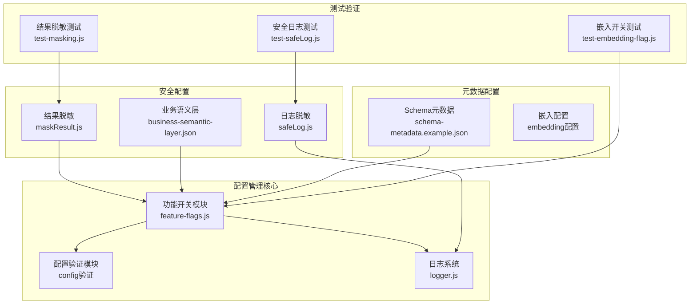
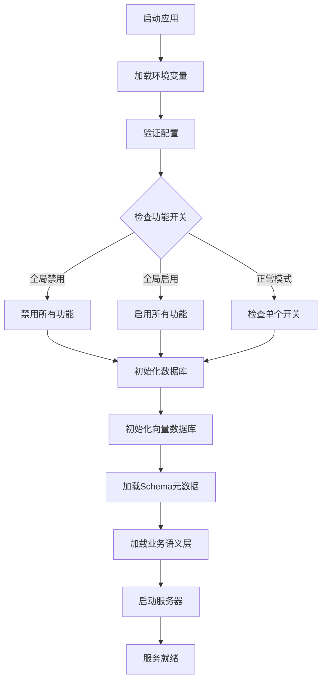
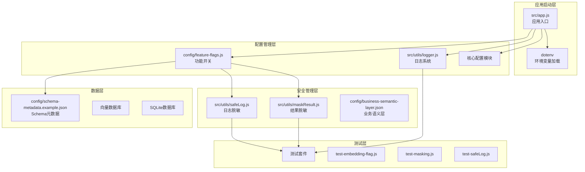
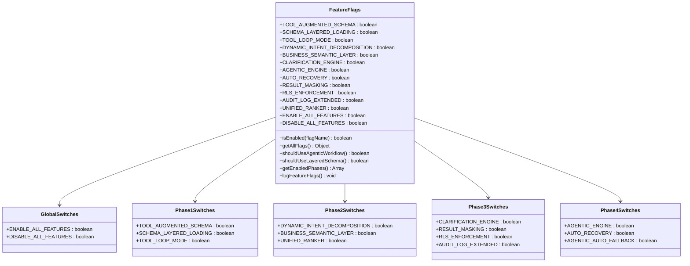
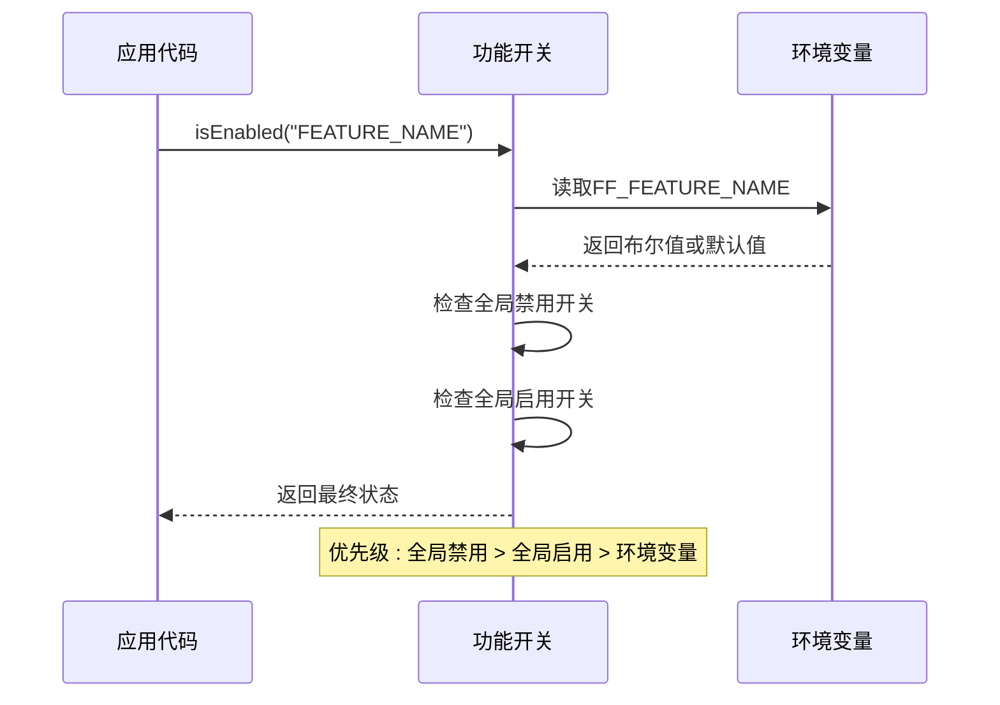
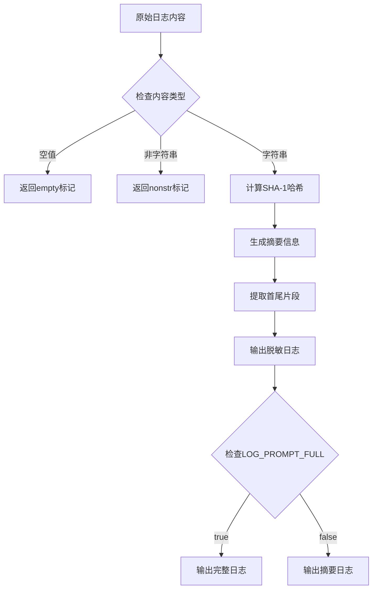
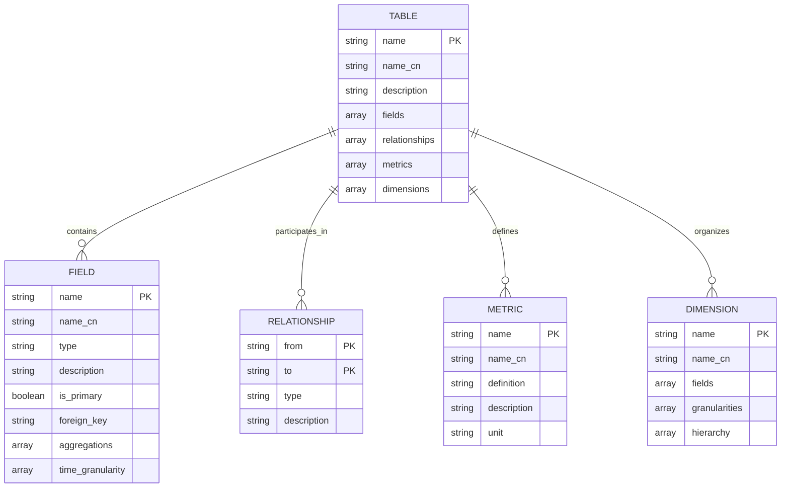
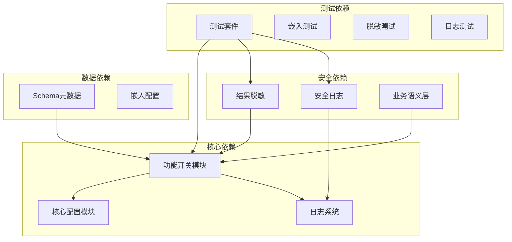

# 配置管理系统

<cite>
**本文档引用的文件**
- [feature-flags.js](file://backend/config/feature-flags.js)
- [app.js](file://backend/src/app.js)
- [business-semantic-layer.json](file://backend/config/business-semantic-layer.json)
- [schema-metadata.example.json](file://backend/config/schema-metadata.example.json)
- [logger.js](file://backend/src/utils/logger.js)
- [safeLog.js](file://backend/src/utils/safeLog.js)
- [maskResult.js](file://backend/src/utils/maskResult.js)
- [test-embedding-flag.js](file://backend/test/phase1/test-embedding-flag.js)
- [test-safeLog.js](file://backend/test/phase3/test-safeLog.js)
- [test-masking.js](file://backend/test/phase3/test-masking.js)
- [package.json](file://backend/package.json)
</cite>

## 目录
1. [简介](#简介)
2. [项目结构](#项目结构)
3. [核心组件](#核心组件)
4. [架构概览](#架构概览)
5. [详细组件分析](#详细组件分析)
6. [依赖分析](#依赖分析)
7. [性能考虑](#性能考虑)
8. [故障排除指南](#故障排除指南)
9. [结论](#结论)
10. [附录](#附录)

## 简介

NL2SQL 配置管理系统是一个基于环境变量的功能开关控制系统，专为渐进式发布和功能管理而设计。该系统支持动态启用/禁用新功能，提供快速回滚机制，并确保生产环境的稳定性和安全性。

系统采用分阶段的渐进式发布策略，将新功能按照 Phase 1 到 Phase 4 进行组织，每个阶段包含相关的功能开关。通过环境变量配置，管理员可以在不重启服务的情况下动态调整功能状态。

## 项目结构

NL2SQL 配置管理系统主要由以下核心组件构成：

**图表来源**
- [feature-flags.js:1-294](file://backend/config/feature-flags.js#L1-L294)
- [logger.js:1-482](file://backend/src/utils/logger.js#L1-L482)
- [maskResult.js:1-198](file://backend/src/utils/maskResult.js#L1-L198)

**章节来源**
- [app.js:15-50](file://backend/src/app.js#L15-L50)
- [package.json:16-31](file://backend/package.json#L16-L31)

## 核心组件

### 功能开关系统

功能开关系统是配置管理的核心，提供了灵活的功能控制机制：

| 组件 | 描述 | 类型 |
|------|------|------|
| **全局开关** | ENABLE_ALL_FEATURES/DISABLE_ALL_FEATURES | 布尔开关 |
| **Phase 1 开关** | TOOL_AUGMENTED_SCHEMA/SCHEMA_LAYERED_LOADING/TOOL_LOOP_MODE | 工具化Schema探索 |
| **Phase 2 开关** | DYNAMIC_INTENT_DECOMPOSITION/BUSINESS_SEMANTIC_LAYER/UNIFIED_RANKER | 动态意图拆解 |
| **Phase 3 开关** | CLARIFICATION_ENGINE/RESULT_MASKING/RLS_ENFORCEMENT/AUDIT_LOG_EXTENDED | 澄清机制与安全 |
| **Phase 4 开关** | AGENTIC_ENGINE/AUTO_RECOVERY/AGENTIC_AUTO_FALLBACK | 多步推理与自我修正 |

### 配置验证机制

系统实现了多层次的配置验证：

**图表来源**
- [app.js:99-204](file://backend/src/app.js#L99-L204)
- [feature-flags.js:153-166](file://backend/config/feature-flags.js#L153-L166)

**章节来源**
- [feature-flags.js:16-141](file://backend/config/feature-flags.js#L16-L141)
- [app.js:109](file://backend/src/app.js#L109)

## 架构概览

NL2SQL 配置管理系统的整体架构采用模块化设计，各组件职责清晰：

**图表来源**
- [app.js:39-52](file://backend/src/app.js#L39-L52)
- [feature-flags.js:280-294](file://backend/config/feature-flags.js#L280-L294)

## 详细组件分析

### 功能开关模块

功能开关模块提供了完整的功能控制机制：

#### 开关分类与优先级

**图表来源**
- [feature-flags.js:16-141](file://backend/config/feature-flags.js#L16-L141)

#### 功能开关检查流程

**图表来源**
- [feature-flags.js:153-166](file://backend/config/feature-flags.js#L153-L166)

**章节来源**
- [feature-flags.js:153-294](file://backend/config/feature-flags.js#L153-L294)

### 安全配置系统

#### 结果脱敏机制

结果脱敏系统提供了多种脱敏规则，确保敏感数据的安全传输：

| 脱敏规则 | 适用场景 | 处理逻辑 |
|----------|----------|----------|
| **mid_4** | 手机号脱敏 | 保留前3位和后4位，中间4位用星号替换 |
| **domain_only** | 邮箱脱敏 | 仅保留@符号及域名部分 |
| **head_tail** | 身份证号脱敏 | 保留前6位和后3位 |
| **redact** | 密码令牌脱敏 | 完全替换为星号 |
| **first_1** | 中文姓名脱敏 | 仅保留第一个字符 |
| **last_4** | 银行卡号脱敏 | 保留后4位 |
| **length_stars** | 长度脱敏 | 保持原长度但全部替换为星号 |

#### 日志脱敏系统

日志脱敏系统提供了安全的日志记录机制：

**图表来源**
- [safeLog.js:20-64](file://backend/src/utils/safeLog.js#L20-L64)

**章节来源**
- [maskResult.js:19-91](file://backend/src/utils/maskResult.js#L19-L91)
- [safeLog.js:13-71](file://backend/src/utils/safeLog.js#L13-L71)

### 配置文件组织结构

#### Schema元数据配置

Schema元数据配置文件提供了数据库表结构的详细描述：

**图表来源**
- [schema-metadata.example.json:4-327](file://backend/config/schema-metadata.example.json#L4-L327)

#### 业务语义层配置

业务语义层配置将业务概念映射到技术实现：

| 配置类别 | 描述 | 示例 |
|----------|------|------|
| **概念映射** | 业务概念到物理表的映射关系 | "老平台" → "new_tzpingtaiold" |
| **查询模式** | 常见查询场景的模板定义 | "玩家筛选+行为分析" |
| **字段映射** | 业务字段到技术字段的映射 | "game_id" → "游戏ID" |
| **数据源映射** | 业务系统到数据库的映射 | "new_tzpingtai" → "新平台数据库" |

**章节来源**
- [business-semantic-layer.json:1-189](file://backend/config/business-semantic-layer.json#L1-L189)

## 依赖分析

### 组件耦合关系

**图表来源**
- [app.js:39-52](file://backend/src/app.js#L39-L52)
- [feature-flags.js:280-294](file://backend/config/feature-flags.js#L280-L294)

### 外部依赖

系统依赖的主要外部包：

| 依赖包 | 版本 | 用途 |
|--------|------|------|
| **dotenv** | ^16.3.1 | 环境变量文件加载 |
| **express** | ^4.18.2 | Web服务器框架 |
| **mysql2** | ^3.10.0 | MySQL数据库连接 |
| **node-sql-parser** | ^5.4.0 | SQL解析器 |
| **vectordb** | ^0.4.0 | 向量数据库接口 |
| **uuid** | ^9.0.0 | 唯一标识符生成 |

**章节来源**
- [package.json:16-31](file://backend/package.json#L16-L31)

## 性能考虑

### 功能开关性能优化

功能开关系统采用了多项性能优化策略：

1. **缓存机制**：功能开关状态在模块加载时缓存，避免重复计算
2. **早期返回**：全局开关检查采用早期返回机制，减少不必要的计算
3. **惰性加载**：配置验证和模块初始化按需进行

### 内存管理

日志系统实现了智能的内存管理：

- **追踪上下文限制**：最大500个追踪会话，防止内存泄漏
- **自动清理**：10分钟超时自动清理僵尸追踪条目
- **文件轮转**：支持日志文件大小限制和数量限制

## 故障排除指南

### 常见问题诊断

#### 功能开关不生效

**症状**：设置环境变量后功能开关状态未改变

**排查步骤**：
1. 检查环境变量是否正确设置
2. 验证全局开关优先级
3. 确认模块重新加载

#### 安全日志问题

**症状**：日志中出现敏感信息

**排查步骤**：
1. 检查LOG_PROMPT_FULL环境变量设置
2. 验证脱敏规则配置
3. 确认日志级别设置

#### 配置验证失败

**症状**：应用启动时报配置错误

**排查步骤**：
1. 检查配置文件语法
2. 验证必需字段完整性
3. 确认数据类型正确性

**章节来源**
- [test-embedding-flag.js:17-47](file://backend/test/phase1/test-embedding-flag.js#L17-L47)
- [test-safeLog.js:81-97](file://backend/test/phase3/test-safeLog.js#L81-L97)
- [test-masking.js:165-171](file://backend/test/phase3/test-masking.js#L165-L171)

## 结论

NL2SQL 配置管理系统通过精心设计的功能开关机制，为渐进式发布提供了强大的支撑。系统的主要优势包括：

1. **灵活的功能控制**：支持细粒度的功能开关管理
2. **安全的发布策略**：提供快速回滚和紧急关闭机制
3. **完善的监控审计**：集成日志系统和配置验证
4. **可靠的性能保证**：优化的内存管理和缓存机制

该系统为NL2SQL项目的持续演进提供了坚实的基础，确保了功能发布的可控性和安全性。

## 附录

### 配置最佳实践

#### 环境变量命名规范
- 使用FF_前缀表示功能开关
- 使用EMBEDDING_前缀表示嵌入配置
- 使用LOG_前缀表示日志配置

#### 配置验证清单
- [ ] 环境变量格式正确
- [ ] 必需字段完整
- [ ] 数据类型匹配
- [ ] 业务规则有效

#### 发布检查清单
- [ ] 功能开关测试通过
- [ ] 安全配置验证
- [ ] 性能基准测试
- [ ] 监控指标检查