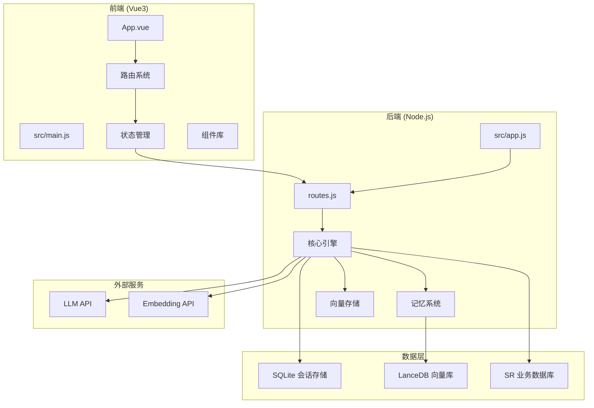
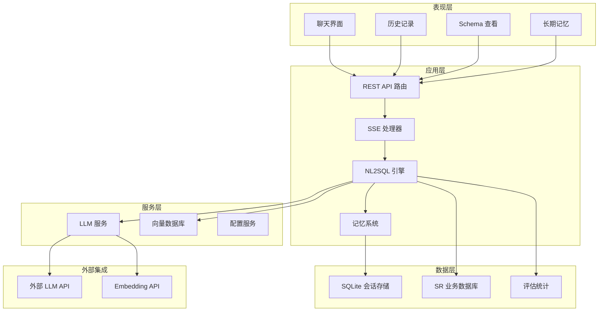
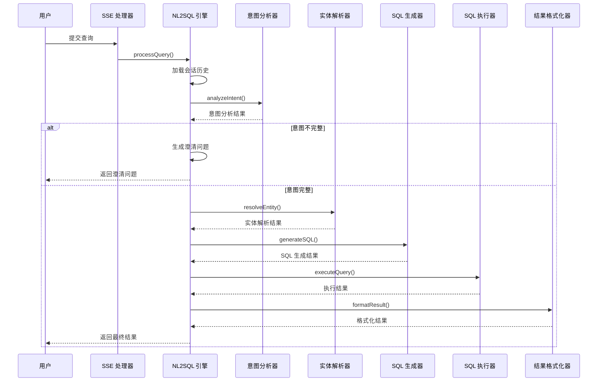
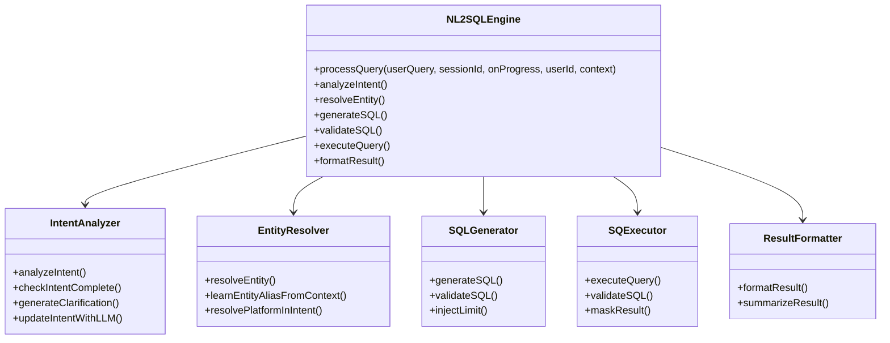
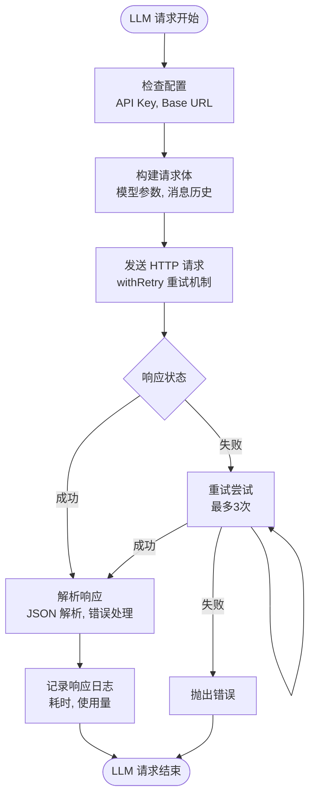
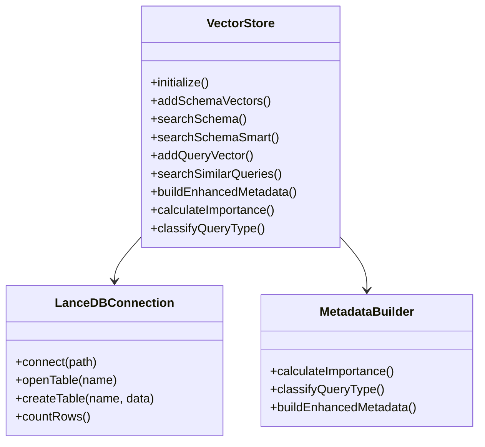
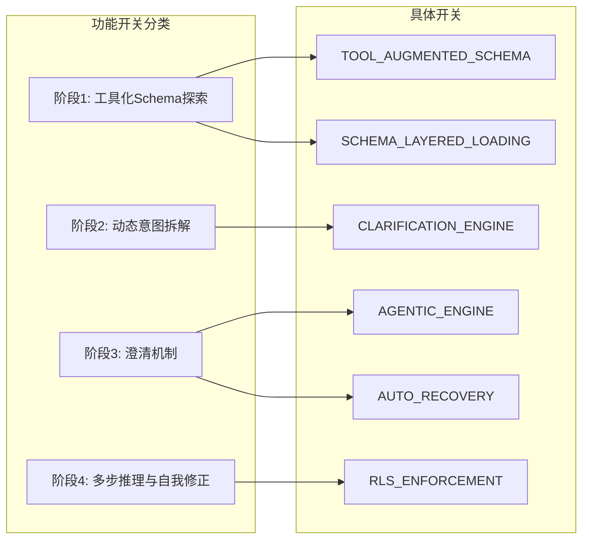
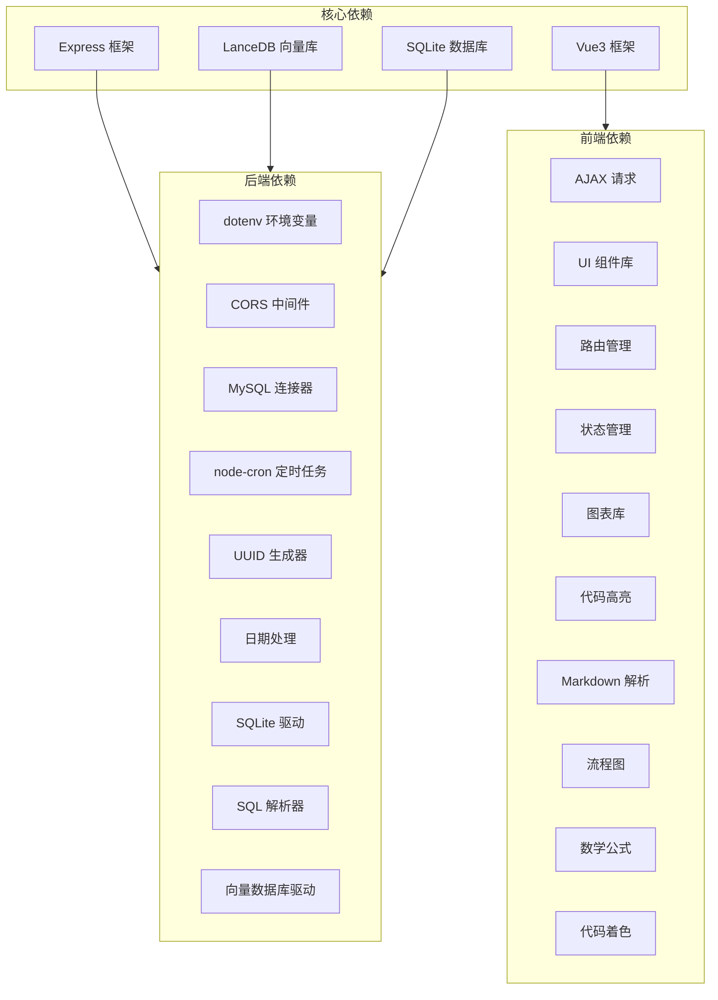

# 项目概述

<cite>
**本文档引用的文件**
- [backend/src/app.js](file://backend/src/app.js)
- [backend/src/core/routes.js](file://backend/src/core/routes.js)
- [backend/src/core/nl2sqlEngine.js](file://backend/src/core/nl2sqlEngine.js)
- [backend/src/core/llmService.js](file://backend/src/core/llmService.js)
- [backend/src/memory/vectorStore.js](file://backend/src/memory/vectorStore.js)
- [backend/config/business-semantic-layer.json](file://backend/config/business-semantic-layer.json)
- [backend/config/feature-flags.js](file://backend/config/feature-flags.js)
- [frontend/src/main.js](file://frontend/src/main.js)
- [frontend/src/App.vue](file://frontend/src/App.vue)
- [frontend/vite.config.js](file://frontend/vite.config.js)
- [backend/package.json](file://backend/package.json)
- [frontend/package.json](file://frontend/package.json)
- [docs/NL2SQL-进度追踪.md](file://docs/NL2SQL-进度追踪.md)
- [docs/NL2SQL核心模块优化实施计划.md](file://docs/NL2SQL核心模块优化实施计划.md)
- [docs/后端架构审查与优化方案.md](file://docs/后端架构审查与优化方案.md)
</cite>

## 目录
1. [简介](#简介)
2. [项目结构](#项目结构)
3. [核心组件](#核心组件)
4. [架构概览](#架构概览)
5. [详细组件分析](#详细组件分析)
6. [依赖分析](#依赖分析)
7. [性能考虑](#性能考虑)
8. [故障排查指南](#故障排查指南)
9. [结论](#结论)
10. [附录](#附录)

## 简介

NL2SQL 自然语言到 SQL 转换系统是一个面向非技术人员的智能数据查询平台，旨在让用户通过自然语言直接查询 SR 系统数据库，无需掌握 SQL 语法即可获得所需数据洞察。

### 核心价值主张
- **零门槛查询**：非技术人员可通过自然语言直接查询数据库
- **智能澄清机制**：当查询信息不足时，系统会主动询问关键信息
- **多阶段 AI 工作流**：从意图识别到 SQL 生成再到结果格式化的完整 AI 驱动流程
- **业务语义理解**：支持业务概念映射，如"老平台"、"新平台"等术语的智能识别
- **长期记忆学习**：系统能够学习用户的查询习惯和偏好，提供个性化服务

### 系统边界与约束
- **数据源限制**：当前主要针对 SR 系统数据库设计
- **技术栈约束**：基于 Node.js + Vue3 的前后端分离架构
- **AI 集成约束**：依赖外部 LLM API，受网络和 API 限制影响
- **向量数据库约束**：基于 LanceDB 的语义检索能力

## 项目结构

项目采用典型的前后端分离架构，后端使用 Node.js + Express 提供 REST API 和实时通信，前端使用 Vue3 + Element Plus 构建用户界面。

**图表来源**
- [backend/src/app.js:1-279](file://backend/src/app.js#L1-L279)
- [frontend/src/main.js:1-89](file://frontend/src/main.js#L1-L89)

**章节来源**
- [backend/src/app.js:1-279](file://backend/src/app.js#L1-L279)
- [frontend/src/main.js:1-89](file://frontend/src/main.js#L1-L89)

## 核心组件

### 后端核心组件

#### 应用启动器 (app.js)
负责整个后端服务的启动和初始化，包括配置验证、数据库初始化、向量数据库初始化、功能开关加载等。

#### REST API 路由 (routes.js)
提供完整的 REST API 接口，包括健康检查、Schema 查询、会话管理、查询历史、用户偏好、评估统计等功能。

#### NL2SQL 核心引擎 (nl2sqlEngine.js)
实现完整的自然语言到 SQL 转换流程，包含意图识别、实体解析、SQL 生成、执行验证、结果格式化等核心功能。

#### LLM 服务 (llmService.js)
封装与外部 LLM API 的通信，提供聊天、简单对话、向量嵌入等核心能力。

#### 向量存储 (vectorStore.js)
基于 LanceDB 实现的向量存储系统，支持 Schema 向量和查询历史向量的存储与检索。

### 前端核心组件

#### 应用入口 (main.js)
Vue3 应用的入口文件，负责应用初始化、插件安装、全局组件注册等。

#### 根组件 (App.vue)
应用的根组件，包含侧边栏导航、会话管理、页面路由等功能。

#### 路由配置 (vite.config.js)
Vite 配置文件，包含开发服务器设置、路径别名、代理配置等。

**章节来源**
- [backend/src/core/routes.js:1-800](file://backend/src/core/routes.js#L1-L800)
- [backend/src/core/nl2sqlEngine.js:1-756](file://backend/src/core/nl2sqlEngine.js#L1-L756)
- [backend/src/core/llmService.js:1-491](file://backend/src/core/llmService.js#L1-L491)
- [backend/src/memory/vectorStore.js:1-800](file://backend/src/memory/vectorStore.js#L1-L800)
- [frontend/src/main.js:1-89](file://frontend/src/main.js#L1-L89)
- [frontend/src/App.vue:1-384](file://frontend/src/App.vue#L1-L384)
- [frontend/vite.config.js:1-93](file://frontend/vite.config.js#L1-L93)

## 架构概览

系统采用分层架构设计，从底层基础设施到上层业务逻辑清晰分离：

**图表来源**
- [backend/src/core/routes.js:1-800](file://backend/src/core/routes.js#L1-L800)
- [backend/src/core/nl2sqlEngine.js:1-756](file://backend/src/core/nl2sqlEngine.js#L1-L756)
- [backend/src/core/llmService.js:1-491](file://backend/src/core/llmService.js#L1-L491)
- [backend/src/memory/vectorStore.js:1-800](file://backend/src/memory/vectorStore.js#L1-L800)

### 技术栈选择与优势

#### 后端技术栈
- **Node.js + Express**: 轻量级、高性能的后端框架，适合实时通信和 API 服务
- **LanceDB**: 基于本地文件的向量数据库，部署简单、性能优异
- **SQLite**: 轻量级数据库，适合会话存储和配置管理
- **LLM 集成**: 支持多种 LLM API，具备良好的扩展性

#### 前端技术栈
- **Vue3**: 现代化的前端框架，具备优秀的开发体验和性能
- **Element Plus**: 完整的 UI 组件库，提供丰富的交互组件
- **Vite**: 快速的构建工具，提供优秀的开发体验

**章节来源**
- [backend/package.json:1-36](file://backend/package.json#L1-L36)
- [frontend/package.json:1-36](file://frontend/package.json#L1-L36)

## 详细组件分析

### NL2SQL 核心引擎

NL2SQL 引擎是整个系统的核心，实现了从自然语言到 SQL 的完整转换流程：

**图表来源**
- [backend/src/core/nl2sqlEngine.js:1-756](file://backend/src/core/nl2sqlEngine.js#L1-L756)

#### 引擎架构设计

引擎采用模块化设计，将复杂的查询处理流程分解为多个专门的模块：

**图表来源**
- [backend/src/core/nl2sqlEngine.js:1-756](file://backend/src/core/nl2sqlEngine.js#L1-L756)

**章节来源**
- [backend/src/core/nl2sqlEngine.js:1-756](file://backend/src/core/nl2sqlEngine.js#L1-L756)

### LLM 服务集成

LLM 服务模块负责与外部 AI 模型进行通信，提供聊天、嵌入向量等核心能力：

**图表来源**
- [backend/src/core/llmService.js:1-491](file://backend/src/core/llmService.js#L1-L491)

**章节来源**
- [backend/src/core/llmService.js:1-491](file://backend/src/core/llmService.js#L1-L491)

### 向量存储系统

向量存储系统基于 LanceDB 实现，提供 Schema 向量和查询历史向量的存储与检索能力：

**图表来源**
- [backend/src/memory/vectorStore.js:1-800](file://backend/src/memory/vectorStore.js#L1-L800)

**章节来源**
- [backend/src/memory/vectorStore.js:1-800](file://backend/src/memory/vectorStore.js#L1-L800)

### 业务语义层

业务语义层配置文件定义了业务概念到物理表的映射关系：

| 业务概念 | 别名 | 描述 | 映射关系 | 优先级 |
|---------|------|------|----------|--------|
| 老平台 | 旧平台, 老版本, 旧版本 | 指平台标识为 old 的数据 | new_tzpingtaiold 数据库 | 1 |
| 新平台 | tzpingtai, 新系统, 新版本 | 指平台标识为 new 的数据 | new_tzpingtai 数据库 | 1 |
| 累计充值 | 累计付费, 总充值, 总付费 | 玩家累计充值金额 | tzpingtai_tz_sdk_log_pf_order 表 | 1 |
| 充值 | 付费, 订单, 流水 | 玩家充值付费行为记录 | pf_order 表 | 2 |
| 注册 | 新增, 首入, signup | 用户在平台的注册行为 | pf_reg 表 | 1 |
| 登录 | 活跃, 在线, login | 用户登录行为记录 | pf_login 表 | 1 |

**章节来源**
- [backend/config/business-semantic-layer.json:1-189](file://backend/config/business-semantic-layer.json#L1-L189)

### 功能开关系统

系统采用渐进式功能发布机制，通过功能开关控制新功能的启用：

**图表来源**
- [backend/config/feature-flags.js:1-294](file://backend/config/feature-flags.js#L1-L294)

**章节来源**
- [backend/config/feature-flags.js:1-294](file://backend/config/feature-flags.js#L1-L294)

## 依赖分析

系统采用模块化设计，各组件之间的依赖关系清晰明确：

**图表来源**
- [backend/package.json:1-36](file://backend/package.json#L1-L36)
- [frontend/package.json:1-36](file://frontend/package.json#L1-L36)

**章节来源**
- [backend/package.json:1-36](file://backend/package.json#L1-L36)
- [frontend/package.json:1-36](file://frontend/package.json#L1-L36)

## 性能考虑

### 系统性能指标

| 指标类别 | 当前状态 | 目标状态 | 优化策略 |
|---------|---------|---------|---------|
| 响应时间 | P95 ~2-3秒 | <1秒 | 优化 SQL 生成, 减少 LLM 调用 |
| Token 消耗 | 4000-6000 tokens | <2000 tokens | 改进上下文压缩, 优化提示词 |
| 向量检索 | 100% 命中率 | 90%+ 精确率 | 优化向量表征, 改进排序算法 |
| 记忆学习 | 实时学习 | 批量学习 | 优化记忆队列, 减少重复学习 |

### 性能优化建议

1. **SQL 生成优化**: 实现候选表智能筛选，减少不必要的表信息注入
2. **上下文压缩**: 改进对话历史压缩算法，保持关键信息的同时减少 Token 消耗
3. **向量检索优化**: 增强向量表征质量，提高检索准确率
4. **缓存策略**: 实现多级缓存，减少重复计算和 API 调用

## 故障排查指南

### 常见问题诊断

#### 启动失败
- 检查环境变量配置是否正确
- 验证数据库连接是否正常
- 确认向量数据库路径是否存在

#### LLM API 调用失败
- 检查 API Key 是否正确配置
- 验证网络连接是否正常
- 查看重试机制是否正常工作

#### 向量检索异常
- 确认向量数据库是否初始化成功
- 检查嵌入向量是否正确生成
- 验证查询向量是否与训练向量维度匹配

#### 功能开关异常
- 检查环境变量是否正确设置
- 验证功能开关状态是否符合预期
- 确认相关配置文件是否正确加载

**章节来源**
- [backend/src/app.js:198-279](file://backend/src/app.js#L198-L279)

## 结论

NL2SQL 系统通过先进的 AI 技术和精心设计的架构，为非技术人员提供了一个强大而易用的数据查询平台。系统的核心优势在于：

1. **完整的 AI 驱动流程**: 从自然语言理解到 SQL 生成的完整自动化
2. **智能澄清机制**: 能够主动识别并获取缺失的关键信息
3. **业务语义理解**: 支持复杂的业务概念映射和理解
4. **可扩展的架构设计**: 模块化设计便于功能扩展和维护
5. **渐进式功能发布**: 通过功能开关实现安全的功能迭代

### 发展规划

根据项目进度追踪，系统目前处于阶段二的核心功能实现阶段，预计在接下来的几个月内完成：

1. **真实数据库连接**: 实现与 SR 系统的真实数据源连接
2. **复杂查询优化**: 提升复杂查询场景的准确率和性能
3. **结果可视化**: 集成图表展示功能
4. **数据安全增强**: 实现敏感字段脱敏和行级权限控制
5. **自修复机制完善**: 建立完善的系统自修复和监控体系

### 技术建议

1. **持续优化 AI 模型集成**: 通过 A/B 测试选择最优的 LLM 配置
2. **加强数据治理**: 建立 Schema 管理和数据质量监控体系
3. **完善测试体系**: 建立自动化测试和回归测试机制
4. **监控和告警**: 建立完善的系统监控和异常告警机制

## 附录

### 项目里程碑

| 阶段 | 目标 | 完成度 | 关键成果 |
|------|------|--------|---------|
| 阶段一 | MVP 基础架构 | 90% | 核心引擎, 基础界面, 数据存储 |
| 阶段二 | 核心功能实现 | 85% | 意图识别, 澄清机制, SQL 生成 |
| 阶段三 | 增强功能完善 | 60% | 长期记忆, 向量检索, 可视化 |
| 阶段四 | 系统完善优化 | 0% | 性能优化, 安全增强, 自修复 |

### 技术决策依据

1. **前后端分离**: 提高开发效率和用户体验
2. **模块化设计**: 便于功能扩展和维护
3. **渐进式发布**: 降低风险, 支持快速迭代
4. **AI 驱动**: 利用最新的人工智能技术提升用户体验