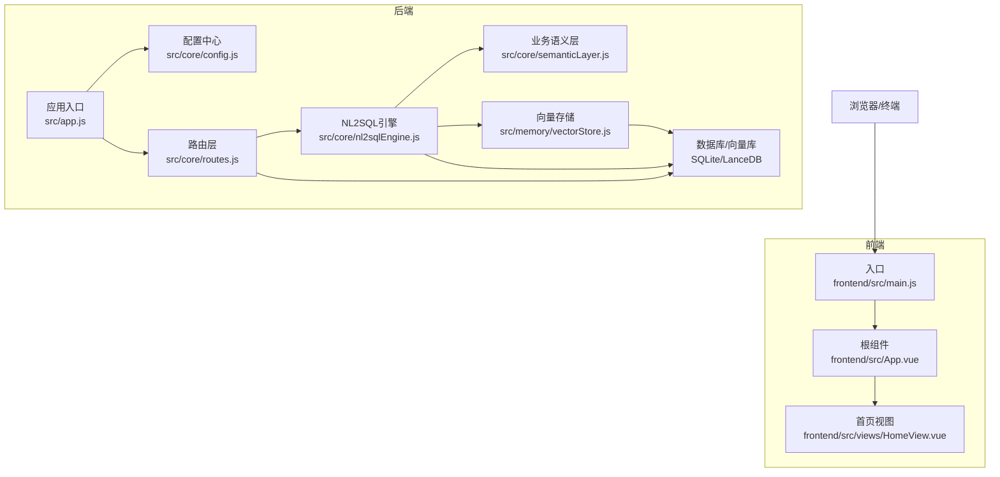
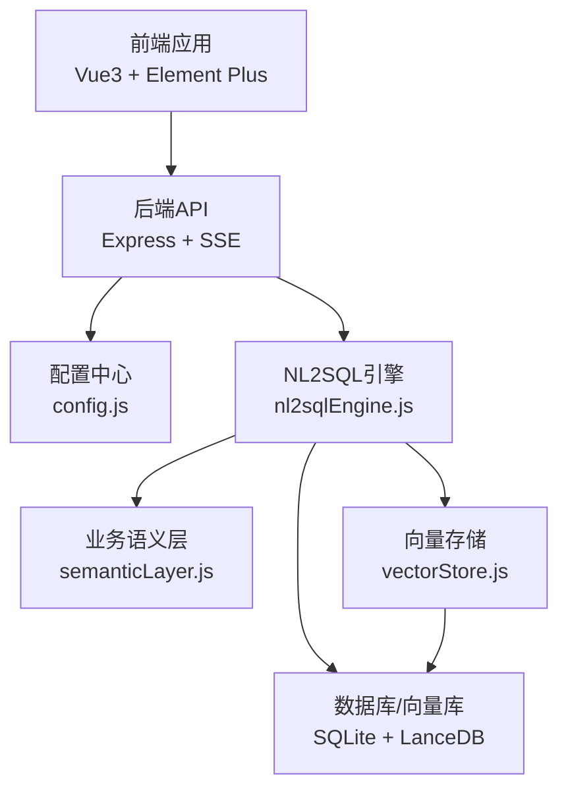
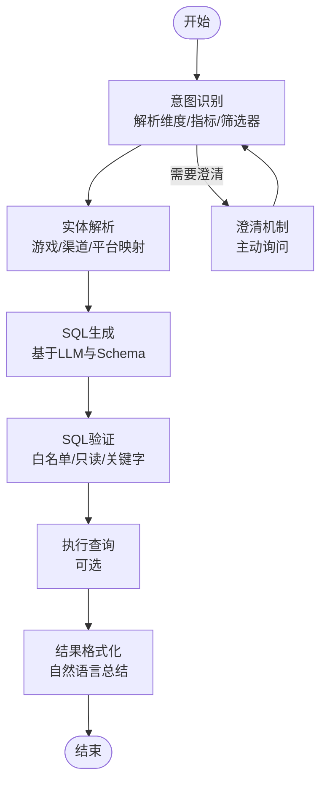
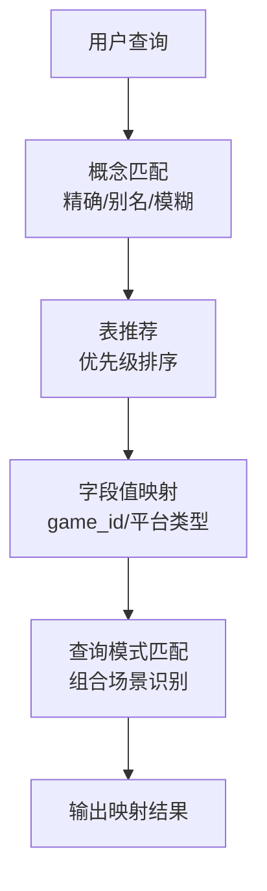
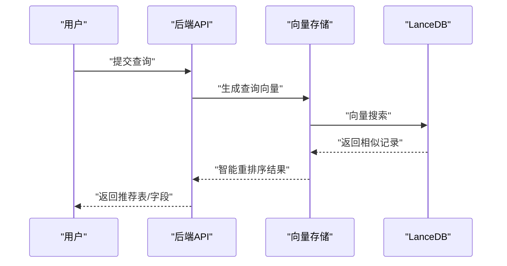
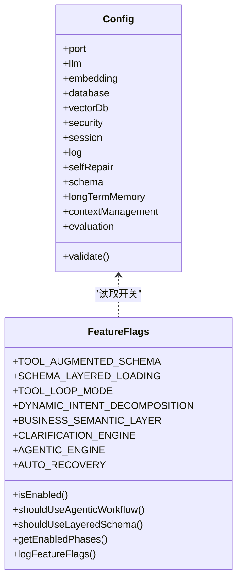
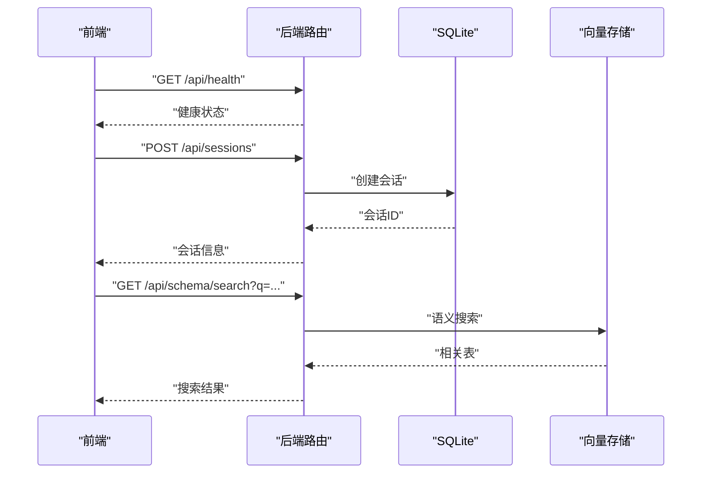
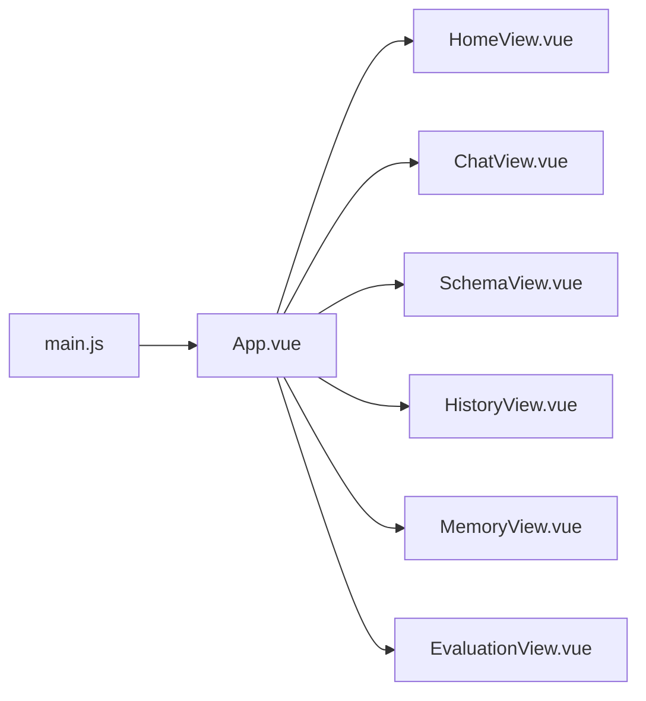
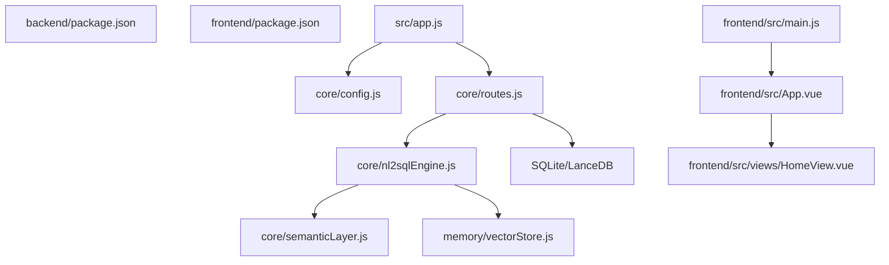

# 项目概述

<cite>
**本文档引用的文件**
- [backend/package.json](file://backend/package.json)
- [frontend/package.json](file://frontend/package.json)
- [backend/src/app.js](file://backend/src/app.js)
- [backend/src/core/nl2sqlEngine.js](file://backend/src/core/nl2sqlEngine.js)
- [backend/src/core/semanticLayer.js](file://backend/src/core/semanticLayer.js)
- [backend/src/memory/vectorStore.js](file://backend/src/memory/vectorStore.js)
- [backend/config/business-semantic-layer.json](file://backend/config/business-semantic-layer.json)
- [backend/config/feature-flags.js](file://backend/config/feature-flags.js)
- [backend/src/core/config.js](file://backend/src/core/config.js)
- [frontend/src/main.js](file://frontend/src/main.js)
- [frontend/src/App.vue](file://frontend/src/App.vue)
- [frontend/src/views/HomeView.vue](file://frontend/src/views/HomeView.vue)
- [backend/src/core/routes.js](file://backend/src/core/routes.js)
- [docs/NL2SQL-进度追踪.md](file://docs/NL2SQL-进度追踪.md)
</cite>

## 目录
1. [简介](#简介)
2. [项目结构](#项目结构)
3. [核心组件](#核心组件)
4. [架构总览](#架构总览)
5. [详细组件分析](#详细组件分析)
6. [依赖关系分析](#依赖关系分析)
7. [性能考量](#性能考量)
8. [故障排查指南](#故障排查指南)
9. [结论](#结论)
10. [附录](#附录)

## 简介
NL2SQL是一个自然语言到SQL查询转换系统，旨在让非技术用户也能通过自然语言描述数据需求，系统自动将其转化为可执行的SQL查询，并返回易于理解的结果。项目采用前后端分离架构，后端基于Node.js + Express提供REST API与SSE流式响应，前端基于Vue3 + Element Plus提供交互式界面。系统具备三层记忆体系（短期会话、长期偏好、向量检索）、业务语义层、澄清机制、自修复与评估能力，支持渐进式功能开关与分阶段演进。

业务意义与应用场景：
- 降低数据分析门槛：业务人员无需掌握SQL即可进行自助查询
- 提升数据洞察效率：通过语义理解与历史查询推荐，加速问题定位
- 增强数据安全性：白名单、只读、超时与关键字过滤等安全策略
- 支持多阶段演进：从MVP到增强功能再到完善优化，逐步完善系统能力

## 项目结构
项目采用前后端分离的模块化组织方式，核心目录如下：
- backend：后端服务，包含核心引擎、记忆系统、向量存储、配置与路由等
- frontend：前端应用，包含路由、状态管理、视图组件与样式
- docs：项目文档与进度追踪

**图表来源**
- [backend/src/app.js:1-260](file://backend/src/app.js#L1-L260)
- [backend/src/core/config.js:1-398](file://backend/src/core/config.js#L1-L398)
- [backend/src/core/routes.js:1-800](file://backend/src/core/routes.js#L1-L800)
- [backend/src/core/nl2sqlEngine.js:1-800](file://backend/src/core/nl2sqlEngine.js#L1-L800)
- [backend/src/core/semanticLayer.js:1-532](file://backend/src/core/semanticLayer.js#L1-L532)
- [backend/src/memory/vectorStore.js:1-800](file://backend/src/memory/vectorStore.js#L1-L800)
- [frontend/src/main.js:1-89](file://frontend/src/main.js#L1-L89)
- [frontend/src/App.vue:1-384](file://frontend/src/App.vue#L1-L384)
- [frontend/src/views/HomeView.vue:1-318](file://frontend/src/views/HomeView.vue#L1-L318)

**章节来源**
- [backend/package.json:1-28](file://backend/package.json#L1-L28)
- [frontend/package.json:1-36](file://frontend/package.json#L1-L36)
- [backend/src/app.js:1-260](file://backend/src/app.js#L1-L260)
- [frontend/src/main.js:1-89](file://frontend/src/main.js#L1-L89)

## 核心组件
- 应用入口与初始化：负责加载环境变量、初始化数据库与向量库、挂载路由、启动HTTP与SSE服务、优雅关闭
- NL2SQL引擎：意图识别、实体解析、SQL生成、验证与结果格式化、澄清与上下文管理
- 业务语义层：将业务概念映射到物理表/字段，支持别名识别与模糊匹配
- 向量存储：基于LanceDB的Schema与查询历史向量化，支持语义检索与智能重排序
- 配置中心：集中管理LLM、数据库、向量库、安全、会话、日志、自修复、Schema与记忆等配置
- 路由层：提供健康检查、Schema查询、会话管理、查询历史、用户偏好与评估接口
- 前端应用：Vue3 + Element Plus，提供聊天界面、Schema查看、历史记录与评估页面

**章节来源**
- [backend/src/app.js:97-188](file://backend/src/app.js#L97-L188)
- [backend/src/core/nl2sqlEngine.js:1-800](file://backend/src/core/nl2sqlEngine.js#L1-L800)
- [backend/src/core/semanticLayer.js:1-532](file://backend/src/core/semanticLayer.js#L1-L532)
- [backend/src/memory/vectorStore.js:1-800](file://backend/src/memory/vectorStore.js#L1-L800)
- [backend/src/core/config.js:1-398](file://backend/src/core/config.js#L1-L398)
- [backend/src/core/routes.js:1-800](file://backend/src/core/routes.js#L1-L800)
- [frontend/src/main.js:1-89](file://frontend/src/main.js#L1-L89)

## 架构总览
系统采用“前端交互 + 后端服务 + 数据存储”的三层架构。前端通过REST API与SSE与后端交互；后端通过配置中心统一管理各类外部服务与内部模块；NL2SQL引擎贯穿意图理解、实体解析、SQL生成与验证；业务语义层提升对业务术语的理解；向量存储支撑Schema与查询历史的语义检索；自修复与评估模块保障系统稳定性与质量。

**图表来源**
- [frontend/src/main.js:1-89](file://frontend/src/main.js#L1-L89)
- [backend/src/core/routes.js:1-800](file://backend/src/core/routes.js#L1-L800)
- [backend/src/core/config.js:1-398](file://backend/src/core/config.js#L1-L398)
- [backend/src/core/nl2sqlEngine.js:1-800](file://backend/src/core/nl2sqlEngine.js#L1-L800)
- [backend/src/core/semanticLayer.js:1-532](file://backend/src/core/semanticLayer.js#L1-L532)
- [backend/src/memory/vectorStore.js:1-800](file://backend/src/memory/vectorStore.js#L1-L800)

## 详细组件分析

### NL2SQL引擎（核心）
NL2SQL引擎负责将自然语言转换为SQL的关键模块，包含意图识别、实体解析、SQL生成、验证与结果格式化等环节。支持澄清机制与上下文管理，结合业务语义层与向量检索提升理解精度。

**图表来源**
- [backend/src/core/nl2sqlEngine.js:1-800](file://backend/src/core/nl2sqlEngine.js#L1-L800)

**章节来源**
- [backend/src/core/nl2sqlEngine.js:1-800](file://backend/src/core/nl2sqlEngine.js#L1-L800)

### 业务语义层（Phase 2）
业务语义层通过配置文件建立业务概念到物理表/字段的映射，支持别名识别、模糊匹配与查询模式识别，显著提升对业务术语的理解能力。

**图表来源**
- [backend/src/core/semanticLayer.js:1-532](file://backend/src/core/semanticLayer.js#L1-L532)
- [backend/config/business-semantic-layer.json:1-189](file://backend/config/business-semantic-layer.json#L1-L189)

**章节来源**
- [backend/src/core/semanticLayer.js:1-532](file://backend/src/core/semanticLayer.js#L1-L532)
- [backend/config/business-semantic-layer.json:1-189](file://backend/config/business-semantic-layer.json#L1-L189)

### 向量存储与语义检索
向量存储模块基于LanceDB实现Schema与查询历史的向量化，支持语义相似度搜索与智能重排序，提升表与查询的推荐质量。

**图表来源**
- [backend/src/memory/vectorStore.js:1-800](file://backend/src/memory/vectorStore.js#L1-L800)

**章节来源**
- [backend/src/memory/vectorStore.js:1-800](file://backend/src/memory/vectorStore.js#L1-L800)

### 配置中心与功能开关
配置中心统一管理LLM、数据库、向量库、安全、会话、日志、自修复、Schema与记忆等配置；功能开关支持分阶段启用新功能，便于渐进式演进与快速回滚。

**图表来源**
- [backend/src/core/config.js:1-398](file://backend/src/core/config.js#L1-L398)
- [backend/config/feature-flags.js:1-249](file://backend/config/feature-flags.js#L1-L249)

**章节来源**
- [backend/src/core/config.js:1-398](file://backend/src/core/config.js#L1-L398)
- [backend/config/feature-flags.js:1-249](file://backend/config/feature-flags.js#L1-L249)

### 路由层与REST API
路由层提供健康检查、Schema查询、会话管理、查询历史、用户偏好与评估等接口，支撑前端交互与系统运维。

**图表来源**
- [backend/src/core/routes.js:1-800](file://backend/src/core/routes.js#L1-L800)

**章节来源**
- [backend/src/core/routes.js:1-800](file://backend/src/core/routes.js#L1-L800)

### 前端应用与交互
前端基于Vue3 + Element Plus，提供聊天界面、Schema查看、历史记录与评估页面，支持侧边栏、会话切换与工具栏。

**图表来源**
- [frontend/src/main.js:1-89](file://frontend/src/main.js#L1-L89)
- [frontend/src/App.vue:1-384](file://frontend/src/App.vue#L1-L384)
- [frontend/src/views/HomeView.vue:1-318](file://frontend/src/views/HomeView.vue#L1-L318)

**章节来源**
- [frontend/src/main.js:1-89](file://frontend/src/main.js#L1-L89)
- [frontend/src/App.vue:1-384](file://frontend/src/App.vue#L1-L384)
- [frontend/src/views/HomeView.vue:1-318](file://frontend/src/views/HomeView.vue#L1-L318)

## 依赖关系分析
后端依赖关系体现为模块间的协作与耦合，前端依赖Vue3生态与Element Plus组件库，配置与功能开关贯穿系统运行。

**图表来源**
- [backend/package.json:1-28](file://backend/package.json#L1-L28)
- [frontend/package.json:1-36](file://frontend/package.json#L1-L36)
- [backend/src/app.js:1-260](file://backend/src/app.js#L1-L260)
- [backend/src/core/routes.js:1-800](file://backend/src/core/routes.js#L1-L800)
- [backend/src/core/nl2sqlEngine.js:1-800](file://backend/src/core/nl2sqlEngine.js#L1-L800)
- [backend/src/core/semanticLayer.js:1-532](file://backend/src/core/semanticLayer.js#L1-L532)
- [backend/src/memory/vectorStore.js:1-800](file://backend/src/memory/vectorStore.js#L1-L800)
- [frontend/src/main.js:1-89](file://frontend/src/main.js#L1-L89)
- [frontend/src/App.vue:1-384](file://frontend/src/App.vue#L1-L384)
- [frontend/src/views/HomeView.vue:1-318](file://frontend/src/views/HomeView.vue#L1-L318)

**章节来源**
- [backend/package.json:1-28](file://backend/package.json#L1-L28)
- [frontend/package.json:1-36](file://frontend/package.json#L1-L36)
- [backend/src/app.js:1-260](file://backend/src/app.js#L1-L260)

## 性能考量
- 向量检索性能：通过智能重排序与过滤策略减少无关结果，提高召回质量
- Token预算与上下文管理：通过摘要与阈值控制避免上下文膨胀
- 数据库连接池与查询超时：合理配置连接池与超时，避免阻塞
- 自修复与评估：定期健康检查与统计收集，及时发现性能瓶颈

[本节为通用指导，无需特定文件来源]

## 故障排查指南
- 启动失败：检查环境变量与配置，确认LLM API密钥与数据库URL有效
- 向量库不可用：确认LanceDB路径与权限，检查初始化日志
- 查询无结果：检查Schema配置与向量是否已向量化，确认业务语义层映射
- 安全策略拦截：检查白名单、禁止关键字与只读模式配置

**章节来源**
- [backend/src/core/config.js:366-388](file://backend/src/core/config.js#L366-L388)
- [backend/src/memory/vectorStore.js:233-263](file://backend/src/memory/vectorStore.js#L233-L263)
- [backend/src/core/routes.js:72-137](file://backend/src/core/routes.js#L72-L137)

## 结论
NL2SQL项目通过前后端分离架构、三层记忆体系与业务语义层，实现了从自然语言到SQL的高效转换。系统具备良好的扩展性与可维护性，支持渐进式功能演进与安全策略落地。当前处于MVP与核心功能阶段，后续将持续完善增强功能与性能优化，逐步达到完善优化阶段。

[本节为总结性内容，无需特定文件来源]

## 附录

### 快速入门指南
- 后端启动
  - 安装依赖：在backend目录执行安装命令
  - 配置环境变量：设置LLM API密钥、数据库URL等
  - 启动服务：执行启动脚本，等待服务初始化完成
- 前端启动
  - 安装依赖：在frontend目录执行安装命令
  - 启动开发服务器：执行开发脚本，访问本地前端页面
- 常用接口
  - 健康检查：GET /api/health
  - 创建会话：POST /api/sessions
  - 搜索Schema：GET /api/schema/search?q=...
  - 获取用户偏好：GET /api/preferences/:userId

**章节来源**
- [backend/package.json:6-9](file://backend/package.json#L6-L9)
- [frontend/package.json:6-10](file://frontend/package.json#L6-L10)
- [backend/src/app.js:170-180](file://backend/src/app.js#L170-L180)
- [backend/src/core/routes.js:72-137](file://backend/src/core/routes.js#L72-L137)
- [backend/src/core/routes.js:266-290](file://backend/src/core/routes.js#L266-L290)
- [backend/src/core/routes.js:225-250](file://backend/src/core/routes.js#L225-L250)
- [backend/src/core/routes.js:553-592](file://backend/src/core/routes.js#L553-L592)

### 发展历程与版本状态
- 阶段一：MVP（基础架构）基本完成，90%
- 阶段二：核心功能部分完成，85%
- 阶段三：增强功能部分完成，60%
- 阶段四：尚未开始，0%

**章节来源**
- [docs/NL2SQL-进度追踪.md:8-16](file://docs/NL2SQL-进度追踪.md#L8-L16)