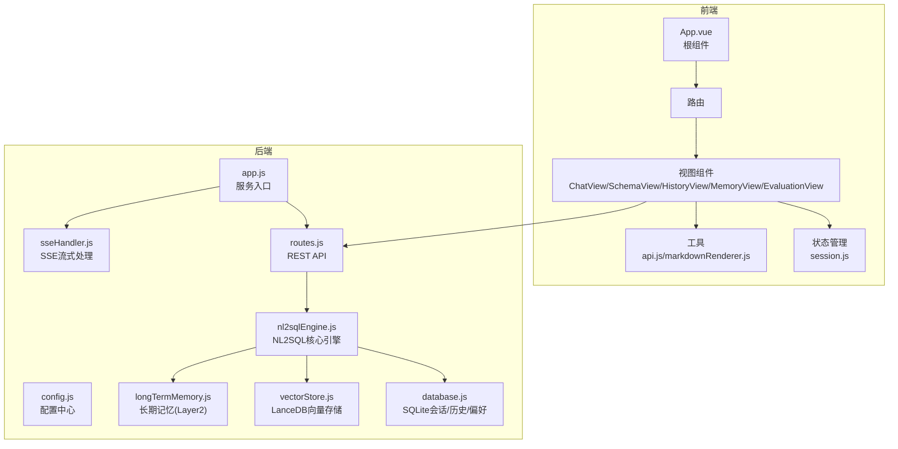
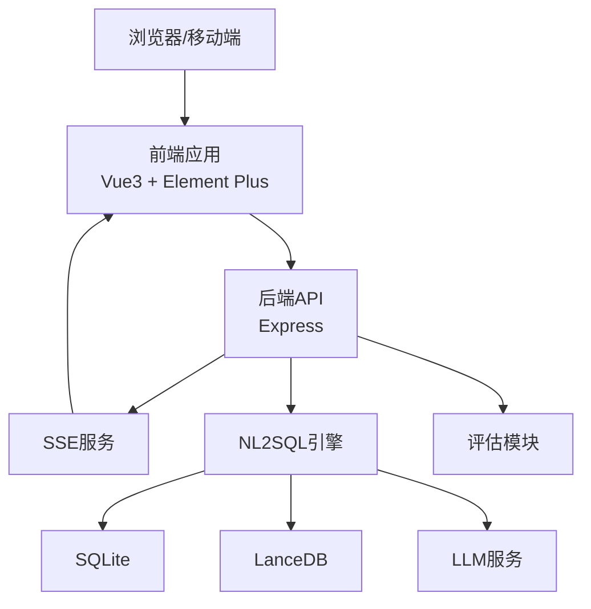
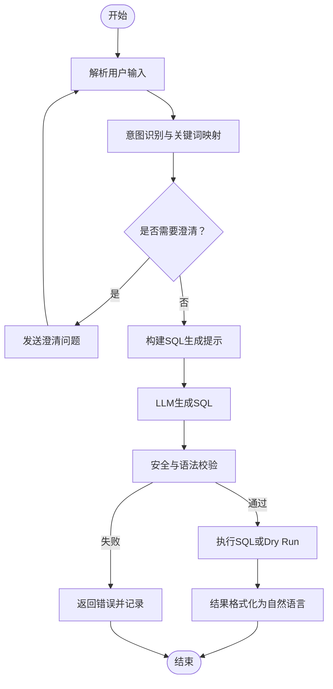
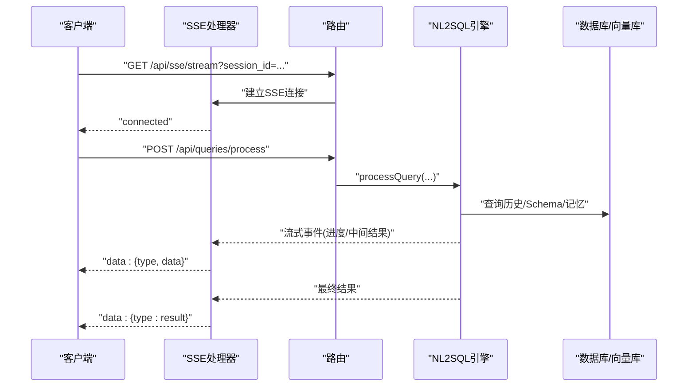
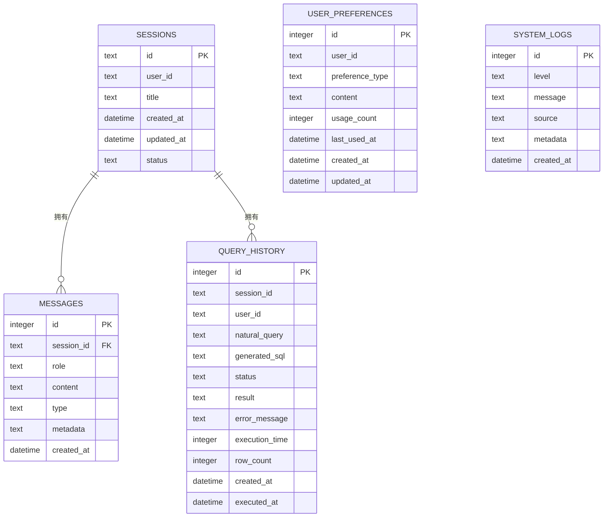
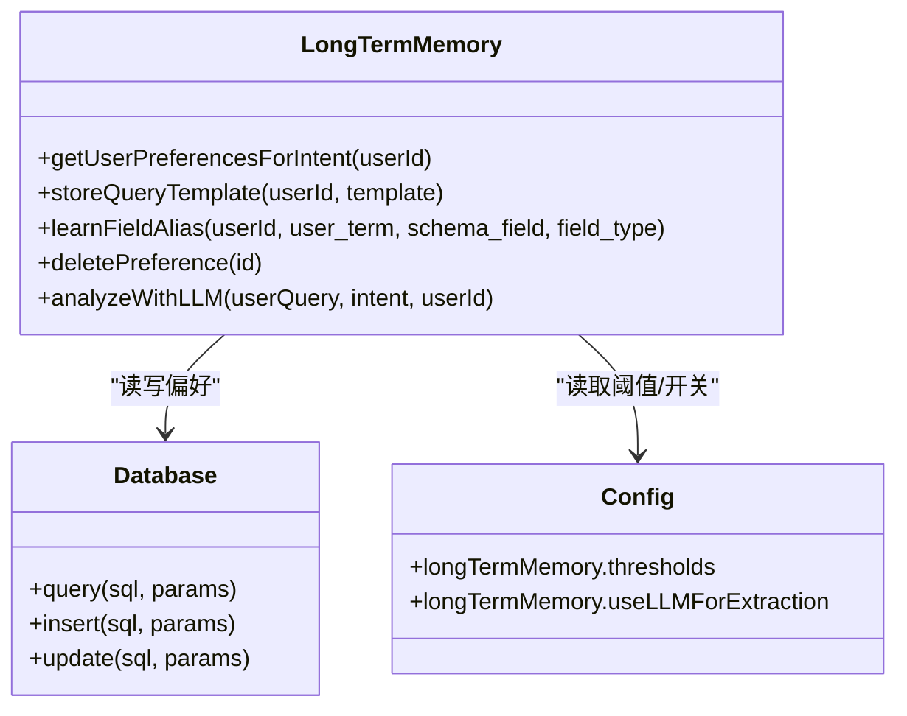
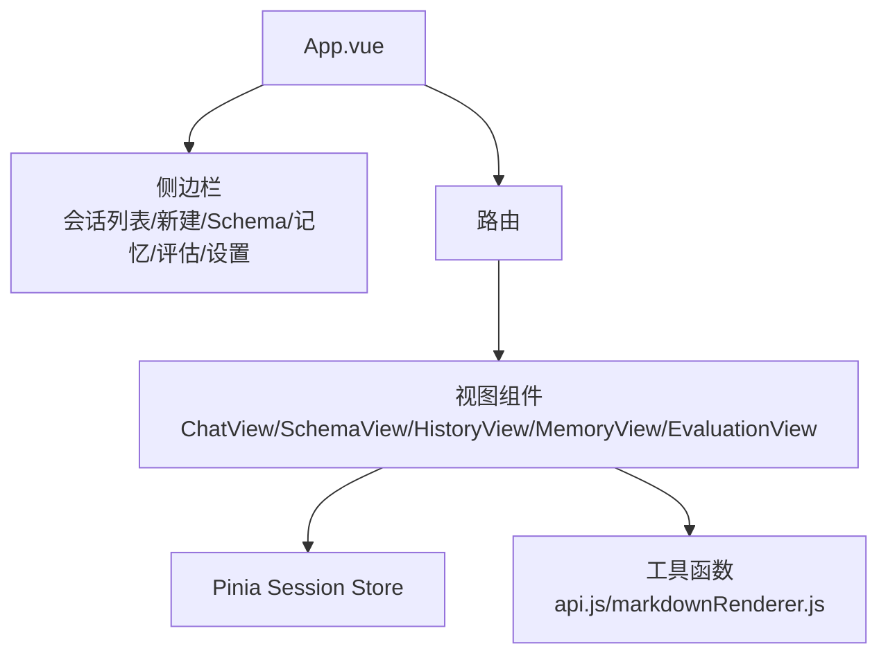
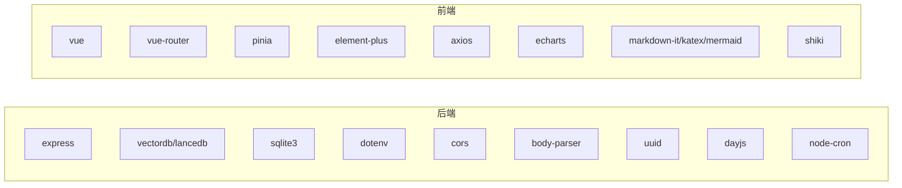

# 项目概述

<cite>
**本文引用的文件**
- [package.json](file://backend/package.json)
- [package.json](file://frontend/package.json)
- [app.js](file://backend/src/app.js)
- [main.js](file://frontend/src/main.js)
- [NL2SQL-进度追踪.md](file://docs/NL2SQL-进度追踪.md)
- [nl2sqlEngine.js](file://backend/src/core/nl2sqlEngine.js)
- [routes.js](file://backend/src/core/routes.js)
- [vectorStore.js](file://backend/src/memory/vectorStore.js)
- [database.js](file://backend/src/core/database.js)
- [config.js](file://backend/src/core/config.js)
- [sseHandler.js](file://backend/src/core/sseHandler.js)
- [longTermMemory.js](file://backend/src/memory/longTermMemory.js)
- [App.vue](file://frontend/src/App.vue)
</cite>

## 目录
1. [简介](#简介)
2. [项目结构](#项目结构)
3. [核心组件](#核心组件)
4. [架构总览](#架构总览)
5. [详细组件分析](#详细组件分析)
6. [依赖分析](#依赖分析)
7. [性能考虑](#性能考虑)
8. [故障排查指南](#故障排查指南)
9. [结论](#结论)
10. [附录](#附录)

## 简介
NL2SQL 是一个“自然语言到 SQL 查询”的智能数据查询系统，旨在降低数据分析门槛，帮助非技术用户通过自然语言快速获得结构化查询结果。系统通过意图识别、澄清机制、LLM 驱动的 SQL 生成、安全校验与结果格式化，形成从自然语言到可执行 SQL 的闭环。项目采用前后端分离架构，后端基于 Node.js/Express 提供 REST API 与 SSE 实时流式响应，前端基于 Vue 3 + Element Plus 构建交互界面，数据库层结合 SQLite 与 LanceDB，分别承担会话与历史数据持久化以及向量检索能力。

本项目当前处于 MVP 阶段，已完成基础架构、核心引擎、Schema 管理、三层记忆系统（Layer 1）、前端界面与自修复机制框架。真实数据库连接仍在验证阶段，后续将逐步完善 SQL 验证与测试工具、结果可视化、数据安全增强与性能优化。

## 项目结构
项目采用典型的前后端分离组织方式：
- 后端（Node.js/Express）
  - 核心模块：配置、数据库、LLM 服务、NL2SQL 引擎、路由、SSE、自修复、向量存储、记忆系统等
  - 数据与日志：SQLite 数据库文件、LanceDB 向量数据库、日志目录
- 前端（Vue 3）
  - 页面：聊天、Schema 查看、历史、记忆、评估等视图
  - 组件：Schema 查看器、路由、状态管理（Pinia）、工具函数等
  - 构建：Vite 配置与打包产物

**图表来源**
- [app.js:1-238](file://backend/src/app.js#L1-L238)
- [routes.js:1-1037](file://backend/src/core/routes.js#L1-L1037)
- [nl2sqlEngine.js:1-2492](file://backend/src/core/nl2sqlEngine.js#L1-L2492)
- [database.js:1-850](file://backend/src/core/database.js#L1-L850)
- [vectorStore.js:1-759](file://backend/src/memory/vectorStore.js#L1-L759)
- [longTermMemory.js:1-1141](file://backend/src/memory/longTermMemory.js#L1-L1141)
- [sseHandler.js:1-349](file://backend/src/core/sseHandler.js#L1-L349)
- [App.vue:1-384](file://frontend/src/App.vue#L1-L384)

**章节来源**
- [app.js:1-238](file://backend/src/app.js#L1-L238)
- [main.js:1-89](file://frontend/src/main.js#L1-L89)

## 核心组件
- 配置中心（config.js）
  - 集中管理 LLM API、Embedding、数据库（SQLite/LanceDB/SR 数据源）、安全策略、会话、日志、自修复、Schema、长期记忆、上下文管理与评估等配置项，并提供启动时校验。
- NL2SQL 引擎（nl2sqlEngine.js）
  - 意图识别、澄清机制、SQL 生成、安全校验、结果格式化；支持业务关键词映射、Schema 提示生成、错误类型化与统一日志对象。
- 路由与 API（routes.js）
  - 健康检查、Schema 查询与搜索、会话管理、查询历史、用户偏好（长期记忆）、评估统计等 REST 接口。
- SSE 实时通信（sseHandler.js）
  - 管理 SSE 连接、消息广播、进度回调、连接清理，支撑前端流式渲染。
- 数据层（database.js）
  - SQLite 表结构：sessions、messages、query_history、user_preferences、system_logs；索引优化与事务支持。
- 向量存储（vectorStore.js）
  - LanceDB 向量存储与检索，增强元数据（重要性评分、查询类型、复杂度、执行信息、意图摘要）。
- 长期记忆（longTermMemory.js）
  - Layer 2 记忆：查询模式、字段别名、常用指标/维度偏好；支持 LLM 智能提炼与逻辑判断双模式。
- 前端应用（App.vue + main.js）
  - 根组件布局、侧边栏、会话管理、路由视图、Element Plus UI 集成与全局样式。

**章节来源**
- [config.js:1-398](file://backend/src/core/config.js#L1-L398)
- [nl2sqlEngine.js:1-2492](file://backend/src/core/nl2sqlEngine.js#L1-L2492)
- [routes.js:1-1037](file://backend/src/core/routes.js#L1-L1037)
- [sseHandler.js:1-349](file://backend/src/core/sseHandler.js#L1-L349)
- [database.js:1-850](file://backend/src/core/database.js#L1-L850)
- [vectorStore.js:1-759](file://backend/src/memory/vectorStore.js#L1-L759)
- [longTermMemory.js:1-1141](file://backend/src/memory/longTermMemory.js#L1-L1141)
- [App.vue:1-384](file://frontend/src/App.vue#L1-L384)
- [main.js:1-89](file://frontend/src/main.js#L1-L89)

## 架构总览
系统采用“前后端分离 + AI 集成 + 实时通信”的整体架构：
- 前端：Vue 3 + Element Plus，提供聊天、Schema 查看、历史、记忆、评估等页面，状态管理与工具函数支撑。
- 后端：Express 提供 REST API 与 SSE；NL2SQL 引擎负责自然语言到 SQL 的转换；SQLite 与 LanceDB 分别承载结构化数据与向量检索；配置中心统一管理运行参数。
- AI 集成：LLM API 用于意图识别、SQL 生成、澄清对话与长期记忆的 LLM 智能提炼；Embedding 用于语义检索与向量化。
- 实时通信：SSE 实现后端流式事件推送，前端逐段渲染，提升用户体验。

**图表来源**
- [routes.js:1-1037](file://backend/src/core/routes.js#L1-L1037)
- [nl2sqlEngine.js:1-2492](file://backend/src/core/nl2sqlEngine.js#L1-L2492)
- [database.js:1-850](file://backend/src/core/database.js#L1-L850)
- [vectorStore.js:1-759](file://backend/src/memory/vectorStore.js#L1-L759)
- [config.js:1-398](file://backend/src/core/config.js#L1-L398)
- [App.vue:1-384](file://frontend/src/App.vue#L1-L384)

## 详细组件分析

### NL2SQL 引擎（意图识别、SQL 生成、澄清与安全校验）
- 意图识别与业务关键词映射：根据 Schema 元数据动态构建关键词到表的映射，辅助推断所需表集合。
- 澄清机制：当信息不足时，引导用户提供更明确的维度/指标/时间范围等。
- SQL 生成：基于 LLM 生成 SQL，结合 Schema 提示与业务映射，提高生成质量。
- 安全校验：白名单表、禁止关键字、只读限制、LIMIT 限制、查询超时、敏感字段脱敏等。
- 结果格式化：将 SQL 执行结果转化为自然语言总结，便于非技术用户理解。

**图表来源**
- [nl2sqlEngine.js:1-2492](file://backend/src/core/nl2sqlEngine.js#L1-L2492)

**章节来源**
- [nl2sqlEngine.js:1-2492](file://backend/src/core/nl2sqlEngine.js#L1-L2492)

### SSE 实时通信（流式响应）
- 连接管理：按会话 ID 维护连接列表，支持多标签页；记录连接、活跃时间与处理状态。
- 消息发送：封装为 SSE 格式，支持连接成功、进度、错误等事件类型。
- 广播：同一会话内的多个连接可被统一广播消息。
- 清理：连接关闭与错误时自动清理映射，避免内存泄漏。

**图表来源**
- [routes.js:1-1037](file://backend/src/core/routes.js#L1-L1037)
- [sseHandler.js:1-349](file://backend/src/core/sseHandler.js#L1-L349)
- [nl2sqlEngine.js:1-2492](file://backend/src/core/nl2sqlEngine.js#L1-L2492)

**章节来源**
- [sseHandler.js:1-349](file://backend/src/core/sseHandler.js#L1-L349)
- [routes.js:1-1037](file://backend/src/core/routes.js#L1-L1037)

### 数据层（SQLite 与 LanceDB）
- SQLite（sessions/messages/query_history/user_preferences/system_logs）
  - 表结构与索引优化，支持会话、消息、查询历史、用户偏好与系统日志的持久化。
- LanceDB（向量存储）
  - 存储 Schema 与查询历史的向量表示，支持语义检索与相似查询推荐；增强元数据包含重要性评分、查询类型、复杂度、执行信息与意图摘要。

**图表来源**
- [database.js:1-850](file://backend/src/core/database.js#L1-L850)

**章节来源**
- [database.js:1-850](file://backend/src/core/database.js#L1-L850)
- [vectorStore.js:1-759](file://backend/src/memory/vectorStore.js#L1-L759)

### 长期记忆（Layer 2）
- 功能：自动提取用户查询偏好（字段别名映射、常用查询模板、指标/维度偏好），并在意图识别时读取，定期压缩与维护。
- 智能提炼：支持 LLM 智能分析与逻辑判断双模式，区分个人偏好与通用知识，设定置信度与阈值。
- 存储结构：按类型（query_pattern/field_alias/metric_preference/dimension_preference）存储，支持手动添加与删除。

**图表来源**
- [longTermMemory.js:1-1141](file://backend/src/memory/longTermMemory.js#L1-L1141)
- [database.js:1-850](file://backend/src/core/database.js#L1-L850)
- [config.js:1-398](file://backend/src/core/config.js#L1-L398)

**章节来源**
- [longTermMemory.js:1-1141](file://backend/src/memory/longTermMemory.js#L1-L1141)
- [config.js:1-398](file://backend/src/core/config.js#L1-L398)

### 前端应用（Vue 3）
- 根组件 App.vue：侧边栏（会话列表、新建会话、Schema 查看、长期记忆、评估、设置、折叠切换）、主内容区（路由视图）。
- 状态管理：Pinia 的 session store 管理会话列表与当前会话。
- 视图组件：ChatView（聊天与流式渲染）、SchemaView（Schema 查看）、HistoryView（历史记录）、MemoryView（长期记忆）、EvaluationView（评估统计）。
- 工具函数：API 调用、Markdown 渲染等。

**图表来源**
- [App.vue:1-384](file://frontend/src/App.vue#L1-L384)
- [main.js:1-89](file://frontend/src/main.js#L1-L89)

**章节来源**
- [App.vue:1-384](file://frontend/src/App.vue#L1-L384)
- [main.js:1-89](file://frontend/src/main.js#L1-L89)

## 依赖分析
- 后端依赖（部分）
  - Express：Web 服务器与路由
  - vectordb/lancedb：向量数据库
  - sqlite3：SQLite 数据库
  - dotenv/cors/body-parser：环境变量、跨域、请求体解析
  - uuid/dayjs/node-cron：ID、时间、定时任务
- 前端依赖（部分）
  - vue/vue-router：框架与路由
  - element-plus/图标：UI 组件库
  - axios：HTTP 请求
  - pinia：状态管理
  - echarts/highlight.js/markdown-it/katex/mermaid/shiki：可视化与渲染

**图表来源**
- [package.json:1-28](file://backend/package.json#L1-L28)
- [package.json:1-36](file://frontend/package.json#L1-L36)

**章节来源**
- [package.json:1-28](file://backend/package.json#L1-L28)
- [package.json:1-36](file://frontend/package.json#L1-L36)

## 性能考虑
- 向量检索性能：通过增强元数据（重要性评分、查询类型、复杂度）与分类（DATA_QUERY/DEFINITION/COMPARISON/TREND/CLARIFICATION/FOLLOW_UP/NEW_TOPIC）优化检索质量与速度。
- 查询超时与行数限制：配置项控制单次查询超时与最大返回行数，防止资源滥用。
- 索引优化：SQLite 表为高频查询字段建立索引，减少查询延迟。
- SSE 流式传输：避免一次性大响应，提升前端渲染体验。
- 评估与统计：运行时统计与评估接口可用于持续优化检索命中率与记忆质量。

[本节为通用性能讨论，不直接分析具体文件]

## 故障排查指南
- 启动失败
  - 检查 .env 必要配置（LLM API 密钥、SR 数据库连接 URL）是否设置；配置校验会在启动时抛出错误。
  - 查看日志文件与控制台输出，定位初始化阶段的异常。
- SSE 连接问题
  - 确认会话 ID 参数有效；检查连接映射与清理逻辑；关注连接关闭与错误回调。
- SQL 生成与执行
  - 开启 Dry Run 模式仅返回生成的 SQL，便于验证；检查白名单表、禁止关键字、LIMIT 限制与超时设置。
- 向量检索与记忆
  - 确认 LanceDB 目录存在且可写；检查 Schema 向量化是否完成；评估接口可用于查看命中率与质量。

**章节来源**
- [config.js:366-398](file://backend/src/core/config.js#L366-L398)
- [database.js:1-850](file://backend/src/core/database.js#L1-L850)
- [vectorStore.js:1-759](file://backend/src/memory/vectorStore.js#L1-L759)
- [routes.js:1-1037](file://backend/src/core/routes.js#L1-L1037)
- [sseHandler.js:1-349](file://backend/src/core/sseHandler.js#L1-L349)

## 结论
NL2SQL 项目以“自然语言到 SQL”为核心目标，结合三层记忆系统、向量检索与实时通信，构建了从意图识别到结果呈现的完整链路。当前已实现基础架构与核心功能，具备良好的扩展性与工程化实践。下一步重点在于完善 SQL 验证与测试工具、结果可视化、数据安全增强与性能优化，逐步接入真实数据库，提升系统稳定性与可用性。

[本节为总结性内容，不直接分析具体文件]

## 附录

### 技术栈概览
- 后端：Node.js + Express + SQLite + LanceDB + LLM API
- 前端：Vue 3 + Element Plus + Axios + ECharts（规划中）
- 开发与构建：Vite（前端）、Nodemon（后端开发）

**章节来源**
- [package.json:1-28](file://backend/package.json#L1-L28)
- [package.json:1-36](file://frontend/package.json#L1-L36)

### 发展历程与当前状态
- 阶段一（MVP 基础架构）：基本完成（约 90%）
- 阶段二（核心功能）：部分完成（约 85%）
- 阶段三（增强功能）：部分完成（约 60%）
- 阶段四（完善优化）：尚未开始

**章节来源**
- [NL2SQL-进度追踪.md:1-265](file://docs/NL2SQL-进度追踪.md#L1-L265)