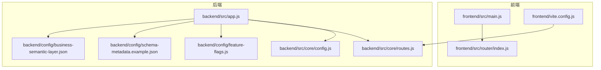
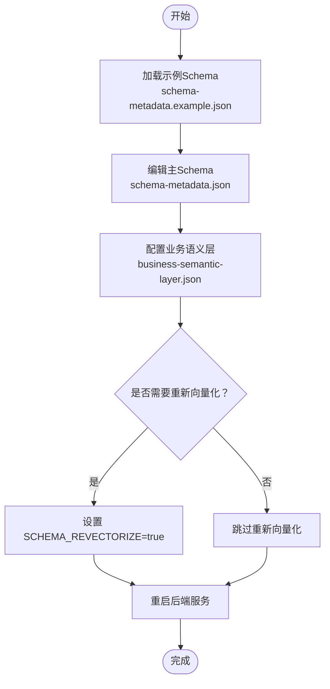
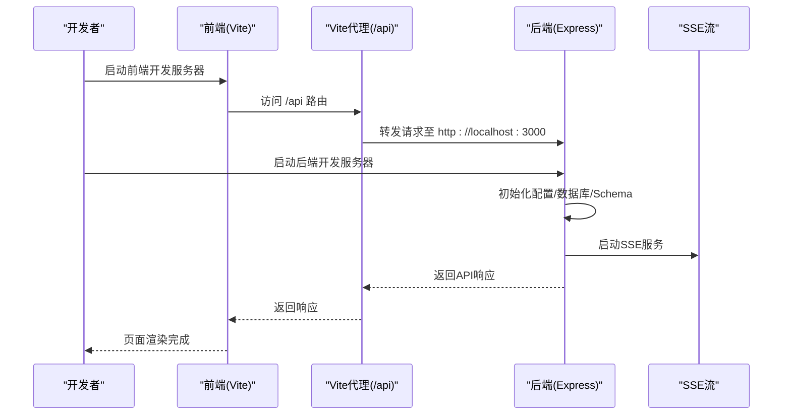
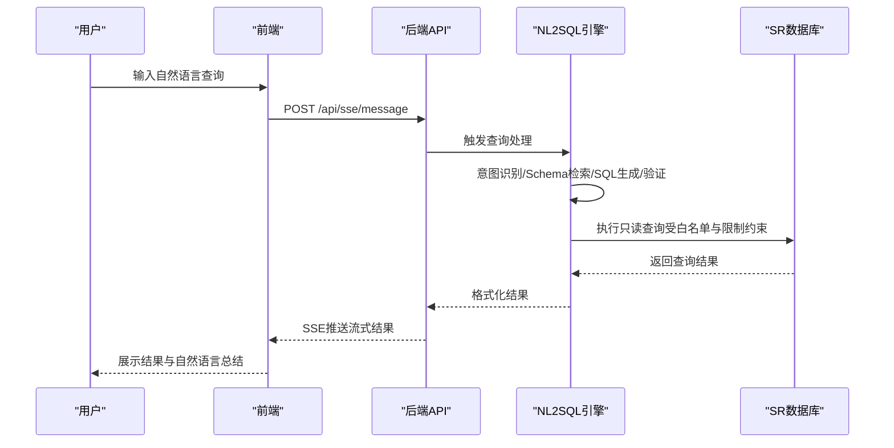
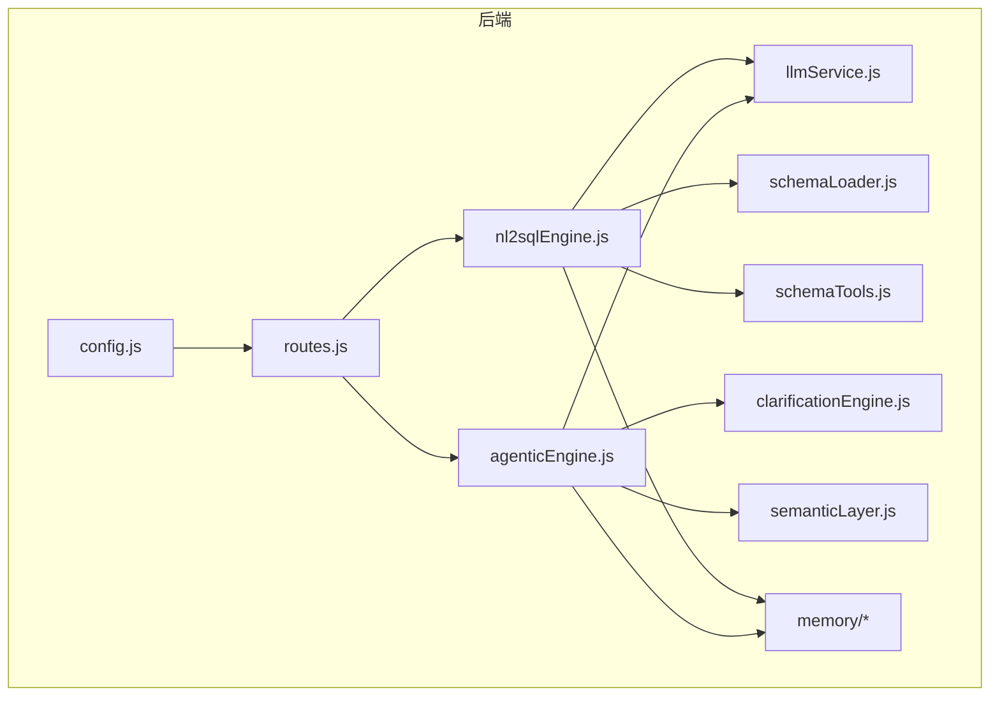

# 快速开始

<cite>
**本文引用的文件**
- [backend/package.json](file://backend/package.json)
- [frontend/package.json](file://frontend/package.json)
- [backend/src/app.js](file://backend/src/app.js)
- [backend/config/schema-metadata.example.json](file://backend/config/schema-metadata.example.json)
- [backend/config/business-semantic-layer.json](file://backend/config/business-semantic-layer.json)
- [backend/config/feature-flags.js](file://backend/config/feature-flags.js)
- [backend/src/core/config.js](file://backend/src/core/config.js)
- [backend/src/core/routes.js](file://backend/src/core/routes.js)
- [frontend/vite.config.js](file://frontend/vite.config.js)
- [frontend/src/router/index.js](file://frontend/src/router/index.js)
- [frontend/src/main.js](file://frontend/src/main.js)
- [CLAUDE.md](file://CLAUDE.md)
- [docs/NL2SQL-进度追踪.md](file://docs/NL2SQL-进度追踪.md)
</cite>

## 目录
1. [简介](#简介)
2. [项目结构](#项目结构)
3. [前置条件](#前置条件)
4. [安装与配置](#安装与配置)
5. [Schema 元数据配置](#schema-元数据配置)
6. [本地开发环境启动](#本地开发环境启动)
7. [基本使用示例](#基本使用示例)
8. [依赖关系分析](#依赖关系分析)
9. [性能注意事项](#性能注意事项)
10. [故障排除指南](#故障排除指南)
11. [结论](#结论)

## 简介
NL2SQL 是一个自然语言到 SQL 的查询服务，允许非技术人员通过自然语言与 SR 系统数据库交互。后端采用 Node.js + Express，前端采用 Vue3 + Element Plus，结合 LanceDB 向量数据库与 SQLite 存储，提供 Schema 管理、会话历史、长期记忆与实时流式响应能力。

## 项目结构
- 后端（Node.js + Express）
  - 配置与核心模块：config、routes、core（引擎、SSE、Schema、LLM、记忆等）
  - 数据与向量：SQLite 会话数据库、LanceDB 向量数据库
  - 日志与测试：logs、test
- 前端（Vue3 + Element Plus）
  - 视图与路由：Chat、Schema、History、Memory、Evaluation 等
  - 状态管理：Pinia Store
  - 工具与样式：API 封装、Markdown 渲染、全局样式
- 文档与配置
  - CLAUDE.md 提供开发命令、架构与 API 端点说明
  - docs/NL2SQL-进度追踪.md 记录功能实现状态与任务清单

**图表来源**
- [frontend/src/main.js:1-89](file://frontend/src/main.js#L1-L89)
- [frontend/src/router/index.js:1-157](file://frontend/src/router/index.js#L1-L157)
- [frontend/vite.config.js:1-93](file://frontend/vite.config.js#L1-L93)
- [backend/src/app.js:1-266](file://backend/src/app.js#L1-L266)
- [backend/src/core/config.js:1-398](file://backend/src/core/config.js#L1-L398)
- [backend/src/core/routes.js:1-800](file://backend/src/core/routes.js#L1-L800)
- [backend/config/feature-flags.js:1-249](file://backend/config/feature-flags.js#L1-L249)
- [backend/config/schema-metadata.example.json:1-328](file://backend/config/schema-metadata.example.json#L1-L328)
- [backend/config/business-semantic-layer.json:1-189](file://backend/config/business-semantic-layer.json#L1-L189)

**章节来源**
- [CLAUDE.md:1-153](file://CLAUDE.md#L1-L153)
- [docs/NL2SQL-进度追踪.md:1-265](file://docs/NL2SQL-进度追踪.md#L1-L265)

## 前置条件
- Node.js 版本要求
  - 后端：Node.js >= 18.0.0（由 backend/package.json 的 engines 字段定义）
  - 前端：Node.js >= 18.0.0（由 CLAUDE.md 的开发命令与现代前端工具链推断）
- Git：用于克隆仓库
- 文本编辑器或 IDE：用于编辑配置文件与代码

**章节来源**
- [backend/package.json:24-26](file://backend/package.json#L24-L26)
- [CLAUDE.md:11-23](file://CLAUDE.md#L11-L23)

## 安装与配置
- 克隆仓库
  - 使用 Git 克隆项目到本地目录
- 安装依赖
  - 后端：进入 backend 目录，执行依赖安装（如使用 npm install）
  - 前端：进入 frontend 目录，执行依赖安装（如使用 npm install）
- 环境变量配置
  - 复制后端示例环境文件为 .env，并填写以下必填项：
    - LLM_API_BASE：兼容 OpenAI 格式的 API 地址（如 DeepSeek）
    - LLM_API_KEY：API 密钥
    - LLM_MODEL：主模型（如 deepseek-chat）
    - EMBEDDING_MODEL：Embedding 模型
    - SR_DATABASE_URL：目标数据库连接串（只读）
  - 可选：SCHEMA_REVECTORIZE=true 可强制在启动时重新生成向量索引（Schema 变更后使用）
- 数据库初始化
  - 后端启动时会自动创建数据目录（data/）并初始化 SQLite 会话数据库与 LanceDB 向量数据库
- 功能开关（可选）
  - 通过环境变量启用/禁用各 Phase 的功能（详见“功能开关”部分）

**章节来源**
- [CLAUDE.md:27-40](file://CLAUDE.md#L27-L40)
- [backend/src/app.js:111-134](file://backend/src/app.js#L111-L134)
- [backend/src/core/config.js:366-388](file://backend/src/core/config.js#L366-L388)
- [backend/config/feature-flags.js:16-96](file://backend/config/feature-flags.js#L16-L96)

## Schema 元数据配置
- Schema 文件
  - 主配置：backend/config/schema-metadata.json（主 Schema 文件，定义表结构、字段、关系、业务关键词）
  - 示例说明：backend/config/schema-metadata.example.json（结构示例与说明文档）
  - 业务语义层：backend/config/business-semantic-layer.json（业务概念到物理表/字段的映射）
- 配置要点
  - 表与字段：name、name_cn、type、description、is_primary、foreign_key、aggregations、time_granularity 等
  - 关系：from、to、type（如 MANY_TO_ONE）、描述
  - 指标与维度：metrics、dimensions 的定义与单位
  - 业务语义：concepts、datasource_mappings、field_mappings、query_patterns
- 更新生效
  - 修改上述 JSON 文件后，设置 SCHEMA_REVECTORIZE=true 重启后端，使向量索引更新生效

**图表来源**
- [backend/config/schema-metadata.example.json:1-328](file://backend/config/schema-metadata.example.json#L1-L328)
- [backend/config/business-semantic-layer.json:1-189](file://backend/config/business-semantic-layer.json#L1-L189)
- [CLAUDE.md:116-122](file://CLAUDE.md#L116-L122)

**章节来源**
- [backend/config/schema-metadata.example.json:1-328](file://backend/config/schema-metadata.example.json#L1-L328)
- [backend/config/business-semantic-layer.json:1-189](file://backend/config/business-semantic-layer.json#L1-L189)
- [CLAUDE.md:116-122](file://CLAUDE.md#L116-L122)

## 本地开发环境启动
- 后端服务
  - 进入 backend 目录，执行开发命令（热重载，端口 3000）
  - 后端启动时会：
    - 加载 .env 环境变量
    - 初始化 SQLite 会话数据库与 LanceDB 向量数据库
    - 加载 Schema 元数据与业务语义层
    - 启动 HTTP 服务器与 SSE 服务
- 前端应用
  - 进入 frontend 目录，执行开发命令（Vite，端口 5173）
  - Vite 配置了代理，将 /api 请求转发到 http://localhost:3000，无需手动配置跨域
- 端口说明
  - 后端：默认 3000（可通过 PORT 环境变量覆盖）
  - 前端：默认 5173（可在 vite.config.js 中修改）

**图表来源**
- [CLAUDE.md:11-23](file://CLAUDE.md#L11-L23)
- [frontend/vite.config.js:18-35](file://frontend/vite.config.js#L18-L35)
- [backend/src/app.js:175-186](file://backend/src/app.js#L175-L186)

**章节来源**
- [CLAUDE.md:11-23](file://CLAUDE.md#L11-L23)
- [frontend/vite.config.js:18-35](file://frontend/vite.config.js#L18-L35)
- [backend/src/app.js:175-186](file://backend/src/app.js#L175-L186)

## 基本使用示例
- 健康检查
  - 后端启动后，访问健康检查端点确认服务状态
- Schema 浏览
  - 获取完整 Schema 或按类型筛选（tables/metrics/dimensions）
  - 搜索相关表，辅助理解数据结构
- 会话与查询
  - 创建会话，获取会话信息，查看消息历史
  - 通过 SSE 流式接收查询结果
- 评估与统计
  - 获取评估统计报告，重置统计数据

**图表来源**
- [backend/src/core/routes.js:72-137](file://backend/src/core/routes.js#L72-L137)
- [backend/src/core/routes.js:150-250](file://backend/src/core/routes.js#L150-L250)
- [backend/src/core/routes.js:266-398](file://backend/src/core/routes.js#L266-L398)
- [backend/src/core/config.js:140-170](file://backend/src/core/config.js#L140-L170)

**章节来源**
- [backend/src/core/routes.js:72-137](file://backend/src/core/routes.js#L72-L137)
- [backend/src/core/routes.js:150-250](file://backend/src/core/routes.js#L150-L250)
- [backend/src/core/routes.js:266-398](file://backend/src/core/routes.js#L266-L398)
- [backend/src/core/config.js:140-170](file://backend/src/core/config.js#L140-L170)

## 依赖关系分析
- 后端核心模块
  - 配置中心：集中读取环境变量与默认值
  - 路由与中间件：健康检查、Schema 查询、会话管理、评估接口
  - 引擎与工具：NL2SQL 引擎、Agentic 引擎、LLM 服务、Schema 工具、澄清引擎、语义层
  - 记忆系统：向量存储、长期记忆、摘要与维护
- 前端核心模块
  - 应用入口：创建 Vue 应用、安装插件、注册全局组件
  - 路由与视图：Home、Chat、Schema、History、Memory、Evaluation
  - 状态管理：Pinia Store 管理会话状态
  - 构建与代理：Vite 配置开发服务器与 /api 代理

**图表来源**
- [backend/src/core/config.js:16-398](file://backend/src/core/config.js#L16-L398)
- [backend/src/core/routes.js:1-800](file://backend/src/core/routes.js#L1-L800)
- [CLAUDE.md:60-96](file://CLAUDE.md#L60-L96)

**章节来源**
- [backend/src/core/config.js:16-398](file://backend/src/core/config.js#L16-L398)
- [backend/src/core/routes.js:1-800](file://backend/src/core/routes.js#L1-L800)
- [CLAUDE.md:60-96](file://CLAUDE.md#L60-L96)

## 性能注意事项
- 查询限制
  - 最大返回行数、查询超时、禁止的关键字列表等安全与性能控制
- Token 预算与摘要
  - 上下文管理模块支持 Token 预算检查与对话摘要，避免长对话导致性能下降
- 功能开关
  - 通过功能开关控制阶段性功能，逐步启用以降低一次性变更带来的性能风险

**章节来源**
- [backend/src/core/config.js:140-170](file://backend/src/core/config.js#L140-L170)
- [backend/src/core/config.js:299-333](file://backend/src/core/config.js#L299-L333)
- [backend/config/feature-flags.js:16-96](file://backend/config/feature-flags.js#L16-L96)

## 故障排除指南
- 环境变量缺失
  - 启动时报错提示缺少 LLM API 密钥或 SR 数据库连接 URL，检查 .env 文件并补齐
- 端口冲突
  - 后端默认 3000，前端默认 5173；如被占用，可在相应配置中修改端口
- 跨域问题
  - 前端通过 Vite 代理自动转发 /api 请求，无需手动配置跨域
- Schema 未更新
  - 修改 Schema 后设置 SCHEMA_REVECTORIZE=true 并重启后端
- 功能未生效
  - 检查功能开关环境变量，确认是否正确启用所需 Phase 的功能

**章节来源**
- [backend/src/core/config.js:366-388](file://backend/src/core/config.js#L366-L388)
- [frontend/vite.config.js:24-35](file://frontend/vite.config.js#L24-L35)
- [CLAUDE.md:39](file://CLAUDE.md#L39)
- [backend/config/feature-flags.js:16-96](file://backend/config/feature-flags.js#L16-L96)

## 结论
通过以上步骤，您可以在本地快速搭建并运行 NL2SQL 项目。建议先完成环境变量配置与 Schema 设置，再启动前后端服务进行功能验证。随着功能逐步启用与优化，系统将具备更强的自然语言查询能力与更好的用户体验。