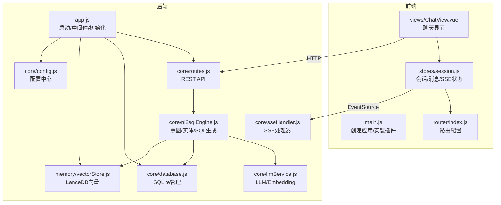
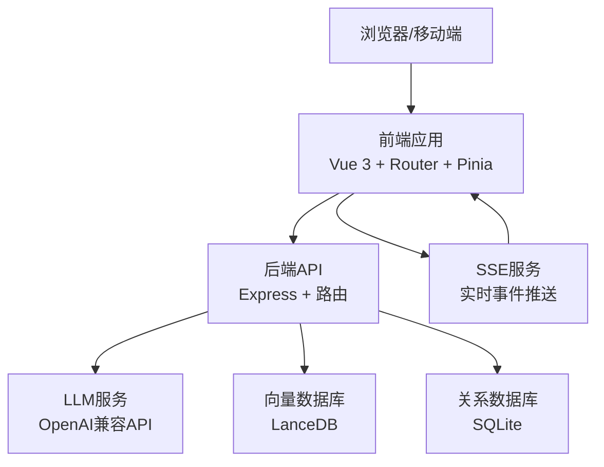
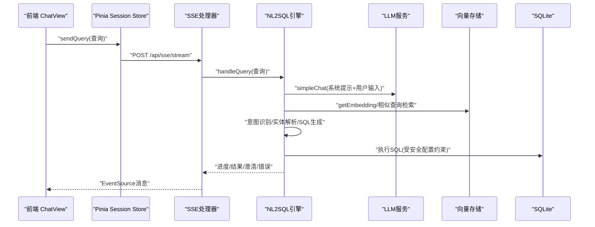
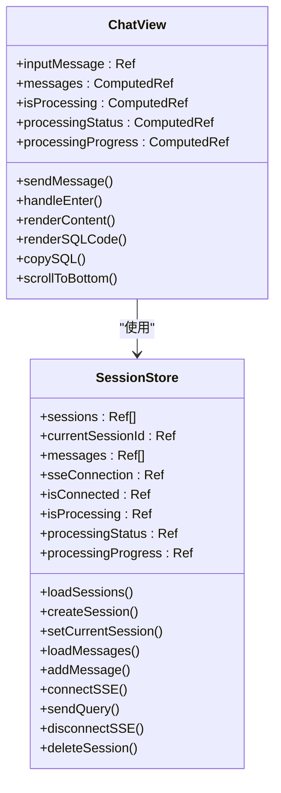
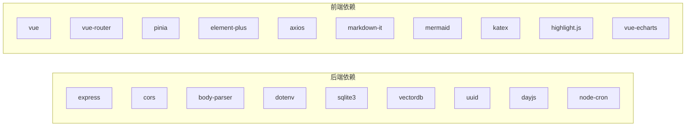

# 技术架构

<cite>
**本文引用的文件**
- [backend/src/app.js](file://backend/src/app.js)
- [backend/package.json](file://backend/package.json)
- [backend/src/core/config.js](file://backend/src/core/config.js)
- [backend/src/core/database.js](file://backend/src/core/database.js)
- [backend/src/core/routes.js](file://backend/src/core/routes.js)
- [backend/src/core/nl2sqlEngine.js](file://backend/src/core/nl2sqlEngine.js)
- [backend/src/core/llmService.js](file://backend/src/core/llmService.js)
- [backend/src/core/sseHandler.js](file://backend/src/core/sseHandler.js)
- [backend/src/memory/vectorStore.js](file://backend/src/memory/vectorStore.js)
- [backend/src/utils/logger.js](file://backend/src/utils/logger.js)
- [frontend/src/main.js](file://frontend/src/main.js)
- [frontend/package.json](file://frontend/package.json)
- [frontend/src/router/index.js](file://frontend/src/router/index.js)
- [frontend/src/stores/index.js](file://frontend/src/stores/index.js)
- [frontend/src/stores/session.js](file://frontend/src/stores/session.js)
- [frontend/src/views/ChatView.vue](file://frontend/src/views/ChatView.vue)
</cite>

## 目录
1. [简介](#简介)
2. [项目结构](#项目结构)
3. [核心组件](#核心组件)
4. [架构总览](#架构总览)
5. [详细组件分析](#详细组件分析)
6. [依赖关系分析](#依赖关系分析)
7. [性能考量](#性能考量)
8. [故障排查指南](#故障排查指南)
9. [结论](#结论)
10. [附录](#附录)

## 简介
本项目采用前后端分离架构，后端基于 Express.js 提供 REST API 与 Server-Sent Events 实时通信，前端基于 Vue 3 + Pinia + Vue Router 构建交互式聊天界面。核心能力围绕“自然语言到SQL”的转换，结合 SQLite 与 LanceDB 的组合存储方案、向量检索与长期记忆，实现从用户输入到 AI 处理再到数据库查询的完整链路。

## 项目结构
- 后端（Node.js + Express）
  - 核心模块：配置、数据库、路由、LLM 服务、NL2SQL 引擎、SSE 处理器、向量存储、自修复调度
  - 配置集中于 config 模块，统一从环境变量读取
  - 数据持久化：SQLite（会话、消息、查询历史、用户偏好）、LanceDB（Schema 与查询向量）
- 前端（Vue 3 + Vite）
  - 入口：main.js 创建应用并挂载插件
  - 路由：基于 vue-router 的 History 模式
  - 状态：Pinia Store 管理会话、消息、SSE 连接与处理状态
  - 视图：ChatView 负责对话与结果展示，配合工具渲染 Markdown/SQL

**图表来源**
- [backend/src/app.js:1-238](file://backend/src/app.js#L1-L238)
- [backend/src/core/config.js:1-332](file://backend/src/core/config.js#L1-L332)
- [backend/src/core/routes.js:1-800](file://backend/src/core/routes.js#L1-L800)
- [backend/src/core/sseHandler.js:1-349](file://backend/src/core/sseHandler.js#L1-L349)
- [backend/src/core/database.js:1-850](file://backend/src/core/database.js#L1-L850)
- [backend/src/memory/vectorStore.js:1-442](file://backend/src/memory/vectorStore.js#L1-L442)
- [backend/src/core/llmService.js:1-432](file://backend/src/core/llmService.js#L1-L432)
- [backend/src/core/nl2sqlEngine.js:1-800](file://backend/src/core/nl2sqlEngine.js#L1-L800)
- [frontend/src/main.js:1-89](file://frontend/src/main.js#L1-L89)
- [frontend/src/router/index.js:1-147](file://frontend/src/router/index.js#L1-L147)
- [frontend/src/stores/session.js:1-398](file://frontend/src/stores/session.js#L1-L398)
- [frontend/src/views/ChatView.vue:1-776](file://frontend/src/views/ChatView.vue#L1-L776)

**章节来源**
- [backend/src/app.js:1-238](file://backend/src/app.js#L1-L238)
- [frontend/src/main.js:1-89](file://frontend/src/main.js#L1-L89)

## 核心组件
- Express 启动与初始化
  - 加载 dotenv、配置 CORS/BodyParser、挂载路由、创建 HTTP 服务器、顺序初始化 SQLite/LanceDB/Schema/自修复、优雅关闭
- 配置中心
  - 统一读取 LLM/Embedding/数据库/安全/会话/日志/自修复/Schema/长期记忆等配置，提供校验
- 路由系统
  - 健康检查、Schema 查询/搜索、会话管理、查询历史、用户偏好、统计信息、公开配置
- SSE 处理器
  - 连接管理、进度/结果/澄清/错误广播、查询处理桥接
- NL2SQL 引擎
  - 意图识别（含上下文/长期记忆/相似查询）、实体解析（游戏/渠道/平台）、SQL 生成与验证、结果格式化
- LLM 服务
  - HTTP 请求封装、重试机制、Embedding 获取、工具定义辅助
- 向量存储
  - LanceDB 连接、Schema/查询向量表初始化、相似度搜索
- SQLite 管理
  - 会话/消息/查询历史/用户偏好/系统日志表结构、事务/迁移/查询/运行
- 前端应用
  - main.js 安装路由/Pinia/Element Plus；router 定义页面与守卫；Pinia store 管理会话与 SSE；ChatView 渲染消息/SQL/表格并处理输入

**章节来源**
- [backend/src/core/config.js:1-332](file://backend/src/core/config.js#L1-L332)
- [backend/src/core/routes.js:1-800](file://backend/src/core/routes.js#L1-L800)
- [backend/src/core/sseHandler.js:1-349](file://backend/src/core/sseHandler.js#L1-L349)
- [backend/src/core/nl2sqlEngine.js:1-800](file://backend/src/core/nl2sqlEngine.js#L1-L800)
- [backend/src/core/llmService.js:1-432](file://backend/src/core/llmService.js#L1-L432)
- [backend/src/memory/vectorStore.js:1-442](file://backend/src/memory/vectorStore.js#L1-L442)
- [backend/src/core/database.js:1-850](file://backend/src/core/database.js#L1-L850)
- [frontend/src/main.js:1-89](file://frontend/src/main.js#L1-L89)
- [frontend/src/router/index.js:1-147](file://frontend/src/router/index.js#L1-L147)
- [frontend/src/stores/session.js:1-398](file://frontend/src/stores/session.js#L1-L398)
- [frontend/src/views/ChatView.vue:1-776](file://frontend/src/views/ChatView.vue#L1-L776)

## 架构总览
系统采用“前端单页应用 + 后端无状态服务”的经典分离架构。前端通过 HTTP 与 SSE 与后端交互，后端通过模块化设计将配置、路由、数据库、向量存储、LLM 与 NL2SQL 引擎解耦，便于扩展与维护。

**图表来源**
- [backend/src/core/routes.js:1-800](file://backend/src/core/routes.js#L1-L800)
- [backend/src/core/sseHandler.js:1-349](file://backend/src/core/sseHandler.js#L1-L349)
- [backend/src/core/llmService.js:1-432](file://backend/src/core/llmService.js#L1-L432)
- [backend/src/memory/vectorStore.js:1-442](file://backend/src/memory/vectorStore.js#L1-L442)
- [backend/src/core/database.js:1-850](file://backend/src/core/database.js#L1-L850)
- [frontend/src/views/ChatView.vue:1-776](file://frontend/src/views/ChatView.vue#L1-L776)

## 详细组件分析

### 后端启动与初始化（app.js）
- 职责
  - 加载环境变量、引入核心模块、配置中间件、挂载路由、创建 HTTP 服务器
  - 顺序初始化：数据目录、SQLite、LanceDB、Schema、自修复调度器
  - 优雅关闭：关闭 HTTP、SSE、定时任务、数据库连接
- 关键点
  - 中间件：CORS 允许跨域；body-parser 解析 JSON/URL 编码
  - 初始化顺序保证依赖关系正确
  - 未处理异常与拒绝捕获，触发优雅关闭

**章节来源**
- [backend/src/app.js:1-238](file://backend/src/app.js#L1-L238)

### 配置中心（config.js）
- 职责
  - 统一管理 LLM/Embedding/数据库/安全/会话/日志/自修复/Schema/长期记忆等配置
  - 从环境变量读取，提供默认值与校验
- 关键点
  - 安全配置：白名单、只生成SQL模式、行数限制、超时、禁止关键字、敏感字段脱敏
  - Schema 配置：缓存开关、过期时间、强制重向量化
  - 长期记忆配置：启用开关、LLM 提炼开关、阈值与分级保留策略

**章节来源**
- [backend/src/core/config.js:1-332](file://backend/src/core/config.js#L1-L332)

### 路由系统（routes.js）
- 职责
  - 健康检查（基础/详细）、Schema 查询/搜索、会话 CRUD、消息历史、查询历史、用户偏好、统计信息、公开配置
- 关键点
  - 详细健康检查聚合数据库/LLM/Schema/SSE 状态
  - 查询历史支持多条件筛选与排序
  - 用户偏好支持模板/别名/指标/维度等类型

**章节来源**
- [backend/src/core/routes.js:1-800](file://backend/src/core/routes.js#L1-L800)

### SSE 处理器（sseHandler.js）
- 职责
  - 管理 SSE 连接、广播进度/结果/澄清/错误消息、处理查询请求
- 关键点
  - 支持多标签页连接同一会话
  - 进度回调通过广播传播，前端实时更新 UI
  - 查询处理失败/并发保护均有相应处理

**章节来源**
- [backend/src/core/sseHandler.js:1-349](file://backend/src/core/sseHandler.js#L1-L349)

### NL2SQL 引擎（nl2sqlEngine.js）
- 职责
  - 意图识别（上下文/长期记忆/相似查询）、实体解析（游戏/渠道/平台）、SQL 生成与验证、结果格式化
- 关键点
  - 长期记忆：用户偏好（模板/别名/指标/维度）与上下文融合
  - 向量检索：基于 Embedding 的相似查询参考
  - 实体解析：优先使用长期记忆映射，回退硬编码与数据库查询
  - 置信度与澄清：当信息不足时引导用户提供补充

**图表来源**
- [frontend/src/views/ChatView.vue:1-776](file://frontend/src/views/ChatView.vue#L1-L776)
- [frontend/src/stores/session.js:1-398](file://frontend/src/stores/session.js#L1-L398)
- [backend/src/core/sseHandler.js:1-349](file://backend/src/core/sseHandler.js#L1-L349)
- [backend/src/core/nl2sqlEngine.js:1-800](file://backend/src/core/nl2sqlEngine.js#L1-L800)
- [backend/src/core/llmService.js:1-432](file://backend/src/core/llmService.js#L1-L432)
- [backend/src/memory/vectorStore.js:1-442](file://backend/src/memory/vectorStore.js#L1-L442)
- [backend/src/core/database.js:1-850](file://backend/src/core/database.js#L1-L850)

**章节来源**
- [backend/src/core/nl2sqlEngine.js:1-800](file://backend/src/core/nl2sqlEngine.js#L1-L800)

### LLM 服务（llmService.js）
- 职责
  - HTTP 请求封装、重试机制、Embedding 获取、工具定义辅助
- 关键点
  - 支持流式与非流式响应
  - 超时与错误处理，JSON 解析失败的详细日志

**章节来源**
- [backend/src/core/llmService.js:1-432](file://backend/src/core/llmService.js#L1-L432)

### 向量存储（vectorStore.js）
- 职责
  - LanceDB 连接、Schema/查询向量表初始化、相似度搜索
- 关键点
  - 初始化失败不影响应用启动，仅记录告警
  - 支持统计信息与清空（通过重新创建表）

**章节来源**
- [backend/src/memory/vectorStore.js:1-442](file://backend/src/memory/vectorStore.js#L1-L442)

### SQLite 管理（database.js）
- 职责
  - 会话/消息/查询历史/用户偏好/系统日志表结构、事务/迁移/查询/运行
- 关键点
  - 外键约束启用、索引优化
  - 迁移修复旧表结构（如 UNIQUE 约束移除）
  - 事务封装保证一致性

**章节来源**
- [backend/src/core/database.js:1-850](file://backend/src/core/database.js#L1-L850)

### 前端应用（main.js + router + stores + views）
- 入口与插件
  - main.js 创建应用，安装路由、Pinia、Element Plus，注册全局图标，挂载 DOM
- 路由系统
  - History 模式，定义首页/聊天/历史/Schema/记忆/404 等页面，设置标题与守卫
- 状态管理
  - Pinia Store 管理会话列表、当前会话、消息、SSE 连接与处理状态
  - SSE 连接通过 EventSource 建立，按消息类型更新 UI
- 视图组件
  - ChatView 渲染消息、Markdown/SQL/表格，支持复制 SQL、折叠长内容、自动滚动

**图表来源**
- [frontend/src/stores/session.js:1-398](file://frontend/src/stores/session.js#L1-L398)
- [frontend/src/views/ChatView.vue:1-776](file://frontend/src/views/ChatView.vue#L1-L776)

**章节来源**
- [frontend/src/main.js:1-89](file://frontend/src/main.js#L1-L89)
- [frontend/src/router/index.js:1-147](file://frontend/src/router/index.js#L1-L147)
- [frontend/src/stores/index.js:1-30](file://frontend/src/stores/index.js#L1-L30)
- [frontend/src/stores/session.js:1-398](file://frontend/src/stores/session.js#L1-L398)
- [frontend/src/views/ChatView.vue:1-776](file://frontend/src/views/ChatView.vue#L1-L776)

## 依赖关系分析
- 后端依赖
  - Express、CORS、body-parser、dotenv、sqlite3、vectordb、uuid、dayjs、node-cron
- 前端依赖
  - Vue 3、vue-router、pinia、element-plus、axios、markdown-it、mermaid、katex、highlight.js、vue-echarts 等

**图表来源**
- [backend/package.json:1-28](file://backend/package.json#L1-L28)
- [frontend/package.json:1-36](file://frontend/package.json#L1-L36)

**章节来源**
- [backend/package.json:1-28](file://backend/package.json#L1-L28)
- [frontend/package.json:1-36](file://frontend/package.json#L1-L36)

## 性能考量
- 数据库与索引
  - SQLite 表均建立必要索引，加速查询与排序
  - 事务封装减少锁竞争，迁移采用原子性操作
- 向量检索
  - LanceDB 作为本地向量数据库，避免网络延迟；初始化失败不阻塞启动
- LLM 与 Embedding
  - 统一超时与重试策略，避免请求挂起；Embedding 维度与模型可配置
- SSE 实时性
  - 事件流禁用缓冲，多标签页连接同一会话，广播进度与结果
- 前端渲染
  - 长消息折叠、自动滚动、Markdown/SQL 高亮渲染，提升交互体验

[本节为通用指导，无需特定文件引用]

## 故障排查指南
- 启动失败
  - 检查必要配置（LLM API 密钥、SR 数据库 URL）是否设置
  - 查看日志文件与控制台输出，定位初始化错误
- SSE 无法连接
  - 确认会话存在且前端传入 session_id
  - 检查 Nginx/Apache 是否启用 X-Accel-Buffering 禁用
- 查询无响应
  - 检查 LLM/Embedding 超时与重试配置
  - 确认安全配置（白名单/行数限制/禁止关键字）未阻断
- 向量检索不可用
  - 确认 LanceDB 初始化成功；若失败，检查路径权限与磁盘空间

**章节来源**
- [backend/src/core/config.js:300-332](file://backend/src/core/config.js#L300-L332)
- [backend/src/utils/logger.js](file://backend/src/utils/logger.js)
- [backend/src/core/sseHandler.js:43-112](file://backend/src/core/sseHandler.js#L43-L112)
- [backend/src/memory/vectorStore.js:55-85](file://backend/src/memory/vectorStore.js#L55-L85)

## 结论
本项目通过模块化设计与前后端分离，构建了可扩展、可观测、可维护的 NL2SQL 系统。Express 后端以配置为中心、以路由为入口、以 SSE 为桥梁，结合 SQLite 与 LanceDB 的组合存储与向量检索，实现了从用户输入到 AI 处理再到数据库查询的高效闭环。前端以 Vue 3 为核心，借助 Pinia 与 Element Plus 提供流畅的交互体验。整体架构兼顾性能与可运维性，适合在中小规模场景快速落地与迭代。

## 附录
- 关键技术决策
  - SQLite + LanceDB：本地化存储，降低部署复杂度；向量检索提升语义查询质量
  - SSE：实时反馈，改善用户体验；多标签页支持同一会话
  - 长期记忆与向量检索：结合用户习惯与相似查询，提高意图识别准确度
  - 安全配置：白名单、行数限制、超时与禁止关键字，保障生产安全

[本节为总结性内容，无需特定文件引用]