# 技术栈

<cite>
**本文引用的文件**
- [backend/package.json](file://backend/package.json)
- [frontend/package.json](file://frontend/package.json)
- [backend/src/app.js](file://backend/src/app.js)
- [backend/src/core/config.js](file://backend/src/core/config.js)
- [backend/src/memory/vectorStore.js](file://backend/src/memory/vectorStore.js)
- [backend/src/core/database.js](file://backend/src/core/database.js)
- [frontend/src/main.js](file://frontend/src/main.js)
- [frontend/vite.config.js](file://frontend/vite.config.js)
- [frontend/src/router/index.js](file://frontend/src/router/index.js)
- [frontend/src/stores/session.js](file://frontend/src/stores/session.js)
- [frontend/src/utils/api.js](file://frontend/src/utils/api.js)
</cite>

## 目录
1. [简介](#简介)
2. [项目结构](#项目结构)
3. [核心组件](#核心组件)
4. [架构总览](#架构总览)
5. [详细组件分析](#详细组件分析)
6. [依赖分析](#依赖分析)
7. [性能考虑](#性能考虑)
8. [故障排查指南](#故障排查指南)
9. [结论](#结论)
10. [附录](#附录)

## 简介
本技术栈文档面向NL2SQL项目的后端与前端技术选型与实现细节，重点涵盖：
- 后端：Node.js运行时、Express.js Web框架、SQLite3关系型数据库、LanceDB向量数据库、dotenv环境配置管理等
- 前端：Vue.js 3框架、Element Plus UI组件库、Pinia状态管理、Axios HTTP客户端、Vite构建工具等
- 开发工具链：Nodemon热重载、ESLint代码规范、Git版本控制等
- 版本兼容性与升级建议
- 学习曲线与团队技能要求

## 项目结构
项目采用前后端分离架构，后端位于backend目录，前端位于frontend目录，分别独立管理依赖与构建流程。

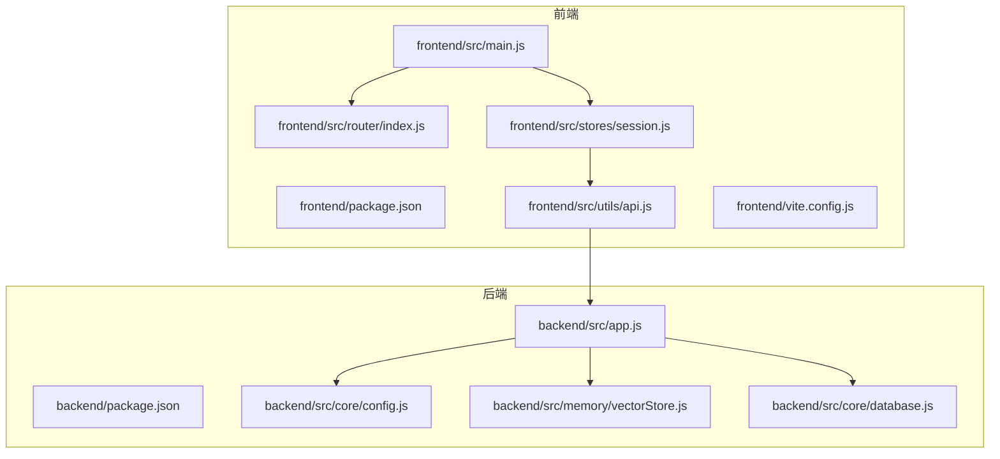

**图表来源**
- [backend/src/app.js:1-238](file://backend/src/app.js#L1-238)
- [frontend/src/main.js:1-89](file://frontend/src/main.js#L1-89)
- [frontend/src/router/index.js:1-147](file://frontend/src/router/index.js#L1-147)
- [frontend/src/stores/session.js:1-398](file://frontend/src/stores/session.js#L1-398)
- [frontend/src/utils/api.js:1-252](file://frontend/src/utils/api.js#L1-252)
- [frontend/vite.config.js:1-93](file://frontend/vite.config.js#L1-93)

**章节来源**
- [backend/package.json:1-28](file://backend/package.json#L1-L28)
- [frontend/package.json:1-36](file://frontend/package.json#L1-L36)
- [backend/src/app.js:1-238](file://backend/src/app.js#L1-L238)
- [frontend/src/main.js:1-89](file://frontend/src/main.js#L1-L89)

## 核心组件
- 后端运行时与框架
  - Node.js：引擎版本要求>=18.0.0，保证现代ES特性与性能
  - Express.js：提供HTTP服务与路由能力，配合CORS、body-parser中间件
  - dotenv：从.env文件加载环境变量，集中管理配置
- 数据层
  - SQLite3：轻量级关系型数据库，用于会话、消息、查询历史、用户偏好、系统日志等
  - LanceDB：嵌入式向量数据库，用于Schema与查询历史的向量化存储与相似度检索
- 前端框架与生态
  - Vue.js 3：组合式API、响应式系统、单文件组件
  - Element Plus：开箱即用的桌面端组件库
  - Pinia：轻量级状态管理
  - Axios：HTTP客户端封装与拦截器
  - Vite：快速开发与构建工具，支持热重载与路径别名

**章节来源**
- [backend/package.json:10-26](file://backend/package.json#L10-L26)
- [frontend/package.json:11-34](file://frontend/package.json#L11-L34)
- [backend/src/app.js:15-80](file://backend/src/app.js#L15-L80)
- [backend/src/core/config.js:16-332](file://backend/src/core/config.js#L16-L332)
- [backend/src/core/database.js:1-850](file://backend/src/core/database.js#L1-L850)
- [backend/src/memory/vectorStore.js:1-442](file://backend/src/memory/vectorStore.js#L1-L442)
- [frontend/src/main.js:14-89](file://frontend/src/main.js#L14-L89)
- [frontend/src/router/index.js:108-147](file://frontend/src/router/index.js#L108-L147)
- [frontend/src/stores/session.js:33-398](file://frontend/src/stores/session.js#L33-L398)
- [frontend/src/utils/api.js:25-88](file://frontend/src/utils/api.js#L25-L88)
- [frontend/vite.config.js:17-93](file://frontend/vite.config.js#L17-L93)

## 架构总览
后端通过Express提供REST API与SSE流式输出，前端通过Axios与SSE与后端交互，数据层由SQLite与LanceDB协同支撑。

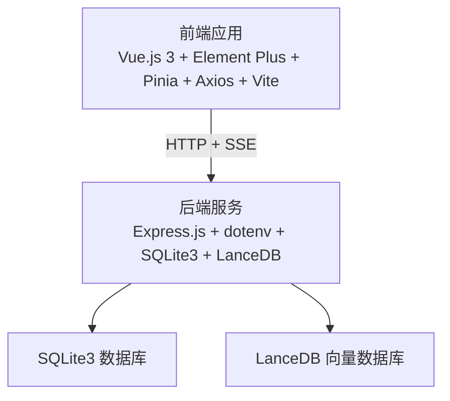

**图表来源**
- [backend/src/app.js:22-87](file://backend/src/app.js#L22-L87)
- [backend/src/core/database.js:1-850](file://backend/src/core/database.js#L1-L850)
- [backend/src/memory/vectorStore.js:1-442](file://backend/src/memory/vectorStore.js#L1-L442)
- [frontend/src/utils/api.js:25-88](file://frontend/src/utils/api.js#L25-L88)
- [frontend/src/stores/session.js:185-221](file://frontend/src/stores/session.js#L185-L221)

## 详细组件分析

### 后端：Express应用与中间件
- 功能职责
  - 加载dotenv环境变量
  - 初始化数据库与向量数据库
  - 挂载路由并启动HTTP服务器
  - 处理优雅关闭与未捕获异常
- 关键实现要点
  - CORS与body-parser中间件启用
  - /api前缀路由挂载
  - 端口与SSE端点日志输出
  - 信号处理与资源清理

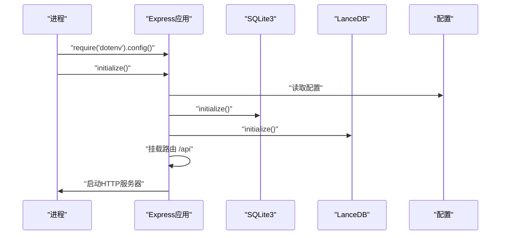

**图表来源**
- [backend/src/app.js:15-166](file://backend/src/app.js#L15-L166)
- [backend/src/core/config.js:16-332](file://backend/src/core/config.js#L16-L332)
- [backend/src/core/database.js:200-261](file://backend/src/core/database.js#L200-L261)
- [backend/src/memory/vectorStore.js:55-85](file://backend/src/memory/vectorStore.js#L55-L85)

**章节来源**
- [backend/src/app.js:15-166](file://backend/src/app.js#L15-L166)

### 配置管理模块
- 职责：集中管理LLM、Embedding、数据库、安全、会话、日志、自修复、Schema、长期记忆等配置
- 特性：从环境变量读取，提供默认值，启动时校验必要配置
- 安全与限制：白名单表、禁止关键字、最大行数、查询超时、脱敏字段

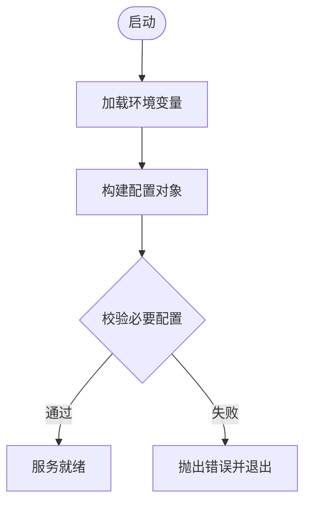

**图表来源**
- [backend/src/core/config.js:300-332](file://backend/src/core/config.js#L300-L332)

**章节来源**
- [backend/src/core/config.js:16-332](file://backend/src/core/config.js#L16-L332)

### SQLite3数据库模块
- 职责：会话、消息、查询历史、用户偏好、系统日志等表的创建与维护
- 设计要点：外键约束、索引优化、事务封装、迁移修复旧表结构
- 安全要点：参数化查询、错误日志记录

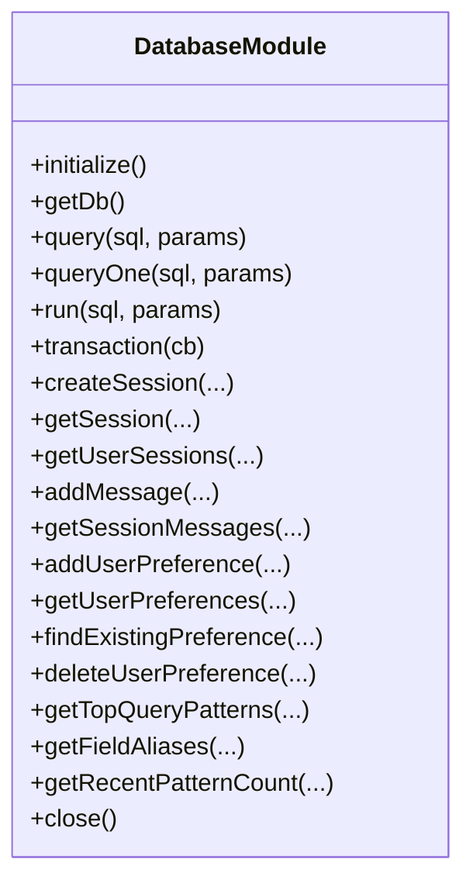

**图表来源**
- [backend/src/core/database.js:200-850](file://backend/src/core/database.js#L200-L850)

**章节来源**
- [backend/src/core/database.js:1-850](file://backend/src/core/database.js#L1-L850)

### LanceDB向量存储模块
- 职责：Schema向量表与查询历史向量表的初始化、添加、搜索、统计
- 特性：基于向量相似度的语义检索，支持Schema与查询历史的语义复用
- 限制：当前实现对删除与清空的处理策略

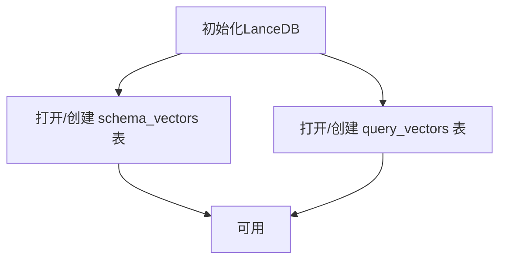

**图表来源**
- [backend/src/memory/vectorStore.js:55-146](file://backend/src/memory/vectorStore.js#L55-L146)

**章节来源**
- [backend/src/memory/vectorStore.js:1-442](file://backend/src/memory/vectorStore.js#L1-L442)

### 前端：应用入口与插件安装
- 职责：创建Vue应用实例，安装路由、状态管理、UI组件库，注册全局图标，挂载到DOM
- 特性：Element Plus按需引入、全局样式导入

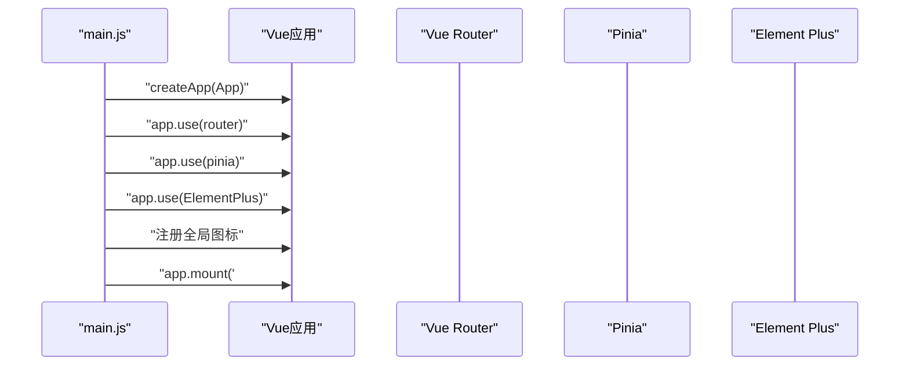

**图表来源**
- [frontend/src/main.js:55-89](file://frontend/src/main.js#L55-L89)

**章节来源**
- [frontend/src/main.js:1-89](file://frontend/src/main.js#L1-L89)

### 前端：路由与导航守卫
- 职责：定义路由表、历史模式、滚动行为、全局前置守卫设置页面标题
- 特性：懒加载组件、meta元信息驱动标题与权限

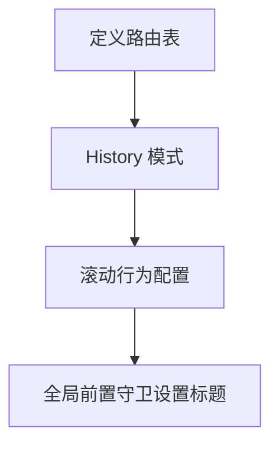

**图表来源**
- [frontend/src/router/index.js:34-147](file://frontend/src/router/index.js#L34-L147)

**章节来源**
- [frontend/src/router/index.js:1-147](file://frontend/src/router/index.js#L1-L147)

### 前端：状态管理（Pinia）
- 职责：会话列表、当前会话、消息历史、SSE连接、处理状态与进度
- 特性：响应式状态、计算属性、动作封装、与API模块解耦

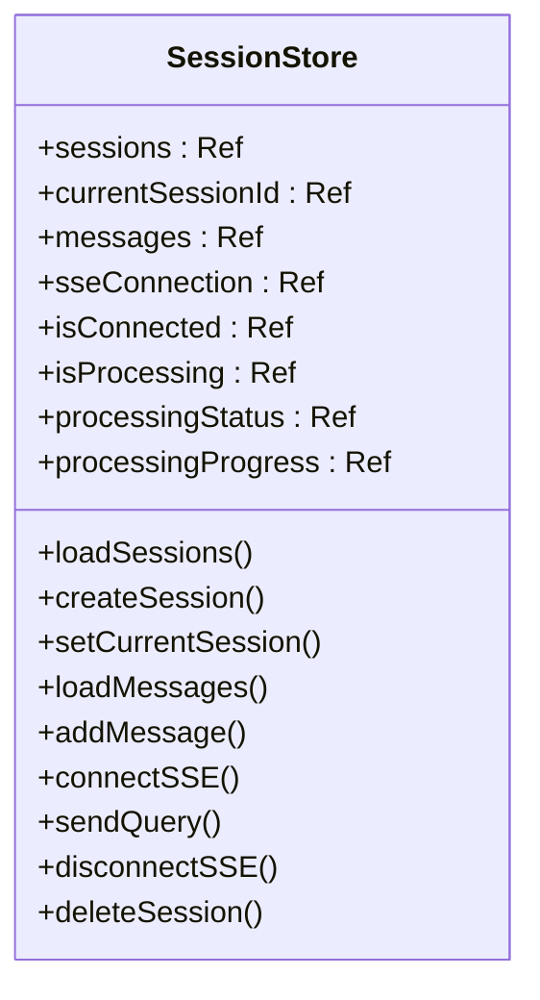

**图表来源**
- [frontend/src/stores/session.js:33-398](file://frontend/src/stores/session.js#L33-L398)

**章节来源**
- [frontend/src/stores/session.js:1-398](file://frontend/src/stores/session.js#L1-L398)

### 前端：HTTP客户端与SSE
- 职责：Axios实例封装、请求/响应拦截、统一错误处理、SSE连接与消息处理
- 特性：baseURL=/api、超时控制、SSE事件类型分发

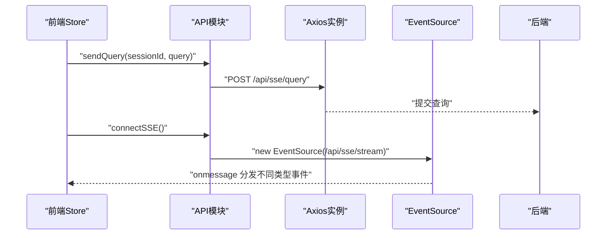

**图表来源**
- [frontend/src/utils/api.js:25-88](file://frontend/src/utils/api.js#L25-L88)
- [frontend/src/stores/session.js:185-293](file://frontend/src/stores/session.js#L185-L293)
- [backend/src/app.js:151-158](file://backend/src/app.js#L151-L158)

**章节来源**
- [frontend/src/utils/api.js:1-252](file://frontend/src/utils/api.js#L1-L252)
- [frontend/src/stores/session.js:185-328](file://frontend/src/stores/session.js#L185-L328)

### 前端：Vite配置与开发体验
- 职责：开发服务器、路径别名、插件、CSS预处理、代码分割
- 特性：/api代理到后端、自动打开浏览器、Element Plus变量导入、第三方库手动分包

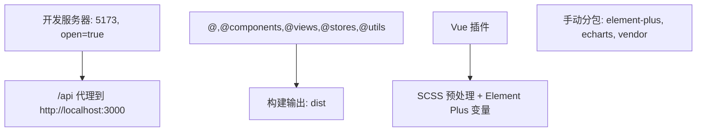

**图表来源**
- [frontend/vite.config.js:18-93](file://frontend/vite.config.js#L18-L93)

**章节来源**
- [frontend/vite.config.js:1-93](file://frontend/vite.config.js#L1-L93)

## 依赖分析
- 后端依赖
  - express、cors、body-parser：Web服务与请求处理
  - sqlite3：本地数据库
  - vectordb（LanceDB）：向量数据库
  - dotenv：环境变量
  - uuid、dayjs、node-cron：辅助工具
  - nodemon：开发热重载
- 前端依赖
  - vue、vue-router、pinia：框架与生态
  - element-plus、@element-plus/icons-vue：UI组件库
  - axios：HTTP客户端
  - vite、@vitejs/plugin-vue：构建工具
  - dayjs、echarts、markdown-it等：工具与渲染

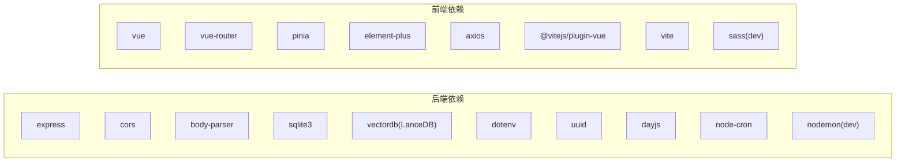

**图表来源**
- [backend/package.json:10-26](file://backend/package.json#L10-L26)
- [frontend/package.json:11-34](file://frontend/package.json#L11-L34)

**章节来源**
- [backend/package.json:1-28](file://backend/package.json#L1-L28)
- [frontend/package.json:1-36](file://frontend/package.json#L1-L36)

## 性能考虑
- 后端
  - SQLite：适合中小规模数据与单机部署，注意I/O瓶颈；可通过索引与事务优化
  - LanceDB：向量检索在高维空间与大规模数据时需关注查询延迟，建议合理topK与缓存策略
  - CORS与body-parser：限制请求体大小，避免过大负载
- 前端
  - Vite：开发阶段热重载与快速构建；生产构建启用代码分割与压缩
  - Axios：合理设置超时与重试策略，避免阻塞UI线程
  - Element Plus：按需引入与手动分包减少首屏体积

[本节为通用指导，无需特定文件引用]

## 故障排查指南
- 后端
  - 环境变量缺失：配置校验会抛出错误，检查必要项（LLM API密钥、SR数据库URL）
  - 数据库初始化失败：检查DB_PATH与权限，确认SQLite文件可写
  - 向量数据库未初始化：LanceDB目录权限与磁盘空间，日志中会提示功能不可用
  - 优雅关闭：SIGTERM/SIGINT触发资源释放，确保SSE、定时任务、数据库连接正确关闭
- 前端
  - /api跨域：确认Vite代理配置与后端CORS
  - SSE连接：检查后端SSE端点与前端EventSource连接状态
  - Axios错误：统一拦截器会输出错误信息，定位服务端状态码或网络错误

**章节来源**
- [backend/src/core/config.js:300-332](file://backend/src/core/config.js#L300-L332)
- [backend/src/app.js:176-230](file://backend/src/app.js#L176-L230)
- [frontend/vite.config.js:24-35](file://frontend/vite.config.js#L24-L35)
- [frontend/src/utils/api.js:72-88](file://frontend/src/utils/api.js#L72-L88)

## 结论
NL2SQL项目采用“Node.js + Express + SQLite + LanceDB”后端与“Vue 3 + Element Plus + Pinia + Axios + Vite”的前端技术栈，满足中小型团队快速迭代与本地部署的需求。后端通过集中配置与模块化设计提升可维护性，前端通过状态管理与SSE实现流畅的交互体验。建议在生产环境中完善ESLint与Git工作流，并根据数据规模评估向量检索与数据库性能。

[本节为总结，无需特定文件引用]

## 附录

### 版本兼容性与升级建议
- Node.js：>=18.0.0（引擎要求）
- Vue.js：^3.3.8，保持与Composition API、单文件组件兼容
- Element Plus：^2.4.4，注意与Vue 3版本的适配
- Pinia：^2.1.7，保持最新以获得更好的TypeScript支持
- Axios：^1.6.2，注意拦截器与错误处理策略
- Vite：^5.0.8，关注插件生态与构建优化
- Express：^4.18.2，注意中间件与路由升级
- SQLite3：^5.1.6，注意平台差异与性能
- LanceDB(vectordb)：^0.4.0，关注向量维度与查询性能

**章节来源**
- [backend/package.json:24-26](file://backend/package.json#L24-L26)
- [frontend/package.json:26-34](file://frontend/package.json#L26-L34)

### 开发工具链
- Nodemon：开发阶段自动重启，提升迭代效率
- ESLint：统一代码风格与静态检查（建议在项目中集成）
- Git：版本控制与协作流程（建议配合分支策略与PR）

**章节来源**
- [backend/package.json:21-23](file://backend/package.json#L21-L23)

### 技术选型原因与优势
- Vue.js vs React
  - Vue 3组合式API与模板语法更适合快速原型与中小型团队
  - Element Plus组件丰富且易于上手，降低UI开发成本
- LanceDB vs 传统搜索引擎
  - LanceDB嵌入式、易部署、与Arrow生态结合，适合Schema与查询历史的向量化检索
  - 传统搜索引擎（如Elasticsearch）复杂度更高，适合大规模全文检索场景
- Express vs Koa/Nest
  - Express生态成熟、学习成本低，适合快速搭建NL2SQL后端
  - 若未来需要强类型与模块化，可考虑NestJS

[本节为概念性说明，无需特定文件引用]