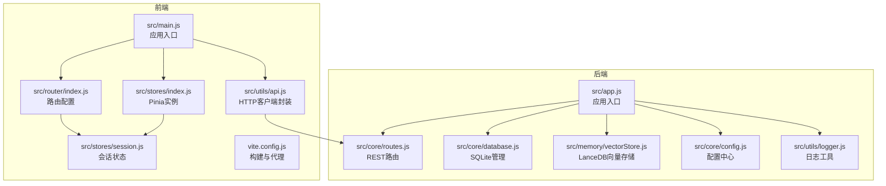
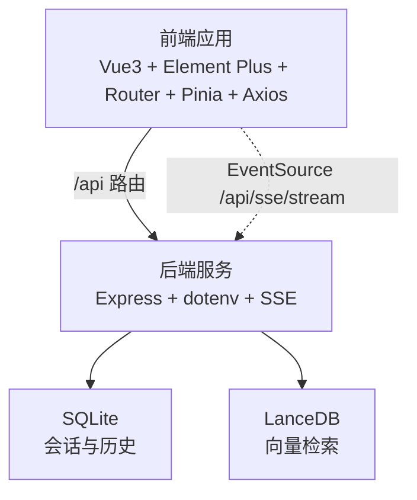
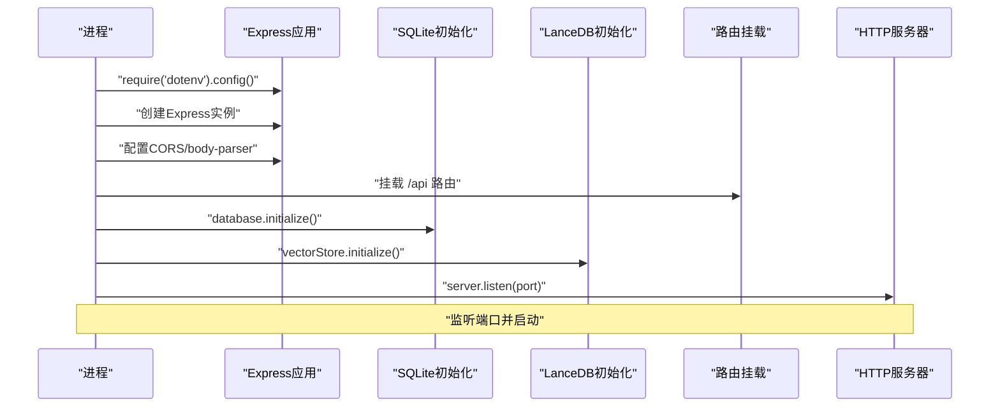
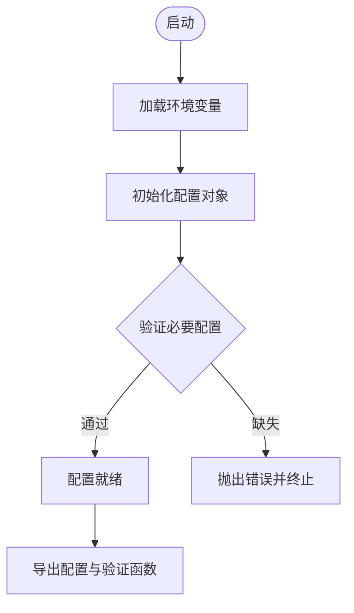
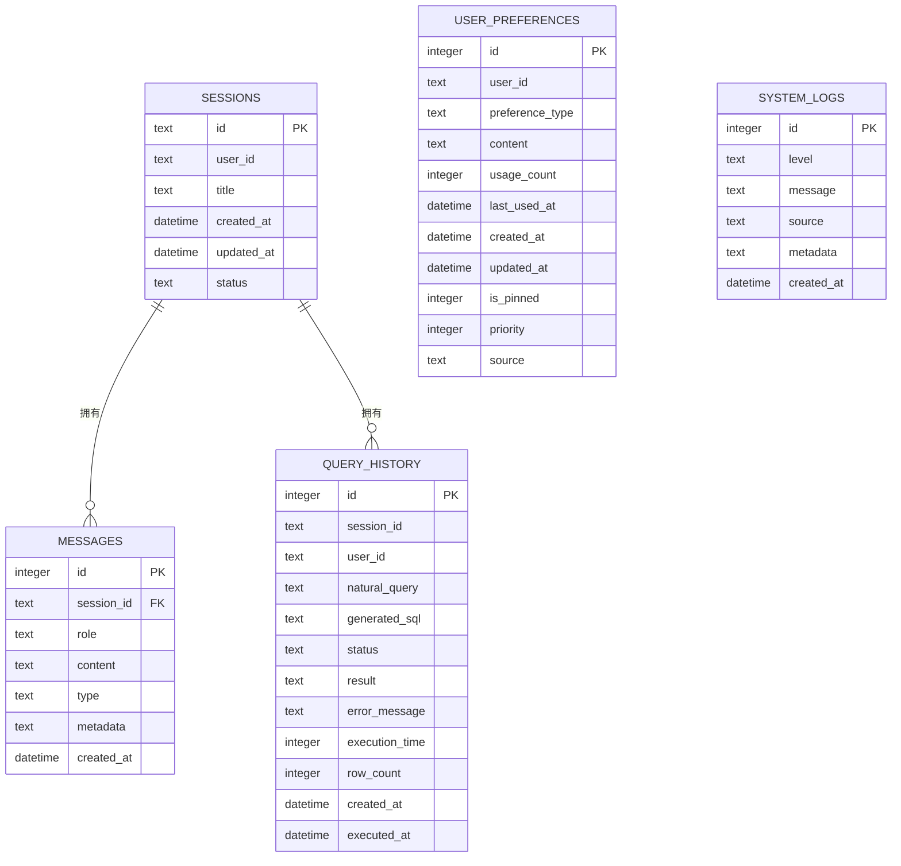
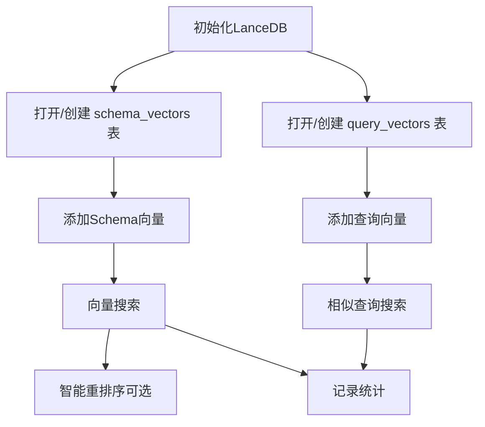
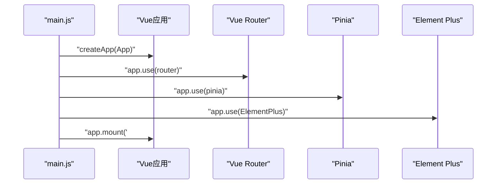
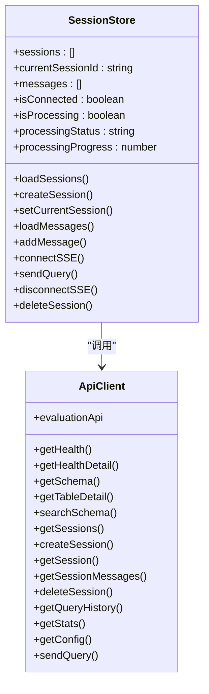
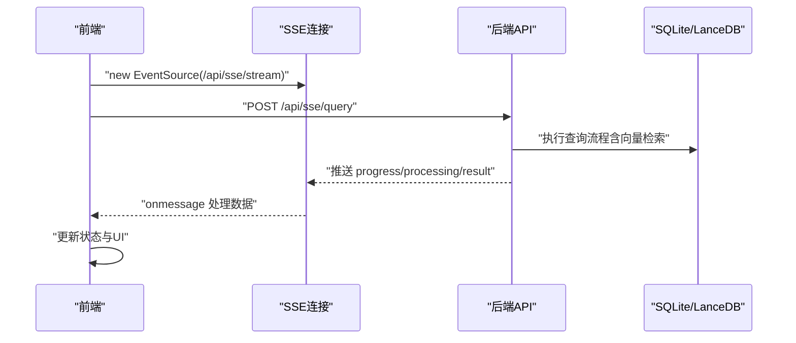
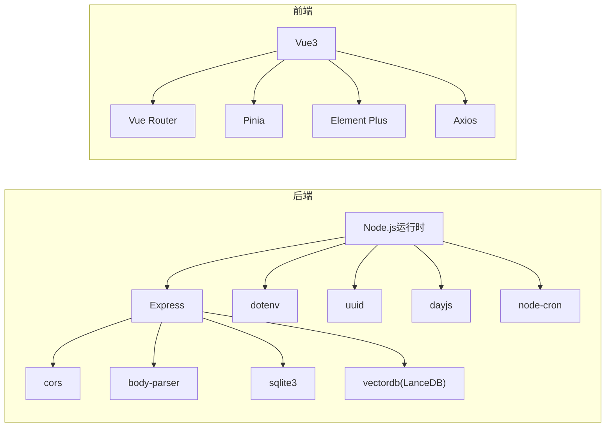

# 技术栈

<cite>
**本文档引用的文件**
- [backend/package.json](file://backend/package.json)
- [frontend/package.json](file://frontend/package.json)
- [backend/src/app.js](file://backend/src/app.js)
- [backend/src/core/config.js](file://backend/src/core/config.js)
- [backend/src/core/database.js](file://backend/src/core/database.js)
- [backend/src/core/routes.js](file://backend/src/core/routes.js)
- [backend/src/memory/vectorStore.js](file://backend/src/memory/vectorStore.js)
- [backend/src/utils/logger.js](file://backend/src/utils/logger.js)
- [frontend/src/main.js](file://frontend/src/main.js)
- [frontend/src/router/index.js](file://frontend/src/router/index.js)
- [frontend/src/stores/index.js](file://frontend/src/stores/index.js)
- [frontend/src/stores/session.js](file://frontend/src/stores/session.js)
- [frontend/src/utils/api.js](file://frontend/src/utils/api.js)
- [frontend/vite.config.js](file://frontend/vite.config.js)
</cite>

## 目录
1. [简介](#简介)
2. [项目结构](#项目结构)
3. [核心组件](#核心组件)
4. [架构总览](#架构总览)
5. [详细组件分析](#详细组件分析)
6. [依赖关系分析](#依赖关系分析)
7. [性能考量](#性能考量)
8. [故障排查指南](#故障排查指南)
9. [结论](#结论)
10. [附录](#附录)

## 简介
本项目采用前后端分离架构，后端基于 Node.js + Express 提供 REST API 与 Server-Sent Events 实时流，结合 SQLite 与 LanceDB 实现会话持久化与向量检索；前端基于 Vue3 + Element Plus + Vue Router + Pinia + Axios 构建交互式聊天界面，支持实时查询与可视化展示。技术栈选择兼顾易部署、可扩展与开发效率，适合中小规模的自然语言到 SQL 的数据查询场景。

## 项目结构
项目采用典型的前后端分离布局，后端位于 backend 目录，前端位于 frontend 目录，各自独立管理依赖与构建配置。

图表来源
- [backend/src/app.js:1-266](file://backend/src/app.js#L1-L266)
- [backend/src/core/config.js:1-398](file://backend/src/core/config.js#L1-L398)
- [backend/src/core/database.js:1-1016](file://backend/src/core/database.js#L1-L1016)
- [backend/src/memory/vectorStore.js:1-948](file://backend/src/memory/vectorStore.js#L1-L948)
- [backend/src/core/routes.js:1-1037](file://backend/src/core/routes.js#L1-L1037)
- [backend/src/utils/logger.js:1-482](file://backend/src/utils/logger.js#L1-L482)
- [frontend/src/main.js:1-89](file://frontend/src/main.js#L1-L89)
- [frontend/src/router/index.js:1-157](file://frontend/src/router/index.js#L1-L157)
- [frontend/src/stores/index.js:1-30](file://frontend/src/stores/index.js#L1-L30)
- [frontend/src/stores/session.js:1-400](file://frontend/src/stores/session.js#L1-L400)
- [frontend/src/utils/api.js:1-303](file://frontend/src/utils/api.js#L1-L303)
- [frontend/vite.config.js:1-93](file://frontend/vite.config.js#L1-L93)

章节来源
- [backend/src/app.js:1-266](file://backend/src/app.js#L1-L266)
- [frontend/src/main.js:1-89](file://frontend/src/main.js#L1-L89)

## 核心组件
- 后端运行时与框架
  - Node.js：项目要求 Node.js 版本 ≥ 18，保证现代 ES 特性与性能。
  - Express：提供 REST API 与中间件生态，配合 body-parser、cors 处理请求。
  - dotenv：从 .env 文件加载环境变量，集中管理配置。
- 数据存储
  - SQLite：轻量嵌入式数据库，用于会话、消息、查询历史与用户偏好等结构化数据持久化。
  - LanceDB：列式向量数据库，用于 Schema 与查询历史的向量化存储与语义检索。
- 前端框架与生态
  - Vue3：组合式 API 与响应式系统，提供高效组件化开发体验。
  - Element Plus：完善的 UI 组件库，提升界面一致性与开发效率。
  - Vue Router：SPA 路由管理，支持懒加载与导航守卫。
  - Pinia：官方推荐的状态管理库，替代 Vuex，提供简洁 API。
  - Axios：HTTP 客户端封装，统一拦截器与错误处理。
- 实时通信
  - Server-Sent Events：后端通过 SSE 推送查询处理进度与结果，前端通过 EventSource 接收。

章节来源
- [backend/package.json:1-28](file://backend/package.json#L1-L28)
- [frontend/package.json:1-36](file://frontend/package.json#L1-L36)
- [backend/src/app.js:1-266](file://backend/src/app.js#L1-L266)
- [backend/src/core/config.js:1-398](file://backend/src/core/config.js#L1-L398)
- [backend/src/core/database.js:1-1016](file://backend/src/core/database.js#L1-L1016)
- [backend/src/memory/vectorStore.js:1-948](file://backend/src/memory/vectorStore.js#L1-L948)
- [frontend/src/main.js:1-89](file://frontend/src/main.js#L1-L89)
- [frontend/src/router/index.js:1-157](file://frontend/src/router/index.js#L1-L157)
- [frontend/src/stores/index.js:1-30](file://frontend/src/stores/index.js#L1-L30)
- [frontend/src/stores/session.js:1-400](file://frontend/src/stores/session.js#L1-L400)
- [frontend/src/utils/api.js:1-303](file://frontend/src/utils/api.js#L1-L303)

## 架构总览
后端负责统一配置、数据库与向量存储初始化、REST API 与 SSE 流；前端负责路由、状态管理与实时交互。两者通过 /api 前缀通信，开发时通过 Vite 代理转发请求至后端。

图表来源
- [backend/src/core/routes.js:1-1037](file://backend/src/core/routes.js#L1-L1037)
- [backend/src/core/database.js:1-1016](file://backend/src/core/database.js#L1-L1016)
- [backend/src/memory/vectorStore.js:1-948](file://backend/src/memory/vectorStore.js#L1-L948)
- [frontend/src/utils/api.js:1-303](file://frontend/src/utils/api.js#L1-L303)
- [frontend/src/stores/session.js:1-400](file://frontend/src/stores/session.js#L1-L400)
- [frontend/vite.config.js:1-93](file://frontend/vite.config.js#L1-L93)

## 详细组件分析

### 后端应用入口与初始化流程
后端入口负责加载环境变量、初始化数据库与向量库、挂载路由、启动 HTTP 服务器与 SSE，并处理优雅关闭。

图表来源
- [backend/src/app.js:1-266](file://backend/src/app.js#L1-L266)
- [backend/src/core/database.js:206-267](file://backend/src/core/database.js#L206-L267)
- [backend/src/memory/vectorStore.js:233-263](file://backend/src/memory/vectorStore.js#L233-L263)
- [backend/src/core/routes.js:78-80](file://backend/src/core/routes.js#L78-L80)

章节来源
- [backend/src/app.js:97-194](file://backend/src/app.js#L97-L194)

### 配置管理与环境变量
配置模块集中管理端口、LLM API、Embedding、数据库、安全策略、日志、自修复、Schema、长期记忆、上下文管理与评估等配置项，并提供验证函数确保关键配置存在。

图表来源
- [backend/src/core/config.js:1-398](file://backend/src/core/config.js#L1-L398)

章节来源
- [backend/src/core/config.js:366-397](file://backend/src/core/config.js#L366-L397)

### SQLite 数据库设计与迁移
数据库模块负责创建表结构（会话、消息、查询历史、用户偏好、系统日志）、索引与外键约束，并在启动时执行迁移修复旧表结构问题。

图表来源
- [backend/src/core/database.js:39-195](file://backend/src/core/database.js#L39-L195)

章节来源
- [backend/src/core/database.js:206-404](file://backend/src/core/database.js#L206-L404)

### LanceDB 向量存储与语义检索
向量存储模块基于 LanceDB 实现 Schema 与查询历史的向量化存储，支持向量搜索、智能重排序与统计记录。

图表来源
- [backend/src/memory/vectorStore.js:233-324](file://backend/src/memory/vectorStore.js#L233-L324)
- [backend/src/memory/vectorStore.js:379-437](file://backend/src/memory/vectorStore.js#L379-L437)
- [backend/src/memory/vectorStore.js:452-576](file://backend/src/memory/vectorStore.js#L452-L576)

章节来源
- [backend/src/memory/vectorStore.js:233-576](file://backend/src/memory/vectorStore.js#L233-L576)

### 前端应用入口与插件安装
前端入口负责创建 Vue 应用实例、安装路由、状态管理与 Element Plus 插件，并注册全局图标组件。

图表来源
- [frontend/src/main.js:55-89](file://frontend/src/main.js#L55-L89)

章节来源
- [frontend/src/main.js:14-89](file://frontend/src/main.js#L14-L89)

### 路由与状态管理
- 路由：定义首页、聊天、历史、Schema、记忆、评估等页面，支持懒加载与滚动行为。
- 状态：Pinia 提供会话状态管理，包含会话列表、消息、SSE 连接与处理状态；API 封装统一拦截器与错误处理。

图表来源
- [frontend/src/stores/session.js:33-399](file://frontend/src/stores/session.js#L33-L399)
- [frontend/src/utils/api.js:1-303](file://frontend/src/utils/api.js#L1-L303)

章节来源
- [frontend/src/router/index.js:34-132](file://frontend/src/router/index.js#L34-L132)
- [frontend/src/stores/session.js:33-399](file://frontend/src/stores/session.js#L33-L399)
- [frontend/src/utils/api.js:25-88](file://frontend/src/utils/api.js#L25-L88)

### 实时通信（SSE）
前端通过 EventSource 连接后端 SSE 流，接收处理阶段、进度与最终结果，实现流畅的交互体验。

图表来源
- [frontend/src/stores/session.js:184-221](file://frontend/src/stores/session.js#L184-L221)
- [frontend/src/utils/api.js:246-251](file://frontend/src/utils/api.js#L246-L251)
- [backend/src/core/routes.js:1-1037](file://backend/src/core/routes.js#L1-L1037)

章节来源
- [frontend/src/stores/session.js:184-330](file://frontend/src/stores/session.js#L184-L330)
- [frontend/src/utils/api.js:246-251](file://frontend/src/utils/api.js#L246-L251)
- [backend/src/core/routes.js:1-1037](file://backend/src/core/routes.js#L1-L1037)

## 依赖关系分析
- 后端依赖
  - Express：Web 框架与路由
  - dotenv：环境变量管理
  - sqlite3：SQLite 驱动
  - vectordb：LanceDB 客户端
  - cors/body-parser：请求处理
  - uuid/dayjs/node-cron：工具库与定时任务
- 前端依赖
  - vue/vue-router/pinia/axios：核心框架与生态
  - element-plus：UI 组件库
  - dayjs/echarts/markdown-it 等：工具与可视化

图表来源
- [backend/package.json:10-26](file://backend/package.json#L10-L26)
- [frontend/package.json:11-29](file://frontend/package.json#L11-L29)

章节来源
- [backend/package.json:10-26](file://backend/package.json#L10-L26)
- [frontend/package.json:11-29](file://frontend/package.json#L11-L29)

## 性能考量
- Node.js 版本：要求 ≥ 18，以获得更好的性能与稳定性。
- 请求体大小：body-parser 限制为 10MB，避免过大请求导致内存压力。
- 日志轮转：后端日志文件最大 10MB，最多保留 5 份，避免磁盘占用过高。
- 向量检索：LanceDB 作为列式向量库，适合中小规模语义检索；注意向量维度与索引策略。
- 前端构建：Vite 配置代码分割，将 Element Plus、ECharts 与核心依赖单独打包，优化首屏加载。

章节来源
- [backend/package.json:24-26](file://backend/package.json#L24-L26)
- [backend/src/app.js:67-72](file://backend/src/app.js#L67-L72)
- [backend/src/utils/logger.js:147-179](file://backend/src/utils/logger.js#L147-L179)
- [frontend/vite.config.js:72-91](file://frontend/vite.config.js#L72-L91)

## 故障排查指南
- 启动失败
  - 检查必要配置是否设置（LLM API 密钥、SR 数据库连接 URL），配置验证会在启动时抛出错误。
  - 查看日志文件与控制台输出，定位初始化阶段的异常。
- 数据库问题
  - SQLite 表结构与索引是否创建成功；迁移脚本会尝试修复旧表结构，若失败需检查权限与路径。
- 向量库问题
  - LanceDB 初始化失败不影响应用启动，但语义检索功能不可用；确认向量数据库路径与权限。
- 前端联调
  - 确认 Vite 代理配置将 /api 转发至后端 3000 端口；SSE URL 与会话 ID 是否正确。
- 实时流异常
  - 检查后端 SSE 路由与前端 EventSource 连接状态；关注 onerror 回调与连接断开日志。

章节来源
- [backend/src/core/config.js:366-397](file://backend/src/core/config.js#L366-L397)
- [backend/src/utils/logger.js:1-482](file://backend/src/utils/logger.js#L1-L482)
- [backend/src/core/database.js:206-267](file://backend/src/core/database.js#L206-L267)
- [backend/src/memory/vectorStore.js:233-263](file://backend/src/memory/vectorStore.js#L233-L263)
- [frontend/vite.config.js:24-35](file://frontend/vite.config.js#L24-L35)
- [frontend/src/stores/session.js:184-221](file://frontend/src/stores/session.js#L184-L221)

## 结论
本项目通过 Node.js + Express + SQLite + LanceDB 的后端技术栈，结合 Vue3 + Element Plus + Vue Router + Pinia + Axios 的前端技术栈，实现了前后端分离、实时通信与向量检索能力。配置中心集中管理环境变量与运行参数，日志系统提供结构化追踪，整体架构简洁清晰、易于维护与扩展。

## 附录
- 技术栈版本与兼容性
  - Node.js：≥ 18（后端引擎要求）
  - Express：^4.x
  - sqlite3：^5.x
  - vectordb（LanceDB）：^0.4.x
  - dotenv：^16.x
  - Vue3：^3.3.x
  - Vue Router：^4.2.x
  - Pinia：^2.1.x
  - Element Plus：^2.4.x
  - Axios：^1.6.x
  - Vite：^5.x

章节来源
- [backend/package.json:10-26](file://backend/package.json#L10-L26)
- [frontend/package.json:11-29](file://frontend/package.json#L11-L29)