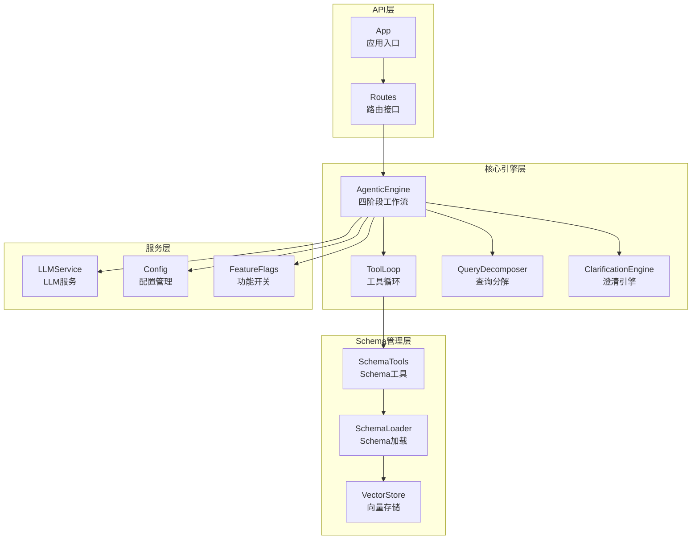
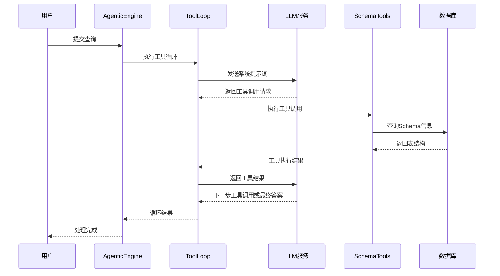
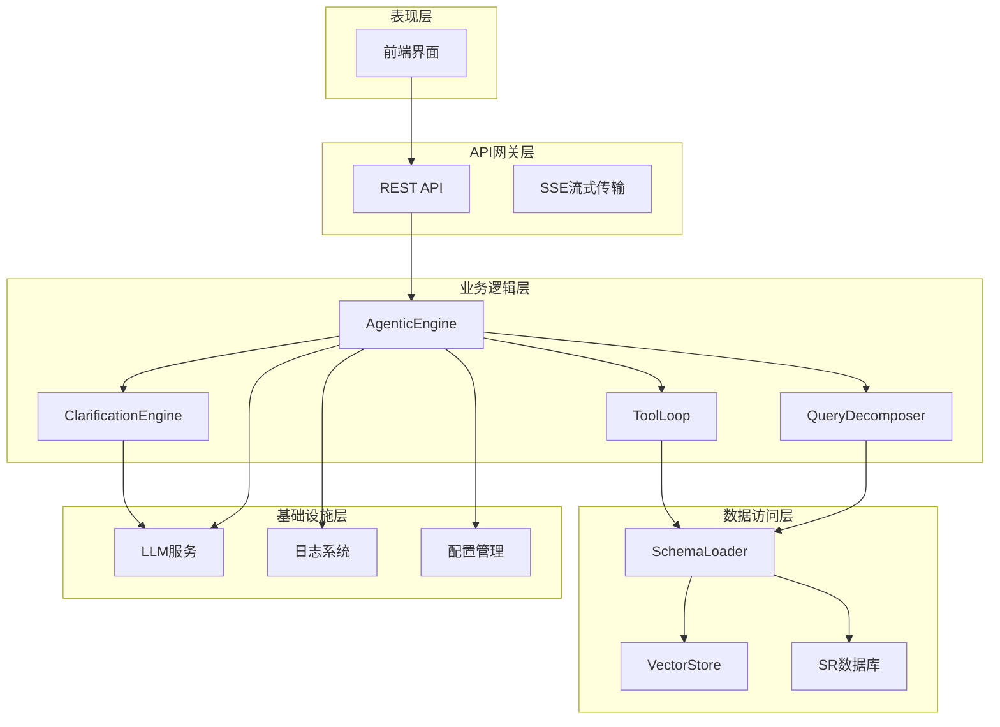
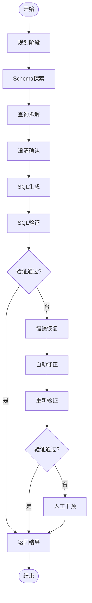
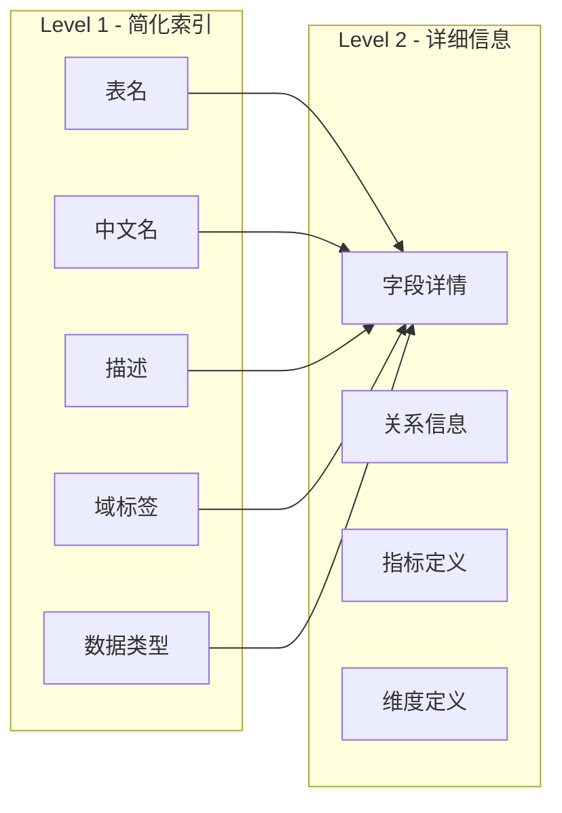
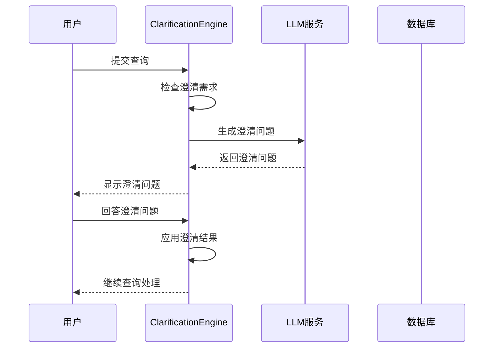
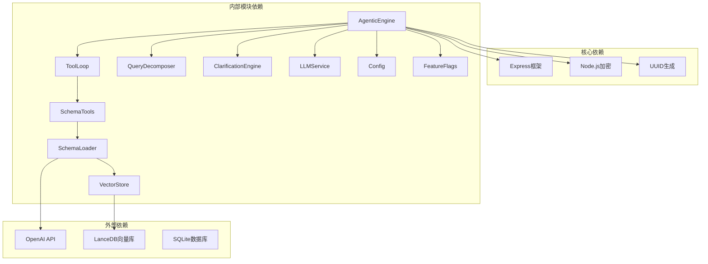
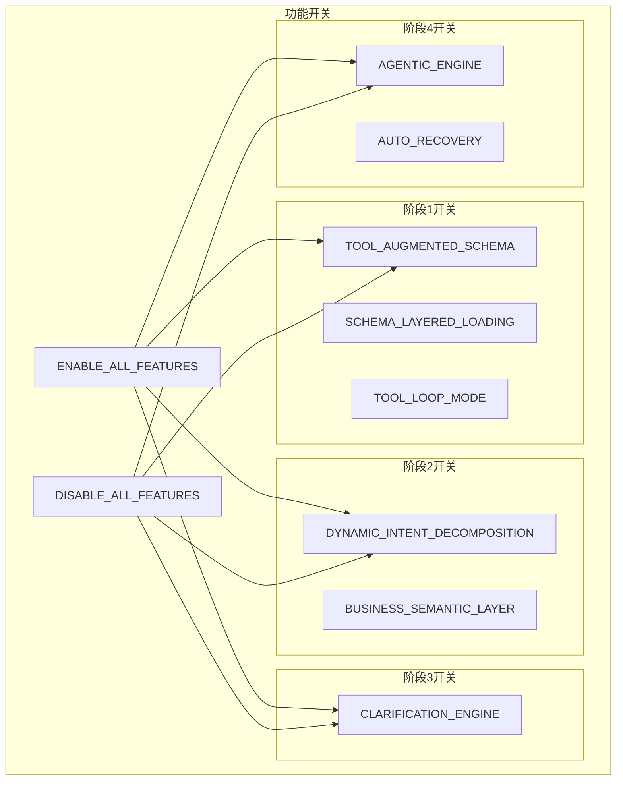
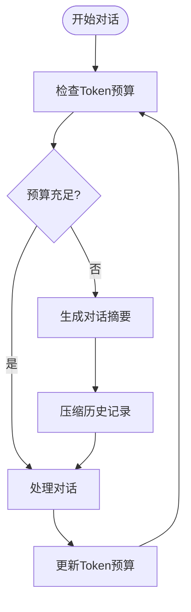

# Agent智能工作流

<cite>
**本文档引用的文件**
- [agenticEngine.js](file://backend/src/core/agenticEngine.js)
- [toolLoop.js](file://backend/src/core/toolLoop.js)
- [schemaTools.js](file://backend/src/core/schemaTools.js)
- [queryDecomposer.js](file://backend/src/core/queryDecomposer.js)
- [clarificationEngine.js](file://backend/src/core/clarificationEngine.js)
- [schemaLoader.js](file://backend/src/core/schemaLoader.js)
- [llmService.js](file://backend/src/core/llmService.js)
- [feature-flags.js](file://backend/config/feature-flags.js)
- [schema-metadata.json](file://backend/config/schema-metadata.json)
- [vectorStore.js](file://backend/src/memory/vectorStore.js)
- [routes.js](file://backend/src/core/routes.js)
- [app.js](file://backend/src/app.js)
- [llmResponseParser.js](file://backend/src/utils/llmResponseParser.js)
</cite>

## 目录
1. [简介](#简介)
2. [项目结构](#项目结构)
3. [核心组件](#核心组件)
4. [架构概览](#架构概览)
5. [详细组件分析](#详细组件分析)
6. [依赖关系分析](#依赖关系分析)
7. [性能考量](#性能考量)
8. [故障排除指南](#故障排除指南)
9. [结论](#结论)
10. [附录](#附录)

## 简介

Agent智能工作流系统是一个基于四阶段Agent架构的自然语言转SQL查询系统。该系统通过智能的工具循环机制，实现了Schema探索、动态意图拆解、澄清确认和多步推理恢复的完整工作流程。

系统的核心设计理念是"按需索取"而非"一次性灌输"，通过LLM驱动的工具调用实现智能化的Schema探索和查询处理。每个阶段都有明确的功能职责和错误恢复机制，确保复杂查询的准确处理。

## 项目结构

后端采用模块化设计，主要分为以下几个核心模块：

**图表来源**
- [agenticEngine.js:1-651](file://backend/src/core/agenticEngine.js#L1-L651)
- [toolLoop.js:1-521](file://backend/src/core/toolLoop.js#L1-L521)
- [schemaTools.js:1-632](file://backend/src/core/schemaTools.js#L1-L632)

**章节来源**
- [app.js:1-266](file://backend/src/app.js#L1-L266)
- [routes.js:1-800](file://backend/src/core/routes.js#L1-L800)

## 核心组件

### 四阶段Agent工作流

系统实现了完整的四阶段Agent工作流，每个阶段都有明确的功能和输出：

1. **阶段1：规划与Schema探索**
   - 规划查询策略和执行计划
   - 使用工具循环探索数据库Schema
   - 动态发现相关表和字段

2. **阶段2：动态意图拆解**
   - 将复杂查询拆解为数据需求单元
   - 独立检索每个数据单元的相关表
   - 生成候选表集合

3. **阶段3：澄清与确认**
   - 检测查询理解不足的情况
   - 生成友好的澄清问题
   - 应用用户反馈进行修正

4. **阶段4：生成、验证与恢复**
   - 生成最终SQL查询
   - 执行SQL验证和安全检查
   - 自动错误恢复和修正

**章节来源**
- [agenticEngine.js:52-178](file://backend/src/core/agenticEngine.js#L52-L178)

### 工具循环机制

工具循环是系统的核心创新，实现了LLM与数据库Schema的智能交互：

**图表来源**
- [toolLoop.js:57-185](file://backend/src/core/toolLoop.js#L57-L185)
- [schemaTools.js:565-577](file://backend/src/core/schemaTools.js#L565-L577)

**章节来源**
- [toolLoop.js:41-185](file://backend/src/core/toolLoop.js#L41-L185)
- [schemaTools.js:36-124](file://backend/src/core/schemaTools.js#L36-L124)

## 架构概览

系统采用分层架构设计，确保各组件的职责清晰和松耦合：

**图表来源**
- [app.js:97-194](file://backend/src/app.js#L97-L194)
- [routes.js:1-800](file://backend/src/core/routes.js#L1-L800)

**章节来源**
- [app.js:93-194](file://backend/src/app.js#L93-L194)
- [routes.js:140-186](file://backend/src/core/routes.js#L140-L186)

## 详细组件分析

### AgenticEngine - 四阶段工作流核心

AgenticEngine是整个系统的核心控制器，实现了完整的四阶段Agent工作流：

#### 核心功能特性

1. **阶段化处理流程**
   - 每个阶段都有明确的输入输出和处理逻辑
   - 支持阶段间的状态传递和结果整合
   - 提供详细的进度回调和日志记录

2. **错误恢复机制**
   - 最大重试次数控制（默认3次）
   - 多种错误类型的分类处理
   - 自动恢复和人工干预的平衡

3. **配置驱动的灵活性**
   - 基于功能开关的渐进式功能启用
   - 支持不同工作流模式的切换
   - 灵活的配置管理和热更新

**章节来源**
- [agenticEngine.js:52-651](file://backend/src/core/agenticEngine.js#L52-L651)

#### SQL生成与验证流程

**图表来源**
- [agenticEngine.js:345-511](file://backend/src/core/agenticEngine.js#L345-L511)

**章节来源**
- [agenticEngine.js:345-495](file://backend/src/core/agenticEngine.js#L345-L495)

### SchemaTools - 工具化Schema探索

SchemaTools提供了LLM可调用的Schema探索工具集，实现了"按需索取"的Schema访问模式：

#### 核心工具功能

1. **search_tables - 表搜索**
   - 支持关键词搜索和语义匹配
   - 返回相关表的详细信息
   - 支持Top-K结果返回

2. **describe_table - 表详情**
   - 获取表的完整字段结构
   - 支持精简和详细两种模式
   - 提供业务含义和数据类型信息

3. **search_knowledge - 业务概念查询**
   - 查询业务术语的定义和映射
   - 支持别名匹配和模糊匹配
   - 提供数据源映射关系

4. **peek_table - 表预览**
   - 查看表的结构预览信息
   - 支持限制行数的样例展示
   - 安全考虑下的数据保护

**章节来源**
- [schemaTools.js:217-393](file://backend/src/core/schemaTools.js#L217-L393)

#### Level 1/Level 2分层加载

系统实现了两级Schema加载机制：

**图表来源**
- [schemaTools.js:136-211](file://backend/src/core/schemaTools.js#L136-L211)
- [schemaLoader.js:790-800](file://backend/src/core/schemaLoader.js#L790-L800)

**章节来源**
- [schemaTools.js:136-173](file://backend/src/core/schemaTools.js#L136-L173)
- [schemaLoader.js:790-800](file://backend/src/core/schemaLoader.js#L790-L800)

### QueryDecomposer - 动态意图拆解

QueryDecomposer实现了智能的查询意图拆解功能，将复杂查询分解为可独立处理的数据需求单元：

#### 拆解算法特点

1. **动态单元生成**
   - 不预设固定的单元类型
   - 根据查询内容动态确定单元类型
   - 支持多种数据需求类型的单元

2. **语义搜索集成**
   - 基于每个数据单元独立检索相关表
   - 使用向量相似度进行表匹配
   - 支持业务关键词映射增强

3. **置信度评估**
   - 为每个数据单元分配置信度分数
   - 支持单元级别的质量评估
   - 提供复杂度估计和风险识别

**章节来源**
- [queryDecomposer.js:24-70](file://backend/src/core/queryDecomposer.js#L24-L70)
- [queryDecomposer.js:255-298](file://backend/src/core/queryDecomposer.js#L255-L298)

#### 数据单元类型

系统支持多种数据单元类型：

| 单元类型 | 描述 | 示例 |
|---------|------|------|
| 基础属性筛选 | 游戏ID、平台、渠道等维度筛选 | `game_id=67`, `platform=new` |
| 时间范围筛选 | 注册时间、登录时间等时间条件 | `2024-01-01到2024-12-31` |
| 聚合指标筛选 | 累计充值、总消费等聚合条件 | `SUM(real_amount)`, `COUNT(*)` |
| 行为序列筛选 | 特定日期的行为模式 | `3月1日登录但3月2-3日未登录` |
| 输出字段需求 | 需要返回的字段列表 | `role_id, create_time, amount` |

**章节来源**
- [queryDecomposer.js:98-142](file://backend/src/core/queryDecomposer.js#L98-L142)

### ClarificationEngine - 澄清机制

ClarificationEngine实现了智能的查询澄清功能，当系统检测到理解不足时会主动询问用户：

#### 澄清触发条件

系统定义了多种澄清触发场景：

1. **数据单元无匹配表**
   - 关键数据单元无法匹配到具体表
   - 需要用户提供更多信息

2. **表选择歧义**
   - 同类型数据匹配到多个表
   - 需要用户确认具体表来源

3. **聚合指标来源不明确**
   - 实时计算 vs 预汇总数据的选择
   - 需要用户指定数据源偏好

4. **时间粒度不明确**
   - 按天、周、月统计的粒度选择
   - 需要用户确认统计维度

5. **置信度过低**
   - 整体理解置信度不足
   - 需要用户提供详细说明

**章节来源**
- [clarificationEngine.js:26-182](file://backend/src/core/clarificationEngine.js#L26-L182)

#### 澄清问题生成

**图表来源**
- [clarificationEngine.js:246-272](file://backend/src/core/clarificationEngine.js#L246-L272)

**章节来源**
- [clarificationEngine.js:246-374](file://backend/src/core/clarificationEngine.js#L246-L374)

### LLMService - 大语言模型服务

LLMService提供了统一的大语言模型访问接口，支持多种模型和功能：

#### 核心功能

1. **聊天接口**
   - 支持普通对话和工具调用模式
   - 流式响应和非流式响应
   - 自动重试和错误处理

2. **Embedding向量生成**
   - 文本向量化服务
   - 支持批量向量生成
   - 统一的向量维度管理

3. **工具定义支持**
   - OpenAI函数调用格式支持
   - 工具参数验证和解析
   - 工具执行结果处理

**章节来源**
- [llmService.js:222-308](file://backend/src/core/llmService.js#L222-L308)
- [llmService.js:369-424](file://backend/src/core/llmService.js#L369-L424)

## 依赖关系分析

系统采用了清晰的依赖层次结构，确保模块间的松耦合和高内聚：

**图表来源**
- [app.js:22-51](file://backend/src/app.js#L22-L51)
- [agenticEngine.js:20-29](file://backend/src/core/agenticEngine.js#L20-L29)

**章节来源**
- [app.js:22-51](file://backend/src/app.js#L22-L51)
- [agenticEngine.js:20-29](file://backend/src/core/agenticEngine.js#L20-L29)

### 功能开关系统

系统通过功能开关实现了渐进式功能启用和快速回滚：

**图表来源**
- [feature-flags.js:16-96](file://backend/config/feature-flags.js#L16-L96)

**章节来源**
- [feature-flags.js:16-200](file://backend/config/feature-flags.js#L16-L200)

## 性能考量

系统在设计时充分考虑了性能优化和资源管理：

### 向量存储优化

1. **表级向量表示**
   - 从字段级向量改为表级向量
   - 每个表只生成一个向量，减少存储空间
   - 包含强动作特征词提升检索准确性

2. **智能搜索重排序**
   - 根据查询意图识别游戏偏好
   - 分层平台权重优化（SDK核心表优先）
   - 原始日志表优先于聚合报表

3. **缓存策略**
   - Level 1索引缓存（默认1小时）
   - 向量数据增量更新
   - 智能缓存失效机制

### Token预算管理

系统实现了智能的Token预算管理：

**图表来源**
- [config.js:310-332](file://backend/src/core/config.js#L310-L332)

**章节来源**
- [config.js:310-332](file://backend/src/core/config.js#L310-L332)

### 错误处理和重试机制

系统实现了多层次的错误处理和重试机制：

1. **LLM API重试**
   - 最大重试次数：3次
   - 重试间隔：1秒
   - 超时控制：60秒

2. **向量数据库容错**
   - 初始化失败不阻塞应用启动
   - 语义搜索失败回退到关键词匹配
   - 智能错误恢复策略

3. **查询超时控制**
   - 默认查询超时：30秒
   - 行数限制：1000行
   - 内存使用监控

**章节来源**
- [llmService.js:167-195](file://backend/src/core/llmService.js#L167-L195)
- [config.js:154-170](file://backend/src/core/config.js#L154-L170)

## 故障排除指南

### 常见问题诊断

#### LLM API连接问题

**症状**：查询处理失败，错误信息显示API连接失败

**排查步骤**：
1. 检查LLM API密钥配置
2. 验证API基础URL设置
3. 确认网络连接和防火墙设置
4. 查看详细的错误日志

**解决方案**：
- 更新.env文件中的API配置
- 检查API服务状态
- 调整超时参数设置

#### 向量数据库初始化失败

**症状**：系统启动时显示向量数据库未初始化

**排查步骤**：
1. 检查向量数据库路径配置
2. 验证LanceDB依赖安装
3. 确认磁盘空间和权限

**解决方案**：
- 重新安装vectordb依赖
- 检查数据目录权限
- 调整向量数据库路径

#### Schema加载失败

**症状**：Schema元数据加载失败，表结构不可用

**排查步骤**：
1. 检查schema-metadata.json文件格式
2. 验证表定义的完整性
3. 确认字段类型定义正确

**解决方案**：
- 修复JSON格式错误
- 补充缺失的表定义
- 验证字段映射关系

**章节来源**
- [app.js:188-193](file://backend/src/app.js#L188-L193)
- [schemaLoader.js:88-131](file://backend/src/core/schemaLoader.js#L88-L131)

### 性能优化建议

#### 查询性能优化

1. **合理使用功能开关**
   - 在开发环境启用详细日志
   - 在生产环境启用性能优化
   - 根据需求启用特定功能

2. **向量存储优化**
   - 定期重新向量化Schema
   - 监控向量存储使用情况
   - 调整搜索参数优化性能

3. **缓存策略优化**
   - 调整缓存过期时间
   - 监控缓存命中率
   - 优化缓存清理策略

#### 内存和资源管理

1. **监控内存使用**
   - 定期检查内存使用情况
   - 设置内存使用上限
   - 及时清理无用数据

2. **数据库连接池管理**
   - 调整连接池大小
   - 监控连接使用情况
   - 及时释放空闲连接

**章节来源**
- [config.js:222-231](file://backend/src/core/config.js#L222-L231)
- [vectorStore.js:722-752](file://backend/src/memory/vectorStore.js#L722-L752)

## 结论

Agent智能工作流系统通过四阶段Agent架构和工具循环机制，实现了智能化的自然语言查询处理。系统的主要优势包括：

1. **智能化的Schema探索**：通过工具循环实现按需索取的Schema访问模式
2. **灵活的查询处理**：支持复杂查询的动态拆解和组合
3. **智能的澄清机制**：主动检测理解不足并提供友好的澄清体验
4. **强大的错误恢复**：多层错误处理和自动恢复机制
5. **可扩展的架构设计**：模块化设计支持功能渐进式启用

系统在设计时充分考虑了性能优化、错误处理和用户体验，为复杂的企业级查询场景提供了可靠的解决方案。

## 附录

### 配置参数说明

#### LLM配置参数

| 参数名 | 默认值 | 说明 |
|--------|--------|------|
| LLM_API_BASE | https://api.openai.com/v1 | LLM API基础URL |
| LLM_API_KEY | 空 | API密钥 |
| LLM_MODEL | gpt-4 | 默认使用的模型 |
| LLM_TIMEOUT | 60000 | 请求超时时间（毫秒） |

#### 安全配置参数

| 参数名 | 默认值 | 说明 |
|--------|--------|------|
| ALLOWED_TABLES | 空 | 允许访问的表白名单 |
| DRY_RUN | false | 是否只生成SQL不执行 |
| MAX_QUERY_ROWS | 1000 | 单次查询最大返回行数 |
| QUERY_TIMEOUT | 30000 | 查询超时时间（毫秒） |

#### 向量存储配置参数

| 参数名 | 默认值 | 说明 |
|--------|--------|------|
| VECTOR_DB_PATH | ./data/vectordb | 向量数据库存储路径 |
| EMBEDDING_MODEL | text-embedding-3-small | Embedding模型名称 |
| EMBEDDING_DIMENSION | 1536 | 向量维度 |
| SCHEMA_REVECTORIZE | false | 是否强制重新向量化 |

**章节来源**
- [config.js:60-87](file://backend/src/core/config.js#L60-L87)
- [config.js:140-170](file://backend/src/core/config.js#L140-L170)
- [config.js:106-109](file://backend/src/core/config.js#L106-L109)

### API接口参考

#### 健康检查接口

**GET** `/api/health`
- 返回服务健康状态
- 包含内存使用情况
- 返回200状态码

**GET** `/api/health/detail`
- 返回详细健康状态
- 包含各组件状态
- 支持503状态码

#### Schema查询接口

**GET** `/api/schema`
- 获取完整Schema信息
- 支持类型筛选（tables/metrics/dimensions）

**GET** `/api/schema/search?q=关键词&limit=5`
- 搜索相关表
- 支持关键词搜索

**章节来源**
- [routes.js:72-137](file://backend/src/core/routes.js#L72-L137)
- [routes.js:225-250](file://backend/src/core/routes.js#L225-L250)