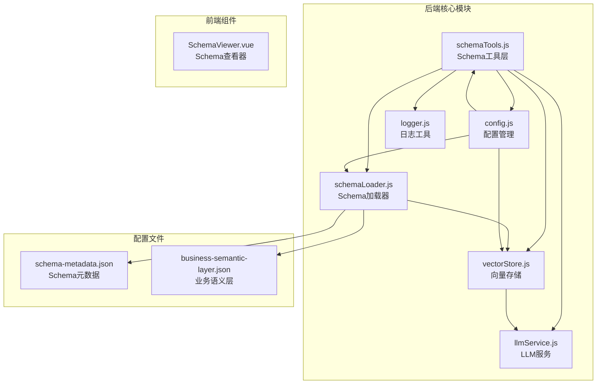
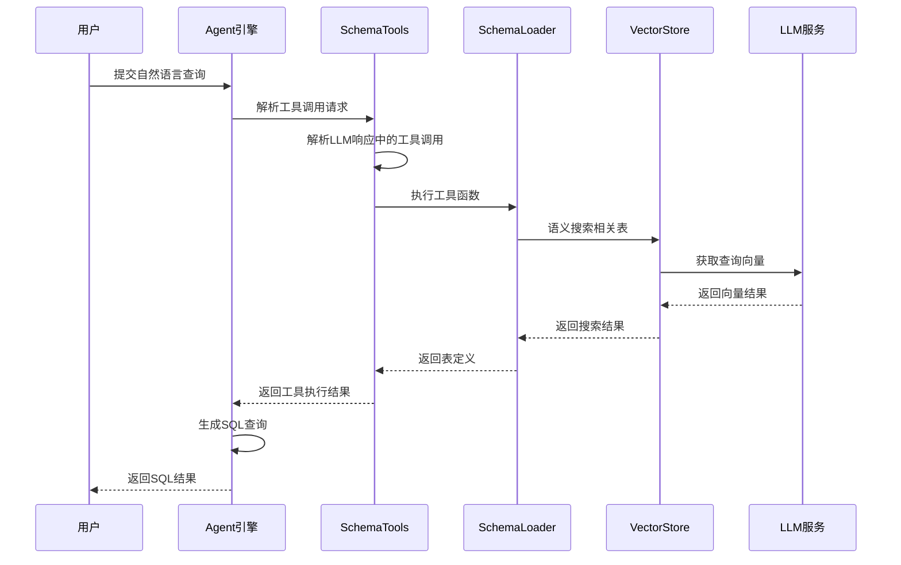
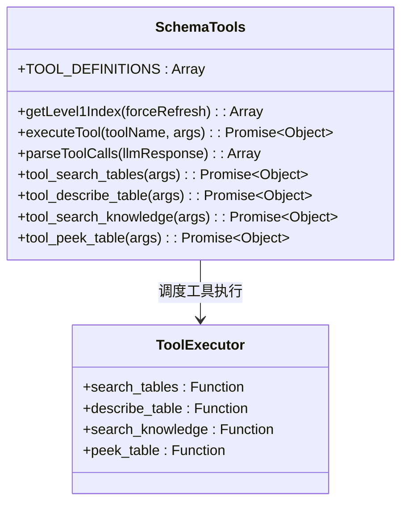
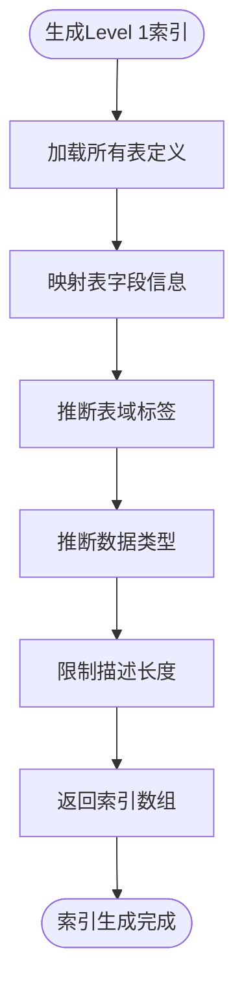
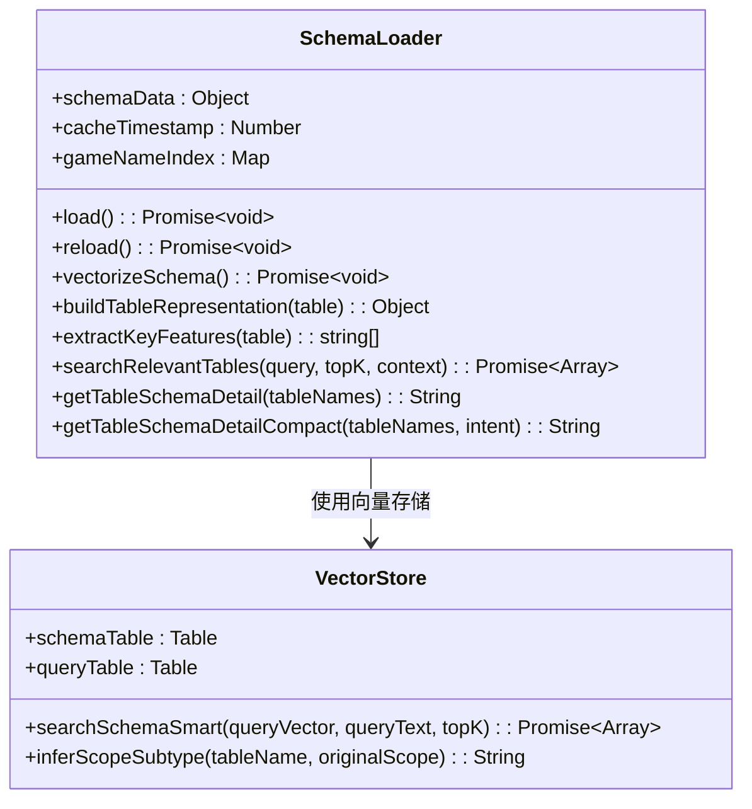
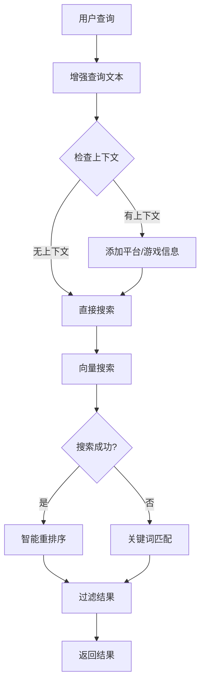
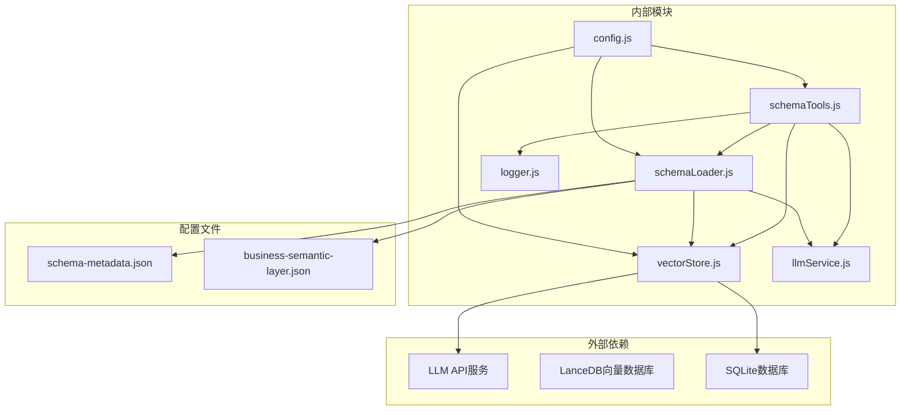

# Schema工具集

<cite>
**本文档引用的文件**
- [schemaTools.js](file://backend/src/core/schemaTools.js)
- [schemaLoader.js](file://backend/src/core/schemaLoader.js)
- [config.js](file://backend/src/core/config.js)
- [vectorStore.js](file://backend/src/memory/vectorStore.js)
- [llmService.js](file://backend/src/core/llmService.js)
- [logger.js](file://backend/src/utils/logger.js)
- [schema-metadata.json](file://backend/config/schema-metadata.json)
- [business-semantic-layer.json](file://backend/config/business-semantic-layer.json)
- [package.json](file://backend/package.json)
</cite>

## 目录
1. [简介](#简介)
2. [项目结构](#项目结构)
3. [核心组件](#核心组件)
4. [架构概览](#架构概览)
5. [详细组件分析](#详细组件分析)
6. [依赖关系分析](#依赖关系分析)
7. [性能考量](#性能考量)
8. [故障排查指南](#故障排查指南)
9. [结论](#结论)

## 简介

Schema工具集是NL2SQL系统中的核心数据发现和映射组件，采用"按需索取"的设计理念，通过LLM可调用的工具函数实现智能化的Schema探索。该工具集实现了两级索引体系（Level 1和Level 2），提供了表发现、字段映射、关系推理等核心功能，为Agent工作流中的自然语言到SQL转换提供了强大的数据基础设施支持。

## 项目结构

NL2SQL项目采用模块化设计，Schema工具集位于后端核心模块中，与LLM服务、向量存储、配置管理等组件紧密集成：

**图表来源**
- [schemaTools.js:1-632](file://backend/src/core/schemaTools.js#L1-L632)
- [schemaLoader.js:1-1235](file://backend/src/core/schemaLoader.js#L1-L1235)
- [config.js:1-398](file://backend/src/core/config.js#L1-L398)

**章节来源**
- [schemaTools.js:1-632](file://backend/src/core/schemaTools.js#L1-L632)
- [schemaLoader.js:1-1235](file://backend/src/core/schemaLoader.js#L1-L1235)
- [config.js:1-398](file://backend/src/core/config.js#L1-L398)

## 核心组件

Schema工具集由四个核心组件构成，每个组件都有明确的职责分工：

### 1. Schema工具层（SchemaTools）
负责提供LLM可调用的Schema探索工具，实现"按需索取"而非"一次性灌输"的设计理念。包含四个核心工具：
- `search_tables`: 根据关键词搜索相关表
- `describe_table`: 获取指定表的详细字段信息  
- `search_knowledge`: 查询业务概念的定义和映射
- `peek_table`: 查看表的前N行样例数据

### 2. Schema加载器（SchemaLoader）
负责加载和管理数据表的Schema信息，提供查询和匹配接口，实现缓存机制提高性能。

### 3. 向量存储（VectorStore）
基于LanceDB实现向量存储和语义检索，支持Schema信息的向量化存储和智能搜索。

### 4. 配置管理（Config）
统一管理应用的所有配置项，从环境变量读取并提供默认值，集中管理配置便于维护。

**章节来源**
- [schemaTools.js:36-124](file://backend/src/core/schemaTools.js#L36-L124)
- [schemaLoader.js:36-51](file://backend/src/core/schemaLoader.js#L36-L51)
- [vectorStore.js:14-24](file://backend/src/memory/vectorStore.js#L14-L24)
- [config.js:16-50](file://backend/src/core/config.js#L16-L50)

## 架构概览

Schema工具集采用分层架构设计，实现了从Schema元数据到LLM工具调用的完整链路：

**图表来源**
- [schemaTools.js:585-602](file://backend/src/core/schemaTools.js#L585-L602)
- [schemaLoader.js:571-653](file://backend/src/core/schemaLoader.js#L571-L653)
- [vectorStore.js:452-576](file://backend/src/memory/vectorStore.js#L452-L576)

## 详细组件分析

### Schema工具层（SchemaTools）

#### 工具定义和调度

SchemaTools模块提供了标准化的工具定义格式，符合OpenAI Function Calling规范：

**图表来源**
- [schemaTools.js:40-124](file://backend/src/core/schemaTools.js#L40-L124)
- [schemaTools.js:551-556](file://backend/src/core/schemaTools.js#L551-L556)

#### Level 1索引系统

Level 1索引是Schema工具集的核心创新，实现了极简化的表索引：

**图表来源**
- [schemaTools.js:136-173](file://backend/src/core/schemaTools.js#L136-L173)
- [schemaTools.js:181-211](file://backend/src/core/schemaTools.js#L181-L211)

#### 业务知识库

SchemaTools内置了丰富的业务知识库，支持业务概念的精确匹配：

| 业务概念 | 关键别名 | 映射关系 |
|---------|---------|----------|
| 老平台 | 旧平台, 老版本, 旧版本 | 数据源: new_tzpingtaiold, 平台字段: platform_type |
| 新平台 | tzpingtai, 新系统, 新版本 | 数据源: new_tzpingtai, 平台字段: platform_type |
| 累计充值 | 累计付费, 总充值, 总付费 | 主表: tzpingtai_tz_sdk_log_pf_order, 聚合: SUM(real_amount) |
| 充值 | 付费, 订单, 流水 | 主表: tzpingtai_tz_sdk_log_pf_order, 关键字段: [tz_account_id, game_id, real_amount] |

**章节来源**
- [schemaTools.js:405-542](file://backend/src/core/schemaTools.js#L405-L542)

### Schema加载器（SchemaLoader）

#### 向量化架构

SchemaLoader实现了先进的向量化架构，采用表级向量而非字段级向量：

**图表来源**
- [schemaLoader.js:210-285](file://backend/src/core/schemaLoader.js#L210-L285)
- [vectorStore.js:452-576](file://backend/src/memory/vectorStore.js#L452-L576)

#### 智能搜索算法

SchemaLoader实现了智能搜索算法，结合语义检索和关键词匹配：

**图表来源**
- [schemaLoader.js:571-653](file://backend/src/core/schemaLoader.js#L571-L653)
- [vectorStore.js:452-576](file://backend/src/memory/vectorStore.js#L452-L576)

**章节来源**
- [schemaLoader.js:210-431](file://backend/src/core/schemaLoader.js#L210-L431)
- [schemaLoader.js:571-710](file://backend/src/core/schemaLoader.js#L571-L710)

### 向量存储系统

#### 智能重排序机制

向量存储系统实现了智能重排序机制，根据查询意图动态调整搜索结果：

| 重排序策略 | 优先级权重 | 应用场景 |
|-----------|-----------|----------|
| 游戏表优先级 | +100 | 查询中提及具体游戏时 |
| 平台核心表 | +80 | 未指定游戏时的SDK核心表 |
| 平台其他表 | +50 | 平台相关但非核心表 |
| 报表表 | +40 | DWD报表类型表 |
| 新平台库 | +20 | new_tzpingtai数据库 |
| 老平台库 | +10 | new_tzpingtaiold数据库 |
| 原始日志表 | +30 | raw_log类型表 |
| 聚合报表表 | -20 | aggregated_report类型表 |

**章节来源**
- [vectorStore.js:452-576](file://backend/src/memory/vectorStore.js#L452-L576)

## 依赖关系分析

Schema工具集的依赖关系体现了清晰的分层架构：

**图表来源**
- [schemaTools.js:17-26](file://backend/src/core/schemaTools.js#L17-L26)
- [schemaLoader.js:16-26](file://backend/src/core/schemaLoader.js#L16-L26)
- [vectorStore.js:15-23](file://backend/src/memory/vectorStore.js#L15-L23)

**章节来源**
- [schemaTools.js:17-26](file://backend/src/core/schemaTools.js#L17-L26)
- [schemaLoader.js:16-26](file://backend/src/core/schemaLoader.js#L16-L26)
- [vectorStore.js:15-23](file://backend/src/memory/vectorStore.js#L15-L23)

## 性能考量

### 缓存策略

Schema工具集实现了多层次的缓存策略：

1. **Level 1索引缓存**: 默认1小时过期，减少重复计算
2. **Schema数据缓存**: 支持配置的缓存过期时间
3. **向量存储缓存**: 增量更新机制，避免全量重建

### 向量化优化

- **表级向量**: 每个表只生成一个向量，减少存储空间
- **智能过滤**: 支持按域标签和数据类型过滤
- **增量更新**: 只更新发生变化的表向量

### 搜索性能

- **Top-K限制**: 默认返回5个结果，可配置
- **智能重排序**: 基于查询意图的动态权重调整
- **并行处理**: 支持并发的工具调用执行

## 故障排查指南

### 常见问题及解决方案

#### 1. Schema加载失败
**症状**: 应用启动时报Schema配置文件不存在
**解决方案**: 
- 检查schema-metadata.json文件路径配置
- 验证JSON格式的正确性
- 确认文件权限设置

#### 2. 向量数据库初始化失败
**症状**: 向量搜索功能不可用
**解决方案**:
- 检查LanceDB安装状态
- 验证向量数据库目录权限
- 确认嵌入模型API配置

#### 3. LLM API调用失败
**症状**: 工具调用返回错误
**解决方案**:
- 验证LLM API密钥配置
- 检查网络连接状态
- 调整超时时间和重试配置

**章节来源**
- [schemaTools.js:248-255](file://backend/src/core/schemaTools.js#L248-L255)
- [vectorStore.js:258-262](file://backend/src/memory/vectorStore.js#L258-L262)
- [llmService.js:136-151](file://backend/src/core/llmService.js#L136-L151)

## 结论

Schema工具集通过创新的两级索引体系和智能搜索算法，为NL2SQL系统提供了强大的Schema发现和映射能力。其核心优势包括：

1. **按需索取**: 通过LLM工具调用实现按需Schema加载，避免一次性传输大量数据
2. **智能搜索**: 结合语义检索和关键词匹配，提供准确的表发现能力
3. **业务语义**: 内置丰富的业务知识库，支持业务概念的精确匹配
4. **性能优化**: 多层次缓存和向量化技术，确保高效的查询性能
5. **扩展性强**: 模块化设计支持功能扩展和定制化开发

该工具集在Agent工作流中发挥着关键作用，为自然语言到SQL的转换提供了可靠的数据基础设施，显著提升了系统的智能化水平和用户体验。