# 四阶段工作流详解

<cite>
**本文档引用的文件**
- [agenticEngine.js](file://backend/src/core/agenticEngine.js)
- [queryDecomposer.js](file://backend/src/core/queryDecomposer.js)
- [clarificationEngine.js](file://backend/src/core/clarificationEngine.js)
- [schemaTools.js](file://backend/src/core/schemaTools.js)
- [toolLoop.js](file://backend/src/core/toolLoop.js)
- [llmResponseParser.js](file://backend/src/utils/llmResponseParser.js)
- [feature-flags.js](file://backend/config/feature-flags.js)
- [config.js](file://backend/src/core/config.js)
- [schemaLoader.js](file://backend/src/core/schemaLoader.js)
- [business-semantic-layer.json](file://backend/config/business-semantic-layer.json)
- [selfRepair.js](file://backend/src/core/selfRepair.js)
- [package.json](file://backend/package.json)
</cite>

## 目录
1. [简介](#简介)
2. [项目结构](#项目结构)
3. [核心组件](#核心组件)
4. [架构概览](#架构概览)
5. [详细组件分析](#详细组件分析)
6. [依赖关系分析](#依赖关系分析)
7. [性能考虑](#性能考虑)
8. [故障排除指南](#故障排除指南)
9. [结论](#结论)

## 简介

NL2SQL四阶段Agent工作流是一个智能化的自然语言到SQL转换系统，采用分阶段、可扩展的设计理念。该系统通过四个核心阶段实现从自然语言查询到可执行SQL的完整转换流程：

- **第一阶段：规划与工具增强的Schema发现** - 通过LLM规划查询策略，结合工具循环探索数据库Schema
- **第二阶段：动态意图拆解** - 将复杂查询拆解为独立的数据需求单元
- **第三阶段：澄清与确认** - 当置信度不足时主动发起澄清问题
- **第四阶段：生成、验证与恢复** - 生成SQL、验证安全性并具备自动恢复能力

该系统采用功能开关机制实现渐进式功能启用，支持快速回滚和灵活的配置管理。

## 项目结构

后端采用模块化设计，核心文件组织如下：

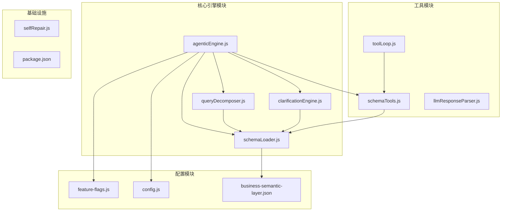

**图表来源**
- [agenticEngine.js:1-651](file://backend/src/core/agenticEngine.js#L1-L651)
- [queryDecomposer.js:1-402](file://backend/src/core/queryDecomposer.js#L1-L402)
- [schemaTools.js:1-632](file://backend/src/core/schemaTools.js#L1-L632)

**章节来源**
- [agenticEngine.js:1-651](file://backend/src/core/agenticEngine.js#L1-L651)
- [feature-flags.js:1-249](file://backend/config/feature-flags.js#L1-L249)
- [config.js:1-398](file://backend/src/core/config.js#L1-L398)

## 核心组件

### 四阶段工作流架构

系统采用分阶段的Agent设计，每个阶段都有明确的职责和输出：

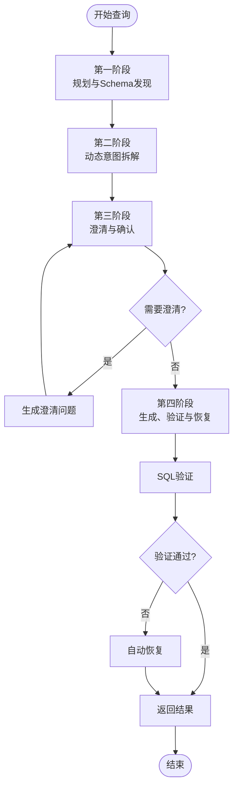

**图表来源**
- [agenticEngine.js:68-178](file://backend/src/core/agenticEngine.js#L68-L178)

### 功能开关控制系统

系统通过环境变量控制各阶段功能的启用状态：

| 阶段 | 功能开关 | 环境变量 | 默认状态 |
|------|----------|----------|----------|
| 第一阶段 | 工具增强Schema | FF_TOOL_AUGMENTED_SCHEMA | false |
| 第一阶段 | 分层加载 | FF_SCHEMA_LAYERED_LOADING | false |
| 第一阶段 | 工具循环模式 | FF_TOOL_LOOP_MODE | false |
| 第二阶段 | 动态意图拆解 | FF_DYNAMIC_INTENT_DECOMPOSITION | false |
| 第二阶段 | 业务语义层 | FF_BUSINESS_SEMANTIC_LAYER | false |
| 第三阶段 | 澄清引擎 | FF_CLARIFICATION_ENGINE | false |
| 第四阶段 | Agentic引擎 | FF_AGENTIC_ENGINE | false |
| 第四阶段 | 自动恢复 | FF_AUTO_RECOVERY | false |

**章节来源**
- [feature-flags.js:16-96](file://backend/config/feature-flags.js#L16-L96)
- [feature-flags.js:108-161](file://backend/config/feature-flags.js#L108-L161)

## 架构概览

### 系统整体架构

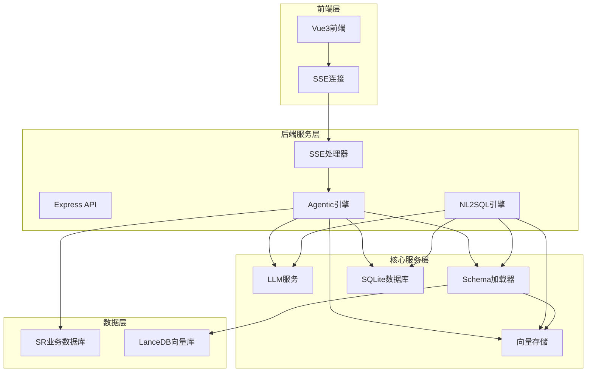

**图表来源**
- [agenticEngine.js:19-30](file://backend/src/core/agenticEngine.js#L19-L30)
- [schemaLoader.js:75-131](file://backend/src/core/schemaLoader.js#L75-L131)

### 数据流处理流程

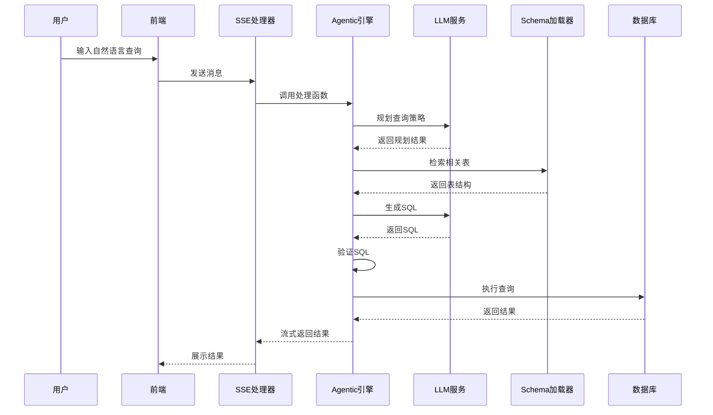

**图表来源**
- [agenticEngine.js:68-178](file://backend/src/core/agenticEngine.js#L68-L178)
- [toolLoop.js:57-185](file://backend/src/core/toolLoop.js#L57-L185)

**章节来源**
- [agenticEngine.js:1-651](file://backend/src/core/agenticEngine.js#L1-L651)
- [toolLoop.js:1-521](file://backend/src/core/toolLoop.js#L1-L521)

## 详细组件分析

### 第一阶段：规划与工具增强的Schema发现

#### 规划阶段实现

规划阶段负责分析用户查询并制定执行计划：

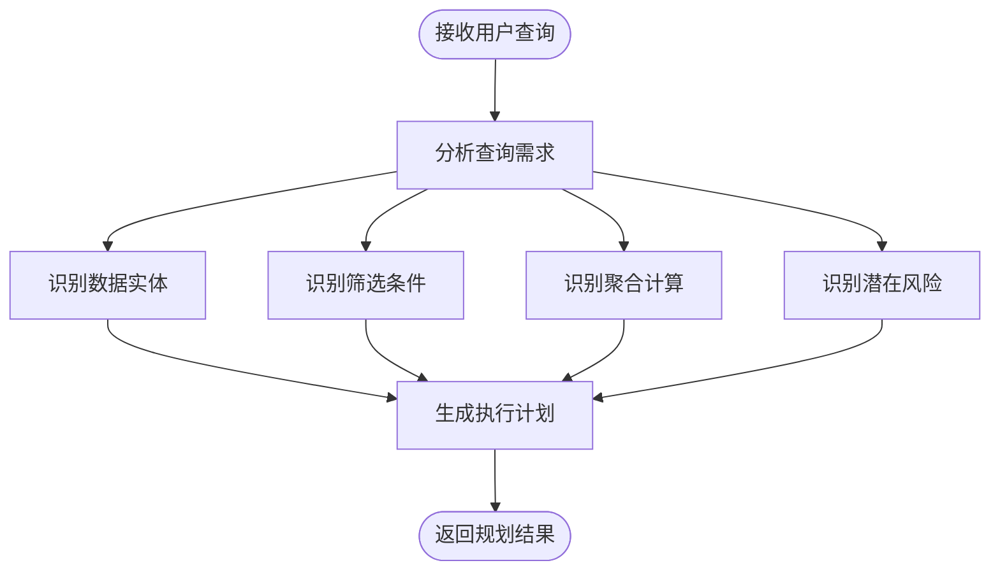

**图表来源**
- [agenticEngine.js:187-228](file://backend/src/core/agenticEngine.js#L187-L228)

#### Schema发现工具循环

工具循环实现LLM与数据库Schema的交互探索：

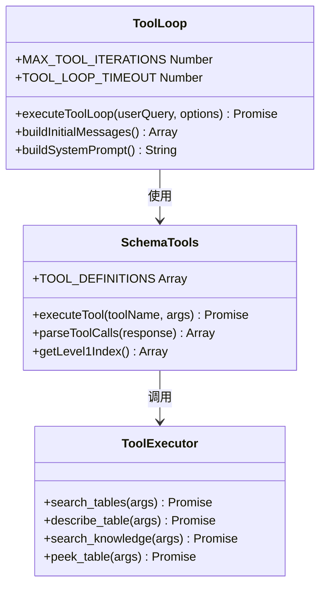

**图表来源**
- [toolLoop.js:57-185](file://backend/src/core/toolLoop.js#L57-L185)
- [schemaTools.js:40-124](file://backend/src/core/schemaTools.js#L40-L124)

**章节来源**
- [agenticEngine.js:187-262](file://backend/src/core/agenticEngine.js#L187-L262)
- [toolLoop.js:57-185](file://backend/src/core/toolLoop.js#L57-L185)
- [schemaTools.js:225-393](file://backend/src/core/schemaTools.js#L225-L393)

### 第二阶段：动态意图拆解

#### 查询分解器核心功能

动态意图拆解将复杂查询分解为可独立处理的数据需求单元：

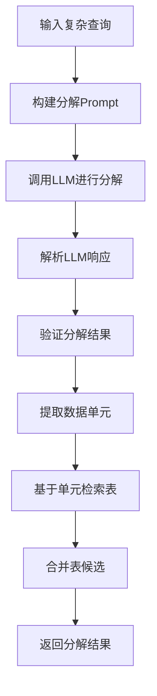

**图表来源**
- [queryDecomposer.js:38-70](file://backend/src/core/queryDecomposer.js#L38-L70)
- [queryDecomposer.js:255-298](file://backend/src/core/queryDecomposer.js#L255-L298)

#### 数据单元结构设计

每个数据单元包含以下关键信息：

| 字段 | 类型 | 描述 | 示例 |
|------|------|------|------|
| id | String | 单元唯一标识 | "unit_1" |
| type | String | 单元类型 | "基础属性筛选" |
| description | String | 单元描述 | "玩家ID筛选" |
| keywords | Array | 关键词列表 | ["玩家", "ID"] |
| filters | Array | 筛选条件 | [{"field": "player_id"}] |
| timeRange | Object | 时间范围 | {"start": "2024-01-01"} |
| metric | String | 指标名称 | "累计充值" |
| behavior | Object | 行为模式 | {"type": "登录"} |
| outputFields | Array | 输出字段 | ["player_id", "amount"] |

**章节来源**
- [queryDecomposer.js:152-198](file://backend/src/core/queryDecomposer.js#L152-L198)
- [queryDecomposer.js:306-330](file://backend/src/core/queryDecomposer.js#L306-L330)

### 第三阶段：澄清与确认

#### 澄清触发条件系统

澄清引擎通过多种触发条件检测置信度不足的情况：

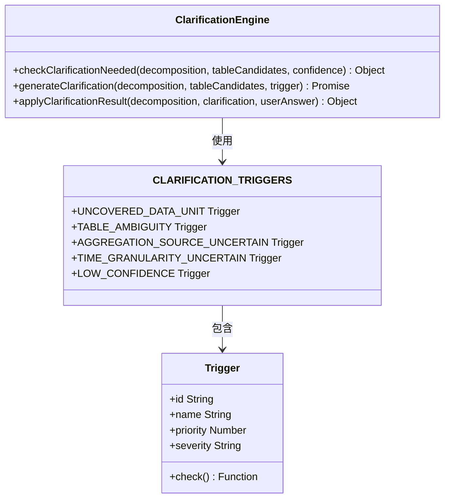

**图表来源**
- [clarificationEngine.js:196-232](file://backend/src/core/clarificationEngine.js#L196-L232)
- [clarificationEngine.js:26-182](file://backend/src/core/clarificationEngine.js#L26-L182)

#### 澄清问题生成流程

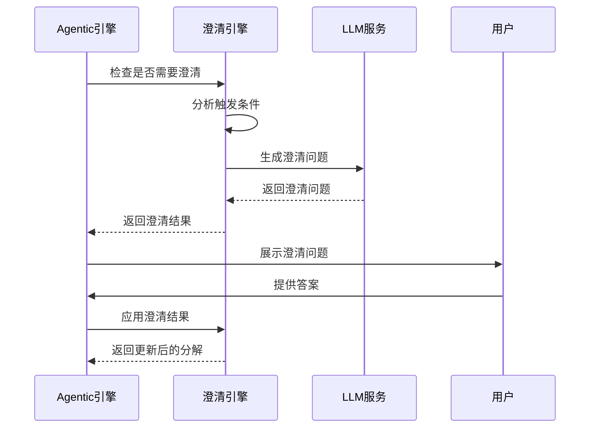

**图表来源**
- [clarificationEngine.js:246-272](file://backend/src/core/clarificationEngine.js#L246-L272)
- [clarificationEngine.js:388-426](file://backend/src/core/clarificationEngine.js#L388-L426)

**章节来源**
- [clarificationEngine.js:196-489](file://backend/src/core/clarificationEngine.js#L196-L489)

### 第四阶段：生成、验证与恢复

#### SQL生成与验证机制

第四阶段实现完整的SQL生成、验证和自动恢复流程：

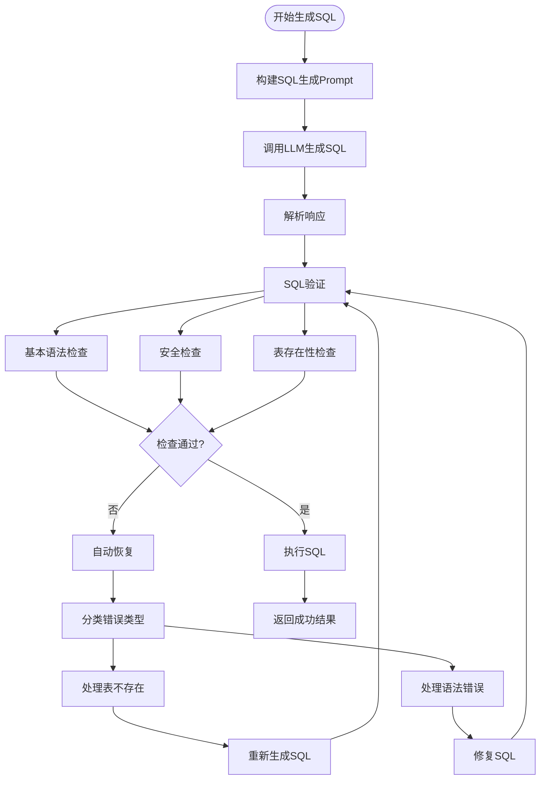

**图表来源**
- [agenticEngine.js:345-495](file://backend/src/core/agenticEngine.js#L345-L495)
- [agenticEngine.js:516-611](file://backend/src/core/agenticEngine.js#L516-L611)

#### 错误分类与恢复策略

| 错误类型 | 识别特征 | 恢复策略 | 实现方法 |
|----------|----------|----------|----------|
| TABLE_NOT_FOUND | "Table doesn't exist" | 替代表建议 | `handleTableNotFound()` |
| SYNTAX_ERROR | "Syntax error" | LLM自动修复 | `handleSyntaxError()` |
| OTHER_ERROR | 其他类型 | 返回错误信息 | 基础错误处理 |

**章节来源**
- [agenticEngine.js:438-611](file://backend/src/core/agenticEngine.js#L438-L611)

### 业务语义层集成

系统支持业务语义层配置，实现业务概念到物理表的映射：

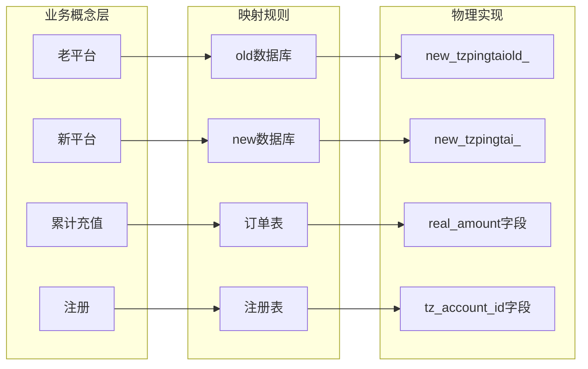

**图表来源**
- [business-semantic-layer.json:5-121](file://backend/config/business-semantic-layer.json#L5-L121)

**章节来源**
- [business-semantic-layer.json:1-189](file://backend/config/business-semantic-layer.json#L1-L189)

## 依赖关系分析

### 核心依赖关系图

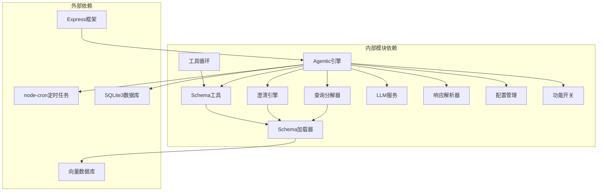

**图表来源**
- [package.json:10-20](file://backend/package.json#L10-L20)
- [agenticEngine.js:20-29](file://backend/src/core/agenticEngine.js#L20-L29)

### 模块间耦合度分析

| 模块 | 内聚性 | 耦合度 | 主要依赖 |
|------|--------|--------|----------|
| Agentic引擎 | 高 | 中等 | LLM服务, Schema工具, 澄清引擎 |
| 查询分解器 | 高 | 低 | LLM服务, Schema加载器 |
| 澄清引擎 | 高 | 低 | LLM服务, Schema加载器 |
| Schema工具 | 中等 | 高 | Schema加载器, LLM服务 |
| 工具循环 | 中等 | 高 | Schema工具, LLM服务 |
| 配置管理 | 低 | 低 | 环境变量 |

**章节来源**
- [agenticEngine.js:1-651](file://backend/src/core/agenticEngine.js#L1-L651)
- [queryDecomposer.js:1-402](file://backend/src/core/queryDecomposer.js#L1-L402)
- [clarificationEngine.js:1-489](file://backend/src/core/clarificationEngine.js#L1-L489)

## 性能考虑

### 性能优化策略

1. **缓存机制**
   - Level 1索引缓存：默认1小时过期
   - Schema元数据缓存：基于文件修改时间
   - 向量存储缓存：LanceDB本地存储

2. **异步处理**
   - 长期记忆写入使用队列异步处理
   - 向量检索支持并发查询
   - SSE流式响应避免阻塞

3. **资源限制**
   - 最大重试次数：3次
   - 工具循环最大迭代：5次
   - 查询超时时间：30秒
   - 最大查询行数：1000行

### 性能监控指标

| 指标类型 | 阈值 | 监控方式 |
|----------|------|----------|
| 响应时间 | <5秒 | 日志记录 |
| 失败率 | <10% | 自修复检查 |
| 内存使用 | <90% | 系统监控 |
| 查询时间 | <5秒 | 性能日志 |

**章节来源**
- [config.js:222-231](file://backend/src/core/config.js#L222-L231)
- [selfRepair.js:169-310](file://backend/src/core/selfRepair.js#L169-L310)

## 故障排除指南

### 常见问题诊断

#### LLM API相关问题

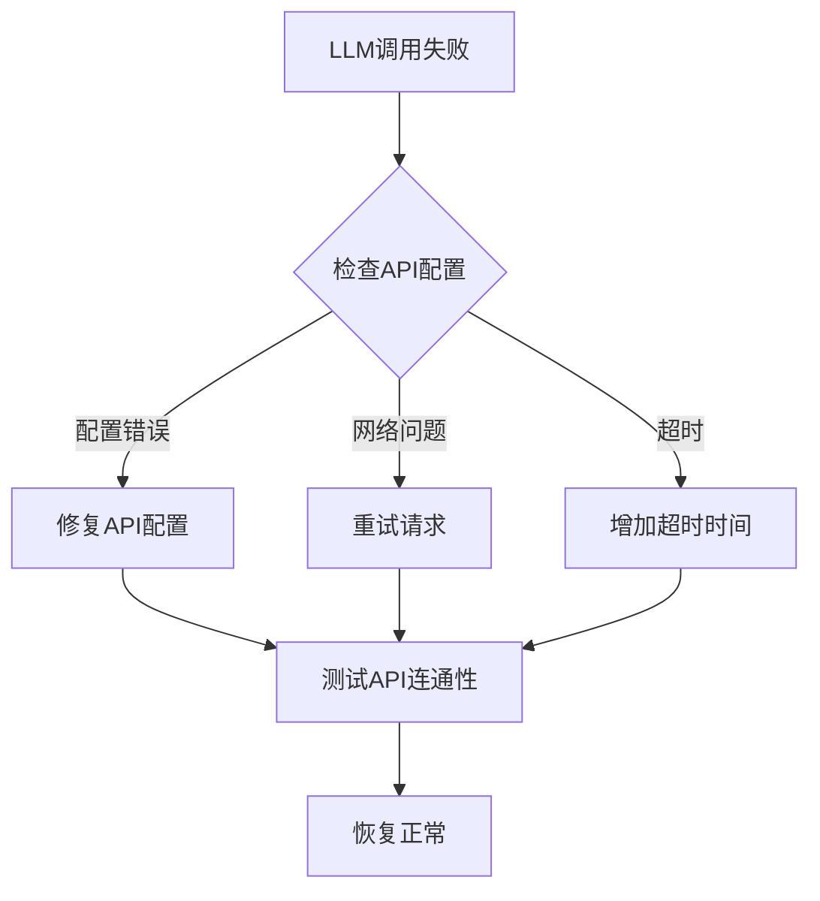

#### Schema相关问题

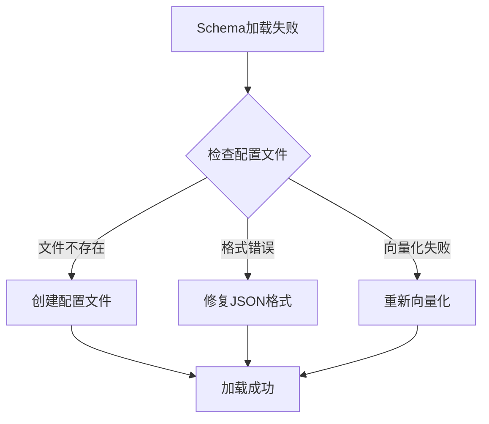

#### 功能开关问题

| 问题现象 | 可能原因 | 解决方案 |
|----------|----------|----------|
| 功能未生效 | 环境变量未设置 | 检查FF_前缀环境变量 |
| 功能冲突 | 多个开关同时启用 | 使用DISABLE_ALL回滚 |
| 功能不稳定 | 缓存问题 | 清除缓存后重启 |
| 性能下降 | 配置不当 | 调整超时和重试参数 |

**章节来源**
- [feature-flags.js:108-121](file://backend/config/feature-flags.js#L108-L121)
- [config.js:366-388](file://backend/src/core/config.js#L366-L388)

### 调试技巧

1. **启用详细日志**
   ```bash
   LOG_LEVEL=debug FF_AGENTIC_ENGINE=true npm run dev
   ```

2. **检查功能开关状态**
   ```bash
   node -e "require('./backend/config/feature-flags.js').logFeatureFlags()"
   ```

3. **验证Schema配置**
   ```bash
   node -e "require('./backend/src/core/schemaLoader.js').load()"
   ```

## 结论

NL2SQL四阶段Agent工作流通过模块化设计实现了高度可扩展的自然语言到SQL转换系统。四个核心阶段各有明确职责，通过功能开关机制实现渐进式功能启用，支持快速回滚和灵活配置。

### 主要优势

1. **模块化架构**：清晰的职责分离，便于维护和扩展
2. **渐进式功能**：通过功能开关实现平滑的功能演进
3. **智能澄清**：主动检测置信度不足并发起澄清
4. **自动恢复**：具备SQL执行失败的自动修复能力
5. **性能优化**：多层缓存和异步处理机制

### 扩展建议

1. **增强业务语义层**：支持更多业务概念映射
2. **优化工具循环**：实现更智能的Schema探索策略
3. **完善错误分类**：支持更多错误类型的自动恢复
4. **集成图表展示**：提供查询结果的可视化展示
5. **加强安全控制**：实现行级权限和数据脱敏

该系统为复杂查询场景提供了可靠的解决方案，通过持续的优化和扩展，能够满足不断增长的业务需求。