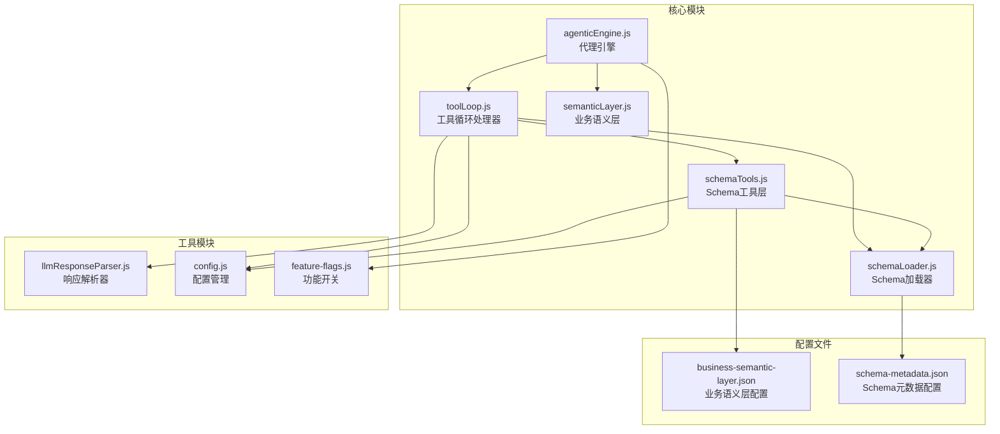
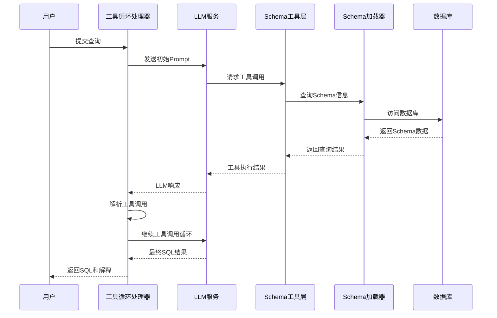
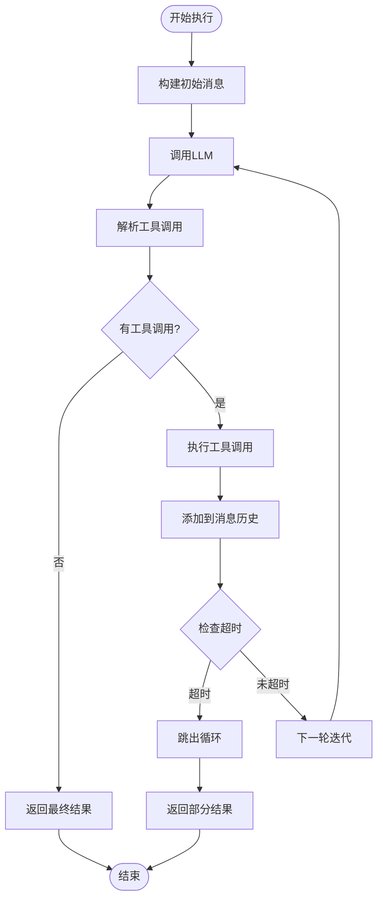
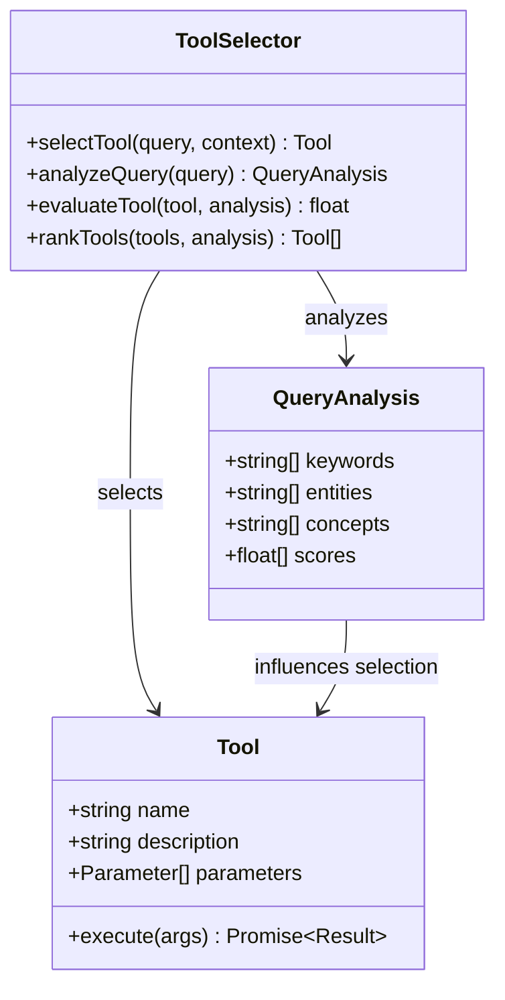
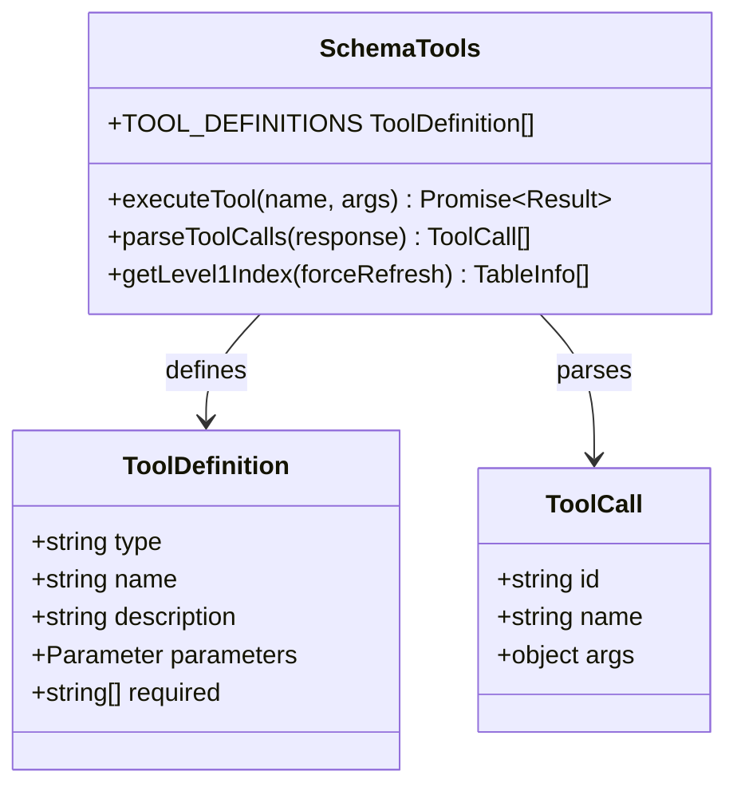
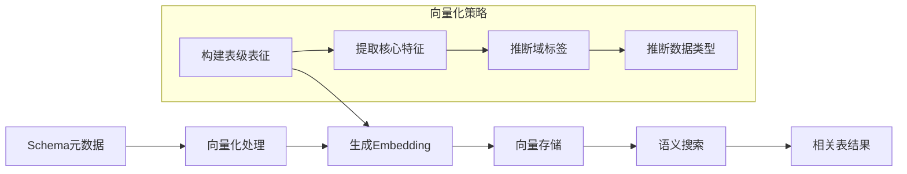
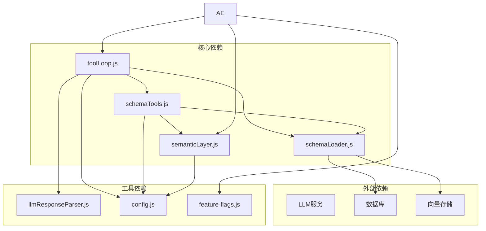
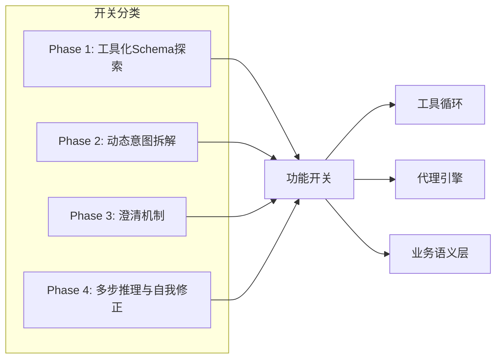

# 工具循环系统

<cite>
**本文档引用的文件**
- [toolLoop.js](file://backend/src/core/toolLoop.js)
- [schemaTools.js](file://backend/src/core/schemaTools.js)
- [schemaLoader.js](file://backend/src/core/schemaLoader.js)
- [semanticLayer.js](file://backend/src/core/semanticLayer.js)
- [agenticEngine.js](file://backend/src/core/agenticEngine.js)
- [llmResponseParser.js](file://backend/src/utils/llmResponseParser.js)
- [config.js](file://backend/src/core/config.js)
- [feature-flags.js](file://backend/config/feature-flags.js)
- [business-semantic-layer.json](file://backend/config/business-semantic-layer.json)
- [schema-metadata.json](file://backend/config/schema-metadata.json)
</cite>

## 目录
1. [简介](#简介)
2. [项目结构](#项目结构)
3. [核心组件](#核心组件)
4. [架构概览](#架构概览)
5. [详细组件分析](#详细组件分析)
6. [依赖关系分析](#依赖关系分析)
7. [性能考量](#性能考量)
8. [故障排查指南](#故障排查指南)
9. [结论](#结论)
10. [附录](#附录)

## 简介
工具循环系统是NL2SQL项目中实现"工具增强Schema探索"的核心机制。它通过LLM的函数调用能力，实现按需索取的Schema探索模式，避免一次性传输大量Schema信息造成的Token浪费和理解困难。系统支持动态工具选择、多轮交互、错误恢复和性能优化，为自然语言到SQL的转换提供了强大的Schema探索能力。

## 项目结构
NL2SQL项目采用模块化设计，工具循环系统位于后端核心模块中，与Schema管理、LLM服务、功能开关等组件紧密协作。



**图表来源**
- [toolLoop.js:1-521](file://backend/src/core/toolLoop.js#L1-L521)
- [schemaTools.js:1-632](file://backend/src/core/schemaTools.js#L1-L632)
- [schemaLoader.js:1-800](file://backend/src/core/schemaLoader.js#L1-L800)

**章节来源**
- [toolLoop.js:1-521](file://backend/src/core/toolLoop.js#L1-L521)
- [schemaTools.js:1-632](file://backend/src/core/schemaTools.js#L1-L632)
- [schemaLoader.js:1-800](file://backend/src/core/schemaLoader.js#L1-L800)

## 核心组件
工具循环系统由多个相互协作的组件构成，每个组件都有明确的职责和边界。

### 工具循环处理器
工具循环处理器是整个系统的核心协调者，负责管理工具调用的生命周期和状态流转。

### Schema工具层
Schema工具层提供LLM可调用的Schema探索工具集合，包括表搜索、结构查询、业务概念映射等功能。

### Schema加载器
Schema加载器负责从配置文件加载和管理Schema元数据，提供向量化和智能搜索能力。

### 业务语义层
业务语义层将业务概念映射到具体的物理表和字段，处理"老平台"、"累计充值"等业务术语。

**章节来源**
- [toolLoop.js:41-185](file://backend/src/core/toolLoop.js#L41-L185)
- [schemaTools.js:36-124](file://backend/src/core/schemaTools.js#L36-L124)
- [schemaLoader.js:75-131](file://backend/src/core/schemaLoader.js#L75-L131)
- [semanticLayer.js:48-73](file://backend/src/core/semanticLayer.js#L48-L73)

## 架构概览
工具循环系统采用分层架构设计，实现了从用户查询到SQL生成的完整工作流。



**图表来源**
- [toolLoop.js:57-185](file://backend/src/core/toolLoop.js#L57-L185)
- [schemaTools.js:565-577](file://backend/src/core/schemaTools.js#L565-L577)
- [schemaLoader.js:571-653](file://backend/src/core/schemaLoader.js#L571-L653)

## 详细组件分析

### 工具循环处理器详解

#### 核心执行流程
工具循环处理器实现了标准的工具调用循环模式，包含初始化、工具调用、结果处理和循环控制四个主要阶段。



**图表来源**
- [toolLoop.js:80-185](file://backend/src/core/toolLoop.js#L80-L185)

#### 工具选择算法
系统实现了智能的工具选择机制，基于查询需求动态选择最适合的工具。



**图表来源**
- [toolLoop.js:232-293](file://backend/src/core/toolLoop.js#L232-L293)
- [schemaTools.js:40-124](file://backend/src/core/schemaTools.js#L40-L124)

#### 配置选项详解
系统提供了丰富的配置选项来控制工具循环的行为：

| 配置项 | 默认值 | 描述 |
|--------|--------|------|
| MAX_TOOL_ITERATIONS | 5 | 工具循环的最大迭代次数，防止无限循环 |
| TOOL_LOOP_TIMEOUT | 60000ms | 工具循环超时时间，毫秒单位 |
| useLevel1Index | true | 是否使用Level 1索引进行初步筛选 |
| history | [] | 对话历史记录，最多保留最近5轮 |

**章节来源**
- [toolLoop.js:26-35](file://backend/src/core/toolLoop.js#L26-L35)
- [toolLoop.js:57-62](file://backend/src/core/toolLoop.js#L57-L62)

### Schema工具层详解

#### 工具定义规范
Schema工具层定义了标准化的工具接口，确保LLM能够正确理解和调用各种Schema探索工具。



**图表来源**
- [schemaTools.js:40-124](file://backend/src/core/schemaTools.js#L40-L124)
- [schemaTools.js:585-602](file://backend/src/core/schemaTools.js#L585-L602)

#### 工具实现策略
系统实现了四种核心工具，每种工具都有明确的职责和参数约束：

1. **search_tables**: 基于关键词搜索相关表
2. **describe_table**: 获取指定表的详细字段信息  
3. **search_knowledge**: 查询业务概念的定义和映射
4. **peek_table**: 查看表的结构预览

**章节来源**
- [schemaTools.js:225-393](file://backend/src/core/schemaTools.js#L225-L393)

### Schema加载器详解

#### 向量化架构
Schema加载器采用了先进的向量化技术，将表级信息转换为高维向量，实现高效的语义搜索。



**图表来源**
- [schemaLoader.js:210-285](file://backend/src/core/schemaLoader.js#L210-L285)
- [schemaLoader.js:300-340](file://backend/src/core/schemaLoader.js#L300-L340)

#### 智能搜索算法
系统实现了多层次的搜索策略，结合关键词匹配和语义相似度计算：

1. **向量检索**: 使用Embedding进行语义相似度搜索
2. **关键词匹配**: 基于表名、描述和字段的关键词匹配
3. **上下文增强**: 根据查询上下文动态调整搜索策略

**章节来源**
- [schemaLoader.js:571-653](file://backend/src/core/schemaLoader.js#L571-L653)
- [schemaLoader.js:662-710](file://backend/src/core/schemaLoader.js#L662-L710)

### 业务语义层详解

#### 概念映射机制
业务语义层将抽象的业务概念映射到具体的物理表和字段，解决了"老平台"、"累计充值"等业务术语的理解问题。

```mermaid
graph TB
subgraph "业务概念"
Concept1[老平台]
Concept2[累计充值]
Concept3[注册用户]
end
subgraph "映射规则"
Rule1[datasource:new_tzpingtaiold]
Rule2[aggregation:SUM(real_amount)]
Rule3[table:tzpingtai_tz_sdk_log_pf_reg]
end
subgraph "物理表"
Table1[new_tzpingtaiold_tzpingtaiold_*]
Table2[tzpingtai_tz_sdk_log_pf_order]
Table3[tzpingtai_tz_sdk_log_pf_reg]
end
Concept1 --> Rule1
Concept2 --> Rule2
Concept3 --> Rule3
Rule1 --> Table1
Rule2 --> Table2
Rule3 --> Table3
```

**图表来源**
- [semanticLayer.js:48-73](file://backend/src/core/semanticLayer.js#L48-L73)
- [business-semantic-layer.json:5-121](file://backend/config/business-semantic-layer.json#L5-L121)

#### 匹配算法
系统实现了多层级的概念匹配算法，支持精确匹配、别名匹配和模糊匹配：

| 匹配类型 | 算法实现 | 置信度 |
|----------|----------|--------|
| 精确匹配 | 直接字符串比较 | 1.0 |
| 别名匹配 | 预定义别名列表 | 0.9 |
| 模糊匹配 | 关键词重叠计算 | 0.6 |

**章节来源**
- [semanticLayer.js:134-214](file://backend/src/core/semanticLayer.js#L134-L214)
- [business-semantic-layer.json:150-168](file://backend/config/business-semantic-layer.json#L150-L168)

## 依赖关系分析

### 模块依赖图
工具循环系统各组件之间存在清晰的依赖关系，形成了稳定的模块化架构。



**图表来源**
- [toolLoop.js:16-21](file://backend/src/core/toolLoop.js#L16-L21)
- [schemaTools.js:17-19](file://backend/src/core/schemaTools.js#L17-L19)
- [schemaLoader.js:24-26](file://backend/src/core/schemaLoader.js#L24-L26)

### 功能开关集成
系统通过功能开关实现了渐进式功能发布，支持灵活的功能控制。



**图表来源**
- [feature-flags.js:16-96](file://backend/config/feature-flags.js#L16-L96)
- [agenticEngine.js:29-45](file://backend/src/core/agenticEngine.js#L29-L45)

**章节来源**
- [feature-flags.js:108-170](file://backend/config/feature-flags.js#L108-L170)
- [agenticEngine.js:49-262](file://backend/src/core/agenticEngine.js#L49-L262)

## 性能考量

### Token优化策略
系统采用了多种策略来优化Token使用效率：

1. **Level 1索引缓存**: 初始阶段只提供表名和简要描述
2. **按需加载**: 仅在需要时加载详细的Schema信息
3. **对话历史压缩**: 限制历史消息数量，避免Token溢出

### 并发处理能力
系统支持多轮并发工具调用，通过异步处理机制提高响应速度：

- **工具调用并发**: 同一时间可执行多个独立的工具调用
- **LLM请求并发**: 支持多个LLM请求的并行处理
- **数据库查询并发**: 通过连接池管理数据库连接

### 内存管理优化
系统实现了智能的内存管理策略：

- **缓存策略**: Level 1索引和向量数据的智能缓存
- **垃圾回收**: 定期清理过期的缓存数据
- **内存监控**: 实时监控内存使用情况

## 故障排查指南

### 常见错误类型及解决方案

#### 工具调用失败
**错误表现**: 工具执行返回错误信息
**可能原因**:
- 表不存在或权限不足
- 参数格式不正确
- 数据库连接异常

**解决方案**:
1. 检查表名拼写和权限
2. 验证工具参数格式
3. 确认数据库连接状态

#### LLM响应解析失败
**错误表现**: 无法从LLM响应中提取JSON或SQL
**可能原因**:
- LLM输出格式不符合预期
- 响应包含特殊字符或编码问题

**解决方案**:
1. 检查响应解析器的容错机制
2. 验证LLM的输出格式
3. 实施重试机制

#### 超时问题
**错误表现**: 工具循环在规定时间内未完成
**可能原因**:
- 工具调用过于频繁
- 数据库查询耗时过长
- LLM响应延迟

**解决方案**:
1. 调整超时阈值
2. 优化工具调用策略
3. 实施分批处理机制

**章节来源**
- [toolLoop.js:176-184](file://backend/src/core/toolLoop.js#L176-L184)
- [llmResponseParser.js:24-59](file://backend/src/utils/llmResponseParser.js#L24-L59)

### 性能监控指标
系统提供了完善的性能监控机制：

| 监控指标 | 描述 | 阈值建议 |
|----------|------|----------|
| 工具调用成功率 | 成功执行的工具调用占总调用的比例 | >95% |
| 平均响应时间 | 单次工具调用的平均耗时 | <5000ms |
| 缓存命中率 | Level 1索引和向量数据的缓存命中比例 | >80% |
| Token使用效率 | 每次查询的平均Token消耗 | <10000 |

## 结论
工具循环系统通过创新的"按需索取"Schema探索模式，显著提升了NL2SQL系统的智能化水平和用户体验。系统不仅实现了高效准确的Schema探索，还提供了完善的错误处理、性能优化和扩展机制。

通过模块化设计和功能开关控制，系统具备了良好的可维护性和可扩展性，为后续的功能演进奠定了坚实基础。工具循环系统的核心价值在于：

1. **智能化探索**: 通过LLM的工具调用能力实现智能的Schema探索
2. **高效性能**: 采用缓存和按需加载策略优化性能
3. **稳定可靠**: 完善的错误处理和监控机制确保系统稳定性
4. **易于扩展**: 模块化设计支持新工具和新功能的快速集成

## 附录

### 配置参考
系统支持丰富的配置选项，可通过环境变量进行灵活配置：

**核心配置项**:
- `MAX_TOOL_ITERATIONS`: 工具循环最大迭代次数
- `TOOL_LOOP_TIMEOUT`: 工具循环超时时间
- `SCHEMA_CACHE_EXPIRE_TIME`: Schema缓存过期时间

**功能开关**:
- `FF_TOOL_AUGMENTED_SCHEMA`: 启用工具化Schema探索
- `FF_TOOL_LOOP_MODE`: 启用工具循环模式
- `FF_BUSINESS_SEMANTIC_LAYER`: 启用业务语义层

### 使用示例
工具循环系统支持多种使用场景：

1. **简单查询**: 直接返回SQL结果
2. **复杂查询**: 通过多轮工具调用获取完整Schema信息
3. **澄清查询**: 当信息不足时主动询问用户
4. **错误恢复**: 自动检测和修复常见错误

### 扩展指南
开发者可以通过以下方式扩展工具循环系统：

1. **添加新工具**: 在Schema工具层中定义新的工具函数
2. **自定义解析器**: 扩展LLM响应解析器以支持新的输出格式
3. **集成新数据源**: 扩展Schema加载器以支持新的数据源类型
4. **优化搜索算法**: 改进向量检索和关键词匹配算法