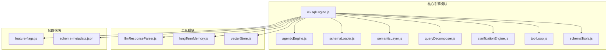
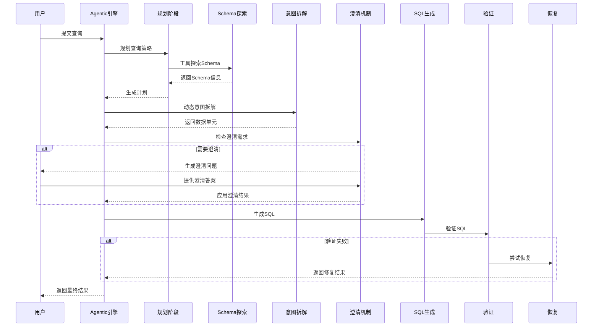
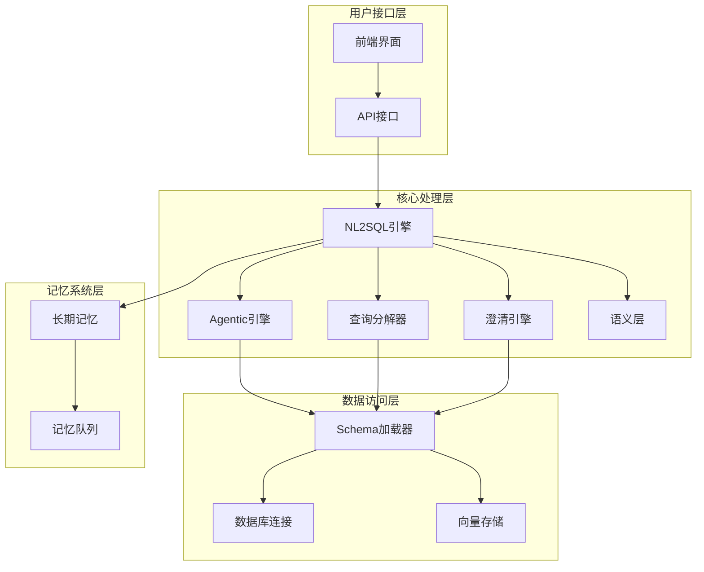
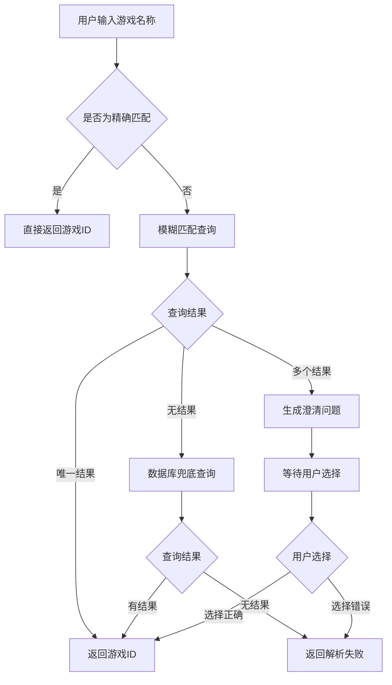
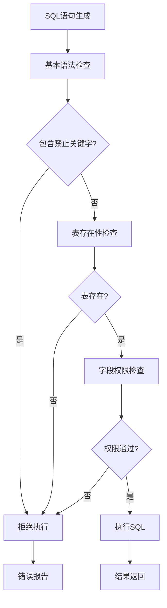
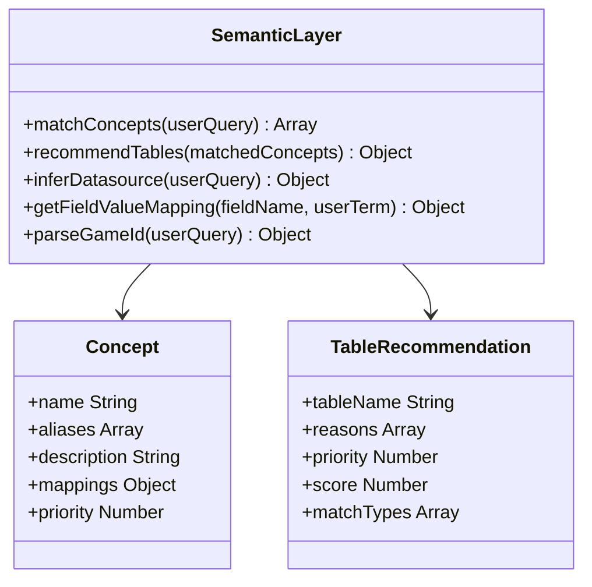
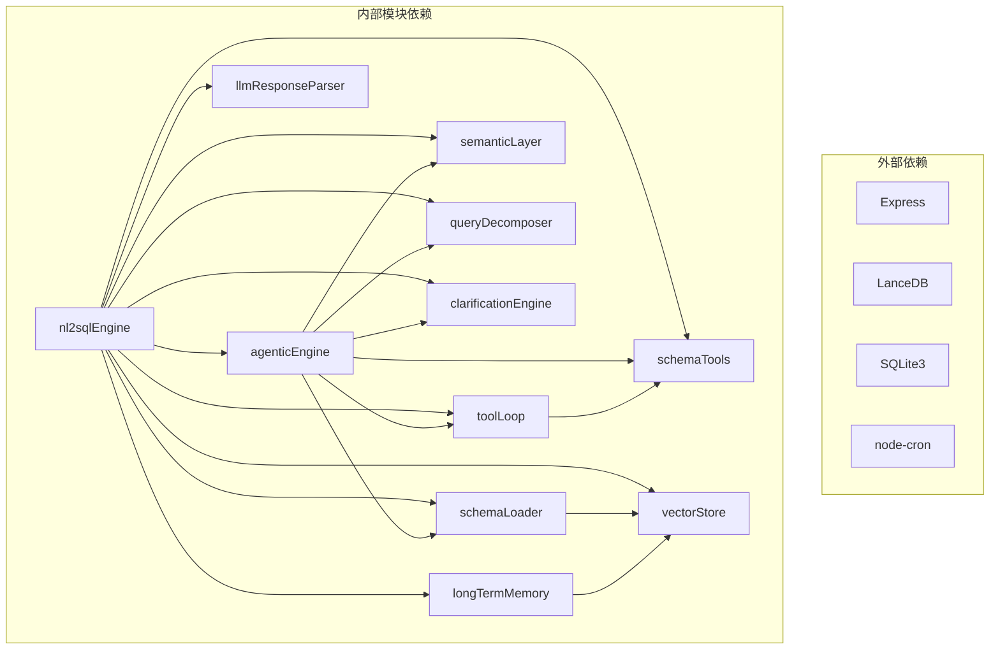

# NL2SQL核心引擎

<cite>
**本文档引用的文件**
- [nl2sqlEngine.js](file://backend/src/core/nl2sqlEngine.js)
- [agenticEngine.js](file://backend/src/core/agenticEngine.js)
- [schemaLoader.js](file://backend/src/core/schemaLoader.js)
- [semanticLayer.js](file://backend/src/core/semanticLayer.js)
- [queryDecomposer.js](file://backend/src/core/queryDecomposer.js)
- [clarificationEngine.js](file://backend/src/core/clarificationEngine.js)
- [toolLoop.js](file://backend/src/core/toolLoop.js)
- [schemaTools.js](file://backend/src/core/schemaTools.js)
- [feature-flags.js](file://backend/config/feature-flags.js)
- [schema-metadata.json](file://backend/config/schema-metadata.json)
- [llmResponseParser.js](file://backend/src/utils/llmResponseParser.js)
- [longTermMemory.js](file://backend/src/memory/longTermMemory.js)
- [vectorStore.js](file://backend/src/memory/vectorStore.js)
- [package.json](file://backend/package.json)
</cite>

## 目录
1. [简介](#简介)
2. [项目结构](#项目结构)
3. [核心组件](#核心组件)
4. [架构概览](#架构概览)
5. [详细组件分析](#详细组件分析)
6. [依赖关系分析](#依赖关系分析)
7. [性能考虑](#性能考虑)
8. [故障排除指南](#故障排除指南)
9. [结论](#结论)

## 简介

NL2SQL核心引擎是一个基于人工智能的自然语言到SQL转换系统，专为游戏数据分析场景设计。该引擎采用四阶段工作流设计，实现了从自然语言查询到可执行SQL语句的完整转换过程。

### 主要特性

- **四阶段工作流**：意图识别 → 动态拆解 → 澄清机制 → 多步推理与自我修正
- **智能实体解析**：支持游戏名称、渠道名称等业务实体的自动识别和映射
- **语义层支持**：内置业务语义层，可处理"老平台"、"新平台"等业务术语
- **向量检索**：基于LanceDB的语义搜索，提升表检索准确性
- **安全验证**：多层SQL安全检查和语法验证
- **自适应学习**：长期记忆系统，持续优化用户体验

## 项目结构

**图表来源**
- [nl2sqlEngine.js:1-800](file://backend/src/core/nl2sqlEngine.js#L1-L800)
- [agenticEngine.js:1-651](file://backend/src/core/agenticEngine.js#L1-L651)
- [schemaLoader.js:1-800](file://backend/src/core/schemaLoader.js#L1-L800)

**章节来源**
- [package.json:1-28](file://backend/package.json#L1-L28)

## 核心组件

### NL2SQL核心引擎

NL2SQL核心引擎是整个系统的大脑，负责协调各个模块的工作。它实现了完整的四阶段工作流，包括意图识别、实体解析、SQL生成和验证等核心功能。

#### 核心功能模块

1. **意图识别与澄清机制**
   - 智能识别用户查询意图
   - 处理信息不足的情况
   - 提供澄清问题引导

2. **实体解析系统**
   - 游戏名称解析（如"青木" → game_id=30）
   - 渠道名称解析
   - 平台术语解析（新平台/老平台）

3. **SQL生成与验证**
   - 基于Schema的SQL生成
   - 多层安全检查
   - 语法验证

4. **错误处理与恢复**
   - 结构化错误处理
   - 自动恢复机制
   - 重试策略

**章节来源**
- [nl2sqlEngine.js:1-800](file://backend/src/core/nl2sqlEngine.js#L1-L800)

### Agentic工作流引擎

Agentic工作流引擎实现了第四阶段的多步推理与自我修正功能，采用Plan → Act → Observe循环模式。

#### 四阶段工作流

**图表来源**
- [agenticEngine.js:68-178](file://backend/src/core/agenticEngine.js#L68-L178)

**章节来源**
- [agenticEngine.js:1-651](file://backend/src/core/agenticEngine.js#L1-L651)

### Schema元数据管理系统

Schema元数据管理系统负责加载、管理和查询数据库表结构信息，支持多种检索方式。

#### 核心功能

1. **Schema加载**
   - 从JSON配置文件加载表结构
   - 验证Schema数据格式
   - 构建快速查找映射

2. **智能检索**
   - 向量语义搜索
   - 关键词匹配
   - 表级表征构建

3. **SQL验证**
   - 安全性检查
   - 表存在性验证
   - 字段验证

**章节来源**
- [schemaLoader.js:1-800](file://backend/src/core/schemaLoader.js#L1-L800)

## 架构概览

NL2SQL核心引擎采用模块化架构设计，各组件职责清晰，耦合度低，易于扩展和维护。

**图表来源**
- [nl2sqlEngine.js:1-800](file://backend/src/core/nl2sqlEngine.js#L1-L800)
- [agenticEngine.js:1-651](file://backend/src/core/agenticEngine.js#L1-L651)

## 详细组件分析

### 实体解析机制

实体解析是NL2SQL引擎的核心功能之一，负责将自然语言中的业务实体转换为数据库中的具体值。

#### 游戏名称解析流程

**图表来源**
- [nl2sqlEngine.js:311-629](file://backend/src/core/nl2sqlEngine.js#L311-L629)

#### 实体解析算法

引擎实现了多层次的实体解析策略：

1. **LLM优先解析**：首先依赖LLM在意图识别阶段的解析结果
2. **长期记忆学习**：利用长期记忆系统中的用户偏好和映射关系
3. **数据库兜底查询**：当其他方法失败时，通过数据库模糊查询进行解析

**章节来源**
- [nl2sqlEngine.js:444-629](file://backend/src/core/nl2sqlEngine.js#L444-L629)

### SQL验证与安全检查

SQL验证机制确保生成的SQL语句既符合语法规范，又满足安全要求。

#### 安全检查流程

**图表来源**
- [schemaLoader.js:723-759](file://backend/src/core/schemaLoader.js#L723-L759)

#### 验证规则

1. **关键字过滤**：禁止DROP、DELETE、UPDATE、INSERT、ALTER、TRUNCATE等危险操作
2. **表权限控制**：仅允许访问白名单中的表
3. **字段验证**：确保引用的字段存在于目标表中
4. **语法完整性**：检查SELECT、FROM等关键字的完整性

**章节来源**
- [schemaLoader.js:712-759](file://backend/src/core/schemaLoader.js#L712-L759)

### 澄清机制

澄清机制用于处理查询理解不充分或存在歧义的情况，通过交互式问答获取更多信息。

#### 澄清触发条件

引擎内置了多种澄清触发条件：

1. **关键数据单元无匹配表**：查询中的某些数据需求无法匹配到具体表
2. **表选择歧义**：同一类型的数据存在多个可能的表来源
3. **聚合指标来源不明确**：实时数据与汇总数据的选择
4. **时间粒度不明确**：按天、周、月等统计粒度的选择
5. **置信度过低**：整体理解置信度不足

**章节来源**
- [clarificationEngine.js:26-182](file://backend/src/core/clarificationEngine.js#L26-L182)

### 语义层系统

语义层系统为业务术语提供统一的语义映射，解决"老平台"、"累计充值"等业务概念的识别问题。

#### 业务概念映射

**图表来源**
- [semanticLayer.js:1-532](file://backend/src/core/semanticLayer.js#L1-L532)

**章节来源**
- [semanticLayer.js:1-532](file://backend/src/core/semanticLayer.js#L1-L532)

## 依赖关系分析

NL2SQL核心引擎的依赖关系体现了清晰的分层架构设计。

**图表来源**
- [package.json:10-27](file://backend/package.json#L10-L27)

### 关键依赖关系

1. **核心引擎依赖**：nl2sqlEngine是所有功能的协调者，依赖其他所有模块
2. **工具链依赖**：Agentic引擎依赖工具循环系统进行Schema探索
3. **数据访问依赖**：所有模块都依赖数据库连接进行数据操作
4. **向量存储依赖**：Schema加载器和语义层依赖向量存储进行语义检索

**章节来源**
- [package.json:10-27](file://backend/package.json#L10-L27)

## 性能考虑

NL2SQL核心引擎在设计时充分考虑了性能优化，采用了多种策略来提升系统响应速度和吞吐量。

### 缓存策略

1. **Schema缓存**：Schema元数据和表映射信息缓存，减少重复加载
2. **向量缓存**：向量搜索结果缓存，避免重复计算
3. **查询历史缓存**：相似查询的历史结果缓存

### 异步处理

1. **长期记忆异步存储**：用户偏好学习采用队列异步处理
2. **向量批量处理**：Schema向量批量插入和更新
3. **工具循环异步执行**：LLM工具调用采用异步模式

### 资源管理

1. **连接池管理**：数据库连接池优化连接复用
2. **内存管理**：及时释放不再使用的缓存和中间结果
3. **定时任务**：使用node-cron进行定时维护任务

## 故障排除指南

### 常见问题及解决方案

#### 1. 实体解析失败

**问题现象**：游戏名称无法解析为具体ID

**可能原因**：
- 数据库连接不可用
- 游戏名称不在数据库中
- 长期记忆中没有相关映射

**解决方案**：
- 检查数据库连接状态
- 验证游戏名称是否正确
- 检查长期记忆中的映射关系

#### 2. SQL生成错误

**问题现象**：生成的SQL语法错误或逻辑错误

**可能原因**：
- Schema信息不完整
- LLM响应解析失败
- 查询意图理解错误

**解决方案**：
- 验证Schema配置文件
- 检查LLM响应格式
- 重新训练模型或调整提示词

#### 3. 向量检索失败

**问题现象**：语义搜索功能不可用

**可能原因**：
- LanceDB初始化失败
- 向量数据未正确加载
- 环境变量配置错误

**解决方案**：
- 检查LanceDB安装和配置
- 验证向量数据加载状态
- 检查环境变量设置

**章节来源**
- [nl2sqlEngine.js:227-297](file://backend/src/core/nl2sqlEngine.js#L227-L297)

### 调试技巧

1. **启用详细日志**：通过配置文件调整日志级别
2. **监控系统状态**：使用内置的健康检查功能
3. **性能分析**：监控查询执行时间和资源使用情况

## 结论

NL2SQL核心引擎是一个功能完整、架构清晰的自然语言到SQL转换系统。通过四阶段工作流设计，系统能够处理复杂的业务查询，提供准确的SQL生成结果。

### 主要优势

1. **智能化程度高**：结合LLM和传统规则引擎，实现智能查询理解
2. **可扩展性强**：模块化设计支持功能扩展和定制
3. **安全性保障**：多层安全检查确保SQL执行安全
4. **用户体验优秀**：智能澄清机制减少用户交互成本

### 技术特色

1. **语义层支持**：内置业务语义理解能力
2. **向量检索**：基于语义的表和字段检索
3. **长期记忆**：持续学习用户偏好和查询模式
4. **自我修复**：自动错误检测和恢复机制

该系统为游戏数据分析场景提供了强大的自然语言查询能力，能够显著提升数据分析效率和用户体验。