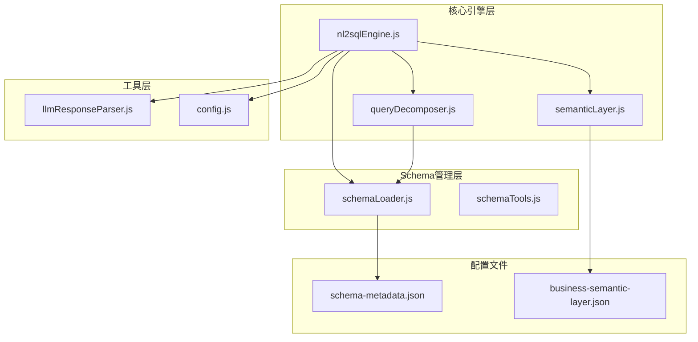
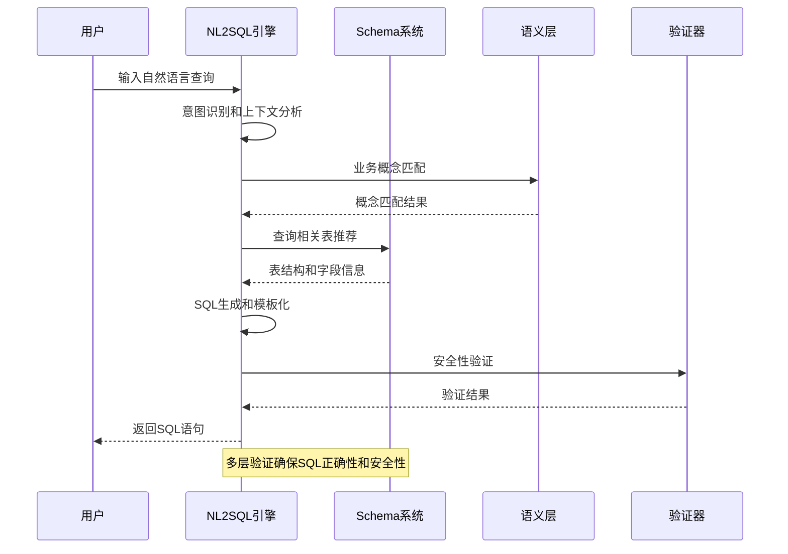
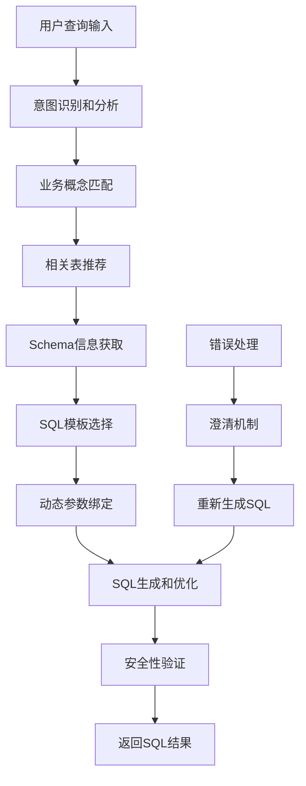
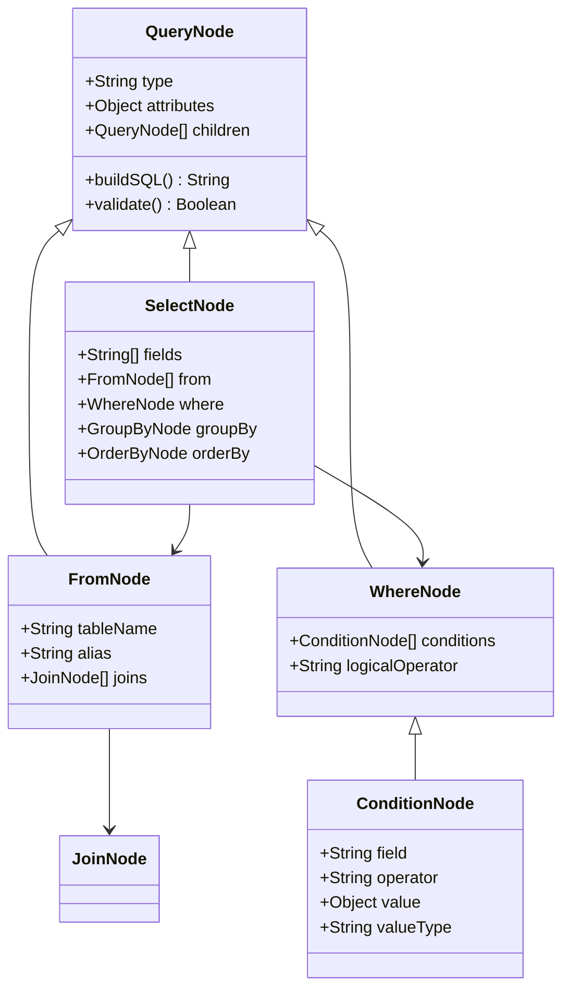
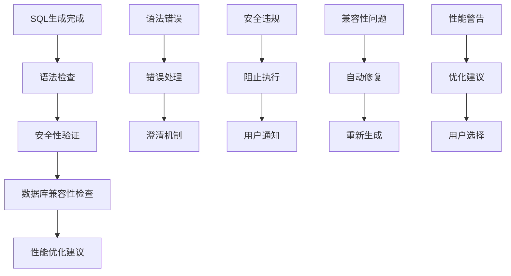
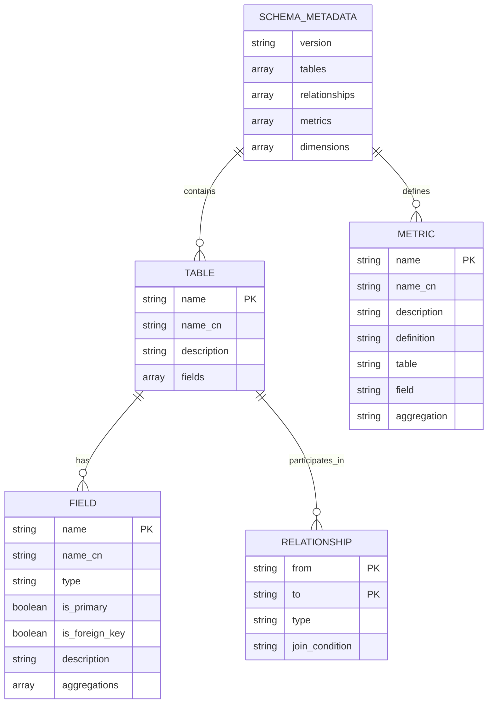
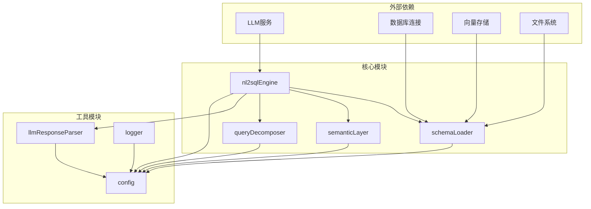

# SQL生成与验证

<cite>
**本文档引用的文件**
- [nl2sqlEngine.js](file://backend/src/core/nl2sqlEngine.js)
- [schemaLoader.js](file://backend/src/core/schemaLoader.js)
- [schemaTools.js](file://backend/src/core/schemaTools.js)
- [queryDecomposer.js](file://backend/src/core/queryDecomposer.js)
- [semanticLayer.js](file://backend/src/core/semanticLayer.js)
- [llmResponseParser.js](file://backend/src/utils/llmResponseParser.js)
- [config.js](file://backend/src/core/config.js)
- [schema-metadata.json](file://backend/config/schema-metadata.json)
- [business-semantic-layer.json](file://backend/config/business-semantic-layer.json)
</cite>

## 目录
1. [简介](#简介)
2. [项目结构](#项目结构)
3. [核心组件](#核心组件)
4. [架构概览](#架构概览)
5. [详细组件分析](#详细组件分析)
6. [依赖关系分析](#依赖关系分析)
7. [性能考虑](#性能考虑)
8. [故障排除指南](#故障排除指南)
9. [结论](#结论)

## 简介

NL2SQL引擎是一个智能化的自然语言到SQL转换系统，旨在将用户的自然语言查询无缝转换为标准SQL语句。该系统通过深度集成的Schema系统、语义层处理和严格的验证机制，确保生成的SQL既准确又安全。

系统的核心功能包括：
- **意图识别**：理解用户查询的深层含义和业务需求
- **SQL生成**：基于Schema元数据和业务语义生成标准SQL
- **安全验证**：多层次的安全检查和合规性验证
- **模板化设计**：结合预定义模板和动态拼接提高生成效率
- **Schema集成**：深度集成数据库元数据确保SQL正确性

## 项目结构

NL2SQL引擎采用模块化架构设计，各组件职责清晰、耦合度低：

**图表来源**
- [nl2sqlEngine.js:1-50](file://backend/src/core/nl2sqlEngine.js#L1-50)
- [schemaLoader.js:1-50](file://backend/src/core/schemaLoader.js#L1-50)
- [schemaTools.js:1-50](file://backend/src/core/schemaTools.js#L1-50)

**章节来源**
- [nl2sqlEngine.js:1-100](file://backend/src/core/nl2sqlEngine.js#L1-100)
- [schemaLoader.js:1-100](file://backend/src/core/schemaLoader.js#L1-100)
- [schemaTools.js:1-100](file://backend/src/core/schemaTools.js#L1-100)

## 核心组件

### NL2SQL核心引擎

NL2SQL核心引擎是整个系统的大脑，负责协调各个组件的工作流程。它实现了完整的NL2SQL处理管道，包括意图识别、SQL生成、验证和执行。

**关键特性**：
- **多阶段处理**：从意图识别到最终SQL生成的完整流程
- **上下文管理**：智能处理对话历史和用户偏好
- **错误处理**：完善的异常捕获和恢复机制
- **性能优化**：多种优化策略减少Token消耗和处理时间

### Schema管理系统

Schema管理系统负责管理和维护数据库元数据，提供强大的查询和匹配能力。

**核心功能**：
- **元数据加载**：从JSON配置文件加载表结构定义
- **向量化存储**：将Schema信息向量化以便语义检索
- **动态匹配**：基于查询内容智能推荐相关表
- **安全验证**：检查SQL语句的表和字段合法性

### 语义层处理

语义层处理模块专门负责业务概念的理解和映射，解决了诸如"老平台"、"累计充值"等业务术语的识别问题。

**主要能力**：
- **概念匹配**：识别查询中的业务概念和别名
- **表推荐**：基于业务概念推荐最相关的数据表
- **数据源映射**：处理跨数据库的查询需求
- **字段值映射**：将用户术语映射到具体字段值

**章节来源**
- [nl2sqlEngine.js:1556-1951](file://backend/src/core/nl2sqlEngine.js#L1556-1951)
- [schemaLoader.js:1-200](file://backend/src/core/schemaLoader.js#L1-200)
- [semanticLayer.js:1-100](file://backend/src/core/semanticLayer.js#L1-100)

## 架构概览

NL2SQL引擎采用分层架构设计，确保各层职责明确、松耦合：

**图表来源**
- [nl2sqlEngine.js:2128-2399](file://backend/src/core/nl2sqlEngine.js#L2128-2399)
- [semanticLayer.js:128-167](file://backend/src/core/semanticLayer.js#L128-167)
- [schemaLoader.js:560-653](file://backend/src/core/schemaLoader.js#L560-653)

系统架构的关键优势：
- **模块化设计**：各组件可独立开发和测试
- **可扩展性**：支持新的业务概念和表结构
- **安全性**：多层验证确保SQL安全执行
- **性能优化**：智能缓存和向量化技术

## 详细组件分析

### SQL生成流程

SQL生成是NL2SQL引擎的核心功能，通过以下步骤实现：

**图表来源**
- [nl2sqlEngine.js:1558-1951](file://backend/src/core/nl2sqlEngine.js#L1558-1951)

#### 模板化设计

系统采用模板化设计，结合预定义模板和动态拼接：

**预定义模板**：
- 基础查询模板：`SELECT 字段 FROM 表 WHERE 条件`
- 聚合查询模板：`SELECT 聚合函数(字段) FROM 表 GROUP BY 分组`
- 多表关联模板：`SELECT 字段 FROM 表1 JOIN 表2 ON 条件`

**动态拼接机制**：
- 字段映射：根据业务术语自动映射到具体字段
- 条件构建：动态构建WHERE子句和JOIN条件
- 参数绑定：安全地绑定用户输入参数

#### AST构建和查询树生成

系统实现了抽象语法树(AST)构建和查询树生成：

**图表来源**
- [nl2sqlEngine.js:1778-1917](file://backend/src/core/nl2sqlEngine.js#L1778-1917)

### SQL验证机制

系统实现了多层次的SQL验证机制：

**图表来源**
- [nl2sqlEngine.js:1953-1997](file://backend/src/core/nl2sqlEngine.js#L1953-1997)

#### 安全性验证

**关键字过滤**：
- 禁止DML操作：UPDATE、DELETE、INSERT等
- 禁止DDL操作：DROP、ALTER、CREATE等
- 禁止危险操作：EXEC、TRUNCATE、GRANT等

**表权限验证**：
- 白名单机制：只允许访问配置的表
- 动态权限检查：基于用户角色和数据源
- 字段级权限：细粒度的字段访问控制

**参数安全**：
- 预编译语句：防止SQL注入攻击
- 参数类型验证：确保参数类型正确
- 输入长度限制：防止缓冲区溢出

#### 数据库兼容性检查

**MySQL兼容性**：
- 标准SQL语法支持
- 函数和操作符兼容性
- 数据类型映射验证

**性能优化**：
- 查询计划分析
- 索引使用建议
- 执行成本估算

**章节来源**
- [nl2sqlEngine.js:1953-1997](file://backend/src/core/nl2sqlEngine.js#L1953-1997)
- [schemaLoader.js:712-760](file://backend/src/core/schemaLoader.js#L712-760)

### Schema系统深度集成

NL2SQL引擎与Schema系统的集成是确保SQL正确性的关键：

**图表来源**
- [schema-metadata.json:1-100](file://backend/config/schema-metadata.json#L1-100)

#### 字段映射和类型推断

系统实现了智能的字段映射和类型推断：

**字段映射**：
- 业务术语到字段名的映射
- 用户别名到标准字段的转换
- 数据源标识符的自动识别

**类型推断**：
- 基于上下文的类型判断
- 字段使用模式分析
- 数据类型一致性验证

#### 查询优化策略

**表选择优化**：
- 基于查询内容的表推荐
- 相关性评分和排序
- 性能影响评估

**查询重写**：
- 等价查询变换
- 索引友好的查询形式
- 减少数据扫描范围

**章节来源**
- [schemaLoader.js:1-200](file://backend/src/core/schemaLoader.js#L1-200)
- [schemaTools.js:1-200](file://backend/src/core/schemaTools.js#L1-200)

## 依赖关系分析

NL2SQL引擎的依赖关系体现了清晰的分层架构：

**图表来源**
- [nl2sqlEngine.js:15-35](file://backend/src/core/nl2sqlEngine.js#L15-35)
- [schemaLoader.js:15-27](file://backend/src/core/schemaLoader.js#L15-27)

**章节来源**
- [nl2sqlEngine.js:15-58](file://backend/src/core/nl2sqlEngine.js#L15-58)
- [schemaLoader.js:15-27](file://backend/src/core/schemaLoader.js#L15-27)

## 性能考虑

NL2SQL引擎在设计时充分考虑了性能优化：

### Token预算管理

系统实现了智能的Token预算管理，避免LLM调用过载：

**预算策略**：
- 上下文长度限制：128k Token
- 输出预留：8k Token
- 预警阈值：80%
- 压缩阈值：90%

**压缩机制**：
- 对话历史智能压缩
- 重复内容去重
- 关键信息保留

### 缓存策略

**多级缓存**：
- Schema元数据缓存
- 向量存储缓存
- 查询结果缓存
- 配置信息缓存

**缓存失效**：
- 时间戳驱动
- 版本号检查
- 手动刷新机制

### 异步处理

**并发控制**：
- 请求队列管理
- 资源池分配
- 超时处理机制

**异步优化**：
- 预加载机制
- 批处理优化
- 连接复用

## 故障排除指南

### 常见问题及解决方案

**SQL生成失败**：
1. 检查意图识别结果
2. 验证Schema配置
3. 确认用户输入完整性
4. 查看澄清问题

**性能问题**：
1. 检查Token预算使用情况
2. 优化查询复杂度
3. 实施缓存策略
4. 调整并发参数

**安全验证失败**：
1. 检查配置文件设置
2. 验证表权限配置
3. 审核用户输入
4. 查看日志信息

### 调试工具

**日志分析**：
- 详细日志记录
- 性能指标监控
- 错误追踪机制

**监控指标**：
- 查询成功率
- 响应时间分布
- 资源使用情况
- 错误率统计

**章节来源**
- [nl2sqlEngine.js:223-297](file://backend/src/core/nl2sqlEngine.js#L223-297)
- [config.js:366-397](file://backend/src/core/config.js#L366-397)

## 结论

NL2SQL引擎通过精心设计的架构和实现，成功地将自然语言转换为准确、安全、高效的SQL语句。系统的主要优势包括：

**技术创新**：
- 深度集成的Schema系统确保SQL正确性
- 智能的语义层处理提升用户体验
- 多层次的安全验证保障系统安全
- 模板化设计提高生成效率

**架构优势**：
- 清晰的分层设计便于维护和扩展
- 模块化组件支持独立开发和测试
- 性能优化策略确保系统高效运行
- 完善的错误处理机制提升系统稳定性

**应用场景**：
- 业务分析师自助查询
- 数据平台API集成
- 报表系统自动化
- 数据挖掘和分析

未来发展方向：
- 更智能的业务概念理解
- 更丰富的查询模式支持
- 更强大的性能优化能力
- 更完善的监控和运维工具

NL2SQL引擎为构建现代化的数据查询系统提供了坚实的技术基础，能够有效提升用户的数据分析体验和工作效率。