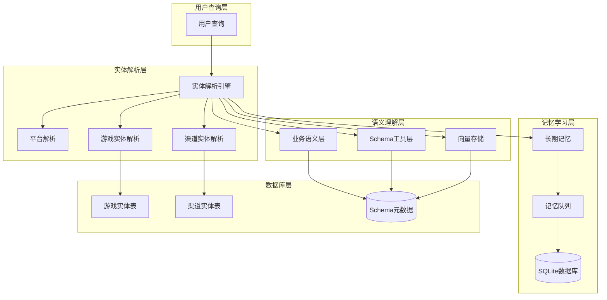
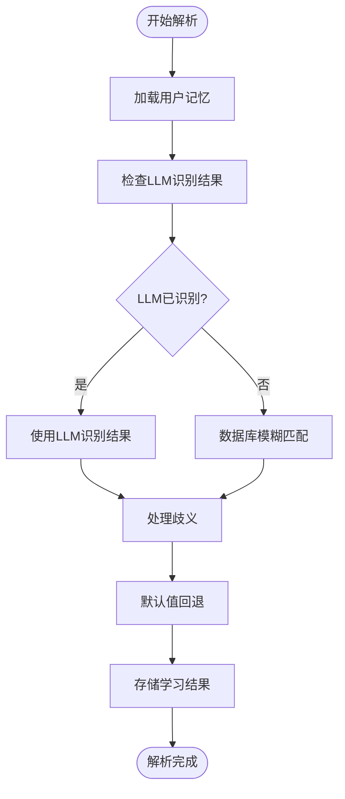
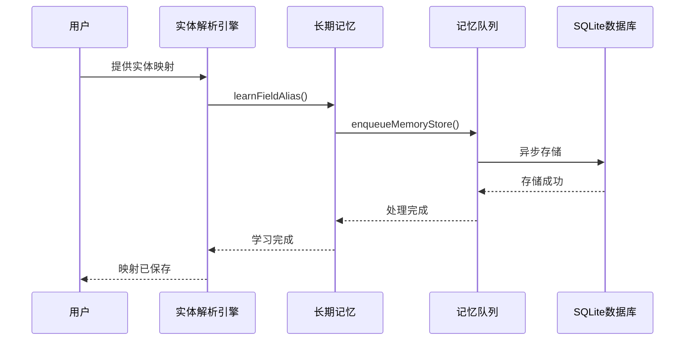
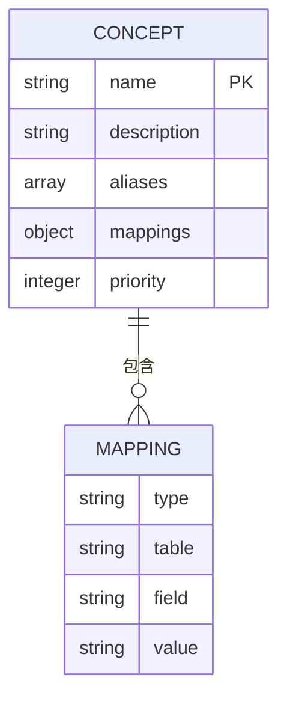
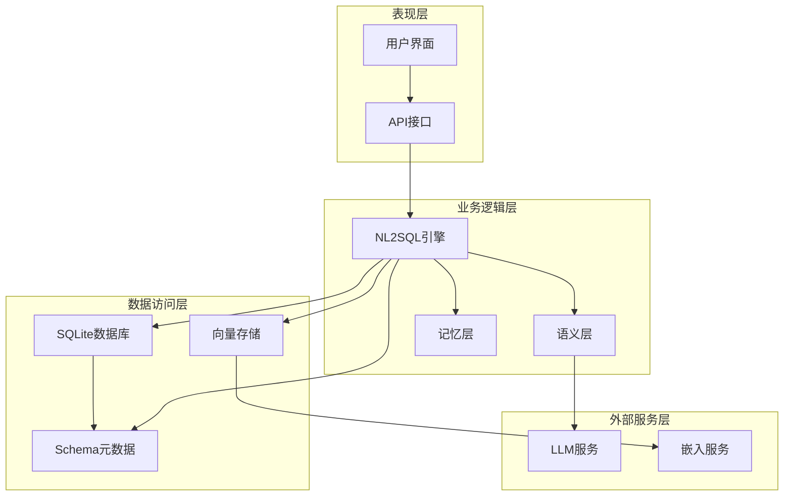
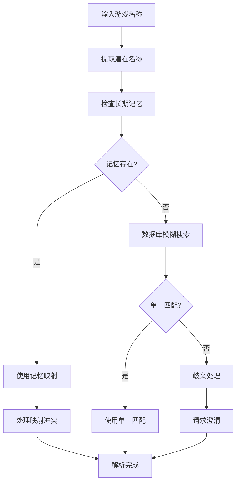
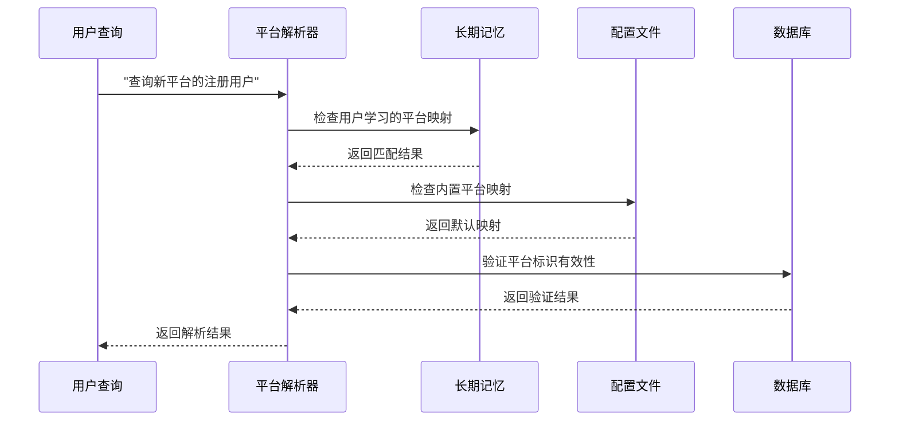
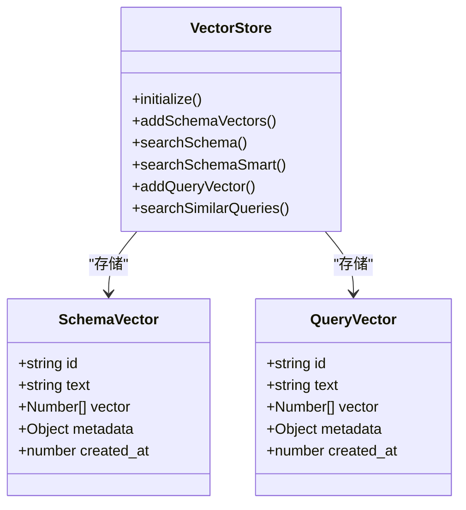
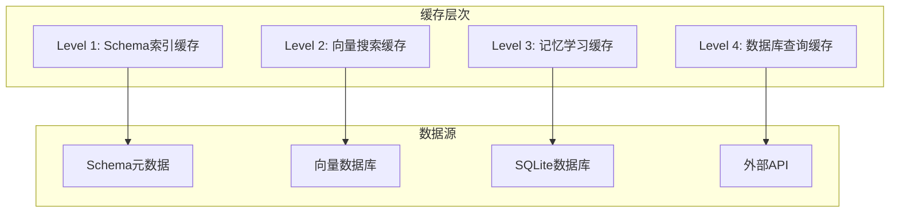
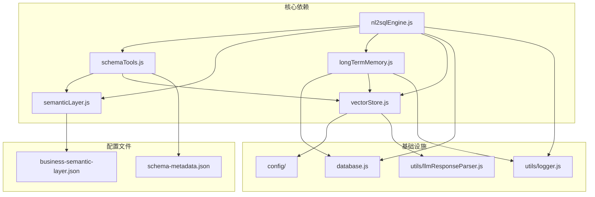

# 实体解析与映射

<cite>
**本文档引用的文件**
- [schemaTools.js](file://backend/src/core/schemaTools.js)
- [longTermMemory.js](file://backend/src/memory/longTermMemory.js)
- [semanticLayer.js](file://backend/src/core/semanticLayer.js)
- [nl2sqlEngine.js](file://backend/src/core/nl2sqlEngine.js)
- [vectorStore.js](file://backend/src/memory/vectorStore.js)
- [schemaLoader.js](file://backend/src/core/schemaLoader.js)
- [business-semantic-layer.json](file://backend/config/business-semantic-layer.json)
- [schema-metadata.json](file://backend/config/schema-metadata.json)
- [memoryQueue.js](file://backend/src/memory/memoryQueue.js)
- [llmResponseParser.js](file://backend/src/utils/llmResponseParser.js)
- [database.js](file://backend/src/core/database.js)
</cite>

## 目录
1. [简介](#简介)
2. [项目结构](#项目结构)
3. [核心组件](#核心组件)
4. [架构概览](#架构概览)
5. [详细组件分析](#详细组件分析)
6. [依赖关系分析](#依赖关系分析)
7. [性能考量](#性能考量)
8. [故障排除指南](#故障排除指南)
9. [结论](#结论)

## 简介

NL2SQL引擎的实体解析与映射功能是系统的核心能力之一，负责将用户查询中的自然语言实体准确识别并映射到数据库中的具体表和字段。该功能支持多种业务实体的识别，包括游戏名称、渠道名称、平台标识等关键实体，并通过多层次的解析策略确保高精度的实体映射。

系统采用"长期记忆学习 + 数据库模糊匹配 + 歧义消解 + 默认值推断"的综合策略，结合向量检索和业务语义层，实现了智能化的实体解析体验。通过用户交互学习机制，系统能够持续改进解析准确性，适应不同用户的表达习惯。

## 项目结构

NL2SQL引擎的实体解析功能分布在多个核心模块中，形成了完整的解析链路：

**图表来源**
- [nl2sqlEngine.js:300-630](file://backend/src/core/nl2sqlEngine.js#L300-L630)
- [longTermMemory.js:1-800](file://backend/src/memory/longTermMemory.js#L1-L800)
- [semanticLayer.js:1-532](file://backend/src/core/semanticLayer.js#L1-L532)

**章节来源**
- [nl2sqlEngine.js:1-800](file://backend/src/core/nl2sqlEngine.js#L1-L800)
- [schemaTools.js:1-632](file://backend/src/core/schemaTools.js#L1-L632)

## 核心组件

### 实体解析引擎

实体解析引擎是系统的核心组件，负责协调各种解析策略和机制。它实现了多层级的实体识别和映射功能：

#### 主要功能特性
- **多实体类型支持**：游戏名称、渠道名称、平台标识、日期范围等
- **多层次解析策略**：长期记忆优先、数据库模糊匹配、业务语义解析
- **歧义消解机制**：自动识别和处理实体歧义情况
- **默认值推断**：在信息不足时提供合理的默认值
- **性能优化**：批量查询、缓存策略、向量化匹配

#### 解析流程

**图表来源**
- [nl2sqlEngine.js:450-630](file://backend/src/core/nl2sqlEngine.js#L450-L630)

**章节来源**
- [nl2sqlEngine.js:300-630](file://backend/src/core/nl2sqlEngine.js#L300-L630)

### 长期记忆系统

长期记忆系统负责存储和管理用户的个性化偏好和学习成果，是实现智能实体解析的关键基础设施。

#### 记忆类型
- **字段别名学习**：用户自定义的字段映射关系
- **查询模式偏好**：常用的查询习惯和模式
- **指标偏好**：常用的业务指标选择
- **维度偏好**：常用的分析维度组合

#### 学习机制

**图表来源**
- [longTermMemory.js:470-582](file://backend/src/memory/longTermMemory.js#L470-L582)
- [memoryQueue.js:46-118](file://backend/src/memory/memoryQueue.js#L46-L118)

**章节来源**
- [longTermMemory.js:1-800](file://backend/src/memory/longTermMemory.js#L1-L800)
- [memoryQueue.js:1-217](file://backend/src/memory/memoryQueue.js#L1-L217)

### 业务语义层

业务语义层提供了结构化的业务概念映射，是实现语义理解的重要组件。

#### 核心概念
- **业务概念识别**：识别用户查询中的业务术语
- **概念映射**：将业务概念映射到具体的表和字段
- **别名支持**：支持业务术语的多种表达方式
- **优先级管理**：为不同概念设置解析优先级

#### 配置结构

**图表来源**
- [business-semantic-layer.json:5-121](file://backend/config/business-semantic-layer.json#L5-L121)

**章节来源**
- [semanticLayer.js:1-532](file://backend/src/core/semanticLayer.js#L1-L532)
- [business-semantic-layer.json:1-189](file://backend/config/business-semantic-layer.json#L1-L189)

### Schema工具层

Schema工具层提供了与数据库Schema交互的能力，支持表搜索、字段描述、业务知识查询等功能。

#### 核心功能
- **表搜索**：根据关键词搜索相关表
- **字段描述**：获取表的详细字段信息
- **业务知识查询**：查询业务概念的定义和映射
- **表样例预览**：查看表的结构信息

**章节来源**
- [schemaTools.js:1-632](file://backend/src/core/schemaTools.js#L1-L632)

## 架构概览

NL2SQL引擎的实体解析架构采用了分层设计，每层都有明确的职责和边界：

**图表来源**
- [nl2sqlEngine.js:1-800](file://backend/src/core/nl2sqlEngine.js#L1-L800)
- [vectorStore.js:1-800](file://backend/src/memory/vectorStore.js#L1-L800)

## 详细组件分析

### 实体解析算法详解

#### 游戏实体解析算法
游戏实体解析是系统中最复杂的实体解析场景之一，需要处理多种游戏名称形式和映射关系。

**图表来源**
- [nl2sqlEngine.js:518-629](file://backend/src/core/nl2sqlEngine.js#L518-L629)

##### 关键算法实现

**模糊匹配算法**：
系统实现了高效的模糊匹配算法，支持多种匹配策略：

1. **精确匹配**：完全相同的字符串匹配
2. **前缀匹配**：匹配字符串开头部分
3. **包含匹配**：匹配字符串包含关系
4. **相似度匹配**：基于编辑距离的相似度计算

**歧义消解策略**：
当出现多个候选匹配时，系统采用以下策略进行消解：

- **上下文消解**：利用查询上下文信息进行消解
- **历史消解**：参考用户历史查询模式
- **默认消解**：使用预定义的默认规则
- **交互消解**：主动向用户请求澄清

**章节来源**
- [nl2sqlEngine.js:518-629](file://backend/src/core/nl2sqlEngine.js#L518-L629)

#### 平台实体解析算法
平台实体解析主要处理"新平台"、"老平台"等平台标识的识别和映射。

**图表来源**
- [nl2sqlEngine.js:678-750](file://backend/src/core/nl2sqlEngine.js#L678-L750)

**章节来源**
- [nl2sqlEngine.js:678-750](file://backend/src/core/nl2sqlEngine.js#L678-L750)

### 向量检索优化

系统采用了先进的向量检索技术来优化实体解析性能：

#### 向量存储架构

**图表来源**
- [vectorStore.js:1-800](file://backend/src/memory/vectorStore.js#L1-L800)

**章节来源**
- [vectorStore.js:1-800](file://backend/src/memory/vectorStore.js#L1-L800)

#### 智能搜索算法
系统实现了智能的向量搜索算法，能够根据查询内容自动识别业务意图并应用相应的过滤策略：

1. **游戏提及检测**：自动识别查询中提到的具体游戏
2. **优先级重排序**：根据业务意图调整搜索结果优先级
3. **动态过滤**：根据查询内容应用实时过滤条件
4. **多策略融合**：结合向量距离和业务规则进行综合评分

### 缓存策略

系统采用了多层次的缓存策略来提升实体解析性能：

#### 缓存层次结构

**图表来源**
- [schemaTools.js:136-173](file://backend/src/core/schemaTools.js#L136-L173)
- [vectorStore.js:380-437](file://backend/src/memory/vectorStore.js#L380-L437)

**章节来源**
- [schemaTools.js:136-173](file://backend/src/core/schemaTools.js#L136-L173)
- [vectorStore.js:380-437](file://backend/src/memory/vectorStore.js#L380-L437)

## 依赖关系分析

NL2SQL引擎的实体解析功能涉及多个模块间的复杂依赖关系：

**图表来源**
- [nl2sqlEngine.js:1-800](file://backend/src/core/nl2sqlEngine.js#L1-L800)
- [schemaTools.js:1-632](file://backend/src/core/schemaTools.js#L1-L632)
- [longTermMemory.js:1-800](file://backend/src/memory/longTermMemory.js#L1-L800)

**章节来源**
- [nl2sqlEngine.js:1-800](file://backend/src/core/nl2sqlEngine.js#L1-L800)
- [schemaTools.js:1-632](file://backend/src/core/schemaTools.js#L1-L632)
- [longTermMemory.js:1-800](file://backend/src/memory/longTermMemory.js#L1-L800)

## 性能考量

### 查询优化策略

系统采用了多种性能优化策略来确保实体解析的高效性：

#### 批量处理优化
- **批量数据库查询**：将多个实体解析请求合并为单次数据库查询
- **批量向量检索**：支持批量向量相似度计算
- **批量记忆存储**：使用队列机制异步处理记忆存储

#### 缓存优化
- **多级缓存架构**：从Schema索引到向量搜索的完整缓存链路
- **智能缓存失效**：基于时间戳和变更检测的缓存管理
- **内存缓存优先**：优先使用内存缓存减少磁盘I/O

#### 并行处理优化
- **异步队列处理**：使用内存队列处理后台存储任务
- **并行向量计算**：支持多个向量计算任务的并行执行
- **资源池管理**：合理管理数据库连接和向量计算资源

### 性能监控

系统提供了完善的性能监控机制：

#### 关键性能指标
- **解析延迟**：实体解析的平均响应时间
- **命中率**：缓存命中率和向量检索准确率
- **吞吐量**：系统每秒处理的实体解析请求数
- **资源利用率**：数据库连接、向量存储、内存的使用情况

#### 优化建议
- **索引优化**：定期分析和优化数据库索引
- **向量维度调整**：根据实际需求调整向量维度
- **缓存策略调优**：根据使用模式调整缓存策略
- **资源配置**：根据负载情况动态调整资源配置

## 故障排除指南

### 常见问题诊断

#### 实体解析失败
**症状**：系统无法识别用户查询中的实体
**可能原因**：
1. 长期记忆中缺少相关学习记录
2. 数据库中缺少实体映射数据
3. 业务语义层配置缺失
4. 向量检索失败

**解决方案**：
1. 检查长期记忆存储状态
2. 验证数据库实体表的完整性
3. 确认业务语义层配置正确性
4. 重启向量存储服务

#### 解析结果不准确
**症状**：实体解析结果与预期不符
**可能原因**：
1. 长期记忆中的错误映射
2. 向量检索的噪声影响
3. 业务语义层的歧义配置
4. 缓存数据过期

**解决方案**：
1. 清理错误的记忆记录
2. 重新训练向量模型
3. 调整业务语义层配置
4. 刷新缓存数据

#### 性能问题
**症状**：实体解析响应时间过长
**可能原因**：
1. 数据库查询性能瓶颈
2. 向量检索计算开销过大
3. 缓存命中率低
4. 内存资源不足

**解决方案**：
1. 优化数据库查询索引
2. 调整向量检索参数
3. 增加缓存容量
4. 扩展系统资源

### 调试工具

系统提供了多种调试工具来帮助诊断问题：

#### 日志分析
- **详细日志记录**：记录实体解析的完整流程
- **性能指标监控**：实时监控关键性能指标
- **错误追踪**：提供完整的错误堆栈信息

#### 性能分析
- **查询性能分析**：分析数据库查询的执行计划
- **向量计算分析**：监控向量检索的计算开销
- **内存使用分析**：监控内存使用情况和泄漏

**章节来源**
- [nl2sqlEngine.js:227-297](file://backend/src/core/nl2sqlEngine.js#L227-L297)
- [longTermMemory.js:458-460](file://backend/src/memory/longTermMemory.js#L458-L460)

## 结论

NL2SQL引擎的实体解析与映射功能通过多层次的设计和优化策略，实现了高精度、高性能的实体识别和映射能力。系统不仅能够处理常见的游戏名称、渠道名称、平台标识等实体，还具备强大的学习能力和适应性，能够随着用户使用经验的积累不断提升解析准确性。

### 核心优势

1. **多层次解析策略**：从长期记忆到数据库模糊匹配，再到业务语义解析，形成完整的解析链路
2. **智能学习机制**：通过用户交互不断改进解析准确性
3. **高性能架构**：采用缓存、向量检索、批量处理等多种优化技术
4. **可扩展性设计**：模块化架构支持功能扩展和定制化开发

### 未来发展方向

1. **深度学习集成**：引入更先进的机器学习模型提升解析精度
2. **多模态支持**：支持图片、语音等多种输入形式
3. **实时学习**：实现实时的在线学习和模型更新
4. **跨平台适配**：支持更多数据库和平台的适配

通过持续的优化和改进，NL2SQL引擎的实体解析功能将继续为用户提供更加智能、准确、高效的自然语言查询体验。