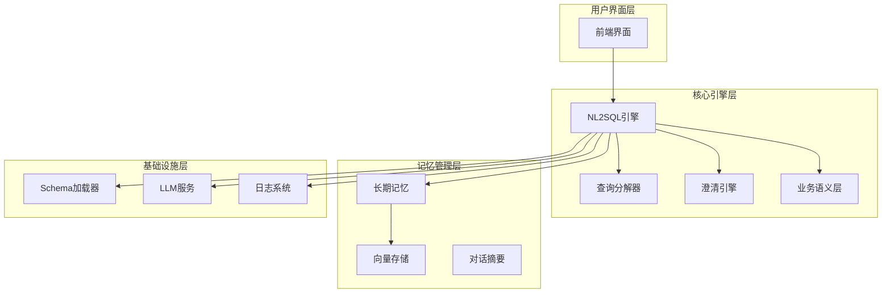
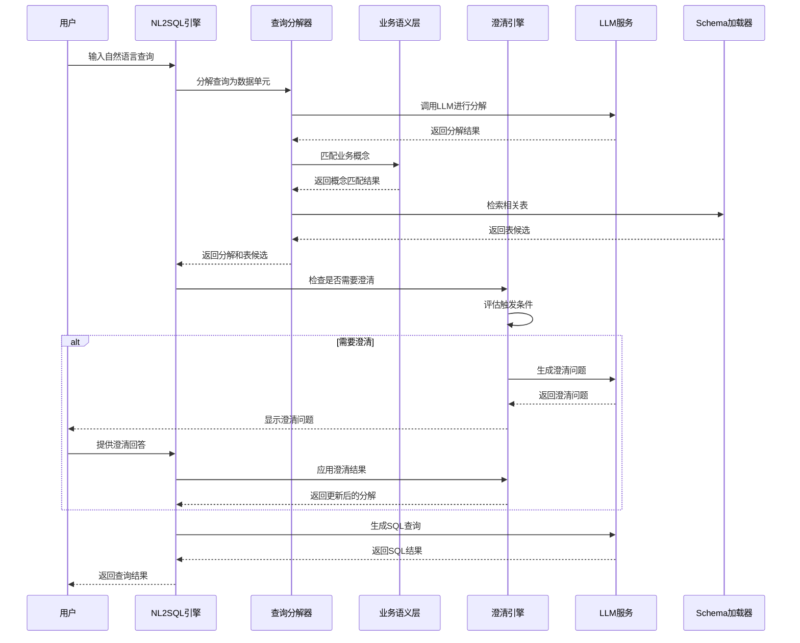
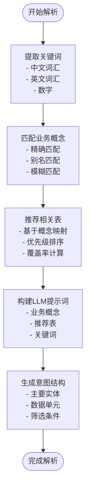
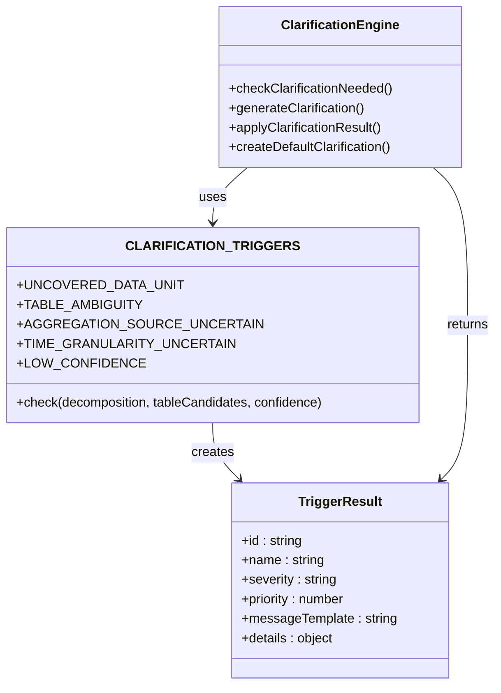
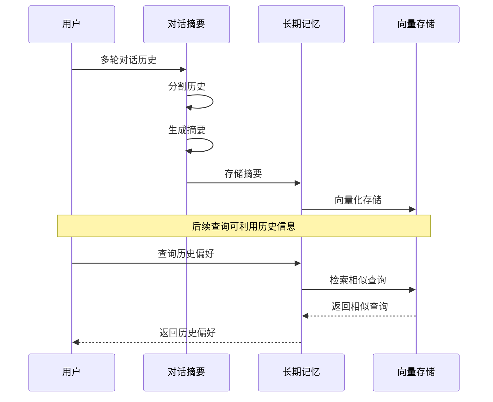
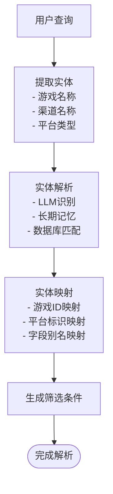
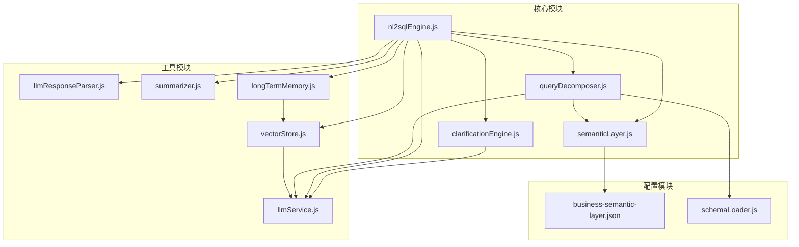

# 意图识别与澄清机制

<cite>
**本文档引用的文件**
- [clarificationEngine.js](file://backend/src/core/clarificationEngine.js)
- [nl2sqlEngine.js](file://backend/src/core/nl2sqlEngine.js)
- [semanticLayer.js](file://backend/src/core/semanticLayer.js)
- [queryDecomposer.js](file://backend/src/core/queryDecomposer.js)
- [schemaLoader.js](file://backend/src/core/schemaLoader.js)
- [llmService.js](file://backend/src/core/llmService.js)
- [llmResponseParser.js](file://backend/src/utils/llmResponseParser.js)
- [longTermMemory.js](file://backend/src/memory/longTermMemory.js)
- [vectorStore.js](file://backend/src/memory/vectorStore.js)
- [summarizer.js](file://backend/src/memory/summarizer.js)
- [business-semantic-layer.json](file://backend/config/business-semantic-layer.json)
</cite>

## 目录
1. [简介](#简介)
2. [项目结构](#项目结构)
3. [核心组件](#核心组件)
4. [架构概览](#架构概览)
5. [详细组件分析](#详细组件分析)
6. [依赖关系分析](#依赖关系分析)
7. [性能考虑](#性能考虑)
8. [故障排除指南](#故障排除指南)
9. [结论](#结论)

## 简介

NL2SQL引擎的意图识别与澄清机制是一个多层次的智能系统，旨在理解用户的自然语言查询意图并处理信息不完整或存在歧义的情况。该系统结合了业务语义层、查询分解器、澄清引擎和长期记忆管理等多种技术手段，实现了从自然语言到SQL的智能转换。

系统的核心目标包括：
- **意图识别**：理解用户查询的业务含义和数据需求
- **信息提取**：从查询中提取关键数据单元和业务概念
- **歧义处理**：当查询信息不完整时主动发起澄清请求
- **多轮对话**：支持上下文理解和历史信息利用
- **默认值推断**：基于业务规则和用户偏好进行智能推断

## 项目结构

NL2SQL引擎采用模块化架构设计，主要分为以下几个核心层次：

**图表来源**
- [nl2sqlEngine.js:1-800](file://backend/src/core/nl2sqlEngine.js#L1-L800)
- [clarificationEngine.js:1-489](file://backend/src/core/clarificationEngine.js#L1-L489)
- [semanticLayer.js:1-532](file://backend/src/core/semanticLayer.js#L1-L532)

**章节来源**
- [nl2sqlEngine.js:1-800](file://backend/src/core/nl2sqlEngine.js#L1-L800)
- [clarificationEngine.js:1-489](file://backend/src/core/clarificationEngine.js#L1-L489)
- [semanticLayer.js:1-532](file://backend/src/core/semanticLayer.js#L1-L532)

## 核心组件

### 1. 意图识别引擎

意图识别引擎是整个系统的大脑，负责理解用户的自然语言查询并将其转换为结构化的查询意图。它包含以下关键功能：

- **关键词提取**：从查询中识别业务关键词和实体
- **业务领域识别**：确定查询所属的业务领域和数据类型
- **查询类型分类**：将查询分类为不同类型（查询、对比、趋势等）
- **置信度评估**：为识别结果提供置信度评分

### 2. 澄清机制

当系统检测到查询信息不完整或存在歧义时，澄清机制会主动发起澄清请求。主要触发条件包括：

- **数据单元无匹配表**：查询中的数据需求无法匹配到具体表
- **表选择歧义**：同类型数据匹配到多个表
- **聚合指标来源不明确**：实时计算与预汇总数据的选择
- **时间粒度不明确**：按天、周、月等统计维度的选择
- **置信度过低**：整体理解不够准确

### 3. 业务语义层

业务语义层提供业务概念到物理表/字段的映射，支持别名识别和模糊匹配。它包含：

- **概念匹配**：匹配查询中的业务概念
- **表推荐**：基于匹配到的概念推荐相关表
- **数据源映射**：将业务概念映射到具体的数据源
- **字段值映射**：处理字段值的别名映射

### 4. 查询分解器

查询分解器将复杂的自然语言查询拆解为可独立检索的数据需求单元。每个单元代表一个独立的数据需求，具有明确的类型和描述。

**章节来源**
- [nl2sqlEngine.js:64-120](file://backend/src/core/nl2sqlEngine.js#L64-L120)
- [clarificationEngine.js:26-182](file://backend/src/core/clarificationEngine.js#L26-L182)
- [semanticLayer.js:134-167](file://backend/src/core/semanticLayer.js#L134-L167)
- [queryDecomposer.js:24-70](file://backend/src/core/queryDecomposer.js#L24-L70)

## 架构概览

NL2SQL引擎采用分层架构设计，每一层都有明确的职责和边界：

**图表来源**
- [nl2sqlEngine.js:38-70](file://backend/src/core/nl2sqlEngine.js#L38-L70)
- [clarificationEngine.js:196-232](file://backend/src/core/clarificationEngine.js#L196-L232)
- [queryDecomposer.js:38-70](file://backend/src/core/queryDecomposer.js#L38-L70)

## 详细组件分析

### 意图识别与解析

#### 关键词提取与业务领域识别

系统通过多种技术手段实现关键词提取和业务领域识别：

**图表来源**
- [semanticLayer.js:134-167](file://backend/src/core/semanticLayer.js#L134-L167)
- [nl2sqlEngine.js:104-120](file://backend/src/core/nl2sqlEngine.js#L104-L120)

#### 查询分解流程

查询分解器采用动态分解策略，将复杂查询拆解为独立的数据需求单元：

**章节来源**
- [queryDecomposer.js:38-70](file://backend/src/core/queryDecomposer.js#L38-L70)
- [semanticLayer.js:177-214](file://backend/src/core/semanticLayer.js#L177-L214)

### 澄清机制工作原理

#### 触发条件检测

澄清引擎通过多种触发条件检测查询中的问题：

**图表来源**
- [clarificationEngine.js:26-182](file://backend/src/core/clarificationEngine.js#L26-L182)
- [clarificationEngine.js:196-232](file://backend/src/core/clarificationEngine.js#L196-L232)

#### 澄清问题生成

当检测到需要澄清的情况时，系统会生成友好的澄清问题：

**章节来源**
- [clarificationEngine.js:246-272](file://backend/src/core/clarificationEngine.js#L246-L272)
- [clarificationEngine.js:277-312](file://backend/src/core/clarificationEngine.js#L277-L312)

### 多轮对话处理能力

#### 上下文理解与历史信息利用

系统通过对话摘要和长期记忆实现多轮对话处理：

**图表来源**
- [summarizer.js:58-95](file://backend/src/memory/summarizer.js#L58-L95)
- [longTermMemory.js:299-461](file://backend/src/memory/longTermMemory.js#L299-L461)

#### 默认值推断

系统能够基于历史信息和业务规则进行智能默认值推断：

**章节来源**
- [summarizer.js:264-331](file://backend/src/memory/summarizer.js#L264-L331)
- [longTermMemory.js:470-582](file://backend/src/memory/longTermMemory.js#L470-L582)

### 实体解析与映射

#### 实体识别与映射

系统支持多种实体类型的识别和映射：

**图表来源**
- [nl2sqlEngine.js:311-365](file://backend/src/core/nl2sqlEngine.js#L311-L365)
- [nl2sqlEngine.js:450-629](file://backend/src/core/nl2sqlEngine.js#L450-L629)

**章节来源**
- [nl2sqlEngine.js:311-365](file://backend/src/core/nl2sqlEngine.js#L311-L365)
- [nl2sqlEngine.js:450-629](file://backend/src/core/nl2sqlEngine.js#L450-L629)

## 依赖关系分析

### 核心依赖关系

**图表来源**
- [clarificationEngine.js:14-16](file://backend/src/core/clarificationEngine.js#L14-L16)
- [nl2sqlEngine.js:16-34](file://backend/src/core/nl2sqlEngine.js#L16-L34)
- [semanticLayer.js:14-18](file://backend/src/core/semanticLayer.js#L14-L18)

### 数据流分析

系统中的主要数据流包括：

1. **查询输入流**：用户查询 → 意图识别 → 查询分解
2. **澄清反馈流**：澄清问题 → 用户回答 → 结果应用
3. **记忆存储流**：查询结果 → 长期记忆 → 向量存储
4. **上下文维护流**：对话历史 → 摘要生成 → 历史压缩

**章节来源**
- [clarificationEngine.js:196-232](file://backend/src/core/clarificationEngine.js#L196-L232)
- [summarizer.js:264-331](file://backend/src/memory/summarizer.js#L264-L331)
- [longTermMemory.js:299-461](file://backend/src/memory/longTermMemory.js#L299-L461)

## 性能考虑

### Token预算管理

系统实现了智能的Token预算管理，确保在有限的Token预算内最大化查询质量：

- **动态预算分配**：根据查询复杂度动态分配Token预算
- **历史裁剪**：自动裁剪过长的对话历史
- **摘要机制**：对早期对话进行摘要压缩

### 向量检索优化

系统采用表级向量检索策略，相比字段级向量具有更好的性能表现：

- **表级表征**：每个表只生成一个向量，减少向量数量
- **智能过滤**：基于元数据标签进行过滤
- **重排序策略**：结合语义相似度和业务规则进行重排序

### 缓存策略

系统实现了多层次的缓存策略：

- **向量缓存**：缓存Schema向量和查询向量
- **摘要缓存**：缓存对话摘要结果
- **配置缓存**：缓存业务语义配置

## 故障排除指南

### 常见问题诊断

#### 澄清机制失效

当澄清机制无法正常工作时，检查以下方面：

1. **触发条件配置**：确认CLARIFICATION_TRIGGERS配置正确
2. **LLM服务状态**：验证LLM API连接和认证
3. **解析器状态**：检查JSON解析器是否正常工作

#### 意图识别错误

当意图识别出现错误时，建议：

1. **检查业务语义配置**：验证business-semantic-layer.json配置
2. **验证关键词映射**：确认业务关键词到表的映射正确
3. **检查Schema加载**：确保Schema配置文件加载成功

#### 性能问题

当系统响应缓慢时：

1. **检查向量存储**：确认向量数据库初始化成功
2. **监控Token使用**：检查是否超出预算限制
3. **优化查询复杂度**：简化复杂的查询结构

**章节来源**
- [clarificationEngine.js:266-272](file://backend/src/core/clarificationEngine.js#L266-L272)
- [llmResponseParser.js:24-59](file://backend/src/utils/llmResponseParser.js#L24-L59)
- [vectorStore.js:233-263](file://backend/src/memory/vectorStore.js#L233-L263)

## 结论

NL2SQL引擎的意图识别与澄清机制通过多层次的技术手段实现了智能的自然语言到SQL转换。系统的核心优势包括：

1. **多层架构设计**：清晰的模块划分和职责分离
2. **智能澄清机制**：主动识别和处理查询中的问题
3. **上下文理解**：支持多轮对话和历史信息利用
4. **性能优化**：采用向量检索和缓存策略提升性能
5. **可扩展性**：模块化设计便于功能扩展和维护

该系统为复杂的企业数据分析场景提供了强大的自然语言查询能力，能够有效处理各种业务场景下的查询需求，同时保证了系统的稳定性和可维护性。