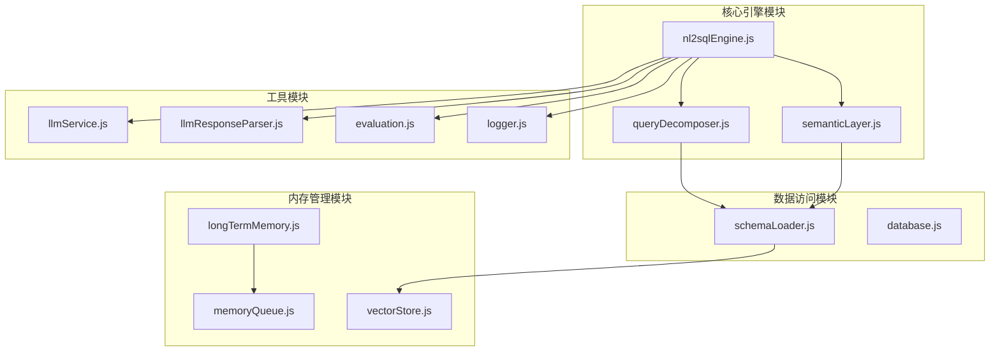
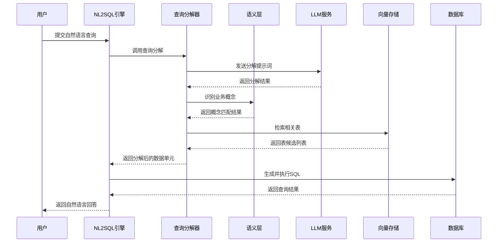
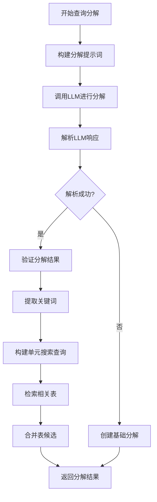
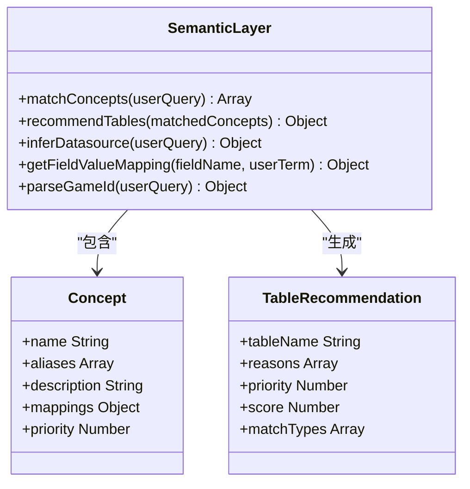
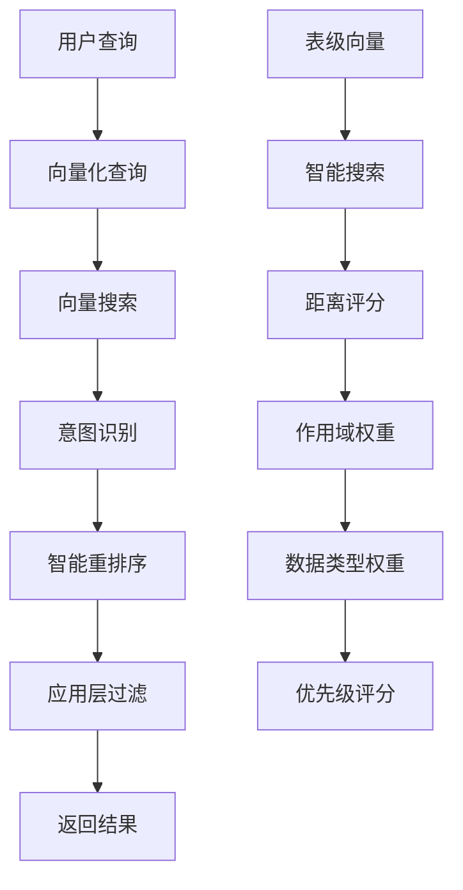
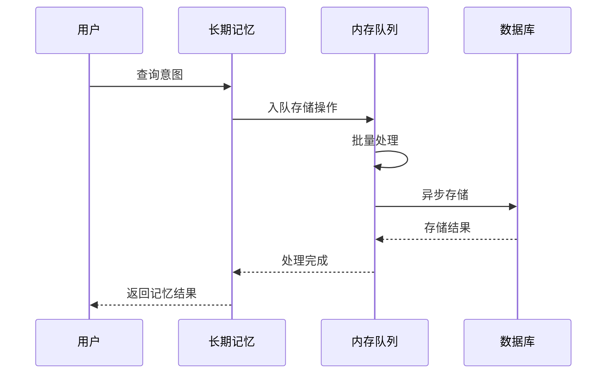
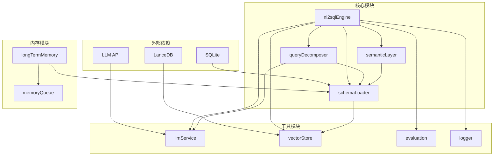
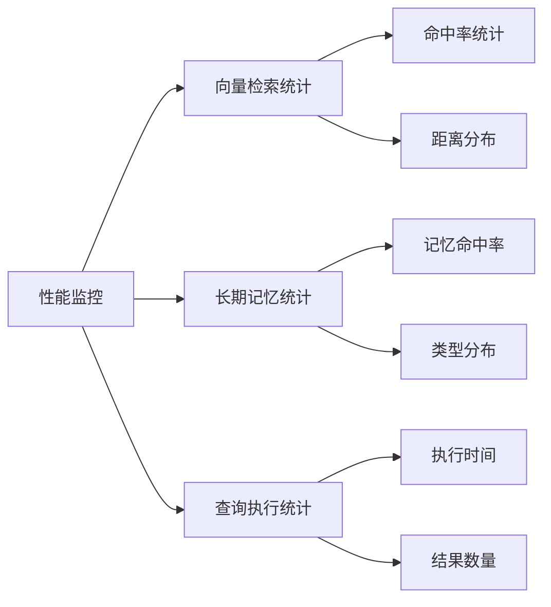

# 查询分解与优化

<cite>
**本文档引用的文件**
- [queryDecomposer.js](file://backend/src/core/queryDecomposer.js)
- [nl2sqlEngine.js](file://backend/src/core/nl2sqlEngine.js)
- [semanticLayer.js](file://backend/src/core/semanticLayer.js)
- [schemaLoader.js](file://backend/src/core/schemaLoader.js)
- [vectorStore.js](file://backend/src/memory/vectorStore.js)
- [evaluation.js](file://backend/src/utils/evaluation.js)
- [llmResponseParser.js](file://backend/src/utils/llmResponseParser.js)
- [config.js](file://backend/src/core/config.js)
- [llmService.js](file://backend/src/core/llmService.js)
- [logger.js](file://backend/src/utils/logger.js)
- [longTermMemory.js](file://backend/src/memory/longTermMemory.js)
- [memoryQueue.js](file://backend/src/memory/memoryQueue.js)
- [selfRepair.js](file://backend/src/core/selfRepair.js)
</cite>

## 目录
1. [简介](#简介)
2. [项目结构](#项目结构)
3. [核心组件](#核心组件)
4. [架构概览](#架构概览)
5. [详细组件分析](#详细组件分析)
6. [依赖关系分析](#依赖关系分析)
7. [性能考虑](#性能考虑)
8. [故障排除指南](#故障排除指南)
9. [结论](#结论)

## 简介

NL2SQL引擎的查询分解与优化功能是系统的核心模块，负责将复杂的自然语言查询转换为可执行的SQL语句。该功能通过动态查询分解、智能表检索、依赖关系分析和执行顺序优化等技术手段，实现了高效的自然语言到SQL的转换。

系统采用多阶段处理架构，第一阶段进行意图识别和澄清，第二阶段进行查询分解和表检索，第三阶段进行SQL生成和验证，第四阶段进行结果格式化和反馈。每个阶段都有专门的模块负责特定的功能，通过清晰的接口和数据流转实现模块间的协作。

## 项目结构

NL2SQL引擎采用模块化设计，核心功能分布在不同的模块中：

**图表来源**
- [nl2sqlEngine.js:1-800](file://backend/src/core/nl2sqlEngine.js#L1-800)
- [queryDecomposer.js:1-402](file://backend/src/core/queryDecomposer.js#L1-402)
- [semanticLayer.js:1-532](file://backend/src/core/semanticLayer.js#L1-532)

**章节来源**
- [nl2sqlEngine.js:1-800](file://backend/src/core/nl2sqlEngine.js#L1-800)
- [queryDecomposer.js:1-402](file://backend/src/core/queryDecomposer.js#L1-402)
- [semanticLayer.js:1-532](file://backend/src/core/semanticLayer.js#L1-532)

## 核心组件

### 查询分解器（QueryDecomposer）

查询分解器是系统的核心组件，负责将复杂的自然语言查询动态分解为多个数据需求单元。其主要功能包括：

- **动态查询分解**：根据用户查询的复杂度和业务语义，智能地将查询拆分为多个独立的数据需求单元
- **数据单元识别**：识别查询中的主要数据实体、筛选条件和数据需求
- **表检索**：基于分解结果，智能检索相关的数据表
- **合并策略**：对多个数据单元的表候选进行合并和排序

查询分解器采用LLM驱动的方法，通过精心设计的提示词引导LLM识别查询的结构和语义，然后解析LLM的响应生成标准化的数据单元结构。

**章节来源**
- [queryDecomposer.js:24-70](file://backend/src/core/queryDecomposer.js#L24-70)
- [queryDecomposer.js:255-298](file://backend/src/core/queryDecomposer.js#L255-298)

### 语义层（SemanticLayer）

语义层模块建立了业务概念到物理表/字段的映射关系，解决了业务术语识别和模糊匹配问题。其核心功能包括：

- **业务概念匹配**：识别查询中的业务概念（如"老平台"、"新平台"、"注册"、"充值"等）
- **表推荐**：基于匹配到的业务概念推荐相关的数据表
- **数据源映射**：解析查询中的数据源标识（如"老平台"对应new_tzpingtaiold）
- **字段值映射**：建立用户术语与数据库字段值的映射关系

语义层通过配置文件定义业务概念和映射规则，支持动态加载和热更新，能够适应不断变化的业务需求。

**章节来源**
- [semanticLayer.js:134-167](file://backend/src/core/semanticLayer.js#L134-167)
- [semanticLayer.js:238-306](file://backend/src/core/semanticLayer.js#L238-306)
- [semanticLayer.js:367-386](file://backend/src/core/semanticLayer.js#L367-386)

### Schema加载器（SchemaLoader）

Schema加载器负责管理和加载数据库的Schema元数据信息，提供智能的表检索和匹配功能：

- **Schema加载**：从JSON配置文件加载表结构定义和关系信息
- **向量化**：将Schema信息向量化存储，支持语义检索
- **表检索**：根据查询文本智能检索相关的数据表
- **SQL验证**：验证生成的SQL语句的安全性和正确性

Schema加载器采用表级向量表示，每个表只生成一个向量，提高了检索效率和准确性。

**章节来源**
- [schemaLoader.js:75-131](file://backend/src/core/schemaLoader.js#L75-131)
- [schemaLoader.js:571-653](file://backend/src/core/schemaLoader.js#L571-653)
- [schemaLoader.js:723-759](file://backend/src/core/schemaLoader.js#L723-759)

### 向量存储（VectorStore）

向量存储模块基于LanceDB实现，提供语义相似度搜索和查询历史管理功能：

- **Schema向量存储**：存储表和字段的向量表示，支持语义检索
- **查询历史向量**：存储用户查询的历史向量，支持相似查询检索
- **智能搜索**：提供基于查询意图识别的智能重排序功能
- **统计记录**：记录向量检索的统计信息，用于性能监控

向量存储模块支持查询类型分类、重要性评分和元数据增强，为系统提供了强大的语义理解能力。

**章节来源**
- [vectorStore.js:233-263](file://backend/src/memory/vectorStore.js#L233-263)
- [vectorStore.js:452-576](file://backend/src/memory/vectorStore.js#L452-576)
- [vectorStore.js:620-687](file://backend/src/memory/vectorStore.js#L620-687)

## 架构概览

NL2SQL引擎采用分层架构设计，每个层次都有明确的职责和接口：

**图表来源**
- [nl2sqlEngine.js:132-151](file://backend/src/core/nl2sqlEngine.js#L132-151)
- [queryDecomposer.js:38-70](file://backend/src/core/queryDecomposer.js#L38-70)
- [semanticLayer.js:134-167](file://backend/src/core/semanticLayer.js#L134-167)

系统架构具有以下特点：

1. **模块化设计**：每个核心功能都有独立的模块实现，便于维护和扩展
2. **可插拔架构**：支持不同的LLM服务和向量存储后端
3. **异步处理**：大量操作采用异步方式，提高系统响应性
4. **监控集成**：内置性能监控和错误处理机制

## 详细组件分析

### 查询分解算法

查询分解是系统的核心算法，通过以下步骤实现：

**图表来源**
- [queryDecomposer.js:38-70](file://backend/src/core/queryDecomposer.js#L38-70)
- [queryDecomposer.js:152-171](file://backend/src/core/queryDecomposer.js#L152-171)
- [queryDecomposer.js:255-298](file://backend/src/core/queryDecomposer.js#L255-298)

#### 关键算法实现

查询分解器的核心算法包括：

1. **提示词构建**：根据业务关键词和查询内容构建详细的分解提示词
2. **LLM响应解析**：使用统一的JSON解析器处理LLM的响应
3. **表候选合并**：基于覆盖率和频率计算综合评分
4. **结果验证**：确保分解结果的完整性和一致性

**章节来源**
- [queryDecomposer.js:79-143](file://backend/src/core/queryDecomposer.js#L79-143)
- [queryDecomposer.js:348-382](file://backend/src/core/queryDecomposer.js#L348-382)
- [llmResponseParser.js:24-59](file://backend/src/utils/llmResponseParser.js#L24-59)

### 语义层匹配机制

语义层通过多层匹配策略识别业务概念：

**图表来源**
- [semanticLayer.js:134-167](file://backend/src/core/semanticLayer.js#L134-167)
- [semanticLayer.js:238-306](file://backend/src/core/semanticLayer.js#L238-306)
- [semanticLayer.js:441-464](file://backend/src/core/semanticLayer.js#L441-464)

#### 匹配策略

语义层采用三层匹配策略：

1. **精确匹配**：直接匹配业务概念名称
2. **别名匹配**：匹配业务概念的别名列表
3. **模糊匹配**：基于关键词重叠度的相似度匹配

每种匹配策略都有相应的匹配分数，最终的匹配结果按分数排序。

**章节来源**
- [semanticLayer.js:177-214](file://backend/src/core/semanticLayer.js#L177-214)
- [semanticLayer.js:240-330](file://backend/src/core/semanticLayer.js#L240-330)

### 向量检索优化

向量存储模块实现了智能的语义检索功能：

**图表来源**
- [vectorStore.js:452-576](file://backend/src/memory/vectorStore.js#L452-576)
- [vectorStore.js:500-554](file://backend/src/memory/vectorStore.js#L500-554)

#### 智能重排序算法

向量检索采用多因素重排序算法：

1. **游戏提及优先**：当查询包含具体游戏时，该游戏表优先级最高
2. **平台权重分层**：不同类型平台表有不同的权重
3. **数据类型偏好**：原始日志表优先于聚合报表
4. **向量距离**：基于语义相似度的距离评分

**章节来源**
- [vectorStore.js:452-576](file://backend/src/memory/vectorStore.js#L452-576)
- [vectorStore.js:586-605](file://backend/src/memory/vectorStore.js#L586-605)

### 长期记忆系统

长期记忆系统通过异步队列机制管理用户偏好和查询模式：

**图表来源**
- [longTermMemory.js:299-461](file://backend/src/memory/longTermMemory.js#L299-461)
- [memoryQueue.js:72-118](file://backend/src/memory/memoryQueue.js#L72-118)

#### 存储策略

长期记忆采用分级存储策略：

1. **高价值模板**：维度≥2且指标≥1的查询模式
2. **高频模式**：7天内≥2次的查询模式
3. **简单查询**：需要更高频率才存储
4. **个人偏好**：用户特有的术语和映射关系

**章节来源**
- [longTermMemory.js:239-283](file://backend/src/memory/longTermMemory.js#L239-283)
- [longTermMemory.js:469-582](file://backend/src/memory/longTermMemory.js#L469-582)

## 依赖关系分析

NL2SQL引擎的模块间依赖关系如下：

**图表来源**
- [nl2sqlEngine.js:16-33](file://backend/src/core/nl2sqlEngine.js#L16-33)
- [queryDecomposer.js:14-18](file://backend/src/core/queryDecomposer.js#L14-18)
- [semanticLayer.js:14-17](file://backend/src/core/semanticLayer.js#L14-17)

### 关键依赖链

系统的关键依赖链包括：

1. **LLM依赖链**：llmService → llmResponseParser → 各模块
2. **数据依赖链**：schemaLoader → vectorStore → 各模块
3. **内存依赖链**：longTermMemory → memoryQueue → 数据库
4. **监控依赖链**：evaluation → logger → 各模块

**章节来源**
- [config.js:60-87](file://backend/src/core/config.js#L60-87)
- [config.js:106-130](file://backend/src/core/config.js#L106-130)
- [config.js:240-250](file://backend/src/core/config.js#L240-250)

## 性能考虑

### 查询分解性能优化

查询分解模块采用了多项性能优化措施：

1. **异步处理**：所有I/O密集型操作（LLM调用、向量检索）都采用异步方式
2. **缓存机制**：Schema元数据和向量数据都有缓存机制
3. **批量处理**：内存队列采用批量处理提高效率
4. **超时控制**：为所有外部调用设置合理的超时时间

### 向量检索性能

向量检索模块的性能优化包括：

1. **表级向量**：每个表只生成一个向量，减少向量数量
2. **智能过滤**：在应用层进行元数据过滤，减少结果集
3. **重排序优化**：使用优先级评分快速筛选候选
4. **增量更新**：支持向量的增量更新，避免全量重建

### 内存管理

长期记忆系统采用异步队列机制管理内存：

1. **批量处理**：每批处理5个操作，平衡吞吐量和延迟
2. **队列容量**：最大队列长度500，防止内存泄漏
3. **异步存储**：避免阻塞主线程
4. **错误处理**：失败的操作会重试并记录日志

**章节来源**
- [memoryQueue.js:72-118](file://backend/src/memory/memoryQueue.js#L72-118)
- [vectorStore.js:452-576](file://backend/src/memory/vectorStore.js#L452-576)
- [evaluation.js:37-60](file://backend/src/utils/evaluation.js#L37-60)

## 故障排除指南

### 常见问题诊断

系统提供了完善的错误处理和诊断机制：

1. **LLM调用失败**：检查API密钥、网络连接和超时设置
2. **向量数据库异常**：检查LanceDB安装和权限设置
3. **Schema加载失败**：检查配置文件格式和路径
4. **内存队列积压**：检查数据库连接和存储性能

### 性能监控

系统内置了全面的性能监控功能：

**图表来源**
- [evaluation.js:37-60](file://backend/src/utils/evaluation.js#L37-60)
- [evaluation.js:344-391](file://backend/src/utils/evaluation.js#L344-391)

### 自修复机制

系统具备自动修复和维护能力：

1. **每日自检**：检查数据库连接、向量数据库状态和查询统计
2. **会话清理**：定期清理过期的会话数据
3. **内存维护**：定期压缩和清理长期记忆
4. **统计收集**：定期收集系统运行统计数据

**章节来源**
- [selfRepair.js:169-310](file://backend/src/core/selfRepair.js#L169-310)
- [evaluation.js:397-407](file://backend/src/utils/evaluation.js#L397-407)

## 结论

NL2SQL引擎的查询分解与优化功能通过模块化设计和多层架构，实现了高效、准确的自然语言到SQL转换。系统的主要优势包括：

1. **智能化分解**：通过LLM驱动的查询分解，能够处理复杂的自然语言查询
2. **语义理解**：基于向量存储的语义检索，提高了表匹配的准确性
3. **性能优化**：多层缓存、异步处理和批量操作提升了系统性能
4. **可扩展性**：模块化设计支持功能扩展和定制化需求
5. **监控集成**：内置的监控和自修复机制保证了系统的稳定性

未来可以进一步优化的方向包括：增强对复杂SQL特性的支持、改进查询优化算法、增加更多的性能监控指标等。通过持续的迭代和优化，NL2SQL引擎将继续为用户提供高质量的自然语言查询服务。