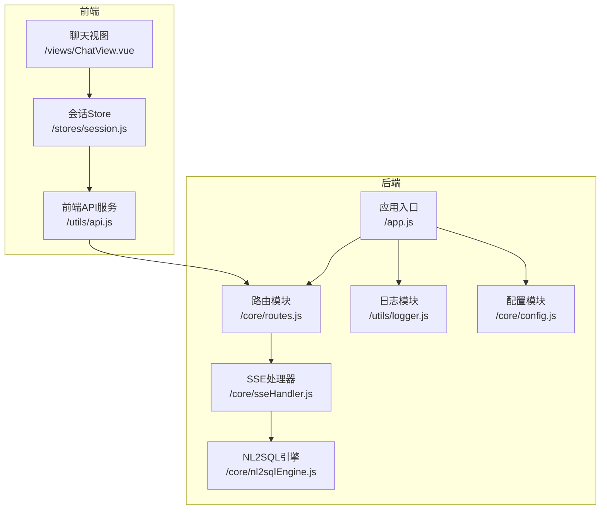
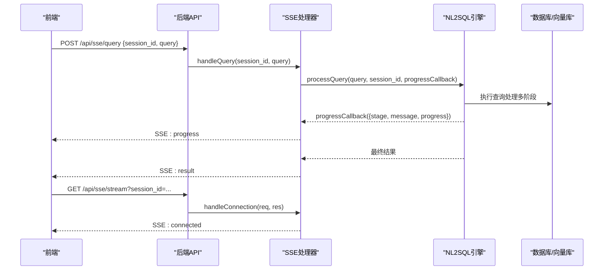
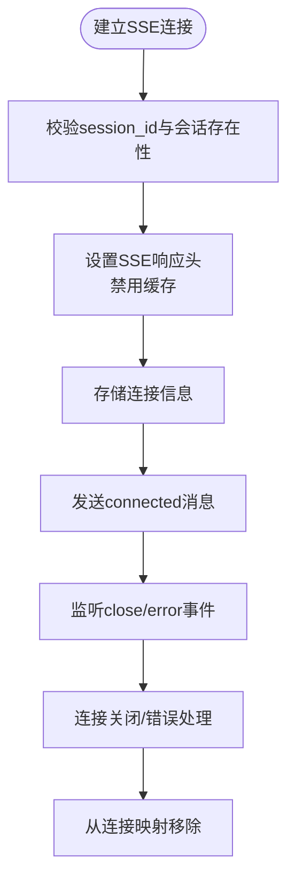
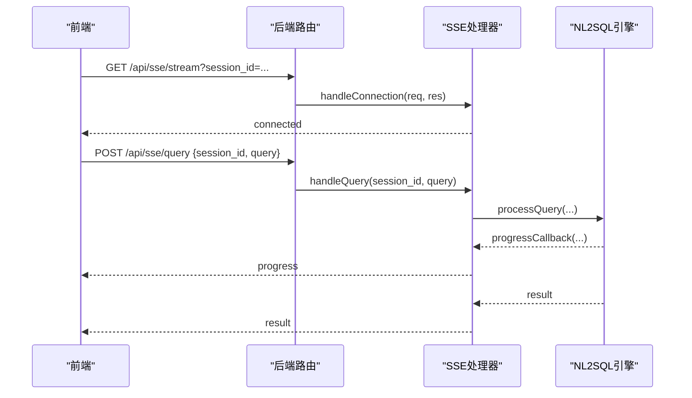
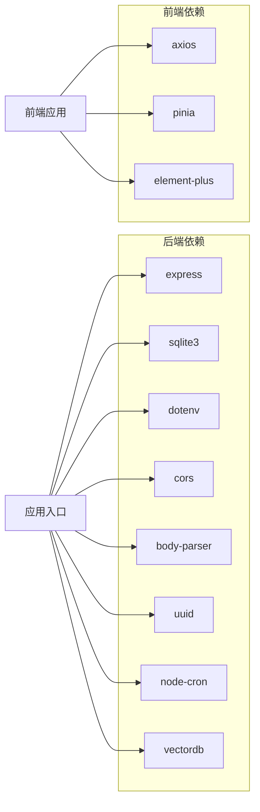

# 实时通信系统

<cite>
**本文档引用的文件**
- [backend/src/core/sseHandler.js](file://backend/src/core/sseHandler.js)
- [backend/src/core/routes.js](file://backend/src/core/routes.js)
- [backend/src/app.js](file://backend/src/app.js)
- [backend/src/core/nl2sqlEngine.js](file://backend/src/core/nl2sqlEngine.js)
- [backend/src/utils/logger.js](file://backend/src/utils/logger.js)
- [backend/src/core/config.js](file://backend/src/core/config.js)
- [frontend/src/utils/api.js](file://frontend/src/utils/api.js)
- [frontend/src/stores/session.js](file://frontend/src/stores/session.js)
- [frontend/src/views/ChatView.vue](file://frontend/src/views/ChatView.vue)
- [backend/package.json](file://backend/package.json)
</cite>

## 目录
1. [简介](#简介)
2. [项目结构](#项目结构)
3. [核心组件](#核心组件)
4. [架构总览](#架构总览)
5. [详细组件分析](#详细组件分析)
6. [依赖关系分析](#依赖关系分析)
7. [性能考虑](#性能考虑)
8. [故障排查指南](#故障排查指南)
9. [结论](#结论)
10. [附录](#附录)

## 简介
本项目是一个基于 Server-Sent Events（SSE）的实时通信系统，用于将查询处理的中间结果和最终结果实时推送到前端界面。系统采用 Node.js + Express 构建后端，Vue 3 + Pinia 构建前端，实现了从查询提交到实时反馈的完整链路。SSE 通道负责持续推送处理进度、中间结果和最终结果，前端通过 EventSource 接收并展示。

## 项目结构
后端采用模块化组织，核心模块包括：
- SSE 处理器：负责连接管理、消息发送、查询处理与广播
- 路由模块：定义 REST API 和 SSE 端点
- 应用入口：初始化配置、数据库、向量库并启动服务
- NL2SQL 引擎：核心查询处理逻辑，支持进度回调
- 日志与配置：统一日志记录与配置管理

前端采用 Vue 3 + Pinia 的状态管理模式，包含：
- API 服务：封装 HTTP 请求与错误处理
- 会话 Store：管理 SSE 连接、消息状态与处理进度
- 聊天视图：展示消息、SQL 与数据表格，并显示处理状态

**图表来源**
- [backend/src/app.js:1-266](file://backend/src/app.js#L1-L266)
- [backend/src/core/routes.js:1-1037](file://backend/src/core/routes.js#L1-L1037)
- [backend/src/core/sseHandler.js:1-349](file://backend/src/core/sseHandler.js#L1-L349)
- [backend/src/core/nl2sqlEngine.js:1-200](file://backend/src/core/nl2sqlEngine.js#L1-L200)
- [frontend/src/utils/api.js:1-303](file://frontend/src/utils/api.js#L1-L303)
- [frontend/src/stores/session.js:1-400](file://frontend/src/stores/session.js#L1-L400)

**章节来源**
- [backend/src/app.js:1-266](file://backend/src/app.js#L1-L266)
- [backend/src/core/routes.js:1-1037](file://backend/src/core/routes.js#L1-L1037)

## 核心组件
- SSE 处理器：维护连接映射、处理连接建立/关闭/错误、发送消息、广播消息、查询处理与进度回调
- 路由模块：提供 REST API（健康检查、Schema、会话、查询历史、统计等）以及 SSE 端点（建立连接、提交查询）
- NL2SQL 引擎：执行查询处理流程，支持进度回调，将中间结果通过回调推送
- 前端 API 服务：封装 HTTP 请求，统一错误处理
- 前端会话 Store：管理 SSE 连接、消息状态、处理进度，接收并处理 SSE 消息
- 日志与配置：统一日志记录与配置管理，支持健康检查与统计

**章节来源**
- [backend/src/core/sseHandler.js:1-349](file://backend/src/core/sseHandler.js#L1-L349)
- [backend/src/core/routes.js:944-1002](file://backend/src/core/routes.js#L944-L1002)
- [backend/src/core/nl2sqlEngine.js:1-200](file://backend/src/core/nl2sqlEngine.js#L1-L200)
- [frontend/src/utils/api.js:1-303](file://frontend/src/utils/api.js#L1-L303)
- [frontend/src/stores/session.js:1-400](file://frontend/src/stores/session.js#L1-L400)
- [backend/src/utils/logger.js:1-482](file://backend/src/utils/logger.js#L1-L482)
- [backend/src/core/config.js:1-398](file://backend/src/core/config.js#L1-L398)

## 架构总览
系统采用“HTTP REST API + SSE 流式推送”的混合架构：
- 前端通过 REST API 创建会话、获取 Schema、提交查询
- 查询提交后，后端通过 SSE 将处理进度、中间结果和最终结果实时推送给前端
- SSE 连接支持多标签页（同一会话ID对应多个连接）

**图表来源**
- [backend/src/core/routes.js:961-1002](file://backend/src/core/routes.js#L961-L1002)
- [backend/src/core/sseHandler.js:218-280](file://backend/src/core/sseHandler.js#L218-L280)
- [backend/src/core/nl2sqlEngine.js:1-200](file://backend/src/core/nl2sqlEngine.js#L1-L200)

## 详细组件分析

### SSE 处理器（SSEHandler）
职责：
- 连接管理：维护会话ID到连接列表的映射，支持多标签页
- 连接建立：设置 SSE 响应头，发送连接成功消息，监听关闭与错误
- 消息发送：将消息对象序列化为 JSON 并以 SSE 格式发送
- 查询处理：校验会话与请求状态，调用 NL2SQL 引擎，通过进度回调广播中间结果
- 统计功能：提供连接数、连接列表、会话连接数查询

关键流程：
- 连接建立：设置 Content-Type 为 text/event-stream，禁用 Nginx 缓冲，发送 connected 消息
- 查询处理：标记 isProcessing，广播 processing，调用引擎处理并回调 progress，最终广播 result 或 error
- 连接清理：关闭时从映射中移除，若无连接则删除会话键

**图表来源**
- [backend/src/core/sseHandler.js:43-112](file://backend/src/core/sseHandler.js#L43-L112)
- [backend/src/core/sseHandler.js:119-153](file://backend/src/core/sseHandler.js#L119-L153)

**章节来源**
- [backend/src/core/sseHandler.js:1-349](file://backend/src/core/sseHandler.js#L1-L349)

### 路由模块（Routes）
职责：
- 定义 REST API：健康检查、Schema 查询、会话管理、查询历史、统计、评估等
- 定义 SSE 端点：GET /api/sse/stream 建立连接；POST /api/sse/query 提交查询
- 中间件：请求日志、全局错误处理

SSE 相关端点：
- GET /api/sse/stream：调用 SSE 处理器建立连接
- POST /api/sse/query：校验参数，异步处理查询并通过 SSE 推送结果

**图表来源**
- [backend/src/core/routes.js:944-1002](file://backend/src/core/routes.js#L944-L1002)
- [backend/src/core/sseHandler.js:218-280](file://backend/src/core/sseHandler.js#L218-L280)

**章节来源**
- [backend/src/core/routes.js:944-1002](file://backend/src/core/routes.js#L944-L1002)

### NL2SQL 引擎（NL2SQL Engine）
职责：
- 核心查询处理：意图识别、澄清机制、SQL 生成、验证与格式化
- 进度回调：在处理过程中的关键阶段调用回调，将中间结果通过 SSE 推送
- 与向量库交互：使用 LanceDB 进行语义检索与表推荐

关键点：
- 进度回调签名：(progress) => void，progress 包含 stage/message/progress 等字段
- 与 SSE 的集成：SSE 处理器将回调广播到会话内的所有连接

**章节来源**
- [backend/src/core/nl2sqlEngine.js:1-200](file://backend/src/core/nl2sqlEngine.js#L1-L200)

### 前端 API 服务（API）
职责：
- 封装 axios 实例，统一基础 URL、超时与请求/响应拦截
- 提供 REST API 方法：健康检查、Schema、会话、查询历史、统计、评估等
- 提供 SSE 查询提交方法：sendQuery(sessionId, query)

**章节来源**
- [frontend/src/utils/api.js:1-303](file://frontend/src/utils/api.js#L1-L303)

### 前端会话 Store（Session Store）
职责：
- 管理会话状态：会话列表、当前会话、消息历史
- 管理 SSE 连接：connectSSE、disconnectSSE、handleSSEMessage
- 处理消息类型：connected、processing、progress、result、clarify、error
- 管理处理状态：isProcessing、processingStatus、processingProgress

SSE 消息处理：
- connected：仅记录
- processing：设置处理状态文本与进度为 0
- progress：更新处理状态文本与进度
- result：添加助手消息（包含 SQL 与数据），刷新会话列表
- clarify/error：添加错误/澄清消息

**章节来源**
- [frontend/src/stores/session.js:1-400](file://frontend/src/stores/session.js#L1-L400)

### 聊天视图（Chat View）
职责：
- 展示欢迎消息、用户与助手消息
- 展示生成的 SQL 代码块与数据表格
- 显示处理状态指示器（进度条、打字动画、状态文本）
- 处理用户输入与发送消息

**章节来源**
- [frontend/src/views/ChatView.vue:1-200](file://frontend/src/views/ChatView.vue#L1-L200)

## 依赖关系分析
- 后端依赖：
  - Express：Web 框架
  - sqlite3：SQLite 数据库
  - dotenv：环境变量加载
  - cors/body-parser：跨域与请求解析
  - uuid：会话 ID 生成
  - node-cron：定时任务
  - vectordb：LanceDB 向量数据库

- 前端依赖：
  - axios：HTTP 客户端
  - pinia：状态管理
  - element-plus：UI 组件库

**图表来源**
- [backend/package.json:1-28](file://backend/package.json#L1-L28)

**章节来源**
- [backend/package.json:1-28](file://backend/package.json#L1-L28)

## 性能考虑
- SSE 连接管理
  - 连接映射：以会话ID为键，支持多标签页连接
  - 连接清理：关闭/错误时从映射移除，避免内存泄漏
  - 响应头：设置 Cache-Control: no-cache、Connection: keep-alive、X-Accel-Buffering: no，禁用代理缓冲

- 进度回调与背压控制
  - 进度回调：NL2SQL 引擎在关键阶段调用回调，SSE 处理器广播到所有连接
  - 背压控制：前端 Store 通过 isProcessing、processingStatus、processingProgress 控制 UI 更新频率
  - 会话内广播：同一会话的所有连接共享进度，避免重复计算

- 缓冲区管理
  - SSE 响应直接写入底层 HTTP 响应对象，避免额外缓冲
  - 前端 EventSource 逐条解析消息，按需渲染

- 连接池优化
  - 数据库连接池：配置最小/最大连接数、获取超时、空闲超时
  - LLM API：配置超时、重试次数与间隔，避免阻塞

- 日志与监控
  - 统一日志记录，支持级别控制与文件轮转
  - 健康检查接口：返回服务状态、内存使用、SSE 连接数等

**章节来源**
- [backend/src/core/sseHandler.js:64-70](file://backend/src/core/sseHandler.js#L64-L70)
- [backend/src/core/config.js:114-130](file://backend/src/core/config.js#L114-L130)
- [backend/src/utils/logger.js:1-482](file://backend/src/utils/logger.js#L1-L482)
- [backend/src/core/routes.js:100-137](file://backend/src/core/routes.js#L100-L137)

## 故障排查指南
- 连接建立失败
  - 检查 session_id 参数是否传递
  - 确认会话是否存在
  - 查看后端日志中的连接建立/关闭/错误信息

- 查询提交失败
  - 确认 session_id 与 query 参数
  - 检查会话标题是否更新（首次消息时后端会更新标题）
  - 查看后端错误日志

- SSE 消息解析失败
  - 前端 EventSource.onmessage 中包含 JSON 解析错误处理
  - 检查后端消息格式是否符合 {type, data}

- 连接断开
  - 前端 Store 中 isConnected 标志与 onerror 事件
  - 后端连接关闭回调 handleClose

- 健康检查
  - GET /api/health 与 /api/health/detail
  - 检查数据库、LLM、Schema、SSE 连接状态

**章节来源**
- [backend/src/core/routes.js:957-1002](file://backend/src/core/routes.js#L957-L1002)
- [backend/src/core/sseHandler.js:119-153](file://backend/src/core/sseHandler.js#L119-L153)
- [frontend/src/stores/session.js:185-221](file://frontend/src/stores/session.js#L185-L221)

## 结论
本系统通过 SSE 实现了高效的实时通信，将查询处理的中间结果与最终结果实时推送到前端。SSE 处理器提供了完善的连接管理、消息发送与广播能力，结合 NL2SQL 引擎的进度回调，实现了流畅的用户体验。前端通过 Store 管理 SSE 连接与状态，配合聊天视图展示处理进度与结果。系统具备良好的可扩展性与可观测性，适合在生产环境中部署与使用。

## 附录

### API 接口文档
- 健康检查
  - GET /api/health
  - GET /api/health/detail

- Schema 接口
  - GET /api/schema
  - GET /api/schema/tables/:tableName
  - GET /api/schema/search

- 会话管理
  - POST /api/sessions
  - GET /api/sessions/:sessionId
  - DELETE /api/sessions/:sessionId
  - GET /api/sessions/:sessionId/messages
  - GET /api/users/:userId/sessions

- 查询历史
  - GET /api/queries/history

- 统计信息
  - GET /api/stats

- 配置
  - GET /api/config

- SSE 接口
  - GET /api/sse/stream?session_id=...&user_id=...
  - POST /api/sse/query {session_id, query}

**章节来源**
- [backend/src/core/routes.js:58-942](file://backend/src/core/routes.js#L58-L942)

### 消息格式规范
- 连接成功
  - type: "connected"
  - data: { session_id, message }

- 开始处理
  - type: "processing"
  - data: { message }

- 进度更新
  - type: "progress"
  - data: { message, stage, progress }

- 查询结果
  - type: "result"
  - data: { message, type, sql, data }

- 需要澄清
  - type: "clarify"
  - data: { message }

- 错误
  - type: "error"
  - data: { message }

**章节来源**
- [backend/src/core/sseHandler.js:95-280](file://backend/src/core/sseHandler.js#L95-L280)
- [frontend/src/stores/session.js:227-295](file://frontend/src/stores/session.js#L227-L295)