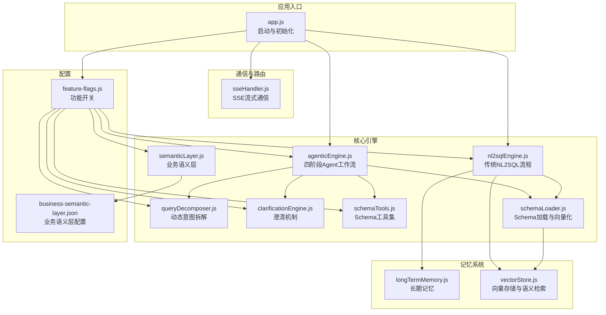
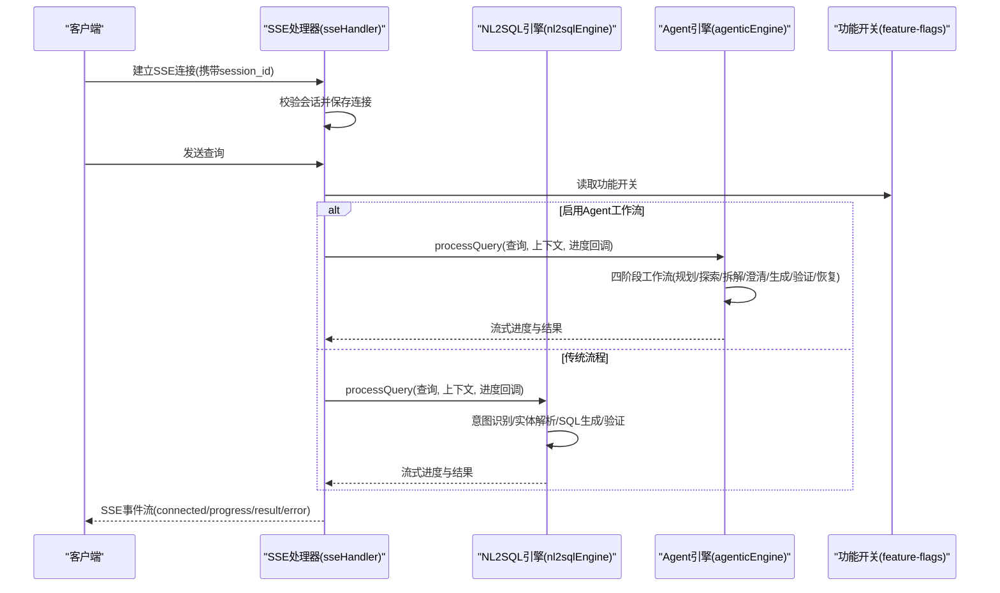
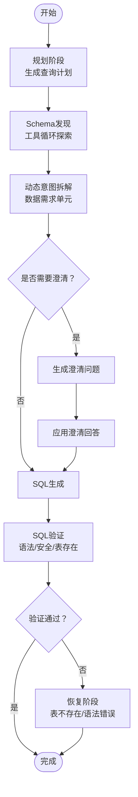
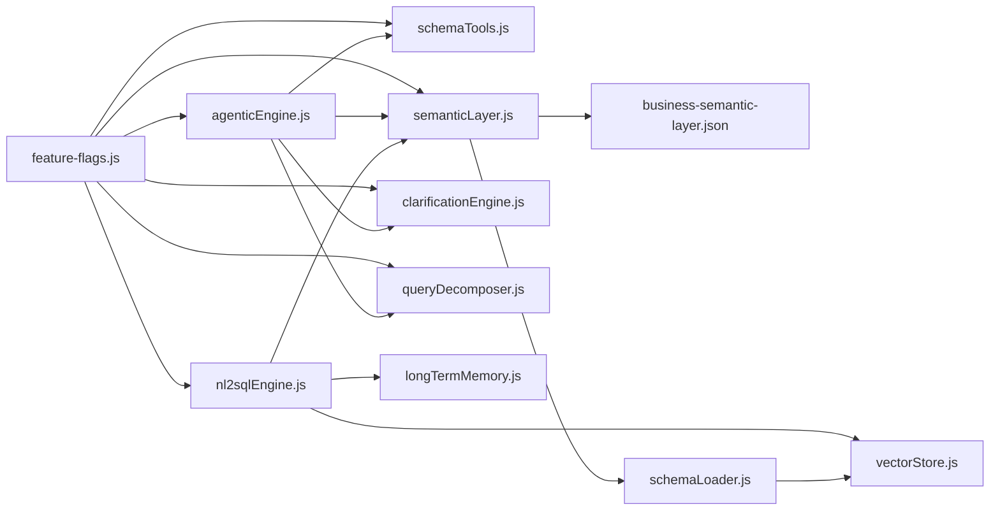

# 核心功能

<cite>
**本文引用的文件**
- [app.js](file://backend/src/app.js)
- [agenticEngine.js](file://backend/src/core/agenticEngine.js)
- [nl2sqlEngine.js](file://backend/src/core/nl2sqlEngine.js)
- [schemaTools.js](file://backend/src/core/schemaTools.js)
- [schemaLoader.js](file://backend/src/core/schemaLoader.js)
- [semanticLayer.js](file://backend/src/core/semanticLayer.js)
- [clarificationEngine.js](file://backend/src/core/clarificationEngine.js)
- [queryDecomposer.js](file://backend/src/core/queryDecomposer.js)
- [sseHandler.js](file://backend/src/core/sseHandler.js)
- [vectorStore.js](file://backend/src/memory/vectorStore.js)
- [longTermMemory.js](file://backend/src/memory/longTermMemory.js)
- [business-semantic-layer.json](file://backend/config/business-semantic-layer.json)
- [feature-flags.js](file://backend/config/feature-flags.js)
- [package.json](file://backend/package.json)
</cite>

## 目录
1. [简介](#简介)
2. [项目结构](#项目结构)
3. [核心组件](#核心组件)
4. [架构总览](#架构总览)
5. [详细组件分析](#详细组件分析)
6. [依赖关系分析](#依赖关系分析)
7. [性能考量](#性能考量)
8. [故障排查指南](#故障排查指南)
9. [结论](#结论)
10. [附录](#附录)

## 简介
本项目提供“自然语言到SQL”的智能转换能力，采用四阶段Agent工作流，结合意图识别、Schema探索、澄清机制、SQL生成与验证、以及三层记忆系统，实现从用户自然语言到可执行SQL的闭环。系统还提供实时流式通信（SSE）以提升交互体验，并通过业务语义层与Schema管理实现复杂业务概念映射。

## 项目结构
后端采用模块化设计，核心分为：
- 核心引擎：意图识别、Schema探索、澄清、SQL生成与验证、四阶段Agent工作流
- 记忆系统：短期对话、长期记忆、向量检索
- 通信与路由：SSE流式通信、REST路由
- 配置与工具：功能开关、业务语义层配置、Schema元数据

**图表来源**
- [app.js:1-266](file://backend/src/app.js#L1-L266)
- [agenticEngine.js:1-651](file://backend/src/core/agenticEngine.js#L1-L651)
- [nl2sqlEngine.js:1-800](file://backend/src/core/nl2sqlEngine.js#L1-L800)
- [queryDecomposer.js:1-402](file://backend/src/core/queryDecomposer.js#L1-L402)
- [clarificationEngine.js:1-489](file://backend/src/core/clarificationEngine.js#L1-L489)
- [semanticLayer.js:1-532](file://backend/src/core/semanticLayer.js#L1-L532)
- [schemaTools.js:1-632](file://backend/src/core/schemaTools.js#L1-L632)
- [schemaLoader.js:1-800](file://backend/src/core/schemaLoader.js#L1-L800)
- [vectorStore.js:1-800](file://backend/src/memory/vectorStore.js#L1-L800)
- [longTermMemory.js:1-800](file://backend/src/memory/longTermMemory.js#L1-L800)
- [sseHandler.js:1-349](file://backend/src/core/sseHandler.js#L1-L349)
- [feature-flags.js:1-249](file://backend/config/feature-flags.js#L1-L249)
- [business-semantic-layer.json:1-189](file://backend/config/business-semantic-layer.json#L1-L189)

**章节来源**
- [app.js:1-266](file://backend/src/app.js#L1-L266)
- [package.json:1-28](file://backend/package.json#L1-L28)

## 核心组件
- 四阶段Agent工作流（AgenticEngine）：整合规划、Schema探索、动态意图拆解、澄清确认、SQL生成与验证、自我修正恢复
- 传统NL2SQL引擎（nl2sqlEngine）：在未启用Agent时提供意图识别、实体解析、SQL生成与验证、长期记忆学习
- Schema工具与加载（schemaTools/schemaLoader）：工具化Schema探索、向量表征与语义检索、Schema校验
- 业务语义层（semanticLayer + 配置）：将业务术语映射到物理表/字段
- 澄清引擎（clarificationEngine）：在置信度不足或歧义时生成澄清问题
- 查询分解（queryDecomposer）：将复杂查询拆解为数据需求单元并独立检索表
- 记忆系统（longTermMemory + vectorStore）：长期记忆抽取与存储、向量检索
- 实时流式通信（sseHandler）：SSE事件推送，支持进度与结果流式传输

**章节来源**
- [agenticEngine.js:1-651](file://backend/src/core/agenticEngine.js#L1-L651)
- [nl2sqlEngine.js:1-800](file://backend/src/core/nl2sqlEngine.js#L1-L800)
- [schemaTools.js:1-632](file://backend/src/core/schemaTools.js#L1-L632)
- [schemaLoader.js:1-800](file://backend/src/core/schemaLoader.js#L1-L800)
- [semanticLayer.js:1-532](file://backend/src/core/semanticLayer.js#L1-L532)
- [clarificationEngine.js:1-489](file://backend/src/core/clarificationEngine.js#L1-L489)
- [queryDecomposer.js:1-402](file://backend/src/core/queryDecomposer.js#L1-L402)
- [vectorStore.js:1-800](file://backend/src/memory/vectorStore.js#L1-L800)
- [longTermMemory.js:1-800](file://backend/src/memory/longTermMemory.js#L1-L800)
- [sseHandler.js:1-349](file://backend/src/core/sseHandler.js#L1-L349)

## 架构总览
系统启动时加载配置、初始化数据库与向量库、加载Schema与业务语义层，随后提供REST与SSE接口。根据功能开关决定使用传统流程或四阶段Agent工作流。

**图表来源**
- [app.js:97-194](file://backend/src/app.js#L97-L194)
- [sseHandler.js:218-280](file://backend/src/core/sseHandler.js#L218-L280)
- [feature-flags.js:149-200](file://backend/config/feature-flags.js#L149-L200)
- [agenticEngine.js:68-178](file://backend/src/core/agenticEngine.js#L68-L178)
- [nl2sqlEngine.js:1-800](file://backend/src/core/nl2sqlEngine.js#L1-L800)

## 详细组件分析

### 四阶段Agent工作流（AgenticEngine）
- 设计理念：Plan → Tool-Augmented Schema Discovery → Dynamic Intent Decomposition → Clarification + Confirmation → Generation + Verification + Recovery
- 执行流程：
  - 规划阶段：生成查询计划（实体、筛选、聚合、风险）
  - Schema发现：使用工具循环探索相关表，支持Level 1索引与工具循环
  - 动态意图拆解：将复杂查询拆解为数据需求单元并独立检索表
  - 澄清阶段：当置信度不足或歧义时生成澄清问题
  - 生成与验证：生成SQL并进行基本语法与安全检查；失败时尝试恢复（表不存在/语法错误）
- 进度回调：通过onProgress回调向SSE推送阶段进度

**图表来源**
- [agenticEngine.js:68-178](file://backend/src/core/agenticEngine.js#L68-L178)
- [agenticEngine.js:345-618](file://backend/src/core/agenticEngine.js#L345-L618)
- [queryDecomposer.js:24-70](file://backend/src/core/queryDecomposer.js#L24-L70)
- [clarificationEngine.js:196-232](file://backend/src/core/clarificationEngine.js#L196-L232)

**章节来源**
- [agenticEngine.js:1-651](file://backend/src/core/agenticEngine.js#L1-L651)
- [queryDecomposer.js:1-402](file://backend/src/core/queryDecomposer.js#L1-L402)
- [clarificationEngine.js:1-489](file://backend/src/core/clarificationEngine.js#L1-L489)

### 传统NL2SQL引擎（nl2sqlEngine）
- 意图识别：提取维度、指标、时间范围、筛选条件
- 实体解析：解析游戏/渠道等实体ID，支持从长期记忆学习别名
- SQL生成：基于Schema与业务映射生成SQL，支持向量检索相关表
- 验证与澄清：安全关键字检查、表白名单校验；必要时触发澄清
- 长期记忆：抽取用户偏好与别名，异步存储到数据库

**章节来源**
- [nl2sqlEngine.js:1-800](file://backend/src/core/nl2sqlEngine.js#L1-L800)
- [longTermMemory.js:1-800](file://backend/src/memory/longTermMemory.js#L1-L800)

### Schema工具与加载（schemaTools/schemaLoader）
- Schema工具：search_tables、describe_table、search_knowledge、peek_table，支持LLM函数调用
- 分层索引：Level 1（表名+描述）+ Level 2（字段详情），按需加载
- 向量化：将表级描述向量化，支持智能搜索与重排序
- 智能匹配：结合上下文（game_id、datasource）增强表检索

**章节来源**
- [schemaTools.js:1-632](file://backend/src/core/schemaTools.js#L1-L632)
- [schemaLoader.js:1-800](file://backend/src/core/schemaLoader.js#L1-L800)
- [vectorStore.js:1-800](file://backend/src/memory/vectorStore.js#L1-L800)

### 业务语义层（semanticLayer + 配置）
- 业务概念映射：将“老平台”、“累计充值”等术语映射到数据源/表/字段
- 查询模式：定义典型查询模板（如玩家筛选+行为分析）
- 字段值映射：如game_id、platform_type的常见值映射
- 配置文件：business-semantic-layer.json集中管理

**章节来源**
- [semanticLayer.js:1-532](file://backend/src/core/semanticLayer.js#L1-L532)
- [business-semantic-layer.json:1-189](file://backend/config/business-semantic-layer.json#L1-L189)

### 澄清引擎（clarificationEngine）
- 触发条件：数据单元无匹配表、表选择歧义、聚合来源不明确、时间粒度不明确、低置信度
- 生成问题：基于LLM生成友好澄清问题与选项
- 应用回答：更新分解结果中的偏好与约束

**章节来源**
- [clarificationEngine.js:1-489](file://backend/src/core/clarificationEngine.js#L1-L489)

### 查询分解（queryDecomposer）
- 动态拆解：将复杂查询拆解为数据需求单元，每单元独立检索表
- 合并策略：按覆盖率与频率评分合并候选表，推荐Top-5

**章节来源**
- [queryDecomposer.js:1-402](file://backend/src/core/queryDecomposer.js#L1-L402)

### 记忆系统（longTermMemory + vectorStore）
- 长期记忆：抽取用户偏好（查询模式、字段别名、指标/维度偏好），异步存储
- 向量存储：Schema与查询历史向量化，支持语义检索与智能重排序

**章节来源**
- [longTermMemory.js:1-800](file://backend/src/memory/longTermMemory.js#L1-L800)
- [vectorStore.js:1-800](file://backend/src/memory/vectorStore.js#L1-L800)

### 实时流式通信（SSE）
- 连接管理：保存会话连接，支持多标签页
- 消息推送：connected/processing/progress/result/error
- 查询处理：调用NL2SQL引擎，将进度与结果通过SSE流式返回

**章节来源**
- [sseHandler.js:1-349](file://backend/src/core/sseHandler.js#L1-L349)

## 依赖关系分析
- 启动与初始化：app.js加载配置、初始化数据库与向量库、加载Schema与业务语义层、启动HTTP与SSE
- 功能开关：feature-flags.js控制各Phase开关，影响Agent与传统流程的选择
- 模块耦合：AgenticEngine依赖Schema工具、查询分解、澄清引擎；传统引擎依赖Schema加载、长期记忆、向量存储

**图表来源**
- [app.js:97-194](file://backend/src/app.js#L97-L194)
- [feature-flags.js:149-200](file://backend/config/feature-flags.js#L149-L200)
- [agenticEngine.js:1-651](file://backend/src/core/agenticEngine.js#L1-L651)
- [nl2sqlEngine.js:1-800](file://backend/src/core/nl2sqlEngine.js#L1-L800)
- [schemaTools.js:1-632](file://backend/src/core/schemaTools.js#L1-L632)
- [semanticLayer.js:1-532](file://backend/src/core/semanticLayer.js#L1-L532)
- [clarificationEngine.js:1-489](file://backend/src/core/clarificationEngine.js#L1-L489)
- [queryDecomposer.js:1-402](file://backend/src/core/queryDecomposer.js#L1-L402)
- [longTermMemory.js:1-800](file://backend/src/memory/longTermMemory.js#L1-L800)
- [vectorStore.js:1-800](file://backend/src/memory/vectorStore.js#L1-L800)
- [business-semantic-layer.json:1-189](file://backend/config/business-semantic-layer.json#L1-L189)

**章节来源**
- [app.js:1-266](file://backend/src/app.js#L1-L266)
- [feature-flags.js:1-249](file://backend/config/feature-flags.js#L1-L249)

## 性能考量
- 向量检索与缓存：Schema向量采用增量更新与缓存，避免全量重建；智能搜索结合域标签与数据类型重排序
- 工具循环限制：最大迭代次数与超时保护，防止LLM陷入无效探索
- Token预算与提示词优化：传统引擎中使用关键词映射与向量检索减少上下文长度
- 异步存储：长期记忆与偏好抽取通过队列异步落库，避免阻塞主流程

[本节为通用指导，不直接分析具体文件]

## 故障排查指南
- 启动失败：检查配置验证、数据目录创建、数据库与向量库初始化日志
- SSE连接问题：确认session_id、会话存在性、连接关闭与错误处理
- Agent流程异常：查看阶段进度与traceLog，定位规划/探索/拆解/澄清/生成/验证/恢复任一环节
- SQL验证失败：核对禁止关键字、表白名单、表存在性；必要时启用恢复流程
- 向量检索失败：检查向量库初始化状态与统计信息，回退到关键词匹配

**章节来源**
- [app.js:188-194](file://backend/src/app.js#L188-L194)
- [sseHandler.js:104-153](file://backend/src/core/sseHandler.js#L104-L153)
- [agenticEngine.js:167-178](file://backend/src/core/agenticEngine.js#L167-L178)
- [schemaLoader.js:723-759](file://backend/src/core/schemaLoader.js#L723-L759)
- [vectorStore.js:233-263](file://backend/src/memory/vectorStore.js#L233-L263)

## 结论
本项目通过四阶段Agent工作流与传统NL2SQL流程双轨并行，结合业务语义层、Schema工具与向量检索、长期记忆与SSE流式通信，形成一套可扩展、可演进的自然语言到SQL转换体系。功能开关与模块化设计使得新特性可渐进式启用与回滚，满足生产环境的稳定性与可维护性要求。

[本节为总结性内容，不直接分析具体文件]

## 附录
- 使用示例与最佳实践
  - 启用Agent工作流：设置功能开关，观察四阶段进度与traceLog
  - 使用业务语义层：在查询中使用“老平台”、“累计充值”等术语，系统自动映射
  - 实时交互：通过SSE订阅进度事件，获得流畅的查询体验
  - 长期记忆：通过澄清与别名学习，系统逐步理解用户习惯，提升后续查询质量

[本节为概念性内容，不直接分析具体文件]