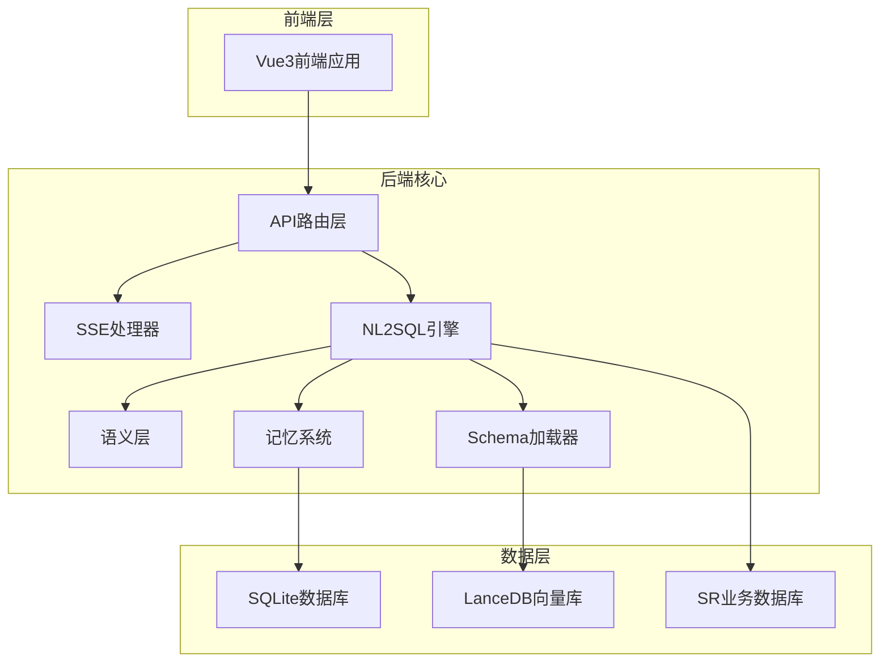
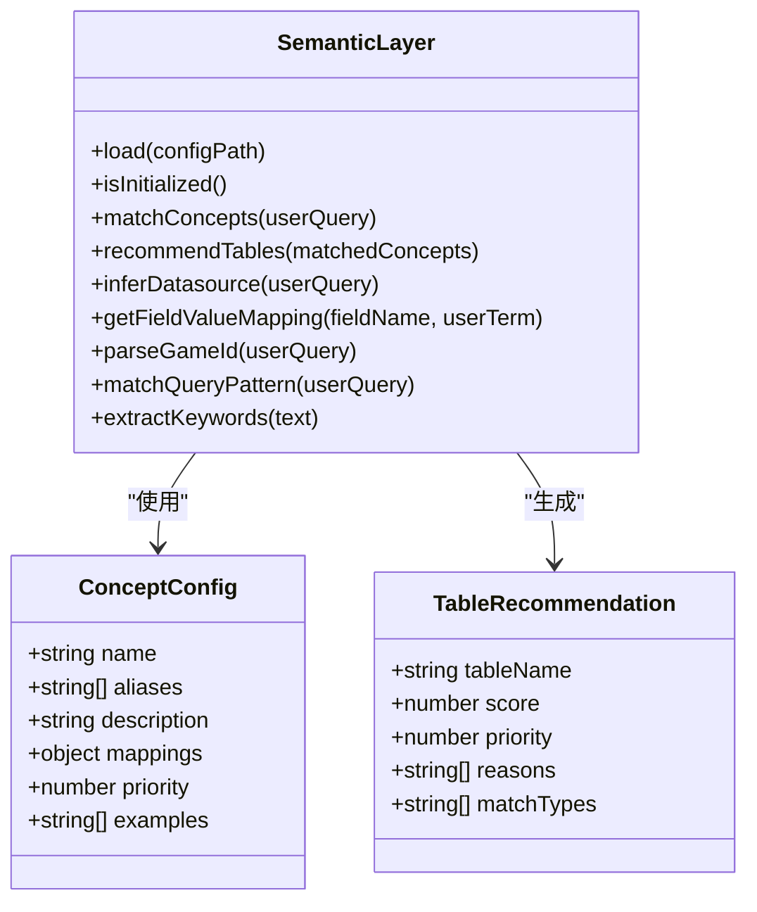
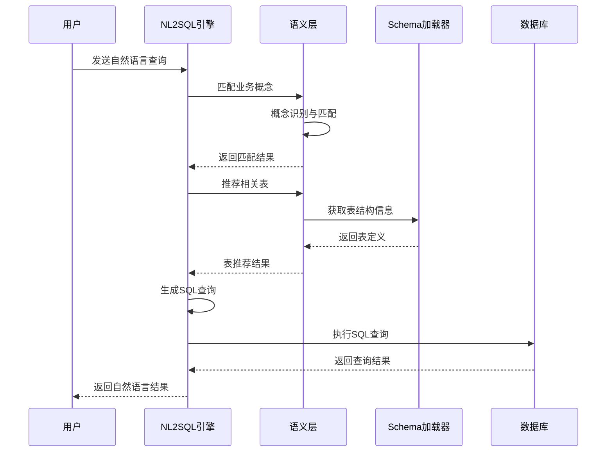
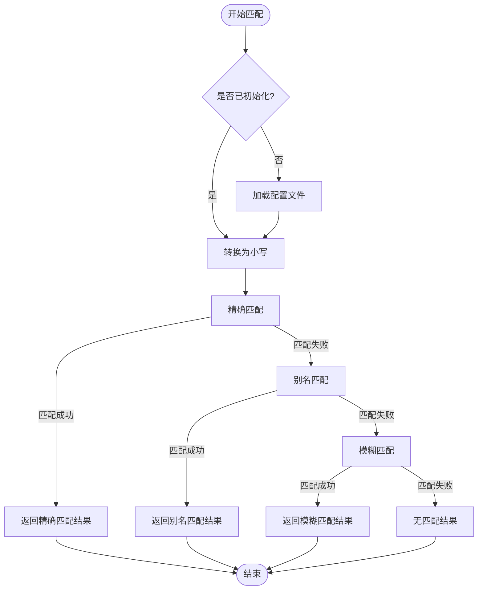
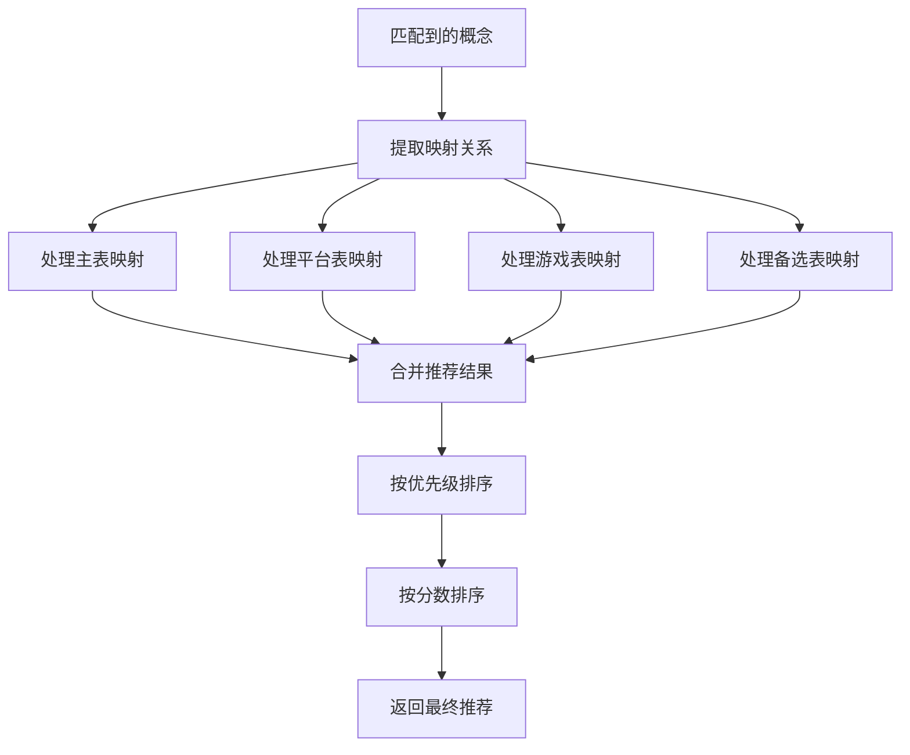
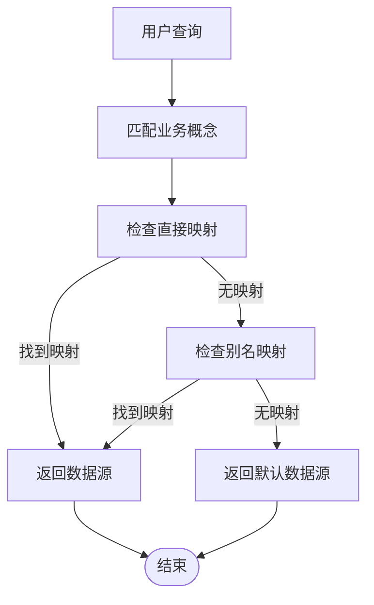
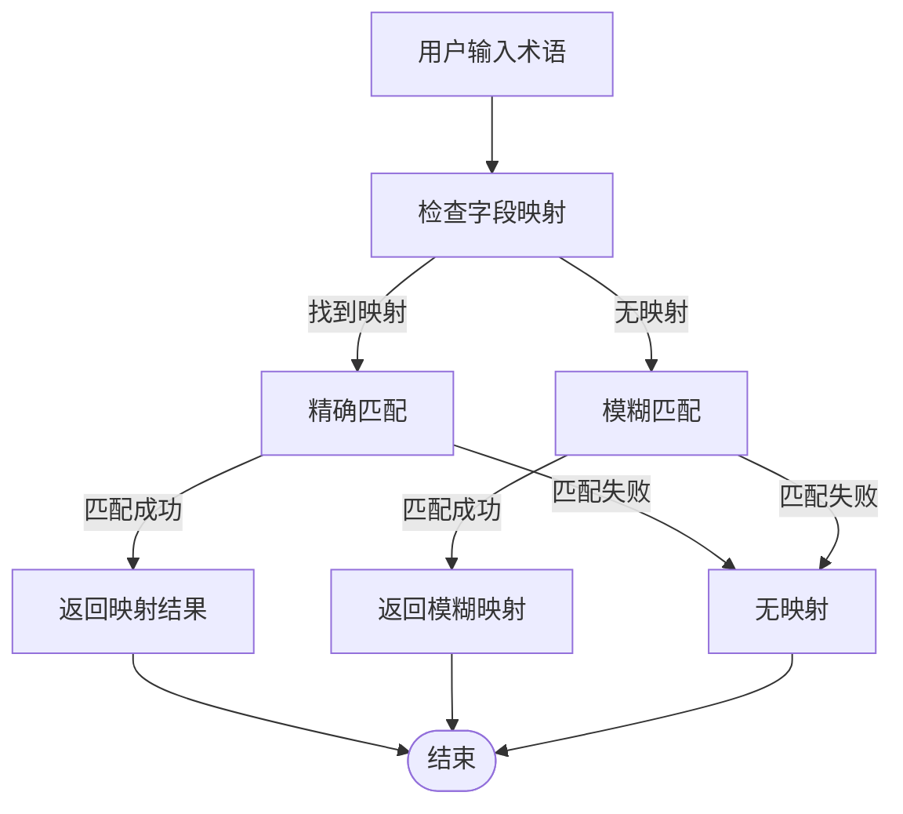
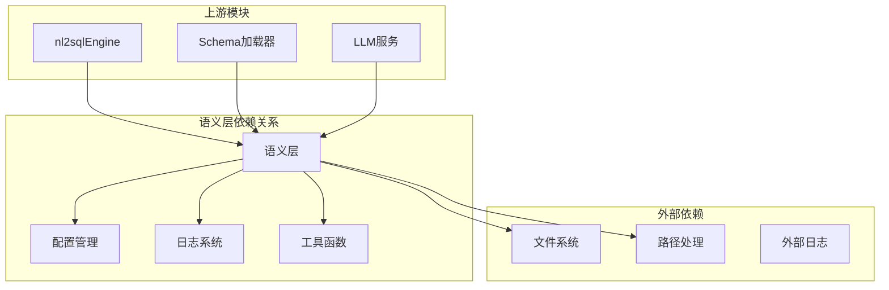

# 语义层系统

<cite>
**本文档引用的文件**
- [semanticLayer.js](file://backend/src/core/semanticLayer.js)
- [business-semantic-layer.json](file://backend/config/business-semantic-layer.json)
- [schemaLoader.js](file://backend/src/core/schemaLoader.js)
- [nl2sqlEngine.js](file://backend/src/core/nl2sqlEngine.js)
- [schemaTools.js](file://backend/src/core/schemaTools.js)
- [config.js](file://backend/src/core/config.js)
- [llmService.js](file://backend/src/core/llmService.js)
- [app.js](file://backend/src/app.js)
- [CLAUDE.md](file://CLAUDE.md)
- [后端架构审查与优化方案.md](file://docs/后端架构审查与优化方案.md)
</cite>

## 目录
1. [简介](#简介)
2. [项目结构](#项目结构)
3. [核心组件](#核心组件)
4. [架构概览](#架构概览)
5. [详细组件分析](#详细组件分析)
6. [依赖分析](#依赖分析)
7. [性能考虑](#性能考虑)
8. [故障排除指南](#故障排除指南)
9. [结论](#结论)
10. [附录](#附录)

## 简介

语义层系统是NL2SQL自然语言转SQL工具的核心组成部分，负责将用户的自然语言查询转换为机器可理解的业务概念，并建立业务概念与数据库物理结构之间的映射关系。该系统通过配置驱动的方式，实现了业务语义的标准化管理和动态扩展。

系统采用"概念-映射-推荐"的三层架构设计，通过业务概念抽象、语义映射和多粒度表达等核心功能，显著降低了用户使用自然语言查询数据库的门槛。语义层不仅能够识别用户输入中的业务术语，还能根据上下文提供智能的表推荐和字段映射，为后续的SQL生成提供准确的业务语义支撑。

## 项目结构

NL2SQL项目采用模块化架构设计，语义层系统作为核心模块之一，与其他模块协同工作形成完整的自然语言查询处理流程。

**图表来源**
- [app.js:14-194](file://backend/src/app.js#L14-L194)
- [CLAUDE.md:43-58](file://CLAUDE.md#L43-L58)

**章节来源**
- [CLAUDE.md:60-153](file://CLAUDE.md#L60-L153)
- [app.js:14-194](file://backend/src/app.js#L14-L194)

## 核心组件

### 语义层核心模块

语义层系统的核心模块是`semanticLayer.js`，它提供了完整的业务语义处理能力，包括概念匹配、表推荐、数据源映射等功能。

#### 核心功能架构

**图表来源**
- [semanticLayer.js:26-531](file://backend/src/core/semanticLayer.js#L26-L531)

#### 配置管理系统

系统采用JSON配置文件驱动的方式，通过`business-semantic-layer.json`定义业务概念和映射关系。配置文件支持多级嵌套结构，包含概念定义、查询模式、字段映射和数据源映射等核心要素。

**章节来源**
- [semanticLayer.js:26-115](file://backend/src/core/semanticLayer.js#L26-L115)
- [business-semantic-layer.json:1-189](file://backend/config/business-semantic-layer.json#L1-L189)

## 架构概览

语义层系统在整个NL2SQL架构中扮演着桥梁的角色，连接用户自然语言输入与数据库物理结构。系统通过多层次的匹配策略和智能推荐机制，实现了从自然语言到结构化查询的高效转换。

**图表来源**
- [nl2sqlEngine.js:132-151](file://backend/src/core/nl2sqlEngine.js#L132-L151)
- [semanticLayer.js:134-167](file://backend/src/core/semanticLayer.js#L134-L167)

## 详细组件分析

### 业务概念匹配引擎

业务概念匹配是语义层的核心功能，系统通过多层匹配策略识别用户输入中的业务术语。

#### 匹配策略层次

**图表来源**
- [semanticLayer.js:177-214](file://backend/src/core/semanticLayer.js#L177-L214)

#### 概念识别算法

系统采用多维度的概念识别算法，包括精确匹配、别名匹配和模糊匹配三种策略：

1. **精确匹配**：直接匹配业务概念名称
2. **别名匹配**：匹配概念的别名列表
3. **模糊匹配**：基于关键词重叠的智能匹配

**章节来源**
- [semanticLayer.js:134-167](file://backend/src/core/semanticLayer.js#L134-L167)
- [semanticLayer.js:177-214](file://backend/src/core/semanticLayer.js#L177-L214)

### 表推荐系统

表推荐系统基于匹配到的业务概念，智能推荐最相关的数据库表，为后续的SQL生成提供准确的表选择。

#### 推荐算法流程

**图表来源**
- [semanticLayer.js:238-306](file://backend/src/core/semanticLayer.js#L238-L306)

#### 推荐评分机制

系统采用多维度评分机制，综合考虑概念匹配分数、表优先级和匹配类型等因素：

- **概念匹配分数**：0-1之间的匹配强度
- **表优先级**：1-5级的表重要性等级
- **匹配类型权重**：精确匹配>别名匹配>模糊匹配

**章节来源**
- [semanticLayer.js:238-330](file://backend/src/core/semanticLayer.js#L238-L330)

### 数据源映射机制

数据源映射功能将业务概念映射到具体的数据库实例，支持新平台和老平台等不同数据源的智能识别。

#### 映射策略

**图表来源**
- [semanticLayer.js:367-386](file://backend/src/core/semanticLayer.js#L367-L386)

**章节来源**
- [semanticLayer.js:342-386](file://backend/src/core/semanticLayer.js#L342-L386)

### 字段值映射系统

字段值映射功能处理用户输入中的业务术语与数据库字段值之间的转换，支持精确匹配和模糊匹配两种模式。

#### 映射处理流程

**图表来源**
- [semanticLayer.js:399-433](file://backend/src/core/semanticLayer.js#L399-L433)

**章节来源**
- [semanticLayer.js:399-464](file://backend/src/core/semanticLayer.js#L399-L464)

### 查询模式匹配

查询模式匹配功能识别用户查询的业务模式，支持复杂的多概念组合查询。

#### 模式匹配算法

系统通过比较查询中出现的业务概念与预定义查询模式的要求概念，计算匹配分数来确定查询模式。

**章节来源**
- [semanticLayer.js:476-509](file://backend/src/core/semanticLayer.js#L476-L509)

## 依赖分析

语义层系统与NL2SQL架构中的其他模块存在紧密的依赖关系，形成了完整的查询处理链路。

**图表来源**
- [semanticLayer.js:14-18](file://backend/src/core/semanticLayer.js#L14-L18)
- [nl2sqlEngine.js:38-45](file://backend/src/core/nl2sqlEngine.js#L38-L45)

### 模块耦合度分析

语义层系统在设计上遵循了低耦合高内聚的原则，通过清晰的接口定义与外部模块交互：

- **内部耦合**：模块内部功能相对独立，职责明确
- **外部依赖**：主要依赖配置管理和日志系统
- **向上游暴露**：提供简洁的公共接口供其他模块调用

**章节来源**
- [semanticLayer.js:515-531](file://backend/src/core/semanticLayer.js#L515-L531)
- [nl2sqlEngine.js:38-45](file://backend/src/core/nl2sqlEngine.js#L38-L45)

## 性能考虑

语义层系统在设计时充分考虑了性能优化，采用了多种策略来提升响应速度和处理效率。

### 缓存策略

系统实现了多层次的缓存机制：

1. **配置文件缓存**：避免重复加载配置文件
2. **匹配结果缓存**：缓存常用的匹配结果
3. **向量索引缓存**：缓存向量搜索结果

### 优化技术

- **关键词提取优化**：使用正则表达式高效提取中文和英文关键词
- **匹配算法优化**：采用多层匹配策略，优先使用高效的匹配方法
- **内存管理优化**：合理控制内存使用，避免内存泄漏

## 故障排除指南

### 常见问题诊断

#### 配置文件加载失败

**症状**：系统无法加载业务语义配置文件，使用内置配置

**解决方案**：
1. 检查配置文件路径是否正确
2. 验证JSON格式是否合法
3. 确认文件权限设置

#### 概念匹配不准确

**症状**：业务概念识别结果不符合预期

**解决方案**：
1. 检查概念别名配置是否完整
2. 验证关键词提取算法
3. 调整匹配权重参数

#### 表推荐不准确

**症状**：推荐的表与查询需求不符

**解决方案**：
1. 检查映射配置的准确性
2. 验证表优先级设置
3. 调整推荐评分算法

**章节来源**
- [semanticLayer.js:52-73](file://backend/src/core/semanticLayer.js#L52-L73)
- [semanticLayer.js:177-214](file://backend/src/core/semanticLayer.js#L177-L214)

## 结论

语义层系统通过精心设计的架构和算法，成功地将复杂的业务语义转换为精确的数据库查询。系统采用配置驱动的方式，具有良好的可扩展性和维护性。通过多层匹配策略和智能推荐机制，系统能够准确理解用户的自然语言查询，并提供高质量的业务语义支撑。

未来的发展方向包括进一步优化匹配算法、增强配置管理功能、提升系统性能等方面。随着业务需求的不断变化，语义层系统将继续演进，为用户提供更加智能化的自然语言查询体验。

## 附录

### 配置文件格式规范

业务语义配置文件采用JSON格式，包含以下核心字段：

- **version**：配置版本号
- **concepts**：业务概念定义数组
- **query_patterns**：查询模式定义
- **field_mappings**：字段值映射
- **datasource_mappings**：数据源映射

### 使用示例

系统提供了丰富的使用示例，包括：

- 基础概念匹配示例
- 多概念组合查询示例
- 字段值映射示例
- 数据源识别示例

### 开发指南

开发者可以通过以下方式扩展语义层功能：

1. 添加新的业务概念定义
2. 扩展匹配算法
3. 增强推荐系统
4. 优化配置管理