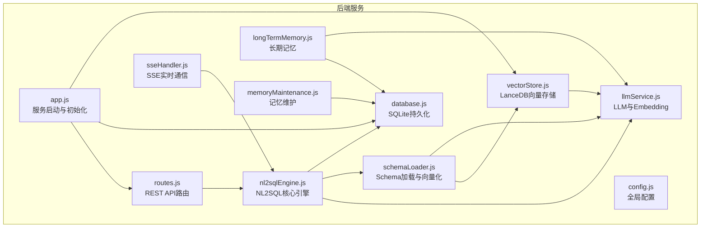
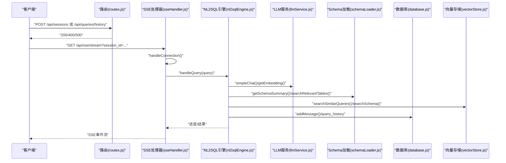
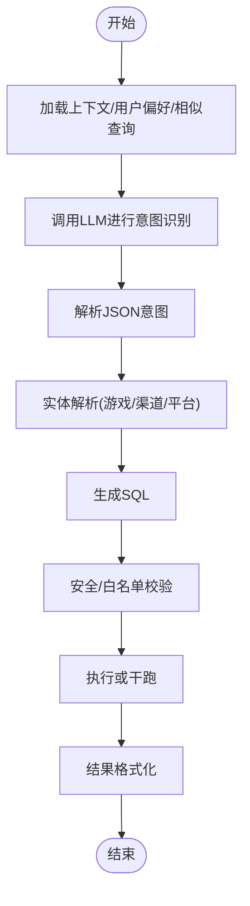
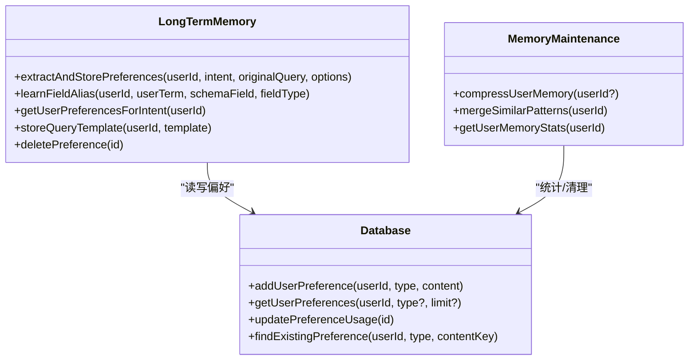
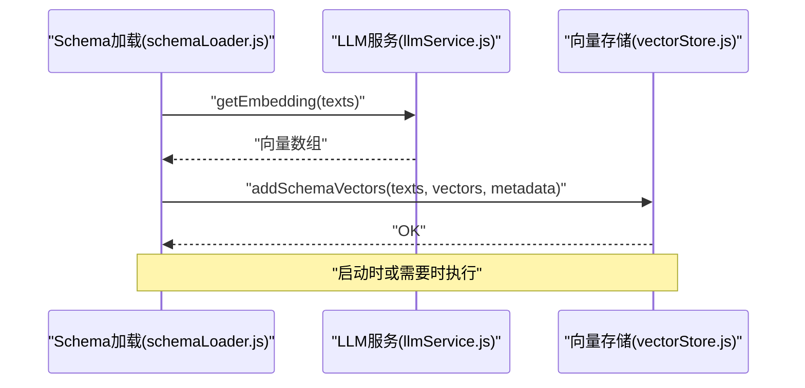
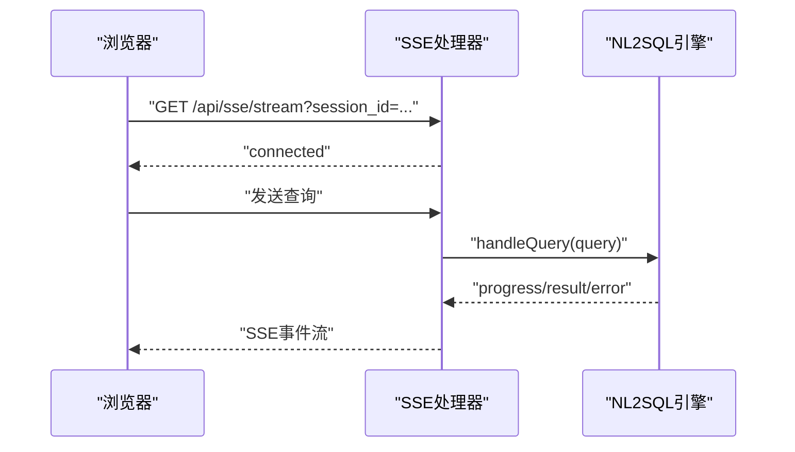
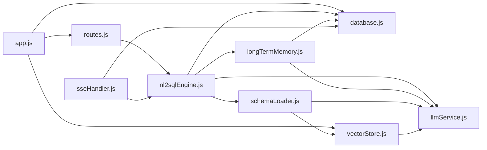

# 核心特性

<cite>
**本文引用的文件**
- [app.js](file://backend/src/app.js)
- [routes.js](file://backend/src/core/routes.js)
- [config.js](file://backend/src/core/config.js)
- [llmService.js](file://backend/src/core/llmService.js)
- [database.js](file://backend/src/core/database.js)
- [schemaLoader.js](file://backend/src/core/schemaLoader.js)
- [nl2sqlEngine.js](file://backend/src/core/nl2sqlEngine.js)
- [sseHandler.js](file://backend/src/core/sseHandler.js)
- [longTermMemory.js](file://backend/src/memory/longTermMemory.js)
- [vectorStore.js](file://backend/src/memory/vectorStore.js)
- [memoryMaintenance.js](file://backend/src/memory/memoryMaintenance.js)
- [package.json](file://backend/package.json)
</cite>

## 目录
1. [简介](#简介)
2. [项目结构](#项目结构)
3. [核心组件](#核心组件)
4. [架构总览](#架构总览)
5. [详细组件分析](#详细组件分析)
6. [依赖关系分析](#依赖关系分析)
7. [性能考量](#性能考量)
8. [故障排查指南](#故障排查指南)
9. [结论](#结论)
10. [附录](#附录)

## 简介
本文件面向NL2SQL项目的“核心特性”，围绕四大模块进行深入说明：
- NL2SQL引擎：自然语言理解、意图识别、实体解析、SQL生成与校验、结果格式化
- 智能记忆系统：用户偏好学习、长期记忆管理、分级保留与压缩
- 向量检索系统：基于LanceDB的Schema与查询历史语义检索
- 实时通信功能：通过SSE实现流畅的对话体验

我们将解释每个特性的原理、技术实现、使用场景与优势，并给出它们之间的依赖关系与协同工作机制。

## 项目结构
后端采用模块化设计，核心模块位于 backend/src 下：
- core：服务启动、路由、LLM服务、数据库、Schema加载、NL2SQL引擎、SSE处理、配置
- memory：长期记忆、向量存储、记忆维护
- utils：日志工具
- data：SQLite与LanceDB数据目录
- logs：日志文件

图表来源
- [app.js:1-238](file://backend/src/app.js#L1-L238)
- [routes.js:1-895](file://backend/src/core/routes.js#L1-L895)
- [config.js:1-332](file://backend/src/core/config.js#L1-L332)
- [llmService.js:1-432](file://backend/src/core/llmService.js#L1-L432)
- [database.js:1-850](file://backend/src/core/database.js#L1-L850)
- [schemaLoader.js:1-732](file://backend/src/core/schemaLoader.js#L1-L732)
- [nl2sqlEngine.js:1-1920](file://backend/src/core/nl2sqlEngine.js#L1-L1920)
- [sseHandler.js:1-349](file://backend/src/core/sseHandler.js#L1-L349)
- [longTermMemory.js:1-1134](file://backend/src/memory/longTermMemory.js#L1-L1134)
- [vectorStore.js:1-442](file://backend/src/memory/vectorStore.js#L1-L442)
- [memoryMaintenance.js:1-415](file://backend/src/memory/memoryMaintenance.js#L1-L415)

章节来源
- [app.js:1-238](file://backend/src/app.js#L1-L238)
- [routes.js:1-895](file://backend/src/core/routes.js#L1-L895)

## 核心组件
- NL2SQL引擎：负责意图识别、实体解析、SQL生成、校验与结果格式化
- 智能记忆系统：长期记忆提取、存储、检索与维护
- 向量检索系统：Schema与查询历史的向量化与语义检索
- 实时通信：SSE连接管理与流式消息推送

章节来源
- [nl2sqlEngine.js:1-1920](file://backend/src/core/nl2sqlEngine.js#L1-L1920)
- [longTermMemory.js:1-1134](file://backend/src/memory/longTermMemory.js#L1-L1134)
- [vectorStore.js:1-442](file://backend/src/memory/vectorStore.js#L1-L442)
- [sseHandler.js:1-349](file://backend/src/core/sseHandler.js#L1-L349)

## 架构总览
NL2SQL服务启动后，依次初始化SQLite、LanceDB、Schema元数据与自修复调度器，然后对外提供REST API与SSE流式接口。NL2SQL引擎贯穿LLM、Schema、数据库与向量检索，配合长期记忆实现个性化与智能化。

图表来源
- [routes.js:1-895](file://backend/src/core/routes.js#L1-L895)
- [sseHandler.js:1-349](file://backend/src/core/sseHandler.js#L1-L349)
- [nl2sqlEngine.js:1-1920](file://backend/src/core/nl2sqlEngine.js#L1-L1920)
- [llmService.js:1-432](file://backend/src/core/llmService.js#L1-L432)
- [schemaLoader.js:1-732](file://backend/src/core/schemaLoader.js#L1-L732)
- [vectorStore.js:1-442](file://backend/src/memory/vectorStore.js#L1-L442)
- [database.js:1-850](file://backend/src/core/database.js#L1-L850)

## 详细组件分析

### NL2SQL引擎：自然语言处理与SQL生成
- 意图识别：结合上下文、用户偏好与相似历史查询，构造系统提示词，调用LLM生成JSON格式的意图结构（时间范围、维度、指标、筛选条件、排序、限制、置信度等）
- 实体解析：优先使用长期记忆中的字段别名映射，其次回退到数据库或硬编码映射，支持游戏名、渠道名、平台术语等
- 平台术语解析：从用户输入或长期记忆中识别“新平台/老平台”到数据源标识的映射
- SQL生成与校验：基于意图生成SQL，进行安全与白名单校验，支持干跑模式
- 结果格式化：将查询结果转为自然语言摘要
- 澄清机制：在信息不足时生成澄清问题，支持默认选项确认与补充回答合并

图表来源
- [nl2sqlEngine.js:493-776](file://backend/src/core/nl2sqlEngine.js#L493-L776)
- [nl2sqlEngine.js:191-296](file://backend/src/core/nl2sqlEngine.js#L191-L296)
- [nl2sqlEngine.js:305-379](file://backend/src/core/nl2sqlEngine.js#L305-L379)

章节来源
- [nl2sqlEngine.js:1-1920](file://backend/src/core/nl2sqlEngine.js#L1-L1920)

### 智能记忆系统：用户偏好学习与长期记忆管理
- 偏好提取与存储：基于查询的成功性、置信度、模式价值与频率，决定是否存储；支持LLM智能提炼与逻辑判断
- 字段别名学习：记录用户术语到Schema字段/值的映射，支持游戏ID直存与双记录格式
- 查询模式与指标/维度偏好：按使用次数与时间排序，用于后续意图补全
- 记忆维护：分级保留策略（高频永久、中频90天、低频30天、字段别名365天）、相似模式合并、定期压缩清理

图表来源
- [longTermMemory.js:311-484](file://backend/src/memory/longTermMemory.js#L311-L484)
- [memoryMaintenance.js:69-189](file://backend/src/memory/memoryMaintenance.js#L69-L189)
- [database.js:609-781](file://backend/src/core/database.js#L609-L781)

章节来源
- [longTermMemory.js:1-1134](file://backend/src/memory/longTermMemory.js#L1-L1134)
- [memoryMaintenance.js:1-415](file://backend/src/memory/memoryMaintenance.js#L1-L415)
- [database.js:1-850](file://backend/src/core/database.js#L1-L850)

### 向量检索系统：基于LanceDB的语义搜索
- 初始化：连接LanceDB，创建schema_vectors与query_vectors表
- Schema向量化：将表/字段描述转为Embedding并入库，支持批量与增量
- 查询历史向量化：将用户查询向量化存储，支持相似查询检索
- 搜索：支持Schema表/字段语义检索与查询历史相似度检索
- 状态检查：统计向量表行数、是否存在有效Schema向量

图表来源
- [schemaLoader.js:195-290](file://backend/src/core/schemaLoader.js#L195-L290)
- [llmService.js:324-379](file://backend/src/core/llmService.js#L324-L379)
- [vectorStore.js:160-191](file://backend/src/memory/vectorStore.js#L160-L191)

章节来源
- [vectorStore.js:1-442](file://backend/src/memory/vectorStore.js#L1-L442)
- [schemaLoader.js:1-732](file://backend/src/core/schemaLoader.js#L1-L732)
- [llmService.js:1-432](file://backend/src/core/llmService.js#L1-L432)

### 实时通信功能：SSE实现流畅对话体验
- 连接管理：建立SSE连接，支持多标签页；记录会话ID、用户ID、活跃状态
- 查询处理：接收查询，调用NL2SQL引擎，流式发送进度与结果
- 广播机制：同一会话的多个连接共享消息
- 统计信息：连接数、会话连接数、活跃连接列表

图表来源
- [sseHandler.js:43-112](file://backend/src/core/sseHandler.js#L43-L112)
- [sseHandler.js:218-280](file://backend/src/core/sseHandler.js#L218-L280)

章节来源
- [sseHandler.js:1-349](file://backend/src/core/sseHandler.js#L1-L349)

## 依赖关系分析
- 启动依赖：app.js负责加载dotenv、导入核心模块、初始化数据库与向量库、加载Schema、启动自修复、启动HTTP与SSE
- 路由依赖：routes.js提供健康检查、Schema查询、会话管理、查询历史、偏好接口与统计信息
- 引擎依赖：nl2sqlEngine.js依赖llmService、schemaLoader、database、longTermMemory、vectorStore
- 记忆依赖：longTermMemory依赖database、llmService、config；memoryMaintenance依赖database
- 向量依赖：schemaLoader依赖llmService与vectorStore；vectorStore依赖llmService与config
- SSE依赖：sseHandler依赖database、nl2sqlEngine

图表来源
- [app.js:1-238](file://backend/src/app.js#L1-L238)
- [routes.js:1-895](file://backend/src/core/routes.js#L1-L895)
- [nl2sqlEngine.js:1-1920](file://backend/src/core/nl2sqlEngine.js#L1-L1920)
- [longTermMemory.js:1-1134](file://backend/src/memory/longTermMemory.js#L1-L1134)
- [vectorStore.js:1-442](file://backend/src/memory/vectorStore.js#L1-L442)
- [schemaLoader.js:1-732](file://backend/src/core/schemaLoader.js#L1-L732)
- [llmService.js:1-432](file://backend/src/core/llmService.js#L1-L432)
- [database.js:1-850](file://backend/src/core/database.js#L1-L850)
- [sseHandler.js:1-349](file://backend/src/core/sseHandler.js#L1-L349)

章节来源
- [app.js:1-238](file://backend/src/app.js#L1-L238)
- [routes.js:1-895](file://backend/src/core/routes.js#L1-L895)

## 性能考量
- LLM与Embedding：配置超时、重试与分批向量化，避免单次请求过大
- 数据库：SQLite事务、索引与参数化查询，减少锁竞争与SQL注入风险
- 向量检索：批量Embedding、topK限制、按上下文优先级排序
- SSE：多连接共享、禁用缓冲、及时清理断开连接
- 记忆维护：按使用频率分级清理，定期合并相似模式，降低存储膨胀

## 故障排查指南
- 启动失败：检查.env配置（LLM API密钥、SR数据库URL），查看日志
- LLM调用失败：检查API Base/Key、超时设置、网络连通性
- 向量库初始化失败：确认LanceDB路径权限与磁盘空间
- Schema加载失败：检查schema-metadata.json格式与字段完整性
- SSE连接异常：确认会话ID存在、客户端网络与Nginx缓冲设置
- 记忆清理异常：检查数据库连接与SQL执行权限

章节来源
- [config.js:300-332](file://backend/src/core/config.js#L300-L332)
- [llmService.js:157-206](file://backend/src/core/llmService.js#L157-L206)
- [vectorStore.js:55-85](file://backend/src/memory/vectorStore.js#L55-L85)
- [schemaLoader.js:69-122](file://backend/src/core/schemaLoader.js#L69-L122)
- [sseHandler.js:43-112](file://backend/src/core/sseHandler.js#L43-L112)
- [memoryMaintenance.js:69-189](file://backend/src/memory/memoryMaintenance.js#L69-L189)

## 结论
NL2SQL项目通过四大核心特性实现了从自然语言到SQL的智能转换与个性化记忆增强：
- NL2SQL引擎提供强大的意图识别与实体解析能力
- 智能记忆系统持续学习用户偏好，提升后续查询质量
- 向量检索系统支撑Schema与查询历史的语义匹配
- SSE实现实时流式交互，显著改善用户体验

四者相互协作，形成闭环：用户输入经NL2SQL引擎处理，结合长期记忆与向量检索优化，通过SSE反馈给用户，同时记录到数据库与向量库，为后续学习与检索提供数据基础。

## 附录
- 环境与依赖：Node.js 18+，Express、vectordb、sqlite3、dotenv、uuid、dayjs、node-cron
- 启动方式：开发环境使用 nodemon，生产环境使用 node
- 配置要点：LLM API Base/Key、Embedding模型与维度、数据库路径、向量库路径、白名单与安全阈值

章节来源
- [package.json:1-28](file://backend/package.json#L1-L28)
- [config.js:1-332](file://backend/src/core/config.js#L1-L332)