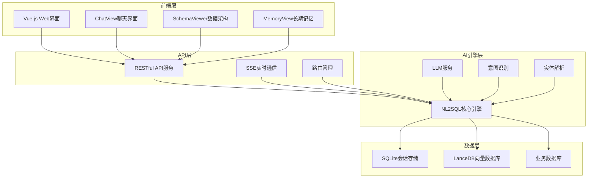
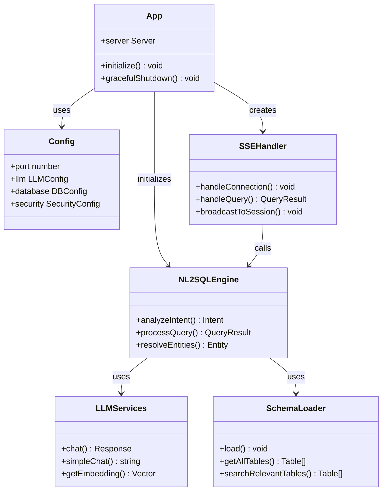
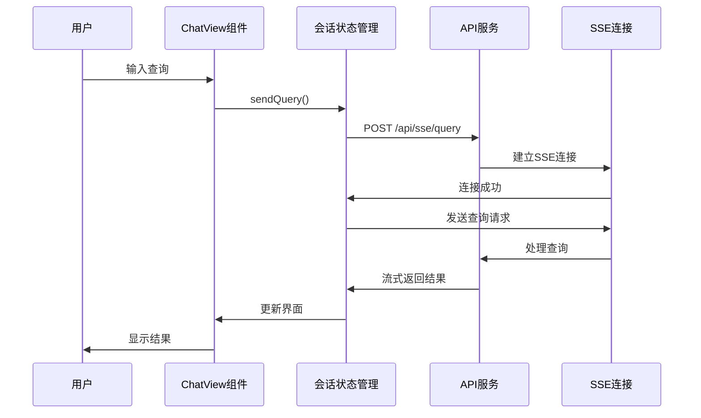
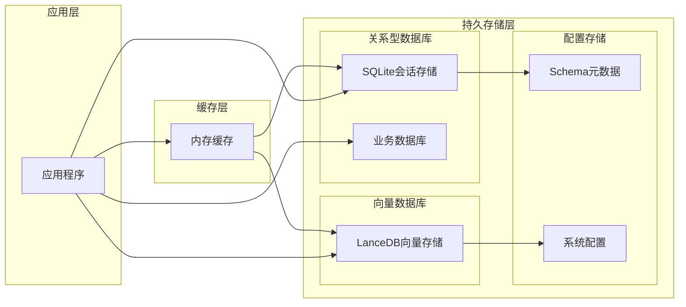

# 项目介绍

<cite>
**本文档引用的文件**
- [backend/src/app.js](file://backend/src/app.js)
- [backend/package.json](file://backend/package.json)
- [frontend/package.json](file://frontend/package.json)
- [backend/src/core/config.js](file://backend/src/core/config.js)
- [backend/src/core/nl2sqlEngine.js](file://backend/src/core/nl2sqlEngine.js)
- [backend/src/core/schemaLoader.js](file://backend/src/core/schemaLoader.js)
- [backend/src/core/llmService.js](file://backend/src/core/llmService.js)
- [backend/src/core/routes.js](file://backend/src/core/routes.js)
- [backend/src/core/sseHandler.js](file://backend/src/core/sseHandler.js)
- [backend/src/memory/longTermMemory.js](file://backend/src/memory/longTermMemory.js)
- [backend/src/memory/vectorStore.js](file://backend/src/memory/vectorStore.js)
- [backend/config/schema-metadata.json](file://backend/config/schema-metadata.json)
- [frontend/src/views/ChatView.vue](file://frontend/src/views/ChatView.vue)
- [frontend/src/stores/session.js](file://frontend/src/stores/session.js)
- [frontend/src/utils/api.js](file://frontend/src/utils/api.js)
- [frontend/src/App.vue](file://frontend/src/App.vue)
</cite>

## 目录
1. [项目概述](#项目概述)
2. [核心价值主张](#核心价值主张)
3. [解决的实际问题](#解决的实际问题)
4. [业务场景](#业务场景)
5. [目标用户群体](#目标用户群体)
6. [技术创新点](#技术创新点)
7. [竞争优势](#竞争优势)
8. [项目架构概览](#项目架构概览)
9. [详细组件分析](#详细组件分析)
10. [性能考虑](#性能考虑)
11. [故障排除指南](#故障排除指南)
12. [项目愿景](#项目愿景)

## 项目概述

NL2SQL是一个基于人工智能的自然语言到SQL查询转换系统。该项目旨在通过先进的大语言模型（LLM）技术和向量数据库技术，将自然语言查询无缝转换为精确的SQL语句，从而大幅降低数据分析的技术门槛。

该项目采用前后端分离架构，后端基于Node.js构建RESTful API和SSE实时通信服务，前端使用Vue.js构建现代化的用户界面。系统集成了多种AI技术，包括意图识别、实体解析、智能记忆和语义检索等功能。

## 核心价值主张

NL2SQL的核心价值在于"让每个人都能轻松进行数据分析"。通过将复杂的SQL语法抽象化，用户只需用自然语言描述数据需求，系统就能自动生成准确的SQL查询并返回可视化结果。

### 主要价值体现

**降低学习成本**：用户无需掌握复杂的SQL语法，只需用日常语言表达数据需求
**提高查询效率**：从传统的"思考SQL语法+编写SQL+调试"的循环，转变为"直接表达需求+获得结果"
**减少技术门槛**：业务分析师、管理者等非技术用户也能进行复杂的数据分析
**提升协作效率**：团队成员可以基于自然语言进行数据讨论和查询

## 解决的实际问题

### 技术层面的问题

**SQL学习曲线陡峭**：传统数据分析需要大量时间学习SQL语法和各种函数
**查询编写错误率高**：复杂的JOIN、子查询、聚合函数容易出错
**调试困难**：SQL查询错误定位和修复耗时耗力
**重复工作量大**：相似查询需要反复编写和调整

### 业务层面的问题

**决策效率低下**：从提出问题到获得结果的时间过长
**跨部门协作障碍**：技术部门和业务部门之间存在沟通壁垒
**数据孤岛现象**：不同系统的数据难以统一分析
**响应速度慢**：紧急查询需求无法及时满足

## 业务场景

### 商业智能分析

系统能够支持企业级的商业智能分析需求，包括：

- **销售数据分析**：自动分析各渠道、各产品的销售趋势和表现
- **用户行为分析**：追踪用户生命周期价值和行为模式
- **财务报表生成**：自动生成各类财务报表和分析报告
- **市场洞察分析**：基于多维度数据进行市场趋势分析

### 实时查询服务

提供实时的数据查询能力，支持：

- **仪表板数据刷新**：实时展示关键业务指标
- **动态报表生成**：根据用户需求即时生成分析报表
- **异常监控告警**：自动检测业务异常并生成告警
- **多终端访问**：支持Web、移动端等多种访问方式

### 数据探索工具

为数据科学家和分析师提供强大的数据探索能力：

- **快速数据验证**：验证数据质量和完整性
- **假设检验**：支持A/B测试和假设验证
- **关联分析**：发现数据间的潜在关联关系
- **预测建模**：辅助构建预测模型

## 目标用户群体

### 业务分析师

**特点**：具备业务知识但缺乏编程技能
**需求**：快速获取业务洞察，支持日常报表制作
**价值**：通过自然语言快速生成复杂查询，提高分析效率

### 数据科学家

**特点**：具备统计学和机器学习背景
**需求**：快速验证假设，进行数据探索和特征工程
**价值**：专注于算法开发和模型优化，减少数据准备时间

### 管理者和决策者

**特点**：关注业务结果而非技术细节
**需求**：及时获取关键业务指标，支持决策制定
**价值**：通过直观的可视化结果了解业务状况

### IT技术人员

**特点**：需要处理大量数据查询需求
**需求**：标准化查询流程，提高服务质量
**价值**：专注于系统架构和性能优化，而非重复的查询编写

## 技术创新点

### 智能意图识别

系统采用先进的LLM技术进行自然语言理解，能够：

- **上下文感知**：理解多轮对话中的上下文关系
- **意图澄清**：当信息不足时主动询问用户
- **多模态理解**：支持文本、图表等多种形式的输入
- **领域自适应**：能够适应不同行业的专业术语

### 智能记忆系统

独特的长期记忆机制，包括：

- **用户偏好学习**：自动学习用户的查询习惯和偏好
- **实体映射管理**：维护用户自定义的实体映射关系
- **查询模板管理**：支持用户创建和复用查询模板
- **个性化推荐**：基于历史查询推荐相关分析

### 语义检索增强

集成向量数据库技术：

- **Schema向量化**：将数据库结构信息向量化存储
- **查询相似度**：基于语义相似度推荐相关查询
- **智能搜索**：支持基于业务概念的智能搜索
- **跨表关联**：自动发现和推荐相关的数据表

### 实时交互体验

提供流畅的实时交互体验：

- **SSE流式传输**：实时显示查询进度和中间结果
- **渐进式反馈**：逐步展示分析过程和思路
- **并发处理**：支持多用户同时进行数据分析
- **断线重连**：保证会话的连续性和可靠性

## 竞争优势

### 技术架构优势

**模块化设计**：清晰的模块划分使得系统易于维护和扩展
**可插拔架构**：支持不同的LLM提供商和数据库后端
**高性能设计**：优化的缓存策略和查询执行计划
**安全性保障**：完善的SQL注入防护和权限控制

### 用户体验优势

**零学习成本**：用户无需学习SQL即可进行复杂分析
**自然交互**：支持多轮对话和上下文理解
**个性化服务**：根据用户习惯提供定制化体验
**多语言支持**：支持中文等多语言的自然语言处理

### 业务价值优势

**成本效益**：大幅降低数据分析的人力成本
**效率提升**：显著提高数据分析和决策效率
**质量保证**：减少人为错误，提高分析准确性
**规模化能力**：支持大规模并发查询和分析

## 项目架构概览

NL2SQL采用现代化的微服务架构，分为前端Web界面、后端API服务和数据存储三个主要层次。

**架构图来源**
- [backend/src/app.js:56-87](file://backend/src/app.js#L56-L87)
- [backend/src/core/routes.js:34-35](file://backend/src/core/routes.js#L34-L35)
- [backend/src/core/sseHandler.js:43-112](file://backend/src/core/sseHandler.js#L43-L112)

## 详细组件分析

### 后端核心架构

后端采用Express.js框架构建，提供RESTful API和SSE实时通信服务。

**类图来源**
- [backend/src/app.js:97-166](file://backend/src/app.js#L97-L166)
- [backend/src/core/nl2sqlEngine.js:394-677](file://backend/src/core/nl2sqlEngine.js#L394-L677)
- [backend/src/core/llmService.js:222-311](file://backend/src/core/llmService.js#L222-L311)
- [backend/src/core/schemaLoader.js:69-122](file://backend/src/core/schemaLoader.js#L69-L122)
- [backend/src/core/sseHandler.js:43-112](file://backend/src/core/sseHandler.js#L43-L112)

### 前端用户界面

前端采用Vue.js 3构建，提供现代化的用户交互体验。

**序列图来源**
- [frontend/src/views/ChatView.vue:196-214](file://frontend/src/views/ChatView.vue#L196-L214)
- [frontend/src/stores/session.js:299-328](file://frontend/src/stores/session.js#L299-L328)
- [frontend/src/utils/api.js:246-251](file://frontend/src/utils/api.js#L246-L251)

### 数据存储架构

系统采用多层存储架构，确保数据的高效管理和持久化。

**架构图来源**
- [backend/src/core/config.js:97-130](file://backend/src/core/config.js#L97-L130)
- [backend/src/memory/vectorStore.js:55-85](file://backend/src/memory/vectorStore.js#L55-L85)
- [backend/config/schema-metadata.json:1-800](file://backend/config/schema-metadata.json#L1-L800)

## 性能考虑

### 查询性能优化

系统采用了多层次的性能优化策略：

**缓存策略**
- Schema元数据缓存：避免重复加载和解析
- 查询结果缓存：对频繁访问的数据进行缓存
- 向量数据缓存：减少向量计算的重复执行

**并发处理**
- 连接池管理：优化数据库连接的使用
- 异步处理：非阻塞的查询执行和响应
- 负载均衡：支持多实例部署和水平扩展

**资源管理**
- 内存优化：合理的内存使用和垃圾回收
- 网络优化：高效的网络通信和数据传输
- CPU优化：智能的任务调度和资源分配

### 可扩展性设计

系统具备良好的可扩展性，支持不同规模的应用需求：

**水平扩展**
- 无状态设计：支持多实例部署
- 数据库分离：业务数据和会话数据分离存储
- 缓存集群：支持分布式缓存部署

**垂直扩展**
- 模块化架构：支持功能模块的独立升级
- 插件机制：支持第三方服务的集成
- 配置驱动：通过配置调整系统行为

## 故障排除指南

### 常见问题诊断

**连接问题**
- 检查LLM API配置是否正确
- 验证数据库连接字符串
- 确认网络连通性和防火墙设置

**性能问题**
- 监控系统资源使用情况
- 分析慢查询日志
- 优化缓存配置和索引

**功能异常**
- 检查日志文件获取详细错误信息
- 验证Schema配置的完整性
- 确认用户权限和访问控制

### 调试工具和方法

**日志分析**
- 启用详细日志模式进行问题定位
- 使用结构化日志格式便于分析
- 设置适当的日志级别避免信息过载

**监控指标**
- 监控系统性能关键指标
- 设置告警阈值及时发现问题
- 定期分析性能趋势和瓶颈

**测试方法**
- 单元测试覆盖核心功能
- 集成测试验证系统完整性
- 压力测试评估系统极限

## 项目愿景

NL2SQL致力于成为下一代数据分析平台，通过AI技术消除数据获取的技术壁垒，让每个人都能轻松进行数据探索和分析。

### 短期目标（1年内）

**技术完善**
- 完善多语言支持，扩展到英文等主要国际语言
- 优化查询性能，支持更大规模的数据集
- 增强错误处理和异常恢复能力

**用户体验提升**
- 简化安装和部署流程
- 提供更丰富的可视化分析功能
- 增强移动端访问体验

### 中期目标（3年内）

**生态建设**
- 建立开发者社区和生态系统
- 提供插件和扩展机制
- 与主流数据分析工具集成

**智能化升级**
- 更高级别的自然语言理解
- 自动化的数据洞察和建议
- 预测性分析能力

### 长期愿景（5-10年）

**行业领导者**
- 成为数据分析领域的标准工具
- 建立完整的数据智能生态系统
- 推动整个行业向AI驱动转型

**技术创新前沿**
- 探索最新的AI和机器学习技术
- 开发革命性的数据分析方法
- 培养下一代数据科学人才

NL2SQL不仅是一个技术产品，更是推动数据民主化的重要工具。通过持续的技术创新和用户体验优化，我们相信NL2SQL将成为每个组织不可或缺的数据分析伙伴，真正实现"让数据说话，让洞察触手可及"的愿景。