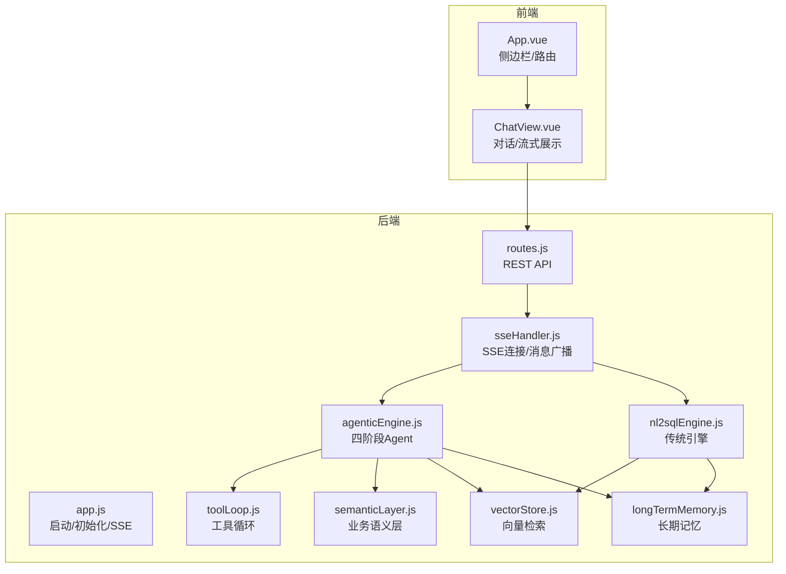
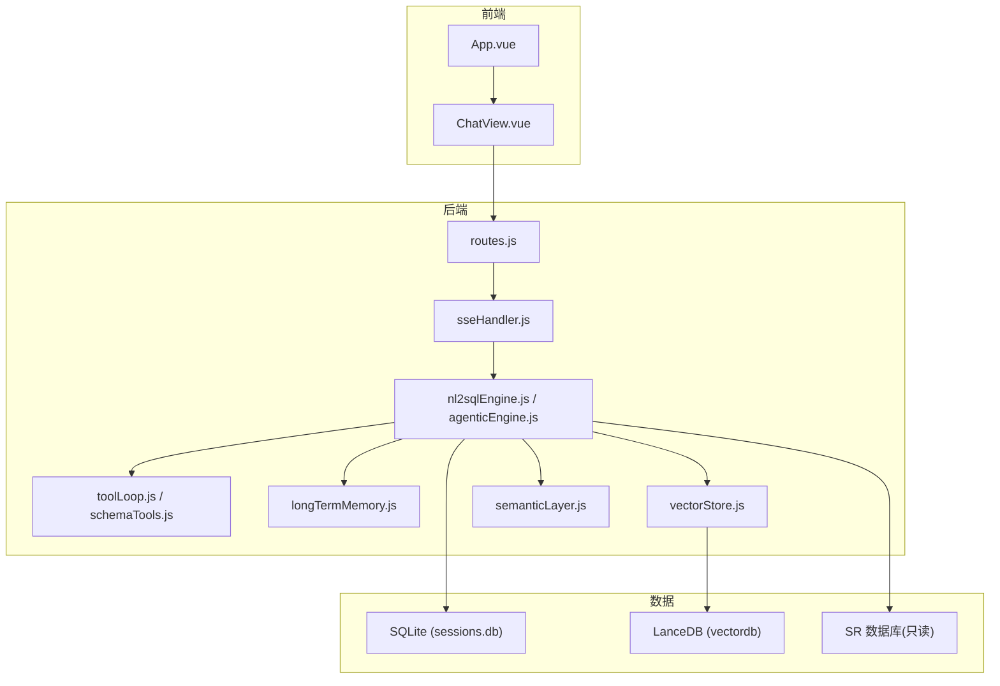
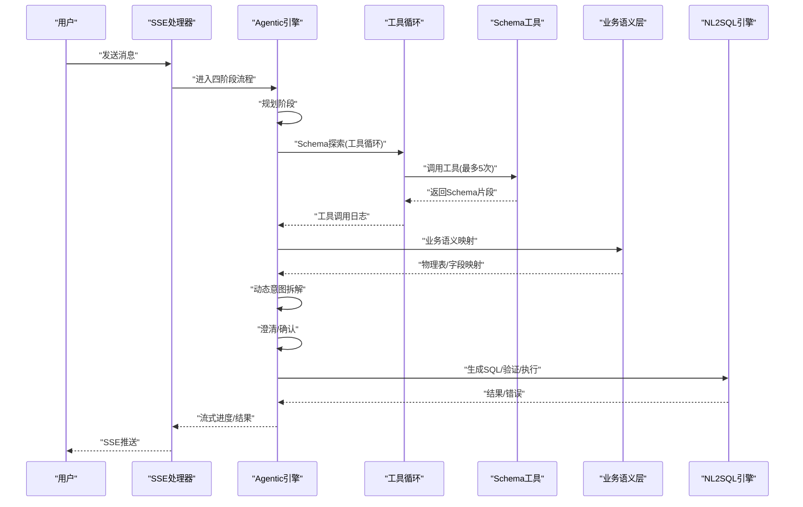
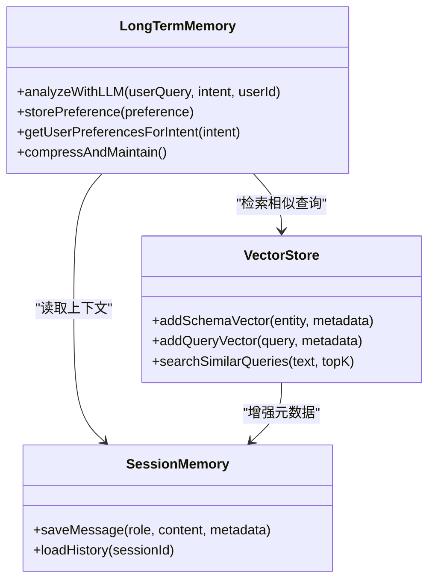
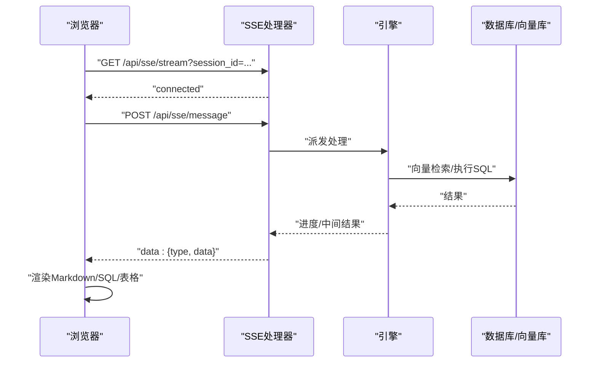
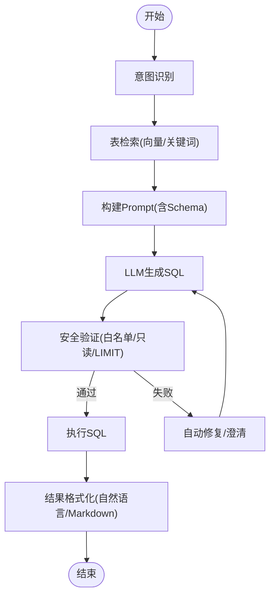
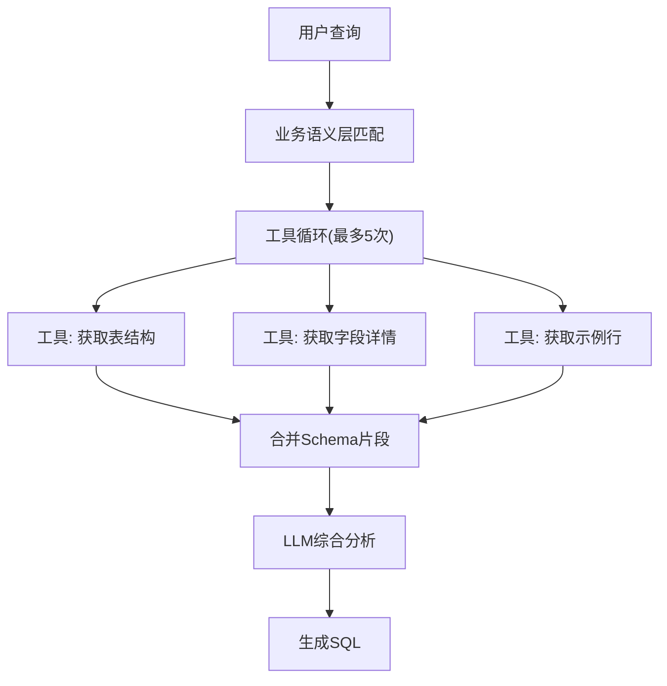
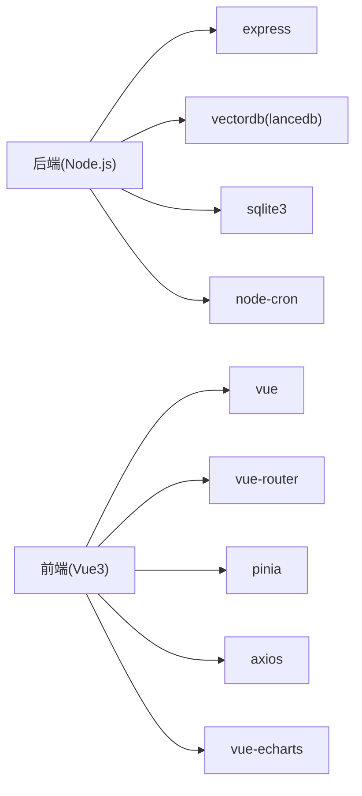

# 项目介绍

<cite>
**本文档引用的文件**
- [backend/src/app.js](file://backend/src/app.js)
- [CLAUDE.md](file://CLAUDE.md)
- [docs/NL2SQL-进度追踪.md](file://docs/NL2SQL-进度追踪.md)
- [backend/package.json](file://backend/package.json)
- [frontend/package.json](file://frontend/package.json)
- [backend/src/core/agenticEngine.js](file://backend/src/core/agenticEngine.js)
- [backend/src/core/nl2sqlEngine.js](file://backend/src/core/nl2sqlEngine.js)
- [backend/src/core/semanticLayer.js](file://backend/src/core/semanticLayer.js)
- [backend/src/core/toolLoop.js](file://backend/src/core/toolLoop.js)
- [backend/src/core/sseHandler.js](file://backend/src/core/sseHandler.js)
- [backend/src/memory/longTermMemory.js](file://backend/src/memory/longTermMemory.js)
- [backend/src/memory/vectorStore.js](file://backend/src/memory/vectorStore.js)
- [backend/config/feature-flags.js](file://backend/config/feature-flags.js)
- [backend/config/schema-metadata.json](file://backend/config/schema-metadata.json)
- [frontend/src/App.vue](file://frontend/src/App.vue)
- [frontend/src/views/ChatView.vue](file://frontend/src/views/ChatView.vue)
</cite>

## 目录
1. [引言](#引言)
2. [项目结构](#项目结构)
3. [核心组件](#核心组件)
4. [架构总览](#架构总览)
5. [详细组件分析](#详细组件分析)
6. [依赖分析](#依赖分析)
7. [性能考虑](#性能考虑)
8. [故障排查指南](#故障排查指南)
9. [结论](#结论)
10. [附录](#附录)

## 引言
NL2SQL 项目旨在通过自然语言到 SQL 的智能转换，降低非技术用户的数据查询门槛，帮助业务分析师与运营人员高效完成数据探索与自助查询。项目围绕 SR 系统数据库，提供从“意图识别 → Schema 检索 → SQL 生成 → 验证 → 执行 → 结果格式化”的完整链路，并通过四阶段 Agent 工作流、三层记忆系统与实时流式通信等技术创新，持续提升可用性与智能化水平。

本项目的价值主张体现在：
- 降低技术门槛：非技术用户也能通过自然语言完成复杂查询。
- 提升效率：自动化的意图理解、Schema 探索与 SQL 生成，显著缩短查询准备时间。
- 增强体验：实时流式通信与多轮澄清机制，使交互更自然、可控。
- 可演进性：分阶段的功能开关设计，支持渐进式能力上线与快速回滚。

## 项目结构
后端采用 Node.js + Express 架构，前端采用 Vue3 + Element Plus，数据层结合 SQLite 与 LanceDB，形成“前后端分离 + 向量检索 + 记忆系统”的整体布局。核心模块包括：
- 后端入口与初始化：负责环境加载、模块初始化、SSE 服务与优雅关闭。
- 引擎层：传统 NL2SQL 引擎与四阶段 Agent 引擎并存，支持按功能开关切换。
- 记忆系统：三层记忆（会话历史、向量检索、长期记忆）协同，持续学习用户偏好。
- 前端界面：聊天对话、Schema 浏览、历史与评估页面，支持 Markdown、SQL 高亮与表格展示。

**图表来源**
- [backend/src/app.js:97-194](file://backend/src/app.js#L97-L194)
- [backend/src/core/sseHandler.js:43-112](file://backend/src/core/sseHandler.js#L43-L112)
- [backend/src/core/agenticEngine.js:68-178](file://backend/src/core/agenticEngine.js#L68-L178)
- [backend/src/core/nl2sqlEngine.js:1-120](file://backend/src/core/nl2sqlEngine.js#L1-L120)
- [backend/src/core/semanticLayer.js:48-73](file://backend/src/core/semanticLayer.js#L48-L73)
- [backend/src/core/toolLoop.js:57-185](file://backend/src/core/toolLoop.js#L57-L185)
- [backend/src/memory/longTermMemory.js:1-60](file://backend/src/memory/longTermMemory.js#L1-L60)
- [backend/src/memory/vectorStore.js:1-60](file://backend/src/memory/vectorStore.js#L1-L60)

**章节来源**
- [backend/src/app.js:97-194](file://backend/src/app.js#L97-L194)
- [CLAUDE.md:41-58](file://CLAUDE.md#L41-L58)

## 核心组件
- 后端入口与初始化：加载配置、创建数据目录、初始化 SQLite/LanceDB、加载 Schema 与业务语义层、启动自修复调度器、监听端口。
- SSE 处理器：管理会话级 SSE 连接，支持多标签页，实现进度与结果的流式推送。
- NL2SQL 引擎：传统流程的意图识别、Schema 检索、SQL 生成、验证与执行；支持向量检索与关键词匹配的混合策略。
- 四阶段 Agent 引擎：整合 Phase 1-4 的工作流，包含规划、Schema 探索、动态意图拆解、澄清、生成验证与恢复。
- 业务语义层：将“老平台”“累计充值”等业务术语映射到物理表/字段，提升跨团队沟通一致性。
- 工具循环：在 Phase 1 中，LLM 可主动调用工具探索 Schema，最多 5 次迭代，避免一次性注入大量上下文。
- 长期记忆：提取用户偏好（字段别名、查询模式、习惯维度/指标），定期压缩与维护。
- 向量存储：对 Schema 与查询历史进行向量化，支持语义相似度检索与元数据增强。
- 功能开关：通过环境变量控制各 Phase 能力，支持渐进式启用与紧急回滚。

**章节来源**
- [backend/src/app.js:97-194](file://backend/src/app.js#L97-L194)
- [backend/src/core/sseHandler.js:43-112](file://backend/src/core/sseHandler.js#L43-L112)
- [backend/src/core/nl2sqlEngine.js:1-120](file://backend/src/core/nl2sqlEngine.js#L1-L120)
- [backend/src/core/agenticEngine.js:68-178](file://backend/src/core/agenticEngine.js#L68-L178)
- [backend/src/core/semanticLayer.js:48-73](file://backend/src/core/semanticLayer.js#L48-L73)
- [backend/src/core/toolLoop.js:57-185](file://backend/src/core/toolLoop.js#L57-L185)
- [backend/src/memory/longTermMemory.js:1-60](file://backend/src/memory/longTermMemory.js#L1-L60)
- [backend/src/memory/vectorStore.js:1-60](file://backend/src/memory/vectorStore.js#L1-L60)
- [backend/config/feature-flags.js:16-96](file://backend/config/feature-flags.js#L16-L96)

## 架构总览
NL2SQL 的整体架构分为三层：前端交互层、后端服务层与数据存储层。前端通过 SSE 与后端保持长连接，后端根据功能开关选择传统引擎或四阶段 Agent 引擎，结合向量检索与记忆系统，完成从自然语言到 SQL 的闭环。

**图表来源**
- [CLAUDE.md:41-58](file://CLAUDE.md#L41-L58)
- [backend/src/core/sseHandler.js:43-112](file://backend/src/core/sseHandler.js#L43-L112)
- [backend/src/core/agenticEngine.js:68-178](file://backend/src/core/agenticEngine.js#L68-L178)
- [backend/src/core/nl2sqlEngine.js:1-120](file://backend/src/core/nl2sqlEngine.js#L1-L120)
- [backend/src/memory/vectorStore.js:1-60](file://backend/src/memory/vectorStore.js#L1-L60)
- [backend/src/memory/longTermMemory.js:1-60](file://backend/src/memory/longTermMemory.js#L1-L60)
- [backend/src/core/semanticLayer.js:48-73](file://backend/src/core/semanticLayer.js#L48-L73)

## 详细组件分析

### 四阶段 Agent 工作流
四阶段 Agent 将复杂的查询处理拆解为“规划 → Schema 探索 → 动态意图拆解 → 澄清/生成/验证/恢复”，在每个阶段引入工具与反馈，提升鲁棒性与可解释性。

**图表来源**
- [backend/src/core/agenticEngine.js:68-178](file://backend/src/core/agenticEngine.js#L68-L178)
- [backend/src/core/toolLoop.js:57-185](file://backend/src/core/toolLoop.js#L57-L185)
- [backend/src/core/semanticLayer.js:134-200](file://backend/src/core/semanticLayer.js#L134-L200)
- [backend/src/core/nl2sqlEngine.js:1-120](file://backend/src/core/nl2sqlEngine.js#L1-L120)

**章节来源**
- [backend/src/core/agenticEngine.js:68-178](file://backend/src/core/agenticEngine.js#L68-L178)
- [backend/src/core/toolLoop.js:57-185](file://backend/src/core/toolLoop.js#L57-L185)
- [backend/src/core/semanticLayer.js:134-200](file://backend/src/core/semanticLayer.js#L134-L200)

### 三层记忆系统
三层记忆分别承担短期上下文、向量检索辅助与长期偏好学习，形成“用即学、学即用”的闭环。

**图表来源**
- [backend/src/memory/longTermMemory.js:58-190](file://backend/src/memory/longTermMemory.js#L58-L190)
- [backend/src/memory/vectorStore.js:141-197](file://backend/src/memory/vectorStore.js#L141-L197)
- [backend/src/core/database.js:1-60](file://backend/src/core/database.js#L1-L60)

**章节来源**
- [backend/src/memory/longTermMemory.js:1-120](file://backend/src/memory/longTermMemory.js#L1-L120)
- [backend/src/memory/vectorStore.js:1-120](file://backend/src/memory/vectorStore.js#L1-L120)

### 实时流式通信（SSE）
SSE 保证前端与后端的低延迟、持续更新，支持多标签页连接与进度回调，显著改善用户体验。

**图表来源**
- [backend/src/core/sseHandler.js:43-112](file://backend/src/core/sseHandler.js#L43-L112)
- [backend/src/core/sseHandler.js:159-176](file://backend/src/core/sseHandler.js#L159-L176)
- [frontend/src/views/ChatView.vue:1-120](file://frontend/src/views/ChatView.vue#L1-L120)

**章节来源**
- [backend/src/core/sseHandler.js:43-112](file://backend/src/core/sseHandler.js#L43-L112)
- [frontend/src/views/ChatView.vue:1-120](file://frontend/src/views/ChatView.vue#L1-L120)

### 自然语言到 SQL 的处理流程
传统引擎在意图识别后，结合向量检索与关键词匹配定位相关表，再通过 LLM 生成 SQL，经过白名单/语法/只读等安全校验后执行并格式化结果。

**图表来源**
- [backend/src/core/nl2sqlEngine.js:1-120](file://backend/src/core/nl2sqlEngine.js#L1-L120)
- [backend/src/core/nl2sqlEngine.js:132-151](file://backend/src/core/nl2sqlEngine.js#L132-L151)

**章节来源**
- [backend/src/core/nl2sqlEngine.js:1-120](file://backend/src/core/nl2sqlEngine.js#L1-L120)

### 业务语义层与工具循环（Phase 1）
业务语义层将“老平台”“累计充值”等业务术语映射到物理表/字段；工具循环让 LLM 主动探索 Schema，避免一次性注入过多上下文。

**图表来源**
- [backend/src/core/semanticLayer.js:134-200](file://backend/src/core/semanticLayer.js#L134-L200)
- [backend/src/core/toolLoop.js:57-185](file://backend/src/core/toolLoop.js#L57-L185)

**章节来源**
- [backend/src/core/semanticLayer.js:134-200](file://backend/src/core/semanticLayer.js#L134-L200)
- [backend/src/core/toolLoop.js:57-185](file://backend/src/core/toolLoop.js#L57-L185)

## 依赖分析
- 后端依赖：Express、CORS、body-parser、dotenv、vectordb(LanceDB)、sqlite3、uuid、dayjs、node-cron。
- 前端依赖：Vue3、Element Plus、Vue Router、Pinia、Axios、ECharts、marked、mermaid 等。
- 配置与功能开关：通过环境变量控制各 Phase 能力，支持按需启用与快速回滚。
- 数据与向量：SQLite 存储会话与长期记忆，LanceDB 存储 Schema 与查询历史向量。

**图表来源**
- [backend/package.json:10-20](file://backend/package.json#L10-L20)
- [frontend/package.json:11-29](file://frontend/package.json#L11-L29)

**章节来源**
- [backend/package.json:10-20](file://backend/package.json#L10-L20)
- [frontend/package.json:11-29](file://frontend/package.json#L11-L29)

## 性能考虑
- 向量检索优化：通过增强元数据（重要性评分、查询类型、复杂度）与分类检索，提升召回质量与速度。
- 上下文控制：Token 预算与摘要机制，避免上下文溢出；工具循环限制迭代次数与超时。
- 数据库连接：SQLite 本地存储，LanceDB 本地向量索引，减少网络延迟。
- 前端渲染：表格与 Markdown 渲染优化，SQL 代码高亮与复制，提升阅读体验。
- 可扩展方向：后续可引入 Redis 缓存、数据库连接池、向量检索性能优化与前端虚拟滚动等。

[本节为通用指导，无需特定文件引用]

## 故障排查指南
- 启动失败：检查 .env 配置（LLM API、嵌入模型、SR 数据库连接串）、端口占用与数据目录权限。
- SSE 连接异常：确认 session_id 参数、Nginx 缓冲设置、连接关闭与错误日志。
- 功能开关问题：核对环境变量 FF_*，确认功能开关状态与启用 Phase 列表。
- 记忆系统异常：检查 SQLite 与 LanceDB 初始化状态、向量索引重建标志。
- SQL 验证失败：检查白名单/只读/LIMIT 策略与语法校验逻辑。

**章节来源**
- [backend/src/app.js:103-194](file://backend/src/app.js#L103-L194)
- [backend/src/core/sseHandler.js:43-112](file://backend/src/core/sseHandler.js#L43-L112)
- [backend/config/feature-flags.js:209-229](file://backend/config/feature-flags.js#L209-L229)

## 结论
NL2SQL 通过“四阶段 Agent 工作流 + 三层记忆系统 + 实时流式通信”的组合，实现了从自然语言到 SQL 的高可用、可演进与可解释的智能查询体系。项目采用渐进式 Phase 演进与功能开关控制，既满足当前业务需求，又为后续增强（如 SQL 测试工具、数据安全、结果可视化、真实数据库连接等）预留空间。面向 SR 系统的落地实践，NL2SQL 有效降低了数据查询门槛，提升了业务效率与决策质量。

[本节为总结性内容，无需特定文件引用]

## 附录

### 应用场景
- SR 系统数据查询：非技术用户通过自然语言完成注册、登录、订单、留存等维度的自助查询。
- 业务分析师自助查询：快速构造复杂指标与维度组合，支持多轮澄清与历史相似查询推荐。
- 非技术用户数据探索：通过“老平台”“累计充值”等业务术语，自动映射到物理表/字段，降低沟通成本。

**章节来源**
- [CLAUDE.md:5-8](file://CLAUDE.md#L5-L8)

### 技术创新点
- 四阶段 Agent 工作流：将复杂查询拆解为可解释的多步推理与工具调用，提升鲁棒性。
- 三层记忆系统：短期上下文、向量检索与长期偏好学习协同，持续优化用户体验。
- 实时流式通信：SSE 保障低延迟与多标签页支持，配合进度回调与 Markdown/SQL 渲染。
- 功能开关与渐进式演进：支持 Phase 逐步启用与紧急回滚，降低风险。

**章节来源**
- [CLAUDE.md:97-114](file://CLAUDE.md#L97-L114)

### 发展历程与未来规划
- Phase 1：MVP 基础架构与核心引擎完成，WebSocket 实时通信与 Vue3 前端落地。
- Phase 2：核心功能完善，业务语义层、动态意图拆解、澄清机制与工具循环逐步上线。
- Phase 3：增强功能推进，包括结果可视化、SQL 验证与测试工具、数据安全增强。
- Phase 4：完善优化阶段，计划接入真实数据库、慢查询优化、管理员通知与自动化运维。

**章节来源**
- [docs/NL2SQL-进度追踪.md:8-16](file://docs/NL2SQL-进度追踪.md#L8-L16)
- [docs/NL2SQL-进度追踪.md:248-257](file://docs/NL2SQL-进度追踪.md#L248-L257)

### 项目背景与优势
- 选择原因：传统方案依赖 SQL 专家与繁琐的 BI 工具链，NL2SQL 以 LLM 与向量检索为核心，快速适配业务术语与查询模式。
- 相比优势：更低的学习成本、更快的查询准备时间、更强的可解释性与可追溯性；通过记忆系统与语义层持续优化，越用越智能。

**章节来源**
- [CLAUDE.md:41-58](file://CLAUDE.md#L41-L58)