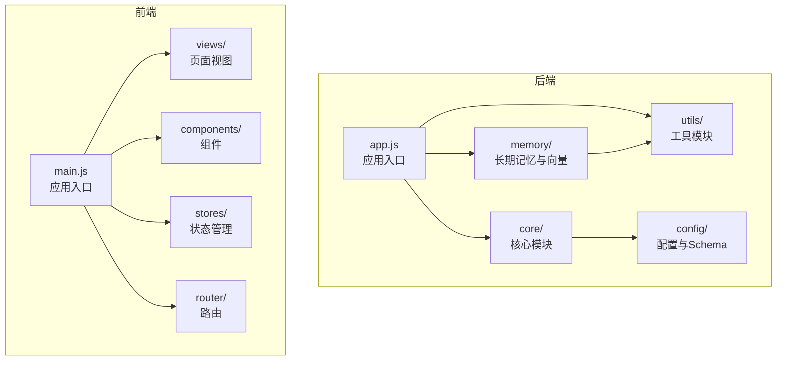
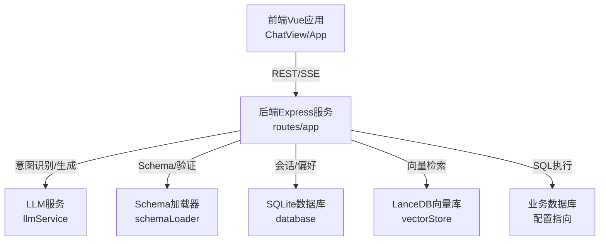
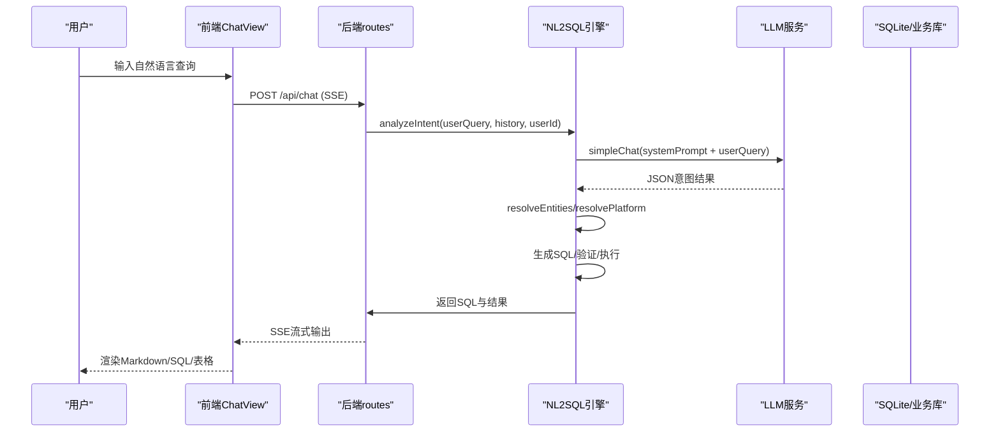
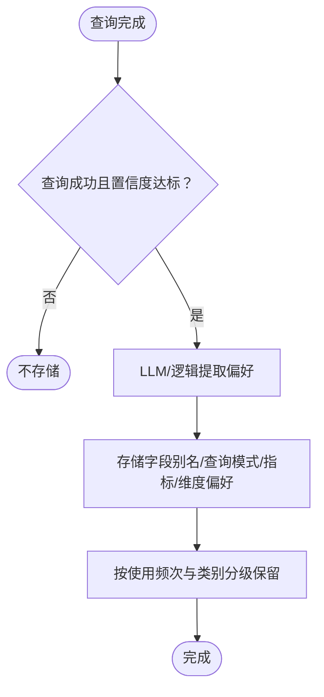
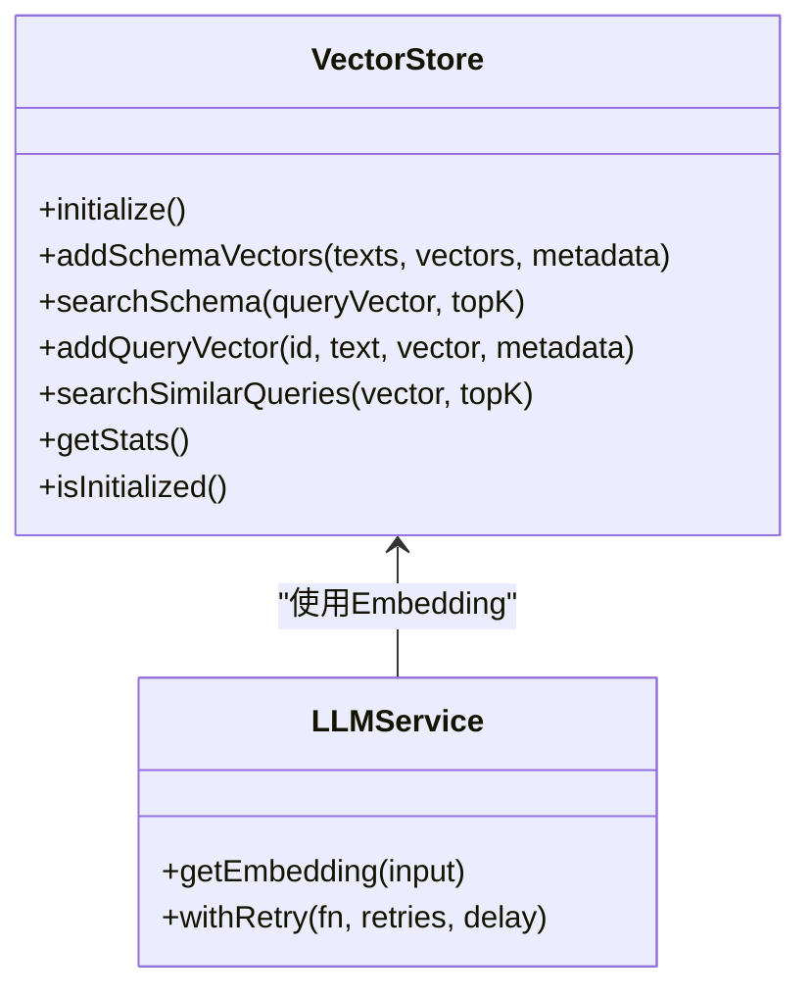
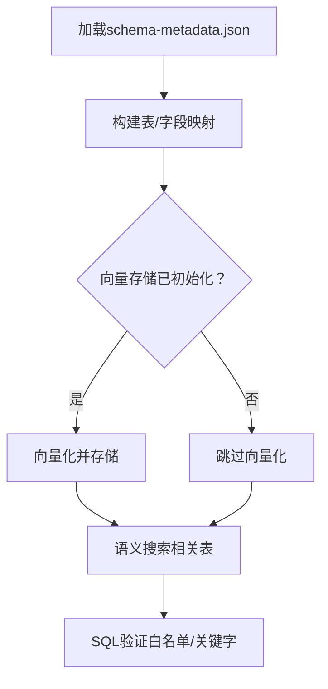
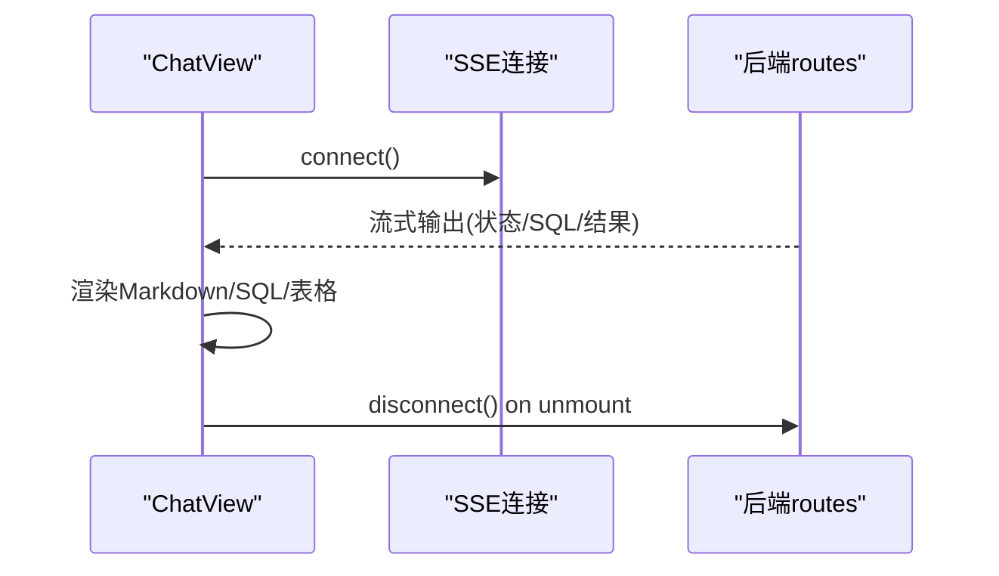
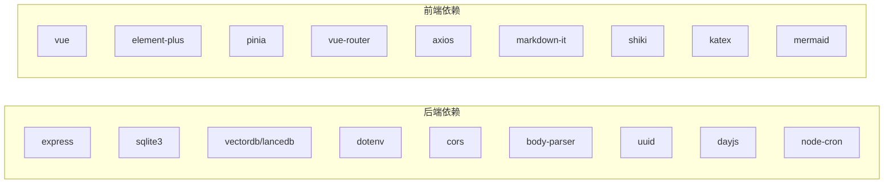

# 项目概述

<cite>
**本文档引用的文件**
- [backend/src/app.js](file://backend/src/app.js)
- [backend/package.json](file://backend/package.json)
- [frontend/src/main.js](file://frontend/src/main.js)
- [frontend/package.json](file://frontend/package.json)
- [backend/src/core/nl2sqlEngine.js](file://backend/src/core/nl2sqlEngine.js)
- [backend/src/core/routes.js](file://backend/src/core/routes.js)
- [backend/src/memory/longTermMemory.js](file://backend/src/memory/longTermMemory.js)
- [backend/src/memory/vectorStore.js](file://backend/src/memory/vectorStore.js)
- [backend/src/core/llmService.js](file://backend/src/core/llmService.js)
- [backend/src/core/database.js](file://backend/src/core/database.js)
- [backend/src/core/config.js](file://backend/src/core/config.js)
- [backend/src/utils/logger.js](file://backend/src/utils/logger.js)
- [backend/src/core/schemaLoader.js](file://backend/src/core/schemaLoader.js)
- [backend/config/schema-metadata.example.json](file://backend/config/schema-metadata.example.json)
- [frontend/src/App.vue](file://frontend/src/App.vue)
- [frontend/src/views/ChatView.vue](file://frontend/src/views/ChatView.vue)
</cite>

## 目录
1. [项目简介](#项目简介)
2. [项目结构](#项目结构)
3. [核心组件](#核心组件)
4. [架构总览](#架构总览)
5. [详细组件分析](#详细组件分析)
6. [依赖关系分析](#依赖关系分析)
7. [性能考虑](#性能考虑)
8. [故障排查指南](#故障排查指南)
9. [结论](#结论)
10. [附录](#附录)

## 项目简介
NL2SQL项目旨在提供一个AI驱动的自然语言到SQL转换系统，支持实时交互与智能记忆。系统通过LLM理解用户查询意图，结合Schema元数据与向量检索，生成安全、可执行的SQL，并以自然语言形式反馈结果。项目采用前后端分离架构：后端基于Express.js提供REST API与SSE流式响应，前端基于Vue.js提供直观的聊天界面与可视化展示。

- **核心价值主张**：
  - 降低数据分析门槛：非技术用户也能通过自然语言提出复杂查询。
  - AI增强的意图理解：结合上下文、历史偏好与领域知识，提升查询准确性。
  - 实时交互体验：SSE流式输出，逐步呈现SQL生成与执行过程。
  - 智能记忆系统：长期记忆与向量检索，持续优化个性化查询体验。

- **业务场景与目标用户**：
  - 业务分析师：快速探索数据，形成查询模式并沉淀为长期偏好。
  - 数据运营人员：基于平台/游戏等业务术语进行精准检索。
  - 技术人员：调试与验证生成的SQL，结合白名单与安全策略保障生产安全。

- **技术栈概览**：
  - 后端：Express.js + Node.js，REST API + SSE，SQLite + LanceDB向量存储，LLM集成。
  - 前端：Vue.js + Element Plus，聊天界面与Markdown/SQL渲染。
  - 数据库：SQLite（会话与偏好）、LanceDB（Schema与查询向量）、业务数据库（由配置指向）。

## 项目结构
项目采用前后端分离的模块化组织方式，后端以“核心模块 + 内存模块 + 工具模块”的层次划分，前端以组件化与路由化组织。

**图表来源**
- [backend/src/app.js:1-238](file://backend/src/app.js#L1-L238)
- [frontend/src/main.js:1-89](file://frontend/src/main.js#L1-L89)

**章节来源**
- [backend/src/app.js:1-238](file://backend/src/app.js#L1-L238)
- [frontend/src/main.js:1-89](file://frontend/src/main.js#L1-L89)

## 核心组件
- **后端核心模块**：
  - 应用入口与初始化：加载环境变量、初始化数据库与向量存储、挂载路由、启动HTTP与SSE服务。
  - NL2SQL引擎：意图识别、实体解析、平台术语映射、SQL生成与验证、结果格式化。
  - LLM服务：封装HTTP请求、重试机制、Embedding获取、工具定义辅助。
  - Schema加载器：加载JSON元数据、构建映射、向量化存储、语义检索与SQL验证。
  - 数据库模块：SQLite会话与偏好持久化、事务与索引优化。
  - 路由模块：健康检查、Schema查询、会话管理、查询历史、用户偏好、统计信息、配置导出。
  - 长期记忆：用户偏好提取与存储、字段别名学习、查询模式与指标/维度偏好。
  - 向量存储：LanceDB封装、Schema与查询向量的增删查改、统计信息。
  - 日志与配置：统一日志、配置校验与环境变量读取。

- **前端核心模块**：
  - 应用入口：创建Vue实例、安装路由与状态管理、注册全局组件。
  - 根组件：侧边栏布局、会话列表、Schema查看弹窗。
  - 聊天视图：SSE流式接收、Markdown渲染、SQL复制、数据表格展示、输入与快捷键。

**章节来源**
- [backend/src/core/nl2sqlEngine.js:1-800](file://backend/src/core/nl2sqlEngine.js#L1-L800)
- [backend/src/core/llmService.js:1-432](file://backend/src/core/llmService.js#L1-L432)
- [backend/src/core/schemaLoader.js:1-732](file://backend/src/core/schemaLoader.js#L1-L732)
- [backend/src/core/database.js:1-850](file://backend/src/core/database.js#L1-L850)
- [backend/src/core/routes.js:1-895](file://backend/src/core/routes.js#L1-L895)
- [backend/src/memory/longTermMemory.js:1-1134](file://backend/src/memory/longTermMemory.js#L1-L1134)
- [backend/src/memory/vectorStore.js:1-442](file://backend/src/memory/vectorStore.js#L1-L442)
- [frontend/src/App.vue:1-373](file://frontend/src/App.vue#L1-L373)
- [frontend/src/views/ChatView.vue:1-776](file://frontend/src/views/ChatView.vue#L1-L776)

## 架构总览
系统采用“前端-后端-数据库/向量库”的三层架构，后端通过LLM与Schema元数据实现意图理解与SQL生成，通过SQLite与LanceDB实现会话与偏好持久化及语义检索。

**图表来源**
- [backend/src/core/routes.js:1-895](file://backend/src/core/routes.js#L1-L895)
- [backend/src/core/llmService.js:1-432](file://backend/src/core/llmService.js#L1-L432)
- [backend/src/core/schemaLoader.js:1-732](file://backend/src/core/schemaLoader.js#L1-L732)
- [backend/src/core/database.js:1-850](file://backend/src/core/database.js#L1-L850)
- [backend/src/memory/vectorStore.js:1-442](file://backend/src/memory/vectorStore.js#L1-L442)

## 详细组件分析

### NL2SQL核心引擎（意图识别与SQL生成）
- **设计要点**：
  - 基于LLM的意图识别，融合上下文、历史偏好与领域知识。
  - 实体解析与平台术语映射，支持用户自定义字段别名与查询模板。
  - 安全与验证：白名单表访问、禁止关键字过滤、行数与超时限制。
  - 结果格式化：Markdown与SQL渲染，支持复制与表格展示。

**图表来源**
- [backend/src/core/nl2sqlEngine.js:394-677](file://backend/src/core/nl2sqlEngine.js#L394-L677)
- [backend/src/core/llmService.js:287-311](file://backend/src/core/llmService.js#L287-L311)
- [frontend/src/views/ChatView.vue:196-214](file://frontend/src/views/ChatView.vue#L196-L214)

**章节来源**
- [backend/src/core/nl2sqlEngine.js:1-800](file://backend/src/core/nl2sqlEngine.js#L1-L800)
- [backend/src/core/llmService.js:1-432](file://backend/src/core/llmService.js#L1-L432)
- [frontend/src/views/ChatView.vue:1-776](file://frontend/src/views/ChatView.vue#L1-L776)

### 长期记忆系统（智能偏好与模板）
- **设计要点**：
  - 通过LLM或逻辑规则提取用户偏好，包括字段别名、查询模式、指标/维度偏好。
  - 存储分级保留策略，高频/中频/低频与别名类别的保留周期不同。
  - 支持手动学习与删除偏好，提供原始数据与统计接口。

**图表来源**
- [backend/src/memory/longTermMemory.js:311-484](file://backend/src/memory/longTermMemory.js#L311-L484)
- [backend/src/core/database.js:609-763](file://backend/src/core/database.js#L609-L763)

**章节来源**
- [backend/src/memory/longTermMemory.js:1-1134](file://backend/src/memory/longTermMemory.js#L1-L1134)
- [backend/src/core/database.js:1-850](file://backend/src/core/database.js#L1-L850)

### 向量存储与语义检索
- **设计要点**：
  - 基于LanceDB的Schema与查询向量存储，支持语义相似度搜索。
  - 启动时可选择强制重新向量化，避免陈旧向量影响匹配效果。
  - 提供统计信息与初始化状态检查，便于运维与排障。

**图表来源**
- [backend/src/memory/vectorStore.js:55-442](file://backend/src/memory/vectorStore.js#L55-L442)
- [backend/src/core/llmService.js:324-379](file://backend/src/core/llmService.js#L324-L379)

**章节来源**
- [backend/src/memory/vectorStore.js:1-442](file://backend/src/memory/vectorStore.js#L1-L442)
- [backend/src/core/llmService.js:1-432](file://backend/src/core/llmService.js#L1-L432)

### Schema元数据与SQL验证
- **设计要点**：
  - 从JSON配置加载表结构、字段、关系、指标与维度，构建快速查找映射。
  - 支持向量化Schema用于语义检索，关键词匹配作为回退方案。
  - SQL验证：禁止关键字过滤、白名单表检查、安全执行策略。

**图表来源**
- [backend/src/core/schemaLoader.js:69-122](file://backend/src/core/schemaLoader.js#L69-L122)
- [backend/src/core/schemaLoader.js:195-290](file://backend/src/core/schemaLoader.js#L195-L290)
- [backend/src/core/schemaLoader.js:508-557](file://backend/src/core/schemaLoader.js#L508-L557)
- [backend/src/core/schemaLoader.js:570-606](file://backend/src/core/schemaLoader.js#L570-L606)

**章节来源**
- [backend/src/core/schemaLoader.js:1-732](file://backend/src/core/schemaLoader.js#L1-L732)
- [backend/config/schema-metadata.example.json:1-328](file://backend/config/schema-metadata.example.json#L1-L328)

### 前端交互与SSE流式输出
- **设计要点**：
  - 根组件提供侧边栏与会话管理，聊天视图通过SSE接收后端流式输出。
  - 支持Markdown渲染、SQL代码高亮、数据表格展示与复制。
  - 输入处理支持Enter发送、Shift+Enter换行，自动滚动与展开折叠。

**图表来源**
- [frontend/src/views/ChatView.vue:331-343](file://frontend/src/views/ChatView.vue#L331-L343)
- [frontend/src/views/ChatView.vue:322-325](file://frontend/src/views/ChatView.vue#L322-L325)

**章节来源**
- [frontend/src/App.vue:1-373](file://frontend/src/App.vue#L1-L373)
- [frontend/src/views/ChatView.vue:1-776](file://frontend/src/views/ChatView.vue#L1-L776)

## 依赖关系分析
- **后端依赖**：
  - Express.js提供Web服务与路由；SQLite3与vectordb提供数据与向量存储；dotenv/cors/body-parser提供环境与中间件；uuid/dayjs/node-cron提供工具能力。
  - 核心模块之间通过配置中心与日志模块耦合，降低直接依赖。

- **前端依赖**：
  - Vue3提供响应式与组件化；Element Plus提供UI组件库；Pinia与Vue Router提供状态与路由；Axios用于API调用；markdown-it/shiki/katex/mermaid用于内容渲染。

**图表来源**
- [backend/package.json:10-27](file://backend/package.json#L10-L27)
- [frontend/package.json:11-35](file://frontend/package.json#L11-L35)

**章节来源**
- [backend/package.json:1-28](file://backend/package.json#L1-L28)
- [frontend/package.json:1-36](file://frontend/package.json#L1-L36)

## 性能考虑
- **查询性能**：
  - SQLite索引优化：会话、消息、查询历史、用户偏好均建立复合索引，加速按用户/时间/状态查询。
  - 向量检索：Schema与查询向量分批Embedding，避免单次请求过大；向量表按需重建以保证匹配质量。
  - SQL执行限制：最大行数、超时时间、禁止关键字与白名单表，防止大查询与危险操作。

- **系统稳定性**：
  - LLM重试与超时：统一的withRetry与超时控制，避免请求挂起。
  - 日志轮转：自动文件轮转，避免日志文件过大影响性能。
  - 自修复机制：定时健康检查与清理任务，维持系统长期稳定。

[本节为通用指导，无需列出具体文件来源]

## 故障排查指南
- **启动与初始化失败**：
  - 检查LLM API密钥与SR数据库URL配置是否正确；查看日志文件定位错误。
  - 确认数据目录与向量库路径存在且可写。

- **SSE连接异常**：
  - 确认后端SSE端点可用；浏览器控制台查看网络错误；检查跨域配置。

- **查询结果异常**：
  - 检查白名单表配置与禁止关键字过滤；确认生成SQL是否符合业务库结构。
  - 使用“原始记忆数据”接口查看长期记忆提取结果，定位别名或模板问题。

- **向量检索不准确**：
  - 如需重建向量，设置强制重新向量化参数；检查Embedding模型与维度配置。

**章节来源**
- [backend/src/core/config.js:300-332](file://backend/src/core/config.js#L300-L332)
- [backend/src/utils/logger.js:1-318](file://backend/src/utils/logger.js#L1-L318)
- [backend/src/core/routes.js:459-515](file://backend/src/core/routes.js#L459-L515)

## 结论
NL2SQL项目通过LLM驱动的意图理解、Schema元数据与向量检索相结合，实现了从自然语言到SQL的高效转换，并提供实时交互与智能记忆能力。前后端分离架构清晰，模块职责明确，既适合初学者快速上手，也为有经验的开发者提供了可扩展的技术基础。建议在生产环境中重点关注配置校验、安全策略与性能优化，以确保系统的稳定性与安全性。

[本节为总结性内容，无需列出具体文件来源]

## 附录
- **环境变量与配置要点**：
  - LLM API基础地址、密钥、模型与超时；Embedding模型与维度；数据库路径与SR数据库URL；白名单表与安全限制；日志级别与文件路径；长期记忆开关与阈值。

- **Schema元数据示例**：
  - 提供表、字段、关系、指标与维度的标准结构，便于快速适配业务数据库。

**章节来源**
- [backend/src/core/config.js:16-332](file://backend/src/core/config.js#L16-L332)
- [backend/config/schema-metadata.example.json:1-328](file://backend/config/schema-metadata.example.json#L1-L328)