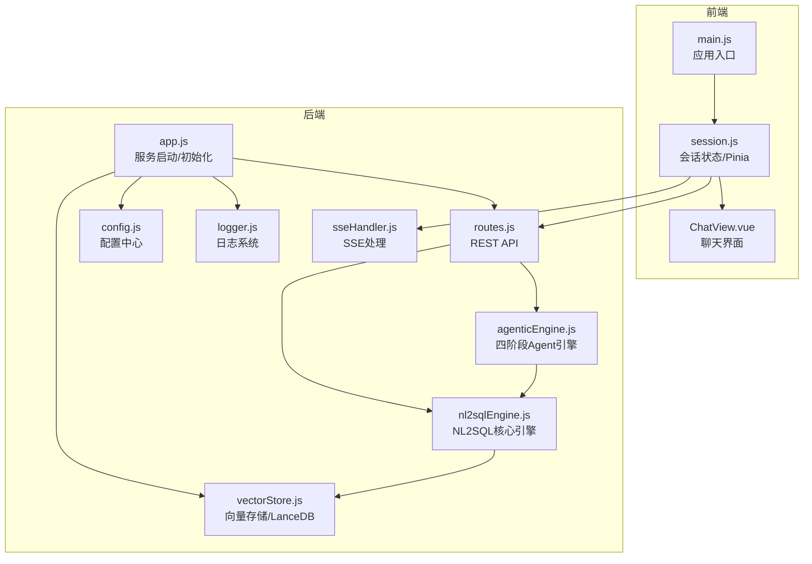
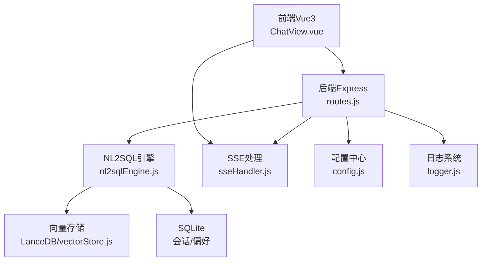
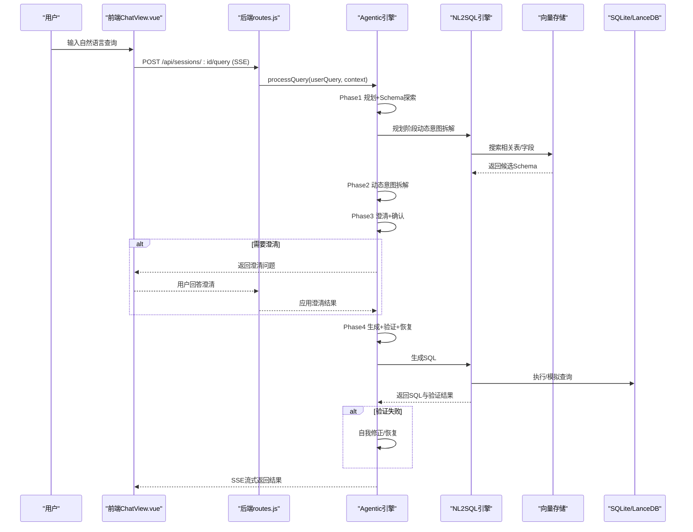
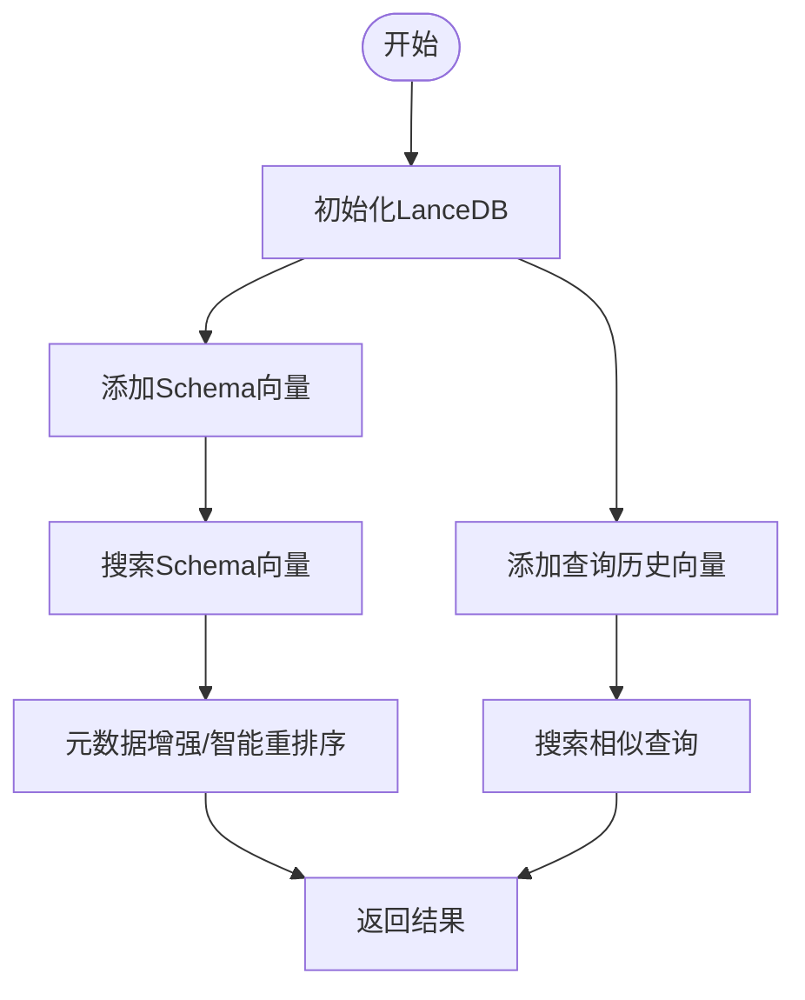
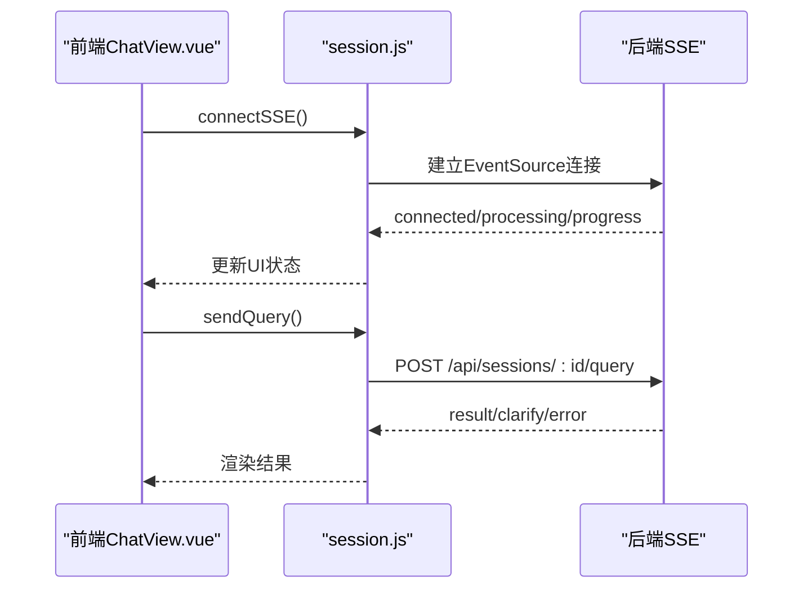
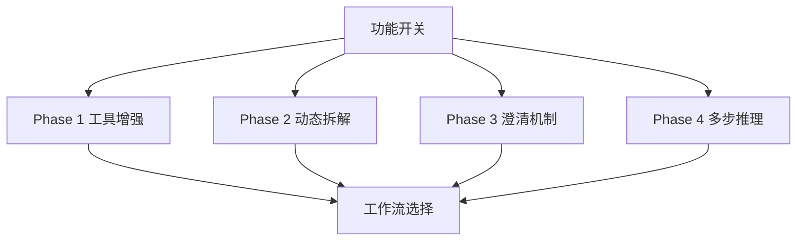
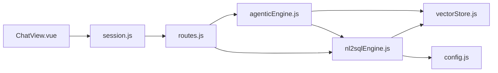

# 项目概述

<cite>
**本文档引用的文件**
- [backend/package.json](file://backend/package.json)
- [frontend/package.json](file://frontend/package.json)
- [backend/src/app.js](file://backend/src/app.js)
- [backend/src/core/agenticEngine.js](file://backend/src/core/agenticEngine.js)
- [backend/src/core/nl2sqlEngine.js](file://backend/src/core/nl2sqlEngine.js)
- [backend/src/core/config.js](file://backend/src/core/config.js)
- [backend/src/memory/vectorStore.js](file://backend/src/memory/vectorStore.js)
- [backend/src/core/routes.js](file://backend/src/core/routes.js)
- [backend/src/utils/logger.js](file://backend/src/utils/logger.js)
- [backend/src/core/sseHandler.js](file://backend/src/core/sseHandler.js)
- [frontend/src/main.js](file://frontend/src/main.js)
- [frontend/src/views/ChatView.vue](file://frontend/src/views/ChatView.vue)
- [frontend/src/stores/session.js](file://frontend/src/stores/session.js)
- [backend/config/feature-flags.js](file://backend/config/feature-flags.js)
- [docs/NL2SQL-进度追踪.md](file://docs/NL2SQL-进度追踪.md)
</cite>

## 目录
1. [简介](#简介)
2. [项目结构](#项目结构)
3. [核心组件](#核心组件)
4. [架构总览](#架构总览)
5. [详细组件分析](#详细组件分析)
6. [依赖关系分析](#依赖关系分析)
7. [性能考虑](#性能考虑)
8. [故障排查指南](#故障排查指南)
9. [结论](#结论)
10. [附录](#附录)

## 简介
NL2SQL项目旨在将自然语言查询转化为结构化SQL，提供面向业务人员的“自然语言提数”能力。项目采用前后端分离架构，后端基于Node.js + Express，前端基于Vue3，结合SQLite与LanceDB实现会话存储与向量检索，支持实时通信（SSE）、功能开关（Feature Flags）与四阶段Agent工作流，覆盖从意图识别、Schema探索、澄清确认到SQL生成与验证的完整闭环。

项目目标与价值：
- 降低数据分析门槛：非技术用户也能通过自然语言提出复杂查询
- 提升查询效率：通过向量检索与长期记忆，加速表/字段定位与模板复用
- 增强交互体验：SSE流式响应、Markdown渲染、SQL高亮与数据表格展示
- 可演进的工程化：分阶段引入工具增强、动态意图拆解、澄清机制与多步推理恢复

## 项目结构
项目采用典型的前后端分离组织方式：
- 后端（Node.js + Express）
  - 核心模块：配置管理、路由、日志、数据库、向量存储、LLM服务、Schema加载、工具链、SSE处理、自修复调度
  - 引擎模块：NL2SQL核心引擎、Agentic引擎（四阶段工作流）
- 前端（Vue3 + Element Plus）
  - 视图：聊天界面、Schema查看、历史记录、记忆管理等
  - 状态：Pinia会话状态管理，封装SSE连接与消息流转
  - 工具：API封装、Markdown渲染、代码高亮

**图表来源**
- [backend/src/app.js:1-266](file://backend/src/app.js#L1-L266)
- [backend/src/core/routes.js:1-1037](file://backend/src/core/routes.js#L1-L1037)
- [backend/src/core/nl2sqlEngine.js:1-800](file://backend/src/core/nl2sqlEngine.js#L1-L800)
- [backend/src/core/agenticEngine.js:1-651](file://backend/src/core/agenticEngine.js#L1-L651)
- [backend/src/memory/vectorStore.js:1-800](file://backend/src/memory/vectorStore.js#L1-L800)
- [frontend/src/main.js:1-89](file://frontend/src/main.js#L1-L89)
- [frontend/src/views/ChatView.vue:1-778](file://frontend/src/views/ChatView.vue#L1-L778)
- [frontend/src/stores/session.js:1-400](file://frontend/src/stores/session.js#L1-L400)

**章节来源**
- [backend/src/app.js:1-266](file://backend/src/app.js#L1-L266)
- [frontend/src/main.js:1-89](file://frontend/src/main.js#L1-L89)

## 核心组件
- 配置中心（config.js）
  - 统一管理LLM API、Embedding、数据库、安全策略、会话、日志、自修复、Schema、长期记忆、上下文管理等配置，并提供校验与默认值
- 日志系统（logger.js）
  - 支持控制台/文件输出、多级别日志、结构化日志、执行流程追踪（trace），便于调试与运维
- 向量存储（vectorStore.js + LanceDB）
  - Schema向量表与查询历史向量表，支持智能搜索、元数据增强、查询类型分类、重要性评分
- NL2SQL核心引擎（nl2sqlEngine.js）
  - 意图识别、实体解析、Schema检索、SQL生成、验证与结果格式化；支持业务关键词映射、高频表回退策略
- Agentic引擎（agenticEngine.js）
  - 四阶段工作流：规划+工具增强Schema探索、动态意图拆解、澄清+确认、生成+验证+恢复
- 路由与API（routes.js）
  - 健康检查、Schema查询、会话管理、查询历史、用户偏好、评估统计等REST接口
- SSE处理（sseHandler.js）
  - 实现实时流式响应，前端通过EventSource订阅会话流
- 前端应用（main.js + ChatView.vue + session.js）
  - Vue3应用入口、聊天界面、Markdown渲染、SQL高亮、数据表格展示、SSE连接与消息状态管理

**章节来源**
- [backend/src/core/config.js:1-398](file://backend/src/core/config.js#L1-L398)
- [backend/src/utils/logger.js:1-482](file://backend/src/utils/logger.js#L1-L482)
- [backend/src/memory/vectorStore.js:1-800](file://backend/src/memory/vectorStore.js#L1-L800)
- [backend/src/core/nl2sqlEngine.js:1-800](file://backend/src/core/nl2sqlEngine.js#L1-L800)
- [backend/src/core/agenticEngine.js:1-651](file://backend/src/core/agenticEngine.js#L1-L651)
- [backend/src/core/routes.js:1-1037](file://backend/src/core/routes.js#L1-L1037)
- [frontend/src/main.js:1-89](file://frontend/src/main.js#L1-L89)
- [frontend/src/views/ChatView.vue:1-778](file://frontend/src/views/ChatView.vue#L1-L778)
- [frontend/src/stores/session.js:1-400](file://frontend/src/stores/session.js#L1-L400)

## 架构总览
NL2SQL采用分层架构与模块化设计：
- 表现层：Vue3前端，负责用户交互与实时展示
- 应用层：Express后端，提供REST API与SSE流式响应
- 数据层：SQLite（会话与偏好）、LanceDB（Schema与查询历史向量）
- 服务层：LLM服务（通过配置接入任意兼容OpenAI API的服务）、Schema加载与工具链

**图表来源**
- [backend/src/core/routes.js:1-1037](file://backend/src/core/routes.js#L1-L1037)
- [backend/src/core/nl2sqlEngine.js:1-800](file://backend/src/core/nl2sqlEngine.js#L1-L800)
- [backend/src/memory/vectorStore.js:1-800](file://backend/src/memory/vectorStore.js#L1-L800)
- [backend/src/core/sseHandler.js](file://backend/src/core/sseHandler.js)
- [backend/src/core/config.js:1-398](file://backend/src/core/config.js#L1-L398)
- [backend/src/utils/logger.js:1-482](file://backend/src/utils/logger.js#L1-L482)
- [frontend/src/views/ChatView.vue:1-778](file://frontend/src/views/ChatView.vue#L1-L778)

## 详细组件分析

### 四阶段Agent工作流
Agentic引擎将NL2SQL过程抽象为四个阶段，形成Plan → Act → Observe的循环，具备自我修正与恢复能力：

**图表来源**
- [backend/src/core/agenticEngine.js:1-651](file://backend/src/core/agenticEngine.js#L1-L651)
- [backend/src/core/nl2sqlEngine.js:1-800](file://backend/src/core/nl2sqlEngine.js#L1-L800)
- [backend/src/memory/vectorStore.js:1-800](file://backend/src/memory/vectorStore.js#L1-L800)
- [frontend/src/views/ChatView.vue:1-778](file://frontend/src/views/ChatView.vue#L1-L778)
- [frontend/src/stores/session.js:1-400](file://frontend/src/stores/session.js#L1-L400)

**章节来源**
- [backend/src/core/agenticEngine.js:1-651](file://backend/src/core/agenticEngine.js#L1-L651)

### 向量数据库与语义检索
向量存储模块基于LanceDB，提供Schema向量与查询历史向量的增删查改，并支持智能搜索与元数据增强：
- Schema向量：表/字段描述向量化，支持按scope/data_type过滤与优先级重排
- 查询历史向量：记录用户查询与意图，支持相似查询检索与模板学习
- 元数据增强：重要性评分、查询类型分类、复杂度分析、执行统计

**图表来源**
- [backend/src/memory/vectorStore.js:1-800](file://backend/src/memory/vectorStore.js#L1-L800)

**章节来源**
- [backend/src/memory/vectorStore.js:1-800](file://backend/src/memory/vectorStore.js#L1-L800)

### 前后端实时通信（SSE）
前端通过EventSource订阅后端SSE流，实现查询过程的实时反馈：
- 连接建立：connectSSE() 建立 /api/sse/stream
- 消息类型：connected、processing、progress、result、clarify、error
- 状态管理：isProcessing、processingStatus、processingProgress
- 聊天展示：ChatView.vue 渲染Markdown、SQL高亮与数据表格

**图表来源**
- [frontend/src/views/ChatView.vue:1-778](file://frontend/src/views/ChatView.vue#L1-L778)
- [frontend/src/stores/session.js:1-400](file://frontend/src/stores/session.js#L1-L400)
- [backend/src/core/sseHandler.js](file://backend/src/core/sseHandler.js)

**章节来源**
- [frontend/src/views/ChatView.vue:1-778](file://frontend/src/views/ChatView.vue#L1-L778)
- [frontend/src/stores/session.js:1-400](file://frontend/src/stores/session.js#L1-L400)

### 功能开关与渐进式演进
项目通过功能开关（Feature Flags）实现新功能的渐进式启用与快速回滚，支持按Phase独立控制：
- Phase 1：工具化Schema探索（工具增强、分层加载、工具循环）
- Phase 2：动态意图拆解（动态拆解、业务语义层）
- Phase 3：澄清机制（澄清引擎）
- Phase 4：多步推理与自我修正（Agentic引擎、自动恢复）

**图表来源**
- [backend/config/feature-flags.js:1-249](file://backend/config/feature-flags.js#L1-L249)

**章节来源**
- [backend/config/feature-flags.js:1-249](file://backend/config/feature-flags.js#L1-L249)

## 依赖关系分析
- 技术栈选择与优势
  - Node.js + Express：轻量、生态丰富、易于扩展，适合快速迭代与模块化开发
  - Vue3 + Element Plus：现代化前端框架，组件化与响应式设计，良好的生态与文档
  - SQLite + LanceDB：SQLite用于会话与偏好存储，LanceDB用于向量检索，兼顾易用性与性能
  - LLM服务：通过配置接入任意兼容OpenAI API的服务，便于替换与扩展
- 模块耦合与内聚
  - 路由层与引擎层解耦，通过清晰的接口传递上下文与结果
  - 向量存储与引擎层松耦合，通过统一的向量检索接口交互
  - 前后端通过REST API与SSE解耦，便于独立演进与部署

**图表来源**
- [backend/src/core/routes.js:1-1037](file://backend/src/core/routes.js#L1-L1037)
- [backend/src/core/nl2sqlEngine.js:1-800](file://backend/src/core/nl2sqlEngine.js#L1-L800)
- [backend/src/core/agenticEngine.js:1-651](file://backend/src/core/agenticEngine.js#L1-L651)
- [backend/src/memory/vectorStore.js:1-800](file://backend/src/memory/vectorStore.js#L1-L800)
- [frontend/src/views/ChatView.vue:1-778](file://frontend/src/views/ChatView.vue#L1-L778)
- [frontend/src/stores/session.js:1-400](file://frontend/src/stores/session.js#L1-L400)

**章节来源**
- [backend/package.json:1-28](file://backend/package.json#L1-L28)
- [frontend/package.json:1-36](file://frontend/package.json#L1-L36)

## 性能考虑
- 向量检索优化：通过智能搜索与元数据过滤，减少无关结果；支持重要性评分与查询类型分类
- Schema检索回退：高频核心表作为向量检索失败的回退策略，平衡精度与性能
- Token预算与上下文压缩：通过上下文管理配置与对话摘要，控制LLM输入规模
- 自修复与监控：每日健康检查、慢查询阈值、内存使用统计，保障系统稳定性
- 前端渲染优化：Markdown渲染、SQL高亮、数据表格虚拟滚动，提升交互流畅度

## 故障排查指南
- 健康检查
  - 使用 /api/health 与 /api/health/detail 接口检查数据库、LLM、Schema、SSE连接状态
- 日志定位
  - 通过 logger 的 trace/debug/info/warn/error 级别定位问题，关注配置校验、向量库初始化、SQL验证与恢复
- SSE连接
  - 检查 session.js 的 connectSSE 与 handleSSEMessage，确认 readyState 与消息类型
- 配置校验
  - 确认 LLM API密钥、SR数据库URL、白名单、Dry Run、查询限制等配置项
- 功能开关
  - 通过 feature-flags 控制各Phase功能启用状态，必要时回滚至原有流程

**章节来源**
- [backend/src/core/routes.js:1-1037](file://backend/src/core/routes.js#L1-L1037)
- [backend/src/utils/logger.js:1-482](file://backend/src/utils/logger.js#L1-L482)
- [frontend/src/stores/session.js:1-400](file://frontend/src/stores/session.js#L1-L400)
- [backend/src/core/config.js:1-398](file://backend/src/core/config.js#L1-L398)
- [backend/config/feature-flags.js:1-249](file://backend/config/feature-flags.js#L1-L249)

## 结论
NL2SQL项目通过前后端分离、实时通信与向量数据库集成，构建了从自然语言到SQL的高效转换闭环。四阶段Agent工作流提升了复杂查询的理解与执行能力，功能开关机制支持渐进式演进。SQLite与LanceDB的组合兼顾易用性与性能，适合中小规模到中等规模的业务数据分析场景。后续可在SQL验证工具、结果可视化、数据安全增强与真实数据库连接等方面持续优化。

## 附录

### 快速开始指南
- 环境准备
  - Node.js 版本要求：>=18.0.0
  - 安装依赖：后端与前端分别执行安装命令
- 启动后端
  - 设置环境变量（LLM API密钥、数据库URL等）
  - 启动服务：后端提供 dev/start 脚本
- 启动前端
  - 安装依赖后启动开发服务器
- 访问应用
  - 打开浏览器访问前端页面，创建会话并发起自然语言查询
  - 通过SSE实时查看处理进度与结果

**章节来源**
- [backend/package.json:1-28](file://backend/package.json#L1-L28)
- [frontend/package.json:1-36](file://frontend/package.json#L1-L36)
- [backend/src/app.js:1-266](file://backend/src/app.js#L1-L266)

### 基本使用示例
- 发起查询
  - 在聊天界面输入自然语言查询，如“查一下上个月的销售额”
  - 前端通过SSE订阅后端流，实时展示处理阶段与最终SQL与结果
- 查看Schema
  - 通过Schema查看页面了解可用表与字段定义
- 管理会话
  - 创建/删除会话，查看历史消息与偏好

**章节来源**
- [frontend/src/views/ChatView.vue:1-778](file://frontend/src/views/ChatView.vue#L1-L778)
- [frontend/src/stores/session.js:1-400](file://frontend/src/stores/session.js#L1-L400)
- [backend/src/core/routes.js:1-1037](file://backend/src/core/routes.js#L1-L1037)

### 项目背景与预期价值
- 背景
  - 业务人员对数据查询的需求日益增长，但SQL门槛较高
  - 通过AI与向量检索，降低理解成本并提升查询效率
- 预期价值
  - 提升数据分析效率与准确性
  - 通过长期记忆与模板复用，沉淀用户偏好与常用查询模式
  - 为后续接入真实数据库与增强可视化奠定基础

**章节来源**
- [docs/NL2SQL-进度追踪.md:1-265](file://docs/NL2SQL-进度追踪.md#L1-L265)