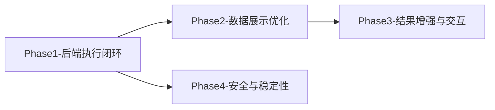

# NL2SQL 真实数据输出 — 总览计划

## 文档信息
- 版本：v1.0
- 日期：2026-04-24
- 目标：将系统从「输出 SQL」升级为「输出真实数据」
- 范围：后端执行闭环 + 前端数据展示 + 交互增强 + 安全稳定

---

## 1. 现状分析

### 1.1 当前数据流

```
用户输入 → 意图识别 → SQL生成 → [DRY_RUN=true] → 返回SQL文本（无数据）
```

### 1.2 关键问题清单

| # | 问题 | 影响 | 所在文件 |
|---|------|------|---------|
| 1 | `DRY_RUN=true`，SQL 不执行 | 无真实数据返回 | `.env:69` |
| 2 | `agenticEngine` 不执行 SQL，只返回 `type:'sql_result'` | Agentic 路径永远无数据 | `agenticEngine.js:161` |
| 3 | 返回类型不统一：legacy=`result`，agentic=`sql_result` | 前端需双分支处理 | `nl2sqlEngine.js:698` / `agenticEngine.js:161` |
| 4 | `resultFormatter` 以自然语言总结为主，数据仅作 Prompt 输入 | 数据非主输出 | `resultFormatter.js:17-30` |
| 5 | 前端数据表格是次要展示（SQL 代码块更突出） | 用户看到 SQL 而非数据 | `ChatView.vue:44-75` |
| 6 | 数据表格缺少分页、排序、导出 | 大数据集体验差 | `ChatView.vue:61-74` |
| 7 | SSE `persistAgenticMessages` 不识别 `type:'result'` | Agentic 结果持久化丢失 | `sseHandler.js:461` |

### 1.3 已具备的基础能力

| 能力 | 状态 | 文件 |
|------|------|------|
| MySQL 连接池（只读） | ✅ 已就绪 | `srDatabase.js` |
| SQL 执行 + 脱敏 + 截断 | ✅ 已就绪 | `sqlExecutor.js` |
| LIMIT 强制注入 | ✅ 已就绪 | `sqlLimit.js` |
| 结果脱敏 | ✅ 已就绪 | `maskResult.js` |
| 前端 el-table 展示 | ✅ 基础可用 | `ChatView.vue:61-74` |
| SR_DATABASE_URL 已配置 | ✅ 已连接 | `.env:55` |

---

## 2. 目标架构

### 2.1 目标数据流

```
用户输入 → 意图识别 → SQL生成 → SQL执行(真实DB) → 脱敏+截断 → 数据表格(主)+自然语言总结(辅)
```

### 2.2 核心变更


### 2.3 返回结构统一

**统一后**（legacy 和 agentic 一致）：
```json
{
  "success": true,
  "type": "result",
  "message": "自然语言总结",
  "sql": "SELECT ...",
  "explanation": "查询说明",
  "data": {
    "columns": ["col1", "col2"],
    "rows": [{"col1": "val1", "col2": "val2"}],
    "rowCount": 100,
    "truncated": false
  },
  "executionTime": 230,
  "engineUsed": "agentic"
}
```

---

## 3. 分阶段实施计划

### Phase 1 — 后端执行闭环（优先级 P0）

**目标**：打通「SQL → 真实执行 → 数据返回」主链路

| 任务ID | 任务 | 预计工时 |
|--------|------|---------|
| P1-T1 | DRY_RUN 开关切换为 false，验证 srDatabase 执行 | 0.5d |
| P1-T2 | agenticEngine 增加 SQL 执行步骤 | 1d |
| P1-T3 | 返回类型统一为 `type:'result'` | 0.5d |
| P1-T4 | SSE 持久化兼容 `type:'result'` | 0.5d |
| P1-T5 | 端到端冒烟测试 | 0.5d |

**详细计划**：`NL2SQL-真实数据输出-Phase1-后端执行闭环.md`

### Phase 2 — 数据展示优化（优先级 P0）

**目标**：前端数据优先展示，SQL 降为辅助信息

| 任务ID | 任务 | 预计工时 |
|--------|------|---------|
| P2-T1 | ChatView 数据表格优先展示 + SQL 折叠 | 0.5d |
| P2-T2 | 空结果 / 执行失败友好提示 | 0.5d |
| P2-T3 | 数据表格分页 + 虚拟滚动 | 1d |
| P2-T4 | 历史消息数据回显兼容 | 0.5d |

**详细计划**：`NL2SQL-真实数据输出-Phase2-数据展示优化.md`

### Phase 3 — 结果增强与交互（优先级 P1）

**目标**：数据可交互、可导出、可分析

| 任务ID | 任务 | 预计工时 |
|--------|------|---------|
| P3-T1 | 表格列排序 + 文本筛选 | 0.5d |
| P3-T2 | CSV/Excel 导出 | 1d |
| P3-T3 | 数据概览卡片（行数/耗时/截断提示） | 0.5d |
| P3-T4 | 智能总结增强（数值统计+趋势+异常） | 1d |

**详细计划**：`NL2SQL-真实数据输出-Phase3-结果增强与交互.md`

### Phase 4 — 安全与稳定性（优先级 P1）

**目标**：真实数据输出场景下的安全保障和稳定性

| 任务ID | 任务 | 预计工时 |
|--------|------|---------|
| P4-T1 | 执行安全审计（只读校验 / SQL注入复查） | 0.5d |
| P4-T2 | 慢查询熔断 + 执行超时增强 | 0.5d |
| P4-T3 | 大结果集内存保护 | 0.5d |
| P4-T4 | 结果脱敏规则完善 + 敏感列自动检测 | 1d |
| P4-T5 | 监控指标（执行成功率/耗时/行数分布） | 0.5d |

**详细计划**：`NL2SQL-真实数据输出-Phase4-安全与稳定性.md`

---

## 4. 实施时间线

```
Week 1: Phase 1（后端执行闭环） ← 核心链路，最高优先
Week 2: Phase 2（数据展示优化） ← 用户可感知的核心体验
Week 3: Phase 3（结果增强与交互） ← 体验加分项
Week 4: Phase 4（安全与稳定性） ← 生产就绪保障
```

每阶段独立可部署、可回滚。

---

## 5. 依赖关系



- Phase 1 是所有后续阶段的前置依赖
- Phase 2 依赖 Phase 1 的数据返回
- Phase 3 在 Phase 2 基础上增强
- Phase 4 可与 Phase 2/3 并行，但建议 Phase 1 完成后即启动

---

## 6. 风险与缓解

| 风险 | 等级 | 缓解措施 |
|------|------|---------|
| 真实DB执行返回敏感数据 | 高 | Phase 1 启用脱敏 + Phase 4 强化 |
| 大查询拖慢/打挂DB | 高 | LIMIT注入 + 超时 + 慢查询熔断 |
| agentic路径执行SQL报错 | 中 | 自修复机制 + 回退legacy |
| 前端大数据集渲染卡顿 | 中 | 分页 + 虚拟滚动 + maxRows限制 |
| 历史消息格式不兼容 | 低 | 兼容旧 `sql_result` 分支 |

---

## 7. 验收标准（DoD）

1. **Phase 1**：任意自然语言查询 → 返回真实数据行（非空 rows 数组）
2. **Phase 2**：数据表格默认展开，SQL 默认折叠，历史消息正常回显
3. **Phase 3**：支持排序、筛选、导出 CSV
4. **Phase 4**：脱敏规则覆盖所有敏感字段，慢查询自动熔断，监控面板可用
